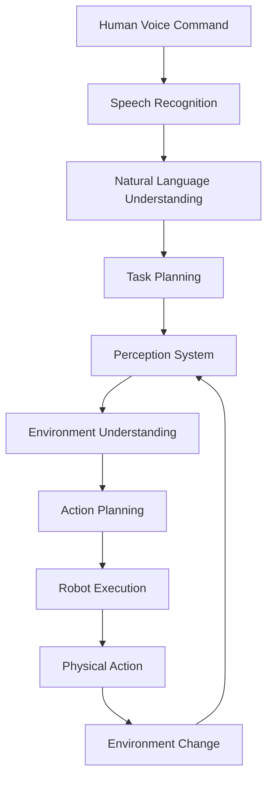

# Introduction to Vision-Language-Action (VLA)

## Learning Objectives

By the end of this chapter, you will be able to:
- Define the Vision-Language-Action (VLA) paradigm in robotics
- Explain how vision, language, and action systems converge in autonomous robots
- Understand the components of a complete VLA pipeline
- Identify the key challenges and opportunities in VLA robotics

## What is Vision-Language-Action (VLA)?

Vision-Language-Action (VLA) represents a paradigm shift in robotics, where computer vision, natural language processing, and robotic action are unified into a single, cohesive system. Unlike traditional robotics approaches that treat these components separately, VLA systems integrate perception, understanding, and action in a way that mimics how humans process and respond to their environment.

### The VLA Triad

The VLA framework consists of three interconnected components:

1. **Vision**: Computer vision systems that perceive and understand the environment
2. **Language**: Natural language processing that interprets human commands and generates responses
3. **Action**: Robotic control systems that execute physical tasks in the environment

### The Complete VLA Pipeline

The complete VLA pipeline transforms a human voice command into a physical robot action through several stages:

1. **Voice Input**: Speech recognition converts spoken commands to text
2. **Language Processing**: Natural language understanding interprets the command
3. **Cognitive Planning**: Task decomposition creates an action sequence
4. **Perception**: Environmental sensing provides context for action
5. **Navigation**: Path planning moves the robot to relevant locations
6. **Manipulation**: Physical actions execute the requested task
7. **Feedback**: Results are communicated back to the user

## Key Concepts in VLA Robotics

### Multimodal Integration

VLA systems must integrate information from multiple modalities simultaneously. This includes:

- **Visual information**: Images, point clouds, depth data
- **Language information**: Text commands, contextual descriptions
- **Action information**: Robot state, sensor readings, environmental feedback

### Real-Time Processing

VLA systems operate in real-time, requiring efficient processing of multiple data streams:

- Low-latency speech recognition
- Fast language understanding
- Real-time perception and planning
- Responsive robot control

### Safety and Validation

Given the autonomous nature of VLA systems, safety is paramount:

- Validation of LLM-generated plans
- Safety constraints on physical actions
- Human oversight and intervention capabilities

## Applications of VLA Robotics

VLA systems have broad applications across various domains:

### Domestic Robotics
- Home assistance and care
- Cleaning and maintenance tasks
- Personal companion robots

### Industrial Automation
- Flexible manufacturing systems
- Collaborative robots (cobots)
- Quality inspection and control

### Healthcare
- Surgical assistance
- Patient care and monitoring
- Rehabilitation support

### Service Industries
- Customer service robots
- Hospitality and retail assistance
- Educational applications

## Challenges in VLA Implementation

### Technical Challenges
- **Perception Accuracy**: Ensuring reliable object detection and scene understanding
- **Language Understanding**: Handling ambiguous or complex commands
- **Action Execution**: Translating high-level goals to precise robot actions
- **Real-Time Performance**: Meeting timing constraints for responsive behavior

### Safety and Reliability
- **Validation**: Ensuring LLM-generated plans are safe and correct
- **Fallback Mechanisms**: Handling failures gracefully
- **Human-Robot Interaction**: Managing user expectations and safety

### Scalability
- **Generalization**: Creating systems that work across different environments
- **Learning**: Enabling robots to improve with experience
- **Adaptation**: Handling novel situations and objects

## The VLA Architecture

A typical VLA system architecture includes several key components:

### 1. Input Processing Layer
- Speech recognition (Whisper, etc.)
- Natural language processing
- Sensor data preprocessing

### 2. Cognitive Layer
- Language understanding
- Task planning and decomposition
- Context awareness

### 3. Perception Layer
- Object detection and recognition
- Scene understanding
- State estimation

### 4. Control Layer
- Motion planning
- Path execution
- Manipulation control

### 5. Safety Layer
- Plan validation
- Constraint enforcement
- Emergency stopping

## Understanding This Module

This module will guide you through building a complete VLA system for humanoid robots. You'll learn to:

- Process voice commands using OpenAI's Whisper
- Create cognitive planning systems with LLMs
- Integrate perception, navigation, and manipulation
- Implement safety constraints for autonomous operation
- Build a complete voice-to-action pipeline

## Chapter Summary

Vision-Language-Action robotics represents the convergence of artificial intelligence and robotics, creating systems that can understand human commands and execute complex tasks in real-world environments. The VLA paradigm integrates computer vision, natural language processing, and robotic action into a unified system that enables more natural human-robot interaction.

In the following chapters, we'll explore each component of the VLA pipeline in detail, building toward a complete autonomous humanoid agent capable of understanding voice commands and executing complex tasks.

## Key Terms

- **VLA (Vision-Language-Action)**: The integration of vision, language, and action in robotics
- **Cognitive Planning**: The process of using reasoning to create action sequences
- **Multimodal Integration**: Combining information from multiple sensory modalities
- **Perception Pipeline**: The sequence of processing steps that convert sensor data to meaningful information

## Exercises

1. Research and describe three different applications where VLA robotics could be beneficial.
2. Identify potential safety concerns with LLM-controlled robots and propose mitigation strategies.
3. Design a simple VLA pipeline for a specific task (e.g., bringing a cup of coffee) and identify the key components needed.