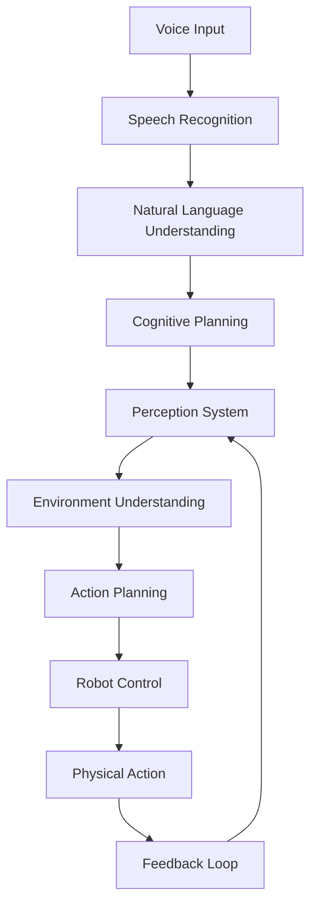

# Understanding the VLA Pipeline: Voice → Language → Reasoning → Action

## Learning Objectives

By the end of this chapter, you will be able to:
- Explain the complete VLA pipeline from voice input to robot action
- Understand the role of each component in the pipeline
- Identify the key challenges and solutions in each pipeline stage
- Design pipeline components for specific robotic tasks
- Evaluate the performance of each pipeline stage

## The Complete VLA Architecture

The Vision-Language-Action (VLA) pipeline represents a sophisticated integration of multiple AI and robotics components. Unlike traditional approaches that treat perception, language understanding, and action separately, the VLA pipeline creates a unified system that can process human voice commands and execute complex robotic behaviors.

### Pipeline Overview



The VLA pipeline operates in a continuous loop where each component feeds information to the next, with feedback mechanisms ensuring robust and adaptive behavior.

## Stage 1: Voice Input and Speech Recognition

The first stage of the VLA pipeline captures and processes human voice commands using advanced speech recognition technology.

### OpenAI Whisper Integration

The pipeline begins with OpenAI's Whisper model, which provides state-of-the-art speech recognition capabilities. Whisper is particularly effective because it:

- Handles multiple languages with high accuracy
- Works well in various acoustic environments
- Provides confidence scores for transcriptions
- Supports both short and long-form audio

### Voice Command Characteristics

Voice commands in the VLA system have specific characteristics:

- **Structured Format**: Commands follow patterns that the system can understand
- **Context Awareness**: Commands can reference previous interactions or environmental state
- **Robustness**: The system handles background noise and speaker variations
- **Real-time Processing**: Low-latency response for interactive applications

### Preprocessing Pipeline

Before speech recognition, voice commands undergo preprocessing:

1. **Noise Reduction**: Filtering out background noise
2. **Normalization**: Adjusting audio levels for consistent processing
3. **Silence Detection**: Identifying start and end of commands
4. **Quality Assessment**: Evaluating audio quality for reliable transcription

## Stage 2: Natural Language Understanding

The second stage interprets the transcribed text to extract meaning and intent.

### Language Processing Components

The natural language understanding stage includes:

- **Intent Recognition**: Determining the user's goal (navigate, grasp, perceive, etc.)
- **Entity Extraction**: Identifying specific objects, locations, or parameters
- **Context Resolution**: Understanding references to previous interactions or environmental elements
- **Command Validation**: Ensuring the command is appropriate and safe

### Semantic Parsing

The system uses semantic parsing to convert natural language into structured representations:

```
Input: "Go to the kitchen and pick up the red cup"
Output: {
  "sequence": [
    {
      "action": "navigate",
      "target": "kitchen",
      "parameters": {}
    },
    {
      "action": "grasp",
      "target": "cup",
      "parameters": {
        "color": "red",
        "confidence": 0.85
      }
    }
  ]
}
```

## Stage 3: Cognitive Planning

The third stage transforms high-level goals into executable action sequences.

### Task Decomposition

Cognitive planning involves breaking down complex commands into manageable steps:

- **Macro Tasks**: High-level goals like "clean the room"
- **Micro Tasks**: Specific actions like "pick up object," "move to location"
- **Temporal Sequencing**: Ordering actions in time
- **Resource Allocation**: Managing robot capabilities and constraints

### Planning Algorithms

The VLA system employs several planning approaches:

- **Hierarchical Task Networks (HTN)**: Breaking complex tasks into subtasks
- **Reactive Planning**: Responding to environmental changes during execution
- **Predictive Modeling**: Anticipating future states and planning accordingly
- **Multi-Agent Coordination**: Managing multiple robots if applicable

### Safety Integration

Planning includes safety constraints:

- **Physical Constraints**: Robot kinematic and dynamic limits
- **Environmental Constraints**: Obstacle avoidance and safe navigation
- **Task Constraints**: Ensuring actions are appropriate for the context
- **Human Safety**: Prioritizing human safety in all actions

## Stage 4: Perception System

The fourth stage provides environmental awareness through computer vision and sensor processing.

### Multi-Modal Perception

The perception system integrates multiple sensor modalities:

- **Visual Perception**: Camera feeds for object detection and scene understanding
- **Depth Perception**: 3D information from stereo cameras or LiDAR
- **Tactile Perception**: Feedback from grippers and contact sensors
- **Audio Perception**: Sound-based environmental awareness

### Object Detection and Recognition

Key perception capabilities include:

- **Instance Segmentation**: Identifying and locating specific objects
- **Pose Estimation**: Determining object position and orientation
- **Scene Understanding**: Comprehending spatial relationships
- **Dynamic Object Tracking**: Following moving objects in the environment

### Perception-Action Coupling

The system tightly couples perception with action:

- **Visual Servoing**: Using visual feedback to guide actions
- **Active Perception**: Controlling sensors to gather needed information
- **Uncertainty Handling**: Managing uncertainty in perception results
- **Sensor Fusion**: Combining multiple sensor inputs for robust perception

## Stage 5: Action Execution

The final stage executes the planned actions on the physical robot.

### Robot Control Architecture

Action execution involves:

- **Motion Planning**: Calculating joint trajectories for manipulation
- **Path Planning**: Determining navigation routes
- **Force Control**: Managing contact forces during manipulation
- **Real-time Control**: Executing actions with precise timing

### Feedback Integration

The system continuously monitors execution:

- **State Estimation**: Tracking robot state during action
- **Failure Detection**: Identifying when actions fail or need adjustment
- **Recovery Mechanisms**: Handling failures gracefully
- **Performance Monitoring**: Assessing action success

## Integration Challenges and Solutions

### Latency Management

The VLA pipeline must maintain low latency for interactive applications:

- **Parallel Processing**: Running pipeline stages in parallel where possible
- **Early Termination**: Stopping processing when confidence is high
- **Caching**: Storing results of expensive computations
- **Optimization**: Using efficient algorithms and data structures

### Error Propagation

Errors in early stages can compound throughout the pipeline:

- **Uncertainty Quantification**: Tracking confidence at each stage
- **Robust Algorithms**: Using algorithms that handle uncertainty well
- **Error Recovery**: Implementing mechanisms to recover from errors
- **Validation**: Checking results at each stage

### Resource Management

The pipeline must efficiently use computational resources:

- **Adaptive Processing**: Adjusting processing quality based on available resources
- **Prioritization**: Focusing resources on critical components
- **Distributed Computing**: Using multiple devices when available
- **Memory Management**: Efficiently storing and retrieving data

## Performance Evaluation

### Key Metrics

The VLA pipeline is evaluated using several metrics:

- **Accuracy**: How often the system correctly interprets commands and executes actions
- **Latency**: Time from voice input to action completion
- **Robustness**: Performance across different environments and conditions
- **Safety**: Frequency of safe vs. unsafe behaviors
- **User Satisfaction**: How well the system meets user expectations

### Evaluation Methodology

Evaluation involves:

- **Controlled Experiments**: Testing in controlled environments
- **Real-World Deployment**: Testing in actual use cases
- **Comparative Analysis**: Comparing to alternative approaches
- **Long-term Studies**: Assessing performance over extended periods

## Real-World Applications

### Domestic Robotics

VLA systems enable natural interaction with home robots:

- **Household Tasks**: Cleaning, organization, and maintenance
- **Assistive Care**: Helping elderly or disabled individuals
- **Entertainment**: Interactive play and companionship

### Industrial Automation

In industrial settings, VLA enables flexible automation:

- **Collaborative Robots**: Working alongside human workers
- **Flexible Manufacturing**: Adapting to changing production needs
- **Quality Control**: Inspecting and handling products

### Service Industries

Service robots benefit from VLA capabilities:

- **Customer Service**: Assisting customers in retail or hospitality
- **Healthcare**: Supporting medical staff and patients
- **Education**: Interactive learning companions

## Implementation Considerations

### System Architecture

The VLA system should be designed with:

- **Modularity**: Each pipeline stage as a separate, testable component
- **Scalability**: Ability to handle increasing complexity and user load
- **Maintainability**: Clear interfaces and documentation
- **Extensibility**: Easy addition of new capabilities

### Development Best Practices

When implementing VLA systems:

- **Iterative Development**: Build and test each component incrementally
- **Simulation-Reality Gap**: Bridge the gap between simulation and real-world performance
- **Continuous Integration**: Regular testing of the complete pipeline
- **User-Centered Design**: Focus on actual user needs and capabilities

## Chapter Summary

The VLA pipeline represents a sophisticated integration of multiple AI and robotics technologies. By understanding each stage and their interactions, you can design and implement effective voice-controlled robotic systems. The key to success lies in careful attention to integration challenges, performance evaluation, and user needs.

The pipeline's strength comes from its unified approach to perception, language understanding, and action, enabling more natural and effective human-robot interaction. As you continue through this module, you'll implement each component of this pipeline, building toward a complete autonomous humanoid agent.

## Key Terms

- **VLA Pipeline**: The complete system from voice input to robot action
- **Cognitive Planning**: The process of creating action sequences from high-level goals
- **Perception-Action Coupling**: Tight integration between perception and action systems
- **Semantic Parsing**: Converting natural language to structured representations
- **Multi-Modal Integration**: Combining information from multiple sensory modalities

## Exercises

1. Design a VLA pipeline for a specific application (e.g., restaurant service robot) and identify the key components needed.
2. Analyze the potential failure points in the VLA pipeline and propose mitigation strategies.
3. Compare the VLA approach to traditional robotics approaches and identify the key advantages and disadvantages.
4. Design a testing methodology for evaluating VLA pipeline performance in your chosen application.