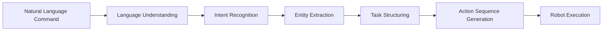

# Parsing Natural Language Commands into Structured Robot Tasks

## Learning Objectives

By the end of this chapter, you will be able to:
- Transform natural language commands into structured robot tasks
- Implement semantic parsing for robotics commands
- Create cognitive planning systems using LLMs
- Design task decomposition algorithms for complex commands
- Validate parsed commands for safety and feasibility

## Introduction to Natural Language to Robot Action Pipeline

The transformation of natural language into robot actions represents a critical component of Vision-Language-Action (VLA) systems. This process involves converting human commands into structured, executable instructions that a robot can understand and execute safely.

### The Transformation Pipeline



The pipeline consists of several stages:
1. **Language Understanding**: Comprehending the meaning of the command
2. **Intent Recognition**: Determining the user's goal
3. **Entity Extraction**: Identifying objects, locations, and parameters
4. **Task Structuring**: Organizing the task into executable steps
5. **Action Sequence Generation**: Creating specific robot commands
6. **Execution**: Running the commands on the robot

## Natural Language Understanding for Robotics

### Challenges in Robotics NLU

Natural Language Understanding (NLU) for robotics faces unique challenges:

- **Ambiguity**: Commands like "move the object" are ambiguous without context
- **Spatial Understanding**: Need to understand spatial relationships and locations
- **Deixis**: Understanding references like "this" or "there" in the robot's environment
- **Multi-modality**: Integrating language with visual and spatial information
- **Real-time Processing**: Handling commands in real-time for interactive applications

### Domain-Specific Language Patterns

Robotics commands typically follow specific patterns:

```
[Action] [Object] [Location] [Parameters]
```

Examples:
- "Pick up the red cup from the table" (Action: pick up, Object: red cup, Location: table)
- "Go to the kitchen and find the bottle" (Action: go to, Location: kitchen, Action: find, Object: bottle)
- "Navigate to the living room" (Action: navigate, Location: living room)

### Semantic Parsing Approaches

#### Rule-Based Parsing
Rule-based approaches use predefined grammatical rules to parse commands:

```python
# Example rule-based parser
def parse_command_rule_based(command):
    patterns = {
        r'go to (\w+)': {'action': 'navigate', 'target': r'\1'},
        r'move to (\w+)': {'action': 'navigate', 'target': r'\1'},
        r'pick up (\w+)': {'action': 'grasp', 'target': r'\1'},
        r'grasp (\w+)': {'action': 'grasp', 'target': r'\1'},
    }

    for pattern, action_template in patterns.items():
        match = re.match(pattern, command.lower())
        if match:
            return {
                'action': action_template['action'],
                'target': match.group(1),
                'confidence': 0.9
            }
    return None
```

#### Machine Learning Parsing
ML approaches use trained models to understand command structure:

```python
# Example ML-based parser (conceptual)
def parse_command_ml_based(command, model):
    # Use trained model to extract intent and entities
    parsed = model.predict(command)
    return {
        'action': parsed.intent,
        'entities': parsed.entities,
        'confidence': parsed.confidence
    }
```

#### LLM-Based Parsing
Large Language Models provide powerful semantic understanding:

```python
import openai

def parse_command_llm_based(command):
    prompt = f"""
    Parse the following robotics command into structured format:

    Command: "{command}"

    Return a JSON object with:
    - "action": The main action to perform
    - "target": The object or location involved
    - "parameters": Additional parameters
    - "dependencies": Any dependencies for the action

    Example:
    {{
        "action": "navigate",
        "target": "kitchen",
        "parameters": {{}},
        "dependencies": []
    }}
    """

    response = openai.ChatCompletion.create(
        model="gpt-4",
        messages=[{"role": "user", "content": prompt}],
        response_format={"type": "json_object"}
    )

    return json.loads(response.choices[0].message.content)
```

## Intent Recognition for Robot Commands

### Common Intent Categories

Robotics commands typically fall into several categories:

#### Navigation Intents
- **Move**: Moving to a specific location
- **Go to**: Navigating to a named location
- **Navigate**: Path planning to destination
- **Transport**: Moving from one location to another

#### Manipulation Intents
- **Grasp**: Picking up an object
- **Place**: Placing an object in a location
- **Move**: Moving an object from one place to another
- **Align**: Positioning objects relative to each other

#### Perception Intents
- **Find**: Locate a specific object
- **Detect**: Identify objects in the environment
- **Perceive**: Understand the current state of the environment
- **Inspect**: Examine objects or areas in detail

#### Control Intents
- **Stop**: Halt current actions
- **Pause**: Temporarily suspend operations
- **Continue**: Resume paused operations
- **Reset**: Return to initial state

### Intent Classification Techniques

#### Template Matching
Simple classification based on command patterns:

```python
def classify_intent_by_template(command):
    command_lower = command.lower()

    navigation_keywords = ['go to', 'move to', 'navigate', 'walk to', 'travel to']
    manipulation_keywords = ['pick up', 'grasp', 'take', 'place', 'put', 'grab']
    perception_keywords = ['find', 'detect', 'see', 'locate', 'look for']
    control_keywords = ['stop', 'pause', 'continue', 'reset']

    for keyword in navigation_keywords:
        if keyword in command_lower:
            return 'navigation'
    for keyword in manipulation_keywords:
        if keyword in command_lower:
            return 'manipulation'
    for keyword in perception_keywords:
        if keyword in command_lower:
            return 'perception'
    for keyword in control_keywords:
        if keyword in command_lower:
            return 'control'

    return 'unknown'
```

#### Semantic Similarity
Using embeddings to find semantic similarity:

```python
from sentence_transformers import SentenceTransformer
import numpy as np
from sklearn.metrics.pairwise import cosine_similarity

class IntentClassifier:
    def __init__(self):
        self.model = SentenceTransformer('all-MiniLM-L6-v2')

        # Define intent examples
        self.intent_examples = {
            'navigation': [
                'go to the kitchen',
                'move to the living room',
                'navigate to the bedroom',
                'walk to the office'
            ],
            'manipulation': [
                'pick up the cup',
                'grasp the bottle',
                'place the book',
                'move the object'
            ],
            'perception': [
                'find the keys',
                'detect the ball',
                'see the chair',
                'locate the phone'
            ]
        }

        # Pre-compute embeddings for examples
        self.intent_embeddings = {}
        for intent, examples in self.intent_examples.items():
            embeddings = self.model.encode(examples)
            self.intent_embeddings[intent] = embeddings

    def classify_intent(self, command, threshold=0.3):
        command_embedding = self.model.encode([command])

        best_intent = 'unknown'
        best_score = 0

        for intent, embeddings in self.intent_embeddings.items():
            similarities = cosine_similarity(command_embedding, embeddings)[0]
            max_similarity = np.max(similarities)

            if max_similarity > best_score and max_similarity > threshold:
                best_score = max_similarity
                best_intent = intent

        return best_intent, best_score
```

## Entity Extraction for Robotics Commands

### Types of Entities

Robotics commands typically contain several types of entities:

#### Object Entities
- **Physical Objects**: cups, bottles, books, chairs
- **Object Properties**: color, size, shape, material
- **Object Categories**: furniture, electronics, food items

#### Spatial Entities
- **Locations**: rooms, landmarks, coordinates
- **Spatial Relations**: left, right, front, behind, near, far
- **Containers**: boxes, shelves, drawers, cabinets

#### Action Parameters
- **Quantities**: number of items, amounts
- **Qualities**: precision, speed, force requirements
- **Temporal**: timing, duration, deadlines

### Entity Recognition Approaches

#### Named Entity Recognition (NER)
Using pre-trained NER models adapted for robotics:

```python
import spacy

# Load a spaCy model
nlp = spacy.load("en_core_web_sm")

def extract_entities_ner(command):
    doc = nlp(command)

    entities = {
        'objects': [],
        'locations': [],
        'quantities': [],
        'spatial_relations': []
    }

    # Define robotics-specific patterns
    object_patterns = ['cup', 'bottle', 'book', 'chair', 'table', 'phone', 'keys']
    location_patterns = ['kitchen', 'living room', 'bedroom', 'office', 'hallway']
    spatial_patterns = ['left', 'right', 'front', 'behind', 'near', 'far']

    for token in doc:
        if token.text.lower() in object_patterns:
            entities['objects'].append(token.text)
        elif token.text.lower() in location_patterns:
            entities['locations'].append(token.text)
        elif token.text.lower() in spatial_patterns:
            entities['spatial_relations'].append(token.text)
        elif token.pos_ == 'NUM':
            entities['quantities'].append(token.text)

    return entities
```

#### Custom Entity Recognition
Developing custom patterns for robotics-specific entities:

```python
import re

class RoboticsEntityExtractor:
    def __init__(self):
        # Object patterns
        self.object_patterns = [
            r'(?:red|blue|green|yellow|black|white|orange|purple|pink|brown)\s+\w+',
            r'(?:small|large|big|tiny|medium)\s+\w+',
            r'\w+\s+(?:cup|bottle|book|phone|keys|pen|glass|plate|box|ball|toy)'
        ]

        # Location patterns
        self.location_patterns = [
            r'(?:the\s+)?(kitchen|living room|bedroom|office|garage|hallway|bathroom|dining room|study|workshop)'
        ]

        # Spatial relation patterns
        self.spatial_patterns = [
            r'(?:to the\s+)?(left|right|front|behind|near|far|above|below|beside|between|next to|across from)'
        ]

    def extract_entities(self, command):
        entities = {
            'objects': [],
            'locations': [],
            'spatial_relations': [],
            'quantities': []
        }

        # Extract objects
        for pattern in self.object_patterns:
            matches = re.findall(pattern, command, re.IGNORECASE)
            entities['objects'].extend(matches)

        # Extract locations
        for pattern in self.location_patterns:
            matches = re.findall(pattern, command, re.IGNORECASE)
            entities['locations'].extend(matches)

        # Extract spatial relations
        for pattern in self.spatial_patterns:
            matches = re.findall(pattern, command, re.IGNORECASE)
            entities['spatial_relations'].extend(matches)

        # Extract quantities
        quantity_matches = re.findall(r'\d+', command)
        entities['quantities'].extend(quantity_matches)

        return entities
```

## Task Structuring and Decomposition

### Hierarchical Task Networks (HTN)

HTNs decompose high-level goals into primitive actions:

```python
class HTNPlanner:
    def __init__(self):
        self.methods = {
            'fetch_object': self.method_fetch_object,
            'navigate_to_location': self.method_navigate_to_location,
            'manipulate_object': self.method_manipulate_object
        }

    def method_fetch_object(self, target_obj, target_loc):
        """Decompose fetch object task into subtasks"""
        return [
            {'action': 'navigate', 'target': target_loc},
            {'action': 'find', 'target': target_obj},
            {'action': 'grasp', 'target': target_obj},
            {'action': 'return', 'target': 'origin'}
        ]

    def method_navigate_to_location(self, location):
        """Decompose navigation task"""
        return [
            {'action': 'plan_path', 'target': location},
            {'action': 'execute_path', 'target': location}
        ]

    def method_manipulate_object(self, action, obj, params):
        """Decompose manipulation task"""
        if action == 'place':
            return [
                {'action': 'approach', 'target': obj},
                {'action': 'release', 'target': obj},
                {'action': 'retract', 'target': ''}
            ]
        # Add other manipulation methods
        return [{'action': action, 'target': obj, 'params': params}]

    def decompose_task(self, task, method_name):
        """Decompose a task using the specified method"""
        if method_name in self.methods:
            return self.methods[method_name](**task.get('params', {}))
        return [task]  # Return original task if no method found
```

### Task Decomposition Algorithm

```python
class TaskDecomposer:
    def __init__(self):
        self.action_hierarchy = {
            'complex': ['fetch', 'assemble', 'disassemble'],
            'compound': ['navigate_and_pick', 'move_and_place'],
            'primitive': ['navigate', 'grasp', 'place', 'find', 'detect']
        }

    def decompose_command(self, parsed_command):
        """Decompose a parsed command into primitive actions"""
        action = parsed_command['action']
        target = parsed_command.get('target', '')
        params = parsed_command.get('params', {})

        if action in self.action_hierarchy['primitive']:
            # Already primitive, return as-is
            return [parsed_command]

        elif action in self.action_hierarchy['compound']:
            # Decompose compound actions
            if action == 'navigate_and_pick':
                return [
                    {'action': 'navigate', 'target': target},
                    {'action': 'grasp', 'target': params.get('object', '')}
                ]
            elif action == 'move_and_place':
                return [
                    {'action': 'grasp', 'target': target},
                    {'action': 'navigate', 'target': params.get('destination', '')},
                    {'action': 'place', 'target': target}
                ]

        elif action in self.action_hierarchy['complex']:
            # Complex actions require deeper decomposition
            if action == 'fetch':
                return self.decompose_fetch_task(target, params)

        # Default: return original command
        return [parsed_command]

    def decompose_fetch_task(self, target_obj, params):
        """Decompose fetch task into sequence of primitive actions"""
        location = params.get('location', 'unknown')

        return [
            {'action': 'navigate', 'target': location},
            {'action': 'find', 'target': target_obj},
            {'action': 'grasp', 'target': target_obj},
            {'action': 'navigate', 'target': params.get('return_location', 'origin')}
        ]
```

## Cognitive Planning with LLMs

### LLM-Based Task Planning

Large Language Models can serve as cognitive planners for complex tasks:

```python
import json
import openai

class LLMCognitivePlanner:
    def __init__(self, model="gpt-4"):
        self.model = model

    def plan_task_sequence(self, goal, current_state, available_actions):
        """Generate a sequence of actions to achieve the goal"""
        prompt = f"""
        You are a cognitive planning system for a humanoid robot. Given the goal, current state, and available actions, create a step-by-step plan to achieve the goal.

        Goal: "{goal}"

        Current State: {json.dumps(current_state)}

        Available Actions: {json.dumps(available_actions)}

        Return a JSON array of actions to execute in sequence. Each action should have:
        - "action": The action to perform
        - "target": The target of the action
        - "parameters": Any parameters needed
        - "reasoning": Brief explanation of why this action is needed

        Example response:
        [
            {{
                "action": "navigate",
                "target": "kitchen",
                "parameters": {{"speed": "normal"}},
                "reasoning": "Need to go to kitchen to find the cup"
            }},
            {{
                "action": "find",
                "target": "red cup",
                "parameters": {{"scan_range": "2m"}},
                "reasoning": "Looking for the red cup in the kitchen"
            }}
        ]
        """

        response = openai.ChatCompletion.create(
            model=self.model,
            messages=[{"role": "user", "content": prompt}],
            response_format={"type": "json_object"},
            temperature=0.1
        )

        plan = json.loads(response.choices[0].message.content)
        return plan

    def validate_plan(self, plan, constraints):
        """Validate the plan against safety and feasibility constraints"""
        validation_result = {
            'is_valid': True,
            'issues': [],
            'modified_plan': plan.copy()
        }

        for i, action in enumerate(plan):
            # Check action validity
            if action['action'] not in constraints['allowed_actions']:
                validation_result['is_valid'] = False
                validation_result['issues'].append(f"Action {action['action']} not allowed")

            # Check safety constraints
            if self._violates_safety(action, constraints):
                validation_result['is_valid'] = False
                validation_result['issues'].append(f"Safety violation in action {i+1}")

        return validation_result

    def _violates_safety(self, action, constraints):
        """Check if action violates safety constraints"""
        # Implement safety checks
        return False
```

### Multi-Step Task Planning

For complex tasks requiring multiple steps:

```python
class MultiStepPlanner:
    def __init__(self):
        self.llm_planner = LLMCognitivePlanner()

    def plan_complex_task(self, high_level_goal, environment_context):
        """Plan a complex task with multiple sub-goals"""

        # Break down high-level goal into sub-goals
        sub_goals = self._identify_sub_goals(high_level_goal, environment_context)

        # Plan each sub-goal
        overall_plan = []
        for sub_goal in sub_goals:
            sub_plan = self.llm_planner.plan_task_sequence(
                sub_goal,
                environment_context,
                self._get_available_actions()
            )

            # Validate sub-plan
            validation = self.llm_planner.validate_plan(sub_plan, environment_context.get('constraints', {}))

            if validation['is_valid']:
                overall_plan.extend(sub_plan)
            else:
                # Handle plan revision
                revised_plan = self._revise_plan(sub_plan, validation['issues'])
                overall_plan.extend(revised_plan)

        return overall_plan

    def _identify_sub_goals(self, high_level_goal, context):
        """Identify sub-goals needed to achieve the high-level goal"""
        # This could use LLM to break down complex goals
        # For now, using simple heuristics
        if 'fetch' in high_level_goal.lower() or 'get' in high_level_goal.lower():
            return [
                f"navigate to location of target object",
                f"locate the target object",
                f"grasp the target object",
                f"return to original location"
            ]
        elif 'clean' in high_level_goal.lower():
            return [
                f"identify dirty areas",
                f"navigate to first dirty area",
                f"perform cleaning action",
                f"move to next dirty area",
                f"repeat until all areas cleaned"
            ]

        return [high_level_goal]  # Default: treat as single goal

    def _get_available_actions(self):
        """Return list of available robot actions"""
        return [
            "navigate", "grasp", "place", "find", "detect",
            "inspect", "move", "align", "transport", "stop"
        ]

    def _revise_plan(self, plan, issues):
        """Revise plan based on identified issues"""
        # For now, return original plan
        # In practice, this would implement plan revision logic
        return plan
```

## Validation and Safety Checking

### Command Validation Pipeline

```python
class CommandValidator:
    def __init__(self):
        self.safety_checker = SafetyChecker()
        self.feasibility_checker = FeasibilityChecker()
        self.conflict_detector = ConflictDetector()

    def validate_parsed_command(self, parsed_command, robot_state, environment):
        """Validate a parsed command against multiple criteria"""
        validation_result = {
            'is_valid': True,
            'safety_issues': [],
            'feasibility_issues': [],
            'conflicts': [],
            'suggestions': []
        }

        # Check safety
        safety_result = self.safety_checker.check_command(parsed_command, environment)
        validation_result['safety_issues'] = safety_result['issues']

        # Check feasibility
        feasibility_result = self.feasibility_checker.check_feasibility(parsed_command, robot_state)
        validation_result['feasibility_issues'] = feasibility_result['issues']

        # Check for conflicts
        conflict_result = self.conflict_detector.check_conflicts(parsed_command, robot_state)
        validation_result['conflicts'] = conflict_result['conflicts']

        # Aggregate results
        validation_result['is_valid'] = (
            len(validation_result['safety_issues']) == 0 and
            len(validation_result['feasibility_issues']) == 0 and
            len(validation_result['conflicts']) == 0
        )

        # Generate suggestions for improvement
        if not validation_result['is_valid']:
            validation_result['suggestions'] = self._generate_suggestions(validation_result)

        return validation_result

    def _generate_suggestions(self, validation_result):
        """Generate suggestions to fix validation issues"""
        suggestions = []

        if validation_result['safety_issues']:
            suggestions.append("Consider adding safety constraints or modifying the command to avoid dangerous actions")

        if validation_result['feasibility_issues']:
            suggestions.append("Check if the robot has the necessary capabilities or if the environment allows the requested action")

        if validation_result['conflicts']:
            suggestions.append("Resolve conflicts with current robot state or other ongoing tasks")

        return suggestions


class SafetyChecker:
    """Check commands for safety violations"""

    def __init__(self):
        self.dangerous_actions = [
            'shutdown', 'reboot', 'reset', 'destroy', 'kill',
            'terminate', 'format', 'delete', 'jump', 'run_fast'
        ]
        self.restricted_areas = []  # Will be populated from environment

    def check_command(self, command, environment):
        """Check command for safety issues"""
        issues = []

        action = command.get('action', '').lower()
        target = command.get('target', '').lower()

        # Check for dangerous actions
        if action in self.dangerous_actions:
            issues.append(f"Dangerous action detected: {action}")

        # Check for restricted areas
        if target in self.restricted_areas:
            issues.append(f"Attempted to navigate to restricted area: {target}")

        # Check for physical safety
        if self._is_physically_unsafe(command, environment):
            issues.append("Command poses physical safety risk")

        return {'issues': issues}

    def _is_physically_unsafe(self, command, environment):
        """Check if command is physically unsafe"""
        # Implement physical safety checks
        return False


class FeasibilityChecker:
    """Check if commands are feasible given robot capabilities"""

    def __init__(self):
        self.robot_capabilities = {
            'max_payload': 5.0,  # kg
            'reach_distance': 1.5,  # meters
            'max_speed': 1.0,  # m/s
            'supported_objects': ['cup', 'bottle', 'book', 'phone', 'keys', 'pen']
        }

    def check_feasibility(self, command, robot_state):
        """Check if command is feasible given robot capabilities"""
        issues = []

        action = command.get('action', '').lower()
        target = command.get('target', '')

        # Check payload capacity for grasp actions
        if action == 'grasp' and not self._can_handle_object(target, robot_state):
            issues.append(f"Robot cannot handle object: {target}")

        # Check reach distance for navigation
        if action == 'navigate' and not self._within_reach(target, robot_state):
            issues.append(f"Target location too far: {target}")

        return {'issues': issues}

    def _can_handle_object(self, target_object, robot_state):
        """Check if robot can handle the specified object"""
        # Simplified check - in practice, would query object database
        return target_object.lower() in self.robot_capabilities['supported_objects']

    def _within_reach(self, target_location, robot_state):
        """Check if target location is within robot's reach"""
        # Simplified check - in practice, would calculate distance
        return True


class ConflictDetector:
    """Detect conflicts between commands and current robot state"""

    def check_conflicts(self, command, robot_state):
        """Check for conflicts with current robot state"""
        conflicts = []

        current_task = robot_state.get('current_task', None)
        action = command.get('action', '').lower()

        # Check for task conflicts
        if current_task and self._conflicts_with_current_task(action, current_task):
            conflicts.append(f"New action '{action}' conflicts with current task '{current_task}'")

        return {'conflicts': conflicts}

    def _conflicts_with_current_task(self, new_action, current_task):
        """Check if new action conflicts with current task"""
        # Example: cannot navigate while grasping
        if current_task == 'grasping' and new_action in ['navigate', 'move']:
            return True
        return False
```

## Implementation Example: Complete Parser

```python
class NaturalLanguageParser:
    """Complete natural language to robot command parser"""

    def __init__(self):
        self.intent_classifier = IntentClassifier()
        self.entity_extractor = RoboticsEntityExtractor()
        self.task_decomposer = TaskDecomposer()
        self.validator = CommandValidator()
        self.planner = MultiStepPlanner()

    def parse_command(self, natural_language, robot_state, environment):
        """Parse natural language command into structured robot actions"""

        # Step 1: Classify intent
        intent, confidence = self.intent_classifier.classify_intent(natural_language)

        # Step 2: Extract entities
        entities = self.entity_extractor.extract_entities(natural_language)

        # Step 3: Create initial structured command
        structured_command = {
            'raw_input': natural_language,
            'intent': intent,
            'entities': entities,
            'confidence': confidence,
            'action': self._map_intent_to_action(intent),
            'target': self._extract_target(entities),
            'parameters': self._extract_parameters(entities)
        }

        # Step 4: Decompose complex tasks
        primitive_actions = self.task_decomposer.decompose_command(structured_command)

        # Step 5: Validate all actions
        validation_results = []
        for action in primitive_actions:
            validation = self.validator.validate_parsed_command(action, robot_state, environment)
            validation_results.append(validation)

        # Step 6: Generate final plan
        final_plan = self._generate_final_plan(primitive_actions, validation_results)

        return {
            'original_command': natural_language,
            'structured_commands': primitive_actions,
            'validation_results': validation_results,
            'final_plan': final_plan,
            'overall_confidence': confidence
        }

    def _map_intent_to_action(self, intent):
        """Map intent to specific robot action"""
        intent_to_action = {
            'navigation': 'navigate',
            'manipulation': 'grasp',
            'perception': 'find',
            'control': 'stop'
        }
        return intent_to_action.get(intent, 'unknown')

    def _extract_target(self, entities):
        """Extract target from entities"""
        if entities['objects']:
            return entities['objects'][0]
        elif entities['locations']:
            return entities['locations'][0]
        return 'unknown'

    def _extract_parameters(self, entities):
        """Extract parameters from entities"""
        params = {}
        if entities['quantities']:
            params['quantity'] = entities['quantities'][0]
        if entities['spatial_relations']:
            params['spatial_relation'] = entities['spatial_relations'][0]
        return params

    def _generate_final_plan(self, actions, validation_results):
        """Generate final executable plan"""
        # Check if all validations passed
        all_valid = all(result['is_valid'] for result in validation_results)

        if all_valid:
            return {
                'status': 'ready',
                'actions': actions,
                'execution_order': list(range(len(actions))),
                'safety_verified': True
            }
        else:
            # Handle invalid actions
            valid_actions = []
            for action, validation in zip(actions, validation_results):
                if validation['is_valid']:
                    valid_actions.append(action)
                else:
                    # Log the issue and potentially modify the action
                    print(f"Action skipped due to validation issues: {validation['safety_issues']}")

            return {
                'status': 'partial',
                'actions': valid_actions,
                'execution_order': list(range(len(valid_actions))),
                'safety_verified': False,
                'issues': [v for v in validation_results if not v['is_valid']]
            }
```

## Chapter Summary

Parsing natural language commands into structured robot tasks is a complex but essential component of VLA systems. The process involves:

1. **Language Understanding**: Converting natural language to semantic representations
2. **Intent Recognition**: Identifying the user's goal
3. **Entity Extraction**: Recognizing objects, locations, and parameters
4. **Task Structuring**: Organizing tasks hierarchically
5. **Validation**: Ensuring safety and feasibility

Successful implementation requires combining multiple techniques including rule-based parsing, machine learning, and LLM-based reasoning. The system must handle ambiguity, ensure safety, and adapt to the robot's capabilities and environment.

## Key Terms

- **Natural Language Understanding (NLU)**: The ability to comprehend human language commands
- **Intent Recognition**: Identifying the purpose or goal of a command
- **Entity Extraction**: Identifying specific objects, locations, and parameters in commands
- **Hierarchical Task Network (HTN)**: A planning approach that decomposes high-level tasks into primitive actions
- **Semantic Parsing**: Converting natural language to structured representations
- **Cognitive Planning**: Using reasoning to create action sequences for goal achievement

## Exercises

1. Implement a simple natural language parser that can handle basic commands like "go to the kitchen" or "pick up the red cup".
2. Design a validation system that checks if robot commands are safe and feasible.
3. Create a task decomposition algorithm that breaks down complex commands into primitive actions.
4. Develop a method for handling ambiguous commands that require clarification.
5. Implement an LLM-based planner that can generate action sequences for complex multi-step tasks.