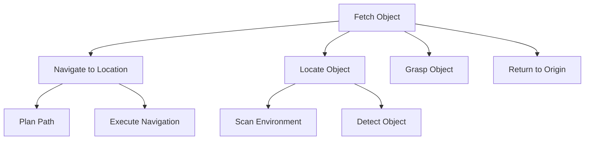
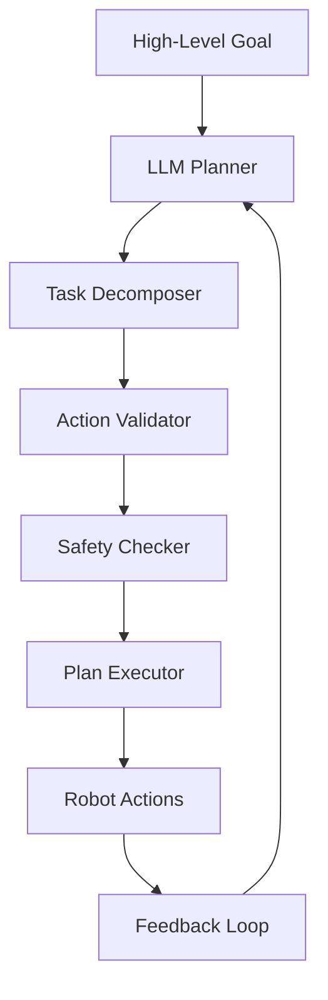

# LLM-Based Cognitive Planning

## Learning Objectives

By the end of this chapter, you will be able to:
- Understand how Large Language Models (LLMs) can be used for cognitive planning in robotics
- Implement task decomposition algorithms using LLMs
- Create multi-step action breakdown systems for complex robot tasks
- Design safety constraints for LLM-controlled robot planning
- Evaluate and validate LLM-generated action sequences

## Introduction to Cognitive Planning with LLMs

Cognitive planning represents a paradigm shift in robotics, where robots are equipped with reasoning capabilities that enable them to understand complex goals and break them down into executable steps. Traditional robotics approaches rely on predefined state machines or behavior trees, which work well for repetitive tasks but struggle with novel situations and complex, multi-step goals.

Large Language Models (LLMs) offer a promising solution to this challenge by providing natural language understanding and reasoning capabilities that can be leveraged for intelligent task planning.

### The Role of LLMs in Cognitive Planning

LLMs serve as cognitive planners by:

1. **Understanding Goals**: Interpreting high-level goals expressed in natural language
2. **Task Decomposition**: Breaking complex tasks into manageable sub-tasks
3. **Sequence Planning**: Ordering actions logically and considering dependencies
4. **Context Awareness**: Taking into account environmental and situational context
5. **Adaptability**: Adjusting plans based on feedback and changing conditions

### Benefits of LLM-Based Planning

- **Natural Interaction**: Users can express goals in natural language
- **Flexibility**: Plans can adapt to novel situations without reprogramming
- **Abstraction**: High-level goals can be achieved without specifying low-level details
- **Reasoning**: Logical inference can be applied to solve complex problems
- **Learning**: Plans can incorporate knowledge from diverse sources

## LLM Architecture for Planning

### Planning-Specific Prompt Engineering

Effective cognitive planning with LLMs requires careful prompt engineering to guide the model toward generating useful action sequences:

```python
def create_planning_prompt(goal, context, available_actions):
    prompt = f"""
    You are a cognitive planning system for a humanoid robot. Your task is to decompose complex goals into executable robot actions.

    GOAL: {goal}

    CONTEXT: {context}

    AVAILABLE ACTIONS: {available_actions}

    Please decompose this goal into a sequence of specific, executable actions. Each action should be:
    1. Specific and actionable
    2. Ordered logically
    3. Include necessary parameters
    4. Consider dependencies between actions
    5. Account for safety constraints

    Return your response as a JSON array of actions in the following format:
    [
        {{
            "step": 1,
            "action": "action_name",
            "target": "target_object_or_location",
            "parameters": {{"param1": "value1", "param2": "value2"}},
            "description": "Detailed description of what the robot should do",
            "dependencies": ["previous_step_id_if_any"],
            "estimated_duration": 5.0,
            "confidence": 0.8
        }}
    ]
    """
    return prompt
```

### Chain-of-Thought Reasoning

LLMs can be prompted to use chain-of-thought reasoning for more reliable planning:

```python
def create_chain_of_thought_prompt(goal, context):
    prompt = f"""
    You are a cognitive planning system for a humanoid robot. Use chain-of-thought reasoning to decompose the following goal.

    GOAL: {goal}

    CONTEXT: {context}

    Let's think step by step:
    1. What is the main objective?
    2. What sub-goals need to be achieved?
    3. What actions are needed for each sub-goal?
    4. What is the logical sequence of these actions?
    5. Are there any dependencies or constraints?

    Now provide the final action sequence as JSON:
    [your_json_response_here]
    """
    return prompt
```

## Task Decomposition Algorithms

### Hierarchical Task Networks (HTN)

HTN planning decomposes high-level tasks into primitive actions through a hierarchy of methods:



### LLM-Enhanced Decomposition

LLMs can enhance traditional HTN approaches by providing more flexible and context-aware decomposition:

```python
class LLMTaskDecomposer:
    def __init__(self, llm_client):
        self.llm_client = llm_client

    def decompose_task(self, goal, context, robot_capabilities):
        """Decompose a complex task using LLM guidance"""

        # Create a structured prompt for task decomposition
        prompt = self._create_decomposition_prompt(goal, context, robot_capabilities)

        response = self.llm_client.generate(prompt)
        parsed_response = self._parse_llm_response(response)

        # Validate the decomposition
        validated_plan = self._validate_plan(parsed_response, robot_capabilities)

        return validated_plan

    def _create_decomposition_prompt(self, goal, context, capabilities):
        """Create a detailed prompt for LLM-based task decomposition"""
        return f"""
        Decompose the following robotics task into executable steps:

        GOAL: "{goal}"

        ROBOT CAPABILITIES: {capabilities}

        ENVIRONMENT CONTEXT: {context}

        DECOMPOSITION REQUIREMENTS:
        1. Each step must be executable by the robot
        2. Consider physical constraints and safety
        3. Order steps logically with proper dependencies
        4. Include error handling where appropriate
        5. Estimate duration and confidence for each step

        Return a detailed plan as JSON with the following structure:
        {{
            "task_id": "unique_identifier",
            "original_goal": "{goal}",
            "steps": [
                {{
                    "step_id": "step_1",
                    "action": "action_name",
                    "target": "target_object_or_location",
                    "parameters": {{"param1": "value1"}},
                    "description": "what the robot should do",
                    "dependencies": ["previous_step_id"],
                    "estimated_duration": 5.0,
                    "confidence": 0.8,
                    "safety_checks": ["list_of_safety_checks_to_perform"]
                }}
            ],
            "estimated_total_duration": 30.0,
            "overall_confidence": 0.85
        }}
        """
```

### Multi-Step Action Breakdown

For complex tasks, the breakdown process involves multiple levels of abstraction:

```python
class MultiStepBreakdown:
    def __init__(self):
        self.abstraction_levels = {
            'high': ['fetch', 'assemble', 'disassemble', 'clean'],
            'medium': ['navigate_to', 'grasp_object', 'place_object', 'inspect_area'],
            'low': ['move_joints', 'activate_gripper', 'plan_path', 'execute_trajectory']
        }

    def breakdown_task(self, high_level_goal, context):
        """Break down task through multiple abstraction levels"""

        # Level 1: High-level decomposition
        medium_level_tasks = self._decompose_high_to_medium(high_level_goal)

        # Level 2: Medium to low-level decomposition
        low_level_actions = []
        for task in medium_level_tasks:
            actions = self._decompose_medium_to_low(task, context)
            low_level_actions.extend(actions)

        return self._optimize_action_sequence(low_level_actions)

    def _decompose_high_to_medium(self, goal, context):
        """Decompose high-level goals into medium-level tasks"""
        # This would use LLM or rule-based approaches
        pass

    def _decompose_medium_to_low(self, task, context):
        """Decompose medium-level tasks into low-level actions"""
        # This would generate specific robot commands
        pass

    def _optimize_action_sequence(self, actions):
        """Optimize the sequence for efficiency and safety"""
        # This would reorder, combine, or parallelize actions
        pass
```

## Implementation of LLM-Based Planning Systems

### Planning System Architecture

The cognitive planning system architecture includes several key components:



### Core Planning Components

```python
import openai
import json
from typing import List, Dict, Any, Optional
from dataclasses import dataclass

@dataclass
class PlanStep:
    """Represents a single step in a robot plan"""
    action: str
    target: str
    parameters: Dict[str, Any]
    description: str
    dependencies: List[str]
    estimated_duration: float
    confidence: float
    safety_checks: List[str]

@dataclass
class TaskPlan:
    """Represents a complete task plan"""
    task_id: str
    original_goal: str
    steps: List[PlanStep]
    estimated_total_duration: float
    overall_confidence: float
    metadata: Dict[str, Any]

class LLMCognitivePlanner:
    """Main cognitive planning system using LLMs"""

    def __init__(self, model_name: str = "gpt-4"):
        self.model_name = model_name

    def create_plan(self, goal: str, context: Dict[str, Any],
                   robot_capabilities: List[str]) -> Optional[TaskPlan]:
        """Create a task plan for the given goal"""

        prompt = self._create_planning_prompt(goal, context, robot_capabilities)

        try:
            response = openai.ChatCompletion.create(
                model=self.model_name,
                messages=[{"role": "user", "content": prompt}],
                response_format={"type": "json_object"},
                temperature=0.1
            )

            plan_data = json.loads(response.choices[0].message.content)
            return self._parse_plan(plan_data)

        except Exception as e:
            print(f"Planning failed: {e}")
            return None

    def _create_planning_prompt(self, goal: str, context: Dict[str, Any],
                               capabilities: List[str]) -> str:
        """Create a detailed prompt for the LLM planner"""
        return f"""
        You are an expert cognitive planning system for humanoid robots. Create a detailed action plan for the following goal:

        GOAL: "{goal}"

        ROBOT CAPABILITIES: {capabilities}

        CONTEXT: {json.dumps(context, indent=2)}

        INSTRUCTIONS:
        1. Decompose the goal into specific, executable steps
        2. Ensure each step is within the robot's capabilities
        3. Consider the environment context in your planning
        4. Include safety checks for each relevant step
        5. Estimate realistic durations for each action
        6. Consider dependencies between steps
        7. Aim for high confidence in each step

        OUTPUT FORMAT:
        {{
            "task_id": "generated_unique_id",
            "original_goal": "{goal}",
            "steps": [
                {{
                    "action": "specific_action_name",
                    "target": "target_object_or_location",
                    "parameters": {{"param1": "value1"}},
                    "description": "detailed_description",
                    "dependencies": ["step_ids_if_any"],
                    "estimated_duration": 5.0,
                    "confidence": 0.8,
                    "safety_checks": ["check1", "check2"]
                }}
            ],
            "estimated_total_duration": 30.0,
            "overall_confidence": 0.85
        }}

        Be specific and practical. Each action should be something the robot can actually execute.
        """

    def _parse_plan(self, plan_data: Dict[str, Any]) -> TaskPlan:
        """Parse LLM response into structured TaskPlan"""
        steps = [
            PlanStep(
                action=step['action'],
                target=step['target'],
                parameters=step.get('parameters', {}),
                description=step['description'],
                dependencies=step.get('dependencies', []),
                estimated_duration=step['estimated_duration'],
                confidence=step['confidence'],
                safety_checks=step.get('safety_checks', [])
            )
            for step in plan_data['steps']
        ]

        return TaskPlan(
            task_id=plan_data['task_id'],
            original_goal=plan_data['original_goal'],
            steps=steps,
            estimated_total_duration=plan_data['estimated_total_duration'],
            overall_confidence=plan_data['overall_confidence'],
            metadata={'source': 'llm_planner', 'timestamp': time.time()}
        )
```

## Safety Constraints and Validation

### Safety-First Planning

LLM-generated plans must be validated against safety constraints:

```python
class SafetyConstraintChecker:
    """Checks LLM-generated plans for safety violations"""

    def __init__(self):
        self.safety_rules = [
            self._check_physical_safety,
            self._check_operational_safety,
            self._check_environmental_safety
        ]

    def validate_plan(self, plan: TaskPlan, environment_context: Dict[str, Any]) -> Dict[str, Any]:
        """Validate a plan against safety constraints"""
        issues = []
        warnings = []

        for rule in self.safety_rules:
            result = rule(plan, environment_context)
            issues.extend(result['issues'])
            warnings.extend(result['warnings'])

        return {
            'is_safe': len(issues) == 0,
            'issues': issues,
            'warnings': warnings,
            'confidence_adjustment': -0.1 * len(issues)  # Reduce confidence for safety issues
        }

    def _check_physical_safety(self, plan: TaskPlan, context: Dict[str, Any]) -> Dict[str, List[str]]:
        """Check for physical safety violations"""
        issues = []
        warnings = []

        for step in plan.steps:
            action = step.action.lower()

            # Check for dangerous actions
            if any(danger in action for danger in ['destroy', 'damage', 'break', 'crash']):
                issues.append(f"Dangerous action detected: {action}")

            # Check for physically impossible actions
            if 'jump' in action and context.get('robot_height_limit', 1.0) < 0.5:
                issues.append(f"Jump action not safe given robot height constraints")

        return {'issues': issues, 'warnings': warnings}

    def _check_operational_safety(self, plan: TaskPlan, context: Dict[str, Any]) -> Dict[str, List[str]]:
        """Check for operational safety violations"""
        issues = []
        warnings = []

        # Check for excessive navigation
        nav_steps = [step for step in plan.steps if 'navigate' in step.action.lower()]
        if len(nav_steps) > 10:
            warnings.append(f"Excessive navigation steps ({len(nav_steps)}), consider optimization")

        return {'issues': issues, 'warnings': warnings}
```

### Plan Validation Pipeline

```python
class PlanValidationPipeline:
    """Complete pipeline for validating LLM-generated plans"""

    def __init__(self):
        self.safety_checker = SafetyConstraintChecker()
        self.feasibility_checker = FeasibilityChecker()
        self.conflict_detector = ConflictDetector()

    def validate_plan(self, plan: TaskPlan, context: Dict[str, Any]) -> Dict[str, Any]:
        """Validate plan through complete pipeline"""
        results = {
            'safety': self.safety_checker.validate_plan(plan, context),
            'feasibility': self.feasibility_checker.check_plan_feasibility(plan, context),
            'conflicts': self.conflict_detector.check_plan_conflicts(plan, context)
        }

        # Aggregate results
        all_issues = []
        all_warnings = []

        for check_name, result in results.items():
            all_issues.extend([f"[{check_name}] {issue}" for issue in result.get('issues', [])])
            all_warnings.extend([f"[{check_name}] {warning}" for warning in result.get('warnings', [])])

        overall_safe = all(result.get('is_safe', True) for result in results.values())

        return {
            'is_valid': overall_safe and len(all_issues) == 0,
            'all_issues': all_issues,
            'all_warnings': all_warnings,
            'individual_results': results
        }
```

## Multi-Step Action Breakdown

### Sequential Task Processing

For complex multi-step tasks, the system processes each step sequentially while maintaining context:

```python
class SequentialTaskProcessor:
    """Processes multi-step tasks sequentially with context maintenance"""

    def __init__(self, planner: LLMCognitivePlanner):
        self.planner = planner
        self.execution_context = {}

    def execute_task_sequence(self, high_level_goal: str, environment_context: Dict[str, Any]):
        """Execute a sequence of tasks derived from a high-level goal"""

        # First, create the overall plan
        plan = self.planner.create_plan(high_level_goal, environment_context, [])

        if not plan:
            raise Exception("Could not create plan for the given goal")

        # Execute each step in sequence
        for i, step in enumerate(plan.steps):
            print(f"Executing step {i+1}/{len(plan.steps)}: {step.description}")

            # Update execution context
            self.execution_context[f'step_{i}_completed'] = True
            self.execution_context[f'step_{i}_result'] = self._execute_single_step(step)

            # Check for completion conditions
            if self._should_terminate_early():
                break

        return self.execution_context

    def _execute_single_step(self, step: PlanStep):
        """Execute a single step and return result"""
        # This would interface with the actual robot
        # For simulation purposes, we'll return a mock result
        return {
            'status': 'success',
            'duration': step.estimated_duration,
            'confidence': step.confidence,
            'observations': {}
        }

    def _should_terminate_early(self) -> bool:
        """Check if execution should terminate early"""
        # This would check for various termination conditions
        return False
```

### Parallel Action Possibilities

While maintaining safety, some actions can be executed in parallel:

```python
class ParallelActionScheduler:
    """Schedules actions that can be executed in parallel"""

    def schedule_parallel_actions(self, plan: TaskPlan) -> List[List[PlanStep]]:
        """Group steps that can be executed in parallel"""

        # Group steps by dependencies
        execution_groups = []
        remaining_steps = plan.steps[:]

        while remaining_steps:
            # Find steps that have no remaining dependencies
            ready_steps = []
            for step in remaining_steps:
                deps_satisfied = all(
                    any(s.step_id == dep for s in group)
                    for group in execution_groups
                    for dep in step.dependencies
                )

                if deps_satisfied:
                    # Check if this step can be executed in parallel with others
                    if self._can_execute_in_parallel(step, ready_steps):
                        ready_steps.append(step)

            if not ready_steps:
                # If no steps are ready, there might be a circular dependency
                print("Warning: Possible circular dependency detected")
                break

            execution_groups.append(ready_steps)
            remaining_steps = [s for s in remaining_steps if s not in ready_steps]

        return execution_groups

    def _can_execute_in_parallel(self, step1: PlanStep, other_steps: List[PlanStep]) -> bool:
        """Check if a step can be executed in parallel with others"""
        # Check for resource conflicts
        # For example, if multiple steps require the manipulator
        manipulator_actions = ['grasp', 'place', 'manipulate']

        step1_uses_manipulator = any(action in step1.action.lower() for action in manipulator_actions)
        others_use_manipulator = any(
            any(action in step.action.lower() for action in manipulator_actions)
            for step in other_steps
        )

        # Can't use manipulator in parallel
        if step1_uses_manipulator and others_use_manipulator:
            return False

        # Add other parallel execution constraints here

        return True
```

## Performance Optimization

### Plan Caching

To improve efficiency, the system can cache previously computed plans:

```python
import hashlib
from functools import lru_cache

class PlanCache:
    """Caches LLM-generated plans for efficiency"""

    def __init__(self, max_size: int = 128):
        self.max_size = max_size
        self.cache = {}
        self.access_times = {}

    def get_cached_plan(self, goal: str, context: Dict[str, Any]) -> Optional[TaskPlan]:
        """Retrieve a cached plan if available"""
        cache_key = self._create_cache_key(goal, context)

        if cache_key in self.cache:
            self.access_times[cache_key] = time.time()
            return self.cache[cache_key]

        return None

    def cache_plan(self, goal: str, context: Dict[str, Any], plan: TaskPlan):
        """Cache a plan for future use"""
        cache_key = self._create_cache_key(goal, context)

        # Evict oldest entry if cache is full
        if len(self.cache) >= self.max_size:
            oldest_key = min(self.access_times.keys(), key=lambda k: self.access_times[k])
            del self.cache[oldest_key]
            del self.access_times[oldest_key]

        self.cache[cache_key] = plan
        self.access_times[cache_key] = time.time()

    def _create_cache_key(self, goal: str, context: Dict[str, Any]) -> str:
        """Create a unique cache key for the goal and context"""
        combined = goal + json.dumps(context, sort_keys=True)
        return hashlib.md5(combined.encode()).hexdigest()
```

### Adaptive Planning

The system adapts its planning approach based on task complexity and context:

```python
class AdaptivePlanner:
    """Adapts planning approach based on task characteristics"""

    def __init__(self):
        self.simple_planner = SimplePlanner()
        self.complex_planner = LLMCognitivePlanner()
        self.hybrid_planner = HybridPlanner()

    def select_planner(self, goal: str, context: Dict[str, Any]):
        """Select the most appropriate planner for the task"""

        complexity_score = self._assess_complexity(goal, context)

        if complexity_score < 0.3:
            # Simple task - use rule-based planning
            return self.simple_planner
        elif complexity_score < 0.7:
            # Moderate complexity - use hybrid approach
            return self.hybrid_planner
        else:
            # Complex task - use full LLM planning
            return self.complex_planner

    def _assess_complexity(self, goal: str, context: Dict[str, Any]) -> float:
        """Assess the complexity of a task"""
        # Factors that increase complexity:
        # - Number of different action types required
        # - Number of objects involved
        # - Environmental complexity
        # - Time constraints

        complexity_factors = {
            'action_diversity': self._count_action_types(goal),
            'object_count': self._count_objects(goal),
            'constraint_count': len(context.get('constraints', [])),
            'temporal_requirements': 1 if 'deadline' in context else 0
        }

        # Normalize and combine factors
        total_complexity = sum(complexity_factors.values()) / 10.0  # Assuming max possible is 10
        return min(1.0, total_complexity)  # Clamp between 0 and 1
```

## Chapter Summary

LLM-based cognitive planning represents a significant advancement in robotics, enabling robots to understand complex goals and decompose them into executable actions. Key concepts include:

1. **Prompt Engineering**: Crafting effective prompts to guide LLMs toward generating useful plans
2. **Task Decomposition**: Breaking complex tasks into manageable, executable steps
3. **Safety Validation**: Ensuring LLM-generated plans are safe and feasible
4. **Adaptive Planning**: Selecting appropriate planning strategies based on task complexity
5. **Performance Optimization**: Caching and parallel execution for efficiency

The integration of LLMs into cognitive planning systems enables more flexible, natural interaction with robots while maintaining safety and reliability through proper validation and constraint checking.

## Key Terms

- **Cognitive Planning**: The process of reasoning about and creating action sequences to achieve goals
- **Task Decomposition**: Breaking complex tasks into simpler, executable sub-tasks
- **Chain-of-Thought Reasoning**: A reasoning approach where the model explains its thinking step by step
- **Hierarchical Task Network (HTN)**: A planning approach that decomposes high-level tasks into primitive actions
- **Safety Constraints**: Rules and checks that ensure robot actions are safe
- **Plan Validation**: The process of checking that a plan is feasible and safe before execution

## Exercises

1. Implement a simple LLM-based planner that can decompose basic household tasks into robot actions.
2. Design a safety validation system for LLM-generated plans that checks for physical constraints.
3. Create a task complexity assessment algorithm that determines the appropriate planning approach.
4. Implement a plan caching system to improve efficiency for repeated tasks.
5. Develop a feedback mechanism that allows the system to learn from plan execution results.