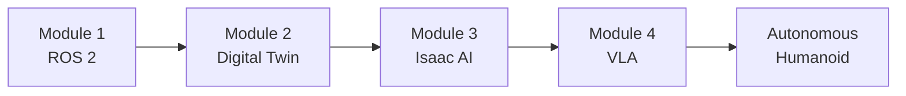
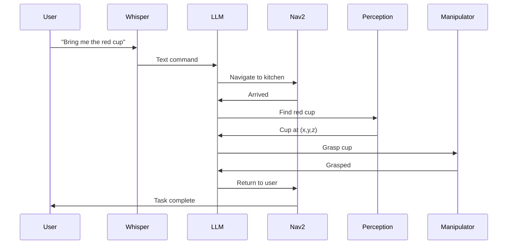

# Physical AI & Humanoid Robotics

Welcome to the definitive guide for building intelligent humanoid robots. This book takes you from foundational ROS 2 concepts through advanced Vision-Language-Action (VLA) systems, enabling you to create robots that can understand voice commands and autonomously execute complex tasks.

## What You'll Learn



### Module 1: The Robotic Nervous System (ROS 2)
Master the middleware that connects all robot components. Learn nodes, topics, services, URDF, and Python-based robot control.

### Module 2: The Digital Twin (Gazebo & Unity)
Build virtual replicas of physical robots. Create physics-accurate simulations and photorealistic environments for testing.

### Module 3: The AI-Robot Brain (NVIDIA Isaac)
Implement GPU-accelerated perception with Isaac Sim, VSLAM, and Nav2 for intelligent navigation.

### Module 4: Vision-Language-Action (VLA)
Create autonomous robots that respond to voice commands using LLMs, perceive their environment, and execute manipulation tasks.

## Prerequisites

Before starting this book, you should have:

- **Python proficiency**: Functions, classes, async programming
- **Linux basics**: Command line, file system navigation
- **Hardware**: Ubuntu 22.04 (native or WSL2), NVIDIA GPU (Module 3+)

:::tip No Prior Robotics Experience Required
This book starts from fundamentals and progressively builds complexity. Each chapter includes all necessary background.
:::

## Learning Path

| Module | Duration | Key Skills |
|--------|----------|------------|
| Module 1 | 2-3 weeks | ROS 2, URDF, Python control |
| Module 2 | 2-3 weeks | Gazebo, Unity, sensor simulation |
| Module 3 | 3-4 weeks | Isaac Sim, VSLAM, Nav2 |
| Module 4 | 3-4 weeks | Whisper, LLM planning, manipulation |

## Environment Setup

### Quick Start with ROS 2 Humble

```bash
# Install ROS 2 Humble on Ubuntu 22.04
sudo apt update && sudo apt install -y software-properties-common
sudo add-apt-repository universe
sudo apt update && sudo apt install curl -y
sudo curl -sSL https://raw.githubusercontent.com/ros/rosdistro/master/ros.key -o /usr/share/keyrings/ros-archive-keyring.gpg
echo "deb [arch=$(dpkg --print-architecture) signed-by=/usr/share/keyrings/ros-archive-keyring.gpg] http://packages.ros.org/ros2/ubuntu $(. /etc/os-release && echo $UBUNTU_CODENAME) main" | sudo tee /etc/apt/sources.list.d/ros2.list > /dev/null
sudo apt update && sudo apt install -y ros-humble-desktop

# Source ROS 2
echo "source /opt/ros/humble/setup.bash" >> ~/.bashrc
source ~/.bashrc
```

### Verify Installation

```bash
ros2 --version
# Expected: ros2 0.9.x (humble)
```

## Book Conventions

Throughout this book, you'll encounter:

:::note Learning Objectives
Each chapter starts with clear learning objectives so you know what skills you'll gain.
:::

:::tip Pro Tips
Experienced roboticists share practical insights and best practices.
:::

:::warning Common Pitfalls
Avoid common mistakes that can cause hours of debugging.
:::

:::danger Safety First
Critical safety information for working with robots.
:::

### Code Examples

All code is production-ready and follows PEP 8 style guidelines:

```python title="example_node.py"
#!/usr/bin/env python3
"""Example ROS 2 node demonstrating the conventions used in this book."""

import rclpy
from rclpy.node import Node

class ExampleNode(Node):
    """A minimal ROS 2 node template."""

    def __init__(self):
        super().__init__('example_node')
        self.get_logger().info('Node initialized')

def main(args=None):
    rclpy.init(args=args)
    node = ExampleNode()
    rclpy.spin(node)
    node.destroy_node()
    rclpy.shutdown()

if __name__ == '__main__':
    main()
```

## The Capstone Project

By the end of this book, you'll build an autonomous humanoid that can:

1. **Listen** - Process voice commands using Whisper
2. **Understand** - Parse natural language into structured tasks
3. **Plan** - Use LLMs to generate action sequences
4. **Navigate** - Move through environments avoiding obstacles
5. **Perceive** - Detect and locate target objects
6. **Manipulate** - Grasp and move objects to complete tasks



## Get Started

Ready to build intelligent robots? Let's begin with [Module 1: What is ROS 2?](/docs/module-1-ros2/what-is-ros2)

---

**Questions or Feedback?**

Use the AI assistant in the bottom-right corner to ask questions about any topic in this book. The assistant is trained on all book content and can help clarify concepts, explain code, and guide your learning.
