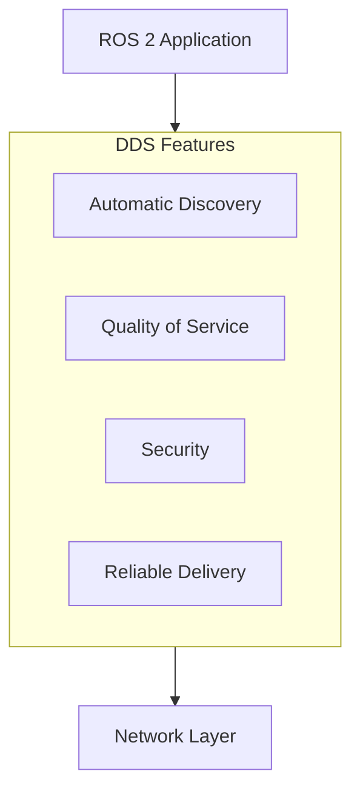
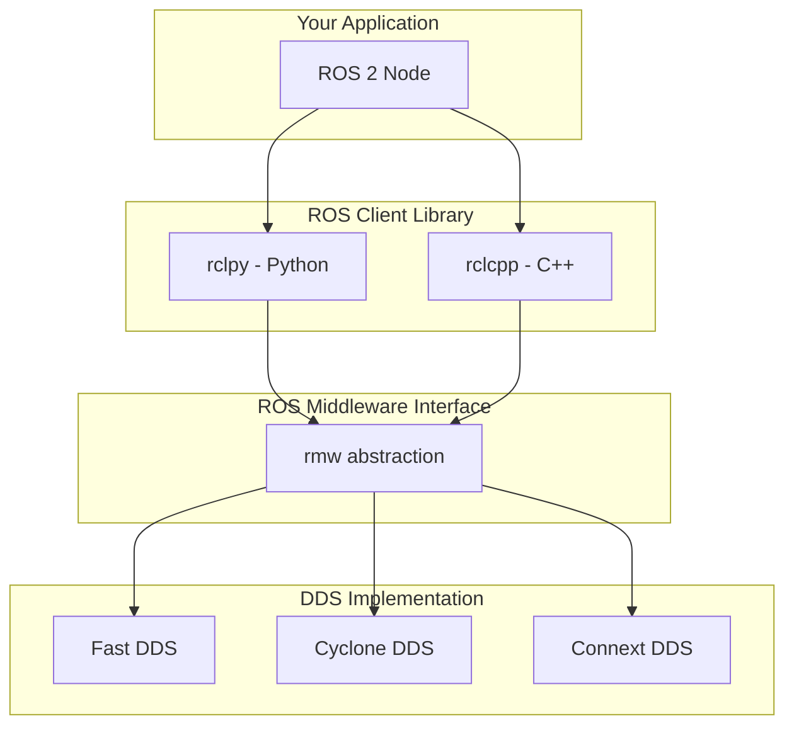
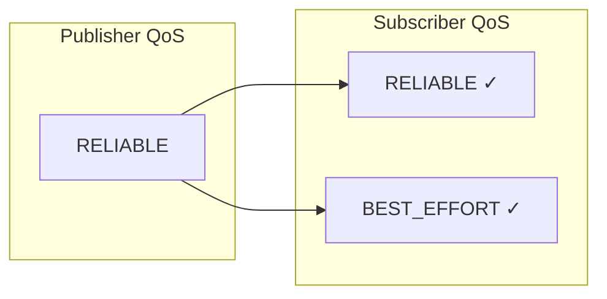
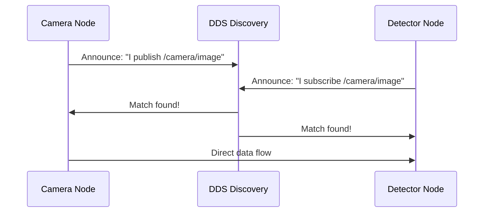
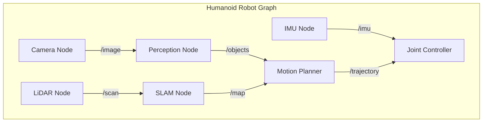

# Chapter 2: ROS 2 Architecture & DDS Overview

:::note Learning Objectives
By the end of this chapter, you will be able to:
- Explain how DDS provides the communication layer for ROS 2
- Configure Quality of Service (QoS) profiles for different use cases
- Understand the discovery mechanism that connects nodes automatically
- Describe the ROS 2 computation graph architecture
:::

## The Foundation: Data Distribution Service (DDS)

ROS 2's secret weapon is **DDS (Data Distribution Service)**—an industry-standard middleware protocol used in aerospace, defense, and financial systems. DDS provides:



### Why DDS?

| Feature | Benefit for Robotics |
|---------|---------------------|
| **Decentralized** | No single point of failure |
| **Auto-discovery** | Nodes find each other automatically |
| **QoS policies** | Fine-grained control over delivery |
| **Real-time** | Predictable latency guarantees |
| **Interoperability** | Multiple DDS vendors supported |

## ROS 2 Architecture Layers



### The RMW Layer

The **ROS Middleware (RMW)** interface abstracts DDS implementations:

```bash
# Check your current DDS implementation
echo $RMW_IMPLEMENTATION
# Default: rmw_fastrtps_cpp

# Switch to Cyclone DDS
export RMW_IMPLEMENTATION=rmw_cyclonedds_cpp
```

## Quality of Service (QoS) Profiles

QoS policies control **how** messages are delivered. This is critical for robots where some data (e.g., emergency stops) must be reliable while other data (e.g., camera frames) can tolerate loss.

### Key QoS Policies

```python
from rclpy.qos import QoSProfile, ReliabilityPolicy, DurabilityPolicy, HistoryPolicy

# Reliable delivery - guaranteed delivery, may retry
reliable_qos = QoSProfile(
    reliability=ReliabilityPolicy.RELIABLE,
    durability=DurabilityPolicy.VOLATILE,
    history=HistoryPolicy.KEEP_LAST,
    depth=10
)

# Best effort - fast delivery, may drop messages
sensor_qos = QoSProfile(
    reliability=ReliabilityPolicy.BEST_EFFORT,
    durability=DurabilityPolicy.VOLATILE,
    history=HistoryPolicy.KEEP_LAST,
    depth=1
)
```

### QoS Policy Reference

| Policy | Options | Use Case |
|--------|---------|----------|
| **Reliability** | RELIABLE, BEST_EFFORT | Commands vs sensor streams |
| **Durability** | VOLATILE, TRANSIENT_LOCAL | Late joiners need history? |
| **History** | KEEP_LAST, KEEP_ALL | Buffer behavior |
| **Depth** | 1-1000+ | How many messages to keep |
| **Deadline** | Duration | Expected update rate |
| **Lifespan** | Duration | Message expiration |

### Preset QoS Profiles

ROS 2 provides common presets:

```python
from rclpy.qos import qos_profile_sensor_data, qos_profile_services_default

# For camera/lidar - best effort, small buffer
camera_publisher = node.create_publisher(
    Image,
    '/camera/image_raw',
    qos_profile_sensor_data
)

# For services - reliable delivery
service = node.create_service(
    AddTwoInts,
    'add_two_ints',
    callback,
    qos_profile=qos_profile_services_default
)
```

### QoS Compatibility

Publishers and subscribers must have **compatible** QoS settings:



:::warning QoS Mismatch
A BEST_EFFORT publisher cannot satisfy a RELIABLE subscriber. The connection will fail silently!
:::

## Discovery Mechanism

DDS uses **multicast** to discover participants automatically:



### Discovery Phases

1. **Participant Discovery**: Nodes announce presence
2. **Endpoint Discovery**: Publishers/subscribers advertise topics
3. **Matching**: Compatible endpoints connect
4. **Data Flow**: Direct peer-to-peer communication

### Domain IDs

Isolate ROS 2 systems using **domain IDs**:

```bash
# Default domain (0)
ros2 run demo_nodes_cpp talker

# Isolated domain (42) - won't see default domain
ROS_DOMAIN_ID=42 ros2 run demo_nodes_cpp talker
```

:::tip Multi-Robot Systems
Use different domain IDs to prevent interference between robots, or use namespaces within the same domain.
:::

## The Computation Graph

ROS 2 systems form a **computation graph** of nodes and connections:



### Inspecting the Graph

```bash
# Visualize the graph
ros2 run rqt_graph rqt_graph

# List all nodes
ros2 node list

# Get info about a node
ros2 node info /camera_node

# List all topics
ros2 topic list -t  # -t shows types

# Get topic info
ros2 topic info /camera/image_raw
```

## Message Types

DDS transmits **typed messages** defined in `.msg` files:

### Standard Messages

```python
# geometry_msgs/msg/Twist.msg
# Used for velocity commands

from geometry_msgs.msg import Twist

cmd = Twist()
cmd.linear.x = 1.0   # Forward velocity (m/s)
cmd.angular.z = 0.5  # Rotation velocity (rad/s)
```

### Message Definition

```text
# geometry_msgs/msg/Twist.msg
Vector3 linear
Vector3 angular
```

### Common Message Packages

| Package | Messages |
|---------|----------|
| `std_msgs` | Bool, Int32, Float64, String |
| `geometry_msgs` | Point, Pose, Twist, Transform |
| `sensor_msgs` | Image, LaserScan, Imu, JointState |
| `nav_msgs` | Odometry, Path, OccupancyGrid |

## Hands-On: Exploring DDS

### 1. Check Your DDS Implementation

```bash
# See which DDS is active
ros2 doctor --report | grep middleware
```

### 2. Create QoS-Aware Publisher

```python title="qos_demo_publisher.py"
#!/usr/bin/env python3
"""Demonstrate QoS settings in ROS 2."""

import rclpy
from rclpy.node import Node
from rclpy.qos import QoSProfile, ReliabilityPolicy, HistoryPolicy
from std_msgs.msg import String

class QoSDemoPublisher(Node):
    def __init__(self):
        super().__init__('qos_demo_publisher')

        # Custom QoS profile
        custom_qos = QoSProfile(
            reliability=ReliabilityPolicy.RELIABLE,
            history=HistoryPolicy.KEEP_LAST,
            depth=5
        )

        self.publisher = self.create_publisher(
            String,
            'qos_demo_topic',
            custom_qos
        )

        self.timer = self.create_timer(1.0, self.timer_callback)
        self.count = 0

    def timer_callback(self):
        msg = String()
        msg.data = f'Message {self.count}'
        self.publisher.publish(msg)
        self.get_logger().info(f'Published: {msg.data}')
        self.count += 1

def main():
    rclpy.init()
    node = QoSDemoPublisher()
    rclpy.spin(node)
    node.destroy_node()
    rclpy.shutdown()

if __name__ == '__main__':
    main()
```

### 3. Monitor QoS Events

```bash
# See QoS events when there's a mismatch
ros2 topic echo /qos_demo_topic --qos-reliability best_effort
# This will fail if publisher uses RELIABLE
```

## Summary

In this chapter, you learned:

- ✅ DDS provides ROS 2's communication infrastructure
- ✅ QoS profiles control reliability, durability, and history
- ✅ Discovery is automatic via multicast announcements
- ✅ Domain IDs isolate ROS 2 systems
- ✅ The computation graph connects nodes via topics

## Key Equations

The **deadline QoS** ensures messages arrive within a time budget:

$$
\text{Deadline Violation} = T_{actual} - T_{deadline} > 0
$$

For **lifespan**, messages expire after:

$$
\text{Valid Until} = T_{publish} + \text{Lifespan Duration}
$$

## Key Takeaways

:::tip Remember
1. **DDS** handles all networking—you focus on application logic
2. **QoS matching** must be compatible between publishers and subscribers
3. **Domain IDs** separate logical robot groups
4. Use **rqt_graph** to visualize your system
:::

## Next Steps

In the next chapter, we'll create our first ROS 2 nodes, learning about execution models, lifecycles, and composition.

---

## Review Questions

1. What are the four key QoS policies and when would you use each?
2. Why does ROS 2 use DDS instead of a custom communication layer?
3. What happens when a RELIABLE subscriber connects to a BEST_EFFORT publisher?
4. How do domain IDs help in multi-robot scenarios?
