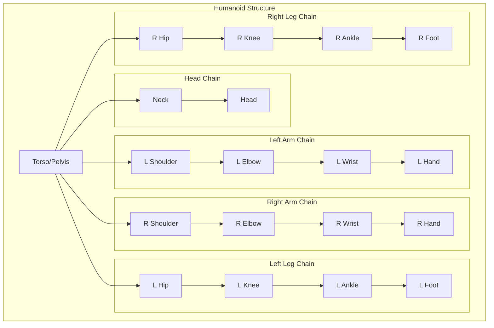
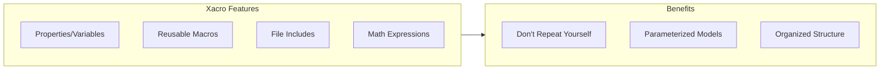

# Chapter 10: Building a Complete Humanoid URDF

:::note Learning Objectives
By the end of this chapter, you will be able to:
- Design a humanoid robot kinematic structure
- Implement a full-body URDF with torso, limbs, and head
- Use xacro for modular and maintainable robot descriptions
- Define proper joint limits for humanoid motion
- Integrate sensors into the humanoid model
:::

## Humanoid Robot Structure

A humanoid robot consists of multiple interconnected kinematic chains:



### Typical Humanoid DOF Configuration

| Body Part | Joints | DOF | Purpose |
|-----------|--------|-----|---------|
| **Head** | Neck pan/tilt | 2 | Gaze direction |
| **Arm** (x2) | Shoulder (3), Elbow (1), Wrist (3) | 14 | Manipulation |
| **Torso** | Waist pitch/roll/yaw | 3 | Balance, reach |
| **Leg** (x2) | Hip (3), Knee (1), Ankle (2) | 12 | Locomotion |
| **Total** | | **31** | Full body motion |

## Introduction to Xacro

**Xacro** (XML Macros) makes URDF files modular and maintainable:



### Basic Xacro Syntax

```xml title="basics.xacro"
<?xml version="1.0"?>
<robot xmlns:xacro="http://www.ros.org/wiki/xacro" name="example">

    <!-- Properties (variables) -->
    <xacro:property name="arm_length" value="0.3"/>
    <xacro:property name="arm_radius" value="0.04"/>
    <xacro:property name="pi" value="3.14159"/>

    <!-- Math expressions -->
    <xacro:property name="arm_mass" value="${arm_length * arm_radius * 1000}"/>
    <xacro:property name="half_pi" value="${pi/2}"/>

    <!-- Conditional -->
    <xacro:if value="${arm_length > 0.2}">
        <!-- Content if true -->
    </xacro:if>

    <!-- Macro definition -->
    <xacro:macro name="cylinder_link" params="name length radius mass color">
        <link name="${name}">
            <visual>
                <geometry>
                    <cylinder length="${length}" radius="${radius}"/>
                </geometry>
                <material name="${color}"/>
            </visual>
            <inertial>
                <mass value="${mass}"/>
                <!-- Inertia calculation -->
            </inertial>
        </link>
    </xacro:macro>

    <!-- Macro usage -->
    <xacro:cylinder_link name="upper_arm" length="${arm_length}"
                         radius="${arm_radius}" mass="1.5" color="orange"/>

</robot>
```

## Humanoid Xacro Structure

Organize the humanoid model into multiple files:

```text
humanoid_description/
├── urdf/
│   ├── humanoid.urdf.xacro      # Main file
│   ├── materials.xacro           # Color definitions
│   ├── properties.xacro          # Global properties
│   ├── macros/
│   │   ├── inertia.xacro         # Inertia calculators
│   │   ├── link.xacro            # Link macros
│   │   └── joint.xacro           # Joint macros
│   ├── torso.xacro               # Torso definition
│   ├── head.xacro                # Head chain
│   ├── arm.xacro                 # Arm chain (parameterized)
│   └── leg.xacro                 # Leg chain (parameterized)
└── meshes/
    ├── torso.stl
    ├── head.stl
    └── ...
```

## Main Humanoid File

```xml title="urdf/humanoid.urdf.xacro"
<?xml version="1.0"?>
<robot xmlns:xacro="http://www.ros.org/wiki/xacro" name="humanoid">

    <!-- Include modular components -->
    <xacro:include filename="$(find humanoid_description)/urdf/materials.xacro"/>
    <xacro:include filename="$(find humanoid_description)/urdf/properties.xacro"/>
    <xacro:include filename="$(find humanoid_description)/urdf/macros/inertia.xacro"/>
    <xacro:include filename="$(find humanoid_description)/urdf/macros/link.xacro"/>
    <xacro:include filename="$(find humanoid_description)/urdf/macros/joint.xacro"/>
    <xacro:include filename="$(find humanoid_description)/urdf/torso.xacro"/>
    <xacro:include filename="$(find humanoid_description)/urdf/head.xacro"/>
    <xacro:include filename="$(find humanoid_description)/urdf/arm.xacro"/>
    <xacro:include filename="$(find humanoid_description)/urdf/leg.xacro"/>

    <!-- Base link (floating base for humanoid) -->
    <link name="base_link"/>

    <!-- Torso attached to base -->
    <xacro:torso parent="base_link"/>

    <!-- Head chain -->
    <xacro:head parent="torso_link"/>

    <!-- Arms (parameterized for left/right) -->
    <xacro:arm side="left" parent="torso_link" reflect="1"/>
    <xacro:arm side="right" parent="torso_link" reflect="-1"/>

    <!-- Legs (parameterized for left/right) -->
    <xacro:leg side="left" parent="torso_link" reflect="1"/>
    <xacro:leg side="right" parent="torso_link" reflect="-1"/>

</robot>
```

## Properties and Materials

```xml title="urdf/properties.xacro"
<?xml version="1.0"?>
<robot xmlns:xacro="http://www.ros.org/wiki/xacro">

    <!-- Mathematical constants -->
    <xacro:property name="pi" value="3.14159265359"/>

    <!-- Robot dimensions (meters) -->
    <xacro:property name="torso_height" value="0.4"/>
    <xacro:property name="torso_width" value="0.35"/>
    <xacro:property name="torso_depth" value="0.2"/>

    <xacro:property name="upper_arm_length" value="0.28"/>
    <xacro:property name="lower_arm_length" value="0.25"/>
    <xacro:property name="arm_radius" value="0.04"/>

    <xacro:property name="upper_leg_length" value="0.35"/>
    <xacro:property name="lower_leg_length" value="0.32"/>
    <xacro:property name="leg_radius" value="0.05"/>

    <xacro:property name="foot_length" value="0.2"/>
    <xacro:property name="foot_width" value="0.1"/>
    <xacro:property name="foot_height" value="0.05"/>

    <xacro:property name="head_radius" value="0.1"/>
    <xacro:property name="neck_length" value="0.08"/>

    <!-- Shoulder/hip offsets -->
    <xacro:property name="shoulder_offset_y" value="0.19"/>
    <xacro:property name="shoulder_offset_z" value="0.15"/>
    <xacro:property name="hip_offset_y" value="0.1"/>
    <xacro:property name="hip_offset_z" value="-0.2"/>

    <!-- Joint limits (radians) -->
    <xacro:property name="shoulder_pitch_lower" value="-2.5"/>
    <xacro:property name="shoulder_pitch_upper" value="2.0"/>
    <xacro:property name="shoulder_roll_lower" value="-0.5"/>
    <xacro:property name="shoulder_roll_upper" value="3.0"/>
    <xacro:property name="elbow_lower" value="0.0"/>
    <xacro:property name="elbow_upper" value="2.6"/>

    <xacro:property name="hip_pitch_lower" value="-1.5"/>
    <xacro:property name="hip_pitch_upper" value="1.5"/>
    <xacro:property name="knee_lower" value="0.0"/>
    <xacro:property name="knee_upper" value="2.5"/>
    <xacro:property name="ankle_pitch_lower" value="-0.8"/>
    <xacro:property name="ankle_pitch_upper" value="0.8"/>

    <!-- Joint dynamics -->
    <xacro:property name="joint_damping" value="0.5"/>
    <xacro:property name="joint_friction" value="0.1"/>
    <xacro:property name="joint_velocity" value="3.0"/>
    <xacro:property name="joint_effort" value="100.0"/>

</robot>
```

```xml title="urdf/materials.xacro"
<?xml version="1.0"?>
<robot xmlns:xacro="http://www.ros.org/wiki/xacro">

    <material name="white">
        <color rgba="0.9 0.9 0.9 1.0"/>
    </material>

    <material name="dark_grey">
        <color rgba="0.3 0.3 0.3 1.0"/>
    </material>

    <material name="orange">
        <color rgba="1.0 0.5 0.0 1.0"/>
    </material>

    <material name="blue">
        <color rgba="0.2 0.4 0.8 1.0"/>
    </material>

    <material name="skin">
        <color rgba="0.96 0.8 0.69 1.0"/>
    </material>

</robot>
```

## Inertia Macros

```xml title="urdf/macros/inertia.xacro"
<?xml version="1.0"?>
<robot xmlns:xacro="http://www.ros.org/wiki/xacro">

    <!-- Box inertia -->
    <xacro:macro name="box_inertia" params="m w d h">
        <inertia
            ixx="${(1/12)*m*(d*d+h*h)}" ixy="0" ixz="0"
            iyy="${(1/12)*m*(w*w+h*h)}" iyz="0"
            izz="${(1/12)*m*(w*w+d*d)}"/>
    </xacro:macro>

    <!-- Cylinder inertia (aligned with z-axis) -->
    <xacro:macro name="cylinder_inertia" params="m r l">
        <inertia
            ixx="${(1/12)*m*(3*r*r+l*l)}" ixy="0" ixz="0"
            iyy="${(1/12)*m*(3*r*r+l*l)}" iyz="0"
            izz="${(1/2)*m*r*r}"/>
    </xacro:macro>

    <!-- Sphere inertia -->
    <xacro:macro name="sphere_inertia" params="m r">
        <inertia
            ixx="${(2/5)*m*r*r}" ixy="0" ixz="0"
            iyy="${(2/5)*m*r*r}" iyz="0"
            izz="${(2/5)*m*r*r}"/>
    </xacro:macro>

</robot>
```

## Arm Chain Definition

```xml title="urdf/arm.xacro"
<?xml version="1.0"?>
<robot xmlns:xacro="http://www.ros.org/wiki/xacro">

    <xacro:macro name="arm" params="side parent reflect">

        <!-- Shoulder link -->
        <link name="${side}_shoulder_link">
            <visual>
                <origin xyz="0 0 0" rpy="0 0 0"/>
                <geometry>
                    <sphere radius="0.05"/>
                </geometry>
                <material name="dark_grey"/>
            </visual>
            <collision>
                <origin xyz="0 0 0" rpy="0 0 0"/>
                <geometry>
                    <sphere radius="0.05"/>
                </geometry>
            </collision>
            <inertial>
                <origin xyz="0 0 0" rpy="0 0 0"/>
                <mass value="0.5"/>
                <xacro:sphere_inertia m="0.5" r="0.05"/>
            </inertial>
        </link>

        <!-- Shoulder pitch joint -->
        <joint name="${side}_shoulder_pitch" type="revolute">
            <parent link="${parent}"/>
            <child link="${side}_shoulder_link"/>
            <origin xyz="0 ${reflect*shoulder_offset_y} ${shoulder_offset_z}" rpy="0 0 0"/>
            <axis xyz="0 1 0"/>
            <limit lower="${shoulder_pitch_lower}" upper="${shoulder_pitch_upper}"
                   velocity="${joint_velocity}" effort="${joint_effort}"/>
            <dynamics damping="${joint_damping}" friction="${joint_friction}"/>
        </joint>

        <!-- Upper arm link -->
        <link name="${side}_upper_arm_link">
            <visual>
                <origin xyz="0 0 ${-upper_arm_length/2}" rpy="0 0 0"/>
                <geometry>
                    <cylinder radius="${arm_radius}" length="${upper_arm_length}"/>
                </geometry>
                <material name="white"/>
            </visual>
            <collision>
                <origin xyz="0 0 ${-upper_arm_length/2}" rpy="0 0 0"/>
                <geometry>
                    <cylinder radius="${arm_radius*1.1}" length="${upper_arm_length}"/>
                </geometry>
            </collision>
            <inertial>
                <origin xyz="0 0 ${-upper_arm_length/2}" rpy="0 0 0"/>
                <mass value="1.8"/>
                <xacro:cylinder_inertia m="1.8" r="${arm_radius}" l="${upper_arm_length}"/>
            </inertial>
        </link>

        <!-- Shoulder roll joint -->
        <joint name="${side}_shoulder_roll" type="revolute">
            <parent link="${side}_shoulder_link"/>
            <child link="${side}_upper_arm_link"/>
            <origin xyz="0 0 0" rpy="0 0 0"/>
            <axis xyz="1 0 0"/>
            <limit lower="${reflect*shoulder_roll_lower}" upper="${reflect*shoulder_roll_upper}"
                   velocity="${joint_velocity}" effort="${joint_effort}"/>
            <dynamics damping="${joint_damping}" friction="${joint_friction}"/>
        </joint>

        <!-- Elbow link -->
        <link name="${side}_elbow_link">
            <visual>
                <origin xyz="0 0 0" rpy="0 0 0"/>
                <geometry>
                    <sphere radius="0.04"/>
                </geometry>
                <material name="dark_grey"/>
            </visual>
            <collision>
                <origin xyz="0 0 0" rpy="0 0 0"/>
                <geometry>
                    <sphere radius="0.04"/>
                </geometry>
            </collision>
            <inertial>
                <origin xyz="0 0 0" rpy="0 0 0"/>
                <mass value="0.3"/>
                <xacro:sphere_inertia m="0.3" r="0.04"/>
            </inertial>
        </link>

        <!-- Shoulder yaw joint -->
        <joint name="${side}_shoulder_yaw" type="revolute">
            <parent link="${side}_upper_arm_link"/>
            <child link="${side}_elbow_link"/>
            <origin xyz="0 0 ${-upper_arm_length}" rpy="0 0 0"/>
            <axis xyz="0 0 1"/>
            <limit lower="-1.5" upper="1.5"
                   velocity="${joint_velocity}" effort="${joint_effort}"/>
            <dynamics damping="${joint_damping}" friction="${joint_friction}"/>
        </joint>

        <!-- Forearm link -->
        <link name="${side}_forearm_link">
            <visual>
                <origin xyz="0 0 ${-lower_arm_length/2}" rpy="0 0 0"/>
                <geometry>
                    <cylinder radius="${arm_radius*0.9}" length="${lower_arm_length}"/>
                </geometry>
                <material name="white"/>
            </visual>
            <collision>
                <origin xyz="0 0 ${-lower_arm_length/2}" rpy="0 0 0"/>
                <geometry>
                    <cylinder radius="${arm_radius}" length="${lower_arm_length}"/>
                </geometry>
            </collision>
            <inertial>
                <origin xyz="0 0 ${-lower_arm_length/2}" rpy="0 0 0"/>
                <mass value="1.2"/>
                <xacro:cylinder_inertia m="1.2" r="${arm_radius*0.9}" l="${lower_arm_length}"/>
            </inertial>
        </link>

        <!-- Elbow pitch joint -->
        <joint name="${side}_elbow_pitch" type="revolute">
            <parent link="${side}_elbow_link"/>
            <child link="${side}_forearm_link"/>
            <origin xyz="0 0 0" rpy="0 0 0"/>
            <axis xyz="0 1 0"/>
            <limit lower="${elbow_lower}" upper="${elbow_upper}"
                   velocity="${joint_velocity}" effort="${joint_effort}"/>
            <dynamics damping="${joint_damping}" friction="${joint_friction}"/>
        </joint>

        <!-- Hand link -->
        <link name="${side}_hand_link">
            <visual>
                <origin xyz="0 0 -0.05" rpy="0 0 0"/>
                <geometry>
                    <box size="0.08 0.05 0.1"/>
                </geometry>
                <material name="skin"/>
            </visual>
            <collision>
                <origin xyz="0 0 -0.05" rpy="0 0 0"/>
                <geometry>
                    <box size="0.08 0.05 0.1"/>
                </geometry>
            </collision>
            <inertial>
                <origin xyz="0 0 -0.05" rpy="0 0 0"/>
                <mass value="0.4"/>
                <xacro:box_inertia m="0.4" w="0.08" d="0.05" h="0.1"/>
            </inertial>
        </link>

        <!-- Wrist joint -->
        <joint name="${side}_wrist_pitch" type="revolute">
            <parent link="${side}_forearm_link"/>
            <child link="${side}_hand_link"/>
            <origin xyz="0 0 ${-lower_arm_length}" rpy="0 0 0"/>
            <axis xyz="0 1 0"/>
            <limit lower="-1.0" upper="1.0"
                   velocity="${joint_velocity}" effort="30.0"/>
            <dynamics damping="0.3" friction="0.05"/>
        </joint>

    </xacro:macro>

</robot>
```

## Leg Chain Definition

```xml title="urdf/leg.xacro"
<?xml version="1.0"?>
<robot xmlns:xacro="http://www.ros.org/wiki/xacro">

    <xacro:macro name="leg" params="side parent reflect">

        <!-- Hip link -->
        <link name="${side}_hip_link">
            <visual>
                <origin xyz="0 0 0" rpy="0 0 0"/>
                <geometry>
                    <sphere radius="0.06"/>
                </geometry>
                <material name="dark_grey"/>
            </visual>
            <collision>
                <origin xyz="0 0 0" rpy="0 0 0"/>
                <geometry>
                    <sphere radius="0.06"/>
                </geometry>
            </collision>
            <inertial>
                <origin xyz="0 0 0" rpy="0 0 0"/>
                <mass value="1.0"/>
                <xacro:sphere_inertia m="1.0" r="0.06"/>
            </inertial>
        </link>

        <!-- Hip yaw joint -->
        <joint name="${side}_hip_yaw" type="revolute">
            <parent link="${parent}"/>
            <child link="${side}_hip_link"/>
            <origin xyz="0 ${reflect*hip_offset_y} ${hip_offset_z}" rpy="0 0 0"/>
            <axis xyz="0 0 1"/>
            <limit lower="-0.5" upper="0.5"
                   velocity="${joint_velocity}" effort="150.0"/>
            <dynamics damping="${joint_damping}" friction="${joint_friction}"/>
        </joint>

        <!-- Upper leg link -->
        <link name="${side}_upper_leg_link">
            <visual>
                <origin xyz="0 0 ${-upper_leg_length/2}" rpy="0 0 0"/>
                <geometry>
                    <cylinder radius="${leg_radius}" length="${upper_leg_length}"/>
                </geometry>
                <material name="white"/>
            </visual>
            <collision>
                <origin xyz="0 0 ${-upper_leg_length/2}" rpy="0 0 0"/>
                <geometry>
                    <cylinder radius="${leg_radius*1.1}" length="${upper_leg_length}"/>
                </geometry>
            </collision>
            <inertial>
                <origin xyz="0 0 ${-upper_leg_length/2}" rpy="0 0 0"/>
                <mass value="4.0"/>
                <xacro:cylinder_inertia m="4.0" r="${leg_radius}" l="${upper_leg_length}"/>
            </inertial>
        </link>

        <!-- Hip roll joint -->
        <joint name="${side}_hip_roll" type="revolute">
            <parent link="${side}_hip_link"/>
            <child link="${side}_upper_leg_link"/>
            <origin xyz="0 0 0" rpy="0 0 0"/>
            <axis xyz="1 0 0"/>
            <limit lower="${-reflect*0.3}" upper="${reflect*0.5}"
                   velocity="${joint_velocity}" effort="150.0"/>
            <dynamics damping="${joint_damping}" friction="${joint_friction}"/>
        </joint>

        <!-- Knee link -->
        <link name="${side}_knee_link">
            <visual>
                <origin xyz="0 0 0" rpy="0 0 0"/>
                <geometry>
                    <sphere radius="0.05"/>
                </geometry>
                <material name="dark_grey"/>
            </visual>
            <collision>
                <origin xyz="0 0 0" rpy="0 0 0"/>
                <geometry>
                    <sphere radius="0.05"/>
                </geometry>
            </collision>
            <inertial>
                <origin xyz="0 0 0" rpy="0 0 0"/>
                <mass value="0.5"/>
                <xacro:sphere_inertia m="0.5" r="0.05"/>
            </inertial>
        </link>

        <!-- Hip pitch joint -->
        <joint name="${side}_hip_pitch" type="revolute">
            <parent link="${side}_upper_leg_link"/>
            <child link="${side}_knee_link"/>
            <origin xyz="0 0 ${-upper_leg_length}" rpy="0 0 0"/>
            <axis xyz="0 1 0"/>
            <limit lower="${hip_pitch_lower}" upper="${hip_pitch_upper}"
                   velocity="${joint_velocity}" effort="150.0"/>
            <dynamics damping="${joint_damping}" friction="${joint_friction}"/>
        </joint>

        <!-- Lower leg link -->
        <link name="${side}_lower_leg_link">
            <visual>
                <origin xyz="0 0 ${-lower_leg_length/2}" rpy="0 0 0"/>
                <geometry>
                    <cylinder radius="${leg_radius*0.9}" length="${lower_leg_length}"/>
                </geometry>
                <material name="white"/>
            </visual>
            <collision>
                <origin xyz="0 0 ${-lower_leg_length/2}" rpy="0 0 0"/>
                <geometry>
                    <cylinder radius="${leg_radius}" length="${lower_leg_length}"/>
                </geometry>
            </collision>
            <inertial>
                <origin xyz="0 0 ${-lower_leg_length/2}" rpy="0 0 0"/>
                <mass value="3.0"/>
                <xacro:cylinder_inertia m="3.0" r="${leg_radius*0.9}" l="${lower_leg_length}"/>
            </inertial>
        </link>

        <!-- Knee pitch joint -->
        <joint name="${side}_knee_pitch" type="revolute">
            <parent link="${side}_knee_link"/>
            <child link="${side}_lower_leg_link"/>
            <origin xyz="0 0 0" rpy="0 0 0"/>
            <axis xyz="0 1 0"/>
            <limit lower="${knee_lower}" upper="${knee_upper}"
                   velocity="${joint_velocity}" effort="120.0"/>
            <dynamics damping="${joint_damping}" friction="${joint_friction}"/>
        </joint>

        <!-- Foot link -->
        <link name="${side}_foot_link">
            <visual>
                <origin xyz="${foot_length/4} 0 ${-foot_height/2}" rpy="0 0 0"/>
                <geometry>
                    <box size="${foot_length} ${foot_width} ${foot_height}"/>
                </geometry>
                <material name="dark_grey"/>
            </visual>
            <collision>
                <origin xyz="${foot_length/4} 0 ${-foot_height/2}" rpy="0 0 0"/>
                <geometry>
                    <box size="${foot_length} ${foot_width} ${foot_height}"/>
                </geometry>
            </collision>
            <inertial>
                <origin xyz="${foot_length/4} 0 ${-foot_height/2}" rpy="0 0 0"/>
                <mass value="1.0"/>
                <xacro:box_inertia m="1.0" w="${foot_length}" d="${foot_width}" h="${foot_height}"/>
            </inertial>
        </link>

        <!-- Ankle pitch joint -->
        <joint name="${side}_ankle_pitch" type="revolute">
            <parent link="${side}_lower_leg_link"/>
            <child link="${side}_foot_link"/>
            <origin xyz="0 0 ${-lower_leg_length}" rpy="0 0 0"/>
            <axis xyz="0 1 0"/>
            <limit lower="${ankle_pitch_lower}" upper="${ankle_pitch_upper}"
                   velocity="${joint_velocity}" effort="80.0"/>
            <dynamics damping="0.3" friction="0.05"/>
        </joint>

    </xacro:macro>

</robot>
```

## Adding Sensors

```xml title="urdf/sensors.xacro"
<?xml version="1.0"?>
<robot xmlns:xacro="http://www.ros.org/wiki/xacro">

    <!-- IMU sensor macro -->
    <xacro:macro name="imu_sensor" params="name parent *origin">
        <link name="${name}_link">
            <visual>
                <geometry>
                    <box size="0.02 0.02 0.01"/>
                </geometry>
                <material name="dark_grey"/>
            </visual>
            <inertial>
                <mass value="0.01"/>
                <xacro:box_inertia m="0.01" w="0.02" d="0.02" h="0.01"/>
            </inertial>
        </link>
        <joint name="${name}_joint" type="fixed">
            <parent link="${parent}"/>
            <child link="${name}_link"/>
            <xacro:insert_block name="origin"/>
        </joint>
    </xacro:macro>

    <!-- Camera sensor macro -->
    <xacro:macro name="camera_sensor" params="name parent *origin">
        <link name="${name}_link">
            <visual>
                <geometry>
                    <box size="0.03 0.08 0.02"/>
                </geometry>
                <material name="dark_grey"/>
            </visual>
            <inertial>
                <mass value="0.05"/>
                <xacro:box_inertia m="0.05" w="0.03" d="0.08" h="0.02"/>
            </inertial>
        </link>
        <joint name="${name}_joint" type="fixed">
            <parent link="${parent}"/>
            <child link="${name}_link"/>
            <xacro:insert_block name="origin"/>
        </joint>
        <!-- Optical frame for camera -->
        <link name="${name}_optical_frame"/>
        <joint name="${name}_optical_joint" type="fixed">
            <parent link="${name}_link"/>
            <child link="${name}_optical_frame"/>
            <origin xyz="0 0 0" rpy="${-pi/2} 0 ${-pi/2}"/>
        </joint>
    </xacro:macro>

</robot>
```

## Processing Xacro

Convert xacro to URDF:

```bash
# Generate URDF from xacro
xacro humanoid.urdf.xacro > humanoid.urdf

# Or with parameters
xacro humanoid.urdf.xacro arm_length:=0.35 > humanoid_long_arms.urdf

# Check the generated URDF
check_urdf humanoid.urdf
```

## Summary

In this chapter, you learned:

- **Humanoid structure** with multiple kinematic chains
- **Xacro macros** for modular, maintainable robot descriptions
- How to create **parameterized limbs** (arms and legs)
- Proper **joint configuration** for humanoid motion
- How to **integrate sensors** into the model

## Key Takeaways

:::tip Remember
1. Use **xacro** for any robot with repeated structures
2. **Parameterize** limbs for left/right symmetry
3. Set **realistic joint limits** based on human biomechanics
4. Include **proper inertial properties** for simulation
5. **Organize** xacro files into logical modules
:::

## Next Steps

In the next chapter, we will learn how to visualize this humanoid model in **RViz** and understand the **TF tree** that represents the robot's coordinate frames.

---

## Exercises

1. Add a gripper with articulated fingers to the arm
2. Create a torso.xacro with waist joints for torso rotation
3. Add force/torque sensors to the feet
4. Implement a head.xacro with pan-tilt neck joints
5. Create different robot sizes by parameterizing all dimensions
