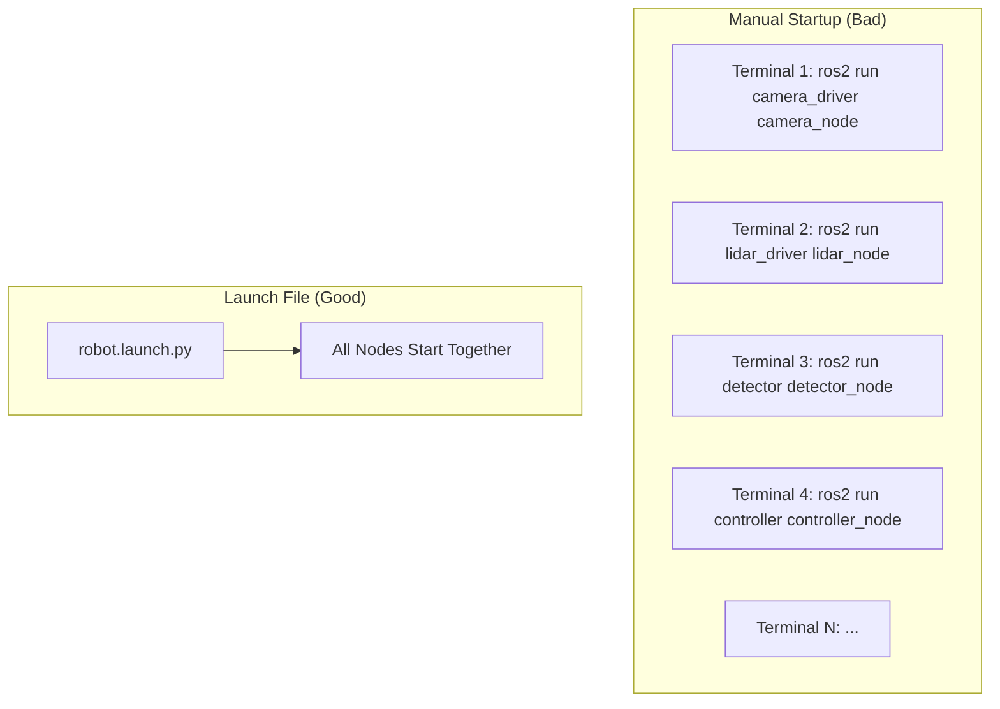
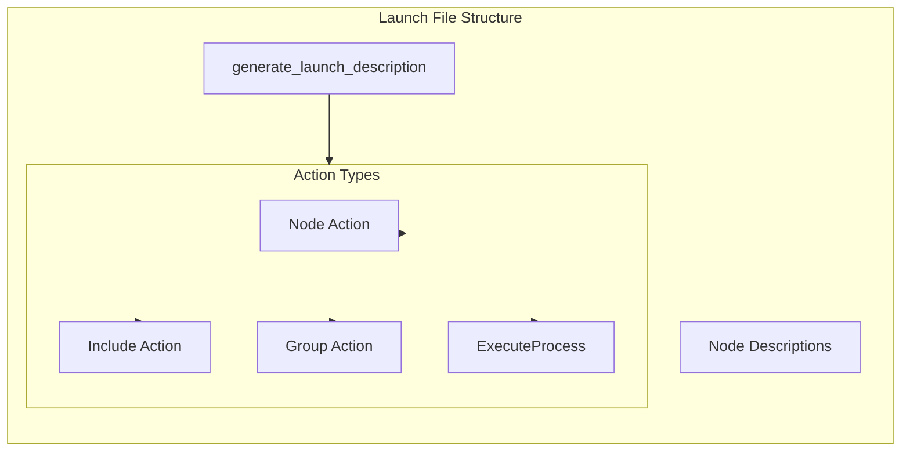
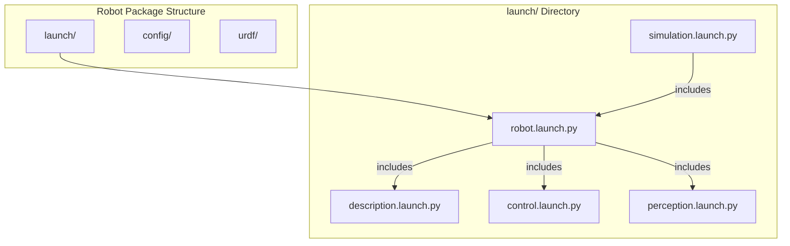

# Chapter 7: ROS 2 Launch Files

:::note Learning Objectives
By the end of this chapter, you will be able to:
- Understand the purpose and architecture of ROS 2 launch files
- Write Python launch files to start multiple nodes
- Pass parameters and arguments to nodes via launch files
- Use conditionals and substitutions for flexible configurations
- Organize complex robot systems with launch file composition
:::

## Why Launch Files?

Real robots consist of dozens of nodes running simultaneously. Manually starting each node is impractical and error-prone. **Launch files** provide a declarative way to:



| Manual Start | Launch Files |
|--------------|--------------|
| Multiple terminals | Single command |
| Manual parameter passing | Centralized configuration |
| No startup ordering | Dependency management |
| Difficult to reproduce | Version controlled |
| Error prone | Reliable and repeatable |

## Launch File Architecture

ROS 2 launch files are written in Python, providing full programming capabilities:



## Basic Launch File

```python title="launch/simple_robot.launch.py"
#!/usr/bin/env python3
"""Launch file for a simple robot configuration."""

from launch import LaunchDescription
from launch_ros.actions import Node

def generate_launch_description():
    """Generate the launch description for simple robot."""

    # Camera node
    camera_node = Node(
        package='camera_driver',
        executable='camera_node',
        name='camera',
        output='screen',
        parameters=[{
            'frame_rate': 30.0,
            'resolution': [1920, 1080]
        }]
    )

    # Object detector node
    detector_node = Node(
        package='perception',
        executable='object_detector',
        name='detector',
        output='screen',
        remappings=[
            ('input_image', '/camera/image_raw'),
            ('detections', '/perception/detections')
        ]
    )

    # Controller node
    controller_node = Node(
        package='robot_control',
        executable='arm_controller',
        name='arm_controller',
        output='screen'
    )

    return LaunchDescription([
        camera_node,
        detector_node,
        controller_node
    ])
```

### Running Launch Files

```bash
# Run a launch file from a package
ros2 launch my_robot_pkg simple_robot.launch.py

# Run a launch file directly
ros2 launch path/to/simple_robot.launch.py

# Pass arguments
ros2 launch my_robot_pkg simple_robot.launch.py use_sim:=true
```

## Launch Arguments

Make launch files configurable with arguments:

```python title="launch/configurable_robot.launch.py"
#!/usr/bin/env python3
"""Configurable launch file with arguments."""

from launch import LaunchDescription
from launch.actions import DeclareLaunchArgument
from launch.substitutions import LaunchConfiguration
from launch_ros.actions import Node

def generate_launch_description():
    """Generate launch description with configurable arguments."""

    # Declare launch arguments
    use_sim_arg = DeclareLaunchArgument(
        'use_sim',
        default_value='false',
        description='Use simulation time'
    )

    robot_name_arg = DeclareLaunchArgument(
        'robot_name',
        default_value='humanoid_01',
        description='Name of the robot'
    )

    config_file_arg = DeclareLaunchArgument(
        'config_file',
        default_value='config/robot_params.yaml',
        description='Path to configuration file'
    )

    control_rate_arg = DeclareLaunchArgument(
        'control_rate',
        default_value='500.0',
        description='Control loop rate in Hz'
    )

    # Get argument values as substitutions
    use_sim = LaunchConfiguration('use_sim')
    robot_name = LaunchConfiguration('robot_name')
    config_file = LaunchConfiguration('config_file')
    control_rate = LaunchConfiguration('control_rate')

    # Define nodes with argument values
    controller_node = Node(
        package='robot_control',
        executable='joint_controller',
        name='joint_controller',
        namespace=robot_name,
        output='screen',
        parameters=[
            config_file,
            {
                'use_sim_time': use_sim,
                'control_rate': control_rate
            }
        ]
    )

    state_publisher = Node(
        package='robot_state_publisher',
        executable='robot_state_publisher',
        name='robot_state_publisher',
        namespace=robot_name,
        output='screen',
        parameters=[{'use_sim_time': use_sim}]
    )

    return LaunchDescription([
        use_sim_arg,
        robot_name_arg,
        config_file_arg,
        control_rate_arg,
        controller_node,
        state_publisher
    ])
```

## Substitutions

Substitutions allow dynamic value computation:

```python title="launch/substitution_examples.launch.py"
#!/usr/bin/env python3
"""Examples of launch substitutions."""

from launch import LaunchDescription
from launch.actions import DeclareLaunchArgument, LogInfo
from launch.substitutions import (
    LaunchConfiguration,
    PathJoinSubstitution,
    PythonExpression,
    EnvironmentVariable,
    FindExecutable
)
from launch_ros.substitutions import FindPackageShare
from launch_ros.actions import Node

def generate_launch_description():
    """Demonstrate various substitution types."""

    # Package path substitution
    pkg_share = FindPackageShare('my_robot_description')

    # Path joining
    urdf_path = PathJoinSubstitution([
        pkg_share, 'urdf', 'robot.urdf.xacro'
    ])

    config_path = PathJoinSubstitution([
        pkg_share, 'config', 'default_params.yaml'
    ])

    # Environment variable
    home_dir = EnvironmentVariable('HOME', default_value='/home/user')

    # Launch argument
    debug_arg = DeclareLaunchArgument('debug', default_value='false')
    debug = LaunchConfiguration('debug')

    # Python expression for conditional logic
    log_level = PythonExpression([
        "'debug' if '", debug, "' == 'true' else 'info'"
    ])

    # Log info action
    log_action = LogInfo(msg=['Launching robot from: ', pkg_share])

    # Node with substitutions
    robot_node = Node(
        package='my_robot',
        executable='robot_node',
        name='robot',
        output='screen',
        arguments=['--ros-args', '--log-level', log_level],
        parameters=[config_path]
    )

    return LaunchDescription([
        debug_arg,
        log_action,
        robot_node
    ])
```

## Conditional Execution

Execute actions based on conditions:

```python title="launch/conditional_launch.launch.py"
#!/usr/bin/env python3
"""Launch file with conditional node execution."""

from launch import LaunchDescription
from launch.actions import DeclareLaunchArgument, GroupAction
from launch.conditions import IfCondition, UnlessCondition
from launch.substitutions import LaunchConfiguration, PythonExpression
from launch_ros.actions import Node

def generate_launch_description():
    """Generate launch with conditional nodes."""

    # Arguments
    use_rviz_arg = DeclareLaunchArgument(
        'use_rviz', default_value='true'
    )
    use_sim_arg = DeclareLaunchArgument(
        'use_sim', default_value='false'
    )
    robot_type_arg = DeclareLaunchArgument(
        'robot_type', default_value='humanoid'
    )

    use_rviz = LaunchConfiguration('use_rviz')
    use_sim = LaunchConfiguration('use_sim')
    robot_type = LaunchConfiguration('robot_type')

    # Conditional RViz node
    rviz_node = Node(
        package='rviz2',
        executable='rviz2',
        name='rviz2',
        output='screen',
        condition=IfCondition(use_rviz)
    )

    # Real hardware driver - only when NOT in simulation
    hardware_driver = Node(
        package='hardware_interface',
        executable='driver_node',
        name='hardware_driver',
        output='screen',
        condition=UnlessCondition(use_sim)
    )

    # Simulation driver - only in simulation
    sim_driver = Node(
        package='gazebo_ros',
        executable='spawn_entity.py',
        name='spawn_robot',
        output='screen',
        condition=IfCondition(use_sim)
    )

    # Conditional based on Python expression
    humanoid_controller = Node(
        package='humanoid_control',
        executable='balance_controller',
        name='balance_controller',
        output='screen',
        condition=IfCondition(
            PythonExpression(["'", robot_type, "' == 'humanoid'"])
        )
    )

    return LaunchDescription([
        use_rviz_arg,
        use_sim_arg,
        robot_type_arg,
        rviz_node,
        hardware_driver,
        sim_driver,
        humanoid_controller
    ])
```

## Including Other Launch Files

Compose complex systems from smaller launch files:

```python title="launch/full_robot.launch.py"
#!/usr/bin/env python3
"""Main launch file that includes sub-launch files."""

from launch import LaunchDescription
from launch.actions import (
    DeclareLaunchArgument,
    IncludeLaunchDescription,
    GroupAction
)
from launch.launch_description_sources import PythonLaunchDescriptionSource
from launch.substitutions import LaunchConfiguration, PathJoinSubstitution
from launch_ros.substitutions import FindPackageShare
from launch_ros.actions import PushRosNamespace

def generate_launch_description():
    """Generate the complete robot launch description."""

    # Arguments
    robot_name_arg = DeclareLaunchArgument(
        'robot_name', default_value='humanoid_01'
    )
    use_sim_arg = DeclareLaunchArgument(
        'use_sim', default_value='false'
    )

    robot_name = LaunchConfiguration('robot_name')
    use_sim = LaunchConfiguration('use_sim')

    # Package paths
    description_pkg = FindPackageShare('humanoid_description')
    control_pkg = FindPackageShare('humanoid_control')
    perception_pkg = FindPackageShare('humanoid_perception')

    # Include description launch file
    description_launch = IncludeLaunchDescription(
        PythonLaunchDescriptionSource([
            PathJoinSubstitution([
                description_pkg, 'launch', 'description.launch.py'
            ])
        ]),
        launch_arguments={
            'use_sim_time': use_sim
        }.items()
    )

    # Include control launch file in namespace
    control_launch = GroupAction([
        PushRosNamespace(robot_name),
        IncludeLaunchDescription(
            PythonLaunchDescriptionSource([
                PathJoinSubstitution([
                    control_pkg, 'launch', 'controllers.launch.py'
                ])
            ]),
            launch_arguments={
                'use_sim_time': use_sim,
                'robot_name': robot_name
            }.items()
        )
    ])

    # Include perception launch file
    perception_launch = IncludeLaunchDescription(
        PythonLaunchDescriptionSource([
            PathJoinSubstitution([
                perception_pkg, 'launch', 'perception.launch.py'
            ])
        ])
    )

    return LaunchDescription([
        robot_name_arg,
        use_sim_arg,
        description_launch,
        control_launch,
        perception_launch
    ])
```

## Launch File Organization



### Recommended Structure

```text
my_robot/
├── launch/
│   ├── robot.launch.py           # Main entry point
│   ├── description.launch.py     # URDF and state publisher
│   ├── control.launch.py         # Controllers
│   ├── perception.launch.py      # Sensors and perception
│   ├── simulation.launch.py      # Gazebo simulation
│   └── visualization.launch.py   # RViz setup
├── config/
│   ├── robot_params.yaml
│   ├── controller_params.yaml
│   └── rviz_config.rviz
└── urdf/
    └── robot.urdf.xacro
```

## Event Handlers

React to launch events:

```python title="launch/event_handlers.launch.py"
#!/usr/bin/env python3
"""Launch file with event handlers."""

from launch import LaunchDescription
from launch.actions import (
    RegisterEventHandler,
    EmitEvent,
    LogInfo,
    TimerAction
)
from launch.events import Shutdown
from launch.event_handlers import (
    OnProcessStart,
    OnProcessExit,
    OnExecutionComplete
)
from launch_ros.actions import Node

def generate_launch_description():
    """Generate launch with event handling."""

    # Core node
    core_node = Node(
        package='robot_core',
        executable='core_node',
        name='core',
        output='screen'
    )

    # Dependent node
    dependent_node = Node(
        package='robot_control',
        executable='controller',
        name='controller',
        output='screen'
    )

    # Start dependent node when core starts
    start_handler = RegisterEventHandler(
        OnProcessStart(
            target_action=core_node,
            on_start=[
                LogInfo(msg='Core node started, launching controller...'),
                dependent_node
            ]
        )
    )

    # Handle core node exit
    exit_handler = RegisterEventHandler(
        OnProcessExit(
            target_action=core_node,
            on_exit=[
                LogInfo(msg='Core node exited! Shutting down...'),
                EmitEvent(event=Shutdown(reason='Core node crashed'))
            ]
        )
    )

    # Delayed action
    delayed_node = TimerAction(
        period=5.0,
        actions=[
            LogInfo(msg='Starting delayed perception node...'),
            Node(
                package='perception',
                executable='perception_node',
                name='perception',
                output='screen'
            )
        ]
    )

    return LaunchDescription([
        core_node,
        start_handler,
        exit_handler,
        delayed_node
    ])
```

## Humanoid Robot Launch Example

```python title="launch/humanoid_bringup.launch.py"
#!/usr/bin/env python3
"""Complete humanoid robot bringup launch file."""

from launch import LaunchDescription
from launch.actions import (
    DeclareLaunchArgument,
    IncludeLaunchDescription,
    GroupAction,
    TimerAction,
    LogInfo
)
from launch.conditions import IfCondition
from launch.substitutions import (
    LaunchConfiguration,
    PathJoinSubstitution,
    Command
)
from launch.launch_description_sources import PythonLaunchDescriptionSource
from launch_ros.substitutions import FindPackageShare
from launch_ros.actions import Node

def generate_launch_description():
    """Launch complete humanoid robot system."""

    # Package paths
    pkg_share = FindPackageShare('humanoid_bringup')

    # Launch arguments
    args = [
        DeclareLaunchArgument('use_sim', default_value='false'),
        DeclareLaunchArgument('use_rviz', default_value='true'),
        DeclareLaunchArgument('robot_name', default_value='humanoid'),
        DeclareLaunchArgument(
            'config_file',
            default_value=PathJoinSubstitution([
                pkg_share, 'config', 'humanoid_params.yaml'
            ])
        )
    ]

    # Get configurations
    use_sim = LaunchConfiguration('use_sim')
    use_rviz = LaunchConfiguration('use_rviz')
    config_file = LaunchConfiguration('config_file')

    # Robot state publisher
    robot_state_pub = Node(
        package='robot_state_publisher',
        executable='robot_state_publisher',
        name='robot_state_publisher',
        output='screen',
        parameters=[{
            'robot_description': Command([
                'xacro ',
                PathJoinSubstitution([
                    pkg_share, 'urdf', 'humanoid.urdf.xacro'
                ])
            ]),
            'use_sim_time': use_sim
        }]
    )

    # Joint state publisher
    joint_state_pub = Node(
        package='joint_state_publisher',
        executable='joint_state_publisher',
        name='joint_state_publisher',
        parameters=[{'use_sim_time': use_sim}]
    )

    # Controllers
    joint_controller = Node(
        package='humanoid_control',
        executable='joint_controller',
        name='joint_controller',
        output='screen',
        parameters=[config_file, {'use_sim_time': use_sim}]
    )

    balance_controller = Node(
        package='humanoid_control',
        executable='balance_controller',
        name='balance_controller',
        output='screen',
        parameters=[config_file, {'use_sim_time': use_sim}]
    )

    # RViz (conditional)
    rviz_node = Node(
        package='rviz2',
        executable='rviz2',
        name='rviz2',
        output='screen',
        arguments=[
            '-d',
            PathJoinSubstitution([pkg_share, 'config', 'humanoid.rviz'])
        ],
        condition=IfCondition(use_rviz)
    )

    # Delayed perception startup
    perception_nodes = TimerAction(
        period=2.0,
        actions=[
            LogInfo(msg='Starting perception nodes...'),
            Node(
                package='humanoid_perception',
                executable='camera_processor',
                name='camera_processor',
                output='screen'
            )
        ]
    )

    return LaunchDescription([
        *args,
        robot_state_pub,
        joint_state_pub,
        joint_controller,
        balance_controller,
        rviz_node,
        perception_nodes
    ])
```

## Summary

In this chapter, you learned:

- **Launch files** orchestrate multi-node robot systems
- **Python launch files** provide full programming flexibility
- **Arguments and substitutions** make launches configurable
- **Conditionals** enable flexible node execution
- **Event handlers** react to node lifecycle events
- **Composition** organizes complex systems from smaller files

## Key Takeaways

:::tip Remember
1. Use **launch files** for any system with more than one node
2. **Declare arguments** for all configurable values
3. **Organize launch files** hierarchically for maintainability
4. Use **conditionals** for simulation vs. real hardware differences
5. **Include** sub-launch files to compose complex systems
:::

## Next Steps

In the next chapter, we will explore **rclpy basics** in depth, learning the Python API patterns and best practices for writing robust ROS 2 nodes.

---

## Exercises

1. Create a launch file that starts three nodes with different namespaces
2. Add launch arguments for simulation mode and visualization
3. Implement conditional node execution based on robot type
4. Create a hierarchical launch structure with included sub-launches
5. Add event handlers to log node startup and shutdown events
