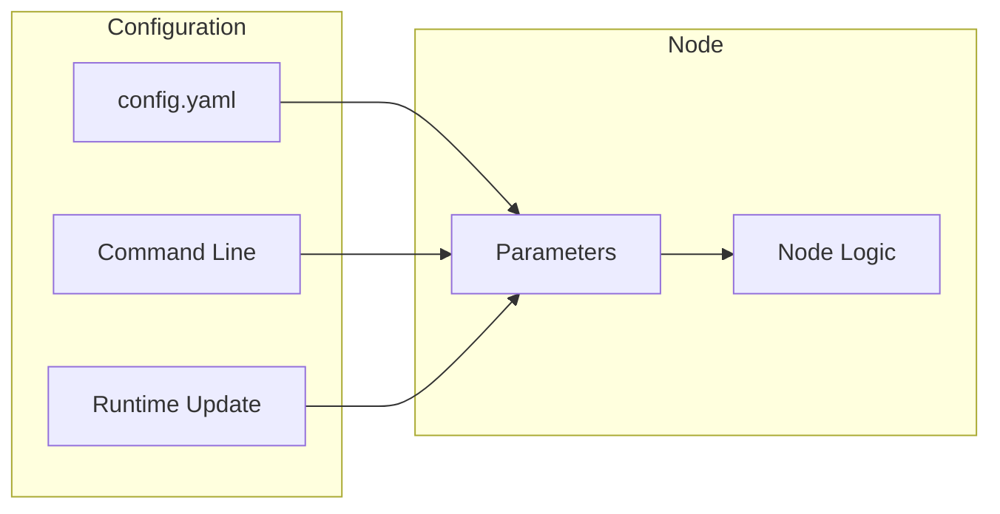

# Chapter 6: ROS 2 Parameters & Configuration

:::note Learning Objectives
By the end of this chapter, you will be able to:
- Declare and use parameters in ROS 2 nodes
- Load parameters from YAML configuration files
- Update parameters at runtime without restarting nodes
- Implement parameter callbacks for reactive configuration
:::

## Why Parameters?

Parameters allow you to **configure nodes without modifying code**:



| Hard-coded | Parameterized |
|------------|---------------|
| Requires recompilation | Just restart node |
| One configuration | Multiple configs |
| Not portable | Environment-specific |

## Declaring Parameters

```python title="parameterized_controller.py"
#!/usr/bin/env python3
"""A controller node with configurable parameters."""

import rclpy
from rclpy.node import Node
from rcl_interfaces.msg import ParameterDescriptor, ParameterType

class ParameterizedController(Node):
    def __init__(self):
        super().__init__('parameterized_controller')

        # Declare parameters with descriptions and constraints
        self.declare_parameter(
            'control_rate',
            100.0,
            ParameterDescriptor(
                description='Control loop frequency in Hz',
                type=ParameterType.PARAMETER_DOUBLE,
                read_only=False
            )
        )

        self.declare_parameter(
            'joint_names',
            ['shoulder', 'elbow', 'wrist'],
            ParameterDescriptor(
                description='List of joint names to control'
            )
        )

        self.declare_parameter(
            'kp',
            [100.0, 80.0, 50.0],
            ParameterDescriptor(description='Proportional gains')
        )

        self.declare_parameter(
            'kd',
            [10.0, 8.0, 5.0],
            ParameterDescriptor(description='Derivative gains')
        )

        self.declare_parameter(
            'enable_safety_limits',
            True,
            ParameterDescriptor(description='Enable joint safety limits')
        )

        # Get parameter values
        self.load_parameters()

        # Create control loop
        rate = self.get_parameter('control_rate').value
        self.timer = self.create_timer(1.0 / rate, self.control_callback)

        self.get_logger().info('Controller initialized')

    def load_parameters(self):
        """Load current parameter values."""
        self.control_rate = self.get_parameter('control_rate').value
        self.joint_names = self.get_parameter('joint_names').value
        self.kp = self.get_parameter('kp').value
        self.kd = self.get_parameter('kd').value
        self.safety_enabled = self.get_parameter('enable_safety_limits').value

        self.get_logger().info(
            f'Loaded parameters: rate={self.control_rate}Hz, '
            f'joints={self.joint_names}'
        )

    def control_callback(self):
        """Control loop - uses parameterized gains."""
        for i, joint in enumerate(self.joint_names):
            kp = self.kp[i] if i < len(self.kp) else self.kp[-1]
            kd = self.kd[i] if i < len(self.kd) else self.kd[-1]
            # Control logic would go here
            pass

def main(args=None):
    rclpy.init(args=args)
    node = ParameterizedController()
    rclpy.spin(node)
    node.destroy_node()
    rclpy.shutdown()

if __name__ == '__main__':
    main()
```

## YAML Configuration Files

```yaml title="config/controller_params.yaml"
# Controller configuration for humanoid arm
parameterized_controller:
  ros__parameters:
    control_rate: 200.0

    joint_names:
      - shoulder_pitch
      - shoulder_roll
      - elbow_pitch
      - wrist_roll
      - wrist_pitch
      - gripper

    kp: [120.0, 100.0, 80.0, 50.0, 40.0, 30.0]
    kd: [12.0, 10.0, 8.0, 5.0, 4.0, 3.0]

    enable_safety_limits: true

    # Nested parameters
    safety:
      max_velocity: 2.0
      max_acceleration: 5.0
      joint_limits:
        shoulder_pitch: [-1.57, 1.57]
        shoulder_roll: [-0.5, 1.5]
        elbow_pitch: [0.0, 2.5]
```

### Loading Parameters from YAML

```bash
# Via command line
ros2 run my_package parameterized_controller \
  --ros-args --params-file config/controller_params.yaml

# Or in a launch file (recommended)
```

## Runtime Parameter Updates

### Command Line

```bash
# List all parameters
ros2 param list /parameterized_controller

# Get a parameter value
ros2 param get /parameterized_controller control_rate

# Set a parameter value
ros2 param set /parameterized_controller control_rate 150.0

# Dump all parameters to file
ros2 param dump /parameterized_controller > params_backup.yaml

# Load parameters from file
ros2 param load /parameterized_controller params_backup.yaml
```

### Parameter Callbacks

React to parameter changes in real-time:

```python title="reactive_controller.py"
#!/usr/bin/env python3
"""Controller that reacts to parameter changes."""

import rclpy
from rclpy.node import Node
from rcl_interfaces.msg import SetParametersResult

class ReactiveController(Node):
    def __init__(self):
        super().__init__('reactive_controller')

        # Declare parameters
        self.declare_parameter('gain', 1.0)
        self.declare_parameter('enabled', True)

        # Register parameter callback
        self.add_on_set_parameters_callback(self.parameter_callback)

        self.get_logger().info('Reactive controller started')

    def parameter_callback(self, params):
        """Called when parameters are changed."""
        for param in params:
            self.get_logger().info(
                f'Parameter changed: {param.name} = {param.value}'
            )

            # Validate changes
            if param.name == 'gain':
                if param.value < 0:
                    return SetParametersResult(
                        successful=False,
                        reason='Gain must be non-negative'
                    )
                # Apply the new gain
                self.apply_gain(param.value)

            elif param.name == 'enabled':
                # Enable/disable controller
                self.set_enabled(param.value)

        return SetParametersResult(successful=True)

    def apply_gain(self, new_gain):
        """Apply new gain value."""
        self.get_logger().info(f'Applying gain: {new_gain}')

    def set_enabled(self, enabled):
        """Enable or disable the controller."""
        status = 'enabled' if enabled else 'disabled'
        self.get_logger().info(f'Controller {status}')

def main(args=None):
    rclpy.init(args=args)
    node = ReactiveController()
    rclpy.spin(node)
    node.destroy_node()
    rclpy.shutdown()

if __name__ == '__main__':
    main()
```

## Parameter Types

| Type | Python | YAML |
|------|--------|------|
| Boolean | `True/False` | `true/false` |
| Integer | `42` | `42` |
| Double | `3.14` | `3.14` |
| String | `"hello"` | `hello` or `"hello"` |
| Byte Array | `[1, 2, 3]` | - |
| Bool Array | `[True, False]` | `[true, false]` |
| Integer Array | `[1, 2, 3]` | `[1, 2, 3]` |
| Double Array | `[1.0, 2.0]` | `[1.0, 2.0]` |
| String Array | `["a", "b"]` | `["a", "b"]` |

## Best Practices

### 1. Use Descriptive Names

```python
# Good
self.declare_parameter('max_joint_velocity_rad_s', 2.0)

# Bad
self.declare_parameter('v', 2.0)
```

### 2. Provide Defaults

```python
# Always provide sensible defaults
self.declare_parameter('timeout_sec', 5.0)
```

### 3. Validate Parameter Values

```python
def parameter_callback(self, params):
    for param in params:
        if param.name == 'control_rate':
            if param.value < 1.0 or param.value > 1000.0:
                return SetParametersResult(
                    successful=False,
                    reason='Control rate must be between 1 and 1000 Hz'
                )
    return SetParametersResult(successful=True)
```

### 4. Document Parameters

```yaml
# config/params_documented.yaml
my_node:
  ros__parameters:
    # Control frequency in Hz (1-1000)
    control_rate: 100.0

    # PID gains for joint controllers
    # Format: [kp, ki, kd]
    pid_gains: [100.0, 0.1, 10.0]
```

## Environment-Specific Configs

Create configs for different scenarios:

```text
config/
├── robot_real.yaml      # Real hardware
├── robot_sim.yaml       # Simulation
├── robot_debug.yaml     # Debug mode
└── robot_test.yaml      # Testing
```

```yaml title="config/robot_sim.yaml"
# Simulation configuration - relaxed parameters
controller:
  ros__parameters:
    control_rate: 100.0  # Lower rate for sim
    enable_safety_limits: false  # Sim is safe
    timeout_sec: 10.0  # More time for slow sim
```

```yaml title="config/robot_real.yaml"
# Real hardware - strict parameters
controller:
  ros__parameters:
    control_rate: 500.0  # High rate for real-time
    enable_safety_limits: true  # Safety critical!
    timeout_sec: 1.0  # Fast failure detection
```

## Summary

In this chapter, you learned:

- ✅ Declare parameters with types and descriptions
- ✅ Load parameters from YAML configuration files
- ✅ Update parameters at runtime using CLI or programmatically
- ✅ React to parameter changes with callbacks
- ✅ Organize configuration for different environments

## Key Takeaways

:::tip Remember
1. **Always declare parameters** with clear descriptions
2. Use **YAML files** for environment-specific configuration
3. **Validate parameter changes** before applying them
4. **React to changes** rather than polling parameter values
:::

## Next Steps

In the next chapter, we'll learn about **launch files** to orchestrate multi-node robot systems with proper configuration.

---

## Exercises

1. Create a node with nested parameters for PID gains
2. Implement a parameter callback that rejects invalid ranges
3. Create YAML configs for three different robot scenarios
4. Add a "reload config" service that re-reads all parameters
