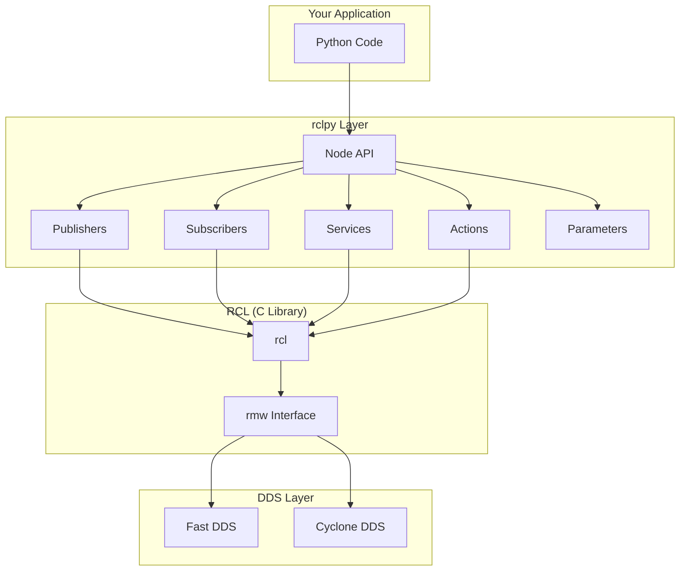
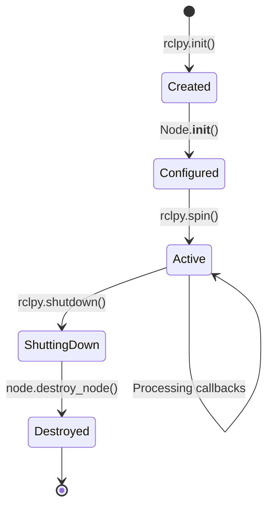
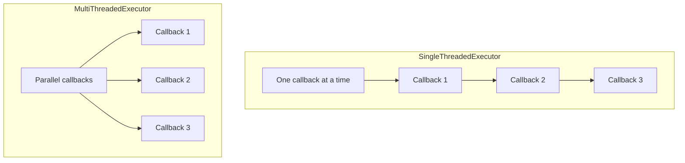

# Chapter 8: rclpy API Patterns and Best Practices

:::note Learning Objectives
By the end of this chapter, you will be able to:
- Understand the rclpy client library architecture
- Master node lifecycle and context management
- Implement robust callback patterns
- Use executors and callback groups effectively
- Apply best practices for production-quality ROS 2 Python code
:::

## Introduction to rclpy

**rclpy** (ROS Client Library for Python) is the official Python interface to ROS 2. It provides Pythonic abstractions over the underlying RCL (ROS Client Library) written in C:



## Node Lifecycle

Understanding the node lifecycle is essential for robust applications:



### Basic Node Pattern

```python title="basic_node.py"
#!/usr/bin/env python3
"""Basic rclpy node pattern."""

import rclpy
from rclpy.node import Node

class BasicNode(Node):
    """A basic ROS 2 node demonstrating lifecycle."""

    def __init__(self):
        super().__init__('basic_node')
        self.get_logger().info('Node initialized')

        # Declare parameters
        self.declare_parameter('update_rate', 10.0)

        # Create resources
        self.timer = self.create_timer(
            1.0 / self.get_parameter('update_rate').value,
            self.timer_callback
        )

    def timer_callback(self):
        """Timer callback - executed periodically."""
        self.get_logger().info('Timer fired')

def main(args=None):
    """Main entry point."""
    # Initialize rclpy context
    rclpy.init(args=args)

    try:
        # Create and spin node
        node = BasicNode()
        rclpy.spin(node)
    except KeyboardInterrupt:
        pass
    finally:
        # Cleanup
        if rclpy.ok():
            node.destroy_node()
            rclpy.shutdown()

if __name__ == '__main__':
    main()
```

## Context Management

Use context managers for proper resource cleanup:

```python title="context_managed_node.py"
#!/usr/bin/env python3
"""Node with proper context management."""

import rclpy
from rclpy.node import Node
from contextlib import contextmanager

class ManagedNode(Node):
    """Node with explicit resource management."""

    def __init__(self):
        super().__init__('managed_node')
        self._resources = []

    def register_resource(self, resource, cleanup_fn):
        """Register a resource for cleanup."""
        self._resources.append((resource, cleanup_fn))

    def cleanup(self):
        """Clean up all registered resources."""
        for resource, cleanup_fn in reversed(self._resources):
            try:
                cleanup_fn(resource)
            except Exception as e:
                self.get_logger().error(f'Cleanup error: {e}')

@contextmanager
def ros2_context(args=None):
    """Context manager for ROS 2 initialization."""
    rclpy.init(args=args)
    try:
        yield
    finally:
        if rclpy.ok():
            rclpy.shutdown()

@contextmanager
def node_context(node_class, *args, **kwargs):
    """Context manager for node lifecycle."""
    node = node_class(*args, **kwargs)
    try:
        yield node
    finally:
        node.destroy_node()

# Usage
def main():
    with ros2_context():
        with node_context(ManagedNode) as node:
            rclpy.spin(node)
```

## Executors and Callback Groups

Executors determine how callbacks are processed:



### Callback Groups

```python title="callback_groups_example.py"
#!/usr/bin/env python3
"""Demonstration of callback groups."""

import rclpy
from rclpy.node import Node
from rclpy.callback_groups import (
    MutuallyExclusiveCallbackGroup,
    ReentrantCallbackGroup
)
from rclpy.executors import MultiThreadedExecutor
from std_msgs.msg import String
import time

class CallbackGroupNode(Node):
    """Node demonstrating callback groups."""

    def __init__(self):
        super().__init__('callback_group_node')

        # Mutually exclusive group - only one callback runs at a time
        self.exclusive_group = MutuallyExclusiveCallbackGroup()

        # Reentrant group - callbacks can run in parallel
        self.reentrant_group = ReentrantCallbackGroup()

        # Timer in exclusive group
        self.timer1 = self.create_timer(
            1.0,
            self.exclusive_callback,
            callback_group=self.exclusive_group
        )

        # Another timer in same exclusive group
        self.timer2 = self.create_timer(
            1.0,
            self.another_exclusive_callback,
            callback_group=self.exclusive_group
        )

        # Subscription in reentrant group - can process in parallel
        self.subscription = self.create_subscription(
            String,
            'parallel_topic',
            self.parallel_callback,
            10,
            callback_group=self.reentrant_group
        )

        # Service in exclusive group - thread-safe
        self.service = self.create_service(
            # Service type would go here
            callback_group=self.exclusive_group
        )

    def exclusive_callback(self):
        """This callback runs exclusively."""
        self.get_logger().info('Exclusive callback 1 start')
        time.sleep(0.5)  # Simulates work
        self.get_logger().info('Exclusive callback 1 end')

    def another_exclusive_callback(self):
        """This waits for exclusive_callback to finish."""
        self.get_logger().info('Exclusive callback 2 start')
        time.sleep(0.5)
        self.get_logger().info('Exclusive callback 2 end')

    def parallel_callback(self, msg):
        """This can run in parallel with other reentrant callbacks."""
        self.get_logger().info(f'Parallel callback: {msg.data}')

def main(args=None):
    rclpy.init(args=args)

    node = CallbackGroupNode()

    # Use MultiThreadedExecutor to enable parallelism
    executor = MultiThreadedExecutor(num_threads=4)
    executor.add_node(node)

    try:
        executor.spin()
    finally:
        executor.shutdown()
        node.destroy_node()
        rclpy.shutdown()
```

## Publisher Patterns

### Robust Publisher Implementation

```python title="robust_publisher.py"
#!/usr/bin/env python3
"""Robust publisher patterns."""

import rclpy
from rclpy.node import Node
from rclpy.qos import (
    QoSProfile,
    QoSReliabilityPolicy,
    QoSHistoryPolicy,
    QoSDurabilityPolicy
)
from sensor_msgs.msg import JointState
from builtin_interfaces.msg import Time
import math

class RobustPublisher(Node):
    """Publisher with QoS and error handling."""

    def __init__(self):
        super().__init__('robust_publisher')

        # Define QoS profile for reliable delivery
        qos_reliable = QoSProfile(
            reliability=QoSReliabilityPolicy.RELIABLE,
            history=QoSHistoryPolicy.KEEP_LAST,
            depth=10,
            durability=QoSDurabilityPolicy.TRANSIENT_LOCAL
        )

        # Define QoS for sensor data (best effort)
        qos_sensor = QoSProfile(
            reliability=QoSReliabilityPolicy.BEST_EFFORT,
            history=QoSHistoryPolicy.KEEP_LAST,
            depth=1
        )

        # Publisher for joint states
        self.joint_pub = self.create_publisher(
            JointState,
            'joint_states',
            qos_reliable
        )

        # Timer for publishing
        self.declare_parameter('publish_rate', 100.0)
        rate = self.get_parameter('publish_rate').value
        self.timer = self.create_timer(1.0 / rate, self.publish_joint_state)

        # State tracking
        self.joint_names = ['shoulder', 'elbow', 'wrist']
        self.positions = [0.0, 0.0, 0.0]
        self.publish_count = 0

    def publish_joint_state(self):
        """Publish joint state message."""
        msg = JointState()

        # Set header with current time
        msg.header.stamp = self.get_clock().now().to_msg()
        msg.header.frame_id = 'base_link'

        # Set joint data
        msg.name = self.joint_names
        msg.position = self.positions
        msg.velocity = [0.0] * len(self.joint_names)
        msg.effort = [0.0] * len(self.joint_names)

        # Publish
        self.joint_pub.publish(msg)

        # Log periodically
        self.publish_count += 1
        if self.publish_count % 100 == 0:
            self.get_logger().debug(
                f'Published {self.publish_count} joint states'
            )

    def update_position(self, joint_index: int, position: float):
        """Update a joint position."""
        if 0 <= joint_index < len(self.positions):
            self.positions[joint_index] = position
        else:
            self.get_logger().warn(f'Invalid joint index: {joint_index}')
```

## Subscriber Patterns

### Thread-Safe Subscriber

```python title="thread_safe_subscriber.py"
#!/usr/bin/env python3
"""Thread-safe subscriber patterns."""

import rclpy
from rclpy.node import Node
from rclpy.qos import qos_profile_sensor_data
from sensor_msgs.msg import JointState
from threading import Lock
from typing import Optional
import copy

class ThreadSafeSubscriber(Node):
    """Subscriber with thread-safe data access."""

    def __init__(self):
        super().__init__('thread_safe_subscriber')

        # Thread-safe state storage
        self._lock = Lock()
        self._latest_msg: Optional[JointState] = None
        self._msg_count = 0

        # Create subscription
        self.subscription = self.create_subscription(
            JointState,
            'joint_states',
            self.joint_state_callback,
            qos_profile_sensor_data
        )

        # Processing timer
        self.timer = self.create_timer(0.1, self.process_latest)

    def joint_state_callback(self, msg: JointState):
        """Callback - store message thread-safely."""
        with self._lock:
            self._latest_msg = msg
            self._msg_count += 1

    def get_latest_joint_state(self) -> Optional[JointState]:
        """Thread-safe getter for latest message."""
        with self._lock:
            if self._latest_msg is None:
                return None
            return copy.deepcopy(self._latest_msg)

    def process_latest(self):
        """Process the latest joint state."""
        msg = self.get_latest_joint_state()
        if msg is None:
            return

        # Process the message
        for name, position in zip(msg.name, msg.position):
            self.get_logger().debug(f'{name}: {position:.3f}')

    @property
    def message_count(self) -> int:
        """Thread-safe message count getter."""
        with self._lock:
            return self._msg_count
```

## Async Patterns

Modern rclpy supports async/await patterns:

```python title="async_node.py"
#!/usr/bin/env python3
"""Async patterns in rclpy."""

import rclpy
from rclpy.node import Node
from rclpy.action import ActionClient
from rclpy.callback_groups import ReentrantCallbackGroup
from example_interfaces.srv import AddTwoInts
import asyncio

class AsyncNode(Node):
    """Node demonstrating async patterns."""

    def __init__(self):
        super().__init__('async_node')

        # Use reentrant group for async operations
        self.callback_group = ReentrantCallbackGroup()

        # Create service client
        self.add_client = self.create_client(
            AddTwoInts,
            'add_two_ints',
            callback_group=self.callback_group
        )

        # Timer to trigger async operations
        self.timer = self.create_timer(
            2.0,
            self.timer_callback,
            callback_group=self.callback_group
        )

    async def call_service_async(self, a: int, b: int) -> int:
        """Async service call."""
        # Wait for service
        while not self.add_client.wait_for_service(timeout_sec=1.0):
            self.get_logger().info('Waiting for service...')

        # Create and send request
        request = AddTwoInts.Request()
        request.a = a
        request.b = b

        # Await response
        future = self.add_client.call_async(request)
        response = await future

        return response.sum

    def timer_callback(self):
        """Timer callback that runs async operation."""
        # Create async task
        asyncio.ensure_future(self.async_operation())

    async def async_operation(self):
        """Async operation combining multiple calls."""
        try:
            result1 = await self.call_service_async(1, 2)
            result2 = await self.call_service_async(result1, 3)
            self.get_logger().info(f'Final result: {result2}')
        except Exception as e:
            self.get_logger().error(f'Async operation failed: {e}')
```

## Error Handling Best Practices

```python title="error_handling.py"
#!/usr/bin/env python3
"""Error handling best practices."""

import rclpy
from rclpy.node import Node
from rclpy.exceptions import (
    ParameterNotDeclaredException,
    InvalidParameterValueException
)
from std_msgs.msg import String
import traceback

class RobustErrorHandling(Node):
    """Node with comprehensive error handling."""

    def __init__(self):
        super().__init__('robust_error_handler')

        # Safe parameter access
        try:
            self.declare_parameter('critical_param', 'default')
        except Exception as e:
            self.get_logger().error(f'Parameter declaration failed: {e}')
            raise

        # Create subscription with error-wrapped callback
        self.subscription = self.create_subscription(
            String,
            'input_topic',
            self.safe_callback_wrapper(self.message_callback),
            10
        )

    def safe_callback_wrapper(self, callback):
        """Wrap callback with error handling."""
        def wrapper(msg):
            try:
                callback(msg)
            except Exception as e:
                self.get_logger().error(
                    f'Callback error: {e}\n{traceback.format_exc()}'
                )
        return wrapper

    def message_callback(self, msg: String):
        """Process incoming message."""
        # Validate message
        if not msg.data:
            self.get_logger().warn('Received empty message')
            return

        # Process with potential errors
        self.process_data(msg.data)

    def process_data(self, data: str):
        """Process data with error handling."""
        try:
            # Attempt processing
            result = self.risky_operation(data)
            self.get_logger().info(f'Processed: {result}')
        except ValueError as e:
            self.get_logger().warn(f'Invalid data format: {e}')
        except RuntimeError as e:
            self.get_logger().error(f'Processing failed: {e}')
            # Could trigger recovery behavior here

    def risky_operation(self, data: str) -> str:
        """Operation that might fail."""
        if len(data) < 3:
            raise ValueError('Data too short')
        return data.upper()

    def get_parameter_safe(self, name: str, default=None):
        """Safely get a parameter value."""
        try:
            return self.get_parameter(name).value
        except ParameterNotDeclaredException:
            self.get_logger().warn(
                f'Parameter {name} not declared, using default'
            )
            return default
```

## Performance Optimization

```python title="optimized_node.py"
#!/usr/bin/env python3
"""Performance-optimized node patterns."""

import rclpy
from rclpy.node import Node
from rclpy.qos import QoSProfile, QoSHistoryPolicy
from sensor_msgs.msg import Image
from cv_bridge import CvBridge
import numpy as np

class OptimizedNode(Node):
    """Performance-optimized ROS 2 node."""

    def __init__(self):
        super().__init__('optimized_node')

        # Pre-allocate message
        self._image_msg = Image()
        self._bridge = CvBridge()

        # Pre-allocate numpy array
        self._buffer = np.zeros((480, 640, 3), dtype=np.uint8)

        # Minimal QoS for high-frequency data
        qos = QoSProfile(
            history=QoSHistoryPolicy.KEEP_LAST,
            depth=1  # Only keep latest
        )

        self.publisher = self.create_publisher(Image, 'image', qos)

        # High-frequency timer
        self.timer = self.create_timer(0.01, self.publish_image)

        # Avoid repeated string creation
        self._log_interval = 100
        self._count = 0

    def publish_image(self):
        """Optimized image publishing."""
        # Update buffer in-place
        self._buffer[:] = np.random.randint(0, 255, self._buffer.shape)

        # Convert efficiently
        self._image_msg = self._bridge.cv2_to_imgmsg(self._buffer, 'bgr8')
        self._image_msg.header.stamp = self.get_clock().now().to_msg()

        self.publisher.publish(self._image_msg)

        # Throttled logging
        self._count += 1
        if self._count >= self._log_interval:
            self.get_logger().debug(f'Published {self._count} images')
            self._count = 0
```

## Summary

In this chapter, you learned:

- **rclpy architecture** and how it interfaces with RCL and DDS
- **Node lifecycle** management and context patterns
- **Executors** and **callback groups** for concurrency control
- **Publisher/subscriber patterns** with QoS configuration
- **Async patterns** for non-blocking operations
- **Error handling** best practices
- **Performance optimization** techniques

## Key Takeaways

:::tip Remember
1. Use **context managers** for proper resource cleanup
2. Choose **callback groups** based on thread-safety requirements
3. Use **MultiThreadedExecutor** when you need parallel callbacks
4. Always handle **exceptions** in callbacks to prevent node crashes
5. **Pre-allocate** messages and buffers for high-frequency publishing
:::

## Next Steps

In the next chapter, we will explore **URDF fundamentals**, learning how to describe robot geometry with links and joints.

---

## Exercises

1. Create a node that uses both mutually exclusive and reentrant callback groups
2. Implement a thread-safe state machine node
3. Build an async service client that chains multiple service calls
4. Create a high-performance image processing node with proper error handling
5. Implement a node with comprehensive logging at different severity levels
