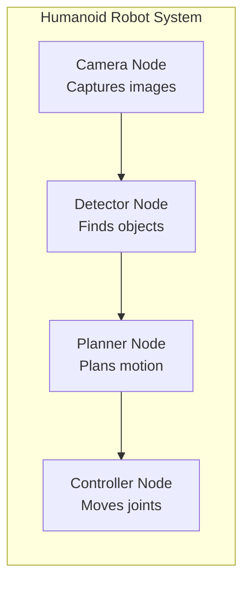
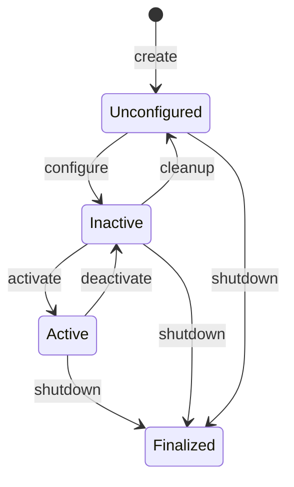
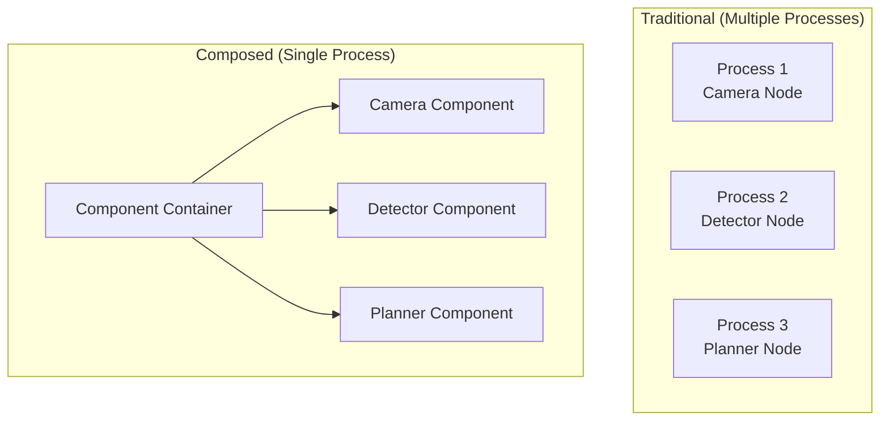

# Chapter 3: ROS 2 Nodes - Execution, Lifecycle, and Composition

:::note Learning Objectives
By the end of this chapter, you will be able to:
- Create basic ROS 2 nodes using Python (rclpy)
- Understand executors and callback groups
- Implement lifecycle nodes for managed state transitions
- Use node composition to run multiple nodes in one process
:::

## What is a Node?

A **node** is an executable process that performs a specific function in your robot system. Good node design follows the **single responsibility principle**—each node does one thing well.



## Creating Your First Node

### The Minimal Node

```python title="minimal_node.py"
#!/usr/bin/env python3
"""A minimal ROS 2 node that logs a message."""

import rclpy
from rclpy.node import Node

class MinimalNode(Node):
    """The simplest possible ROS 2 node."""

    def __init__(self):
        # Initialize the node with a unique name
        super().__init__('minimal_node')

        # Log that we're alive
        self.get_logger().info('Minimal node has started!')

def main(args=None):
    # Initialize the ROS 2 Python client library
    rclpy.init(args=args)

    # Create an instance of our node
    node = MinimalNode()

    # Spin the node so callbacks are processed
    rclpy.spin(node)

    # Clean shutdown
    node.destroy_node()
    rclpy.shutdown()

if __name__ == '__main__':
    main()
```

### Running the Node

```bash
# Make the script executable
chmod +x minimal_node.py

# Run directly (for development)
python3 minimal_node.py

# Or run via ros2 run (after building a package)
ros2 run my_package minimal_node
```

### Verify It's Running

```bash
# In another terminal
ros2 node list
# Output: /minimal_node

ros2 node info /minimal_node
# Shows publishers, subscribers, services, etc.
```

## Node with Timers

Most nodes need to do things periodically:

```python title="timer_node.py"
#!/usr/bin/env python3
"""A node that performs periodic tasks using timers."""

import rclpy
from rclpy.node import Node

class TimerNode(Node):
    """Demonstrates timer-based callbacks."""

    def __init__(self):
        super().__init__('timer_node')

        # Create a timer that fires every 0.5 seconds
        self.timer = self.create_timer(0.5, self.timer_callback)
        self.counter = 0

        self.get_logger().info('Timer node started')

    def timer_callback(self):
        """Called every 0.5 seconds."""
        self.counter += 1
        self.get_logger().info(f'Timer fired: count = {self.counter}')

def main(args=None):
    rclpy.init(args=args)
    node = TimerNode()
    rclpy.spin(node)
    node.destroy_node()
    rclpy.shutdown()

if __name__ == '__main__':
    main()
```

## Executors and Spinning

The **executor** is responsible for processing callbacks. When you call `rclpy.spin()`, it uses the default executor.

### Single-Threaded Executor (Default)

```python
# Default: callbacks execute sequentially
rclpy.spin(node)
```

### Multi-Threaded Executor

For concurrent callback execution:

```python title="multithreaded_node.py"
#!/usr/bin/env python3
"""Demonstrates multi-threaded execution."""

import rclpy
from rclpy.node import Node
from rclpy.executors import MultiThreadedExecutor
from rclpy.callback_groups import ReentrantCallbackGroup
import time

class MultiThreadedNode(Node):
    def __init__(self):
        super().__init__('multithreaded_node')

        # Reentrant callback group allows concurrent execution
        self.cb_group = ReentrantCallbackGroup()

        # Two timers that can run concurrently
        self.timer1 = self.create_timer(
            1.0, self.timer1_callback,
            callback_group=self.cb_group
        )
        self.timer2 = self.create_timer(
            1.0, self.timer2_callback,
            callback_group=self.cb_group
        )

    def timer1_callback(self):
        self.get_logger().info('Timer 1 start')
        time.sleep(2)  # Simulate work
        self.get_logger().info('Timer 1 end')

    def timer2_callback(self):
        self.get_logger().info('Timer 2 start')
        time.sleep(2)  # Simulate work
        self.get_logger().info('Timer 2 end')

def main(args=None):
    rclpy.init(args=args)
    node = MultiThreadedNode()

    # Use multi-threaded executor
    executor = MultiThreadedExecutor()
    executor.add_node(node)

    try:
        executor.spin()
    finally:
        node.destroy_node()
        rclpy.shutdown()

if __name__ == '__main__':
    main()
```

### Callback Groups

| Type | Behavior | Use Case |
|------|----------|----------|
| `MutuallyExclusiveCallbackGroup` | One callback at a time | Thread-unsafe code |
| `ReentrantCallbackGroup` | Concurrent execution | Independent callbacks |

## Lifecycle Nodes

**Lifecycle nodes** have managed states, enabling controlled startup and shutdown—critical for robots that need safe initialization.



### Implementing a Lifecycle Node

```python title="lifecycle_camera_node.py"
#!/usr/bin/env python3
"""A lifecycle node for camera management."""

import rclpy
from rclpy.lifecycle import Node as LifecycleNode
from rclpy.lifecycle import State, TransitionCallbackReturn
from sensor_msgs.msg import Image

class LifecycleCameraNode(LifecycleNode):
    """Camera node with managed lifecycle."""

    def __init__(self):
        super().__init__('lifecycle_camera')
        self.publisher = None
        self.timer = None
        self.get_logger().info('Lifecycle camera node created (Unconfigured)')

    def on_configure(self, state: State) -> TransitionCallbackReturn:
        """Configure the node - allocate resources."""
        self.get_logger().info('Configuring...')

        # Create publisher (but don't activate yet)
        self.publisher = self.create_lifecycle_publisher(
            Image,
            'camera/image_raw',
            10
        )

        self.get_logger().info('Configured successfully')
        return TransitionCallbackReturn.SUCCESS

    def on_activate(self, state: State) -> TransitionCallbackReturn:
        """Activate the node - start publishing."""
        self.get_logger().info('Activating...')

        # Start the camera capture timer
        self.timer = self.create_timer(0.033, self.capture_callback)  # ~30 FPS

        self.get_logger().info('Activated - publishing images')
        return super().on_activate(state)

    def on_deactivate(self, state: State) -> TransitionCallbackReturn:
        """Deactivate the node - stop publishing."""
        self.get_logger().info('Deactivating...')

        # Stop the timer
        if self.timer:
            self.timer.cancel()

        self.get_logger().info('Deactivated')
        return super().on_deactivate(state)

    def on_cleanup(self, state: State) -> TransitionCallbackReturn:
        """Cleanup resources."""
        self.get_logger().info('Cleaning up...')

        # Release resources
        self.publisher = None
        self.timer = None

        self.get_logger().info('Cleanup complete')
        return TransitionCallbackReturn.SUCCESS

    def on_shutdown(self, state: State) -> TransitionCallbackReturn:
        """Handle shutdown from any state."""
        self.get_logger().info('Shutting down...')
        return TransitionCallbackReturn.SUCCESS

    def capture_callback(self):
        """Capture and publish an image."""
        if self.publisher.is_activated:
            msg = Image()
            # In real code, fill with camera data
            msg.header.stamp = self.get_clock().now().to_msg()
            self.publisher.publish(msg)

def main(args=None):
    rclpy.init(args=args)
    node = LifecycleCameraNode()
    rclpy.spin(node)
    node.destroy_node()
    rclpy.shutdown()

if __name__ == '__main__':
    main()
```

### Managing Lifecycle Nodes

```bash
# List lifecycle nodes
ros2 lifecycle nodes

# Get current state
ros2 lifecycle get /lifecycle_camera

# Trigger transitions
ros2 lifecycle set /lifecycle_camera configure
ros2 lifecycle set /lifecycle_camera activate
ros2 lifecycle set /lifecycle_camera deactivate
ros2 lifecycle set /lifecycle_camera cleanup
```

## Node Composition

**Composition** runs multiple nodes in a single process, reducing overhead:



### Creating a Composable Node

```python title="composable_camera.py"
#!/usr/bin/env python3
"""A composable camera node."""

import rclpy
from rclpy.node import Node
from sensor_msgs.msg import Image

class ComposableCamera(Node):
    """Camera node designed for composition."""

    def __init__(self, node_name='composable_camera', **kwargs):
        super().__init__(node_name, **kwargs)

        self.publisher = self.create_publisher(Image, 'camera/image_raw', 10)
        self.timer = self.create_timer(0.033, self.capture_callback)

        self.get_logger().info('Composable camera started')

    def capture_callback(self):
        msg = Image()
        msg.header.stamp = self.get_clock().now().to_msg()
        self.publisher.publish(msg)

def main(args=None):
    rclpy.init(args=args)
    node = ComposableCamera()
    rclpy.spin(node)
    node.destroy_node()
    rclpy.shutdown()

if __name__ == '__main__':
    main()
```

### Loading Components

```bash
# Start the component container
ros2 run rclcpp_components component_container

# Load components dynamically
ros2 component load /ComponentManager my_package ComposableCamera
ros2 component load /ComponentManager my_package ComposableDetector

# List loaded components
ros2 component list
```

## Node Parameters

Nodes can declare and use parameters for runtime configuration:

```python title="parameterized_node.py"
#!/usr/bin/env python3
"""A node with configurable parameters."""

import rclpy
from rclpy.node import Node
from rcl_interfaces.msg import ParameterDescriptor

class ParameterizedNode(Node):
    def __init__(self):
        super().__init__('parameterized_node')

        # Declare parameters with descriptions
        self.declare_parameter(
            'update_rate',
            10.0,
            ParameterDescriptor(description='Publishing rate in Hz')
        )
        self.declare_parameter(
            'robot_name',
            'humanoid',
            ParameterDescriptor(description='Name of the robot')
        )

        # Get parameter values
        rate = self.get_parameter('update_rate').value
        name = self.get_parameter('robot_name').value

        self.get_logger().info(f'Robot {name} running at {rate} Hz')

        # Create timer using parameter
        period = 1.0 / rate
        self.timer = self.create_timer(period, self.timer_callback)

    def timer_callback(self):
        self.get_logger().info('Tick')

def main(args=None):
    rclpy.init(args=args)
    node = ParameterizedNode()
    rclpy.spin(node)
    node.destroy_node()
    rclpy.shutdown()

if __name__ == '__main__':
    main()
```

### Setting Parameters

```bash
# Set parameter at launch
ros2 run my_package parameterized_node --ros-args -p update_rate:=20.0

# Set parameter at runtime
ros2 param set /parameterized_node update_rate 5.0

# Get parameter value
ros2 param get /parameterized_node robot_name
```

## Best Practices

### 1. Node Naming

```python
# Good: descriptive, namespaced
super().__init__('left_arm_controller')

# Bad: generic, ambiguous
super().__init__('node1')
```

### 2. Logger Usage

```python
# Use appropriate log levels
self.get_logger().debug('Detailed debug info')
self.get_logger().info('Normal operation')
self.get_logger().warn('Something unusual')
self.get_logger().error('Something failed')
self.get_logger().fatal('Unrecoverable error')
```

### 3. Clean Shutdown

```python
def main():
    rclpy.init()
    node = MyNode()

    try:
        rclpy.spin(node)
    except KeyboardInterrupt:
        pass
    finally:
        node.destroy_node()
        rclpy.shutdown()
```

## Summary

In this chapter, you learned:

- ✅ Nodes are the basic building blocks of ROS 2 systems
- ✅ Timers enable periodic execution of callbacks
- ✅ Executors control how callbacks are processed
- ✅ Lifecycle nodes provide managed state transitions
- ✅ Composition reduces resource usage by sharing processes

## Key Takeaways

:::tip Remember
1. **One node, one responsibility** - keep nodes focused
2. **Use lifecycle nodes** for components that need controlled initialization
3. **Consider composition** when running many nodes on resource-limited hardware
4. **Always clean up** - destroy nodes and shutdown rclpy properly
:::

## Next Steps

In the next chapter, we'll learn about **topics and publish-subscribe communication**, the primary way nodes exchange data in ROS 2.

---

## Exercises

1. **Basic Node**: Create a node that prints the current time every second
2. **Multi-Timer**: Create a node with two timers running at different rates
3. **Lifecycle**: Implement a lifecycle node that simulates sensor initialization
4. **Parameters**: Create a node with parameters for min/max joint angles
