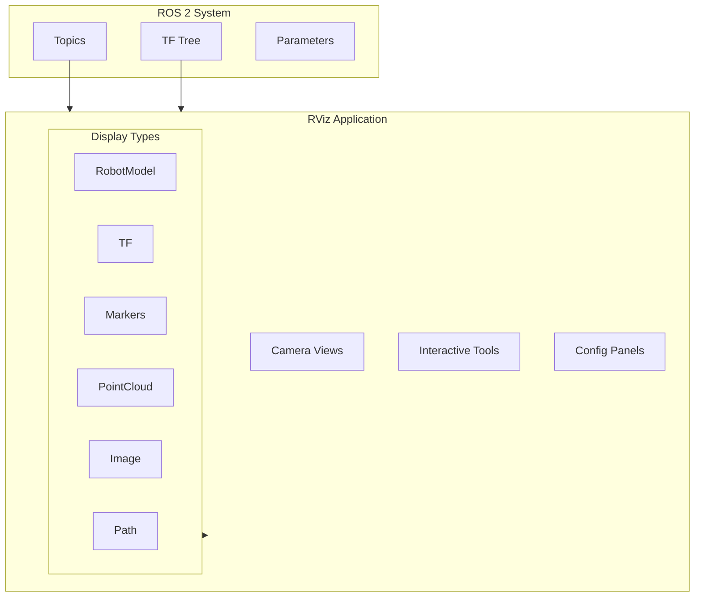
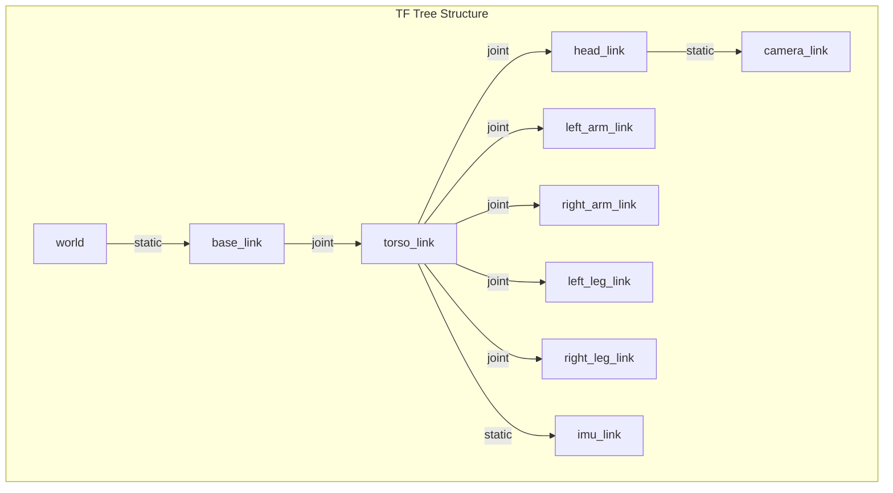

# Chapter 11: RViz Visualization and TF Tree

:::note Learning Objectives
By the end of this chapter, you will be able to:
- Understand the role of RViz in robot development
- Configure RViz displays for robot visualization
- Work with the TF tree and coordinate frames
- Visualize sensor data, robot state, and planning results
- Create and save RViz configurations
:::

## What is RViz?

**RViz** (ROS Visualization) is the primary 3D visualization tool for ROS 2. It displays robot state, sensor data, and planning results in real-time:



| Feature | Description |
|---------|-------------|
| **RobotModel** | Visualize URDF with joint states |
| **TF** | View coordinate frame tree |
| **Sensors** | Point clouds, images, laser scans |
| **Planning** | Paths, trajectories, goals |
| **Markers** | Custom visualizations |
| **Interactive** | Click-and-drag tools |

## Launching RViz

```bash
# Basic launch
rviz2

# With a configuration file
rviz2 -d path/to/config.rviz

# From a launch file (recommended)
ros2 launch my_robot_description display.launch.py
```

### Display Launch File

```python title="launch/display.launch.py"
#!/usr/bin/env python3
"""Launch file for robot visualization in RViz."""

from launch import LaunchDescription
from launch.actions import DeclareLaunchArgument
from launch.substitutions import (
    LaunchConfiguration,
    PathJoinSubstitution,
    Command
)
from launch_ros.actions import Node
from launch_ros.substitutions import FindPackageShare

def generate_launch_description():
    """Generate launch description for RViz display."""

    pkg_share = FindPackageShare('humanoid_description')

    # Launch arguments
    use_sim_time_arg = DeclareLaunchArgument(
        'use_sim_time',
        default_value='false'
    )

    rviz_config_arg = DeclareLaunchArgument(
        'rviz_config',
        default_value=PathJoinSubstitution([
            pkg_share, 'config', 'display.rviz'
        ])
    )

    # Robot description from xacro
    robot_description = Command([
        'xacro ',
        PathJoinSubstitution([pkg_share, 'urdf', 'humanoid.urdf.xacro'])
    ])

    # Robot state publisher - publishes TF from joint states
    robot_state_publisher = Node(
        package='robot_state_publisher',
        executable='robot_state_publisher',
        name='robot_state_publisher',
        output='screen',
        parameters=[{
            'robot_description': robot_description,
            'use_sim_time': LaunchConfiguration('use_sim_time')
        }]
    )

    # Joint state publisher GUI - interactive joint control
    joint_state_publisher_gui = Node(
        package='joint_state_publisher_gui',
        executable='joint_state_publisher_gui',
        name='joint_state_publisher_gui',
        output='screen'
    )

    # RViz
    rviz = Node(
        package='rviz2',
        executable='rviz2',
        name='rviz2',
        output='screen',
        arguments=['-d', LaunchConfiguration('rviz_config')]
    )

    return LaunchDescription([
        use_sim_time_arg,
        rviz_config_arg,
        robot_state_publisher,
        joint_state_publisher_gui,
        rviz
    ])
```

## Understanding the TF Tree

**TF (Transform)** is the coordinate frame system in ROS 2. It maintains the spatial relationships between all parts of the robot:



### TF Publishers

```python title="tf_broadcaster_example.py"
#!/usr/bin/env python3
"""Example of TF broadcasting in ROS 2."""

import rclpy
from rclpy.node import Node
from tf2_ros import TransformBroadcaster, StaticTransformBroadcaster
from geometry_msgs.msg import TransformStamped
import math

class TFBroadcasterNode(Node):
    """Node that broadcasts TF transforms."""

    def __init__(self):
        super().__init__('tf_broadcaster')

        # Dynamic transform broadcaster
        self.tf_broadcaster = TransformBroadcaster(self)

        # Static transform broadcaster (for fixed frames)
        self.static_broadcaster = StaticTransformBroadcaster(self)

        # Publish static transforms once
        self.publish_static_transforms()

        # Timer for dynamic transforms
        self.timer = self.create_timer(0.02, self.broadcast_transforms)

        self.angle = 0.0

    def publish_static_transforms(self):
        """Publish static (fixed) transforms."""
        transforms = []

        # Camera to head (fixed mount)
        camera_tf = TransformStamped()
        camera_tf.header.stamp = self.get_clock().now().to_msg()
        camera_tf.header.frame_id = 'head_link'
        camera_tf.child_frame_id = 'camera_link'
        camera_tf.transform.translation.x = 0.05
        camera_tf.transform.translation.y = 0.0
        camera_tf.transform.translation.z = 0.02
        camera_tf.transform.rotation.w = 1.0
        transforms.append(camera_tf)

        # IMU to torso (fixed mount)
        imu_tf = TransformStamped()
        imu_tf.header.stamp = self.get_clock().now().to_msg()
        imu_tf.header.frame_id = 'torso_link'
        imu_tf.child_frame_id = 'imu_link'
        imu_tf.transform.translation.x = 0.0
        imu_tf.transform.translation.y = 0.0
        imu_tf.transform.translation.z = 0.1
        imu_tf.transform.rotation.w = 1.0
        transforms.append(imu_tf)

        self.static_broadcaster.sendTransform(transforms)
        self.get_logger().info('Published static transforms')

    def broadcast_transforms(self):
        """Broadcast dynamic transforms."""
        # Example: rotating joint
        t = TransformStamped()
        t.header.stamp = self.get_clock().now().to_msg()
        t.header.frame_id = 'base_link'
        t.child_frame_id = 'rotating_part'

        t.transform.translation.x = 0.0
        t.transform.translation.y = 0.0
        t.transform.translation.z = 0.5

        # Rotation quaternion from angle
        t.transform.rotation.x = 0.0
        t.transform.rotation.y = 0.0
        t.transform.rotation.z = math.sin(self.angle / 2)
        t.transform.rotation.w = math.cos(self.angle / 2)

        self.tf_broadcaster.sendTransform(t)
        self.angle += 0.02

def main(args=None):
    rclpy.init(args=args)
    node = TFBroadcasterNode()
    rclpy.spin(node)
    node.destroy_node()
    rclpy.shutdown()
```

### TF Listener

```python title="tf_listener_example.py"
#!/usr/bin/env python3
"""Example of listening to TF transforms."""

import rclpy
from rclpy.node import Node
from tf2_ros import Buffer, TransformListener
from tf2_ros.transform_listener import TransformException
from geometry_msgs.msg import PointStamped
import tf2_geometry_msgs

class TFListenerNode(Node):
    """Node that listens to TF transforms."""

    def __init__(self):
        super().__init__('tf_listener')

        # TF buffer and listener
        self.tf_buffer = Buffer()
        self.tf_listener = TransformListener(self.tf_buffer, self)

        # Timer to query transforms
        self.timer = self.create_timer(0.5, self.lookup_transform)

    def lookup_transform(self):
        """Look up transform between frames."""
        try:
            # Get transform from camera to base_link
            transform = self.tf_buffer.lookup_transform(
                'base_link',      # Target frame
                'camera_link',    # Source frame
                rclpy.time.Time() # Latest available
            )

            self.get_logger().info(
                f'Camera position in base_link: '
                f'x={transform.transform.translation.x:.3f}, '
                f'y={transform.transform.translation.y:.3f}, '
                f'z={transform.transform.translation.z:.3f}'
            )

        except TransformException as ex:
            self.get_logger().warn(f'Could not get transform: {ex}')

    def transform_point(self, point_in_camera):
        """Transform a point from camera frame to base frame."""
        try:
            # Create stamped point in camera frame
            point_stamped = PointStamped()
            point_stamped.header.frame_id = 'camera_link'
            point_stamped.header.stamp = self.get_clock().now().to_msg()
            point_stamped.point = point_in_camera

            # Transform to base_link
            point_in_base = self.tf_buffer.transform(
                point_stamped,
                'base_link'
            )

            return point_in_base.point

        except TransformException as ex:
            self.get_logger().error(f'Transform failed: {ex}')
            return None
```

## RViz Display Types

### RobotModel Display

Visualizes the URDF model with current joint states:

```yaml title="RobotModel Configuration"
# In RViz, add RobotModel display with:
Description Topic: /robot_description
TF Prefix: ""  # Or robot namespace
Alpha: 1.0
Visual Enabled: true
Collision Enabled: false
```

### TF Display

Shows coordinate frames and their relationships:

```yaml title="TF Display Configuration"
Show Names: true
Show Axes: true
Show Arrows: true
Marker Scale: 0.5
Frame Timeout: 15.0
Frames:
  All Enabled: true
  # Or selectively enable frames
```

### Sensor Displays

```python title="nodes/sensor_visualizer.py"
#!/usr/bin/env python3
"""Node publishing sensor data for RViz visualization."""

import rclpy
from rclpy.node import Node
from sensor_msgs.msg import PointCloud2, Image, LaserScan
from visualization_msgs.msg import Marker, MarkerArray
import numpy as np

class SensorVisualizer(Node):
    """Publishes sensor data for RViz."""

    def __init__(self):
        super().__init__('sensor_visualizer')

        # Publishers for different sensor types
        self.marker_pub = self.create_publisher(
            MarkerArray, 'visualization_markers', 10
        )

        self.timer = self.create_timer(0.1, self.publish_markers)

    def publish_markers(self):
        """Publish visualization markers."""
        markers = MarkerArray()

        # Sphere marker for detected object
        sphere = Marker()
        sphere.header.frame_id = 'camera_link'
        sphere.header.stamp = self.get_clock().now().to_msg()
        sphere.ns = 'detections'
        sphere.id = 0
        sphere.type = Marker.SPHERE
        sphere.action = Marker.ADD
        sphere.pose.position.x = 1.0
        sphere.pose.position.y = 0.0
        sphere.pose.position.z = 0.0
        sphere.pose.orientation.w = 1.0
        sphere.scale.x = 0.1
        sphere.scale.y = 0.1
        sphere.scale.z = 0.1
        sphere.color.r = 1.0
        sphere.color.g = 0.0
        sphere.color.b = 0.0
        sphere.color.a = 1.0
        markers.markers.append(sphere)

        # Arrow marker for direction
        arrow = Marker()
        arrow.header.frame_id = 'base_link'
        arrow.header.stamp = self.get_clock().now().to_msg()
        arrow.ns = 'directions'
        arrow.id = 1
        arrow.type = Marker.ARROW
        arrow.action = Marker.ADD
        arrow.pose.position.x = 0.0
        arrow.pose.position.y = 0.0
        arrow.pose.position.z = 1.0
        arrow.pose.orientation.w = 1.0
        arrow.scale.x = 0.5  # Length
        arrow.scale.y = 0.05  # Width
        arrow.scale.z = 0.05  # Height
        arrow.color.r = 0.0
        arrow.color.g = 1.0
        arrow.color.b = 0.0
        arrow.color.a = 1.0
        markers.markers.append(arrow)

        # Text marker
        text = Marker()
        text.header.frame_id = 'head_link'
        text.header.stamp = self.get_clock().now().to_msg()
        text.ns = 'labels'
        text.id = 2
        text.type = Marker.TEXT_VIEW_FACING
        text.action = Marker.ADD
        text.pose.position.z = 0.3
        text.text = 'Humanoid Robot'
        text.scale.z = 0.1  # Text height
        text.color.r = 1.0
        text.color.g = 1.0
        text.color.b = 1.0
        text.color.a = 1.0
        markers.markers.append(text)

        self.marker_pub.publish(markers)
```

## RViz Configuration File

Save your RViz setup to a configuration file:

```yaml title="config/humanoid.rviz"
Panels:
  - Class: rviz_common/Displays
    Name: Displays
  - Class: rviz_common/Views
    Name: Views

Visualization Manager:
  Class: ""
  Displays:
    - Class: rviz_default_plugins/Grid
      Name: Grid
      Enabled: true
      Line Style:
        Value: Lines
      Normal Cell Count: 0
      Cell Size: 1
      Plane: XY
      Plane Cell Count: 10
      Reference Frame: <Fixed Frame>
      Color: 160; 160; 164

    - Class: rviz_default_plugins/RobotModel
      Name: RobotModel
      Enabled: true
      Description Topic:
        Value: /robot_description
      Alpha: 1
      Visual Enabled: true
      Collision Enabled: false

    - Class: rviz_default_plugins/TF
      Name: TF
      Enabled: true
      Show Names: true
      Show Axes: true
      Show Arrows: false
      Marker Scale: 0.3

    - Class: rviz_default_plugins/MarkerArray
      Name: Markers
      Enabled: true
      Topic:
        Value: /visualization_markers

  Global Options:
    Background Color: 48; 48; 48
    Fixed Frame: base_link
    Frame Rate: 30

  Tools:
    - Class: rviz_default_plugins/Interact
    - Class: rviz_default_plugins/MoveCamera
    - Class: rviz_default_plugins/Select
    - Class: rviz_default_plugins/FocusCamera
    - Class: rviz_default_plugins/Measure
    - Class: rviz_default_plugins/SetInitialPose
    - Class: rviz_default_plugins/SetGoal
    - Class: rviz_default_plugins/PublishPoint

  Views:
    Current:
      Class: rviz_default_plugins/Orbit
      Distance: 3
      Focal Point:
        X: 0
        Y: 0
        Z: 0.5
      Focal Shape Size: 0.05
      Near Clip Distance: 0.01
      Pitch: 0.5
      Target Frame: base_link
      Yaw: 0.8

Window Geometry:
  Width: 1920
  Height: 1080
  X: 0
  Y: 0
```

## Interactive Markers

Create clickable, draggable markers:

```python title="nodes/interactive_marker_node.py"
#!/usr/bin/env python3
"""Interactive markers for RViz."""

import rclpy
from rclpy.node import Node
from interactive_markers import InteractiveMarkerServer
from visualization_msgs.msg import (
    InteractiveMarker,
    InteractiveMarkerControl,
    InteractiveMarkerFeedback,
    Marker
)

class InteractiveMarkerNode(Node):
    """Node providing interactive markers."""

    def __init__(self):
        super().__init__('interactive_marker_node')

        # Create interactive marker server
        self.server = InteractiveMarkerServer(self, 'humanoid_markers')

        # Create markers
        self.create_target_marker()

        # Apply changes
        self.server.applyChanges()

    def create_target_marker(self):
        """Create a 6-DOF target marker."""
        int_marker = InteractiveMarker()
        int_marker.header.frame_id = 'base_link'
        int_marker.name = 'target_pose'
        int_marker.description = 'Target Pose'
        int_marker.scale = 0.2

        # Position
        int_marker.pose.position.x = 0.5
        int_marker.pose.position.y = 0.0
        int_marker.pose.position.z = 0.5
        int_marker.pose.orientation.w = 1.0

        # Visual marker
        box_marker = Marker()
        box_marker.type = Marker.CUBE
        box_marker.scale.x = 0.1
        box_marker.scale.y = 0.1
        box_marker.scale.z = 0.1
        box_marker.color.r = 0.0
        box_marker.color.g = 0.5
        box_marker.color.b = 1.0
        box_marker.color.a = 1.0

        # Non-interactive control for visual
        box_control = InteractiveMarkerControl()
        box_control.always_visible = True
        box_control.markers.append(box_marker)
        int_marker.controls.append(box_control)

        # Add 6-DOF controls
        self.add_6dof_controls(int_marker)

        # Add to server with callback
        self.server.insert(
            int_marker,
            feedback_callback=self.marker_callback
        )

    def add_6dof_controls(self, int_marker):
        """Add 6-DOF movement controls."""
        # X-axis translation and rotation
        control = InteractiveMarkerControl()
        control.orientation.w = 1.0
        control.orientation.x = 1.0
        control.name = 'rotate_x'
        control.interaction_mode = InteractiveMarkerControl.ROTATE_AXIS
        int_marker.controls.append(control)

        control = InteractiveMarkerControl()
        control.orientation.w = 1.0
        control.orientation.x = 1.0
        control.name = 'move_x'
        control.interaction_mode = InteractiveMarkerControl.MOVE_AXIS
        int_marker.controls.append(control)

        # Y-axis
        control = InteractiveMarkerControl()
        control.orientation.w = 1.0
        control.orientation.y = 1.0
        control.name = 'rotate_y'
        control.interaction_mode = InteractiveMarkerControl.ROTATE_AXIS
        int_marker.controls.append(control)

        control = InteractiveMarkerControl()
        control.orientation.w = 1.0
        control.orientation.y = 1.0
        control.name = 'move_y'
        control.interaction_mode = InteractiveMarkerControl.MOVE_AXIS
        int_marker.controls.append(control)

        # Z-axis
        control = InteractiveMarkerControl()
        control.orientation.w = 1.0
        control.orientation.z = 1.0
        control.name = 'rotate_z'
        control.interaction_mode = InteractiveMarkerControl.ROTATE_AXIS
        int_marker.controls.append(control)

        control = InteractiveMarkerControl()
        control.orientation.w = 1.0
        control.orientation.z = 1.0
        control.name = 'move_z'
        control.interaction_mode = InteractiveMarkerControl.MOVE_AXIS
        int_marker.controls.append(control)

    def marker_callback(self, feedback):
        """Handle interactive marker feedback."""
        if feedback.event_type == InteractiveMarkerFeedback.POSE_UPDATE:
            self.get_logger().info(
                f'Target moved to: '
                f'({feedback.pose.position.x:.2f}, '
                f'{feedback.pose.position.y:.2f}, '
                f'{feedback.pose.position.z:.2f})'
            )

        self.server.applyChanges()

def main(args=None):
    rclpy.init(args=args)
    node = InteractiveMarkerNode()
    rclpy.spin(node)
    node.destroy_node()
    rclpy.shutdown()
```

## Debugging with TF

```bash
# View TF tree as PDF
ros2 run tf2_tools view_frames

# Echo transform between frames
ros2 run tf2_ros tf2_echo base_link camera_link

# Monitor TF for issues
ros2 run tf2_ros tf2_monitor

# List all frames
ros2 run tf2_tools view_frames && evince frames.pdf
```

## Summary

In this chapter, you learned:

- **RViz** is essential for robot development and debugging
- The **TF tree** maintains coordinate frame relationships
- How to **broadcast and listen** to TF transforms
- Configure various **display types** in RViz
- Create **visualization markers** for custom data
- Use **interactive markers** for user input
- Save and load **RViz configurations**

## Key Takeaways

:::tip Remember
1. **RViz** connects to ROS topics - no special data format needed
2. **TF** is the backbone of spatial reasoning in ROS 2
3. Use **static_transform_publisher** for fixed sensor mounts
4. **Save RViz configs** for reproducible visualization setups
5. **Markers** allow custom visualization of any data
:::

## Next Steps

In the next chapter, we will build a **mini-project for joint control**, applying everything we have learned to create an interactive humanoid joint controller.

---

## Exercises

1. Create a launch file that starts robot_state_publisher and RViz
2. Add displays for point cloud and camera image topics
3. Write a node that publishes trajectory markers
4. Create interactive markers for setting robot goals
5. Build a custom RViz panel plugin (advanced)
