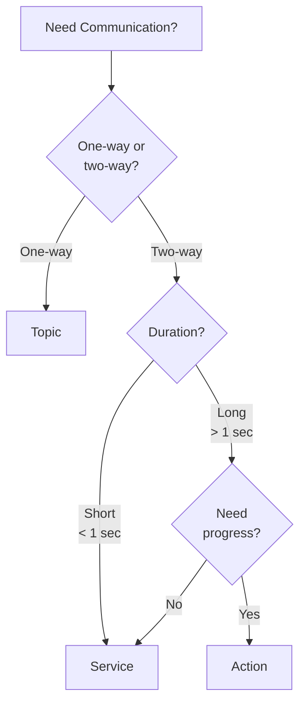
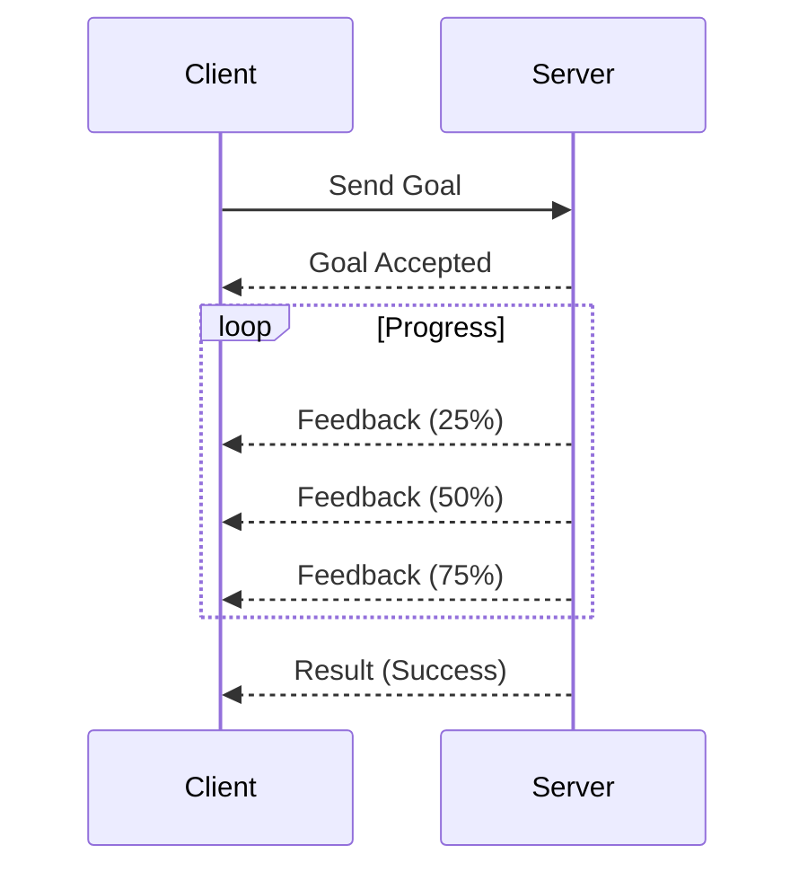

# Chapter 5: Services & Actions

:::note Learning Objectives
By the end of this chapter, you will be able to:
- Implement service servers and clients for synchronous operations
- Create action servers for long-running tasks with feedback
- Choose between topics, services, and actions for different use cases
- Handle errors and timeouts gracefully
:::

## When to Use What?



| Pattern | Use Case | Example |
|---------|----------|---------|
| **Topic** | Streaming data | Camera frames, joint states |
| **Service** | Quick request-response | Get robot state, enable motor |
| **Action** | Long tasks with feedback | Navigate to goal, move arm |

## Services: Request-Response

Services follow a **client-server** model: the client sends a request and waits for a response.

### Service Definition

```text title="srv/GetJointLimits.srv"
# Request
string joint_name
---
# Response
bool success
float64 lower_limit
float64 upper_limit
string message
```

### Service Server

```python title="joint_limits_server.py"
#!/usr/bin/env python3
"""Service server that returns joint limits."""

import rclpy
from rclpy.node import Node
from humanoid_msgs.srv import GetJointLimits

class JointLimitsServer(Node):
    def __init__(self):
        super().__init__('joint_limits_server')

        # Joint limits database
        self.joint_limits = {
            'shoulder_pitch': (-1.57, 1.57),
            'shoulder_roll': (-0.5, 1.5),
            'shoulder_yaw': (-1.0, 1.0),
            'elbow_pitch': (0.0, 2.5),
            'wrist_roll': (-1.57, 1.57),
            'wrist_pitch': (-0.5, 0.5),
            'gripper': (0.0, 1.0)
        }

        # Create service
        self.service = self.create_service(
            GetJointLimits,
            'get_joint_limits',
            self.handle_get_limits
        )

        self.get_logger().info('Joint limits server ready')

    def handle_get_limits(self, request, response):
        """Handle incoming service requests."""
        joint_name = request.joint_name

        if joint_name in self.joint_limits:
            lower, upper = self.joint_limits[joint_name]
            response.success = True
            response.lower_limit = lower
            response.upper_limit = upper
            response.message = f'Limits for {joint_name}'
            self.get_logger().info(f'Returned limits for {joint_name}')
        else:
            response.success = False
            response.lower_limit = 0.0
            response.upper_limit = 0.0
            response.message = f'Unknown joint: {joint_name}'
            self.get_logger().warn(f'Unknown joint requested: {joint_name}')

        return response

def main(args=None):
    rclpy.init(args=args)
    node = JointLimitsServer()
    rclpy.spin(node)
    node.destroy_node()
    rclpy.shutdown()

if __name__ == '__main__':
    main()
```

### Service Client

```python title="joint_limits_client.py"
#!/usr/bin/env python3
"""Service client that queries joint limits."""

import rclpy
from rclpy.node import Node
from humanoid_msgs.srv import GetJointLimits

class JointLimitsClient(Node):
    def __init__(self):
        super().__init__('joint_limits_client')

        # Create client
        self.client = self.create_client(
            GetJointLimits,
            'get_joint_limits'
        )

        # Wait for service to be available
        while not self.client.wait_for_service(timeout_sec=1.0):
            self.get_logger().info('Waiting for service...')

        self.get_logger().info('Service available')

    def get_limits(self, joint_name: str):
        """Query limits for a joint."""
        request = GetJointLimits.Request()
        request.joint_name = joint_name

        # Call service asynchronously
        future = self.client.call_async(request)

        # Wait for response
        rclpy.spin_until_future_complete(self, future)

        return future.result()

def main(args=None):
    rclpy.init(args=args)
    client = JointLimitsClient()

    # Query some joints
    joints_to_query = ['shoulder_pitch', 'elbow_pitch', 'unknown_joint']

    for joint in joints_to_query:
        result = client.get_limits(joint)
        if result.success:
            print(f'{joint}: [{result.lower_limit:.2f}, {result.upper_limit:.2f}]')
        else:
            print(f'{joint}: {result.message}')

    client.destroy_node()
    rclpy.shutdown()

if __name__ == '__main__':
    main()
```

### Service CLI Tools

```bash
# List available services
ros2 service list

# Show service type
ros2 service type /get_joint_limits

# Call a service
ros2 service call /get_joint_limits humanoid_msgs/srv/GetJointLimits \
  "{joint_name: 'elbow_pitch'}"
```

## Actions: Long-Running Tasks

Actions are for tasks that take time and benefit from progress feedback.



### Action Definition

```text title="action/MoveArm.action"
# Goal
string target_pose_name
float64 max_velocity
---
# Result
bool success
float64 final_error
string message
---
# Feedback
float64 progress_percentage
float64 current_error
string status
```

### Action Server

```python title="move_arm_server.py"
#!/usr/bin/env python3
"""Action server for arm movement."""

import rclpy
from rclpy.node import Node
from rclpy.action import ActionServer, GoalResponse, CancelResponse
from rclpy.callback_groups import ReentrantCallbackGroup
from humanoid_msgs.action import MoveArm
import time

class MoveArmServer(Node):
    def __init__(self):
        super().__init__('move_arm_server')

        self._action_server = ActionServer(
            self,
            MoveArm,
            'move_arm',
            execute_callback=self.execute_callback,
            goal_callback=self.goal_callback,
            cancel_callback=self.cancel_callback,
            callback_group=ReentrantCallbackGroup()
        )

        # Predefined poses
        self.poses = {
            'home': [0.0, 0.0, 0.0, 0.0, 0.0, 0.0],
            'ready': [0.5, 0.3, 0.0, 1.2, 0.0, 0.0],
            'extended': [1.0, 0.0, 0.0, 0.0, 0.0, 0.0]
        }

        self.get_logger().info('Move arm action server ready')

    def goal_callback(self, goal_request):
        """Accept or reject incoming goals."""
        target = goal_request.target_pose_name

        if target in self.poses:
            self.get_logger().info(f'Accepting goal: {target}')
            return GoalResponse.ACCEPT
        else:
            self.get_logger().warn(f'Rejecting unknown pose: {target}')
            return GoalResponse.REJECT

    def cancel_callback(self, goal_handle):
        """Handle cancel requests."""
        self.get_logger().info('Received cancel request')
        return CancelResponse.ACCEPT

    async def execute_callback(self, goal_handle):
        """Execute the arm movement."""
        self.get_logger().info('Executing goal...')

        target_pose = goal_handle.request.target_pose_name
        max_velocity = goal_handle.request.max_velocity

        feedback_msg = MoveArm.Feedback()
        result = MoveArm.Result()

        # Simulate movement with progress updates
        steps = 20
        for i in range(steps):
            # Check for cancellation
            if goal_handle.is_cancel_requested:
                goal_handle.canceled()
                result.success = False
                result.message = 'Goal canceled'
                self.get_logger().info('Goal canceled')
                return result

            # Calculate progress
            progress = (i + 1) / steps * 100.0
            current_error = (1.0 - progress / 100.0) * 0.5  # Decreasing error

            # Send feedback
            feedback_msg.progress_percentage = progress
            feedback_msg.current_error = current_error
            feedback_msg.status = f'Moving to {target_pose}'
            goal_handle.publish_feedback(feedback_msg)

            # Simulate movement time
            time.sleep(0.1)

        # Movement complete
        goal_handle.succeed()
        result.success = True
        result.final_error = 0.001
        result.message = f'Reached pose: {target_pose}'

        self.get_logger().info(f'Goal succeeded: {target_pose}')
        return result

def main(args=None):
    rclpy.init(args=args)
    node = MoveArmServer()
    rclpy.spin(node)
    node.destroy_node()
    rclpy.shutdown()

if __name__ == '__main__':
    main()
```

### Action Client

```python title="move_arm_client.py"
#!/usr/bin/env python3
"""Action client for arm movement."""

import rclpy
from rclpy.node import Node
from rclpy.action import ActionClient
from humanoid_msgs.action import MoveArm

class MoveArmClient(Node):
    def __init__(self):
        super().__init__('move_arm_client')

        self._action_client = ActionClient(
            self,
            MoveArm,
            'move_arm'
        )

        self.get_logger().info('Move arm client ready')

    def send_goal(self, target_pose: str, max_velocity: float = 1.0):
        """Send a movement goal."""
        # Wait for server
        if not self._action_client.wait_for_server(timeout_sec=5.0):
            self.get_logger().error('Action server not available')
            return

        # Create goal
        goal_msg = MoveArm.Goal()
        goal_msg.target_pose_name = target_pose
        goal_msg.max_velocity = max_velocity

        self.get_logger().info(f'Sending goal: {target_pose}')

        # Send goal with callbacks
        self._send_goal_future = self._action_client.send_goal_async(
            goal_msg,
            feedback_callback=self.feedback_callback
        )
        self._send_goal_future.add_done_callback(self.goal_response_callback)

    def goal_response_callback(self, future):
        """Handle goal acceptance/rejection."""
        goal_handle = future.result()

        if not goal_handle.accepted:
            self.get_logger().error('Goal rejected')
            return

        self.get_logger().info('Goal accepted')

        # Wait for result
        self._get_result_future = goal_handle.get_result_async()
        self._get_result_future.add_done_callback(self.result_callback)

    def feedback_callback(self, feedback_msg):
        """Handle progress feedback."""
        feedback = feedback_msg.feedback
        self.get_logger().info(
            f'Progress: {feedback.progress_percentage:.1f}% '
            f'Error: {feedback.current_error:.4f} '
            f'Status: {feedback.status}'
        )

    def result_callback(self, future):
        """Handle final result."""
        result = future.result().result

        if result.success:
            self.get_logger().info(
                f'Success! Final error: {result.final_error:.4f}'
            )
        else:
            self.get_logger().error(f'Failed: {result.message}')

def main(args=None):
    rclpy.init(args=args)
    client = MoveArmClient()

    # Send a goal
    client.send_goal('ready', max_velocity=0.8)

    # Spin to process callbacks
    rclpy.spin(client)

    client.destroy_node()
    rclpy.shutdown()

if __name__ == '__main__':
    main()
```

### Action CLI Tools

```bash
# List actions
ros2 action list

# Show action type
ros2 action type /move_arm

# Send a goal
ros2 action send_goal /move_arm humanoid_msgs/action/MoveArm \
  "{target_pose_name: 'ready', max_velocity: 1.0}" --feedback
```

## Error Handling

### Service Timeout

```python
def call_with_timeout(self, request, timeout_sec=5.0):
    """Call service with timeout."""
    future = self.client.call_async(request)

    try:
        rclpy.spin_until_future_complete(
            self, future, timeout_sec=timeout_sec
        )
        return future.result()
    except Exception as e:
        self.get_logger().error(f'Service call failed: {e}')
        return None
```

### Action Cancellation

```python
def cancel_goal(self):
    """Cancel the current goal."""
    if hasattr(self, '_goal_handle'):
        self.get_logger().info('Canceling goal...')
        future = self._goal_handle.cancel_goal_async()
        future.add_done_callback(self.cancel_done_callback)
```

## Summary

In this chapter, you learned:

- ✅ Services provide synchronous request-response communication
- ✅ Actions handle long-running tasks with progress feedback
- ✅ Choose communication patterns based on task duration and needs
- ✅ Implement proper error handling and timeouts

## Key Takeaways

:::tip Remember
- **Services** are for quick operations (under 1 second)
- **Actions** are for tasks that need progress tracking or cancellation
- Always **handle timeouts** and **service unavailability**
- Use **async patterns** to avoid blocking the executor
:::

## Next Steps

In the next chapter, we'll learn about **parameters and configuration**, enabling runtime configuration of nodes without code changes.

---

## Exercises

1. Create a service to enable/disable a motor with a boolean response
2. Implement an action for navigation that reports distance to goal
3. Add retry logic to a service client that handles temporary failures
4. Create an action that can be paused and resumed
