# Chapter 13: Module 1 Summary & Assessment

:::note Learning Objectives
By the end of this chapter, you will be able to:
- Review all key concepts from Module 1
- Test your understanding with multiple-choice questions
- Apply your knowledge through practical exercises
- Identify areas for further study
:::

## Module 1 Overview

Throughout this module, you have learned the foundations of ROS 2 for humanoid robotics:

```mermaid
graph TB
    subgraph Module1["Module 1: ROS 2 Foundations"]
        Ch1[Chapter 1: What is ROS 2]
        Ch2[Chapter 2: DDS Architecture]
        Ch3[Chapter 3: ROS 2 Nodes]
        Ch4[Chapter 4: Topics & Pub/Sub]
        Ch5[Chapter 5: Services & Actions]
        Ch6[Chapter 6: Parameters]
        Ch7[Chapter 7: Launch Files]
        Ch8[Chapter 8: rclpy Basics]
        Ch9[Chapter 9: URDF Introduction]
        Ch10[Chapter 10: Humanoid URDF]
        Ch11[Chapter 11: RViz & TF]
        Ch12[Chapter 12: Mini Project]
    end

    Ch1 --> Ch2 --> Ch3 --> Ch4 --> Ch5 --> Ch6
    Ch6 --> Ch7 --> Ch8 --> Ch9 --> Ch10 --> Ch11 --> Ch12
```



## Key Concepts Summary

### ROS 2 Architecture

| Concept | Description |
|---------|-------------|
| **Middleware** | ROS 2 is a middleware framework, not an OS |
| **DDS** | Data Distribution Service provides communication |
| **QoS** | Quality of Service profiles for reliability |
| **Discovery** | Automatic node discovery without central master |

### Communication Patterns

| Pattern | Use Case | Characteristics |
|---------|----------|-----------------|
| **Topics** | Streaming data | Async, 1-to-N, pub/sub |
| **Services** | Request/response | Sync, 1-to-1, blocking |
| **Actions** | Long tasks | Async with feedback, cancelable |
| **Parameters** | Configuration | Dynamic, per-node settings |

### Robot Description

| Component | Purpose |
|-----------|---------|
| **URDF** | XML format for robot structure |
| **Links** | Rigid bodies with visual/collision/inertial |
| **Joints** | Connections with motion constraints |
| **Xacro** | Macros for modular URDF |
| **TF** | Coordinate frame tree |

---

## Multiple Choice Questions

### Section 1: ROS 2 Fundamentals

**Question 1**: What communication layer does ROS 2 use by default?

- A) TCP/IP sockets
- B) DDS (Data Distribution Service)
- C) HTTP REST API
- D) gRPC

<details>
<summary>Click to reveal answer</summary>

**Answer: B) DDS (Data Distribution Service)**

ROS 2 uses DDS as its middleware layer, which provides reliable, real-time communication with built-in discovery and Quality of Service features.

</details>

---

**Question 2**: Which statement about ROS 2 nodes is TRUE?

- A) A node can only publish to one topic
- B) All nodes must run on the same computer
- C) Nodes are independent processes that communicate via the middleware
- D) Nodes require a central master to operate

<details>
<summary>Click to reveal answer</summary>

**Answer: C) Nodes are independent processes that communicate via the middleware**

ROS 2 nodes are independent, can publish/subscribe to multiple topics, can run on different machines, and do not require a central master (unlike ROS 1).

</details>

---

**Question 3**: What is the primary purpose of QoS (Quality of Service) profiles?

- A) To encrypt messages
- B) To compress data for faster transmission
- C) To configure reliability, durability, and delivery guarantees
- D) To authenticate nodes

<details>
<summary>Click to reveal answer</summary>

**Answer: C) To configure reliability, durability, and delivery guarantees**

QoS profiles allow you to configure how messages are delivered, including reliability (best-effort vs. reliable), durability (transient-local vs. volatile), and history depth.

</details>

---

### Section 2: Communication Patterns

**Question 4**: Which communication pattern is best for a camera publishing images at 30 FPS?

- A) Service
- B) Action
- C) Topic (Publish/Subscribe)
- D) Parameter

<details>
<summary>Click to reveal answer</summary>

**Answer: C) Topic (Publish/Subscribe)**

Topics are ideal for streaming sensor data like camera images because they support asynchronous, one-to-many communication without blocking.

</details>

---

**Question 5**: When should you use an Action instead of a Service?

- A) When you need encrypted communication
- B) When the task takes significant time and needs progress feedback
- C) When you only need to send data one way
- D) When communicating between different machines

<details>
<summary>Click to reveal answer</summary>

**Answer: B) When the task takes significant time and needs progress feedback**

Actions are designed for long-running tasks that need progress feedback and the ability to be canceled, such as navigation goals or arm movements.

</details>

---

**Question 6**: What happens when a subscriber has a different QoS profile than the publisher?

- A) The connection always works
- B) ROS 2 automatically adjusts the profiles
- C) The connection may fail if profiles are incompatible
- D) Both nodes crash

<details>
<summary>Click to reveal answer</summary>

**Answer: C) The connection may fail if profiles are incompatible**

QoS profiles must be compatible for communication to work. For example, a reliable subscriber cannot connect to a best-effort publisher.

</details>

---

### Section 3: Parameters and Launch Files

**Question 7**: How do you load parameters from a YAML file when launching a node?

- A) `ros2 run my_pkg my_node --params config.yaml`
- B) `ros2 run my_pkg my_node --ros-args --params-file config.yaml`
- C) `ros2 param load my_node config.yaml`
- D) Parameters can only be set at compile time

<details>
<summary>Click to reveal answer</summary>

**Answer: B) `ros2 run my_pkg my_node --ros-args --params-file config.yaml`**

The `--ros-args --params-file` syntax is used to load parameters from a YAML file when running a node.

</details>

---

**Question 8**: What is the purpose of a callback group in rclpy?

- A) To group nodes together
- B) To control how callbacks are executed (sequentially or in parallel)
- C) To filter incoming messages
- D) To manage parameter updates

<details>
<summary>Click to reveal answer</summary>

**Answer: B) To control how callbacks are executed (sequentially or in parallel)**

Callback groups determine whether callbacks run mutually exclusively (one at a time) or reentrantly (in parallel) when using a multi-threaded executor.

</details>

---

**Question 9**: Which launch action includes another launch file?

- A) `Node()`
- B) `IncludeLaunchDescription()`
- C) `GroupAction()`
- D) `ExecuteProcess()`

<details>
<summary>Click to reveal answer</summary>

**Answer: B) `IncludeLaunchDescription()`**

`IncludeLaunchDescription()` is used to include and execute another launch file within your launch file.

</details>

---

### Section 4: URDF and Robot Description

**Question 10**: What are the three main components of a URDF link?

- A) Name, Type, Color
- B) Visual, Collision, Inertial
- C) Position, Velocity, Effort
- D) Parent, Child, Axis

<details>
<summary>Click to reveal answer</summary>

**Answer: B) Visual, Collision, Inertial**

A URDF link has three main components: visual (appearance), collision (simplified geometry for collision detection), and inertial (mass and inertia for dynamics).

</details>

---

**Question 11**: Which joint type allows unlimited rotation?

- A) revolute
- B) continuous
- C) prismatic
- D) fixed

<details>
<summary>Click to reveal answer</summary>

**Answer: B) continuous**

A continuous joint allows unlimited rotation around its axis (like a wheel), while a revolute joint has position limits.

</details>

---

**Question 12**: What is the primary advantage of using Xacro over plain URDF?

- A) Faster parsing
- B) Better visualization
- C) Macros and parameterization for code reuse
- D) Automatic collision generation

<details>
<summary>Click to reveal answer</summary>

**Answer: C) Macros and parameterization for code reuse**

Xacro provides macros, properties (variables), includes, and math expressions that make robot descriptions modular and maintainable.

</details>

---

### Section 5: TF and Visualization

**Question 13**: What does the TF tree represent?

- A) The file system structure of ROS packages
- B) The spatial relationships between coordinate frames
- C) The network topology of ROS nodes
- D) The inheritance hierarchy of message types

<details>
<summary>Click to reveal answer</summary>

**Answer: B) The spatial relationships between coordinate frames**

The TF tree maintains the transformations between all coordinate frames in the system, enabling spatial reasoning and sensor fusion.

</details>

---

**Question 14**: Which node publishes TF transforms based on joint states and URDF?

- A) joint_state_publisher
- B) robot_state_publisher
- C) tf2_broadcaster
- D) rviz2

<details>
<summary>Click to reveal answer</summary>

**Answer: B) robot_state_publisher**

The robot_state_publisher subscribes to joint_states, uses the URDF, and publishes the corresponding TF transforms for all links.

</details>

---

**Question 15**: What is the purpose of a static transform broadcaster?

- A) To publish transforms that change over time
- B) To publish fixed transforms (like sensor mounts) once
- C) To visualize transforms in RViz
- D) To record transform history

<details>
<summary>Click to reveal answer</summary>

**Answer: B) To publish fixed transforms (like sensor mounts) once**

Static transforms are for fixed relationships (like a camera mounted on the head) that don't change, and only need to be published once with a latching behavior.

</details>

---

## Practical Exercises

### Exercise 1: Basic Publisher/Subscriber

Create a publisher node that publishes a custom message containing robot status (battery level, current joint positions) and a subscriber that logs warnings when battery is low.

**Requirements**:
- Custom message type with battery_percent (float) and joint_positions (float array)
- Publisher at 10 Hz
- Subscriber logs warning when battery < 20%

<details>
<summary>Click for solution outline</summary>

```python
# msg/RobotStatus.msg
float32 battery_percent
float64[] joint_positions

# publisher_node.py
class StatusPublisher(Node):
    def __init__(self):
        super().__init__('status_publisher')
        self.publisher = self.create_publisher(RobotStatus, 'robot_status', 10)
        self.timer = self.create_timer(0.1, self.publish_status)
        self.battery = 100.0

    def publish_status(self):
        msg = RobotStatus()
        msg.battery_percent = self.battery
        msg.joint_positions = [0.0, 0.5, 1.0]
        self.publisher.publish(msg)
        self.battery -= 0.1  # Simulate drain

# subscriber_node.py
class StatusSubscriber(Node):
    def __init__(self):
        super().__init__('status_subscriber')
        self.subscription = self.create_subscription(
            RobotStatus, 'robot_status', self.callback, 10)

    def callback(self, msg):
        if msg.battery_percent < 20.0:
            self.get_logger().warn(f'Low battery: {msg.battery_percent}%')
```

</details>

---

### Exercise 2: Service with Validation

Create a service that accepts a joint name and target angle, validates the angle against limits, and returns success/failure.

**Requirements**:
- Service type: SetJointAngle(joint_name, angle) -> (success, message)
- Validate angle against configurable limits
- Return descriptive error messages

<details>
<summary>Click for solution outline</summary>

```python
# srv/SetJointAngle.srv
string joint_name
float64 angle
---
bool success
string message

# joint_service.py
class JointService(Node):
    def __init__(self):
        super().__init__('joint_service')
        self.limits = {
            'shoulder': (-1.57, 1.57),
            'elbow': (0.0, 2.5),
            'wrist': (-1.0, 1.0)
        }
        self.srv = self.create_service(
            SetJointAngle, 'set_joint_angle', self.callback)

    def callback(self, request, response):
        if request.joint_name not in self.limits:
            response.success = False
            response.message = f'Unknown joint: {request.joint_name}'
            return response

        lower, upper = self.limits[request.joint_name]
        if request.angle < lower or request.angle > upper:
            response.success = False
            response.message = f'Angle {request.angle} outside limits [{lower}, {upper}]'
            return response

        response.success = True
        response.message = f'Set {request.joint_name} to {request.angle}'
        return response
```

</details>

---

### Exercise 3: Launch File with Conditionals

Create a launch file that:
- Starts robot_state_publisher with a URDF
- Conditionally starts RViz based on a launch argument
- Loads different parameter files based on simulation mode

<details>
<summary>Click for solution outline</summary>

```python
from launch import LaunchDescription
from launch.actions import DeclareLaunchArgument
from launch.conditions import IfCondition
from launch.substitutions import LaunchConfiguration, PythonExpression
from launch_ros.actions import Node

def generate_launch_description():
    use_sim = LaunchConfiguration('use_sim')
    use_rviz = LaunchConfiguration('use_rviz')

    config_file = PythonExpression([
        "'config/sim_params.yaml' if '", use_sim,
        "' == 'true' else 'config/real_params.yaml'"
    ])

    return LaunchDescription([
        DeclareLaunchArgument('use_sim', default_value='false'),
        DeclareLaunchArgument('use_rviz', default_value='true'),

        Node(
            package='robot_state_publisher',
            executable='robot_state_publisher',
            parameters=[config_file]
        ),

        Node(
            package='rviz2',
            executable='rviz2',
            condition=IfCondition(use_rviz)
        )
    ])
```

</details>

---

### Exercise 4: Simple URDF Robot

Create a URDF for a 2-DOF arm with:
- Base link (fixed)
- Shoulder joint (revolute, limits: -90 to 90 degrees)
- Upper arm link
- Elbow joint (revolute, limits: 0 to 135 degrees)
- Forearm link

<details>
<summary>Click for solution outline</summary>

```xml
<?xml version="1.0"?>
<robot name="simple_arm">
    <link name="base_link">
        <visual>
            <geometry><cylinder radius="0.1" length="0.05"/></geometry>
        </visual>
    </link>

    <joint name="shoulder_joint" type="revolute">
        <parent link="base_link"/>
        <child link="upper_arm"/>
        <origin xyz="0 0 0.05"/>
        <axis xyz="0 1 0"/>
        <limit lower="-1.57" upper="1.57" velocity="1.0" effort="10"/>
    </joint>

    <link name="upper_arm">
        <visual>
            <origin xyz="0 0 0.15"/>
            <geometry><cylinder radius="0.03" length="0.3"/></geometry>
        </visual>
    </link>

    <joint name="elbow_joint" type="revolute">
        <parent link="upper_arm"/>
        <child link="forearm"/>
        <origin xyz="0 0 0.3"/>
        <axis xyz="0 1 0"/>
        <limit lower="0" upper="2.35" velocity="1.0" effort="10"/>
    </joint>

    <link name="forearm">
        <visual>
            <origin xyz="0 0 0.1"/>
            <geometry><cylinder radius="0.025" length="0.2"/></geometry>
        </visual>
    </link>
</robot>
```

</details>

---

### Exercise 5: TF Listener Application

Create a node that:
- Listens for transforms between `camera_link` and `base_link`
- Transforms detected object positions from camera frame to base frame
- Publishes the transformed positions as markers

<details>
<summary>Click for solution outline</summary>

```python
class ObjectTransformer(Node):
    def __init__(self):
        super().__init__('object_transformer')
        self.tf_buffer = Buffer()
        self.tf_listener = TransformListener(self.tf_buffer, self)

        self.detection_sub = self.create_subscription(
            PointStamped, 'detections', self.detection_callback, 10)
        self.marker_pub = self.create_publisher(Marker, 'object_markers', 10)

    def detection_callback(self, detection):
        try:
            # Transform from camera to base
            transformed = self.tf_buffer.transform(detection, 'base_link')

            # Publish as marker
            marker = Marker()
            marker.header.frame_id = 'base_link'
            marker.type = Marker.SPHERE
            marker.pose.position = transformed.point
            marker.scale.x = marker.scale.y = marker.scale.z = 0.1
            marker.color.r = 1.0
            marker.color.a = 1.0
            self.marker_pub.publish(marker)

        except TransformException as e:
            self.get_logger().warn(f'Transform failed: {e}')
```

</details>

---

## Self-Assessment Checklist

Rate your confidence (1-5) in each area:

| Topic | Confidence (1-5) |
|-------|-----------------|
| ROS 2 architecture and DDS | |
| Creating and running nodes | |
| Publishers and subscribers | |
| Services and actions | |
| Parameters and configuration | |
| Launch files | |
| rclpy API patterns | |
| URDF link and joint definitions | |
| Xacro macros and properties | |
| TF tree and transforms | |
| RViz visualization | |
| Building complete robot systems | |

**Scoring**:
- 48-60: Excellent! Ready for advanced topics
- 36-47: Good foundation, review weaker areas
- 24-35: Need more practice, revisit chapters
- Below 24: Consider re-reading the module

## Next Steps

Congratulations on completing Module 1! You now have a solid foundation in ROS 2 for humanoid robotics.

**In Module 2**, you will learn:
- Motion planning with MoveIt 2
- Navigation with Nav2
- Sensor integration and perception
- Advanced control techniques

:::tip Continue Learning
1. Build your own robot package from scratch
2. Experiment with different QoS profiles
3. Create complex URDF models with meshes
4. Explore ROS 2 packages in the ecosystem
:::

---

## Additional Resources

### Official Documentation
- [ROS 2 Documentation](https://docs.ros.org/en/humble/)
- [ROS 2 Tutorials](https://docs.ros.org/en/humble/Tutorials.html)
- [URDF Specification](http://wiki.ros.org/urdf/XML)

### Community Resources
- [ROS Discourse](https://discourse.ros.org/)
- [ROS Answers](https://answers.ros.org/)
- [ROS 2 GitHub](https://github.com/ros2)

### Books and Courses
- "Programming Robots with ROS 2" - Official learning resources
- "Mastering ROS for Robotics Programming" - Advanced topics
- The Construct - Online ROS courses
