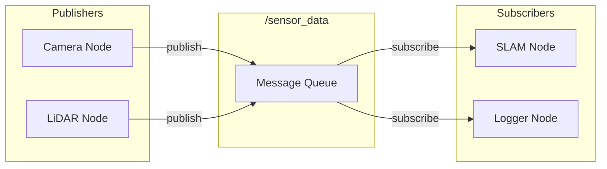

# Chapter 4: Topics - Publish-Subscribe Messaging

:::note Learning Objectives
By the end of this chapter, you will be able to:
- Implement publishers and subscribers in Python
- Create custom message types for your robot
- Configure QoS for different communication patterns
- Debug topic communication using ROS 2 CLI tools
:::

## The Publish-Subscribe Pattern

Topics enable **decoupled**, **asynchronous** communication between nodes. Publishers send messages without knowing who's listening, and subscribers receive messages without knowing who sent them.



## Creating a Publisher

```python title="joint_state_publisher.py"
#!/usr/bin/env python3
"""Publishes humanoid joint states at a fixed rate."""

import rclpy
from rclpy.node import Node
from sensor_msgs.msg import JointState
import math

class JointStatePublisher(Node):
    """Publishes simulated joint states for a humanoid robot."""

    def __init__(self):
        super().__init__('joint_state_publisher')

        # Create publisher: (MessageType, topic_name, queue_size)
        self.publisher = self.create_publisher(
            JointState,
            'joint_states',
            10  # Queue depth
        )

        # Publish at 50 Hz
        self.timer = self.create_timer(0.02, self.publish_joint_states)
        self.time = 0.0

        # Define joint names for a humanoid arm
        self.joint_names = [
            'shoulder_pitch',
            'shoulder_roll',
            'shoulder_yaw',
            'elbow_pitch',
            'wrist_roll',
            'wrist_pitch',
            'gripper'
        ]

        self.get_logger().info('Joint state publisher started')

    def publish_joint_states(self):
        """Generate and publish joint state message."""
        msg = JointState()

        # Header with timestamp
        msg.header.stamp = self.get_clock().now().to_msg()
        msg.header.frame_id = 'base_link'

        # Joint names
        msg.name = self.joint_names

        # Simulated positions (sinusoidal motion)
        msg.position = [
            0.5 * math.sin(self.time),           # shoulder_pitch
            0.3 * math.sin(self.time * 0.5),     # shoulder_roll
            0.2 * math.cos(self.time * 0.8),     # shoulder_yaw
            0.8 * math.sin(self.time * 1.2),     # elbow_pitch
            0.1 * math.sin(self.time * 2.0),     # wrist_roll
            0.15 * math.cos(self.time * 1.5),    # wrist_pitch
            0.5 + 0.5 * math.sin(self.time * 3)  # gripper
        ]

        # Velocities (derivative of positions)
        msg.velocity = [
            0.5 * math.cos(self.time),
            0.15 * math.cos(self.time * 0.5),
            -0.16 * math.sin(self.time * 0.8),
            0.96 * math.cos(self.time * 1.2),
            0.2 * math.cos(self.time * 2.0),
            -0.225 * math.sin(self.time * 1.5),
            1.5 * math.cos(self.time * 3)
        ]

        # Efforts (torques) - simulated load
        msg.effort = [10.0, 8.0, 5.0, 12.0, 2.0, 2.0, 1.0]

        # Publish the message
        self.publisher.publish(msg)

        # Update time
        self.time += 0.02

def main(args=None):
    rclpy.init(args=args)
    node = JointStatePublisher()
    rclpy.spin(node)
    node.destroy_node()
    rclpy.shutdown()

if __name__ == '__main__':
    main()
```

## Creating a Subscriber

```python title="joint_state_subscriber.py"
#!/usr/bin/env python3
"""Subscribes to joint states and processes them."""

import rclpy
from rclpy.node import Node
from sensor_msgs.msg import JointState

class JointStateSubscriber(Node):
    """Monitors joint states and detects anomalies."""

    def __init__(self):
        super().__init__('joint_state_subscriber')

        # Create subscription
        self.subscription = self.create_subscription(
            JointState,
            'joint_states',
            self.joint_state_callback,
            10
        )

        # Joint limits for safety checking
        self.joint_limits = {
            'shoulder_pitch': (-1.57, 1.57),
            'shoulder_roll': (-0.5, 1.5),
            'shoulder_yaw': (-1.0, 1.0),
            'elbow_pitch': (0.0, 2.5),
            'wrist_roll': (-1.57, 1.57),
            'wrist_pitch': (-0.5, 0.5),
            'gripper': (0.0, 1.0)
        }

        self.get_logger().info('Joint state subscriber started')

    def joint_state_callback(self, msg: JointState):
        """Process incoming joint state messages."""
        # Check each joint against limits
        for i, name in enumerate(msg.name):
            if name in self.joint_limits:
                pos = msg.position[i]
                min_limit, max_limit = self.joint_limits[name]

                if pos < min_limit or pos > max_limit:
                    self.get_logger().warn(
                        f'Joint {name} out of bounds: {pos:.3f} '
                        f'(limits: [{min_limit}, {max_limit}])'
                    )

        # Log summary every 50 messages
        if not hasattr(self, 'msg_count'):
            self.msg_count = 0
        self.msg_count += 1

        if self.msg_count % 50 == 0:
            self.get_logger().info(
                f'Received {self.msg_count} joint state messages'
            )

def main(args=None):
    rclpy.init(args=args)
    node = JointStateSubscriber()
    rclpy.spin(node)
    node.destroy_node()
    rclpy.shutdown()

if __name__ == '__main__':
    main()
```

## Custom Message Types

For specialized data, create custom messages:

### Define the Message

```text title="msg/HumanoidStatus.msg"
# HumanoidStatus.msg - Status of the humanoid robot

# Header for timestamp and frame
std_msgs/Header header

# Battery status
float32 battery_percentage
bool is_charging

# Joint health (0.0 = failed, 1.0 = perfect)
float32[] joint_health

# Overall robot state
uint8 STATE_IDLE = 0
uint8 STATE_WALKING = 1
uint8 STATE_MANIPULATING = 2
uint8 STATE_ERROR = 3
uint8 current_state

# Error codes (if any)
string[] active_errors
```

### Package Configuration

```xml title="package.xml"
<?xml version="1.0"?>
<package format="3">
  <name>humanoid_msgs</name>
  <version>1.0.0</version>
  <description>Custom messages for humanoid robots</description>

  <buildtool_depend>ament_cmake</buildtool_depend>
  <buildtool_depend>rosidl_default_generators</buildtool_depend>

  <depend>std_msgs</depend>

  <exec_depend>rosidl_default_runtime</exec_depend>

  <member_of_group>rosidl_interface_packages</member_of_group>
</package>
```

```cmake title="CMakeLists.txt"
cmake_minimum_required(VERSION 3.8)
project(humanoid_msgs)

find_package(ament_cmake REQUIRED)
find_package(rosidl_default_generators REQUIRED)
find_package(std_msgs REQUIRED)

rosidl_generate_interfaces(${PROJECT_NAME}
  "msg/HumanoidStatus.msg"
  DEPENDENCIES std_msgs
)

ament_package()
```

### Using Custom Messages

```python title="status_publisher.py"
#!/usr/bin/env python3
"""Publishes humanoid robot status."""

import rclpy
from rclpy.node import Node
from humanoid_msgs.msg import HumanoidStatus

class StatusPublisher(Node):
    def __init__(self):
        super().__init__('status_publisher')

        self.publisher = self.create_publisher(
            HumanoidStatus,
            'humanoid/status',
            10
        )
        self.timer = self.create_timer(1.0, self.publish_status)

    def publish_status(self):
        msg = HumanoidStatus()
        msg.header.stamp = self.get_clock().now().to_msg()
        msg.battery_percentage = 85.5
        msg.is_charging = False
        msg.joint_health = [1.0, 0.98, 1.0, 0.95, 1.0, 1.0, 1.0]
        msg.current_state = HumanoidStatus.STATE_IDLE
        msg.active_errors = []

        self.publisher.publish(msg)

def main(args=None):
    rclpy.init(args=args)
    node = StatusPublisher()
    rclpy.spin(node)
    node.destroy_node()
    rclpy.shutdown()

if __name__ == '__main__':
    main()
```

## QoS for Topics

Configure QoS based on your requirements:

```python title="qos_examples.py"
#!/usr/bin/env python3
"""Examples of different QoS configurations."""

from rclpy.qos import (
    QoSProfile,
    QoSReliabilityPolicy,
    QoSHistoryPolicy,
    QoSDurabilityPolicy,
    qos_profile_sensor_data,
    qos_profile_system_default
)

# For sensor data - may drop old messages
sensor_qos = QoSProfile(
    reliability=QoSReliabilityPolicy.BEST_EFFORT,
    history=QoSHistoryPolicy.KEEP_LAST,
    depth=1
)

# For commands - must not lose any
command_qos = QoSProfile(
    reliability=QoSReliabilityPolicy.RELIABLE,
    history=QoSHistoryPolicy.KEEP_LAST,
    depth=10
)

# For parameters - late joiners need current value
latched_qos = QoSProfile(
    reliability=QoSReliabilityPolicy.RELIABLE,
    durability=QoSDurabilityPolicy.TRANSIENT_LOCAL,
    history=QoSHistoryPolicy.KEEP_LAST,
    depth=1
)
```

### When to Use Each

| Use Case | QoS Profile |
|----------|-------------|
| Camera images | `qos_profile_sensor_data` |
| LiDAR scans | `qos_profile_sensor_data` |
| Joint commands | RELIABLE, depth=10 |
| Emergency stop | RELIABLE, depth=1 |
| Robot description | TRANSIENT_LOCAL |

## Debugging Topics

### Command Line Tools

```bash
# List all active topics
ros2 topic list

# Show topic type
ros2 topic type /joint_states

# Show message definition
ros2 interface show sensor_msgs/msg/JointState

# Echo messages in real-time
ros2 topic echo /joint_states

# Show publishing rate
ros2 topic hz /joint_states

# Show bandwidth usage
ros2 topic bw /joint_states

# Publish a test message
ros2 topic pub /cmd_vel geometry_msgs/msg/Twist \
  "{linear: {x: 0.5}, angular: {z: 0.1}}"
```

### Using rqt

```bash
# Topic monitoring GUI
ros2 run rqt_topic rqt_topic

# Message publisher GUI
ros2 run rqt_publisher rqt_publisher

# Full rqt with all plugins
rqt
```

## Complete Example: Talker-Listener

```python title="talker.py"
#!/usr/bin/env python3
"""Classic ROS 2 talker node."""

import rclpy
from rclpy.node import Node
from std_msgs.msg import String

class Talker(Node):
    def __init__(self):
        super().__init__('talker')
        self.publisher = self.create_publisher(String, 'chatter', 10)
        self.timer = self.create_timer(0.5, self.timer_callback)
        self.count = 0

    def timer_callback(self):
        msg = String()
        msg.data = f'Hello, ROS 2! Count: {self.count}'
        self.publisher.publish(msg)
        self.get_logger().info(f'Publishing: "{msg.data}"')
        self.count += 1

def main(args=None):
    rclpy.init(args=args)
    node = Talker()
    rclpy.spin(node)
    node.destroy_node()
    rclpy.shutdown()

if __name__ == '__main__':
    main()
```

```python title="listener.py"
#!/usr/bin/env python3
"""Classic ROS 2 listener node."""

import rclpy
from rclpy.node import Node
from std_msgs.msg import String

class Listener(Node):
    def __init__(self):
        super().__init__('listener')
        self.subscription = self.create_subscription(
            String, 'chatter', self.listener_callback, 10
        )

    def listener_callback(self, msg: String):
        self.get_logger().info(f'Heard: "{msg.data}"')

def main(args=None):
    rclpy.init(args=args)
    node = Listener()
    rclpy.spin(node)
    node.destroy_node()
    rclpy.shutdown()

if __name__ == '__main__':
    main()
```

## Summary

In this chapter, you learned:

- ✅ Topics enable asynchronous publish-subscribe communication
- ✅ Publishers send messages to topics; subscribers receive them
- ✅ Custom messages define robot-specific data structures
- ✅ QoS profiles control reliability, durability, and history
- ✅ CLI tools help debug topic communication

## Key Takeaways

:::tip Remember
1. **Topics decouple** publishers from subscribers
2. **QoS must match** between publishers and subscribers
3. Use **RELIABLE** for commands, **BEST_EFFORT** for high-frequency sensors
4. **Custom messages** enable domain-specific data structures
:::

## Next Steps

In the next chapter, we'll learn about **services and actions** for request-response and long-running task communication patterns.

---

## Exercises

1. Create a publisher that sends `geometry_msgs/Twist` commands
2. Build a subscriber that logs statistics (min, max, mean) of incoming data
3. Design a custom message for IMU data with calibration status
4. Implement a node that republishes filtered data (e.g., remove outliers)
