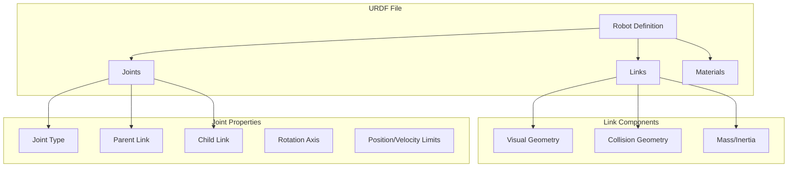
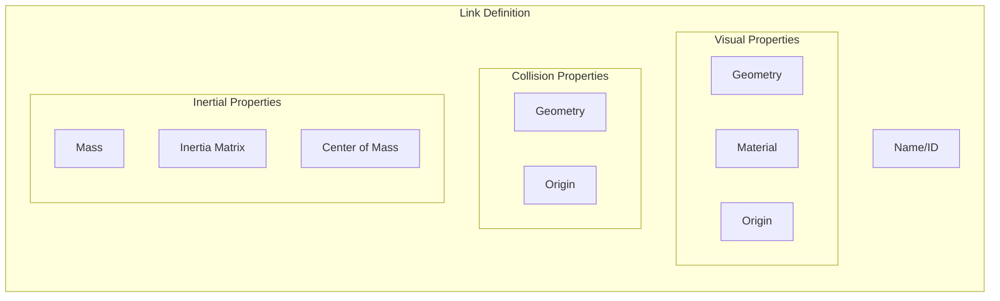
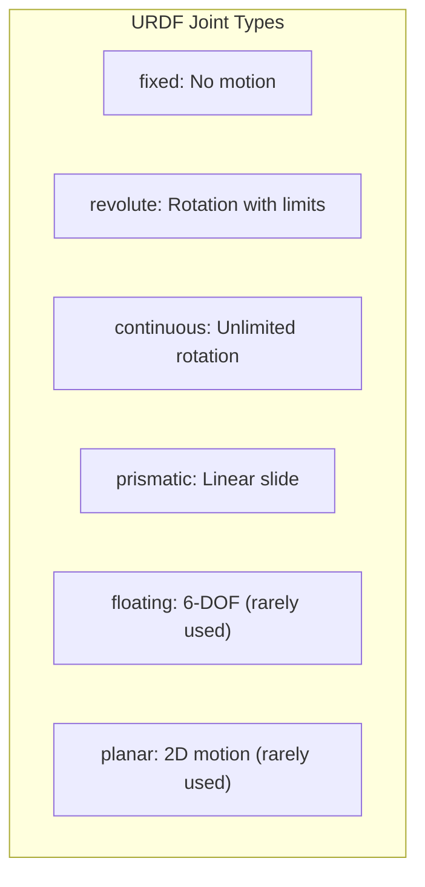
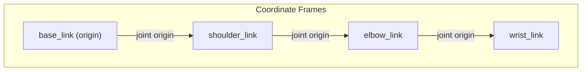

# Chapter 9: URDF Fundamentals

:::note Learning Objectives
By the end of this chapter, you will be able to:
- Understand the purpose and structure of URDF files
- Define links with visual, collision, and inertial properties
- Create joints to connect links with appropriate types
- Use materials and colors for visualization
- Build a simple robot arm using URDF
:::

## What is URDF?

**URDF (Unified Robot Description Format)** is an XML specification that describes a robot's physical configuration:



| Purpose | Description |
|---------|-------------|
| **Visualization** | Display robot in RViz and simulators |
| **Simulation** | Physics simulation in Gazebo |
| **Motion Planning** | Collision checking and path planning |
| **Control** | Joint limits and dynamics |
| **TF Tree** | Coordinate frame relationships |

## URDF Structure

```xml title="basic_structure.urdf"
<?xml version="1.0"?>
<robot name="my_robot">
    <!-- Materials define colors -->
    <material name="blue">
        <color rgba="0.0 0.0 0.8 1.0"/>
    </material>

    <!-- Links are the rigid bodies -->
    <link name="base_link">
        <!-- Visual, collision, inertial -->
    </link>

    <link name="arm_link">
        <!-- Visual, collision, inertial -->
    </link>

    <!-- Joints connect links -->
    <joint name="base_to_arm" type="revolute">
        <parent link="base_link"/>
        <child link="arm_link"/>
        <!-- Additional joint properties -->
    </joint>
</robot>
```

## Link Definition

A link represents a rigid body with three key components:



### Complete Link Example

```xml title="link_example.urdf"
<link name="upper_arm">
    <!-- Visual: What you see in RViz -->
    <visual>
        <origin xyz="0 0 0.15" rpy="0 0 0"/>
        <geometry>
            <cylinder radius="0.05" length="0.3"/>
        </geometry>
        <material name="orange">
            <color rgba="1.0 0.5 0.0 1.0"/>
        </material>
    </visual>

    <!-- Collision: For collision detection -->
    <collision>
        <origin xyz="0 0 0.15" rpy="0 0 0"/>
        <geometry>
            <!-- Often simplified for performance -->
            <cylinder radius="0.06" length="0.32"/>
        </geometry>
    </collision>

    <!-- Inertial: Mass and inertia for dynamics -->
    <inertial>
        <origin xyz="0 0 0.15" rpy="0 0 0"/>
        <mass value="2.5"/>
        <inertia
            ixx="0.019" ixy="0.0" ixz="0.0"
            iyy="0.019" iyz="0.0"
            izz="0.003"/>
    </inertial>
</link>
```

## Geometry Types

URDF supports four geometry primitives:

```xml title="geometry_types.urdf"
<!-- Box: length x, width y, height z -->
<geometry>
    <box size="0.5 0.3 0.1"/>
</geometry>

<!-- Cylinder: radius and length (along z-axis) -->
<geometry>
    <cylinder radius="0.05" length="0.3"/>
</geometry>

<!-- Sphere: radius only -->
<geometry>
    <sphere radius="0.1"/>
</geometry>

<!-- Mesh: External 3D model file -->
<geometry>
    <mesh filename="package://my_robot/meshes/gripper.stl" scale="1.0 1.0 1.0"/>
</geometry>
```

### Geometry Selection Guidelines

| Geometry | Use Case | Performance |
|----------|----------|-------------|
| **Box** | Torso, rectangular parts | Fastest |
| **Cylinder** | Arm segments, wheels | Fast |
| **Sphere** | Joints, rounded parts | Fast |
| **Mesh** | Complex shapes, detailed visuals | Slowest |

:::tip Best Practice
Use simple primitives for collision geometry and detailed meshes for visuals.
:::

## Joint Types

Joints define the kinematic relationships between links:



### Joint Type Comparison

| Type | Motion | Limits | Example Use |
|------|--------|--------|-------------|
| **fixed** | None | N/A | Sensor mounts |
| **revolute** | Rotation | Min/Max angle | Arm joints |
| **continuous** | Rotation | No limits | Wheels |
| **prismatic** | Translation | Min/Max distance | Linear actuators |

### Joint Definition Example

```xml title="joint_examples.urdf"
<!-- Revolute joint: Limited rotation -->
<joint name="shoulder_pitch" type="revolute">
    <parent link="torso"/>
    <child link="upper_arm"/>

    <!-- Position relative to parent frame -->
    <origin xyz="0.1 0 0.3" rpy="0 0 0"/>

    <!-- Axis of rotation (normalized vector) -->
    <axis xyz="0 1 0"/>

    <!-- Position, velocity, and effort limits -->
    <limit
        lower="-1.57"
        upper="1.57"
        velocity="2.0"
        effort="100.0"/>

    <!-- Optional dynamics -->
    <dynamics damping="0.5" friction="0.1"/>
</joint>

<!-- Continuous joint: Unlimited rotation -->
<joint name="wheel_joint" type="continuous">
    <parent link="chassis"/>
    <child link="wheel"/>
    <origin xyz="0 0.2 0" rpy="-1.5708 0 0"/>
    <axis xyz="0 0 1"/>
    <limit velocity="10.0" effort="50.0"/>
</joint>

<!-- Prismatic joint: Linear motion -->
<joint name="gripper_slide" type="prismatic">
    <parent link="wrist"/>
    <child link="finger"/>
    <origin xyz="0 0 0.1" rpy="0 0 0"/>
    <axis xyz="1 0 0"/>
    <limit lower="0.0" upper="0.05" velocity="0.1" effort="20.0"/>
</joint>

<!-- Fixed joint: No motion -->
<joint name="camera_mount" type="fixed">
    <parent link="head"/>
    <child link="camera"/>
    <origin xyz="0.05 0 0.02" rpy="0 0 0"/>
</joint>
```

## Coordinate Frames and Origins

Understanding coordinate frames is crucial:



### Origin Specification

```xml
<!-- Origin has position (xyz) and orientation (rpy) -->
<origin xyz="x y z" rpy="roll pitch yaw"/>

<!-- Example: Move 0.3m in Z and rotate 90 degrees around Y -->
<origin xyz="0.0 0.0 0.3" rpy="0.0 1.5708 0.0"/>
```

| Parameter | Description | Units |
|-----------|-------------|-------|
| `xyz` | Position offset | meters |
| `rpy` | Roll, Pitch, Yaw | radians |

## Building a Simple Robot Arm

Let's build a 3-DOF robot arm step by step:

```xml title="robot_arm.urdf"
<?xml version="1.0"?>
<robot name="simple_arm">

    <!-- Materials -->
    <material name="grey">
        <color rgba="0.5 0.5 0.5 1.0"/>
    </material>
    <material name="orange">
        <color rgba="1.0 0.5 0.0 1.0"/>
    </material>
    <material name="blue">
        <color rgba="0.2 0.4 0.8 1.0"/>
    </material>

    <!-- Base Link: Fixed to world -->
    <link name="base_link">
        <visual>
            <origin xyz="0 0 0.025" rpy="0 0 0"/>
            <geometry>
                <cylinder radius="0.1" length="0.05"/>
            </geometry>
            <material name="grey"/>
        </visual>
        <collision>
            <origin xyz="0 0 0.025" rpy="0 0 0"/>
            <geometry>
                <cylinder radius="0.1" length="0.05"/>
            </geometry>
        </collision>
        <inertial>
            <origin xyz="0 0 0.025" rpy="0 0 0"/>
            <mass value="5.0"/>
            <inertia ixx="0.013" ixy="0" ixz="0"
                     iyy="0.013" iyz="0" izz="0.025"/>
        </inertial>
    </link>

    <!-- Shoulder Link -->
    <link name="shoulder_link">
        <visual>
            <origin xyz="0 0 0.1" rpy="0 0 0"/>
            <geometry>
                <cylinder radius="0.04" length="0.2"/>
            </geometry>
            <material name="orange"/>
        </visual>
        <collision>
            <origin xyz="0 0 0.1" rpy="0 0 0"/>
            <geometry>
                <cylinder radius="0.045" length="0.22"/>
            </geometry>
        </collision>
        <inertial>
            <origin xyz="0 0 0.1" rpy="0 0 0"/>
            <mass value="1.5"/>
            <inertia ixx="0.006" ixy="0" ixz="0"
                     iyy="0.006" iyz="0" izz="0.001"/>
        </inertial>
    </link>

    <!-- Shoulder Joint: Base rotation -->
    <joint name="shoulder_pan" type="revolute">
        <parent link="base_link"/>
        <child link="shoulder_link"/>
        <origin xyz="0 0 0.05" rpy="0 0 0"/>
        <axis xyz="0 0 1"/>
        <limit lower="-3.14" upper="3.14" velocity="1.0" effort="50.0"/>
        <dynamics damping="0.5"/>
    </joint>

    <!-- Upper Arm Link -->
    <link name="upper_arm_link">
        <visual>
            <origin xyz="0 0 0.15" rpy="0 0 0"/>
            <geometry>
                <cylinder radius="0.035" length="0.3"/>
            </geometry>
            <material name="blue"/>
        </visual>
        <collision>
            <origin xyz="0 0 0.15" rpy="0 0 0"/>
            <geometry>
                <cylinder radius="0.04" length="0.32"/>
            </geometry>
        </collision>
        <inertial>
            <origin xyz="0 0 0.15" rpy="0 0 0"/>
            <mass value="1.2"/>
            <inertia ixx="0.010" ixy="0" ixz="0"
                     iyy="0.010" iyz="0" izz="0.001"/>
        </inertial>
    </link>

    <!-- Shoulder Pitch Joint -->
    <joint name="shoulder_pitch" type="revolute">
        <parent link="shoulder_link"/>
        <child link="upper_arm_link"/>
        <origin xyz="0 0 0.2" rpy="0 0 0"/>
        <axis xyz="0 1 0"/>
        <limit lower="-1.57" upper="1.57" velocity="1.0" effort="50.0"/>
        <dynamics damping="0.3"/>
    </joint>

    <!-- Forearm Link -->
    <link name="forearm_link">
        <visual>
            <origin xyz="0 0 0.125" rpy="0 0 0"/>
            <geometry>
                <cylinder radius="0.03" length="0.25"/>
            </geometry>
            <material name="orange"/>
        </visual>
        <collision>
            <origin xyz="0 0 0.125" rpy="0 0 0"/>
            <geometry>
                <cylinder radius="0.035" length="0.27"/>
            </geometry>
        </collision>
        <inertial>
            <origin xyz="0 0 0.125" rpy="0 0 0"/>
            <mass value="0.8"/>
            <inertia ixx="0.005" ixy="0" ixz="0"
                     iyy="0.005" iyz="0" izz="0.0004"/>
        </inertial>
    </link>

    <!-- Elbow Joint -->
    <joint name="elbow_pitch" type="revolute">
        <parent link="upper_arm_link"/>
        <child link="forearm_link"/>
        <origin xyz="0 0 0.3" rpy="0 0 0"/>
        <axis xyz="0 1 0"/>
        <limit lower="0" upper="2.5" velocity="1.5" effort="30.0"/>
        <dynamics damping="0.2"/>
    </joint>

    <!-- End Effector Link -->
    <link name="end_effector">
        <visual>
            <origin xyz="0 0 0.025" rpy="0 0 0"/>
            <geometry>
                <sphere radius="0.03"/>
            </geometry>
            <material name="grey"/>
        </visual>
        <collision>
            <origin xyz="0 0 0.025" rpy="0 0 0"/>
            <geometry>
                <sphere radius="0.035"/>
            </geometry>
        </collision>
        <inertial>
            <origin xyz="0 0 0.025" rpy="0 0 0"/>
            <mass value="0.2"/>
            <inertia ixx="0.0001" ixy="0" ixz="0"
                     iyy="0.0001" iyz="0" izz="0.0001"/>
        </inertial>
    </link>

    <!-- Wrist Joint -->
    <joint name="wrist_fixed" type="fixed">
        <parent link="forearm_link"/>
        <child link="end_effector"/>
        <origin xyz="0 0 0.25" rpy="0 0 0"/>
    </joint>

</robot>
```

## Calculating Inertia

For simple shapes, use these formulas:

### Box Inertia
```python
# For a box with mass m and dimensions (w, d, h)
ixx = (1/12) * m * (d**2 + h**2)
iyy = (1/12) * m * (w**2 + h**2)
izz = (1/12) * m * (w**2 + d**2)
```

### Cylinder Inertia
```python
# For a cylinder with mass m, radius r, length l (along z)
ixx = (1/12) * m * (3*r**2 + l**2)
iyy = (1/12) * m * (3*r**2 + l**2)
izz = (1/2) * m * r**2
```

### Sphere Inertia
```python
# For a sphere with mass m and radius r
ixx = iyy = izz = (2/5) * m * r**2
```

## Validating URDF

Use the `check_urdf` tool to validate your URDF:

```bash
# Check URDF syntax
check_urdf robot_arm.urdf

# Visualize URDF structure
urdf_to_graphviz robot_arm.urdf
```

### Common Errors

| Error | Cause | Solution |
|-------|-------|----------|
| **Invalid joint** | Missing parent/child | Define both links |
| **Disconnected tree** | Link not connected | Add joint to connect |
| **Invalid inertia** | Non-positive values | Use positive inertia |
| **Duplicate names** | Same link/joint name | Use unique names |

## Summary

In this chapter, you learned:

- **URDF** is XML format for describing robot structure
- **Links** have visual, collision, and inertial properties
- **Joints** connect links with various motion types
- **Geometry** can be primitives or mesh files
- **Coordinate frames** define spatial relationships
- How to build and validate a robot arm URDF

## Key Takeaways

:::tip Remember
1. Every URDF needs at least **one link** (usually `base_link`)
2. Use **simple geometry** for collision, **meshes** for visuals
3. **Joint limits** prevent invalid configurations
4. **Inertial properties** are required for physics simulation
5. Always **validate** your URDF before using it
:::

## Next Steps

In the next chapter, we will build a complete **humanoid robot URDF** with a full kinematic chain for bipedal locomotion.

---

## Exercises

1. Create a URDF for a simple two-wheeled robot base
2. Add a 2-DOF pan-tilt head to the robot arm
3. Calculate and add correct inertial properties for all links
4. Create a gripper with two prismatic finger joints
5. Validate your URDF and fix any errors
