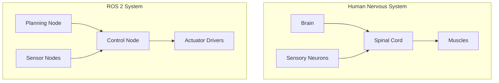
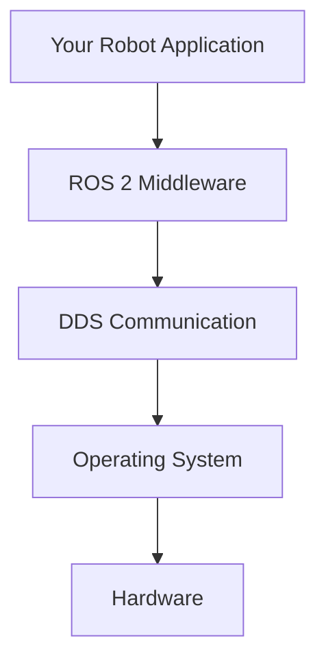
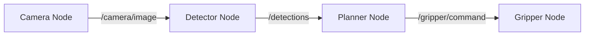
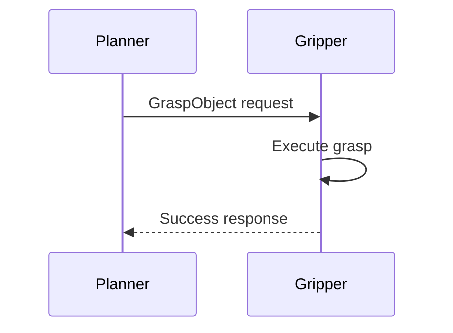
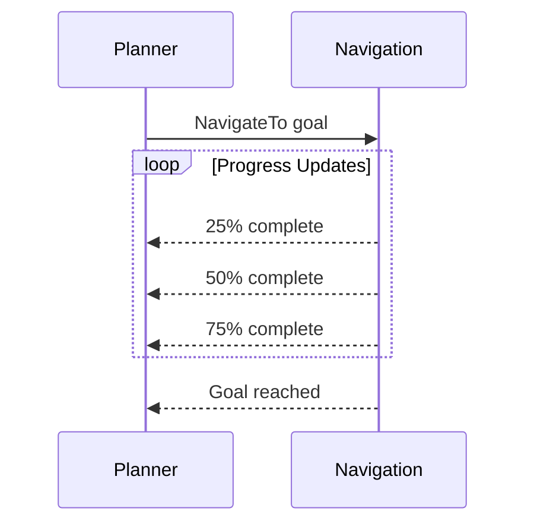
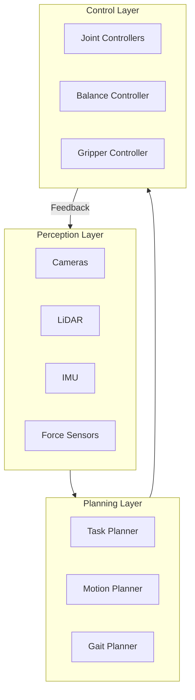

# Chapter 1: What is ROS 2?

:::note Learning Objectives
By the end of this chapter, you will be able to:
- Explain what ROS 2 is and why it's called the "nervous system" of robots
- Describe the key differences between ROS 1 and ROS 2
- Identify the core components of the ROS 2 ecosystem
- Understand why ROS 2 is the standard for modern robotics
:::

## The Nervous System Analogy

Just as the human nervous system coordinates signals between your brain and body, **ROS 2 (Robot Operating System 2)** coordinates communication between all components of a robot. When you decide to pick up a cup, your nervous system:

1. Processes visual input to locate the cup
2. Plans the arm movement trajectory
3. Sends motor commands to your muscles
4. Receives feedback about grip pressure
5. Adjusts in real-time based on sensor feedback

ROS 2 does exactly the same thing for robots:



## What is ROS 2?

ROS 2 is **not** an operating system in the traditional sense. It's a **middleware framework** that provides:

| Component | Purpose |
|-----------|---------|
| **Communication Infrastructure** | Message passing between processes |
| **Hardware Abstraction** | Standardized interfaces for sensors and actuators |
| **Package Management** | Reusable software modules |
| **Tools & Utilities** | Visualization, debugging, simulation |
| **Libraries** | Math, transforms, navigation algorithms |

### The Middleware Layer

ROS 2 sits between your application code and the operating system:



## Why ROS 2? The Evolution from ROS 1

ROS 1 revolutionized robotics research but had limitations for production systems:

| Challenge | ROS 1 | ROS 2 |
|-----------|-------|-------|
| **Real-time** | Not supported | Built-in real-time support |
| **Security** | No encryption | DDS security features |
| **Multi-robot** | Difficult | Native support |
| **Embedded** | Linux only | Cross-platform |
| **Reliability** | Best-effort | Quality of Service (QoS) |
| **Lifecycle** | None | Managed node states |

### Real-World Impact

Consider a humanoid robot in a hospital:

- **Real-time**: Must respond to obstacles instantly
- **Security**: Patient data must be encrypted
- **Reliability**: Cannot drop critical messages
- **Lifecycle**: Graceful startup/shutdown required

ROS 2 addresses all these requirements.

## Core Concepts Overview

### Nodes: The Building Blocks

A **node** is an executable that performs a specific task:

```python
# Conceptual example - we'll implement this in Chapter 3
class CameraNode:
    """Captures images from camera hardware"""
    def capture_image(self):
        return self.camera.read()

class ObjectDetectorNode:
    """Detects objects in images"""
    def detect(self, image):
        return self.model.predict(image)

class GripperNode:
    """Controls the robot gripper"""
    def grasp(self, target):
        self.actuator.close(force=target.required_force)
```

### Topics: Publish-Subscribe Communication

Nodes communicate by publishing and subscribing to **topics**:



### Services: Request-Response

For synchronous operations, nodes use **services**:



### Actions: Long-Running Tasks

For tasks that take time and need progress feedback:



## The ROS 2 Ecosystem

### Distributions

ROS 2 releases are named alphabetically:

| Distribution | Release | EOL | Ubuntu |
|--------------|---------|-----|--------|
| Humble Hawksbill | May 2022 | May 2027 | 22.04 |
| Iron Irwini | May 2023 | Nov 2024 | 22.04 |
| Jazzy Jalisco | May 2024 | May 2029 | 24.04 |

:::tip This Book Uses Humble
All examples target **ROS 2 Humble** on **Ubuntu 22.04** for maximum stability and long-term support.
:::

### Key Packages

| Package | Purpose |
|---------|---------|
| `rclpy` | Python client library |
| `rclcpp` | C++ client library |
| `std_msgs` | Standard message types |
| `sensor_msgs` | Sensor data messages |
| `geometry_msgs` | Geometric primitives |
| `nav2` | Navigation stack |
| `moveit2` | Motion planning |

## ROS 2 for Humanoid Robots

Humanoid robots are among the most complex robotic systems:



ROS 2 excels here because:

1. **Modularity**: Each component is a separate node
2. **Reusability**: Swap cameras without changing detection code
3. **Scalability**: Add new sensors without restructuring
4. **Debugging**: Inspect any data flow in real-time

## Hands-On: Verify Your Installation

Let's confirm ROS 2 is working:

```bash
# Check ROS 2 version
ros2 --version

# List available commands
ros2 --help

# Run the demo talker
ros2 run demo_nodes_cpp talker
```

In another terminal:

```bash
# Run the demo listener
ros2 run demo_nodes_cpp listener
```

You should see messages flowing between the two nodes.

### Explore the Node Graph

```bash
# List running nodes
ros2 node list

# List active topics
ros2 topic list

# Echo messages on a topic
ros2 topic echo /chatter
```

## Summary

In this chapter, you learned:

- ✅ ROS 2 is middleware that coordinates robot components like a nervous system
- ✅ Key improvements over ROS 1: real-time, security, reliability, lifecycle
- ✅ Core concepts: nodes, topics, services, actions
- ✅ ROS 2 Humble is the target distribution for this book
- ✅ How to verify your ROS 2 installation

## Key Takeaways

:::tip Remember
1. **ROS 2 is middleware**, not an operating system
2. **Nodes** are independent processes that communicate via **topics**
3. **DDS** provides the underlying communication layer
4. **Humble** is the recommended distribution for production systems
:::

## Next Steps

In the next chapter, we'll dive deep into the **DDS architecture** that powers ROS 2's communication system, understanding Quality of Service profiles and how discovery works.

---

## Review Questions

1. Why is ROS 2 called the "nervous system" of robots?
2. What are three key improvements of ROS 2 over ROS 1?
3. What is the difference between a topic and a service?
4. Why is the middleware layer important for robotics?
