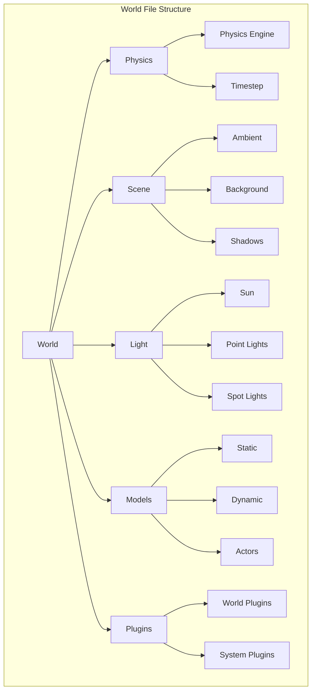

# Building Gazebo Worlds

## Learning Objectives

By the end of this chapter, you will be able to:

- Create complete Gazebo world files from scratch
- Design terrain with varying elevations and surfaces
- Add static and dynamic obstacles
- Configure environmental factors (lighting, atmosphere)
- Build modular, reusable environment components

## World File Structure

A Gazebo world file defines the complete simulation environment:



## Basic World Template

```xml
<?xml version="1.0" ?>
<sdf version="1.8">
  <world name="humanoid_test_world">

    <!-- Physics Configuration -->
    <physics name="default_physics" type="dart">
      <max_step_size>0.001</max_step_size>
      <real_time_factor>1.0</real_time_factor>
      <real_time_update_rate>1000</real_time_update_rate>
    </physics>

    <!-- Required Plugins -->
    <plugin
      filename="gz-sim-physics-system"
      name="gz::sim::systems::Physics">
    </plugin>
    <plugin
      filename="gz-sim-scene-broadcaster-system"
      name="gz::sim::systems::SceneBroadcaster">
    </plugin>
    <plugin
      filename="gz-sim-user-commands-system"
      name="gz::sim::systems::UserCommands">
    </plugin>
    <plugin
      filename="gz-sim-sensors-system"
      name="gz::sim::systems::Sensors">
      <render_engine>ogre2</render_engine>
    </plugin>
    <plugin
      filename="gz-sim-contact-system"
      name="gz::sim::systems::Contact">
    </plugin>

    <!-- Scene Configuration -->
    <scene>
      <ambient>0.4 0.4 0.4 1</ambient>
      <background>0.7 0.85 1.0 1</background>
      <shadows>true</shadows>
      <grid>true</grid>
    </scene>

    <!-- Lighting -->
    <light type="directional" name="sun">
      <cast_shadows>true</cast_shadows>
      <pose>0 0 10 0 0 0</pose>
      <diffuse>0.9 0.9 0.85 1</diffuse>
      <specular>0.3 0.3 0.3 1</specular>
      <direction>-0.5 0.3 -0.9</direction>
      <attenuation>
        <range>1000</range>
        <constant>0.9</constant>
        <linear>0.01</linear>
        <quadratic>0.001</quadratic>
      </attenuation>
    </light>

    <!-- Ground Plane -->
    <model name="ground_plane">
      <static>true</static>
      <link name="link">
        <collision name="collision">
          <geometry>
            <plane>
              <normal>0 0 1</normal>
              <size>100 100</size>
            </plane>
          </geometry>
          <surface>
            <friction>
              <ode>
                <mu>100</mu>
                <mu2>50</mu2>
              </ode>
            </friction>
          </surface>
        </collision>
        <visual name="visual">
          <geometry>
            <plane>
              <normal>0 0 1</normal>
              <size>100 100</size>
            </plane>
          </geometry>
          <material>
            <ambient>0.8 0.8 0.8 1</ambient>
            <diffuse>0.8 0.8 0.8 1</diffuse>
            <specular>0.1 0.1 0.1 1</specular>
          </material>
        </visual>
      </link>
    </model>

  </world>
</sdf>
```

## Terrain Design

### Heightmap Terrain

Create realistic terrain using heightmap images:

```xml
<model name="terrain">
  <static>true</static>
  <link name="link">
    <collision name="collision">
      <geometry>
        <heightmap>
          <uri>model://terrain/materials/heightmap.png</uri>
          <size>100 100 10</size>
          <pos>0 0 0</pos>
        </heightmap>
      </geometry>
    </collision>
    <visual name="visual">
      <geometry>
        <heightmap>
          <uri>model://terrain/materials/heightmap.png</uri>
          <size>100 100 10</size>
          <pos>0 0 0</pos>
          <texture>
            <diffuse>model://terrain/materials/grass_diffuse.png</diffuse>
            <normal>model://terrain/materials/grass_normal.png</normal>
            <size>10</size>
          </texture>
          <texture>
            <diffuse>model://terrain/materials/dirt_diffuse.png</diffuse>
            <normal>model://terrain/materials/dirt_normal.png</normal>
            <size>10</size>
          </texture>
          <texture>
            <diffuse>model://terrain/materials/rock_diffuse.png</diffuse>
            <normal>model://terrain/materials/rock_normal.png</normal>
            <size>10</size>
          </texture>
          <blend>
            <min_height>2</min_height>
            <fade_dist>5</fade_dist>
          </blend>
          <blend>
            <min_height>6</min_height>
            <fade_dist>5</fade_dist>
          </blend>
        </heightmap>
      </geometry>
    </visual>
  </link>
</model>
```

### Procedural Terrain Generation

```python
"""
Procedural heightmap generation for Gazebo terrain
"""

import numpy as np
from PIL import Image
from scipy.ndimage import gaussian_filter


class TerrainGenerator:
    """Generate heightmap images for Gazebo terrain."""

    def __init__(self, width: int = 513, height: int = 513):
        self.width = width
        self.height = height

    def generate_flat(self) -> np.ndarray:
        """Generate flat terrain."""
        return np.zeros((self.height, self.width), dtype=np.float32)

    def generate_noise(self, scale: float = 0.1,
                       octaves: int = 4) -> np.ndarray:
        """Generate Perlin-like noise terrain."""
        terrain = np.zeros((self.height, self.width), dtype=np.float32)

        for octave in range(octaves):
            freq = 2 ** octave
            amp = scale / freq

            noise = np.random.randn(
                self.height // freq + 1,
                self.width // freq + 1
            )

            # Upscale noise
            from scipy.ndimage import zoom
            noise_scaled = zoom(noise, freq, order=1)[:self.height, :self.width]

            terrain += noise_scaled * amp

        return terrain

    def generate_stairs(self, num_steps: int = 10,
                        step_height: float = 0.15) -> np.ndarray:
        """Generate stair terrain for testing."""
        terrain = np.zeros((self.height, self.width), dtype=np.float32)
        step_width = self.width // num_steps

        for i in range(num_steps):
            start_x = i * step_width
            end_x = (i + 1) * step_width
            terrain[:, start_x:end_x] = i * step_height

        return terrain

    def generate_ramp(self, max_height: float = 2.0,
                      direction: str = 'x') -> np.ndarray:
        """Generate ramp terrain."""
        terrain = np.zeros((self.height, self.width), dtype=np.float32)

        if direction == 'x':
            for i in range(self.width):
                terrain[:, i] = (i / self.width) * max_height
        else:
            for i in range(self.height):
                terrain[i, :] = (i / self.height) * max_height

        return terrain

    def generate_obstacles(self, num_obstacles: int = 20,
                          obstacle_height: float = 0.3,
                          obstacle_radius: int = 10) -> np.ndarray:
        """Generate terrain with random obstacles."""
        terrain = np.zeros((self.height, self.width), dtype=np.float32)

        for _ in range(num_obstacles):
            cx = np.random.randint(obstacle_radius, self.width - obstacle_radius)
            cy = np.random.randint(obstacle_radius, self.height - obstacle_radius)

            y, x = np.ogrid[:self.height, :self.width]
            mask = (x - cx)**2 + (y - cy)**2 <= obstacle_radius**2
            terrain[mask] = obstacle_height

        return terrain

    def smooth(self, terrain: np.ndarray, sigma: float = 2.0) -> np.ndarray:
        """Apply Gaussian smoothing to terrain."""
        return gaussian_filter(terrain, sigma=sigma)

    def save_heightmap(self, terrain: np.ndarray, filename: str) -> None:
        """Save terrain as 16-bit PNG heightmap."""
        # Normalize to 0-65535 range
        terrain_norm = terrain - terrain.min()
        if terrain_norm.max() > 0:
            terrain_norm = terrain_norm / terrain_norm.max()
        terrain_16bit = (terrain_norm * 65535).astype(np.uint16)

        # Save as grayscale PNG
        img = Image.fromarray(terrain_16bit, mode='I;16')
        img.save(filename)


# Example usage
if __name__ == "__main__":
    gen = TerrainGenerator(513, 513)

    # Generate different terrains
    terrains = {
        'flat': gen.generate_flat(),
        'noise': gen.generate_noise(scale=2.0),
        'stairs': gen.generate_stairs(num_steps=15, step_height=0.12),
        'ramp': gen.generate_ramp(max_height=3.0),
        'obstacles': gen.smooth(gen.generate_obstacles(30, 0.5, 15))
    }

    for name, terrain in terrains.items():
        gen.save_heightmap(terrain, f'{name}_heightmap.png')
        print(f"Saved {name}_heightmap.png")
```

## Building Common Environments

### Indoor Laboratory Environment

```xml
<model name="laboratory">
  <static>true</static>
  <pose>0 0 0 0 0 0</pose>

  <!-- Floor -->
  <link name="floor">
    <collision name="collision">
      <geometry>
        <box>
          <size>20 15 0.1</size>
        </box>
      </geometry>
      <surface>
        <friction>
          <ode><mu>0.8</mu><mu2>0.8</mu2></ode>
        </friction>
      </surface>
    </collision>
    <visual name="visual">
      <geometry>
        <box>
          <size>20 15 0.1</size>
        </box>
      </geometry>
      <material>
        <ambient>0.9 0.9 0.9 1</ambient>
        <diffuse>0.9 0.9 0.9 1</diffuse>
        <script>
          <uri>file://media/materials/scripts/gazebo.material</uri>
          <name>Gazebo/White</name>
        </script>
      </material>
    </visual>
  </link>

  <!-- Walls -->
  <link name="wall_north">
    <pose>0 7.5 1.5 0 0 0</pose>
    <collision name="collision">
      <geometry>
        <box><size>20 0.2 3</size></box>
      </geometry>
    </collision>
    <visual name="visual">
      <geometry>
        <box><size>20 0.2 3</size></box>
      </geometry>
      <material>
        <ambient>0.95 0.95 0.95 1</ambient>
        <diffuse>0.95 0.95 0.95 1</diffuse>
      </material>
    </visual>
  </link>

  <link name="wall_south">
    <pose>0 -7.5 1.5 0 0 0</pose>
    <collision name="collision">
      <geometry>
        <box><size>20 0.2 3</size></box>
      </geometry>
    </collision>
    <visual name="visual">
      <geometry>
        <box><size>20 0.2 3</size></box>
      </geometry>
      <material>
        <ambient>0.95 0.95 0.95 1</ambient>
        <diffuse>0.95 0.95 0.95 1</diffuse>
      </material>
    </visual>
  </link>

  <link name="wall_east">
    <pose>10 0 1.5 0 0 0</pose>
    <collision name="collision">
      <geometry>
        <box><size>0.2 15 3</size></box>
      </geometry>
    </collision>
    <visual name="visual">
      <geometry>
        <box><size>0.2 15 3</size></box>
      </geometry>
      <material>
        <ambient>0.95 0.95 0.95 1</ambient>
        <diffuse>0.95 0.95 0.95 1</diffuse>
      </material>
    </visual>
  </link>

  <link name="wall_west">
    <pose>-10 0 1.5 0 0 0</pose>
    <collision name="collision">
      <geometry>
        <box><size>0.2 15 3</size></box>
      </geometry>
    </collision>
    <visual name="visual">
      <geometry>
        <box><size>0.2 15 3</size></box>
      </geometry>
      <material>
        <ambient>0.95 0.95 0.95 1</ambient>
        <diffuse>0.95 0.95 0.95 1</diffuse>
      </material>
    </visual>
  </link>
</model>

<!-- Indoor Lighting -->
<light type="point" name="ceiling_light_1">
  <pose>-5 0 2.8 0 0 0</pose>
  <diffuse>1 1 0.9 1</diffuse>
  <specular>0.2 0.2 0.2 1</specular>
  <attenuation>
    <range>20</range>
    <constant>0.5</constant>
    <linear>0.01</linear>
    <quadratic>0.001</quadratic>
  </attenuation>
  <cast_shadows>false</cast_shadows>
</light>

<light type="point" name="ceiling_light_2">
  <pose>5 0 2.8 0 0 0</pose>
  <diffuse>1 1 0.9 1</diffuse>
  <specular>0.2 0.2 0.2 1</specular>
  <attenuation>
    <range>20</range>
    <constant>0.5</constant>
    <linear>0.01</linear>
    <quadratic>0.001</quadratic>
  </attenuation>
  <cast_shadows>false</cast_shadows>
</light>
```

### Outdoor Urban Environment

```xml
<!-- Urban street segment -->
<model name="street_segment">
  <static>true</static>

  <!-- Road surface -->
  <link name="road">
    <pose>0 0 0 0 0 0</pose>
    <collision name="collision">
      <geometry>
        <box><size>50 8 0.1</size></box>
      </geometry>
      <surface>
        <friction>
          <ode><mu>0.9</mu><mu2>0.9</mu2></ode>
        </friction>
      </surface>
    </collision>
    <visual name="visual">
      <geometry>
        <box><size>50 8 0.1</size></box>
      </geometry>
      <material>
        <ambient>0.2 0.2 0.2 1</ambient>
        <diffuse>0.3 0.3 0.3 1</diffuse>
      </material>
    </visual>
  </link>

  <!-- Sidewalk left -->
  <link name="sidewalk_left">
    <pose>0 5.5 0.1 0 0 0</pose>
    <collision name="collision">
      <geometry>
        <box><size>50 3 0.2</size></box>
      </geometry>
      <surface>
        <friction>
          <ode><mu>0.8</mu><mu2>0.8</mu2></ode>
        </friction>
      </surface>
    </collision>
    <visual name="visual">
      <geometry>
        <box><size>50 3 0.2</size></box>
      </geometry>
      <material>
        <ambient>0.6 0.6 0.6 1</ambient>
        <diffuse>0.7 0.7 0.7 1</diffuse>
      </material>
    </visual>
  </link>

  <!-- Curb -->
  <link name="curb_left">
    <pose>0 3.9 0.1 0 0 0</pose>
    <collision name="collision">
      <geometry>
        <box><size>50 0.2 0.15</size></box>
      </geometry>
    </collision>
    <visual name="visual">
      <geometry>
        <box><size>50 0.2 0.15</size></box>
      </geometry>
      <material>
        <ambient>0.5 0.5 0.5 1</ambient>
        <diffuse>0.6 0.6 0.6 1</diffuse>
      </material>
    </visual>
  </link>
</model>

<!-- Street lamp -->
<model name="street_lamp">
  <static>true</static>
  <pose>5 5 0 0 0 0</pose>

  <link name="pole">
    <collision name="collision">
      <geometry>
        <cylinder>
          <radius>0.08</radius>
          <length>4</length>
        </cylinder>
      </geometry>
    </collision>
    <visual name="visual">
      <pose>0 0 2 0 0 0</pose>
      <geometry>
        <cylinder>
          <radius>0.08</radius>
          <length>4</length>
        </cylinder>
      </geometry>
      <material>
        <ambient>0.3 0.3 0.3 1</ambient>
        <diffuse>0.4 0.4 0.4 1</diffuse>
      </material>
    </visual>
  </link>

  <link name="lamp_head">
    <pose>0 0.3 4 0 0.3 0</pose>
    <visual name="visual">
      <geometry>
        <box><size>0.3 0.6 0.15</size></box>
      </geometry>
      <material>
        <ambient>0.8 0.8 0.8 1</ambient>
        <diffuse>0.9 0.9 0.9 1</diffuse>
        <emissive>1 1 0.8 1</emissive>
      </material>
    </visual>
  </link>

  <joint name="pole_to_head" type="fixed">
    <parent>pole</parent>
    <child>lamp_head</child>
  </joint>
</model>

<light type="spot" name="street_light">
  <pose>5 5.3 3.9 0 1.2 0</pose>
  <diffuse>1 1 0.8 1</diffuse>
  <specular>0.2 0.2 0.2 1</specular>
  <attenuation>
    <range>30</range>
    <constant>0.3</constant>
    <linear>0.01</linear>
    <quadratic>0.001</quadratic>
  </attenuation>
  <spot>
    <inner_angle>0.5</inner_angle>
    <outer_angle>1.0</outer_angle>
    <falloff>1.0</falloff>
  </spot>
  <cast_shadows>true</cast_shadows>
</light>
```

## Dynamic Objects

### Movable Obstacles

```xml
<!-- Pushable box -->
<model name="pushable_box">
  <pose>3 0 0.25 0 0 0</pose>

  <link name="link">
    <inertial>
      <mass>5.0</mass>
      <inertia>
        <ixx>0.0833</ixx>
        <iyy>0.0833</iyy>
        <izz>0.0833</izz>
      </inertia>
    </inertial>

    <collision name="collision">
      <geometry>
        <box><size>0.5 0.5 0.5</size></box>
      </geometry>
      <surface>
        <friction>
          <ode><mu>0.6</mu><mu2>0.6</mu2></ode>
        </friction>
      </surface>
    </collision>

    <visual name="visual">
      <geometry>
        <box><size>0.5 0.5 0.5</size></box>
      </geometry>
      <material>
        <ambient>0.8 0.4 0.1 1</ambient>
        <diffuse>0.9 0.5 0.2 1</diffuse>
      </material>
    </visual>
  </link>
</model>

<!-- Rolling ball -->
<model name="ball">
  <pose>-2 2 0.15 0 0 0</pose>

  <link name="link">
    <inertial>
      <mass>1.0</mass>
      <inertia>
        <ixx>0.006</ixx>
        <iyy>0.006</iyy>
        <izz>0.006</izz>
      </inertia>
    </inertial>

    <collision name="collision">
      <geometry>
        <sphere><radius>0.15</radius></sphere>
      </geometry>
      <surface>
        <friction>
          <ode><mu>0.8</mu><mu2>0.8</mu2></ode>
        </friction>
        <bounce>
          <restitution_coefficient>0.5</restitution_coefficient>
        </bounce>
      </surface>
    </collision>

    <visual name="visual">
      <geometry>
        <sphere><radius>0.15</radius></sphere>
      </geometry>
      <material>
        <ambient>0.1 0.1 0.8 1</ambient>
        <diffuse>0.2 0.2 0.9 1</diffuse>
      </material>
    </visual>
  </link>
</model>
```

## Actors and Animated Objects

### Walking Human Actor

```xml
<actor name="walking_human">
  <pose>5 5 1.0 0 0 0</pose>

  <skin>
    <filename>model://actor/meshes/walk.dae</filename>
    <scale>1.0</scale>
  </skin>

  <animation name="walking">
    <filename>model://actor/animations/walk.dae</filename>
    <scale>1.0</scale>
    <interpolate_x>true</interpolate_x>
  </animation>

  <script>
    <loop>true</loop>
    <delay_start>0.0</delay_start>
    <auto_start>true</auto_start>

    <trajectory id="0" type="walking">
      <waypoint>
        <time>0</time>
        <pose>5 5 1.0 0 0 0</pose>
      </waypoint>
      <waypoint>
        <time>5</time>
        <pose>5 -5 1.0 0 0 0</pose>
      </waypoint>
      <waypoint>
        <time>10</time>
        <pose>5 5 1.0 0 0 3.14</pose>
      </waypoint>
    </trajectory>
  </script>
</actor>
```

## Modular World Building

### Python World Generator

```python
"""
Modular world generator for Gazebo simulation environments
"""

from dataclasses import dataclass, field
from typing import List, Tuple, Optional
import xml.etree.ElementTree as ET


@dataclass
class Pose:
    """3D pose with position and orientation."""
    x: float = 0.0
    y: float = 0.0
    z: float = 0.0
    roll: float = 0.0
    pitch: float = 0.0
    yaw: float = 0.0

    def to_sdf(self) -> str:
        return f"{self.x} {self.y} {self.z} {self.roll} {self.pitch} {self.yaw}"


@dataclass
class WorldBuilder:
    """Build Gazebo world files programmatically."""

    name: str
    physics_engine: str = "dart"
    step_size: float = 0.001
    models: List[str] = field(default_factory=list)
    lights: List[str] = field(default_factory=list)
    plugins: List[str] = field(default_factory=list)

    def __post_init__(self):
        # Add default plugins
        self.plugins.extend([
            self._create_plugin("gz-sim-physics-system",
                               "gz::sim::systems::Physics"),
            self._create_plugin("gz-sim-scene-broadcaster-system",
                               "gz::sim::systems::SceneBroadcaster"),
            self._create_plugin("gz-sim-user-commands-system",
                               "gz::sim::systems::UserCommands"),
            self._create_plugin("gz-sim-sensors-system",
                               "gz::sim::systems::Sensors",
                               {"render_engine": "ogre2"}),
        ])

    def _create_plugin(self, filename: str, name: str,
                       params: dict = None) -> str:
        """Create plugin XML string."""
        params_str = ""
        if params:
            params_str = "\n".join(
                f"      <{k}>{v}</{k}>" for k, v in params.items()
            )
            params_str = f"\n{params_str}\n    "

        return f"""    <plugin
      filename="{filename}"
      name="{name}">{params_str}</plugin>"""

    def add_ground_plane(self, size: float = 100,
                         friction: float = 0.8) -> None:
        """Add a ground plane to the world."""
        ground = f"""
    <model name="ground_plane">
      <static>true</static>
      <link name="link">
        <collision name="collision">
          <geometry>
            <plane>
              <normal>0 0 1</normal>
              <size>{size} {size}</size>
            </plane>
          </geometry>
          <surface>
            <friction>
              <ode><mu>{friction}</mu><mu2>{friction}</mu2></ode>
            </friction>
          </surface>
        </collision>
        <visual name="visual">
          <geometry>
            <plane>
              <normal>0 0 1</normal>
              <size>{size} {size}</size>
            </plane>
          </geometry>
          <material>
            <ambient>0.8 0.8 0.8 1</ambient>
            <diffuse>0.8 0.8 0.8 1</diffuse>
          </material>
        </visual>
      </link>
    </model>"""
        self.models.append(ground)

    def add_sun(self, direction: Tuple[float, float, float] = (-0.5, 0.3, -0.9),
                intensity: float = 0.9) -> None:
        """Add directional sun light."""
        sun = f"""
    <light type="directional" name="sun">
      <cast_shadows>true</cast_shadows>
      <pose>0 0 10 0 0 0</pose>
      <diffuse>{intensity} {intensity} {intensity * 0.95} 1</diffuse>
      <specular>0.3 0.3 0.3 1</specular>
      <direction>{direction[0]} {direction[1]} {direction[2]}</direction>
      <attenuation>
        <range>1000</range>
        <constant>0.9</constant>
        <linear>0.01</linear>
        <quadratic>0.001</quadratic>
      </attenuation>
    </light>"""
        self.lights.append(sun)

    def add_box(self, name: str, pose: Pose, size: Tuple[float, float, float],
                mass: float = 0, color: Tuple[float, float, float] = (0.5, 0.5, 0.5),
                friction: float = 0.6) -> None:
        """Add a box model (static if mass=0)."""
        static = "true" if mass == 0 else "false"

        inertial = ""
        if mass > 0:
            ixx = (1/12) * mass * (size[1]**2 + size[2]**2)
            iyy = (1/12) * mass * (size[0]**2 + size[2]**2)
            izz = (1/12) * mass * (size[0]**2 + size[1]**2)
            inertial = f"""
        <inertial>
          <mass>{mass}</mass>
          <inertia>
            <ixx>{ixx:.6f}</ixx><iyy>{iyy:.6f}</iyy><izz>{izz:.6f}</izz>
            <ixy>0</ixy><ixz>0</ixz><iyz>0</iyz>
          </inertia>
        </inertial>"""

        box = f"""
    <model name="{name}">
      <static>{static}</static>
      <pose>{pose.to_sdf()}</pose>
      <link name="link">{inertial}
        <collision name="collision">
          <geometry>
            <box><size>{size[0]} {size[1]} {size[2]}</size></box>
          </geometry>
          <surface>
            <friction>
              <ode><mu>{friction}</mu><mu2>{friction}</mu2></ode>
            </friction>
          </surface>
        </collision>
        <visual name="visual">
          <geometry>
            <box><size>{size[0]} {size[1]} {size[2]}</size></box>
          </geometry>
          <material>
            <ambient>{color[0]} {color[1]} {color[2]} 1</ambient>
            <diffuse>{color[0]} {color[1]} {color[2]} 1</diffuse>
          </material>
        </visual>
      </link>
    </model>"""
        self.models.append(box)

    def add_cylinder(self, name: str, pose: Pose, radius: float, length: float,
                     mass: float = 0, color: Tuple[float, float, float] = (0.5, 0.5, 0.5)) -> None:
        """Add a cylinder model."""
        static = "true" if mass == 0 else "false"

        inertial = ""
        if mass > 0:
            ixx = (1/12) * mass * (3 * radius**2 + length**2)
            izz = 0.5 * mass * radius**2
            inertial = f"""
        <inertial>
          <mass>{mass}</mass>
          <inertia>
            <ixx>{ixx:.6f}</ixx><iyy>{ixx:.6f}</iyy><izz>{izz:.6f}</izz>
            <ixy>0</ixy><ixz>0</ixz><iyz>0</iyz>
          </inertia>
        </inertial>"""

        cylinder = f"""
    <model name="{name}">
      <static>{static}</static>
      <pose>{pose.to_sdf()}</pose>
      <link name="link">{inertial}
        <collision name="collision">
          <geometry>
            <cylinder><radius>{radius}</radius><length>{length}</length></cylinder>
          </geometry>
        </collision>
        <visual name="visual">
          <geometry>
            <cylinder><radius>{radius}</radius><length>{length}</length></cylinder>
          </geometry>
          <material>
            <ambient>{color[0]} {color[1]} {color[2]} 1</ambient>
            <diffuse>{color[0]} {color[1]} {color[2]} 1</diffuse>
          </material>
        </visual>
      </link>
    </model>"""
        self.models.append(cylinder)

    def add_stairs(self, name: str, pose: Pose, num_steps: int = 10,
                   step_width: float = 1.0, step_depth: float = 0.28,
                   step_height: float = 0.18) -> None:
        """Add stairs to the world."""
        stairs_links = []
        for i in range(num_steps):
            step_pose = f"{i * step_depth} 0 {(i + 0.5) * step_height} 0 0 0"
            step = f"""
      <link name="step_{i}">
        <pose>{step_pose}</pose>
        <collision name="collision">
          <geometry>
            <box><size>{step_depth} {step_width} {step_height}</size></box>
          </geometry>
          <surface>
            <friction><ode><mu>0.9</mu><mu2>0.9</mu2></ode></friction>
          </surface>
        </collision>
        <visual name="visual">
          <geometry>
            <box><size>{step_depth} {step_width} {step_height}</size></box>
          </geometry>
          <material>
            <ambient>0.6 0.6 0.6 1</ambient>
            <diffuse>0.7 0.7 0.7 1</diffuse>
          </material>
        </visual>
      </link>"""
            stairs_links.append(step)

        stairs = f"""
    <model name="{name}">
      <static>true</static>
      <pose>{pose.to_sdf()}</pose>
      {"".join(stairs_links)}
    </model>"""
        self.models.append(stairs)

    def generate(self) -> str:
        """Generate complete world SDF."""
        world = f"""<?xml version="1.0" ?>
<sdf version="1.8">
  <world name="{self.name}">

    <!-- Physics Configuration -->
    <physics name="default_physics" type="{self.physics_engine}">
      <max_step_size>{self.step_size}</max_step_size>
      <real_time_factor>1.0</real_time_factor>
      <real_time_update_rate>{int(1.0/self.step_size)}</real_time_update_rate>
    </physics>

    <!-- Plugins -->
{chr(10).join(self.plugins)}

    <!-- Scene Configuration -->
    <scene>
      <ambient>0.4 0.4 0.4 1</ambient>
      <background>0.7 0.85 1.0 1</background>
      <shadows>true</shadows>
    </scene>

    <!-- Lighting -->
{chr(10).join(self.lights)}

    <!-- Models -->
{chr(10).join(self.models)}

  </world>
</sdf>"""
        return world

    def save(self, filename: str) -> None:
        """Save world to file."""
        with open(filename, 'w') as f:
            f.write(self.generate())


# Example: Create a test environment
if __name__ == "__main__":
    world = WorldBuilder("humanoid_test_world")

    # Basic environment
    world.add_ground_plane(size=50, friction=0.9)
    world.add_sun()

    # Add obstacles
    world.add_box("obstacle_1", Pose(3, 0, 0.25), (0.5, 0.5, 0.5), color=(0.8, 0.4, 0.1))
    world.add_box("obstacle_2", Pose(5, 2, 0.5), (1.0, 0.3, 1.0), color=(0.4, 0.6, 0.8))
    world.add_cylinder("pillar", Pose(0, 4, 1.0), 0.2, 2.0, color=(0.5, 0.5, 0.5))

    # Add stairs
    world.add_stairs("test_stairs", Pose(8, 0, 0))

    # Save world
    world.save("humanoid_test_world.sdf")
    print("World saved to humanoid_test_world.sdf")
```

## Practical Exercises

### Exercise 1: Build a Walking Test Course

Create a world with:
1. Flat section for basic walking
2. Gentle ramp (5 degree incline)
3. Step-over obstacles (10-20cm height)
4. Narrow passage (60cm width)
5. Uneven terrain section

### Exercise 2: Indoor Navigation Environment

Design a home environment with:
- Multiple rooms connected by doors
- Furniture obstacles
- Different floor surfaces (carpet, tile, wood)
- Appropriate indoor lighting

### Exercise 3: Dynamic Environment

Create a world with moving obstacles:
- Swinging doors
- Moving platforms
- Walking human actors

## Key Takeaways

1. **Start with physics** - Configure physics before adding models
2. **Use appropriate friction** - Different surfaces need different friction values
3. **Modular design** - Create reusable model components
4. **Performance matters** - Simpler geometries simulate faster
5. **Test progressively** - Start simple, add complexity incrementally

## Next Chapter Preview

In the next chapter, we will explore **Sensor Simulation** in Gazebo. You will learn to add and configure simulated sensors including LiDAR, cameras, and IMUs to your humanoid robot for perception and navigation.
