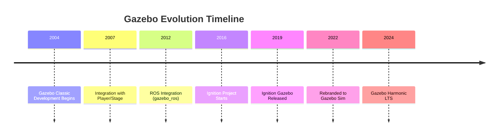
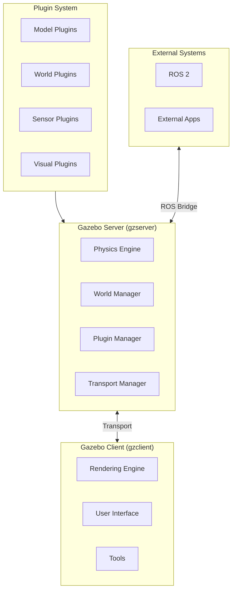
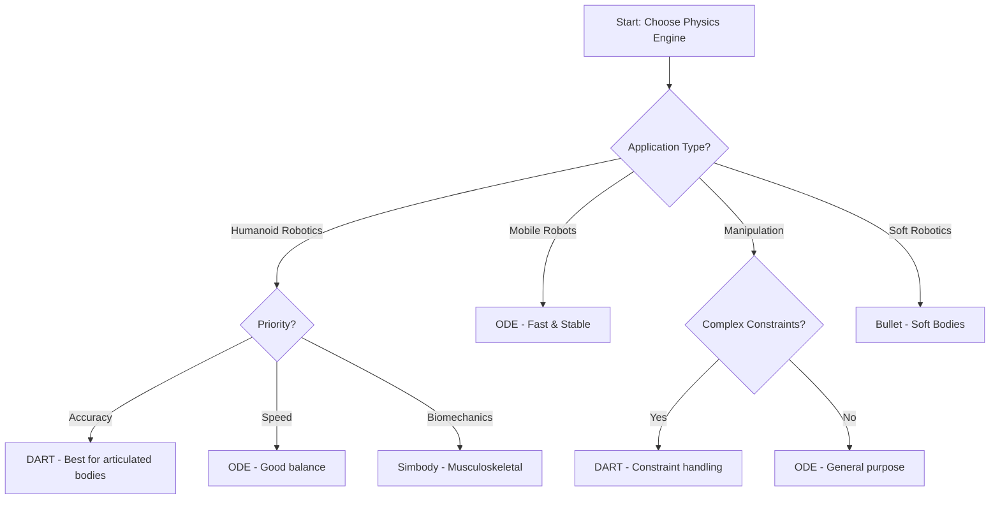
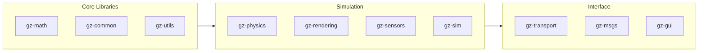
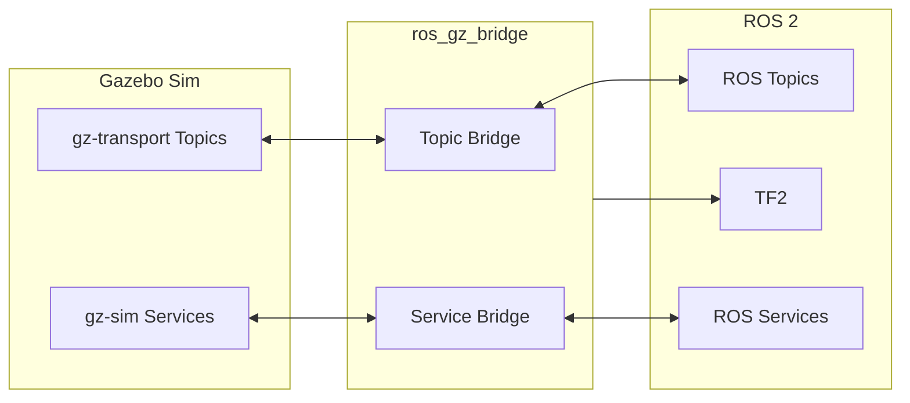

# Gazebo Physics Engine Overview

## Learning Objectives

By the end of this chapter, you will be able to:

- Understand Gazebo's architecture and core components
- Compare different physics engines available in Gazebo
- Navigate the Gazebo interface and toolset
- Configure basic simulation parameters
- Understand the relationship between Gazebo and ROS 2

## Introduction to Gazebo

**Gazebo** is a powerful, open-source 3D robotics simulator that provides accurate physics simulation, high-quality rendering, and extensive plugin support. Originally developed at the University of Southern California in 2004, Gazebo has become the de facto standard for robotics research and development, particularly in the ROS ecosystem.

With the evolution to **Gazebo Sim** (formerly Ignition Gazebo), the platform offers modern architecture, improved performance, and enhanced modularity.



## Gazebo Architecture

### Core Components



### Gazebo Server (gzserver)

The server handles all simulation computations:

```bash
# Start Gazebo server only (headless)
gz sim -s world.sdf

# Server with specific physics engine
gz sim -s --physics-engine dart world.sdf

# Verbose output for debugging
gz sim -s -v 4 world.sdf
```

### Gazebo Client (gzclient)

The client provides visualization and interaction:

```bash
# Start full Gazebo (server + client)
gz sim world.sdf

# Connect client to running server
gz sim -g
```

## Physics Engines

Gazebo supports multiple physics engines, each with unique characteristics:

### Comparison Matrix

| Feature | ODE | DART | Bullet | Simbody |
|---------|-----|------|--------|---------|
| **Speed** | Fast | Medium | Fast | Medium |
| **Accuracy** | Good | Excellent | Good | Excellent |
| **Soft Bodies** | No | Limited | Yes | No |
| **Constraints** | Good | Excellent | Good | Excellent |
| **Humanoids** | Fair | Excellent | Good | Good |
| **Use Case** | General | Research | Games/General | Biomechanics |

### ODE (Open Dynamics Engine)

ODE is the default physics engine, known for speed and stability:

```xml
<!-- SDF physics configuration for ODE -->
<physics name="ode_physics" type="ode">
  <max_step_size>0.001</max_step_size>
  <real_time_factor>1.0</real_time_factor>
  <real_time_update_rate>1000</real_time_update_rate>

  <ode>
    <solver>
      <type>quick</type>
      <iters>50</iters>
      <precon_iters>0</precon_iters>
      <sor>1.3</sor>
      <use_dynamic_moi_rescaling>false</use_dynamic_moi_rescaling>
    </solver>
    <constraints>
      <cfm>0.0</cfm>
      <erp>0.2</erp>
      <contact_max_correcting_vel>100.0</contact_max_correcting_vel>
      <contact_surface_layer>0.001</contact_surface_layer>
    </constraints>
  </ode>
</physics>
```

### DART (Dynamic Animation and Robotics Toolkit)

DART excels in articulated body simulation, making it ideal for humanoid robots:

```xml
<!-- SDF physics configuration for DART -->
<physics name="dart_physics" type="dart">
  <max_step_size>0.001</max_step_size>
  <real_time_factor>1.0</real_time_factor>

  <dart>
    <collision_detector>fcl</collision_detector>
    <solver>
      <solver_type>dantzig</solver_type>
    </solver>
  </dart>
</physics>
```

### Bullet Physics

Bullet is popular in game development and supports soft body simulation:

```xml
<!-- SDF physics configuration for Bullet -->
<physics name="bullet_physics" type="bullet">
  <max_step_size>0.001</max_step_size>
  <real_time_factor>1.0</real_time_factor>

  <bullet>
    <solver>
      <type>sequential_impulse</type>
      <min_step_size>0.0001</min_step_size>
      <iters>50</iters>
      <sor>1.3</sor>
    </solver>
    <constraints>
      <cfm>0.0</cfm>
      <erp>0.2</erp>
      <contact_surface_layer>0.001</contact_surface_layer>
      <split_impulse>true</split_impulse>
      <split_impulse_penetration_threshold>-0.01</split_impulse_penetration_threshold>
    </constraints>
  </bullet>
</physics>
```

## Choosing the Right Physics Engine



## Gazebo Sim Architecture (Modern)

Gazebo Sim uses a modular, plugin-based architecture:



### Key Libraries

| Library | Purpose |
|---------|---------|
| gz-math | Mathematical primitives (vectors, matrices, poses) |
| gz-physics | Physics engine abstraction layer |
| gz-rendering | Rendering engine abstraction (OGRE2) |
| gz-sensors | Sensor simulation framework |
| gz-transport | Inter-process communication |
| gz-sim | Main simulation server |

## Basic World Configuration

### Minimal World File

```xml
<?xml version="1.0" ?>
<sdf version="1.8">
  <world name="humanoid_world">
    <!-- Physics Configuration -->
    <physics name="1ms" type="dart">
      <max_step_size>0.001</max_step_size>
      <real_time_factor>1</real_time_factor>
    </physics>

    <!-- Plugins -->
    <plugin
      filename="gz-sim-physics-system"
      name="gz::sim::systems::Physics">
    </plugin>
    <plugin
      filename="gz-sim-scene-broadcaster-system"
      name="gz::sim::systems::SceneBroadcaster">
    </plugin>
    <plugin
      filename="gz-sim-user-commands-system"
      name="gz::sim::systems::UserCommands">
    </plugin>

    <!-- Lighting -->
    <light type="directional" name="sun">
      <cast_shadows>true</cast_shadows>
      <pose>0 0 10 0 0 0</pose>
      <diffuse>0.8 0.8 0.8 1</diffuse>
      <specular>0.2 0.2 0.2 1</specular>
      <attenuation>
        <range>1000</range>
        <constant>0.9</constant>
        <linear>0.01</linear>
        <quadratic>0.001</quadratic>
      </attenuation>
      <direction>-0.5 0.1 -0.9</direction>
    </light>

    <!-- Ground Plane -->
    <model name="ground_plane">
      <static>true</static>
      <link name="link">
        <collision name="collision">
          <geometry>
            <plane>
              <normal>0 0 1</normal>
              <size>100 100</size>
            </plane>
          </geometry>
          <surface>
            <friction>
              <ode>
                <mu>100</mu>
                <mu2>50</mu2>
              </ode>
            </friction>
          </surface>
        </collision>
        <visual name="visual">
          <geometry>
            <plane>
              <normal>0 0 1</normal>
              <size>100 100</size>
            </plane>
          </geometry>
          <material>
            <ambient>0.8 0.8 0.8 1</ambient>
            <diffuse>0.8 0.8 0.8 1</diffuse>
          </material>
        </visual>
      </link>
    </model>
  </world>
</sdf>
```

## Gazebo Command Line Interface

### Essential Commands

```bash
# Launch simulation
gz sim world.sdf

# List available worlds
gz sim --list

# Spawn a model
gz service -s /world/default/create \
  --reqtype gz.msgs.EntityFactory \
  --reptype gz.msgs.Boolean \
  --timeout 1000 \
  --req 'sdf_filename: "model.sdf", name: "my_robot"'

# Get model information
gz model -m my_robot

# Pause/Resume simulation
gz service -s /world/default/control \
  --reqtype gz.msgs.WorldControl \
  --reptype gz.msgs.Boolean \
  --timeout 1000 \
  --req 'pause: true'

# Set simulation speed
gz topic -t /world/default/stats -e
```

### Topic Inspection

```bash
# List all topics
gz topic -l

# Echo topic data
gz topic -t /model/robot/joint_state -e

# Publish to topic
gz topic -t /cmd_vel -m gz.msgs.Twist \
  -p 'linear: {x: 1.0}, angular: {z: 0.5}'
```

## Python Interface

Gazebo provides Python bindings for programmatic control:

```python
"""
Gazebo Python Interface Example
Demonstrates basic interaction with Gazebo simulation
"""

from gz.transport13 import Node
from gz.msgs10.twist_pb2 import Twist
from gz.msgs10.pose_pb2 import Pose
import time


class GazeboController:
    """Controller for interacting with Gazebo simulation."""

    def __init__(self):
        self.node = Node()
        self.cmd_vel_pub = None
        self.pose_sub = None
        self.current_pose = None

    def setup_publishers(self, robot_name: str) -> None:
        """Set up publishers for robot control."""
        topic = f"/model/{robot_name}/cmd_vel"
        self.cmd_vel_pub = self.node.advertise(topic, Twist)
        print(f"Publisher created on {topic}")

    def setup_subscribers(self, robot_name: str) -> None:
        """Set up subscribers for robot state."""
        topic = f"/model/{robot_name}/pose"
        self.node.subscribe(Pose, topic, self._pose_callback)
        print(f"Subscriber created on {topic}")

    def _pose_callback(self, msg: Pose) -> None:
        """Callback for pose updates."""
        self.current_pose = {
            'position': {
                'x': msg.position.x,
                'y': msg.position.y,
                'z': msg.position.z
            },
            'orientation': {
                'w': msg.orientation.w,
                'x': msg.orientation.x,
                'y': msg.orientation.y,
                'z': msg.orientation.z
            }
        }

    def send_velocity(self, linear_x: float, angular_z: float) -> bool:
        """Send velocity command to robot."""
        if self.cmd_vel_pub is None:
            print("Publisher not initialized")
            return False

        msg = Twist()
        msg.linear.x = linear_x
        msg.angular.z = angular_z

        return self.cmd_vel_pub.publish(msg)

    def get_pose(self) -> dict:
        """Get current robot pose."""
        return self.current_pose


def main():
    """Main function demonstrating Gazebo control."""
    controller = GazeboController()
    controller.setup_publishers("humanoid_robot")
    controller.setup_subscribers("humanoid_robot")

    # Move robot forward
    print("Moving robot forward...")
    for _ in range(100):
        controller.send_velocity(0.5, 0.0)
        time.sleep(0.01)

    # Turn robot
    print("Turning robot...")
    for _ in range(50):
        controller.send_velocity(0.0, 0.5)
        time.sleep(0.01)

    # Stop robot
    controller.send_velocity(0.0, 0.0)
    print(f"Final pose: {controller.get_pose()}")


if __name__ == "__main__":
    main()
```

## ROS 2 Integration Overview

Gazebo integrates with ROS 2 through the `ros_gz` bridge:



### Bridge Configuration

```yaml
# bridge_config.yaml
- ros_topic_name: "/cmd_vel"
  gz_topic_name: "/model/robot/cmd_vel"
  ros_type_name: "geometry_msgs/msg/Twist"
  gz_type_name: "gz.msgs.Twist"
  direction: ROS_TO_GZ

- ros_topic_name: "/joint_states"
  gz_topic_name: "/world/default/model/robot/joint_state"
  ros_type_name: "sensor_msgs/msg/JointState"
  gz_type_name: "gz.msgs.Model"
  direction: GZ_TO_ROS

- ros_topic_name: "/scan"
  gz_topic_name: "/lidar"
  ros_type_name: "sensor_msgs/msg/LaserScan"
  gz_type_name: "gz.msgs.LaserScan"
  direction: GZ_TO_ROS
```

## Practical Exercises

### Exercise 1: Create a Basic World

Create a world file with:
1. DART physics engine configured for 1ms timestep
2. A ground plane with friction
3. Directional lighting
4. A simple box model

```xml
<!-- Complete this world file -->
<?xml version="1.0" ?>
<sdf version="1.8">
  <world name="exercise_world">
    <!-- Add physics configuration -->

    <!-- Add lighting -->

    <!-- Add ground plane -->

    <!-- Add a box at position (2, 0, 0.5) -->

  </world>
</sdf>
```

### Exercise 2: Physics Engine Comparison

Run the same simulation with different physics engines and compare:

```bash
# Create test script
#!/bin/bash

WORLD="test_world.sdf"

# Test with ODE
echo "Testing ODE..."
timeout 60 gz sim -s --physics-engine ode $WORLD &
# Record metrics...

# Test with DART
echo "Testing DART..."
timeout 60 gz sim -s --physics-engine dart $WORLD &
# Record metrics...

# Test with Bullet
echo "Testing Bullet..."
timeout 60 gz sim -s --physics-engine bullet $WORLD &
# Record metrics...
```

Document your findings on:
- Simulation speed (real-time factor)
- Contact behavior
- Joint stability

### Exercise 3: Command Line Mastery

Using only CLI commands:
1. Launch a simulation in headless mode
2. Spawn a robot model
3. Query the robot's joint states
4. Send a velocity command
5. Pause and resume the simulation

## Key Takeaways

1. **Gazebo is modular** - Choose physics engines based on your application needs
2. **DART excels for humanoids** - Best constraint handling and articulated body simulation
3. **SDF is the format** - Simulation Description Format defines worlds and models
4. **Plugin architecture** - Extend functionality through system, model, and sensor plugins
5. **ROS 2 integration** - The ros_gz bridge enables seamless communication

## Common Issues and Solutions

| Issue | Cause | Solution |
|-------|-------|----------|
| Low real-time factor | Complex physics | Increase timestep or simplify models |
| Unstable simulation | Timestep too large | Reduce max_step_size |
| Missing visuals | Rendering plugin not loaded | Add scene broadcaster plugin |
| No sensor data | Sensor plugin missing | Add appropriate sensor system plugin |

## Next Chapter Preview

In the next chapter, we will learn how to **import URDF models into Gazebo**. You will understand the conversion process from URDF to SDF, configure Gazebo-specific properties, and successfully simulate your humanoid robot model.
