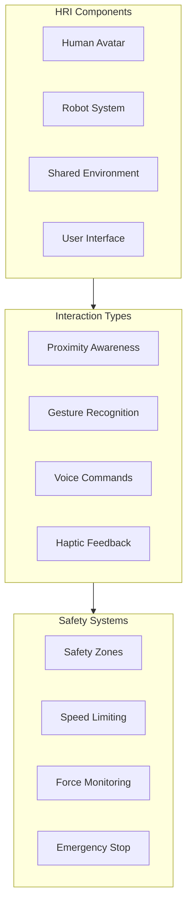

# Human-Robot Interaction in Unity

## Learning Objectives

By the end of this chapter, you will be able to:

- Design human-robot interaction scenarios in Unity
- Implement human avatars with realistic animation
- Create safety visualization systems
- Develop interactive robot control interfaces
- Simulate collaborative robot operations

## Understanding HRI in Simulation

Human-Robot Interaction (HRI) simulation is essential for developing safe and effective robots that work alongside humans.



## Human Avatar System

### Avatar Controller

```csharp
// HumanAvatarController.cs
using UnityEngine;
using System.Collections.Generic;

public class HumanAvatarController : MonoBehaviour
{
    [Header("Avatar Components")]
    public Animator animator;
    public Transform rootBone;

    [Header("Movement Settings")]
    public float walkSpeed = 1.4f;
    public float runSpeed = 5.0f;
    public float turnSpeed = 120f;

    [Header("IK Settings")]
    public bool enableIK = true;
    public Transform lookTarget;
    public float lookWeight = 0.8f;

    [Header("Animation Parameters")]
    private static readonly int SpeedHash = Animator.StringToHash("Speed");
    private static readonly int DirectionHash = Animator.StringToHash("Direction");
    private static readonly int IsWalkingHash = Animator.StringToHash("IsWalking");

    private CharacterController characterController;
    private Vector3 moveDirection;

    void Start()
    {
        characterController = GetComponent<CharacterController>();
        if (characterController == null)
        {
            characterController = gameObject.AddComponent<CharacterController>();
        }

        if (animator == null)
        {
            animator = GetComponent<Animator>();
        }
    }

    void Update()
    {
        HandleInput();
        ApplyMovement();
        UpdateAnimation();
    }

    void HandleInput()
    {
        float horizontal = Input.GetAxis("Horizontal");
        float vertical = Input.GetAxis("Vertical");

        moveDirection = new Vector3(horizontal, 0, vertical);
        moveDirection = transform.TransformDirection(moveDirection);

        if (Input.GetKey(KeyCode.LeftShift))
        {
            moveDirection *= runSpeed;
        }
        else
        {
            moveDirection *= walkSpeed;
        }
    }

    void ApplyMovement()
    {
        if (!characterController.isGrounded)
        {
            moveDirection.y -= 9.81f * Time.deltaTime;
        }

        characterController.Move(moveDirection * Time.deltaTime);

        // Rotate towards movement direction
        if (moveDirection.magnitude > 0.1f)
        {
            Vector3 lookDirection = new Vector3(moveDirection.x, 0, moveDirection.z);
            if (lookDirection != Vector3.zero)
            {
                Quaternion targetRotation = Quaternion.LookRotation(lookDirection);
                transform.rotation = Quaternion.RotateTowards(
                    transform.rotation,
                    targetRotation,
                    turnSpeed * Time.deltaTime
                );
            }
        }
    }

    void UpdateAnimation()
    {
        float speed = new Vector2(moveDirection.x, moveDirection.z).magnitude;
        animator.SetFloat(SpeedHash, speed);
        animator.SetBool(IsWalkingHash, speed > 0.1f);
    }

    void OnAnimatorIK(int layerIndex)
    {
        if (!enableIK || animator == null) return;

        // Look at target
        if (lookTarget != null)
        {
            animator.SetLookAtWeight(lookWeight);
            animator.SetLookAtPosition(lookTarget.position);
        }
    }

    public void SetDestination(Vector3 destination)
    {
        // For AI-controlled avatars
        StartCoroutine(MoveToDestination(destination));
    }

    private System.Collections.IEnumerator MoveToDestination(Vector3 destination)
    {
        while (Vector3.Distance(transform.position, destination) > 0.5f)
        {
            Vector3 direction = (destination - transform.position).normalized;
            moveDirection = direction * walkSpeed;
            yield return null;
        }
        moveDirection = Vector3.zero;
    }
}
```

### Procedural Human Motion

```csharp
// ProceduralHumanMotion.cs
using UnityEngine;

public class ProceduralHumanMotion : MonoBehaviour
{
    [Header("Body Parts")]
    public Transform head;
    public Transform spine;
    public Transform leftHand;
    public Transform rightHand;

    [Header("Motion Settings")]
    public float breathingAmplitude = 0.02f;
    public float breathingFrequency = 0.2f;
    public float idleSwayAmplitude = 0.01f;
    public float idleSwayFrequency = 0.5f;

    [Header("Interaction")]
    public Transform interactionTarget;
    public float reachSpeed = 2f;

    private Vector3 spineOriginalPosition;
    private Quaternion headOriginalRotation;
    private bool isReaching = false;
    private Vector3 reachTarget;

    void Start()
    {
        if (spine != null)
            spineOriginalPosition = spine.localPosition;
        if (head != null)
            headOriginalRotation = head.localRotation;
    }

    void Update()
    {
        ApplyBreathing();
        ApplyIdleSway();
        ApplyLookAtBehavior();

        if (isReaching)
        {
            ApplyReaching();
        }
    }

    void ApplyBreathing()
    {
        if (spine == null) return;

        float breathing = Mathf.Sin(Time.time * breathingFrequency * 2 * Mathf.PI);
        Vector3 breathOffset = Vector3.up * breathing * breathingAmplitude;
        spine.localPosition = spineOriginalPosition + breathOffset;
    }

    void ApplyIdleSway()
    {
        if (spine == null) return;

        float swayX = Mathf.Sin(Time.time * idleSwayFrequency * 2 * Mathf.PI);
        float swayZ = Mathf.Cos(Time.time * idleSwayFrequency * 1.3f * 2 * Mathf.PI);

        Vector3 swayOffset = new Vector3(swayX, 0, swayZ) * idleSwayAmplitude;
        spine.localPosition += swayOffset;
    }

    void ApplyLookAtBehavior()
    {
        if (head == null || interactionTarget == null) return;

        Vector3 lookDirection = interactionTarget.position - head.position;
        Quaternion targetRotation = Quaternion.LookRotation(lookDirection);

        // Limit head rotation
        Quaternion localTarget = Quaternion.Inverse(transform.rotation) * targetRotation;
        Vector3 eulerAngles = localTarget.eulerAngles;

        // Clamp angles
        eulerAngles.x = ClampAngle(eulerAngles.x, -30, 30);
        eulerAngles.y = ClampAngle(eulerAngles.y, -60, 60);
        eulerAngles.z = 0;

        head.localRotation = Quaternion.Slerp(
            head.localRotation,
            Quaternion.Euler(eulerAngles),
            Time.deltaTime * 3f
        );
    }

    void ApplyReaching()
    {
        if (rightHand == null) return;

        Vector3 targetPos = reachTarget;
        rightHand.position = Vector3.Lerp(
            rightHand.position,
            targetPos,
            Time.deltaTime * reachSpeed
        );

        if (Vector3.Distance(rightHand.position, targetPos) < 0.05f)
        {
            isReaching = false;
        }
    }

    public void ReachTo(Vector3 worldPosition)
    {
        reachTarget = worldPosition;
        isReaching = true;
    }

    float ClampAngle(float angle, float min, float max)
    {
        if (angle > 180) angle -= 360;
        return Mathf.Clamp(angle, min, max);
    }
}
```

## Safety Visualization System

### Safety Zone Manager

```csharp
// SafetyZoneManager.cs
using UnityEngine;
using System.Collections.Generic;

public class SafetyZoneManager : MonoBehaviour
{
    [System.Serializable]
    public class SafetyZone
    {
        public string name;
        public ZoneType type;
        public Transform center;
        public float radius;
        public Color color;
        public bool isActive = true;

        [HideInInspector]
        public GameObject visualization;
        [HideInInspector]
        public List<Transform> occupants = new List<Transform>();
    }

    public enum ZoneType
    {
        Warning,      // Yellow - reduce speed
        Protective,   // Orange - significant slowdown
        Safety,       // Red - stop robot
        Collaborative // Green - shared workspace
    }

    [Header("Zones")]
    public List<SafetyZone> zones = new List<SafetyZone>();

    [Header("Visualization")]
    public Material zoneMaterial;
    public bool showZones = true;
    public float zoneOpacity = 0.3f;

    [Header("Robot Reference")]
    public Transform robotTransform;
    public HumanoidController robotController;

    [Header("Events")]
    public UnityEngine.Events.UnityEvent<string, ZoneType> OnZoneEnter;
    public UnityEngine.Events.UnityEvent<string, ZoneType> OnZoneExit;

    private Dictionary<ZoneType, Color> zoneColors = new Dictionary<ZoneType, Color>
    {
        { ZoneType.Warning, new Color(1f, 1f, 0f, 0.3f) },
        { ZoneType.Protective, new Color(1f, 0.5f, 0f, 0.3f) },
        { ZoneType.Safety, new Color(1f, 0f, 0f, 0.3f) },
        { ZoneType.Collaborative, new Color(0f, 1f, 0f, 0.3f) }
    };

    void Start()
    {
        InitializeZoneVisuals();
    }

    void Update()
    {
        UpdateZoneOccupancy();
        UpdateVisualization();
    }

    void InitializeZoneVisuals()
    {
        foreach (var zone in zones)
        {
            CreateZoneVisual(zone);
        }
    }

    void CreateZoneVisual(SafetyZone zone)
    {
        GameObject visual = GameObject.CreatePrimitive(PrimitiveType.Cylinder);
        visual.name = $"Zone_{zone.name}_Visual";
        visual.transform.parent = zone.center;
        visual.transform.localPosition = Vector3.zero;
        visual.transform.localScale = new Vector3(
            zone.radius * 2,
            0.01f,
            zone.radius * 2
        );

        // Remove collider from visual
        Destroy(visual.GetComponent<Collider>());

        // Setup material
        var renderer = visual.GetComponent<Renderer>();
        Material mat = new Material(zoneMaterial);
        Color color = zoneColors.ContainsKey(zone.type) ?
            zoneColors[zone.type] : zone.color;
        color.a = zoneOpacity;
        mat.color = color;
        renderer.material = mat;

        zone.visualization = visual;
    }

    void UpdateZoneOccupancy()
    {
        // Find all humans in scene
        var humans = FindObjectsOfType<HumanAvatarController>();

        foreach (var zone in zones)
        {
            if (!zone.isActive) continue;

            List<Transform> currentOccupants = new List<Transform>();

            foreach (var human in humans)
            {
                float distance = Vector3.Distance(
                    human.transform.position,
                    zone.center.position
                );

                if (distance <= zone.radius)
                {
                    currentOccupants.Add(human.transform);

                    // Check if just entered
                    if (!zone.occupants.Contains(human.transform))
                    {
                        OnZoneEnter?.Invoke(zone.name, zone.type);
                        HandleZoneEnter(zone, human.transform);
                    }
                }
            }

            // Check for exits
            foreach (var occupant in zone.occupants)
            {
                if (!currentOccupants.Contains(occupant))
                {
                    OnZoneExit?.Invoke(zone.name, zone.type);
                    HandleZoneExit(zone, occupant);
                }
            }

            zone.occupants = currentOccupants;
        }
    }

    void HandleZoneEnter(SafetyZone zone, Transform human)
    {
        Debug.Log($"Human entered {zone.type} zone: {zone.name}");

        if (robotController != null)
        {
            switch (zone.type)
            {
                case ZoneType.Warning:
                    robotController.SetSpeedLimit(0.7f);
                    break;
                case ZoneType.Protective:
                    robotController.SetSpeedLimit(0.3f);
                    break;
                case ZoneType.Safety:
                    robotController.EmergencyStop();
                    break;
                case ZoneType.Collaborative:
                    robotController.EnableCollaborativeMode();
                    break;
            }
        }
    }

    void HandleZoneExit(SafetyZone zone, Transform human)
    {
        Debug.Log($"Human exited {zone.type} zone: {zone.name}");

        // Check if any zones still occupied
        bool anyOccupied = false;
        foreach (var z in zones)
        {
            if (z.occupants.Count > 0)
            {
                anyOccupied = true;
                break;
            }
        }

        if (!anyOccupied && robotController != null)
        {
            robotController.ResumeNormalOperation();
        }
    }

    void UpdateVisualization()
    {
        foreach (var zone in zones)
        {
            if (zone.visualization != null)
            {
                zone.visualization.SetActive(showZones && zone.isActive);

                // Pulse effect when occupied
                if (zone.occupants.Count > 0)
                {
                    var renderer = zone.visualization.GetComponent<Renderer>();
                    float pulse = 0.5f + 0.5f * Mathf.Sin(Time.time * 5);
                    Color color = renderer.material.color;
                    color.a = zoneOpacity * (0.5f + 0.5f * pulse);
                    renderer.material.color = color;
                }
            }
        }
    }

    public void AddZone(string name, ZoneType type, Vector3 position, float radius)
    {
        GameObject centerObj = new GameObject($"Zone_{name}_Center");
        centerObj.transform.position = position;
        centerObj.transform.parent = transform;

        SafetyZone zone = new SafetyZone
        {
            name = name,
            type = type,
            center = centerObj.transform,
            radius = radius
        };

        zones.Add(zone);
        CreateZoneVisual(zone);
    }
}
```

### Robot Speed Controller Interface

```csharp
// HumanoidController extension for safety
public partial class HumanoidController
{
    private float speedLimitMultiplier = 1.0f;
    private bool isEmergencyStopped = false;
    private bool isCollaborativeMode = false;

    public void SetSpeedLimit(float multiplier)
    {
        speedLimitMultiplier = Mathf.Clamp01(multiplier);
        Debug.Log($"Speed limit set to {multiplier * 100}%");
    }

    public void EmergencyStop()
    {
        isEmergencyStopped = true;
        speedLimitMultiplier = 0f;

        // Stop all joints immediately
        foreach (var joint in jointMap.Values)
        {
            var drive = joint.xDrive;
            drive.targetVelocity = 0f;
            joint.xDrive = drive;
        }

        Debug.LogWarning("EMERGENCY STOP ACTIVATED");
    }

    public void EnableCollaborativeMode()
    {
        isCollaborativeMode = true;
        speedLimitMultiplier = 0.5f;

        // Reduce joint forces
        foreach (var joint in jointMap.Values)
        {
            var drive = joint.xDrive;
            drive.forceLimit *= 0.3f;  // Reduce force for safety
            joint.xDrive = drive;
        }

        Debug.Log("Collaborative mode enabled");
    }

    public void ResumeNormalOperation()
    {
        isEmergencyStopped = false;
        isCollaborativeMode = false;
        speedLimitMultiplier = 1.0f;

        // Restore normal joint forces
        foreach (var joint in jointMap.Values)
        {
            var drive = joint.xDrive;
            drive.forceLimit = maxJointForce;
            joint.xDrive = drive;
        }

        Debug.Log("Normal operation resumed");
    }
}
```

## Interaction Interface

### Robot Control Panel

```csharp
// RobotControlPanel.cs
using UnityEngine;
using UnityEngine.UI;
using TMPro;

public class RobotControlPanel : MonoBehaviour
{
    [Header("UI Elements")]
    public Canvas controlCanvas;
    public Button startButton;
    public Button stopButton;
    public Button homeButton;
    public Slider speedSlider;
    public TextMeshProUGUI statusText;
    public TextMeshProUGUI positionText;

    [Header("Robot Reference")]
    public HumanoidController robotController;
    public Transform robotBase;

    [Header("Visualization")]
    public GameObject trajectoryVisualization;
    public LineRenderer pathRenderer;

    private bool isRunning = false;

    void Start()
    {
        SetupUI();
    }

    void SetupUI()
    {
        if (startButton != null)
            startButton.onClick.AddListener(OnStartPressed);
        if (stopButton != null)
            stopButton.onClick.AddListener(OnStopPressed);
        if (homeButton != null)
            homeButton.onClick.AddListener(OnHomePressed);
        if (speedSlider != null)
            speedSlider.onValueChanged.AddListener(OnSpeedChanged);
    }

    void Update()
    {
        UpdateStatusDisplay();
        UpdatePositionDisplay();
    }

    void OnStartPressed()
    {
        if (robotController != null)
        {
            robotController.ResumeNormalOperation();
            isRunning = true;
            UpdateButtonStates();
        }
    }

    void OnStopPressed()
    {
        if (robotController != null)
        {
            robotController.EmergencyStop();
            isRunning = false;
            UpdateButtonStates();
        }
    }

    void OnHomePressed()
    {
        if (robotController != null)
        {
            // Move all joints to home position
            var homePositions = new Dictionary<string, float>();
            foreach (var joint in robotController.GetAllJointPositions())
            {
                homePositions[joint.Key] = 0f;
            }
            robotController.SetJointTargets(homePositions);
        }
    }

    void OnSpeedChanged(float value)
    {
        if (robotController != null)
        {
            robotController.SetSpeedLimit(value);
        }
    }

    void UpdateStatusDisplay()
    {
        if (statusText == null) return;

        string status = isRunning ? "RUNNING" : "STOPPED";
        Color color = isRunning ? Color.green : Color.red;

        statusText.text = $"Status: {status}";
        statusText.color = color;
    }

    void UpdatePositionDisplay()
    {
        if (positionText == null || robotBase == null) return;

        Vector3 pos = robotBase.position;
        Vector3 euler = robotBase.eulerAngles;

        positionText.text = $"Position: ({pos.x:F2}, {pos.y:F2}, {pos.z:F2})\n" +
                           $"Rotation: ({euler.x:F1}, {euler.y:F1}, {euler.z:F1})";
    }

    void UpdateButtonStates()
    {
        if (startButton != null)
            startButton.interactable = !isRunning;
        if (stopButton != null)
            stopButton.interactable = isRunning;
    }

    public void ShowTrajectory(Vector3[] points)
    {
        if (pathRenderer == null) return;

        pathRenderer.positionCount = points.Length;
        pathRenderer.SetPositions(points);
        pathRenderer.enabled = true;
    }

    public void HideTrajectory()
    {
        if (pathRenderer != null)
            pathRenderer.enabled = false;
    }
}
```

### Gesture Recognition System

```csharp
// GestureRecognizer.cs
using UnityEngine;
using System.Collections.Generic;

public class GestureRecognizer : MonoBehaviour
{
    [System.Serializable]
    public class Gesture
    {
        public string name;
        public GestureType type;
        public UnityEngine.Events.UnityEvent onRecognized;
    }

    public enum GestureType
    {
        Wave,
        Stop,
        Come,
        Point,
        ThumbsUp
    }

    [Header("Hand Tracking")]
    public Transform leftHand;
    public Transform rightHand;
    public Transform head;

    [Header("Gestures")]
    public List<Gesture> gestures = new List<Gesture>();

    [Header("Recognition Settings")]
    public float recognitionThreshold = 0.8f;
    public float gestureCooldown = 1.0f;

    private Vector3[] leftHandHistory = new Vector3[30];
    private Vector3[] rightHandHistory = new Vector3[30];
    private int historyIndex = 0;
    private float lastGestureTime = 0;

    void Update()
    {
        RecordHandPositions();
        DetectGestures();
    }

    void RecordHandPositions()
    {
        if (leftHand != null)
            leftHandHistory[historyIndex] = leftHand.position;
        if (rightHand != null)
            rightHandHistory[historyIndex] = rightHand.position;

        historyIndex = (historyIndex + 1) % leftHandHistory.Length;
    }

    void DetectGestures()
    {
        if (Time.time - lastGestureTime < gestureCooldown) return;

        // Check for each gesture type
        if (DetectWaveGesture())
        {
            TriggerGesture(GestureType.Wave);
        }
        else if (DetectStopGesture())
        {
            TriggerGesture(GestureType.Stop);
        }
        else if (DetectComeGesture())
        {
            TriggerGesture(GestureType.Come);
        }
    }

    bool DetectWaveGesture()
    {
        if (rightHand == null || head == null) return false;

        // Hand should be above head
        if (rightHand.position.y < head.position.y) return false;

        // Check for side-to-side motion
        float lateralMotion = CalculateLateralMotion(rightHandHistory);
        return lateralMotion > 0.3f;
    }

    bool DetectStopGesture()
    {
        if (rightHand == null || head == null) return false;

        // Hand extended forward at chest height
        Vector3 handRelative = rightHand.position - head.position;

        bool correctHeight = Mathf.Abs(handRelative.y + 0.3f) < 0.2f;
        bool extendedForward = handRelative.z > 0.3f;
        bool lowMotion = CalculateTotalMotion(rightHandHistory) < 0.05f;

        return correctHeight && extendedForward && lowMotion;
    }

    bool DetectComeGesture()
    {
        if (rightHand == null) return false;

        // Check for beckoning motion (toward body)
        float forwardMotion = CalculateForwardMotion(rightHandHistory);
        return forwardMotion < -0.2f;  // Moving toward body
    }

    float CalculateLateralMotion(Vector3[] history)
    {
        float totalLateral = 0;
        for (int i = 1; i < history.Length; i++)
        {
            totalLateral += Mathf.Abs(history[i].x - history[i-1].x);
        }
        return totalLateral;
    }

    float CalculateForwardMotion(Vector3[] history)
    {
        if (history.Length < 2) return 0;
        return history[historyIndex].z - history[(historyIndex + 1) % history.Length].z;
    }

    float CalculateTotalMotion(Vector3[] history)
    {
        float total = 0;
        for (int i = 1; i < history.Length; i++)
        {
            total += Vector3.Distance(history[i], history[i-1]);
        }
        return total;
    }

    void TriggerGesture(GestureType type)
    {
        lastGestureTime = Time.time;

        foreach (var gesture in gestures)
        {
            if (gesture.type == type)
            {
                gesture.onRecognized?.Invoke();
                Debug.Log($"Gesture recognized: {gesture.name}");
                break;
            }
        }
    }
}
```

## Collaborative Scenario

### Handover Task

```csharp
// HandoverTask.cs
using UnityEngine;
using System.Collections;

public class HandoverTask : MonoBehaviour
{
    [Header("Participants")]
    public Transform robotHand;
    public Transform humanHand;
    public GameObject objectToHandover;

    [Header("Task Settings")]
    public float approachDistance = 0.3f;
    public float releaseForceThreshold = 5f;
    public float handoverTimeout = 10f;

    [Header("State")]
    public HandoverState currentState = HandoverState.Idle;

    public enum HandoverState
    {
        Idle,
        Approaching,
        Offering,
        WaitingForGrasp,
        Releasing,
        Complete
    }

    private Vector3 handoverPosition;
    private float taskStartTime;

    public void StartHandover(Vector3 targetPosition)
    {
        handoverPosition = targetPosition;
        taskStartTime = Time.time;
        currentState = HandoverState.Approaching;
        StartCoroutine(HandoverSequence());
    }

    IEnumerator HandoverSequence()
    {
        // Phase 1: Approach
        currentState = HandoverState.Approaching;
        yield return MoveToPosition(handoverPosition);

        // Phase 2: Offer object
        currentState = HandoverState.Offering;
        yield return OfferObject();

        // Phase 3: Wait for grasp
        currentState = HandoverState.WaitingForGrasp;
        yield return WaitForGrasp();

        // Phase 4: Release
        currentState = HandoverState.Releasing;
        yield return ReleaseObject();

        // Complete
        currentState = HandoverState.Complete;
        Debug.Log("Handover complete");
    }

    IEnumerator MoveToPosition(Vector3 target)
    {
        while (Vector3.Distance(robotHand.position, target) > 0.05f)
        {
            robotHand.position = Vector3.MoveTowards(
                robotHand.position,
                target,
                Time.deltaTime * 0.5f
            );

            if (Time.time - taskStartTime > handoverTimeout)
            {
                Debug.LogWarning("Handover timeout during approach");
                yield break;
            }

            yield return null;
        }
    }

    IEnumerator OfferObject()
    {
        // Rotate hand to offering position
        Quaternion targetRotation = Quaternion.Euler(0, 0, -90);
        float duration = 0.5f;
        float elapsed = 0;

        while (elapsed < duration)
        {
            robotHand.localRotation = Quaternion.Slerp(
                robotHand.localRotation,
                targetRotation,
                elapsed / duration
            );
            elapsed += Time.deltaTime;
            yield return null;
        }
    }

    IEnumerator WaitForGrasp()
    {
        // Wait for human hand to be close
        while (Vector3.Distance(robotHand.position, humanHand.position) > approachDistance)
        {
            if (Time.time - taskStartTime > handoverTimeout)
            {
                Debug.LogWarning("Handover timeout waiting for grasp");
                yield break;
            }
            yield return null;
        }

        // Human is close enough
        Debug.Log("Human approaching for grasp");

        // Wait a moment for grasp
        yield return new WaitForSeconds(0.5f);
    }

    IEnumerator ReleaseObject()
    {
        // Release the object
        if (objectToHandover != null)
        {
            // Parent to human hand
            objectToHandover.transform.parent = humanHand;

            // Enable physics if it has a rigidbody
            var rb = objectToHandover.GetComponent<Rigidbody>();
            if (rb != null)
            {
                rb.isKinematic = false;
            }
        }

        yield return new WaitForSeconds(0.2f);
    }
}
```

## Practical Exercises

### Exercise 1: Create HRI Scenario

Design a complete HRI scenario:
1. Human approaches robot workstation
2. Robot detects human and slows down
3. Human signals robot with gesture
4. Robot performs collaborative task
5. Human exits, robot resumes normal operation

### Exercise 2: Safety System

Implement a comprehensive safety system:
1. Multiple overlapping safety zones
2. Visual feedback (zone colors, robot status)
3. Automatic speed adjustment
4. Emergency stop functionality

### Exercise 3: Interactive Demo

Create an interactive demonstration:
1. Touch-screen control panel
2. Voice command integration
3. Gesture-based control
4. Real-time status visualization

## Key Takeaways

1. **Safety is paramount** - Always implement safety zones and speed limiting
2. **Visual feedback matters** - Users need to understand robot state
3. **Natural interaction** - Support multiple input modalities
4. **Collaborative design** - Consider shared workspace scenarios
5. **Test extensively** - Simulate various human behaviors

## Next Chapter Preview

In the next chapter, we will explore **ROS-Unity Bridge** for connecting Unity simulations with ROS 2 systems. You will learn to exchange messages, synchronize state, and integrate Unity as part of a larger robotics system.
