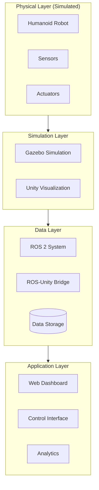

# Mini Project: Digital Twin System

## Project Overview

In this comprehensive mini-project, you will build a complete digital twin system for a humanoid robot. This project integrates concepts from all previous chapters into a working system.



## Learning Objectives

By completing this project, you will:

- Build a complete digital twin architecture
- Integrate Gazebo simulation with ROS 2
- Create Unity visualization with ROS bridge
- Implement real-time data synchronization
- Develop a monitoring dashboard

## Project Structure

```
digital_twin_project/
├── ros2_ws/
│   └── src/
│       ├── humanoid_description/
│       │   ├── urdf/
│       │   ├── meshes/
│       │   └── launch/
│       ├── humanoid_gazebo/
│       │   ├── worlds/
│       │   ├── launch/
│       │   └── config/
│       ├── humanoid_control/
│       │   ├── config/
│       │   └── src/
│       └── digital_twin_core/
│           ├── src/
│           └── launch/
├── unity_project/
│   └── Assets/
│       ├── Robots/
│       ├── Scripts/
│       └── Scenes/
└── dashboard/
    ├── backend/
    └── frontend/
```

## Phase 1: Robot Model and Simulation

### Step 1.1: Create URDF Model

```xml
<?xml version="1.0"?>
<robot name="humanoid_twin" xmlns:xacro="http://www.ros.org/wiki/xacro">

  <!-- Properties -->
  <xacro:property name="torso_mass" value="15.0"/>
  <xacro:property name="leg_mass" value="8.0"/>
  <xacro:property name="arm_mass" value="3.0"/>

  <!-- Materials -->
  <material name="blue">
    <color rgba="0.2 0.4 0.8 1"/>
  </material>
  <material name="grey">
    <color rgba="0.5 0.5 0.5 1"/>
  </material>

  <!-- Base Link -->
  <link name="base_link"/>

  <!-- Torso -->
  <link name="torso_link">
    <inertial>
      <origin xyz="0 0 0" rpy="0 0 0"/>
      <mass value="${torso_mass}"/>
      <inertia ixx="0.5" ixy="0" ixz="0" iyy="0.3" iyz="0" izz="0.4"/>
    </inertial>
    <visual>
      <geometry>
        <box size="0.3 0.2 0.5"/>
      </geometry>
      <material name="blue"/>
    </visual>
    <collision>
      <geometry>
        <box size="0.3 0.2 0.5"/>
      </geometry>
    </collision>
  </link>

  <joint name="base_to_torso" type="fixed">
    <parent link="base_link"/>
    <child link="torso_link"/>
    <origin xyz="0 0 0.8" rpy="0 0 0"/>
  </joint>

  <!-- Head -->
  <link name="head_link">
    <inertial>
      <mass value="2.0"/>
      <inertia ixx="0.02" ixy="0" ixz="0" iyy="0.02" iyz="0" izz="0.02"/>
    </inertial>
    <visual>
      <geometry>
        <sphere radius="0.1"/>
      </geometry>
      <material name="grey"/>
    </visual>
    <collision>
      <geometry>
        <sphere radius="0.1"/>
      </geometry>
    </collision>
  </link>

  <joint name="head_joint" type="revolute">
    <parent link="torso_link"/>
    <child link="head_link"/>
    <origin xyz="0 0 0.35" rpy="0 0 0"/>
    <axis xyz="0 0 1"/>
    <limit lower="-1.57" upper="1.57" effort="20" velocity="2"/>
    <dynamics damping="0.5" friction="0.1"/>
  </joint>

  <!-- Include leg macro -->
  <xacro:include filename="$(find humanoid_description)/urdf/leg.urdf.xacro"/>
  <xacro:leg prefix="left" reflect="1"/>
  <xacro:leg prefix="right" reflect="-1"/>

  <!-- Include arm macro -->
  <xacro:include filename="$(find humanoid_description)/urdf/arm.urdf.xacro"/>
  <xacro:arm prefix="left" reflect="1"/>
  <xacro:arm prefix="right" reflect="-1"/>

  <!-- Gazebo Extensions -->
  <xacro:include filename="$(find humanoid_description)/urdf/gazebo.urdf.xacro"/>

  <!-- ros2_control -->
  <xacro:include filename="$(find humanoid_description)/urdf/ros2_control.urdf.xacro"/>

</robot>
```

### Step 1.2: Create Gazebo World

```xml
<?xml version="1.0" ?>
<sdf version="1.8">
  <world name="digital_twin_world">

    <!-- Physics -->
    <physics name="dart_physics" type="dart">
      <max_step_size>0.001</max_step_size>
      <real_time_factor>1.0</real_time_factor>
    </physics>

    <!-- Plugins -->
    <plugin filename="gz-sim-physics-system"
            name="gz::sim::systems::Physics"/>
    <plugin filename="gz-sim-scene-broadcaster-system"
            name="gz::sim::systems::SceneBroadcaster"/>
    <plugin filename="gz-sim-user-commands-system"
            name="gz::sim::systems::UserCommands"/>
    <plugin filename="gz-sim-sensors-system"
            name="gz::sim::systems::Sensors">
      <render_engine>ogre2</render_engine>
    </plugin>

    <!-- Scene -->
    <scene>
      <ambient>0.4 0.4 0.4 1</ambient>
      <background>0.7 0.85 1.0 1</background>
      <shadows>true</shadows>
    </scene>

    <!-- Sun -->
    <light type="directional" name="sun">
      <cast_shadows>true</cast_shadows>
      <pose>0 0 10 0 0 0</pose>
      <diffuse>0.9 0.9 0.85 1</diffuse>
      <specular>0.3 0.3 0.3 1</specular>
      <direction>-0.5 0.3 -0.9</direction>
    </light>

    <!-- Ground -->
    <model name="ground_plane">
      <static>true</static>
      <link name="link">
        <collision name="collision">
          <geometry>
            <plane><normal>0 0 1</normal><size>50 50</size></plane>
          </geometry>
          <surface>
            <friction>
              <ode><mu>0.8</mu><mu2>0.8</mu2></ode>
            </friction>
          </surface>
        </collision>
        <visual name="visual">
          <geometry>
            <plane><normal>0 0 1</normal><size>50 50</size></plane>
          </geometry>
          <material>
            <ambient>0.3 0.3 0.3 1</ambient>
            <diffuse>0.6 0.6 0.6 1</diffuse>
          </material>
        </visual>
      </link>
    </model>

    <!-- Test obstacles -->
    <include>
      <uri>model://test_obstacles</uri>
      <pose>3 0 0 0 0 0</pose>
    </include>

  </world>
</sdf>
```

### Step 1.3: Launch Configuration

```python
# launch/simulation.launch.py
from launch import LaunchDescription
from launch.actions import (
    DeclareLaunchArgument,
    IncludeLaunchDescription,
    ExecuteProcess
)
from launch.launch_description_sources import PythonLaunchDescriptionSource
from launch.substitutions import (
    LaunchConfiguration,
    PathJoinSubstitution,
    Command
)
from launch_ros.actions import Node
from launch_ros.substitutions import FindPackageShare


def generate_launch_description():
    # Package paths
    pkg_description = FindPackageShare('humanoid_description')
    pkg_gazebo = FindPackageShare('humanoid_gazebo')

    # Arguments
    use_sim_time = LaunchConfiguration('use_sim_time', default='true')
    world = LaunchConfiguration('world', default='digital_twin_world.sdf')

    # Robot description
    robot_description = Command([
        'xacro ',
        PathJoinSubstitution([
            pkg_description, 'urdf', 'humanoid_twin.urdf.xacro'
        ]),
        ' use_sim:=true'
    ])

    return LaunchDescription([
        # Arguments
        DeclareLaunchArgument('use_sim_time', default_value='true'),
        DeclareLaunchArgument('world', default_value='digital_twin_world.sdf'),

        # Gazebo
        ExecuteProcess(
            cmd=['gz', 'sim', '-r',
                 PathJoinSubstitution([pkg_gazebo, 'worlds', world])],
            output='screen'
        ),

        # Robot state publisher
        Node(
            package='robot_state_publisher',
            executable='robot_state_publisher',
            parameters=[{
                'robot_description': robot_description,
                'use_sim_time': use_sim_time
            }],
            output='screen'
        ),

        # Spawn robot
        Node(
            package='ros_gz_sim',
            executable='create',
            arguments=[
                '-name', 'humanoid_twin',
                '-topic', 'robot_description',
                '-z', '1.0'
            ],
            output='screen'
        ),

        # ROS-Gazebo bridge
        Node(
            package='ros_gz_bridge',
            executable='parameter_bridge',
            parameters=[{
                'config_file': PathJoinSubstitution([
                    pkg_gazebo, 'config', 'bridge.yaml'
                ])
            }],
            output='screen'
        ),
    ])
```

## Phase 2: Digital Twin Core

### Step 2.1: State Synchronization Node

```python
#!/usr/bin/env python3
"""
Digital Twin Core - State Synchronization
Maintains synchronized state between physical and digital representations.
"""

import rclpy
from rclpy.node import Node
from rclpy.qos import QoSProfile, ReliabilityPolicy, DurabilityPolicy
from sensor_msgs.msg import JointState, Imu
from geometry_msgs.msg import PoseStamped, TwistStamped
from nav_msgs.msg import Odometry
from std_msgs.msg import Float64MultiArray
import numpy as np
from dataclasses import dataclass, field
from typing import Dict, List, Optional
import json
import time


@dataclass
class RobotState:
    """Complete robot state representation."""
    timestamp: float = 0.0

    # Base state
    position: np.ndarray = field(default_factory=lambda: np.zeros(3))
    orientation: np.ndarray = field(default_factory=lambda: np.array([1, 0, 0, 0]))
    linear_velocity: np.ndarray = field(default_factory=lambda: np.zeros(3))
    angular_velocity: np.ndarray = field(default_factory=lambda: np.zeros(3))

    # Joint state
    joint_names: List[str] = field(default_factory=list)
    joint_positions: np.ndarray = field(default_factory=lambda: np.array([]))
    joint_velocities: np.ndarray = field(default_factory=lambda: np.array([]))
    joint_efforts: np.ndarray = field(default_factory=lambda: np.array([]))

    # IMU state
    imu_orientation: np.ndarray = field(default_factory=lambda: np.array([1, 0, 0, 0]))
    imu_angular_velocity: np.ndarray = field(default_factory=lambda: np.zeros(3))
    imu_linear_acceleration: np.ndarray = field(default_factory=lambda: np.zeros(3))

    def to_dict(self) -> dict:
        """Convert state to dictionary for serialization."""
        return {
            'timestamp': self.timestamp,
            'base': {
                'position': self.position.tolist(),
                'orientation': self.orientation.tolist(),
                'linear_velocity': self.linear_velocity.tolist(),
                'angular_velocity': self.angular_velocity.tolist()
            },
            'joints': {
                'names': self.joint_names,
                'positions': self.joint_positions.tolist(),
                'velocities': self.joint_velocities.tolist(),
                'efforts': self.joint_efforts.tolist()
            },
            'imu': {
                'orientation': self.imu_orientation.tolist(),
                'angular_velocity': self.imu_angular_velocity.tolist(),
                'linear_acceleration': self.imu_linear_acceleration.tolist()
            }
        }


class DigitalTwinCore(Node):
    """Core digital twin synchronization node."""

    def __init__(self):
        super().__init__('digital_twin_core')

        # QoS for sensor data
        sensor_qos = QoSProfile(
            reliability=ReliabilityPolicy.BEST_EFFORT,
            durability=DurabilityPolicy.VOLATILE,
            depth=1
        )

        # State storage
        self.current_state = RobotState()
        self.state_history: List[RobotState] = []
        self.max_history = 1000

        # Subscribers
        self.joint_state_sub = self.create_subscription(
            JointState, '/joint_states',
            self.joint_state_callback, 10
        )
        self.imu_sub = self.create_subscription(
            Imu, '/imu/data',
            self.imu_callback, sensor_qos
        )
        self.odom_sub = self.create_subscription(
            Odometry, '/odom',
            self.odom_callback, 10
        )

        # Publishers
        self.state_pub = self.create_publisher(
            Float64MultiArray, '/digital_twin/state', 10
        )

        # Synchronization timer
        self.sync_timer = self.create_timer(0.01, self.sync_callback)

        # State history timer
        self.history_timer = self.create_timer(0.1, self.record_history)

        self.get_logger().info('Digital Twin Core initialized')

    def joint_state_callback(self, msg: JointState) -> None:
        """Update joint state from simulation."""
        self.current_state.joint_names = list(msg.name)
        self.current_state.joint_positions = np.array(msg.position)
        self.current_state.joint_velocities = np.array(msg.velocity)
        self.current_state.joint_efforts = np.array(msg.effort)

    def imu_callback(self, msg: Imu) -> None:
        """Update IMU state."""
        self.current_state.imu_orientation = np.array([
            msg.orientation.w,
            msg.orientation.x,
            msg.orientation.y,
            msg.orientation.z
        ])
        self.current_state.imu_angular_velocity = np.array([
            msg.angular_velocity.x,
            msg.angular_velocity.y,
            msg.angular_velocity.z
        ])
        self.current_state.imu_linear_acceleration = np.array([
            msg.linear_acceleration.x,
            msg.linear_acceleration.y,
            msg.linear_acceleration.z
        ])

    def odom_callback(self, msg: Odometry) -> None:
        """Update base state from odometry."""
        self.current_state.position = np.array([
            msg.pose.pose.position.x,
            msg.pose.pose.position.y,
            msg.pose.pose.position.z
        ])
        self.current_state.orientation = np.array([
            msg.pose.pose.orientation.w,
            msg.pose.pose.orientation.x,
            msg.pose.pose.orientation.y,
            msg.pose.pose.orientation.z
        ])
        self.current_state.linear_velocity = np.array([
            msg.twist.twist.linear.x,
            msg.twist.twist.linear.y,
            msg.twist.twist.linear.z
        ])
        self.current_state.angular_velocity = np.array([
            msg.twist.twist.angular.x,
            msg.twist.twist.angular.y,
            msg.twist.twist.angular.z
        ])

    def sync_callback(self) -> None:
        """Synchronize and publish current state."""
        self.current_state.timestamp = self.get_clock().now().nanoseconds / 1e9

        # Publish state vector
        state_msg = Float64MultiArray()
        state_vector = np.concatenate([
            self.current_state.position,
            self.current_state.orientation,
            self.current_state.linear_velocity,
            self.current_state.angular_velocity,
            self.current_state.joint_positions,
            self.current_state.joint_velocities
        ])
        state_msg.data = state_vector.tolist()
        self.state_pub.publish(state_msg)

    def record_history(self) -> None:
        """Record state to history."""
        import copy
        state_copy = copy.deepcopy(self.current_state)
        self.state_history.append(state_copy)

        # Trim history if needed
        if len(self.state_history) > self.max_history:
            self.state_history = self.state_history[-self.max_history:]

    def get_state_json(self) -> str:
        """Get current state as JSON string."""
        return json.dumps(self.current_state.to_dict())


def main():
    rclpy.init()
    node = DigitalTwinCore()
    rclpy.spin(node)
    node.destroy_node()
    rclpy.shutdown()


if __name__ == '__main__':
    main()
```

### Step 2.2: Analytics Node

```python
#!/usr/bin/env python3
"""
Digital Twin Analytics - Performance monitoring and analysis.
"""

import rclpy
from rclpy.node import Node
from sensor_msgs.msg import JointState
from std_msgs.msg import Float64, String
import numpy as np
from collections import deque
import json


class DigitalTwinAnalytics(Node):
    """Analyze digital twin data for insights."""

    def __init__(self):
        super().__init__('digital_twin_analytics')

        # Data buffers
        self.joint_position_history = {}
        self.joint_effort_history = {}
        self.buffer_size = 1000

        # Subscribers
        self.joint_sub = self.create_subscription(
            JointState, '/joint_states',
            self.joint_callback, 10
        )

        # Publishers
        self.health_pub = self.create_publisher(
            String, '/digital_twin/health', 10
        )
        self.energy_pub = self.create_publisher(
            Float64, '/digital_twin/energy', 10
        )

        # Analysis timer
        self.analysis_timer = self.create_timer(1.0, self.analyze)

        self.get_logger().info('Digital Twin Analytics initialized')

    def joint_callback(self, msg: JointState) -> None:
        """Record joint data for analysis."""
        for i, name in enumerate(msg.name):
            if name not in self.joint_position_history:
                self.joint_position_history[name] = deque(maxlen=self.buffer_size)
                self.joint_effort_history[name] = deque(maxlen=self.buffer_size)

            self.joint_position_history[name].append(msg.position[i])
            if i < len(msg.effort):
                self.joint_effort_history[name].append(msg.effort[i])

    def analyze(self) -> None:
        """Perform analytics on collected data."""
        health_report = self.compute_health()
        energy = self.compute_energy_consumption()

        # Publish health report
        health_msg = String()
        health_msg.data = json.dumps(health_report)
        self.health_pub.publish(health_msg)

        # Publish energy consumption
        energy_msg = Float64()
        energy_msg.data = energy
        self.energy_pub.publish(energy_msg)

    def compute_health(self) -> dict:
        """Compute joint health metrics."""
        health = {}

        for name, positions in self.joint_position_history.items():
            if len(positions) < 10:
                continue

            pos_array = np.array(positions)

            # Compute metrics
            health[name] = {
                'mean_position': float(np.mean(pos_array)),
                'position_variance': float(np.var(pos_array)),
                'max_velocity': float(np.max(np.abs(np.diff(pos_array)))),
                'health_score': self._compute_joint_health_score(name, pos_array)
            }

        return health

    def _compute_joint_health_score(self, name: str, positions: np.ndarray) -> float:
        """Compute health score for a joint (0-100)."""
        # Simple health score based on variance and effort
        variance_score = max(0, 100 - np.var(positions) * 1000)

        effort_score = 100
        if name in self.joint_effort_history:
            efforts = np.array(self.joint_effort_history[name])
            if len(efforts) > 0:
                effort_score = max(0, 100 - np.mean(np.abs(efforts)) / 10)

        return (variance_score + effort_score) / 2

    def compute_energy_consumption(self) -> float:
        """Estimate energy consumption from joint efforts."""
        total_energy = 0.0

        for name, efforts in self.joint_effort_history.items():
            if len(efforts) > 1:
                effort_array = np.array(efforts)
                velocity_array = np.diff(list(self.joint_position_history[name]))

                # P = tau * omega
                if len(velocity_array) == len(effort_array) - 1:
                    power = np.abs(effort_array[:-1] * velocity_array)
                    total_energy += np.sum(power)

        return total_energy


def main():
    rclpy.init()
    node = DigitalTwinAnalytics()
    rclpy.spin(node)
    node.destroy_node()
    rclpy.shutdown()


if __name__ == '__main__':
    main()
```

## Phase 3: Unity Visualization

### Step 3.1: Digital Twin Visualizer

```csharp
// DigitalTwinVisualizer.cs
using UnityEngine;
using Unity.Robotics.ROSTCPConnector;
using RosMessageTypes.Sensor;
using RosMessageTypes.Std;
using System.Collections.Generic;
using TMPro;

public class DigitalTwinVisualizer : MonoBehaviour
{
    [Header("Robot Reference")]
    public ArticulationBody robotRoot;
    public Transform robotBase;

    [Header("ROS Topics")]
    public string jointStateTopic = "/joint_states";
    public string healthTopic = "/digital_twin/health";
    public string energyTopic = "/digital_twin/energy";

    [Header("Visualization")]
    public bool showJointInfo = true;
    public bool showHealthStatus = true;
    public GameObject jointInfoPrefab;
    public Canvas uiCanvas;

    [Header("Colors")]
    public Color healthyColor = Color.green;
    public Color warningColor = Color.yellow;
    public Color criticalColor = Color.red;

    private ROSConnection rosConnection;
    private Dictionary<string, ArticulationBody> joints =
        new Dictionary<string, ArticulationBody>();
    private Dictionary<string, JointVisualizer> jointVisualizers =
        new Dictionary<string, JointVisualizer>();
    private Dictionary<string, JointHealthData> jointHealth =
        new Dictionary<string, JointHealthData>();

    [System.Serializable]
    public class JointHealthData
    {
        public float healthScore;
        public float meanPosition;
        public float variance;
    }

    void Start()
    {
        rosConnection = ROSConnection.GetOrCreateInstance();

        // Subscribe to topics
        rosConnection.Subscribe<JointStateMsg>(jointStateTopic, OnJointState);
        rosConnection.Subscribe<StringMsg>(healthTopic, OnHealthUpdate);
        rosConnection.Subscribe<Float64Msg>(energyTopic, OnEnergyUpdate);

        // Build joint map
        BuildJointMap();

        // Create visualizers
        if (showJointInfo)
        {
            CreateJointVisualizers();
        }
    }

    void BuildJointMap()
    {
        var bodies = robotRoot.GetComponentsInChildren<ArticulationBody>();
        foreach (var body in bodies)
        {
            if (body.jointType != ArticulationJointType.FixedJoint)
            {
                joints[body.name] = body;
            }
        }
        Debug.Log($"Built joint map with {joints.Count} joints");
    }

    void CreateJointVisualizers()
    {
        foreach (var joint in joints)
        {
            if (jointInfoPrefab != null)
            {
                var visualizer = Instantiate(jointInfoPrefab, uiCanvas.transform);
                var jv = visualizer.GetComponent<JointVisualizer>();
                if (jv != null)
                {
                    jv.Initialize(joint.Key, joint.Value.transform);
                    jointVisualizers[joint.Key] = jv;
                }
            }
        }
    }

    void OnJointState(JointStateMsg msg)
    {
        for (int i = 0; i < msg.name.Length; i++)
        {
            string name = msg.name[i];
            if (joints.TryGetValue(name, out ArticulationBody body))
            {
                // Update joint position for visualization
                var drive = body.xDrive;
                drive.target = (float)msg.position[i] * Mathf.Rad2Deg;
                body.xDrive = drive;

                // Update visualizer
                if (jointVisualizers.TryGetValue(name, out JointVisualizer vis))
                {
                    vis.UpdateData(
                        (float)msg.position[i],
                        i < msg.velocity.Length ? (float)msg.velocity[i] : 0f,
                        i < msg.effort.Length ? (float)msg.effort[i] : 0f
                    );
                }
            }
        }
    }

    void OnHealthUpdate(StringMsg msg)
    {
        try
        {
            var healthData = JsonUtility.FromJson<Dictionary<string, JointHealthData>>(
                msg.data
            );

            // Update health visualization
            // Note: Unity's JsonUtility doesn't handle dictionaries well,
            // would need custom parsing in production
        }
        catch (System.Exception e)
        {
            Debug.LogWarning($"Failed to parse health data: {e.Message}");
        }
    }

    void OnEnergyUpdate(Float64Msg msg)
    {
        // Update energy display
        float energy = (float)msg.data;
        UpdateEnergyDisplay(energy);
    }

    void UpdateEnergyDisplay(float energy)
    {
        // Update UI with energy consumption
        // Implementation depends on UI setup
    }

    void Update()
    {
        if (showHealthStatus)
        {
            UpdateHealthVisualization();
        }
    }

    void UpdateHealthVisualization()
    {
        foreach (var joint in joints)
        {
            if (jointHealth.TryGetValue(joint.Key, out JointHealthData health))
            {
                Color color = healthyColor;
                if (health.healthScore < 50)
                    color = criticalColor;
                else if (health.healthScore < 75)
                    color = warningColor;

                // Apply color to joint visual
                var renderer = joint.Value.GetComponent<Renderer>();
                if (renderer != null)
                {
                    renderer.material.color = color;
                }
            }
        }
    }
}
```

### Step 3.2: Dashboard Controller

```csharp
// DashboardController.cs
using UnityEngine;
using UnityEngine.UI;
using TMPro;
using System.Collections.Generic;

public class DashboardController : MonoBehaviour
{
    [Header("Status Displays")]
    public TextMeshProUGUI connectionStatus;
    public TextMeshProUGUI simulationTime;
    public TextMeshProUGUI robotStatus;

    [Header("Joint Displays")]
    public Transform jointListContainer;
    public GameObject jointDisplayPrefab;

    [Header("Graphs")]
    public LineGraphRenderer positionGraph;
    public LineGraphRenderer velocityGraph;
    public LineGraphRenderer effortGraph;

    [Header("Controls")]
    public Button resetButton;
    public Button pauseButton;
    public Slider speedSlider;

    [Header("Alerts")]
    public Transform alertContainer;
    public GameObject alertPrefab;

    private Dictionary<string, JointDisplayUI> jointDisplays =
        new Dictionary<string, JointDisplayUI>();
    private List<AlertUI> activeAlerts = new List<AlertUI>();

    void Start()
    {
        SetupControls();
    }

    void SetupControls()
    {
        if (resetButton != null)
            resetButton.onClick.AddListener(OnResetClicked);
        if (pauseButton != null)
            pauseButton.onClick.AddListener(OnPauseClicked);
        if (speedSlider != null)
            speedSlider.onValueChanged.AddListener(OnSpeedChanged);
    }

    public void UpdateConnectionStatus(bool connected)
    {
        if (connectionStatus != null)
        {
            connectionStatus.text = connected ? "Connected" : "Disconnected";
            connectionStatus.color = connected ? Color.green : Color.red;
        }
    }

    public void UpdateSimulationTime(float time)
    {
        if (simulationTime != null)
        {
            int hours = (int)(time / 3600);
            int minutes = (int)((time % 3600) / 60);
            float seconds = time % 60;
            simulationTime.text = $"{hours:D2}:{minutes:D2}:{seconds:F2}";
        }
    }

    public void UpdateJointData(string jointName, float position,
                                float velocity, float effort)
    {
        if (!jointDisplays.TryGetValue(jointName, out JointDisplayUI display))
        {
            // Create new display
            if (jointDisplayPrefab != null && jointListContainer != null)
            {
                var obj = Instantiate(jointDisplayPrefab, jointListContainer);
                display = obj.GetComponent<JointDisplayUI>();
                if (display != null)
                {
                    display.jointName.text = jointName;
                    jointDisplays[jointName] = display;
                }
            }
        }

        if (display != null)
        {
            display.positionValue.text = $"{position:F3} rad";
            display.velocityValue.text = $"{velocity:F3} rad/s";
            display.effortValue.text = $"{effort:F1} Nm";
        }

        // Update graphs
        if (positionGraph != null)
            positionGraph.AddDataPoint(jointName, position);
        if (velocityGraph != null)
            velocityGraph.AddDataPoint(jointName, velocity);
        if (effortGraph != null)
            effortGraph.AddDataPoint(jointName, effort);
    }

    public void ShowAlert(string message, AlertLevel level)
    {
        if (alertPrefab != null && alertContainer != null)
        {
            var obj = Instantiate(alertPrefab, alertContainer);
            var alert = obj.GetComponent<AlertUI>();
            if (alert != null)
            {
                alert.SetMessage(message, level);
                activeAlerts.Add(alert);

                // Auto-dismiss after delay
                StartCoroutine(DismissAlertAfterDelay(alert, 5f));
            }
        }
    }

    System.Collections.IEnumerator DismissAlertAfterDelay(AlertUI alert, float delay)
    {
        yield return new WaitForSeconds(delay);
        if (alert != null)
        {
            activeAlerts.Remove(alert);
            Destroy(alert.gameObject);
        }
    }

    void OnResetClicked()
    {
        // Call ROS service to reset simulation
        Debug.Log("Reset requested");
    }

    void OnPauseClicked()
    {
        // Toggle simulation pause
        Time.timeScale = Time.timeScale > 0 ? 0 : 1;
        var text = pauseButton.GetComponentInChildren<TextMeshProUGUI>();
        if (text != null)
        {
            text.text = Time.timeScale > 0 ? "Pause" : "Resume";
        }
    }

    void OnSpeedChanged(float value)
    {
        Time.timeScale = value;
    }
}

public enum AlertLevel
{
    Info,
    Warning,
    Error
}
```

## Phase 4: Testing and Validation

### Test Script

```python
#!/usr/bin/env python3
"""
Digital Twin System Integration Test
"""

import rclpy
from rclpy.node import Node
from sensor_msgs.msg import JointState
from geometry_msgs.msg import Twist
from std_srvs.srv import Empty
import time
import unittest


class DigitalTwinTest(unittest.TestCase):
    """Test suite for digital twin system."""

    @classmethod
    def setUpClass(cls):
        rclpy.init()
        cls.node = rclpy.create_node('digital_twin_test')

        # Publishers
        cls.cmd_vel_pub = cls.node.create_publisher(Twist, '/cmd_vel', 10)
        cls.joint_cmd_pub = cls.node.create_publisher(
            JointState, '/joint_commands', 10
        )

        # Subscribers with data storage
        cls.received_joint_states = []
        cls.joint_sub = cls.node.create_subscription(
            JointState, '/joint_states',
            lambda msg: cls.received_joint_states.append(msg), 10
        )

        # Allow connections to establish
        time.sleep(2.0)

    @classmethod
    def tearDownClass(cls):
        cls.node.destroy_node()
        rclpy.shutdown()

    def test_01_joint_state_publishing(self):
        """Test that joint states are being published."""
        self.received_joint_states.clear()

        # Wait for messages
        start_time = time.time()
        while len(self.received_joint_states) < 10:
            rclpy.spin_once(self.node, timeout_sec=0.1)
            if time.time() - start_time > 5.0:
                break

        self.assertGreater(
            len(self.received_joint_states), 0,
            "No joint states received"
        )

    def test_02_joint_command_response(self):
        """Test that robot responds to joint commands."""
        self.received_joint_states.clear()

        # Send joint command
        cmd = JointState()
        cmd.name = ['head_joint']
        cmd.position = [0.5]
        self.joint_cmd_pub.publish(cmd)

        # Wait and collect states
        time.sleep(2.0)
        for _ in range(50):
            rclpy.spin_once(self.node, timeout_sec=0.1)

        self.assertGreater(
            len(self.received_joint_states), 0,
            "No joint states after command"
        )

        # Check if head joint moved toward target
        last_state = self.received_joint_states[-1]
        if 'head_joint' in last_state.name:
            idx = list(last_state.name).index('head_joint')
            position = last_state.position[idx]
            self.assertGreater(position, 0.1, "Joint did not move toward target")

    def test_03_velocity_command(self):
        """Test velocity command handling."""
        # Send velocity command
        twist = Twist()
        twist.linear.x = 0.1
        self.cmd_vel_pub.publish(twist)

        time.sleep(1.0)

        # Stop
        twist.linear.x = 0.0
        self.cmd_vel_pub.publish(twist)

        # Test passes if no crash
        self.assertTrue(True)


def main():
    unittest.main()


if __name__ == '__main__':
    main()
```

## Deliverables Checklist

- [ ] Complete URDF model with Gazebo extensions
- [ ] Working Gazebo world with physics
- [ ] ROS 2 launch configuration
- [ ] Digital twin core synchronization node
- [ ] Analytics node with health monitoring
- [ ] Unity visualization project
- [ ] ROS-Unity bridge configuration
- [ ] Dashboard with real-time data
- [ ] Integration tests passing
- [ ] Documentation of system architecture

## Key Takeaways

1. **Modular architecture** - Separate concerns for maintainability
2. **Real-time synchronization** - Critical for digital twin accuracy
3. **Analytics provide value** - Transform data into insights
4. **Visualization enhances understanding** - Make complex data accessible
5. **Testing ensures reliability** - Comprehensive tests catch issues early

## Next Chapter Preview

In the final chapter, we will review the module with a **Summary and Assessment**, including multiple-choice questions, hands-on exercises, and further learning resources.
