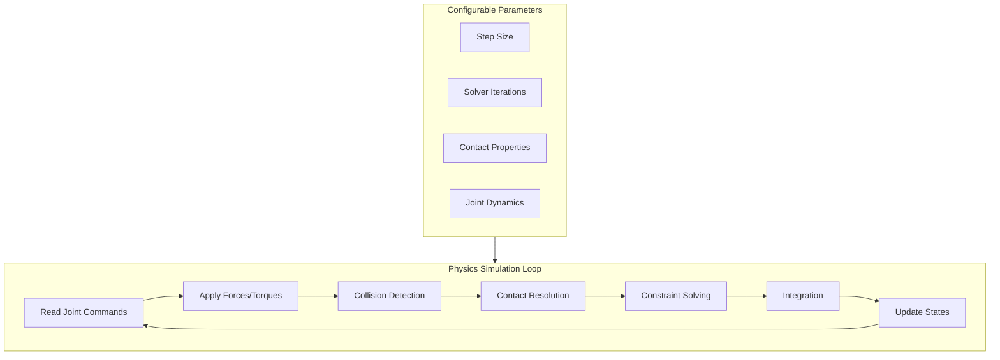
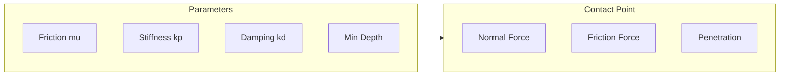
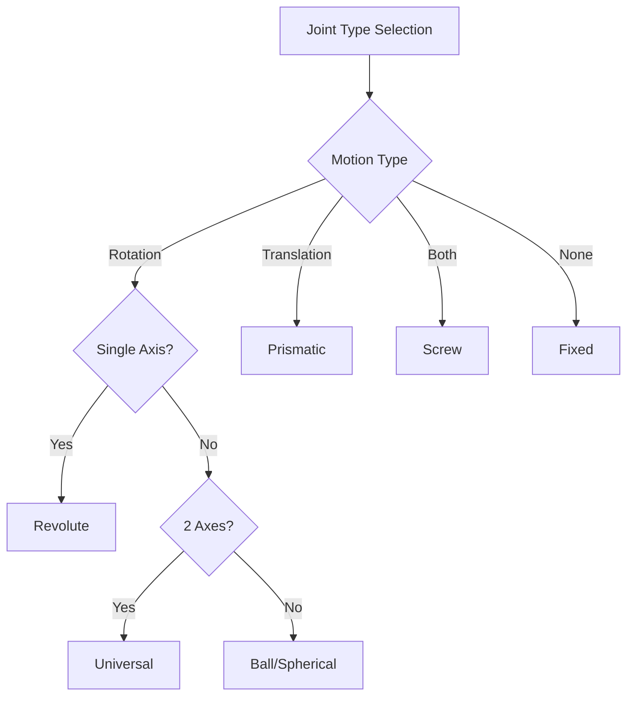
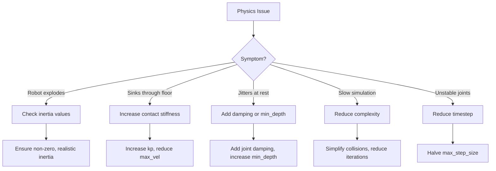

# Physics Properties Configuration

## Learning Objectives

By the end of this chapter, you will be able to:

- Configure global physics parameters for stable simulation
- Tune contact and friction properties for walking behavior
- Understand and apply joint dynamics settings
- Optimize physics performance for real-time simulation
- Debug common physics-related issues

## Understanding Physics Simulation

Physics simulation in Gazebo involves solving equations of motion for all bodies in the world while handling collisions and constraints. For humanoid robots, this is particularly challenging due to:

- Many degrees of freedom (20-50+ joints)
- Complex contact dynamics during walking
- High-frequency control requirements
- Balancing stability vs. real-time performance



## Global Physics Configuration

### Timestep Selection

The physics timestep is crucial for simulation stability and accuracy:

```xml
<physics name="humanoid_physics" type="dart">
  <!-- Timestep: smaller = more accurate, slower -->
  <max_step_size>0.001</max_step_size>

  <!-- Real-time factor: 1.0 = real-time -->
  <real_time_factor>1.0</real_time_factor>

  <!-- Update rate: steps per second of real time -->
  <real_time_update_rate>1000</real_time_update_rate>

  <!-- Maximum contacts per collision pair -->
  <max_contacts>20</max_contacts>
</physics>
```

### Timestep Guidelines

| Robot Type | Recommended Timestep | Notes |
|------------|---------------------|-------|
| Mobile robot | 1-5 ms | Simple dynamics |
| Manipulator | 0.5-1 ms | Precise positioning |
| Humanoid (walking) | 0.5-1 ms | Contact stability |
| Humanoid (running) | 0.1-0.5 ms | High-speed impacts |

### DART Physics Configuration

DART is recommended for humanoid robots due to superior constraint handling:

```xml
<physics name="dart_physics" type="dart">
  <max_step_size>0.001</max_step_size>
  <real_time_factor>1.0</real_time_factor>

  <dart>
    <!-- Collision detection engine -->
    <collision_detector>fcl</collision_detector>

    <!-- Constraint solver -->
    <solver>
      <solver_type>dantzig</solver_type>
    </solver>
  </dart>
</physics>
```

### ODE Physics Configuration

For ODE, careful tuning of solver parameters is essential:

```xml
<physics name="ode_physics" type="ode">
  <max_step_size>0.001</max_step_size>
  <real_time_factor>1.0</real_time_factor>

  <ode>
    <solver>
      <!-- quick = faster, world = more accurate -->
      <type>quick</type>

      <!-- Solver iterations: more = stable, slower -->
      <iters>100</iters>

      <!-- Successive over-relaxation parameter -->
      <sor>1.3</sor>

      <!-- Preconditioning iterations -->
      <precon_iters>0</precon_iters>
    </solver>

    <constraints>
      <!-- Constraint force mixing (softness) -->
      <cfm>0.0</cfm>

      <!-- Error reduction parameter -->
      <erp>0.2</erp>

      <!-- Maximum correcting velocity -->
      <contact_max_correcting_vel>100.0</contact_max_correcting_vel>

      <!-- Contact surface layer -->
      <contact_surface_layer>0.001</contact_surface_layer>
    </constraints>
  </ode>
</physics>
```

## Contact Dynamics

### Understanding Contact Parameters



### Friction Model

Gazebo uses the Coulomb friction model with two coefficients:

```xml
<surface>
  <friction>
    <ode>
      <!-- Primary friction direction -->
      <mu>1.0</mu>

      <!-- Secondary friction direction -->
      <mu2>1.0</mu2>

      <!-- Primary friction direction vector -->
      <fdir1>1 0 0</fdir1>

      <!-- Slip parameters for wheel-like behavior -->
      <slip1>0.0</slip1>
      <slip2>0.0</slip2>
    </ode>

    <torsional>
      <!-- Torsional friction coefficient -->
      <coefficient>0.1</coefficient>

      <!-- Use patch radius -->
      <use_patch_radius>true</use_patch_radius>

      <!-- Patch radius -->
      <patch_radius>0.05</patch_radius>

      <!-- Surface radius for ODE -->
      <surface_radius>0.05</surface_radius>
    </torsional>
  </friction>
</surface>
```

### Contact Stiffness and Damping

The contact model uses spring-damper dynamics:

```xml
<surface>
  <contact>
    <ode>
      <!-- Contact stiffness (N/m) -->
      <kp>1e8</kp>

      <!-- Contact damping (N*s/m) -->
      <kd>1e4</kd>

      <!-- Maximum velocity for correction -->
      <max_vel>0.01</max_vel>

      <!-- Minimum penetration before contact -->
      <min_depth>0.001</min_depth>
    </ode>
  </contact>
</surface>
```

### Foot Contact Configuration

Critical configuration for walking stability:

```xml
<!-- Left foot contact properties -->
<collision name="left_foot_collision">
  <geometry>
    <box>
      <size>0.15 0.08 0.02</size>
    </box>
  </geometry>

  <surface>
    <friction>
      <ode>
        <mu>1.0</mu>
        <mu2>1.0</mu2>
      </ode>
      <torsional>
        <coefficient>0.1</coefficient>
        <surface_radius>0.05</surface_radius>
      </torsional>
    </friction>

    <contact>
      <ode>
        <kp>1e8</kp>
        <kd>1e4</kd>
        <max_vel>0.01</max_vel>
        <min_depth>0.001</min_depth>
      </ode>
    </contact>

    <bounce>
      <restitution_coefficient>0.0</restitution_coefficient>
      <threshold>100000</threshold>
    </bounce>
  </surface>
</collision>
```

## Joint Dynamics

### Damping and Friction

Joint dynamics affect control behavior:

```xml
<joint name="left_hip_pitch" type="revolute">
  <parent>pelvis</parent>
  <child>left_thigh</child>
  <axis>
    <xyz>0 1 0</xyz>

    <!-- Joint limits -->
    <limit>
      <lower>-1.57</lower>
      <upper>0.52</upper>
      <effort>200</effort>
      <velocity>5.0</velocity>
    </limit>

    <!-- Dynamics -->
    <dynamics>
      <!-- Viscous damping (N*m*s/rad) -->
      <damping>0.5</damping>

      <!-- Static friction (N*m) -->
      <friction>0.1</friction>

      <!-- Spring reference position -->
      <spring_reference>0</spring_reference>

      <!-- Spring stiffness (N*m/rad) -->
      <spring_stiffness>0</spring_stiffness>
    </dynamics>
  </axis>

  <!-- Physics engine specific -->
  <physics>
    <ode>
      <!-- CFM for this joint -->
      <cfm>0.0</cfm>

      <!-- Bounce on limits -->
      <bounce>0.0</bounce>

      <!-- Limit CFM -->
      <limit_cfm>0.0</limit_cfm>

      <!-- Limit ERP -->
      <limit_erp>0.2</limit_erp>

      <!-- Suspension CFM/ERP for wheel joints -->
      <suspension_cfm>0.0</suspension_cfm>
      <suspension_erp>0.2</suspension_erp>
    </ode>
  </physics>
</joint>
```

### Joint Type Selection



## Inertial Properties

### Proper Inertia Configuration

Accurate inertial properties are essential for realistic dynamics:

```python
"""
Inertia calculation utilities for common shapes
"""

import numpy as np
from dataclasses import dataclass


@dataclass
class InertialProperties:
    """Container for inertial properties."""
    mass: float
    ixx: float
    iyy: float
    izz: float
    ixy: float = 0.0
    ixz: float = 0.0
    iyz: float = 0.0
    com: tuple = (0.0, 0.0, 0.0)


def cylinder_inertia(mass: float, radius: float, length: float,
                     axis: str = 'z') -> InertialProperties:
    """
    Calculate inertia for a solid cylinder.

    Args:
        mass: Mass in kg
        radius: Radius in meters
        length: Length in meters
        axis: Cylinder axis ('x', 'y', or 'z')

    Returns:
        InertialProperties object
    """
    # Moments of inertia
    i_axial = 0.5 * mass * radius**2
    i_transverse = (1/12) * mass * (3 * radius**2 + length**2)

    if axis == 'z':
        return InertialProperties(
            mass=mass, ixx=i_transverse, iyy=i_transverse, izz=i_axial
        )
    elif axis == 'y':
        return InertialProperties(
            mass=mass, ixx=i_transverse, iyy=i_axial, izz=i_transverse
        )
    else:  # x
        return InertialProperties(
            mass=mass, ixx=i_axial, iyy=i_transverse, izz=i_transverse
        )


def box_inertia(mass: float, x: float, y: float, z: float) -> InertialProperties:
    """
    Calculate inertia for a solid box.

    Args:
        mass: Mass in kg
        x, y, z: Dimensions in meters

    Returns:
        InertialProperties object
    """
    ixx = (1/12) * mass * (y**2 + z**2)
    iyy = (1/12) * mass * (x**2 + z**2)
    izz = (1/12) * mass * (x**2 + y**2)

    return InertialProperties(mass=mass, ixx=ixx, iyy=iyy, izz=izz)


def sphere_inertia(mass: float, radius: float) -> InertialProperties:
    """
    Calculate inertia for a solid sphere.

    Args:
        mass: Mass in kg
        radius: Radius in meters

    Returns:
        InertialProperties object
    """
    i = (2/5) * mass * radius**2
    return InertialProperties(mass=mass, ixx=i, iyy=i, izz=i)


def generate_sdf_inertial(props: InertialProperties) -> str:
    """Generate SDF inertial block."""
    return f"""
    <inertial>
      <mass>{props.mass}</mass>
      <pose>{props.com[0]} {props.com[1]} {props.com[2]} 0 0 0</pose>
      <inertia>
        <ixx>{props.ixx:.6f}</ixx>
        <ixy>{props.ixy:.6f}</ixy>
        <ixz>{props.ixz:.6f}</ixz>
        <iyy>{props.iyy:.6f}</iyy>
        <iyz>{props.iyz:.6f}</iyz>
        <izz>{props.izz:.6f}</izz>
      </inertia>
    </inertial>
    """
```

### Common Inertia Mistakes

| Mistake | Symptom | Solution |
|---------|---------|----------|
| Zero inertia | Instant instability | Calculate proper values |
| Too small | Jittery motion | Scale up by factor of 10 |
| Too large | Sluggish response | Scale down |
| Wrong axes | Unexpected rotation | Check coordinate frame |

## Performance Optimization

### Balancing Accuracy and Speed

```python
"""
Physics configuration optimizer for Gazebo
"""

from dataclasses import dataclass
from typing import Dict, Any


@dataclass
class PhysicsConfig:
    """Physics configuration parameters."""
    step_size: float
    solver_iters: int
    cfm: float
    erp: float
    contact_kp: float
    contact_kd: float


class PhysicsOptimizer:
    """Optimize physics parameters for different scenarios."""

    PRESETS: Dict[str, PhysicsConfig] = {
        'accurate': PhysicsConfig(
            step_size=0.0005,
            solver_iters=150,
            cfm=0.0,
            erp=0.2,
            contact_kp=1e9,
            contact_kd=1e5
        ),
        'balanced': PhysicsConfig(
            step_size=0.001,
            solver_iters=100,
            cfm=0.0,
            erp=0.2,
            contact_kp=1e8,
            contact_kd=1e4
        ),
        'fast': PhysicsConfig(
            step_size=0.002,
            solver_iters=50,
            cfm=1e-5,
            erp=0.3,
            contact_kp=1e7,
            contact_kd=1e3
        ),
        'training': PhysicsConfig(
            step_size=0.004,
            solver_iters=30,
            cfm=1e-4,
            erp=0.4,
            contact_kp=1e6,
            contact_kd=1e2
        )
    }

    @classmethod
    def get_config(cls, preset: str) -> PhysicsConfig:
        """Get physics configuration by preset name."""
        if preset not in cls.PRESETS:
            raise ValueError(f"Unknown preset: {preset}")
        return cls.PRESETS[preset]

    @classmethod
    def generate_sdf(cls, config: PhysicsConfig,
                     engine: str = 'dart') -> str:
        """Generate SDF physics block."""
        return f"""
<physics name="optimized_physics" type="{engine}">
  <max_step_size>{config.step_size}</max_step_size>
  <real_time_factor>1.0</real_time_factor>
  <real_time_update_rate>{int(1.0/config.step_size)}</real_time_update_rate>

  <ode>
    <solver>
      <type>quick</type>
      <iters>{config.solver_iters}</iters>
      <sor>1.3</sor>
    </solver>
    <constraints>
      <cfm>{config.cfm}</cfm>
      <erp>{config.erp}</erp>
      <contact_max_correcting_vel>100.0</contact_max_correcting_vel>
      <contact_surface_layer>0.001</contact_surface_layer>
    </constraints>
  </ode>
</physics>
        """
```

### Collision Optimization

Reduce collision complexity for better performance:

```xml
<!-- Use primitives instead of meshes when possible -->
<collision name="thigh_collision">
  <!-- Preferred: Simple primitive -->
  <geometry>
    <cylinder>
      <radius>0.04</radius>
      <length>0.3</length>
    </cylinder>
  </geometry>

  <!-- Alternative: Convex hull of mesh -->
  <!--
  <geometry>
    <mesh>
      <uri>model://humanoid/meshes/thigh_convex.stl</uri>
    </mesh>
  </geometry>
  -->
</collision>
```

### Bitmask Collision Filtering

Reduce unnecessary collision checks:

```xml
<!-- Define collision categories -->
<collision name="left_arm_collision">
  <geometry>
    <cylinder>
      <radius>0.03</radius>
      <length>0.25</length>
    </cylinder>
  </geometry>

  <surface>
    <contact>
      <collide_bitmask>0x01</collide_bitmask>
    </contact>
  </surface>
</collision>

<!-- Right arm only collides with certain objects -->
<collision name="right_arm_collision">
  <geometry>
    <cylinder>
      <radius>0.03</radius>
      <length>0.25</length>
    </cylinder>
  </geometry>

  <surface>
    <contact>
      <!-- Will collide with objects having matching bits -->
      <collide_bitmask>0x02</collide_bitmask>
    </contact>
  </surface>
</collision>
```

## Debugging Physics Issues

### Common Issues and Solutions



### Diagnostic Tools

```python
"""
Physics diagnostic utilities for Gazebo simulation
"""

import numpy as np
from typing import List, Tuple


class PhysicsDiagnostics:
    """Utilities for diagnosing physics simulation issues."""

    @staticmethod
    def check_inertia_validity(mass: float, ixx: float, iyy: float,
                                izz: float) -> List[str]:
        """
        Check if inertia values are physically valid.

        Returns list of warnings/errors.
        """
        issues = []

        # Check for zero or negative values
        if mass <= 0:
            issues.append("ERROR: Mass must be positive")
        if any(i <= 0 for i in [ixx, iyy, izz]):
            issues.append("ERROR: Principal inertias must be positive")

        # Triangle inequality for inertia tensor
        if ixx + iyy < izz:
            issues.append("ERROR: Ixx + Iyy must be >= Izz")
        if iyy + izz < ixx:
            issues.append("ERROR: Iyy + Izz must be >= Ixx")
        if izz + ixx < iyy:
            issues.append("ERROR: Izz + Ixx must be >= Iyy")

        # Check for reasonable magnitudes
        min_inertia = 1e-6
        max_inertia = 1e3
        for name, val in [('Ixx', ixx), ('Iyy', iyy), ('Izz', izz)]:
            if val < min_inertia:
                issues.append(f"WARNING: {name} very small, may cause instability")
            if val > max_inertia:
                issues.append(f"WARNING: {name} very large, may cause sluggish response")

        return issues

    @staticmethod
    def estimate_stable_timestep(max_frequency: float) -> float:
        """
        Estimate stable timestep based on system frequency.

        Args:
            max_frequency: Highest expected frequency in system (Hz)

        Returns:
            Recommended timestep in seconds
        """
        # Nyquist criterion with safety factor
        return 1.0 / (10 * max_frequency)

    @staticmethod
    def check_contact_stability(kp: float, kd: float,
                                mass: float) -> Tuple[bool, str]:
        """
        Check if contact parameters are stable.

        Returns (is_stable, message)
        """
        # Critical damping ratio
        omega = np.sqrt(kp / mass)
        zeta = kd / (2 * mass * omega)

        if zeta < 0.5:
            return False, f"Under-damped (zeta={zeta:.2f}), may oscillate"
        elif zeta > 2.0:
            return False, f"Over-damped (zeta={zeta:.2f}), slow response"
        else:
            return True, f"Good damping (zeta={zeta:.2f})"


# Example usage
if __name__ == "__main__":
    diag = PhysicsDiagnostics()

    # Check inertia
    issues = diag.check_inertia_validity(
        mass=2.5, ixx=0.01, iyy=0.01, izz=0.005
    )
    for issue in issues:
        print(issue)

    # Check contact stability
    stable, msg = diag.check_contact_stability(
        kp=1e8, kd=1e4, mass=50
    )
    print(f"Contact stability: {msg}")
```

## Practical Exercises

### Exercise 1: Tune Walking Physics

Configure physics parameters for stable bipedal walking:

1. Set appropriate foot friction (mu >= 0.8)
2. Configure contact stiffness for no sinking
3. Add torsional friction for turning
4. Test with different walking speeds

### Exercise 2: Compare Physics Engines

Create a test scenario and compare:

```python
# Test configuration
TEST_SCENARIOS = [
    "standing_balance",
    "walking_forward",
    "stepping_over_obstacle",
    "external_push_recovery"
]

PHYSICS_ENGINES = ["ode", "dart", "bullet"]

# Metrics to collect
METRICS = [
    "real_time_factor",
    "joint_position_error",
    "contact_stability",
    "energy_conservation"
]
```

### Exercise 3: Debug Unstable Simulation

Given a robot that becomes unstable after 10 seconds:

1. Check inertia validity
2. Examine contact parameters
3. Review joint configurations
4. Identify and fix the root cause

## Key Takeaways

1. **Timestep is critical** - Smaller timesteps improve stability but reduce speed
2. **Contact parameters matter** - Proper kp/kd prevents sinking and bouncing
3. **Friction enables walking** - Configure mu and torsional friction for feet
4. **Joint dynamics affect control** - Damping and friction impact performance
5. **Optimize collision geometry** - Simplified shapes improve performance

## Configuration Reference

### Quick Reference Table

| Parameter | Walking Robot | Manipulation | High-Speed |
|-----------|--------------|--------------|------------|
| step_size | 0.001 s | 0.001 s | 0.0005 s |
| solver_iters | 100 | 80 | 150 |
| foot_mu | 0.8-1.0 | - | 1.0+ |
| contact_kp | 1e8 | 1e7 | 1e9 |
| joint_damping | 0.3-0.8 | 0.1-0.3 | 0.5-1.0 |

## Next Chapter Preview

In the next chapter, we will explore **Environment Building** in Gazebo. You will learn how to create realistic worlds, add terrain variations, include obstacles, and design environments suitable for humanoid robot testing.
