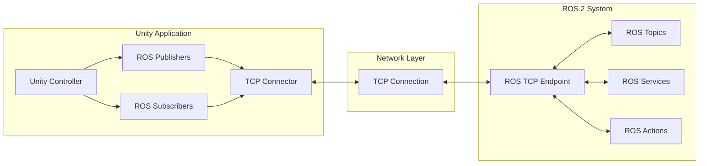

# ROS-Unity Communication

## Learning Objectives

By the end of this chapter, you will be able to:

- Set up ROS-TCP communication between Unity and ROS 2
- Create custom message types for Unity
- Implement publishers and subscribers in Unity
- Synchronize robot state between Unity and ROS 2
- Handle services and actions across the bridge

## Architecture Overview

The ROS-Unity integration uses TCP/IP communication to bridge Unity and ROS systems:



## Setting Up ROS-TCP Connector

### Unity Side Setup

```csharp
// ROSConnectionSetup.cs
using UnityEngine;
using Unity.Robotics.ROSTCPConnector;

public class ROSConnectionSetup : MonoBehaviour
{
    [Header("Connection Settings")]
    public string rosIPAddress = "127.0.0.1";
    public int rosPort = 10000;
    public bool connectOnStart = true;

    [Header("Connection Status")]
    public bool isConnected = false;

    private ROSConnection rosConnection;

    void Start()
    {
        SetupConnection();
    }

    void SetupConnection()
    {
        // Get or create ROS Connection
        rosConnection = ROSConnection.GetOrCreateInstance();

        // Configure connection
        rosConnection.RosIPAddress = rosIPAddress;
        rosConnection.RosPort = rosPort;

        // Register connection callbacks
        rosConnection.RegisterRosService<EmptyServiceRequest, EmptyServiceResponse>(
            "/unity/ping"
        );

        if (connectOnStart)
        {
            Connect();
        }
    }

    public void Connect()
    {
        rosConnection.Connect();
        StartCoroutine(CheckConnectionStatus());
    }

    System.Collections.IEnumerator CheckConnectionStatus()
    {
        yield return new WaitForSeconds(1.0f);

        // Check if connected by trying to get topics
        isConnected = true;  // Simplified check
        Debug.Log($"ROS Connection status: {(isConnected ? "Connected" : "Disconnected")}");
    }

    void OnApplicationQuit()
    {
        if (rosConnection != null)
        {
            rosConnection.Disconnect();
        }
    }
}
```

### ROS 2 Side Setup

```python
#!/usr/bin/env python3
"""
ROS 2 TCP Endpoint for Unity communication
"""

import rclpy
from rclpy.node import Node
from ros_tcp_endpoint import TcpServer, RosPublisher, RosSubscriber, RosService
from geometry_msgs.msg import Twist, Pose, PoseStamped
from sensor_msgs.msg import JointState, Image, LaserScan
from std_msgs.msg import String, Bool
from std_srvs.srv import Empty, Trigger


def main():
    rclpy.init()

    # Create TCP server node
    tcp_server = TcpServer('unity_tcp_endpoint')

    # Configure publishers (ROS -> Unity)
    RosPublisher(tcp_server, '/cmd_vel', Twist, queue_size=1)
    RosPublisher(tcp_server, '/joint_commands', JointState, queue_size=1)
    RosPublisher(tcp_server, '/navigation/goal', PoseStamped, queue_size=1)

    # Configure subscribers (Unity -> ROS)
    RosSubscriber(tcp_server, '/joint_states', JointState, queue_size=1)
    RosSubscriber(tcp_server, '/robot_pose', Pose, queue_size=1)
    RosSubscriber(tcp_server, '/unity/status', String, queue_size=1)

    # Configure services
    RosService(tcp_server, '/unity/reset', Empty)
    RosService(tcp_server, '/unity/start_recording', Trigger)

    # Start server
    tcp_server.start()

    try:
        rclpy.spin(tcp_server)
    except KeyboardInterrupt:
        pass
    finally:
        tcp_server.destroy_node()
        rclpy.shutdown()


if __name__ == '__main__':
    main()
```

### Launch File for ROS TCP Endpoint

```python
# ros_unity_bridge.launch.py
from launch import LaunchDescription
from launch_ros.actions import Node
from launch.actions import DeclareLaunchArgument
from launch.substitutions import LaunchConfiguration


def generate_launch_description():
    return LaunchDescription([
        DeclareLaunchArgument(
            'tcp_ip',
            default_value='0.0.0.0',
            description='IP address for TCP server'
        ),
        DeclareLaunchArgument(
            'tcp_port',
            default_value='10000',
            description='Port for TCP server'
        ),

        Node(
            package='ros_tcp_endpoint',
            executable='default_server_endpoint',
            name='ros_tcp_endpoint',
            parameters=[{
                'ROS_IP': LaunchConfiguration('tcp_ip'),
                'ROS_TCP_PORT': LaunchConfiguration('tcp_port'),
            }],
            output='screen'
        ),
    ])
```

## Publishing from Unity to ROS

### Joint State Publisher

```csharp
// JointStatePublisher.cs
using UnityEngine;
using Unity.Robotics.ROSTCPConnector;
using RosMessageTypes.Sensor;
using System.Collections.Generic;

public class JointStatePublisher : MonoBehaviour
{
    [Header("Publishing Settings")]
    public string topicName = "/joint_states";
    public float publishRate = 50f;  // Hz

    [Header("Robot Reference")]
    public ArticulationBody rootBody;

    private ROSConnection rosConnection;
    private float publishInterval;
    private float lastPublishTime;
    private List<ArticulationBody> joints = new List<ArticulationBody>();
    private JointStateMsg jointStateMsg;

    void Start()
    {
        rosConnection = ROSConnection.GetOrCreateInstance();
        rosConnection.RegisterPublisher<JointStateMsg>(topicName);

        publishInterval = 1.0f / publishRate;
        lastPublishTime = Time.time;

        CollectJoints();
        InitializeMessage();
    }

    void CollectJoints()
    {
        if (rootBody == null)
        {
            rootBody = GetComponent<ArticulationBody>();
        }

        var allBodies = rootBody.GetComponentsInChildren<ArticulationBody>();
        foreach (var body in allBodies)
        {
            if (body.jointType != ArticulationJointType.FixedJoint)
            {
                joints.Add(body);
            }
        }

        Debug.Log($"Collected {joints.Count} joints for publishing");
    }

    void InitializeMessage()
    {
        jointStateMsg = new JointStateMsg();
        jointStateMsg.name = new string[joints.Count];
        jointStateMsg.position = new double[joints.Count];
        jointStateMsg.velocity = new double[joints.Count];
        jointStateMsg.effort = new double[joints.Count];

        for (int i = 0; i < joints.Count; i++)
        {
            jointStateMsg.name[i] = joints[i].name;
        }
    }

    void FixedUpdate()
    {
        if (Time.time - lastPublishTime >= publishInterval)
        {
            PublishJointStates();
            lastPublishTime = Time.time;
        }
    }

    void PublishJointStates()
    {
        // Update timestamp
        jointStateMsg.header.stamp.sec = (int)Time.time;
        jointStateMsg.header.stamp.nanosec = (uint)((Time.time % 1) * 1e9);
        jointStateMsg.header.frame_id = "base_link";

        // Update joint data
        for (int i = 0; i < joints.Count; i++)
        {
            jointStateMsg.position[i] = joints[i].jointPosition[0];
            jointStateMsg.velocity[i] = joints[i].jointVelocity[0];
            jointStateMsg.effort[i] = joints[i].jointForce[0];
        }

        rosConnection.Publish(topicName, jointStateMsg);
    }
}
```

### Pose Publisher

```csharp
// RobotPosePublisher.cs
using UnityEngine;
using Unity.Robotics.ROSTCPConnector;
using RosMessageTypes.Geometry;

public class RobotPosePublisher : MonoBehaviour
{
    [Header("Publishing Settings")]
    public string topicName = "/robot_pose";
    public float publishRate = 30f;

    [Header("Transform Reference")]
    public Transform robotBase;
    public string frameId = "world";

    private ROSConnection rosConnection;
    private float publishInterval;
    private float lastPublishTime;

    void Start()
    {
        rosConnection = ROSConnection.GetOrCreateInstance();
        rosConnection.RegisterPublisher<PoseStampedMsg>(topicName);

        publishInterval = 1.0f / publishRate;

        if (robotBase == null)
        {
            robotBase = transform;
        }
    }

    void Update()
    {
        if (Time.time - lastPublishTime >= publishInterval)
        {
            PublishPose();
            lastPublishTime = Time.time;
        }
    }

    void PublishPose()
    {
        var poseMsg = new PoseStampedMsg();

        // Header
        poseMsg.header.stamp.sec = (int)Time.time;
        poseMsg.header.stamp.nanosec = (uint)((Time.time % 1) * 1e9);
        poseMsg.header.frame_id = frameId;

        // Position (Unity Y-up to ROS Z-up)
        poseMsg.pose.position.x = robotBase.position.z;
        poseMsg.pose.position.y = -robotBase.position.x;
        poseMsg.pose.position.z = robotBase.position.y;

        // Orientation (Unity to ROS quaternion conversion)
        Quaternion rosQuat = UnityToRosQuaternion(robotBase.rotation);
        poseMsg.pose.orientation.x = rosQuat.x;
        poseMsg.pose.orientation.y = rosQuat.y;
        poseMsg.pose.orientation.z = rosQuat.z;
        poseMsg.pose.orientation.w = rosQuat.w;

        rosConnection.Publish(topicName, poseMsg);
    }

    Quaternion UnityToRosQuaternion(Quaternion unityQuat)
    {
        // Convert from Unity (Y-up, left-handed) to ROS (Z-up, right-handed)
        return new Quaternion(
            unityQuat.z,
            -unityQuat.x,
            unityQuat.y,
            -unityQuat.w
        );
    }
}
```

## Subscribing in Unity from ROS

### Velocity Command Subscriber

```csharp
// VelocityCommandSubscriber.cs
using UnityEngine;
using Unity.Robotics.ROSTCPConnector;
using RosMessageTypes.Geometry;

public class VelocityCommandSubscriber : MonoBehaviour
{
    [Header("Subscription Settings")]
    public string topicName = "/cmd_vel";

    [Header("Robot Control")]
    public ArticulationBody robotBase;
    public float linearScale = 1.0f;
    public float angularScale = 1.0f;

    [Header("Current Command")]
    public Vector3 linearVelocity;
    public Vector3 angularVelocity;

    private ROSConnection rosConnection;

    void Start()
    {
        rosConnection = ROSConnection.GetOrCreateInstance();
        rosConnection.Subscribe<TwistMsg>(topicName, OnVelocityReceived);

        if (robotBase == null)
        {
            robotBase = GetComponent<ArticulationBody>();
        }
    }

    void OnVelocityReceived(TwistMsg msg)
    {
        // Convert ROS coordinate frame to Unity
        linearVelocity = new Vector3(
            (float)-msg.linear.y * linearScale,
            (float)msg.linear.z * linearScale,
            (float)msg.linear.x * linearScale
        );

        angularVelocity = new Vector3(
            (float)-msg.angular.y * angularScale,
            (float)msg.angular.z * angularScale,
            (float)msg.angular.x * angularScale
        );
    }

    void FixedUpdate()
    {
        ApplyVelocity();
    }

    void ApplyVelocity()
    {
        if (robotBase == null) return;

        // Apply linear velocity
        robotBase.velocity = transform.TransformDirection(linearVelocity);

        // Apply angular velocity
        robotBase.angularVelocity = angularVelocity;
    }
}
```

### Joint Command Subscriber

```csharp
// JointCommandSubscriber.cs
using UnityEngine;
using Unity.Robotics.ROSTCPConnector;
using RosMessageTypes.Sensor;
using System.Collections.Generic;

public class JointCommandSubscriber : MonoBehaviour
{
    [Header("Subscription Settings")]
    public string topicName = "/joint_commands";

    [Header("Control Settings")]
    public float positionGain = 1000f;
    public float dampingGain = 100f;

    [Header("Robot Reference")]
    public ArticulationBody rootBody;

    private ROSConnection rosConnection;
    private Dictionary<string, ArticulationBody> jointMap =
        new Dictionary<string, ArticulationBody>();
    private Dictionary<string, float> targetPositions =
        new Dictionary<string, float>();

    void Start()
    {
        rosConnection = ROSConnection.GetOrCreateInstance();
        rosConnection.Subscribe<JointStateMsg>(topicName, OnJointCommandReceived);

        BuildJointMap();
    }

    void BuildJointMap()
    {
        if (rootBody == null)
        {
            rootBody = GetComponent<ArticulationBody>();
        }

        var allBodies = rootBody.GetComponentsInChildren<ArticulationBody>();
        foreach (var body in allBodies)
        {
            if (body.jointType != ArticulationJointType.FixedJoint)
            {
                jointMap[body.name] = body;
                targetPositions[body.name] = 0f;
            }
        }

        Debug.Log($"Built joint map with {jointMap.Count} joints");
    }

    void OnJointCommandReceived(JointStateMsg msg)
    {
        for (int i = 0; i < msg.name.Length && i < msg.position.Length; i++)
        {
            string jointName = msg.name[i];
            float position = (float)msg.position[i];

            if (targetPositions.ContainsKey(jointName))
            {
                targetPositions[jointName] = position;
            }
        }
    }

    void FixedUpdate()
    {
        ApplyJointCommands();
    }

    void ApplyJointCommands()
    {
        foreach (var kvp in jointMap)
        {
            string jointName = kvp.Key;
            ArticulationBody body = kvp.Value;

            if (targetPositions.TryGetValue(jointName, out float target))
            {
                // Configure drive
                var drive = body.xDrive;
                drive.stiffness = positionGain;
                drive.damping = dampingGain;
                drive.target = target * Mathf.Rad2Deg;
                body.xDrive = drive;
            }
        }
    }
}
```

## Service Implementation

### Reset Service

```csharp
// ResetService.cs
using UnityEngine;
using Unity.Robotics.ROSTCPConnector;
using Unity.Robotics.ROSTCPConnector.ROSGeometry;
using RosMessageTypes.Std;

public class ResetService : MonoBehaviour
{
    [Header("Service Settings")]
    public string serviceName = "/unity/reset";

    [Header("Reset Configuration")]
    public Transform robotTransform;
    public Vector3 resetPosition = Vector3.zero;
    public Quaternion resetRotation = Quaternion.identity;

    private ROSConnection rosConnection;

    void Start()
    {
        rosConnection = ROSConnection.GetOrCreateInstance();
        rosConnection.ImplementService<EmptyRequest, EmptyResponse>(
            serviceName, HandleResetRequest
        );
    }

    EmptyResponse HandleResetRequest(EmptyRequest request)
    {
        Debug.Log("Reset service called from ROS");

        // Reset robot position
        if (robotTransform != null)
        {
            robotTransform.position = resetPosition;
            robotTransform.rotation = resetRotation;

            // Reset velocities if ArticulationBody
            var artBody = robotTransform.GetComponent<ArticulationBody>();
            if (artBody != null)
            {
                artBody.velocity = Vector3.zero;
                artBody.angularVelocity = Vector3.zero;
            }

            // Reset all child articulation bodies
            var childBodies = robotTransform.GetComponentsInChildren<ArticulationBody>();
            foreach (var body in childBodies)
            {
                body.velocity = Vector3.zero;
                body.angularVelocity = Vector3.zero;

                // Reset joint positions
                if (body.jointType != ArticulationJointType.FixedJoint)
                {
                    body.jointPosition = new ArticulationReducedSpace(0f);
                    body.jointVelocity = new ArticulationReducedSpace(0f);
                }
            }
        }

        return new EmptyResponse();
    }
}
```

### Trigger Service with Response

```csharp
// TriggerService.cs
using UnityEngine;
using Unity.Robotics.ROSTCPConnector;
using RosMessageTypes.Std;

public class TriggerService : MonoBehaviour
{
    [Header("Service Settings")]
    public string serviceName = "/unity/start_recording";

    [Header("Recording")]
    public bool isRecording = false;
    public DataRecorder dataRecorder;

    private ROSConnection rosConnection;

    void Start()
    {
        rosConnection = ROSConnection.GetOrCreateInstance();
        rosConnection.ImplementService<TriggerRequest, TriggerResponse>(
            serviceName, HandleTriggerRequest
        );
    }

    TriggerResponse HandleTriggerRequest(TriggerRequest request)
    {
        TriggerResponse response = new TriggerResponse();

        if (!isRecording)
        {
            // Start recording
            isRecording = true;
            if (dataRecorder != null)
            {
                dataRecorder.StartRecording();
            }
            response.success = true;
            response.message = "Recording started";
        }
        else
        {
            // Stop recording
            isRecording = false;
            if (dataRecorder != null)
            {
                dataRecorder.StopRecording();
            }
            response.success = true;
            response.message = "Recording stopped";
        }

        return response;
    }
}
```

## Custom Message Types

### Generating Custom Messages

Create a ROS 2 package with custom messages:

```
humanoid_msgs/
├── CMakeLists.txt
├── package.xml
└── msg/
    ├── HumanoidState.msg
    └── JointCommand.msg
```

**HumanoidState.msg:**
```
# HumanoidState.msg
std_msgs/Header header

# Base pose
geometry_msgs/Pose base_pose
geometry_msgs/Twist base_velocity

# Joint states
sensor_msgs/JointState joint_state

# Contact information
bool left_foot_contact
bool right_foot_contact
geometry_msgs/Wrench left_foot_wrench
geometry_msgs/Wrench right_foot_wrench

# Center of mass
geometry_msgs/Point center_of_mass
geometry_msgs/Vector3 com_velocity
```

### Using Custom Messages in Unity

```csharp
// HumanoidStatePublisher.cs
using UnityEngine;
using Unity.Robotics.ROSTCPConnector;
using RosMessageTypes.HumanoidMsgs;  // Generated from custom msg

public class HumanoidStatePublisher : MonoBehaviour
{
    [Header("Publishing Settings")]
    public string topicName = "/humanoid_state";
    public float publishRate = 100f;

    [Header("Robot Components")]
    public Transform baseLink;
    public ArticulationBody rootBody;
    public ContactSensor leftFootSensor;
    public ContactSensor rightFootSensor;

    private ROSConnection rosConnection;
    private float publishInterval;
    private float lastPublishTime;
    private HumanoidStateMsg stateMsg;

    void Start()
    {
        rosConnection = ROSConnection.GetOrCreateInstance();
        rosConnection.RegisterPublisher<HumanoidStateMsg>(topicName);

        publishInterval = 1.0f / publishRate;
        stateMsg = new HumanoidStateMsg();
    }

    void FixedUpdate()
    {
        if (Time.time - lastPublishTime >= publishInterval)
        {
            PublishState();
            lastPublishTime = Time.time;
        }
    }

    void PublishState()
    {
        // Header
        stateMsg.header.stamp.sec = (int)Time.time;
        stateMsg.header.stamp.nanosec = (uint)((Time.time % 1) * 1e9);
        stateMsg.header.frame_id = "world";

        // Base pose
        UpdateBasePose();

        // Joint states
        UpdateJointStates();

        // Contact information
        UpdateContactInfo();

        // Center of mass
        UpdateCenterOfMass();

        rosConnection.Publish(topicName, stateMsg);
    }

    void UpdateBasePose()
    {
        if (baseLink == null) return;

        stateMsg.base_pose.position.x = baseLink.position.z;
        stateMsg.base_pose.position.y = -baseLink.position.x;
        stateMsg.base_pose.position.z = baseLink.position.y;

        Quaternion rosQuat = UnityToRosQuaternion(baseLink.rotation);
        stateMsg.base_pose.orientation.x = rosQuat.x;
        stateMsg.base_pose.orientation.y = rosQuat.y;
        stateMsg.base_pose.orientation.z = rosQuat.z;
        stateMsg.base_pose.orientation.w = rosQuat.w;

        if (rootBody != null)
        {
            Vector3 vel = rootBody.velocity;
            stateMsg.base_velocity.linear.x = vel.z;
            stateMsg.base_velocity.linear.y = -vel.x;
            stateMsg.base_velocity.linear.z = vel.y;

            Vector3 angVel = rootBody.angularVelocity;
            stateMsg.base_velocity.angular.x = angVel.z;
            stateMsg.base_velocity.angular.y = -angVel.x;
            stateMsg.base_velocity.angular.z = angVel.y;
        }
    }

    void UpdateJointStates()
    {
        // Collect joint states from articulation bodies
        var joints = rootBody.GetComponentsInChildren<ArticulationBody>();
        var names = new System.Collections.Generic.List<string>();
        var positions = new System.Collections.Generic.List<double>();
        var velocities = new System.Collections.Generic.List<double>();
        var efforts = new System.Collections.Generic.List<double>();

        foreach (var joint in joints)
        {
            if (joint.jointType != ArticulationJointType.FixedJoint)
            {
                names.Add(joint.name);
                positions.Add(joint.jointPosition[0]);
                velocities.Add(joint.jointVelocity[0]);
                efforts.Add(joint.jointForce[0]);
            }
        }

        stateMsg.joint_state.name = names.ToArray();
        stateMsg.joint_state.position = positions.ToArray();
        stateMsg.joint_state.velocity = velocities.ToArray();
        stateMsg.joint_state.effort = efforts.ToArray();
    }

    void UpdateContactInfo()
    {
        if (leftFootSensor != null)
        {
            stateMsg.left_foot_contact = leftFootSensor.IsInContact;
            var force = leftFootSensor.ContactForce;
            stateMsg.left_foot_wrench.force.x = force.z;
            stateMsg.left_foot_wrench.force.y = -force.x;
            stateMsg.left_foot_wrench.force.z = force.y;
        }

        if (rightFootSensor != null)
        {
            stateMsg.right_foot_contact = rightFootSensor.IsInContact;
            var force = rightFootSensor.ContactForce;
            stateMsg.right_foot_wrench.force.x = force.z;
            stateMsg.right_foot_wrench.force.y = -force.x;
            stateMsg.right_foot_wrench.force.z = force.y;
        }
    }

    void UpdateCenterOfMass()
    {
        Vector3 com = CalculateCenterOfMass();
        stateMsg.center_of_mass.x = com.z;
        stateMsg.center_of_mass.y = -com.x;
        stateMsg.center_of_mass.z = com.y;
    }

    Vector3 CalculateCenterOfMass()
    {
        Vector3 com = Vector3.zero;
        float totalMass = 0f;

        var bodies = rootBody.GetComponentsInChildren<ArticulationBody>();
        foreach (var body in bodies)
        {
            com += body.worldCenterOfMass * body.mass;
            totalMass += body.mass;
        }

        return totalMass > 0 ? com / totalMass : Vector3.zero;
    }

    Quaternion UnityToRosQuaternion(Quaternion unityQuat)
    {
        return new Quaternion(
            unityQuat.z,
            -unityQuat.x,
            unityQuat.y,
            -unityQuat.w
        );
    }
}
```

## Coordinate Frame Conversion

```csharp
// CoordinateFrameConverter.cs
using UnityEngine;

public static class CoordinateFrameConverter
{
    /// <summary>
    /// Convert Unity position (Y-up, left-handed) to ROS (Z-up, right-handed)
    /// </summary>
    public static Vector3 UnityToRos(Vector3 unityPosition)
    {
        return new Vector3(
            unityPosition.z,
            -unityPosition.x,
            unityPosition.y
        );
    }

    /// <summary>
    /// Convert ROS position (Z-up, right-handed) to Unity (Y-up, left-handed)
    /// </summary>
    public static Vector3 RosToUnity(Vector3 rosPosition)
    {
        return new Vector3(
            -rosPosition.y,
            rosPosition.z,
            rosPosition.x
        );
    }

    /// <summary>
    /// Convert Unity quaternion to ROS quaternion
    /// </summary>
    public static Quaternion UnityToRosQuaternion(Quaternion unityQuat)
    {
        return new Quaternion(
            unityQuat.z,
            -unityQuat.x,
            unityQuat.y,
            -unityQuat.w
        );
    }

    /// <summary>
    /// Convert ROS quaternion to Unity quaternion
    /// </summary>
    public static Quaternion RosToUnityQuaternion(Quaternion rosQuat)
    {
        return new Quaternion(
            -rosQuat.y,
            rosQuat.z,
            rosQuat.x,
            -rosQuat.w
        );
    }

    /// <summary>
    /// Convert Unity velocity to ROS
    /// </summary>
    public static Vector3 UnityToRosVelocity(Vector3 unityVel)
    {
        return UnityToRos(unityVel);
    }

    /// <summary>
    /// Convert Unity angular velocity to ROS
    /// </summary>
    public static Vector3 UnityToRosAngularVelocity(Vector3 unityAngVel)
    {
        return new Vector3(
            unityAngVel.z,
            -unityAngVel.x,
            unityAngVel.y
        );
    }
}
```

## Testing the Bridge

### ROS 2 Test Node

```python
#!/usr/bin/env python3
"""
Test node for verifying ROS-Unity communication
"""

import rclpy
from rclpy.node import Node
from sensor_msgs.msg import JointState
from geometry_msgs.msg import Twist, PoseStamped
from std_srvs.srv import Empty
import time


class UnityBridgeTest(Node):
    def __init__(self):
        super().__init__('unity_bridge_test')

        # Publishers
        self.cmd_vel_pub = self.create_publisher(Twist, '/cmd_vel', 10)
        self.joint_cmd_pub = self.create_publisher(JointState, '/joint_commands', 10)

        # Subscribers
        self.joint_state_sub = self.create_subscription(
            JointState, '/joint_states', self.joint_state_callback, 10
        )
        self.pose_sub = self.create_subscription(
            PoseStamped, '/robot_pose', self.pose_callback, 10
        )

        # Service clients
        self.reset_client = self.create_client(Empty, '/unity/reset')

        # Test timer
        self.timer = self.create_timer(0.1, self.test_loop)
        self.test_phase = 0

        self.get_logger().info('Unity bridge test node started')

    def joint_state_callback(self, msg):
        self.get_logger().info(
            f'Received joint states: {len(msg.name)} joints'
        )

    def pose_callback(self, msg):
        pos = msg.pose.position
        self.get_logger().info(
            f'Robot pose: ({pos.x:.2f}, {pos.y:.2f}, {pos.z:.2f})'
        )

    def test_loop(self):
        if self.test_phase == 0:
            # Test velocity command
            twist = Twist()
            twist.linear.x = 0.5
            twist.angular.z = 0.1
            self.cmd_vel_pub.publish(twist)
            self.get_logger().info('Published velocity command')

        elif self.test_phase == 10:
            # Test joint command
            joint_cmd = JointState()
            joint_cmd.name = ['joint1', 'joint2', 'joint3']
            joint_cmd.position = [0.5, -0.3, 0.8]
            self.joint_cmd_pub.publish(joint_cmd)
            self.get_logger().info('Published joint command')

        elif self.test_phase == 20:
            # Test reset service
            if self.reset_client.wait_for_service(timeout_sec=1.0):
                request = Empty.Request()
                future = self.reset_client.call_async(request)
                self.get_logger().info('Called reset service')

        self.test_phase = (self.test_phase + 1) % 30


def main():
    rclpy.init()
    node = UnityBridgeTest()
    rclpy.spin(node)
    node.destroy_node()
    rclpy.shutdown()


if __name__ == '__main__':
    main()
```

## Practical Exercises

### Exercise 1: Bidirectional Communication

Implement complete bidirectional communication:
1. Publish robot state from Unity to ROS 2
2. Subscribe to commands from ROS 2 in Unity
3. Verify data integrity across the bridge

### Exercise 2: Custom Message Integration

Create and use custom messages:
1. Define a custom message type in ROS 2
2. Generate Unity message classes
3. Implement publisher and subscriber

### Exercise 3: Teleoperation System

Build a teleoperation system:
1. ROS 2 joystick node sends commands
2. Unity receives and applies commands
3. Unity sends feedback to ROS 2
4. Display feedback in RViz2

## Key Takeaways

1. **TCP-based communication** - Reliable connection between Unity and ROS 2
2. **Coordinate frame conversion** - Essential for correct data interpretation
3. **Custom messages** - Support for complex robot state information
4. **Services enable control** - Request-response pattern for commands
5. **Performance considerations** - Balance publish rate with network bandwidth

## Next Chapter Preview

In the next chapter, we will work on a **Mini Project: Digital Twin**. You will integrate everything learned to create a complete digital twin system with Gazebo/Unity simulation, ROS 2 integration, and real-time visualization.
