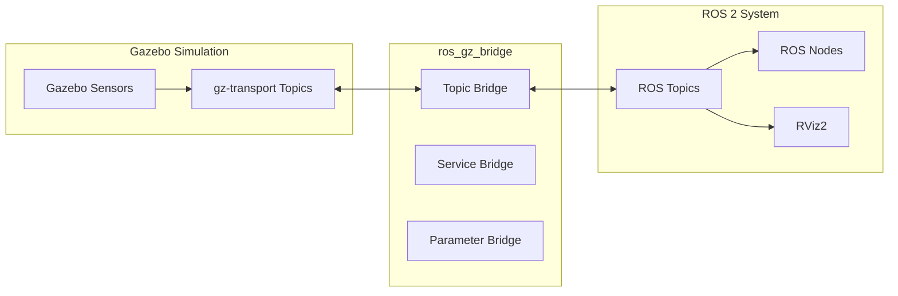

# ROS 2 Sensor Integration

## Learning Objectives

By the end of this chapter, you will be able to:

- Bridge Gazebo sensor data to ROS 2 topics
- Configure ros_gz_bridge for various sensor types
- Process sensor messages in ROS 2 nodes
- Build perception pipelines using sensor data
- Implement sensor fusion for state estimation

## ROS 2 - Gazebo Bridge Architecture



## Setting Up ros_gz_bridge

### Installation

```bash
# Install ros_gz packages
sudo apt install ros-humble-ros-gz-bridge
sudo apt install ros-humble-ros-gz-image
sudo apt install ros-humble-ros-gz-sim

# For sensor-specific bridges
sudo apt install ros-humble-ros-gz-point-cloud
```

### Bridge Configuration YAML

```yaml
# bridge_config.yaml
# Configuration for ros_gz_bridge

# IMU sensor
- ros_topic_name: "/imu/data"
  gz_topic_name: "/model/humanoid/link/torso_link/sensor/imu/imu"
  ros_type_name: "sensor_msgs/msg/Imu"
  gz_type_name: "gz.msgs.IMU"
  direction: GZ_TO_ROS

# Camera image
- ros_topic_name: "/camera/image_raw"
  gz_topic_name: "/model/humanoid/link/head_link/sensor/camera/image"
  ros_type_name: "sensor_msgs/msg/Image"
  gz_type_name: "gz.msgs.Image"
  direction: GZ_TO_ROS

# Camera info
- ros_topic_name: "/camera/camera_info"
  gz_topic_name: "/model/humanoid/link/head_link/sensor/camera/camera_info"
  ros_type_name: "sensor_msgs/msg/CameraInfo"
  gz_type_name: "gz.msgs.CameraInfo"
  direction: GZ_TO_ROS

# Depth camera
- ros_topic_name: "/depth/image_raw"
  gz_topic_name: "/model/humanoid/link/head_link/sensor/depth_camera/depth_image"
  ros_type_name: "sensor_msgs/msg/Image"
  gz_type_name: "gz.msgs.Image"
  direction: GZ_TO_ROS

# LiDAR scan
- ros_topic_name: "/scan"
  gz_topic_name: "/model/humanoid/link/torso_link/sensor/lidar/scan"
  ros_type_name: "sensor_msgs/msg/LaserScan"
  gz_type_name: "gz.msgs.LaserScan"
  direction: GZ_TO_ROS

# Point cloud
- ros_topic_name: "/points"
  gz_topic_name: "/model/humanoid/link/torso_link/sensor/lidar_3d/scan/points"
  ros_type_name: "sensor_msgs/msg/PointCloud2"
  gz_type_name: "gz.msgs.PointCloudPacked"
  direction: GZ_TO_ROS

# Joint states
- ros_topic_name: "/joint_states"
  gz_topic_name: "/world/default/model/humanoid/joint_state"
  ros_type_name: "sensor_msgs/msg/JointState"
  gz_type_name: "gz.msgs.Model"
  direction: GZ_TO_ROS

# Velocity commands
- ros_topic_name: "/cmd_vel"
  gz_topic_name: "/model/humanoid/cmd_vel"
  ros_type_name: "geometry_msgs/msg/Twist"
  gz_type_name: "gz.msgs.Twist"
  direction: ROS_TO_GZ

# Clock synchronization
- ros_topic_name: "/clock"
  gz_topic_name: "/clock"
  ros_type_name: "rosgraph_msgs/msg/Clock"
  gz_type_name: "gz.msgs.Clock"
  direction: GZ_TO_ROS
```

### Launch File Integration

```python
"""
Launch file for Gazebo simulation with ROS 2 bridge
"""

from launch import LaunchDescription
from launch.actions import DeclareLaunchArgument, IncludeLaunchDescription
from launch.launch_description_sources import PythonLaunchDescriptionSource
from launch.substitutions import LaunchConfiguration, PathJoinSubstitution
from launch_ros.actions import Node
from launch_ros.substitutions import FindPackageShare


def generate_launch_description():
    # Package paths
    pkg_humanoid_sim = FindPackageShare('humanoid_sim')
    pkg_ros_gz_sim = FindPackageShare('ros_gz_sim')

    # Launch arguments
    world = LaunchConfiguration('world')
    use_sim_time = LaunchConfiguration('use_sim_time', default='true')

    # Gazebo simulation
    gazebo = IncludeLaunchDescription(
        PythonLaunchDescriptionSource([
            PathJoinSubstitution([
                pkg_ros_gz_sim, 'launch', 'gz_sim.launch.py'
            ])
        ]),
        launch_arguments={
            'gz_args': ['-r -v 4 ', world],
        }.items()
    )

    # ROS-Gazebo bridge
    bridge = Node(
        package='ros_gz_bridge',
        executable='parameter_bridge',
        arguments=[
            '--ros-args',
            '-p', 'config_file:=' + PathJoinSubstitution([
                pkg_humanoid_sim, 'config', 'bridge_config.yaml'
            ]).perform(None)
        ],
        output='screen'
    )

    # Image bridge for camera topics
    image_bridge = Node(
        package='ros_gz_image',
        executable='image_bridge',
        arguments=[
            '/camera/image_raw',
            '/depth/image_raw'
        ],
        output='screen'
    )

    # Static transforms
    static_tf = Node(
        package='tf2_ros',
        executable='static_transform_publisher',
        arguments=[
            '0', '0', '0', '0', '0', '0',
            'world', 'odom'
        ]
    )

    return LaunchDescription([
        DeclareLaunchArgument(
            'world',
            default_value='humanoid_world.sdf',
            description='World file to load'
        ),
        DeclareLaunchArgument(
            'use_sim_time',
            default_value='true',
            description='Use simulation time'
        ),
        gazebo,
        bridge,
        image_bridge,
        static_tf,
    ])
```

## Processing Sensor Data

### IMU Processing Node

```python
#!/usr/bin/env python3
"""
IMU data processing node for humanoid robot state estimation.
"""

import rclpy
from rclpy.node import Node
from sensor_msgs.msg import Imu
from geometry_msgs.msg import PoseStamped, Vector3Stamped
from tf2_ros import TransformBroadcaster
from geometry_msgs.msg import TransformStamped
import numpy as np
from scipy.spatial.transform import Rotation


class IMUProcessor(Node):
    """Process IMU data for state estimation."""

    def __init__(self):
        super().__init__('imu_processor')

        # Parameters
        self.declare_parameter('imu_topic', '/imu/data')
        self.declare_parameter('publish_tf', True)
        self.declare_parameter('filter_cutoff', 10.0)  # Hz

        imu_topic = self.get_parameter('imu_topic').value

        # Subscribers
        self.imu_sub = self.create_subscription(
            Imu,
            imu_topic,
            self.imu_callback,
            10
        )

        # Publishers
        self.orientation_pub = self.create_publisher(
            PoseStamped,
            '/estimated_pose',
            10
        )
        self.angular_vel_pub = self.create_publisher(
            Vector3Stamped,
            '/angular_velocity_filtered',
            10
        )

        # TF broadcaster
        self.tf_broadcaster = TransformBroadcaster(self)

        # Filter state
        self.prev_angular_vel = np.zeros(3)
        self.alpha = 0.1  # Low-pass filter coefficient

        self.get_logger().info(f'IMU processor started, listening on {imu_topic}')

    def imu_callback(self, msg: Imu) -> None:
        """Process incoming IMU message."""
        # Extract orientation quaternion
        orientation = np.array([
            msg.orientation.x,
            msg.orientation.y,
            msg.orientation.z,
            msg.orientation.w
        ])

        # Extract angular velocity
        angular_vel = np.array([
            msg.angular_velocity.x,
            msg.angular_velocity.y,
            msg.angular_velocity.z
        ])

        # Low-pass filter angular velocity
        filtered_angular_vel = (
            self.alpha * angular_vel +
            (1 - self.alpha) * self.prev_angular_vel
        )
        self.prev_angular_vel = filtered_angular_vel

        # Publish filtered angular velocity
        vel_msg = Vector3Stamped()
        vel_msg.header = msg.header
        vel_msg.vector.x = filtered_angular_vel[0]
        vel_msg.vector.y = filtered_angular_vel[1]
        vel_msg.vector.z = filtered_angular_vel[2]
        self.angular_vel_pub.publish(vel_msg)

        # Publish pose
        pose_msg = PoseStamped()
        pose_msg.header = msg.header
        pose_msg.header.frame_id = 'odom'
        pose_msg.pose.orientation = msg.orientation
        self.orientation_pub.publish(pose_msg)

        # Broadcast TF
        if self.get_parameter('publish_tf').value:
            self._broadcast_tf(msg)

    def _broadcast_tf(self, msg: Imu) -> None:
        """Broadcast transform based on IMU orientation."""
        t = TransformStamped()
        t.header.stamp = msg.header.stamp
        t.header.frame_id = 'odom'
        t.child_frame_id = 'base_link'

        t.transform.translation.x = 0.0
        t.transform.translation.y = 0.0
        t.transform.translation.z = 0.0

        t.transform.rotation = msg.orientation

        self.tf_broadcaster.sendTransform(t)


def main(args=None):
    rclpy.init(args=args)
    node = IMUProcessor()
    rclpy.spin(node)
    node.destroy_node()
    rclpy.shutdown()


if __name__ == '__main__':
    main()
```

### LiDAR Processing Node

```python
#!/usr/bin/env python3
"""
LiDAR data processing for obstacle detection and navigation.
"""

import rclpy
from rclpy.node import Node
from sensor_msgs.msg import LaserScan, PointCloud2
from geometry_msgs.msg import Point
from visualization_msgs.msg import Marker, MarkerArray
import numpy as np
from dataclasses import dataclass
from typing import List, Tuple


@dataclass
class Obstacle:
    """Detected obstacle representation."""
    center: Tuple[float, float]
    radius: float
    distance: float
    angle: float


class LiDARProcessor(Node):
    """Process LiDAR data for obstacle detection."""

    def __init__(self):
        super().__init__('lidar_processor')

        # Parameters
        self.declare_parameter('scan_topic', '/scan')
        self.declare_parameter('obstacle_threshold', 0.5)  # meters
        self.declare_parameter('clustering_threshold', 0.3)  # meters
        self.declare_parameter('min_obstacle_size', 3)  # points

        scan_topic = self.get_parameter('scan_topic').value

        # Subscribers
        self.scan_sub = self.create_subscription(
            LaserScan,
            scan_topic,
            self.scan_callback,
            10
        )

        # Publishers
        self.obstacle_pub = self.create_publisher(
            MarkerArray,
            '/detected_obstacles',
            10
        )
        self.filtered_scan_pub = self.create_publisher(
            LaserScan,
            '/scan_filtered',
            10
        )

        self.get_logger().info('LiDAR processor started')

    def scan_callback(self, msg: LaserScan) -> None:
        """Process incoming laser scan."""
        # Convert to numpy arrays
        ranges = np.array(msg.ranges)
        angles = np.linspace(
            msg.angle_min, msg.angle_max, len(ranges)
        )

        # Filter invalid readings
        valid_mask = (ranges > msg.range_min) & (ranges < msg.range_max)
        valid_ranges = ranges[valid_mask]
        valid_angles = angles[valid_mask]

        # Convert to Cartesian coordinates
        x = valid_ranges * np.cos(valid_angles)
        y = valid_ranges * np.sin(valid_angles)
        points = np.column_stack([x, y])

        # Detect obstacles
        obstacles = self._cluster_obstacles(points, valid_ranges, valid_angles)

        # Publish obstacle markers
        self._publish_obstacle_markers(msg.header, obstacles)

        # Publish filtered scan
        self._publish_filtered_scan(msg, valid_mask)

    def _cluster_obstacles(self, points: np.ndarray,
                          ranges: np.ndarray,
                          angles: np.ndarray) -> List[Obstacle]:
        """Cluster points into obstacles."""
        threshold = self.get_parameter('obstacle_threshold').value
        clustering_dist = self.get_parameter('clustering_threshold').value
        min_size = self.get_parameter('min_obstacle_size').value

        obstacles = []

        # Find close points
        close_mask = ranges < threshold
        close_points = points[close_mask]
        close_ranges = ranges[close_mask]
        close_angles = angles[close_mask]

        if len(close_points) < min_size:
            return obstacles

        # Simple clustering based on distance between consecutive points
        clusters = []
        current_cluster = [0]

        for i in range(1, len(close_points)):
            dist = np.linalg.norm(close_points[i] - close_points[i-1])
            if dist < clustering_dist:
                current_cluster.append(i)
            else:
                if len(current_cluster) >= min_size:
                    clusters.append(current_cluster)
                current_cluster = [i]

        if len(current_cluster) >= min_size:
            clusters.append(current_cluster)

        # Create obstacle objects
        for cluster in clusters:
            cluster_points = close_points[cluster]
            center = np.mean(cluster_points, axis=0)
            radius = np.max(np.linalg.norm(cluster_points - center, axis=1))
            distance = np.min(close_ranges[cluster])
            angle = np.mean(close_angles[cluster])

            obstacles.append(Obstacle(
                center=tuple(center),
                radius=radius,
                distance=distance,
                angle=angle
            ))

        return obstacles

    def _publish_obstacle_markers(self, header,
                                  obstacles: List[Obstacle]) -> None:
        """Publish obstacle visualization markers."""
        marker_array = MarkerArray()

        for i, obs in enumerate(obstacles):
            marker = Marker()
            marker.header = header
            marker.ns = 'obstacles'
            marker.id = i
            marker.type = Marker.CYLINDER
            marker.action = Marker.ADD

            marker.pose.position.x = obs.center[0]
            marker.pose.position.y = obs.center[1]
            marker.pose.position.z = 0.25

            marker.scale.x = obs.radius * 2
            marker.scale.y = obs.radius * 2
            marker.scale.z = 0.5

            marker.color.r = 1.0
            marker.color.g = 0.0
            marker.color.b = 0.0
            marker.color.a = 0.7

            marker.lifetime.sec = 0
            marker.lifetime.nanosec = 100000000  # 100ms

            marker_array.markers.append(marker)

        self.obstacle_pub.publish(marker_array)

    def _publish_filtered_scan(self, original: LaserScan,
                               valid_mask: np.ndarray) -> None:
        """Publish filtered laser scan."""
        filtered = LaserScan()
        filtered.header = original.header
        filtered.angle_min = original.angle_min
        filtered.angle_max = original.angle_max
        filtered.angle_increment = original.angle_increment
        filtered.time_increment = original.time_increment
        filtered.scan_time = original.scan_time
        filtered.range_min = original.range_min
        filtered.range_max = original.range_max

        # Replace invalid with max range
        ranges = np.array(original.ranges)
        ranges[~valid_mask] = original.range_max
        filtered.ranges = ranges.tolist()

        self.filtered_scan_pub.publish(filtered)


def main(args=None):
    rclpy.init(args=args)
    node = LiDARProcessor()
    rclpy.spin(node)
    node.destroy_node()
    rclpy.shutdown()


if __name__ == '__main__':
    main()
```

### Camera Processing Node

```python
#!/usr/bin/env python3
"""
Camera image processing for visual perception.
"""

import rclpy
from rclpy.node import Node
from sensor_msgs.msg import Image, CameraInfo
from cv_bridge import CvBridge
import cv2
import numpy as np
from typing import Optional


class CameraProcessor(Node):
    """Process camera images for visual perception."""

    def __init__(self):
        super().__init__('camera_processor')

        # Parameters
        self.declare_parameter('image_topic', '/camera/image_raw')
        self.declare_parameter('depth_topic', '/depth/image_raw')
        self.declare_parameter('enable_edge_detection', True)
        self.declare_parameter('enable_depth_processing', True)

        image_topic = self.get_parameter('image_topic').value
        depth_topic = self.get_parameter('depth_topic').value

        # CV bridge
        self.bridge = CvBridge()

        # Camera info
        self.camera_info: Optional[CameraInfo] = None

        # Subscribers
        self.image_sub = self.create_subscription(
            Image, image_topic, self.image_callback, 10
        )
        self.depth_sub = self.create_subscription(
            Image, depth_topic, self.depth_callback, 10
        )
        self.info_sub = self.create_subscription(
            CameraInfo, '/camera/camera_info', self.info_callback, 10
        )

        # Publishers
        self.edges_pub = self.create_publisher(
            Image, '/camera/edges', 10
        )
        self.depth_colorized_pub = self.create_publisher(
            Image, '/depth/colorized', 10
        )

        self.get_logger().info('Camera processor started')

    def info_callback(self, msg: CameraInfo) -> None:
        """Store camera info for 3D reconstruction."""
        self.camera_info = msg

    def image_callback(self, msg: Image) -> None:
        """Process RGB image."""
        try:
            cv_image = self.bridge.imgmsg_to_cv2(msg, 'bgr8')
        except Exception as e:
            self.get_logger().error(f'Failed to convert image: {e}')
            return

        if self.get_parameter('enable_edge_detection').value:
            # Convert to grayscale
            gray = cv2.cvtColor(cv_image, cv2.COLOR_BGR2GRAY)

            # Apply Gaussian blur
            blurred = cv2.GaussianBlur(gray, (5, 5), 0)

            # Canny edge detection
            edges = cv2.Canny(blurred, 50, 150)

            # Publish edges
            edges_msg = self.bridge.cv2_to_imgmsg(edges, 'mono8')
            edges_msg.header = msg.header
            self.edges_pub.publish(edges_msg)

    def depth_callback(self, msg: Image) -> None:
        """Process depth image."""
        if not self.get_parameter('enable_depth_processing').value:
            return

        try:
            # Depth images are typically 32FC1 or 16UC1
            if msg.encoding == '32FC1':
                depth = self.bridge.imgmsg_to_cv2(msg, '32FC1')
            else:
                depth = self.bridge.imgmsg_to_cv2(msg, msg.encoding)
                depth = depth.astype(np.float32) / 1000.0  # mm to meters
        except Exception as e:
            self.get_logger().error(f'Failed to convert depth: {e}')
            return

        # Normalize for visualization
        depth_normalized = cv2.normalize(
            depth, None, 0, 255, cv2.NORM_MINMAX
        ).astype(np.uint8)

        # Apply colormap
        depth_colorized = cv2.applyColorMap(
            depth_normalized, cv2.COLORMAP_JET
        )

        # Publish colorized depth
        colorized_msg = self.bridge.cv2_to_imgmsg(depth_colorized, 'bgr8')
        colorized_msg.header = msg.header
        self.depth_colorized_pub.publish(colorized_msg)

    def pixel_to_3d(self, u: int, v: int, depth: float) -> Optional[np.ndarray]:
        """Convert pixel coordinates to 3D point."""
        if self.camera_info is None:
            return None

        # Camera intrinsics
        fx = self.camera_info.k[0]
        fy = self.camera_info.k[4]
        cx = self.camera_info.k[2]
        cy = self.camera_info.k[5]

        # Back-project to 3D
        x = (u - cx) * depth / fx
        y = (v - cy) * depth / fy
        z = depth

        return np.array([x, y, z])


def main(args=None):
    rclpy.init(args=args)
    node = CameraProcessor()
    rclpy.spin(node)
    node.destroy_node()
    rclpy.shutdown()


if __name__ == '__main__':
    main()
```

## Sensor Fusion

### Extended Kalman Filter for State Estimation

```python
#!/usr/bin/env python3
"""
Sensor fusion using Extended Kalman Filter for humanoid state estimation.
"""

import rclpy
from rclpy.node import Node
from sensor_msgs.msg import Imu, JointState
from nav_msgs.msg import Odometry
from geometry_msgs.msg import PoseWithCovarianceStamped
import numpy as np
from typing import Optional
from dataclasses import dataclass


@dataclass
class EKFState:
    """Extended Kalman Filter state."""
    position: np.ndarray  # [x, y, z]
    velocity: np.ndarray  # [vx, vy, vz]
    orientation: np.ndarray  # quaternion [w, x, y, z]
    angular_velocity: np.ndarray  # [wx, wy, wz]
    covariance: np.ndarray  # 12x12 covariance matrix


class SensorFusionEKF(Node):
    """Extended Kalman Filter for sensor fusion."""

    def __init__(self):
        super().__init__('sensor_fusion_ekf')

        # State initialization
        self.state = EKFState(
            position=np.zeros(3),
            velocity=np.zeros(3),
            orientation=np.array([1.0, 0.0, 0.0, 0.0]),
            angular_velocity=np.zeros(3),
            covariance=np.eye(12) * 0.1
        )

        # Process noise
        self.Q = np.diag([
            0.01, 0.01, 0.01,  # position
            0.1, 0.1, 0.1,    # velocity
            0.001, 0.001, 0.001, 0.001,  # orientation
            0.01, 0.01, 0.01  # angular velocity
        ])

        # Measurement noise
        self.R_imu = np.diag([0.01, 0.01, 0.01, 0.001, 0.001, 0.001])

        self.last_time: Optional[float] = None

        # Subscribers
        self.imu_sub = self.create_subscription(
            Imu, '/imu/data', self.imu_callback, 10
        )
        self.odom_sub = self.create_subscription(
            Odometry, '/odom', self.odom_callback, 10
        )

        # Publishers
        self.pose_pub = self.create_publisher(
            PoseWithCovarianceStamped, '/estimated_pose', 10
        )
        self.odom_pub = self.create_publisher(
            Odometry, '/estimated_odom', 10
        )

        # Timer for state prediction
        self.timer = self.create_timer(0.01, self.predict_step)

        self.get_logger().info('Sensor fusion EKF started')

    def predict_step(self) -> None:
        """Prediction step using motion model."""
        current_time = self.get_clock().now().nanoseconds / 1e9

        if self.last_time is None:
            self.last_time = current_time
            return

        dt = current_time - self.last_time
        self.last_time = current_time

        if dt <= 0 or dt > 1.0:
            return

        # State transition (simple constant velocity model)
        # Position update
        self.state.position += self.state.velocity * dt

        # Orientation update using angular velocity
        omega = self.state.angular_velocity
        omega_norm = np.linalg.norm(omega)

        if omega_norm > 1e-10:
            theta = omega_norm * dt
            axis = omega / omega_norm
            dq = self._axis_angle_to_quaternion(axis, theta)
            self.state.orientation = self._quaternion_multiply(
                self.state.orientation, dq
            )
            self.state.orientation /= np.linalg.norm(self.state.orientation)

        # Covariance prediction
        F = self._compute_jacobian(dt)
        self.state.covariance = F @ self.state.covariance @ F.T + self.Q[:12, :12] * dt

        # Publish estimated state
        self._publish_state()

    def imu_callback(self, msg: Imu) -> None:
        """Update step with IMU measurement."""
        # Extract measurements
        accel = np.array([
            msg.linear_acceleration.x,
            msg.linear_acceleration.y,
            msg.linear_acceleration.z
        ])
        gyro = np.array([
            msg.angular_velocity.x,
            msg.angular_velocity.y,
            msg.angular_velocity.z
        ])
        orientation = np.array([
            msg.orientation.w,
            msg.orientation.x,
            msg.orientation.y,
            msg.orientation.z
        ])

        # Update angular velocity directly
        self.state.angular_velocity = gyro

        # Update orientation if valid
        if np.linalg.norm(orientation) > 0.9:
            # Simple complementary filter for orientation
            alpha = 0.98
            self.state.orientation = self._slerp(
                orientation, self.state.orientation, alpha
            )

        # Update velocity using accelerometer (with gravity compensation)
        gravity = np.array([0, 0, 9.81])
        R = self._quaternion_to_rotation_matrix(self.state.orientation)
        gravity_body = R.T @ gravity
        linear_accel = accel - gravity_body

        # Integrate acceleration
        dt = 0.01  # Approximate
        self.state.velocity += R @ linear_accel * dt

    def odom_callback(self, msg: Odometry) -> None:
        """Update step with odometry measurement."""
        # Extract position measurement
        pos_meas = np.array([
            msg.pose.pose.position.x,
            msg.pose.pose.position.y,
            msg.pose.pose.position.z
        ])

        # Kalman update for position
        H = np.zeros((3, 12))
        H[:3, :3] = np.eye(3)

        R = np.diag([
            msg.pose.covariance[0],
            msg.pose.covariance[7],
            msg.pose.covariance[14]
        ])
        R = np.maximum(R, np.eye(3) * 0.01)

        # Innovation
        y = pos_meas - self.state.position

        # Kalman gain
        S = H @ self.state.covariance @ H.T + R
        K = self.state.covariance @ H.T @ np.linalg.inv(S)

        # State update
        state_vector = self._state_to_vector()
        state_vector += K @ y
        self._vector_to_state(state_vector)

        # Covariance update
        I = np.eye(12)
        self.state.covariance = (I - K @ H) @ self.state.covariance

    def _compute_jacobian(self, dt: float) -> np.ndarray:
        """Compute state transition Jacobian."""
        F = np.eye(12)
        F[:3, 3:6] = np.eye(3) * dt  # Position depends on velocity
        return F

    def _quaternion_multiply(self, q1: np.ndarray, q2: np.ndarray) -> np.ndarray:
        """Multiply two quaternions."""
        w1, x1, y1, z1 = q1
        w2, x2, y2, z2 = q2
        return np.array([
            w1*w2 - x1*x2 - y1*y2 - z1*z2,
            w1*x2 + x1*w2 + y1*z2 - z1*y2,
            w1*y2 - x1*z2 + y1*w2 + z1*x2,
            w1*z2 + x1*y2 - y1*x2 + z1*w2
        ])

    def _axis_angle_to_quaternion(self, axis: np.ndarray,
                                   angle: float) -> np.ndarray:
        """Convert axis-angle to quaternion."""
        half_angle = angle / 2
        return np.array([
            np.cos(half_angle),
            axis[0] * np.sin(half_angle),
            axis[1] * np.sin(half_angle),
            axis[2] * np.sin(half_angle)
        ])

    def _quaternion_to_rotation_matrix(self, q: np.ndarray) -> np.ndarray:
        """Convert quaternion to rotation matrix."""
        w, x, y, z = q
        return np.array([
            [1-2*y*y-2*z*z, 2*x*y-2*z*w, 2*x*z+2*y*w],
            [2*x*y+2*z*w, 1-2*x*x-2*z*z, 2*y*z-2*x*w],
            [2*x*z-2*y*w, 2*y*z+2*x*w, 1-2*x*x-2*y*y]
        ])

    def _slerp(self, q1: np.ndarray, q2: np.ndarray, t: float) -> np.ndarray:
        """Spherical linear interpolation between quaternions."""
        dot = np.dot(q1, q2)
        if dot < 0:
            q2 = -q2
            dot = -dot

        if dot > 0.9995:
            result = q1 + t * (q2 - q1)
            return result / np.linalg.norm(result)

        theta_0 = np.arccos(dot)
        theta = theta_0 * t
        sin_theta = np.sin(theta)
        sin_theta_0 = np.sin(theta_0)

        s1 = np.cos(theta) - dot * sin_theta / sin_theta_0
        s2 = sin_theta / sin_theta_0

        return s1 * q1 + s2 * q2

    def _state_to_vector(self) -> np.ndarray:
        """Convert state to vector."""
        return np.concatenate([
            self.state.position,
            self.state.velocity,
            self.state.orientation,
            self.state.angular_velocity
        ])[:12]

    def _vector_to_state(self, vec: np.ndarray) -> None:
        """Convert vector to state."""
        self.state.position = vec[:3]
        self.state.velocity = vec[3:6]
        # Keep orientation unchanged for simplicity

    def _publish_state(self) -> None:
        """Publish estimated state."""
        # Publish pose
        pose_msg = PoseWithCovarianceStamped()
        pose_msg.header.stamp = self.get_clock().now().to_msg()
        pose_msg.header.frame_id = 'odom'

        pose_msg.pose.pose.position.x = self.state.position[0]
        pose_msg.pose.pose.position.y = self.state.position[1]
        pose_msg.pose.pose.position.z = self.state.position[2]

        pose_msg.pose.pose.orientation.w = self.state.orientation[0]
        pose_msg.pose.pose.orientation.x = self.state.orientation[1]
        pose_msg.pose.pose.orientation.y = self.state.orientation[2]
        pose_msg.pose.pose.orientation.z = self.state.orientation[3]

        self.pose_pub.publish(pose_msg)


def main(args=None):
    rclpy.init(args=args)
    node = SensorFusionEKF()
    rclpy.spin(node)
    node.destroy_node()
    rclpy.shutdown()


if __name__ == '__main__':
    main()
```

## Practical Exercises

### Exercise 1: Bridge Configuration

Create a complete bridge configuration for:
1. RGB-D camera
2. 3D LiDAR
3. IMU with high update rate
4. Joint states
5. Contact sensors on feet

### Exercise 2: Perception Pipeline

Build a perception pipeline that:
1. Processes camera images for feature detection
2. Fuses depth with LiDAR for obstacle mapping
3. Estimates robot pose using sensor fusion

### Exercise 3: Visualization

Create an RViz2 configuration to visualize:
1. Robot model with joint states
2. LiDAR point cloud
3. Camera images
4. IMU orientation
5. Detected obstacles

## Key Takeaways

1. **Bridge configuration is critical** - Correct topic mapping ensures data flow
2. **Message types must match** - ROS 2 and Gazebo message types need conversion
3. **Time synchronization matters** - Use simulation time for consistency
4. **Sensor fusion improves accuracy** - Combine multiple sensors for robust estimation
5. **Processing pipelines need optimization** - Balance accuracy with computational cost

## Next Chapter Preview

In the next chapter, we will explore **Unity for Robotics**. You will learn how Unity provides an alternative simulation platform with advanced rendering capabilities, physics simulation, and tools for human-robot interaction scenarios.
