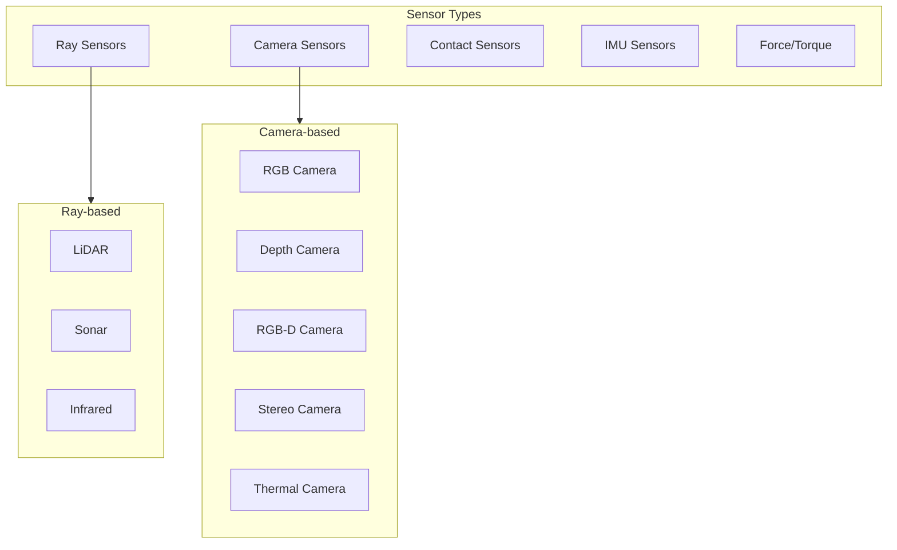
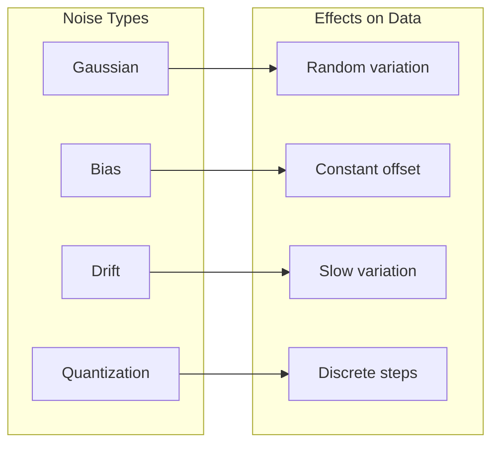

# LiDAR, Camera, IMU Simulation

## Learning Objectives

By the end of this chapter, you will be able to:

- Configure and simulate various sensor types in Gazebo
- Understand sensor noise models and their parameters
- Add LiDAR sensors for navigation and obstacle detection
- Implement camera sensors for visual perception
- Configure IMU sensors for state estimation

## Sensor Simulation Overview

Gazebo provides a comprehensive sensor simulation framework that models real-world sensor behavior including noise, latency, and physical limitations.



## LiDAR Sensor Configuration

### 2D LiDAR (Planar Scanner)

```xml
<!-- 2D LiDAR like Hokuyo or SICK -->
<sensor name="lidar_2d" type="gpu_lidar">
  <pose>0 0 0.5 0 0 0</pose>
  <topic>/scan</topic>
  <update_rate>40</update_rate>
  <always_on>true</always_on>
  <visualize>true</visualize>

  <lidar>
    <scan>
      <horizontal>
        <samples>720</samples>
        <resolution>1</resolution>
        <min_angle>-2.35619</min_angle>  <!-- -135 degrees -->
        <max_angle>2.35619</max_angle>   <!-- 135 degrees -->
      </horizontal>
      <vertical>
        <samples>1</samples>
        <resolution>1</resolution>
        <min_angle>0</min_angle>
        <max_angle>0</max_angle>
      </vertical>
    </scan>
    <range>
      <min>0.1</min>
      <max>30.0</max>
      <resolution>0.01</resolution>
    </range>
    <noise>
      <type>gaussian</type>
      <mean>0.0</mean>
      <stddev>0.01</stddev>
    </noise>
  </lidar>
</sensor>
```

### 3D LiDAR (Multi-layer Scanner)

```xml
<!-- 3D LiDAR like Velodyne VLP-16 -->
<sensor name="lidar_3d" type="gpu_lidar">
  <pose>0 0 1.0 0 0 0</pose>
  <topic>/velodyne_points</topic>
  <update_rate>20</update_rate>
  <always_on>true</always_on>
  <visualize>true</visualize>

  <lidar>
    <scan>
      <horizontal>
        <samples>1800</samples>
        <resolution>1</resolution>
        <min_angle>-3.14159</min_angle>  <!-- -180 degrees -->
        <max_angle>3.14159</max_angle>   <!-- 180 degrees -->
      </horizontal>
      <vertical>
        <samples>16</samples>
        <resolution>1</resolution>
        <min_angle>-0.261799</min_angle>  <!-- -15 degrees -->
        <max_angle>0.261799</max_angle>   <!-- 15 degrees -->
      </vertical>
    </scan>
    <range>
      <min>0.3</min>
      <max>100.0</max>
      <resolution>0.003</resolution>
    </range>
    <noise>
      <type>gaussian</type>
      <mean>0.0</mean>
      <stddev>0.02</stddev>
    </noise>
  </lidar>
</sensor>
```

### High-Resolution LiDAR Configuration

```xml
<!-- High-res LiDAR like Ouster OS1-128 -->
<sensor name="ouster_lidar" type="gpu_lidar">
  <pose>0 0 1.2 0 0 0</pose>
  <topic>/ouster/points</topic>
  <update_rate>10</update_rate>
  <always_on>true</always_on>

  <lidar>
    <scan>
      <horizontal>
        <samples>2048</samples>
        <resolution>1</resolution>
        <min_angle>-3.14159</min_angle>
        <max_angle>3.14159</max_angle>
      </horizontal>
      <vertical>
        <samples>128</samples>
        <resolution>1</resolution>
        <min_angle>-0.785398</min_angle>  <!-- -45 degrees -->
        <max_angle>0.785398</max_angle>   <!-- 45 degrees -->
      </vertical>
    </scan>
    <range>
      <min>0.5</min>
      <max>120.0</max>
      <resolution>0.001</resolution>
    </range>
    <noise>
      <type>gaussian</type>
      <mean>0.0</mean>
      <stddev>0.008</stddev>
    </noise>
  </lidar>
</sensor>
```

## Camera Sensors

### RGB Camera

```xml
<!-- Standard RGB camera -->
<sensor name="camera" type="camera">
  <pose>0.1 0 1.5 0 0 0</pose>
  <topic>/camera/image_raw</topic>
  <update_rate>30</update_rate>
  <always_on>true</always_on>
  <visualize>true</visualize>

  <camera>
    <horizontal_fov>1.3962634</horizontal_fov>  <!-- 80 degrees -->
    <image>
      <width>1280</width>
      <height>720</height>
      <format>R8G8B8</format>
    </image>
    <clip>
      <near>0.02</near>
      <far>100</far>
    </clip>
    <noise>
      <type>gaussian</type>
      <mean>0.0</mean>
      <stddev>0.007</stddev>
    </noise>
    <distortion>
      <k1>-0.25</k1>
      <k2>0.12</k2>
      <k3>0.0</k3>
      <p1>0.0</p1>
      <p2>0.0</p2>
      <center>0.5 0.5</center>
    </distortion>
    <lens>
      <intrinsics>
        <fx>554.25</fx>
        <fy>554.25</fy>
        <cx>320.5</cx>
        <cy>240.5</cy>
        <s>0</s>
      </intrinsics>
    </lens>
  </camera>
</sensor>
```

### Depth Camera

```xml
<!-- Depth camera like Intel RealSense D435 -->
<sensor name="depth_camera" type="depth_camera">
  <pose>0.1 0 1.5 0 0 0</pose>
  <topic>/depth_camera</topic>
  <update_rate>30</update_rate>
  <always_on>true</always_on>

  <camera>
    <horizontal_fov>1.5009832</horizontal_fov>  <!-- 86 degrees -->
    <image>
      <width>640</width>
      <height>480</height>
      <format>R_FLOAT32</format>
    </image>
    <clip>
      <near>0.1</near>
      <far>10.0</far>
    </clip>
    <noise>
      <type>gaussian</type>
      <mean>0.0</mean>
      <stddev>0.005</stddev>
    </noise>
  </camera>
</sensor>
```

### RGB-D Camera (Combined)

```xml
<!-- RGB-D camera combining color and depth -->
<sensor name="rgbd_camera" type="rgbd_camera">
  <pose>0.1 0 1.5 0 0 0</pose>
  <topic>/rgbd_camera</topic>
  <update_rate>30</update_rate>
  <always_on>true</always_on>

  <camera>
    <horizontal_fov>1.047</horizontal_fov>  <!-- 60 degrees -->
    <image>
      <width>640</width>
      <height>480</height>
    </image>
    <clip>
      <near>0.1</near>
      <far>10.0</far>
    </clip>
    <depth_camera>
      <clip>
        <near>0.1</near>
        <far>10.0</far>
      </clip>
    </depth_camera>
    <noise>
      <type>gaussian</type>
      <mean>0.0</mean>
      <stddev>0.01</stddev>
    </noise>
  </camera>
</sensor>
```

### Stereo Camera Setup

```xml
<!-- Left camera of stereo pair -->
<sensor name="stereo_left" type="camera">
  <pose>0.1 0.06 1.5 0 0 0</pose>
  <topic>/stereo/left/image_raw</topic>
  <update_rate>30</update_rate>

  <camera>
    <horizontal_fov>1.3962634</horizontal_fov>
    <image>
      <width>640</width>
      <height>480</height>
      <format>L8</format>  <!-- Grayscale for stereo -->
    </image>
    <clip>
      <near>0.1</near>
      <far>100</far>
    </clip>
  </camera>
</sensor>

<!-- Right camera (baseline = 0.12m) -->
<sensor name="stereo_right" type="camera">
  <pose>0.1 -0.06 1.5 0 0 0</pose>
  <topic>/stereo/right/image_raw</topic>
  <update_rate>30</update_rate>

  <camera>
    <horizontal_fov>1.3962634</horizontal_fov>
    <image>
      <width>640</width>
      <height>480</height>
      <format>L8</format>
    </image>
    <clip>
      <near>0.1</near>
      <far>100</far>
    </clip>
  </camera>
</sensor>
```

## IMU Sensor

### Standard IMU Configuration

```xml
<!-- 6-DoF IMU (accelerometer + gyroscope) -->
<sensor name="imu" type="imu">
  <pose>0 0 0.5 0 0 0</pose>
  <topic>/imu/data</topic>
  <update_rate>200</update_rate>
  <always_on>true</always_on>

  <imu>
    <angular_velocity>
      <x>
        <noise type="gaussian">
          <mean>0.0</mean>
          <stddev>0.0002</stddev>
          <bias_mean>0.0000075</bias_mean>
          <bias_stddev>0.0000008</bias_stddev>
        </noise>
      </x>
      <y>
        <noise type="gaussian">
          <mean>0.0</mean>
          <stddev>0.0002</stddev>
          <bias_mean>0.0000075</bias_mean>
          <bias_stddev>0.0000008</bias_stddev>
        </noise>
      </y>
      <z>
        <noise type="gaussian">
          <mean>0.0</mean>
          <stddev>0.0002</stddev>
          <bias_mean>0.0000075</bias_mean>
          <bias_stddev>0.0000008</bias_stddev>
        </noise>
      </z>
    </angular_velocity>
    <linear_acceleration>
      <x>
        <noise type="gaussian">
          <mean>0.0</mean>
          <stddev>0.017</stddev>
          <bias_mean>0.1</bias_mean>
          <bias_stddev>0.001</bias_stddev>
        </noise>
      </x>
      <y>
        <noise type="gaussian">
          <mean>0.0</mean>
          <stddev>0.017</stddev>
          <bias_mean>0.1</bias_mean>
          <bias_stddev>0.001</bias_stddev>
        </noise>
      </y>
      <z>
        <noise type="gaussian">
          <mean>0.0</mean>
          <stddev>0.017</stddev>
          <bias_mean>0.1</bias_mean>
          <bias_stddev>0.001</bias_stddev>
        </noise>
      </z>
    </linear_acceleration>
    <enable_orientation>true</enable_orientation>
  </imu>
</sensor>
```

### High-Precision IMU

```xml
<!-- High-precision IMU for humanoid balancing -->
<sensor name="torso_imu" type="imu">
  <pose>0 0 0 0 0 0</pose>
  <topic>/torso/imu</topic>
  <update_rate>400</update_rate>
  <always_on>true</always_on>

  <imu>
    <angular_velocity>
      <x>
        <noise type="gaussian">
          <mean>0.0</mean>
          <stddev>0.00005</stddev>
          <bias_mean>0.000001</bias_mean>
          <bias_stddev>0.0000001</bias_stddev>
          <dynamic_bias_stddev>0.00001</dynamic_bias_stddev>
          <dynamic_bias_correlation_time>60</dynamic_bias_correlation_time>
        </noise>
      </x>
      <y>
        <noise type="gaussian">
          <mean>0.0</mean>
          <stddev>0.00005</stddev>
          <bias_mean>0.000001</bias_mean>
          <bias_stddev>0.0000001</bias_stddev>
        </noise>
      </y>
      <z>
        <noise type="gaussian">
          <mean>0.0</mean>
          <stddev>0.00005</stddev>
          <bias_mean>0.000001</bias_mean>
          <bias_stddev>0.0000001</bias_stddev>
        </noise>
      </z>
    </angular_velocity>
    <linear_acceleration>
      <x>
        <noise type="gaussian">
          <mean>0.0</mean>
          <stddev>0.005</stddev>
          <bias_mean>0.01</bias_mean>
          <bias_stddev>0.0001</bias_stddev>
        </noise>
      </x>
      <y>
        <noise type="gaussian">
          <mean>0.0</mean>
          <stddev>0.005</stddev>
          <bias_mean>0.01</bias_mean>
          <bias_stddev>0.0001</bias_stddev>
        </noise>
      </y>
      <z>
        <noise type="gaussian">
          <mean>0.0</mean>
          <stddev>0.005</stddev>
          <bias_mean>0.01</bias_mean>
          <bias_stddev>0.0001</bias_stddev>
        </noise>
      </z>
    </linear_acceleration>
    <enable_orientation>true</enable_orientation>
  </imu>
</sensor>
```

## Additional Sensors for Humanoids

### Force/Torque Sensor

```xml
<!-- Force/torque sensor at ankle -->
<sensor name="left_ankle_ft" type="force_torque">
  <update_rate>1000</update_rate>
  <always_on>true</always_on>
  <visualize>true</visualize>
  <topic>/left_ankle/ft</topic>

  <force_torque>
    <frame>child</frame>
    <measure_direction>child_to_parent</measure_direction>
    <force>
      <x>
        <noise type="gaussian">
          <mean>0</mean>
          <stddev>0.1</stddev>
        </noise>
      </x>
      <y>
        <noise type="gaussian">
          <mean>0</mean>
          <stddev>0.1</stddev>
        </noise>
      </y>
      <z>
        <noise type="gaussian">
          <mean>0</mean>
          <stddev>0.1</stddev>
        </noise>
      </z>
    </force>
    <torque>
      <x>
        <noise type="gaussian">
          <mean>0</mean>
          <stddev>0.01</stddev>
        </noise>
      </x>
      <y>
        <noise type="gaussian">
          <mean>0</mean>
          <stddev>0.01</stddev>
        </noise>
      </y>
      <z>
        <noise type="gaussian">
          <mean>0</mean>
          <stddev>0.01</stddev>
        </noise>
      </z>
    </torque>
  </force_torque>
</sensor>
```

### Contact Sensor

```xml
<!-- Contact sensor for foot -->
<sensor name="left_foot_contact" type="contact">
  <update_rate>100</update_rate>
  <always_on>true</always_on>
  <topic>/left_foot/contact</topic>

  <contact>
    <collision>left_foot_link_collision</collision>
  </contact>
</sensor>
```

## Complete Sensor Suite Configuration

```python
"""
Complete sensor configuration for a humanoid robot
"""

from dataclasses import dataclass
from typing import Dict, List, Optional
import xml.etree.ElementTree as ET


@dataclass
class NoiseParams:
    """Sensor noise parameters."""
    type: str = "gaussian"
    mean: float = 0.0
    stddev: float = 0.01
    bias_mean: float = 0.0
    bias_stddev: float = 0.0


@dataclass
class SensorConfig:
    """Base sensor configuration."""
    name: str
    sensor_type: str
    pose: str
    update_rate: float
    topic: str
    noise: Optional[NoiseParams] = None


class HumanoidSensorSuite:
    """Generate complete sensor suite for humanoid robot."""

    def __init__(self, robot_name: str = "humanoid"):
        self.robot_name = robot_name
        self.sensors: List[str] = []

    def add_head_camera(self, resolution: tuple = (640, 480),
                        fps: float = 30) -> None:
        """Add RGB camera to robot head."""
        camera_sdf = f"""
    <sensor name="head_camera" type="camera">
      <pose>0.05 0 0 0 0 0</pose>
      <topic>/{self.robot_name}/head_camera/image_raw</topic>
      <update_rate>{fps}</update_rate>
      <always_on>true</always_on>

      <camera>
        <horizontal_fov>1.3962634</horizontal_fov>
        <image>
          <width>{resolution[0]}</width>
          <height>{resolution[1]}</height>
          <format>R8G8B8</format>
        </image>
        <clip>
          <near>0.02</near>
          <far>100</far>
        </clip>
        <noise>
          <type>gaussian</type>
          <mean>0.0</mean>
          <stddev>0.007</stddev>
        </noise>
      </camera>
    </sensor>"""
        self.sensors.append(camera_sdf)

    def add_depth_camera(self, parent_link: str = "head_link") -> None:
        """Add depth camera for perception."""
        depth_sdf = f"""
    <sensor name="depth_camera" type="depth_camera">
      <pose>0.05 0 -0.05 0 0 0</pose>
      <topic>/{self.robot_name}/depth_camera</topic>
      <update_rate>30</update_rate>
      <always_on>true</always_on>

      <camera>
        <horizontal_fov>1.5009832</horizontal_fov>
        <image>
          <width>640</width>
          <height>480</height>
          <format>R_FLOAT32</format>
        </image>
        <clip>
          <near>0.1</near>
          <far>10.0</far>
        </clip>
        <noise>
          <type>gaussian</type>
          <mean>0.0</mean>
          <stddev>0.005</stddev>
        </noise>
      </camera>
    </sensor>"""
        self.sensors.append(depth_sdf)

    def add_torso_imu(self) -> None:
        """Add high-precision IMU to torso."""
        imu_sdf = f"""
    <sensor name="torso_imu" type="imu">
      <pose>0 0 0 0 0 0</pose>
      <topic>/{self.robot_name}/imu</topic>
      <update_rate>400</update_rate>
      <always_on>true</always_on>

      <imu>
        <angular_velocity>
          <x><noise type="gaussian"><mean>0</mean><stddev>0.0002</stddev></noise></x>
          <y><noise type="gaussian"><mean>0</mean><stddev>0.0002</stddev></noise></y>
          <z><noise type="gaussian"><mean>0</mean><stddev>0.0002</stddev></noise></z>
        </angular_velocity>
        <linear_acceleration>
          <x><noise type="gaussian"><mean>0</mean><stddev>0.017</stddev></noise></x>
          <y><noise type="gaussian"><mean>0</mean><stddev>0.017</stddev></noise></y>
          <z><noise type="gaussian"><mean>0</mean><stddev>0.017</stddev></noise></z>
        </linear_acceleration>
        <enable_orientation>true</enable_orientation>
      </imu>
    </sensor>"""
        self.sensors.append(imu_sdf)

    def add_foot_sensors(self) -> None:
        """Add contact and force/torque sensors to feet."""
        for side in ['left', 'right']:
            # Contact sensor
            contact_sdf = f"""
    <sensor name="{side}_foot_contact" type="contact">
      <update_rate>100</update_rate>
      <always_on>true</always_on>
      <topic>/{self.robot_name}/{side}_foot/contact</topic>
      <contact>
        <collision>{side}_foot_link_collision</collision>
      </contact>
    </sensor>"""
            self.sensors.append(contact_sdf)

    def add_lidar(self, lidar_type: str = "2d") -> None:
        """Add LiDAR sensor."""
        if lidar_type == "2d":
            lidar_sdf = f"""
    <sensor name="lidar" type="gpu_lidar">
      <pose>0 0 0.1 0 0 0</pose>
      <topic>/{self.robot_name}/scan</topic>
      <update_rate>40</update_rate>
      <always_on>true</always_on>
      <visualize>true</visualize>

      <lidar>
        <scan>
          <horizontal>
            <samples>720</samples>
            <resolution>1</resolution>
            <min_angle>-2.35619</min_angle>
            <max_angle>2.35619</max_angle>
          </horizontal>
        </scan>
        <range>
          <min>0.1</min>
          <max>30.0</max>
          <resolution>0.01</resolution>
        </range>
        <noise>
          <type>gaussian</type>
          <mean>0.0</mean>
          <stddev>0.01</stddev>
        </noise>
      </lidar>
    </sensor>"""
        else:  # 3d
            lidar_sdf = f"""
    <sensor name="lidar_3d" type="gpu_lidar">
      <pose>0 0 0.1 0 0 0</pose>
      <topic>/{self.robot_name}/points</topic>
      <update_rate>20</update_rate>
      <always_on>true</always_on>

      <lidar>
        <scan>
          <horizontal>
            <samples>1800</samples>
            <resolution>1</resolution>
            <min_angle>-3.14159</min_angle>
            <max_angle>3.14159</max_angle>
          </horizontal>
          <vertical>
            <samples>16</samples>
            <resolution>1</resolution>
            <min_angle>-0.261799</min_angle>
            <max_angle>0.261799</max_angle>
          </vertical>
        </scan>
        <range>
          <min>0.3</min>
          <max>100.0</max>
          <resolution>0.003</resolution>
        </range>
        <noise>
          <type>gaussian</type>
          <mean>0.0</mean>
          <stddev>0.02</stddev>
        </noise>
      </lidar>
    </sensor>"""
        self.sensors.append(lidar_sdf)

    def generate_link_sensors(self, link_name: str) -> str:
        """Generate all sensors for a specific link."""
        return f"""
  <link name="{link_name}">
    <!-- Existing link content... -->

    <!-- Sensors -->
    {"".join(self.sensors)}
  </link>"""

    def get_sensor_topics(self) -> Dict[str, str]:
        """Return dictionary of all sensor topics."""
        return {
            'camera': f'/{self.robot_name}/head_camera/image_raw',
            'depth': f'/{self.robot_name}/depth_camera',
            'imu': f'/{self.robot_name}/imu',
            'lidar': f'/{self.robot_name}/scan',
            'left_foot_contact': f'/{self.robot_name}/left_foot/contact',
            'right_foot_contact': f'/{self.robot_name}/right_foot/contact',
        }


# Example usage
if __name__ == "__main__":
    suite = HumanoidSensorSuite("atlas")
    suite.add_head_camera((1280, 720), 30)
    suite.add_depth_camera()
    suite.add_torso_imu()
    suite.add_foot_sensors()
    suite.add_lidar("2d")

    print("Sensor topics:", suite.get_sensor_topics())
```

## Sensor Noise Models

### Understanding Noise Types



### Realistic Noise Parameters

```python
"""
Realistic sensor noise parameters based on common hardware
"""

SENSOR_NOISE_PROFILES = {
    # IMU noise profiles
    'imu_consumer': {
        'gyro_noise': 0.01,  # rad/s
        'gyro_bias': 0.001,  # rad/s
        'accel_noise': 0.1,  # m/s^2
        'accel_bias': 0.05,  # m/s^2
    },
    'imu_industrial': {
        'gyro_noise': 0.0002,
        'gyro_bias': 0.00001,
        'accel_noise': 0.017,
        'accel_bias': 0.001,
    },
    'imu_tactical': {
        'gyro_noise': 0.00005,
        'gyro_bias': 0.000001,
        'accel_noise': 0.005,
        'accel_bias': 0.0001,
    },

    # LiDAR noise profiles
    'lidar_cheap': {
        'range_noise': 0.05,  # meters
        'angular_noise': 0.01,  # radians
    },
    'lidar_velodyne': {
        'range_noise': 0.02,
        'angular_noise': 0.001,
    },
    'lidar_ouster': {
        'range_noise': 0.008,
        'angular_noise': 0.0005,
    },

    # Camera noise profiles
    'camera_webcam': {
        'image_noise': 0.02,
        'depth_noise': 0.05,  # meters (for RGBD)
    },
    'camera_realsense': {
        'image_noise': 0.007,
        'depth_noise': 0.01,
    },
    'camera_zed': {
        'image_noise': 0.005,
        'depth_noise': 0.02,
    },
}


def get_imu_sdf_noise(profile: str) -> str:
    """Generate IMU noise SDF based on profile."""
    params = SENSOR_NOISE_PROFILES[profile]

    return f"""
    <angular_velocity>
      <x><noise type="gaussian">
        <mean>0</mean>
        <stddev>{params['gyro_noise']}</stddev>
        <bias_mean>{params['gyro_bias']}</bias_mean>
      </noise></x>
      <y><noise type="gaussian">
        <mean>0</mean>
        <stddev>{params['gyro_noise']}</stddev>
        <bias_mean>{params['gyro_bias']}</bias_mean>
      </noise></y>
      <z><noise type="gaussian">
        <mean>0</mean>
        <stddev>{params['gyro_noise']}</stddev>
        <bias_mean>{params['gyro_bias']}</bias_mean>
      </noise></z>
    </angular_velocity>
    <linear_acceleration>
      <x><noise type="gaussian">
        <mean>0</mean>
        <stddev>{params['accel_noise']}</stddev>
        <bias_mean>{params['accel_bias']}</bias_mean>
      </noise></x>
      <y><noise type="gaussian">
        <mean>0</mean>
        <stddev>{params['accel_noise']}</stddev>
        <bias_mean>{params['accel_bias']}</bias_mean>
      </noise></y>
      <z><noise type="gaussian">
        <mean>0</mean>
        <stddev>{params['accel_noise']}</stddev>
        <bias_mean>{params['accel_bias']}</bias_mean>
      </noise></z>
    </linear_acceleration>"""
```

## Practical Exercises

### Exercise 1: Configure a Navigation Sensor Suite

Create sensor configuration for autonomous navigation:
1. 3D LiDAR for mapping
2. RGB-D camera for obstacle detection
3. IMU for odometry
4. Wheel encoders (joint state)

### Exercise 2: Perception Pipeline Testing

Test sensor configurations by:
1. Spawning robot in a test environment
2. Visualizing sensor data in RViz
3. Comparing noise effects at different levels
4. Measuring sensor latency

### Exercise 3: Custom Sensor Plugin

Create a custom sensor that measures:
- Ground contact area
- Center of pressure
- Contact force distribution

## Key Takeaways

1. **Sensor selection matters** - Choose sensors based on task requirements
2. **Realistic noise is essential** - Use appropriate noise models for sim-to-real transfer
3. **Update rates affect performance** - Balance data quality with computational cost
4. **Multiple sensors complement** - Combine sensors for robust perception
5. **Calibration in simulation** - Set intrinsics and extrinsics accurately

## Sensor Specifications Quick Reference

| Sensor Type | Typical Update Rate | Common Resolution | Noise Range |
|-------------|--------------------|--------------------|-------------|
| 2D LiDAR | 20-40 Hz | 0.25-1 degree | 1-5 cm |
| 3D LiDAR | 10-20 Hz | 0.1-0.4 degree | 2-5 cm |
| RGB Camera | 30-60 Hz | 640x480 to 4K | 0.5-2% |
| Depth Camera | 30 Hz | 640x480 | 1-5 cm |
| IMU | 100-1000 Hz | N/A | Varies by grade |
| F/T Sensor | 100-1000 Hz | N/A | 0.1-1% FS |

## Next Chapter Preview

In the next chapter, we will cover **ROS 2 Sensor Integration**. You will learn how to bridge Gazebo sensor data to ROS 2, process sensor messages, and build perception pipelines for humanoid robot navigation and manipulation.
