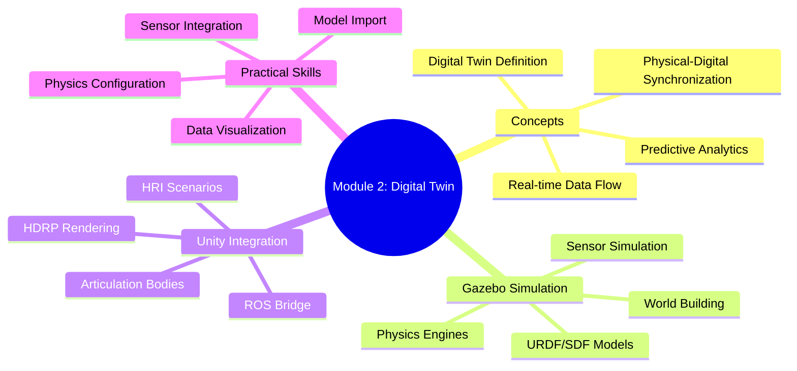

# Summary and Assessment

## Module Summary

This module covered the essential concepts and practical skills for building digital twin systems for humanoid robots.

## Key Concepts Review

### Chapter 1: What is a Digital Twin?
- Digital twins are virtual representations with bidirectional data flow
- They span the complete lifecycle of physical systems
- Key components: physical entity, virtual entity, data connection, services

### Chapter 2: Gazebo Physics Engine
- Gazebo provides multiple physics engines (ODE, DART, Bullet, Simbody)
- DART is recommended for humanoid robots
- Timestep selection affects stability and performance

### Chapter 3: URDF to Gazebo
- URDF needs Gazebo extensions for simulation
- SDF is more capable but URDF is ROS standard
- Proper inertia and collision properties are essential

### Chapter 4: Physics Properties
- Contact parameters (kp, kd, mu) control interaction behavior
- Joint dynamics affect controllability
- Performance optimization requires balance of accuracy and speed

### Chapter 5: Environment Building
- Worlds contain physics, lighting, and models
- Heightmaps enable terrain variation
- Modular design improves reusability

### Chapter 6: Sensor Simulation
- LiDAR, cameras, and IMUs are essential sensors
- Noise models improve sim-to-real transfer
- Update rates affect performance

### Chapter 7: ROS 2 Integration
- ros_gz_bridge connects Gazebo to ROS 2
- Topic bridging requires correct message type mapping
- Sensor fusion combines multiple data sources

### Chapter 8: Unity for Robotics
- Unity offers superior rendering capabilities
- ArticulationBody is essential for robot joints
- Physics timestep must be configured for stability

### Chapter 9: HDRP Rendering
- PBR materials use real-world physical properties
- Lighting uses physical units (lux, kelvin)
- Post-processing enhances visual quality

### Chapter 10: Human-Robot Interaction
- Safety zones protect humans from robot motion
- Multiple input modalities improve interaction
- Collaborative scenarios require careful design

### Chapter 11: ROS-Unity Bridge
- TCP-based communication connects Unity and ROS 2
- Coordinate frame conversion is essential
- Custom messages require generation for Unity

### Chapter 12: Digital Twin Project
- Integration of all concepts into working system
- Real-time synchronization between simulation and visualization
- Analytics transform data into actionable insights

---

## Multiple Choice Questions

### Section A: Digital Twin Fundamentals

**Question 1:** What distinguishes a digital twin from a simple simulation?

A) Higher visual quality
B) Bidirectional, real-time data flow with the physical system
C) More complex physics calculations
D) Larger file size

Answer

**B) Bidirectional, real-time data flow with the physical system**

A digital twin maintains continuous synchronization with its physical counterpart, unlike simulations which typically use synthetic or historical data without real-time connection.

---

**Question 2:** Which of the following is NOT a key component of a digital twin architecture?

A) Physical entity
B) Virtual entity
C) Gaming engine
D) Data connection

Answer

**C) Gaming engine**

While gaming engines like Unity can be used to implement digital twins, they are not a fundamental component. The key components are the physical entity, virtual entity, and data connection.

---

**Question 3:** In the context of digital twins, what does "lifecycle spanning" mean?

A) The twin lasts for one product cycle
B) The twin exists from design through operation and maintenance
C) The twin is updated once per year
D) The twin only works during manufacturing

Answer

**B) The twin exists from design through operation and maintenance**

Digital twins span the complete lifecycle of their physical counterparts, providing value from initial design through deployment, operation, and maintenance.

---

### Section B: Gazebo Simulation

**Question 4:** Which physics engine is recommended for humanoid robot simulation in Gazebo?

A) ODE
B) Bullet
C) DART
D) PhysX

Answer

**C) DART**

DART (Dynamic Animation and Robotics Toolkit) is recommended for humanoid robots due to its superior constraint handling and articulated body simulation capabilities.

---

**Question 5:** What is the recommended physics timestep for stable humanoid walking simulation?

A) 10 ms
B) 5 ms
C) 1 ms
D) 0.1 ms

Answer

**C) 1 ms**

A 1ms (0.001s) timestep provides a good balance between stability and performance for humanoid walking simulation. Faster motions may require smaller timesteps.

---

**Question 6:** In Gazebo's SDF format, what does the `<mu>` parameter represent?

A) Mass
B) Friction coefficient
C) Damping
D) Stiffness

Answer

**B) Friction coefficient**

The `<mu>` parameter represents the Coulomb friction coefficient, which determines how much resistance there is between contacting surfaces.

---

**Question 7:** What happens if a link in your URDF has zero or missing inertial properties?

A) The simulation runs faster
B) The model becomes invisible
C) The simulation becomes unstable or the model explodes
D) Nothing, default values are used

Answer

**C) The simulation becomes unstable or the model explodes**

Missing or zero inertial properties cause physics engines to produce undefined behavior, typically resulting in simulation instability or the model "exploding".

---

### Section C: Sensor Simulation

**Question 8:** What type of noise is typically added to IMU simulations for realism?

A) Uniform noise only
B) Gaussian noise with bias
C) Pink noise
D) No noise is needed

Answer

**B) Gaussian noise with bias**

Real IMUs exhibit Gaussian (random) noise plus systematic bias that drifts over time. Simulating both is important for realistic behavior and successful sim-to-real transfer.

---

**Question 9:** For a 2D LiDAR scanner with 720 samples and a 270-degree field of view, what is the angular resolution?

A) 0.25 degrees
B) 0.375 degrees
C) 0.5 degrees
D) 1.0 degree

Answer

**B) 0.375 degrees**

Angular resolution = FOV / samples = 270 / 720 = 0.375 degrees per sample

---

**Question 10:** Which ROS 2 message type is used for publishing LiDAR scan data?

A) sensor_msgs/msg/Image
B) sensor_msgs/msg/LaserScan
C) geometry_msgs/msg/PointCloud
D) nav_msgs/msg/OccupancyGrid

Answer

**B) sensor_msgs/msg/LaserScan**

sensor_msgs/msg/LaserScan is the standard message type for 2D LiDAR data in ROS 2. For 3D LiDAR, sensor_msgs/msg/PointCloud2 is typically used.

---

### Section D: Unity for Robotics

**Question 11:** What Unity component should be used for robot joint simulation?

A) Rigidbody
B) CharacterController
C) ArticulationBody
D) ConfigurableJoint

Answer

**C) ArticulationBody**

ArticulationBody is specifically designed for articulated structures like robots, providing better stability and accuracy than regular Rigidbody components with joints.

---

**Question 12:** What does HDRP stand for in Unity?

A) High Dynamic Range Processing
B) High Definition Render Pipeline
C) Hardware Direct Rendering Protocol
D) Hybrid Display Resolution Pipeline

Answer

**B) High Definition Render Pipeline**

HDRP (High Definition Render Pipeline) is Unity's advanced rendering system designed for high-fidelity graphics on modern hardware.

---

**Question 13:** In Unity's PBR material system, what does a metallic value of 1.0 represent?

A) The material is transparent
B) The material is a perfect metal
C) The material is very smooth
D) The material is self-illuminating

Answer

**B) The material is a perfect metal**

A metallic value of 1.0 indicates a pure metal material, while 0.0 indicates a dielectric (non-metal) material. Real metals typically have values close to 1.0.

---

### Section E: ROS Integration

**Question 14:** What is the purpose of the ros_gz_bridge package?

A) To compile ROS code for Gazebo
B) To translate messages between ROS 2 and Gazebo
C) To visualize ROS data in Gazebo
D) To convert URDF to SDF

Answer

**B) To translate messages between ROS 2 and Gazebo**

ros_gz_bridge provides bidirectional message translation between ROS 2 topics and Gazebo transport topics, enabling integration between the two systems.

---

**Question 15:** When converting coordinates from Unity (Y-up) to ROS (Z-up), which transformation is correct for position?

A) ROS.x = Unity.x, ROS.y = Unity.y, ROS.z = Unity.z
B) ROS.x = Unity.z, ROS.y = -Unity.x, ROS.z = Unity.y
C) ROS.x = Unity.y, ROS.y = Unity.z, ROS.z = Unity.x
D) ROS.x = -Unity.x, ROS.y = Unity.z, ROS.z = Unity.y

Answer

**B) ROS.x = Unity.z, ROS.y = -Unity.x, ROS.z = Unity.y**

Converting from Unity's left-handed Y-up coordinate system to ROS's right-handed Z-up system requires remapping and sign changes for the axes.

---

### Section F: Human-Robot Interaction

**Question 16:** What is the purpose of safety zones in HRI applications?

A) To make the simulation look better
B) To define regions where robot behavior is modified for human safety
C) To increase simulation speed
D) To store robot data

Answer

**B) To define regions where robot behavior is modified for human safety**

Safety zones define regions around robots where speed is reduced, forces are limited, or the robot stops entirely to protect humans in collaborative environments.

---

**Question 17:** In a collaborative robot scenario, what should happen when a human enters the protective zone?

A) The robot should speed up
B) The robot should significantly reduce speed or force
C) The robot should ignore the human
D) The robot should move toward the human

Answer

**B) The robot should significantly reduce speed or force**

When a human enters the protective zone, the robot should reduce speed and force to levels that would not cause injury in case of contact, while still allowing operation.

---

### Section G: Digital Twin Implementation

**Question 18:** What is the primary benefit of real-time state synchronization in a digital twin?

A) Reduced network bandwidth
B) Ability to monitor and predict physical system behavior
C) Faster rendering
D) Smaller file storage

Answer

**B) Ability to monitor and predict physical system behavior**

Real-time synchronization allows the digital twin to accurately reflect the current state of the physical system, enabling monitoring, analysis, and predictive capabilities.

---

**Question 19:** Which of the following is NOT a typical use case for a humanoid robot digital twin?

A) Virtual testing of walking gaits
B) Predictive maintenance analysis
C) Training data generation for ML
D) Reducing the physical robot's weight

Answer

**D) Reducing the physical robot's weight**

A digital twin cannot change the physical properties of the real robot. It is used for simulation, analysis, training, and monitoring - not physical modification.

---

**Question 20:** What type of data is typically stored in a digital twin's historical database?

A) Only error logs
B) Sensor readings, state history, and performance metrics
C) Only visual images
D) Only user commands

Answer

**B) Sensor readings, state history, and performance metrics**

Digital twin databases store comprehensive historical data including sensor readings, state trajectories, performance metrics, and events for analysis and prediction.

---

## Practical Exercises

### Exercise 1: Basic World Creation (Beginner)

Create a Gazebo world file that includes:
1. Ground plane with friction coefficient of 0.8
2. Directional light (sun)
3. Three box obstacles at different positions
4. Physics configured for DART at 1ms timestep

**Deliverable:** Working `.sdf` file that loads without errors

---

### Exercise 2: Sensor Configuration (Intermediate)

Configure a sensor suite for a humanoid robot head:
1. RGB camera (640x480, 30fps)
2. Depth camera (same resolution)
3. IMU (200Hz update rate)
4. Configure realistic noise for all sensors

**Deliverable:** URDF/SDF snippet with all sensors configured

---

### Exercise 3: ROS 2 Bridge Setup (Intermediate)

Create a complete ros_gz_bridge configuration for:
1. Joint states (Gazebo to ROS)
2. Velocity commands (ROS to Gazebo)
3. Camera images (Gazebo to ROS)
4. Clock synchronization

**Deliverable:** YAML configuration file and launch file

---

### Exercise 4: Unity Robot Controller (Intermediate)

Implement a C# script that:
1. Reads joint states from ROS
2. Applies position control to ArticulationBodies
3. Publishes robot pose back to ROS
4. Includes proper coordinate frame conversion

**Deliverable:** Working Unity C# script

---

### Exercise 5: Digital Twin Dashboard (Advanced)

Build a complete dashboard that displays:
1. Real-time robot joint positions
2. Energy consumption graph
3. Health status indicators
4. Alert system for anomalies

**Deliverable:** Working dashboard (Unity or web-based)

---

### Exercise 6: Complete Integration (Advanced)

Integrate all module components:
1. Gazebo simulation with humanoid robot
2. ROS 2 control system
3. Unity visualization with ROS bridge
4. Data logging and analytics

**Deliverable:** Complete working system with documentation

---

## Scoring Guide

| Score Range | Level | Recommendation |
|-------------|-------|----------------|
| 0-8 | Beginning | Review all chapters thoroughly |
| 9-12 | Developing | Focus on weak areas, more practice |
| 13-16 | Proficient | Ready for advanced topics |
| 17-20 | Expert | Ready for real-world applications |

## Further Learning Resources

### Documentation
- [Gazebo Documentation](https://gazebosim.org/docs)
- [ROS 2 Documentation](https://docs.ros.org/)
- [Unity Robotics Hub](https://github.com/Unity-Technologies/Unity-Robotics-Hub)
- [NVIDIA Isaac Sim](https://developer.nvidia.com/isaac-sim)

### Books
- "Robot Operating System 2: Design, Architecture, and Uses In The Real World"
- "Unity Game Development in 24 Hours"
- "Digital Twin Technology" by Noel Crespi

### Online Courses
- ROS 2 Developer Learning Path (The Construct)
- Unity Certified Developer Program
- Coursera: Robotics Specialization

### Community
- ROS Discourse Forum
- Gazebo Community
- Unity Forums - Robotics

## Module Completion Certificate

Upon completing this module with a score of 13 or higher on the assessment and finishing at least 4 practical exercises, you have demonstrated proficiency in:

- Digital twin concepts and architecture
- Gazebo physics simulation
- Sensor simulation and configuration
- Unity robotics integration
- ROS 2 communication and bridging
- Human-robot interaction design

**Congratulations on completing Module 2: Digital Twin!**

---

## Next Steps

Continue your learning journey with:
- **Module 3:** Motion Planning and Control
- **Module 4:** Perception and SLAM
- **Module 5:** Machine Learning for Robotics
