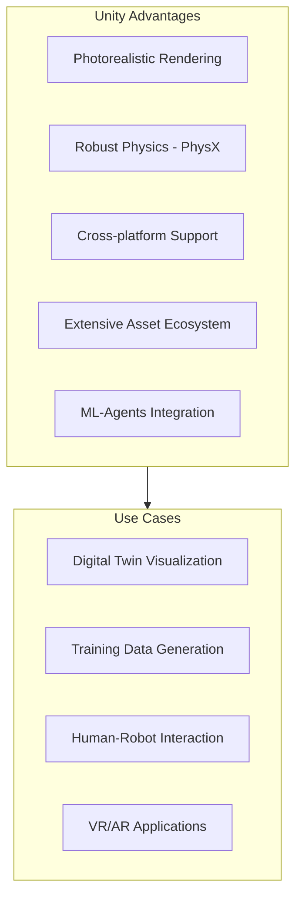
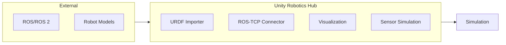
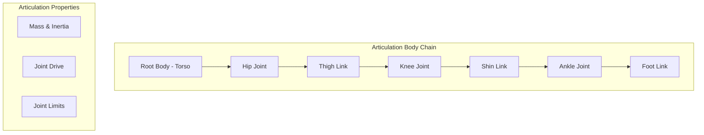

# Unity Robotics Introduction

## Learning Objectives

By the end of this chapter, you will be able to:

- Understand Unity's role in robotics simulation
- Set up Unity for robotics development
- Configure Unity's physics engine for robot simulation
- Import and control robot models in Unity
- Utilize the Unity Robotics Hub ecosystem

## Why Unity for Robotics?

Unity has emerged as a powerful platform for robotics simulation, offering unique advantages:



### Unity vs Gazebo Comparison

| Aspect | Unity | Gazebo |
|--------|-------|--------|
| **Rendering** | Photorealistic (HDRP) | Good (OGRE2) |
| **Physics** | PhysX (NVIDIA) | Multiple (ODE, DART) |
| **Primary Use** | Visualization, ML | Research, ROS |
| **ROS Integration** | Via ROS-TCP | Native (ros_gz) |
| **Learning Curve** | Moderate | Steep |
| **Asset Store** | Extensive | Limited |
| **VR/AR Support** | Native | Limited |

## Unity Robotics Hub

The Unity Robotics Hub is an official package collection for robotics development:



### Installation

1. Open Unity Hub and create a new 3D project (Unity 2021.3 LTS or later)
2. Open Window > Package Manager
3. Add packages from git URL:

```
https://github.com/Unity-Technologies/ROS-TCP-Connector.git?path=/com.unity.robotics.ros-tcp-connector
https://github.com/Unity-Technologies/URDF-Importer.git?path=/com.unity.robotics.urdf-importer
```

## Setting Up a Robotics Project

### Project Structure

```
Assets/
├── Robots/
│   ├── URDF/
│   │   └── humanoid_robot.urdf
│   ├── Meshes/
│   │   └── *.dae, *.stl
│   └── Materials/
├── Environments/
│   ├── Prefabs/
│   └── Scenes/
├── Scripts/
│   ├── Controllers/
│   ├── Sensors/
│   └── ROS/
└── Plugins/
```

### Basic Scene Setup

```csharp
// SceneSetup.cs
using UnityEngine;

public class SceneSetup : MonoBehaviour
{
    [Header("Environment Settings")]
    public float groundFriction = 0.8f;
    public Material groundMaterial;

    [Header("Lighting")]
    public Light directionalLight;
    public float lightIntensity = 1.0f;

    void Start()
    {
        SetupGround();
        SetupLighting();
        ConfigurePhysics();
    }

    void SetupGround()
    {
        // Create ground plane
        GameObject ground = GameObject.CreatePrimitive(PrimitiveType.Plane);
        ground.name = "Ground";
        ground.transform.localScale = new Vector3(10, 1, 10);

        // Configure physics material
        PhysicMaterial physicsMat = new PhysicMaterial("GroundMaterial");
        physicsMat.staticFriction = groundFriction;
        physicsMat.dynamicFriction = groundFriction * 0.8f;
        physicsMat.frictionCombine = PhysicMaterialCombine.Average;

        ground.GetComponent<Collider>().material = physicsMat;

        if (groundMaterial != null)
        {
            ground.GetComponent<Renderer>().material = groundMaterial;
        }
    }

    void SetupLighting()
    {
        if (directionalLight == null)
        {
            GameObject lightObj = new GameObject("Directional Light");
            directionalLight = lightObj.AddComponent<Light>();
            directionalLight.type = LightType.Directional;
        }

        directionalLight.intensity = lightIntensity;
        directionalLight.shadows = LightShadows.Soft;
        directionalLight.transform.rotation = Quaternion.Euler(50, -30, 0);
    }

    void ConfigurePhysics()
    {
        // Set physics timestep for robotics
        Time.fixedDeltaTime = 0.001f; // 1ms

        // Configure physics settings
        Physics.defaultSolverIterations = 10;
        Physics.defaultSolverVelocityIterations = 10;
        Physics.gravity = new Vector3(0, -9.81f, 0);
    }
}
```

## Importing Robot Models

### URDF Import Process

```csharp
// URDFImportHelper.cs
using UnityEngine;
using Unity.Robotics.UrdfImporter;

public class URDFImportHelper : MonoBehaviour
{
    [Header("Import Settings")]
    public string urdfPath = "Assets/Robots/URDF/humanoid_robot.urdf";
    public ImportSettings.convexDecomposer convexDecomposer =
        ImportSettings.convexDecomposer.vHACD;

    public void ImportRobot()
    {
        ImportSettings settings = new ImportSettings();

        // Configure import settings
        settings.chosenAxis = ImportSettings.axisType.yAxis;
        settings.convexMethod = convexDecomposer;

        // Import URDF
        UrdfRobotExtensions.Create(urdfPath, settings);

        Debug.Log($"Robot imported from {urdfPath}");
    }
}
```

### Post-Import Configuration

```csharp
// RobotConfigurator.cs
using UnityEngine;
using Unity.Robotics.UrdfImporter;

public class RobotConfigurator : MonoBehaviour
{
    [Header("Physics Settings")]
    public float jointDamping = 10f;
    public float jointStiffness = 1000f;
    public float maxJointForce = 1000f;

    private ArticulationBody[] articulationBodies;

    void Start()
    {
        ConfigureRobot();
    }

    public void ConfigureRobot()
    {
        articulationBodies = GetComponentsInChildren<ArticulationBody>();

        foreach (var body in articulationBodies)
        {
            ConfigureArticulationBody(body);
        }

        Debug.Log($"Configured {articulationBodies.Length} articulation bodies");
    }

    void ConfigureArticulationBody(ArticulationBody body)
    {
        // Configure joint drive
        if (body.jointType != ArticulationJointType.FixedJoint)
        {
            var drive = body.xDrive;
            drive.damping = jointDamping;
            drive.stiffness = jointStiffness;
            drive.forceLimit = maxJointForce;
            body.xDrive = drive;

            // Enable collision detection
            body.solverIterations = 10;
            body.solverVelocityIterations = 10;
        }

        // Set mass properties if needed
        if (body.mass < 0.001f)
        {
            body.mass = 0.1f; // Minimum mass
        }
    }
}
```

## Articulation Bodies

Unity uses ArticulationBody for robot joints, which provides better simulation for articulated structures:



### Articulation Body Controller

```csharp
// ArticulationController.cs
using UnityEngine;
using System.Collections.Generic;

public class ArticulationController : MonoBehaviour
{
    [System.Serializable]
    public class JointConfig
    {
        public string jointName;
        public float targetPosition;
        public float stiffness = 10000f;
        public float damping = 100f;
        public float forceLimit = 1000f;
    }

    [Header("Joint Configurations")]
    public List<JointConfig> jointConfigs = new List<JointConfig>();

    private Dictionary<string, ArticulationBody> joints =
        new Dictionary<string, ArticulationBody>();

    void Start()
    {
        InitializeJoints();
    }

    void InitializeJoints()
    {
        var allBodies = GetComponentsInChildren<ArticulationBody>();

        foreach (var body in allBodies)
        {
            if (body.jointType != ArticulationJointType.FixedJoint)
            {
                joints[body.name] = body;
            }
        }

        Debug.Log($"Found {joints.Count} controllable joints");
    }

    void FixedUpdate()
    {
        foreach (var config in jointConfigs)
        {
            if (joints.TryGetValue(config.jointName, out ArticulationBody body))
            {
                SetJointTarget(body, config);
            }
        }
    }

    void SetJointTarget(ArticulationBody body, JointConfig config)
    {
        // Configure drive parameters
        var drive = body.xDrive;
        drive.stiffness = config.stiffness;
        drive.damping = config.damping;
        drive.forceLimit = config.forceLimit;
        drive.target = config.targetPosition * Mathf.Rad2Deg;
        body.xDrive = drive;
    }

    public void SetJointPosition(string jointName, float positionRadians)
    {
        if (joints.TryGetValue(jointName, out ArticulationBody body))
        {
            var drive = body.xDrive;
            drive.target = positionRadians * Mathf.Rad2Deg;
            body.xDrive = drive;
        }
    }

    public float GetJointPosition(string jointName)
    {
        if (joints.TryGetValue(jointName, out ArticulationBody body))
        {
            return body.jointPosition[0];
        }
        return 0f;
    }

    public float GetJointVelocity(string jointName)
    {
        if (joints.TryGetValue(jointName, out ArticulationBody body))
        {
            return body.jointVelocity[0];
        }
        return 0f;
    }

    public Dictionary<string, float> GetAllJointPositions()
    {
        var positions = new Dictionary<string, float>();
        foreach (var kvp in joints)
        {
            positions[kvp.Key] = kvp.Value.jointPosition[0];
        }
        return positions;
    }
}
```

## Physics Configuration

### PhysX Settings for Robotics

```csharp
// PhysicsConfigurator.cs
using UnityEngine;

[CreateAssetMenu(fileName = "RoboticsPhysicsSettings",
                 menuName = "Robotics/Physics Settings")]
public class PhysicsConfigurator : ScriptableObject
{
    [Header("Time Settings")]
    [Tooltip("Fixed timestep in seconds (0.001 = 1ms)")]
    public float fixedTimestep = 0.001f;

    [Tooltip("Maximum allowed timestep")]
    public float maximumAllowedTimestep = 0.033f;

    [Header("Solver Settings")]
    [Range(1, 50)]
    public int solverIterations = 10;

    [Range(1, 50)]
    public int solverVelocityIterations = 10;

    [Header("Contact Settings")]
    public float defaultContactOffset = 0.01f;
    public float bounceThreshold = 2f;
    public float sleepThreshold = 0.005f;

    [Header("Articulation Settings")]
    public float jointFriction = 0.05f;

    public void ApplySettings()
    {
        // Time settings
        Time.fixedDeltaTime = fixedTimestep;
        Time.maximumDeltaTime = maximumAllowedTimestep;

        // Physics settings
        Physics.defaultSolverIterations = solverIterations;
        Physics.defaultSolverVelocityIterations = solverVelocityIterations;
        Physics.defaultContactOffset = defaultContactOffset;
        Physics.bounceThreshold = bounceThreshold;
        Physics.sleepThreshold = sleepThreshold;

        Debug.Log("Physics settings applied for robotics simulation");
    }
}
```

### Collision Configuration

```csharp
// CollisionManager.cs
using UnityEngine;
using System.Collections.Generic;

public class CollisionManager : MonoBehaviour
{
    [Header("Collision Layers")]
    public LayerMask robotLayer;
    public LayerMask environmentLayer;
    public LayerMask sensorLayer;

    [Header("Self-Collision Settings")]
    public bool enableSelfCollision = true;
    public List<string> ignoreSelfCollisionPairs = new List<string>();

    private List<Collider> robotColliders = new List<Collider>();

    void Start()
    {
        SetupCollisionLayers();
        ConfigureSelfCollision();
    }

    void SetupCollisionLayers()
    {
        // Configure layer collision matrix
        // Robot collides with environment
        Physics.IgnoreLayerCollision(
            LayerMaskToLayer(robotLayer),
            LayerMaskToLayer(environmentLayer),
            false
        );

        // Sensors don't physically collide
        Physics.IgnoreLayerCollision(
            LayerMaskToLayer(sensorLayer),
            LayerMaskToLayer(environmentLayer),
            true
        );
    }

    void ConfigureSelfCollision()
    {
        robotColliders.AddRange(GetComponentsInChildren<Collider>());

        if (!enableSelfCollision)
        {
            // Disable all self-collision
            for (int i = 0; i < robotColliders.Count; i++)
            {
                for (int j = i + 1; j < robotColliders.Count; j++)
                {
                    Physics.IgnoreCollision(
                        robotColliders[i],
                        robotColliders[j],
                        true
                    );
                }
            }
        }
        else
        {
            // Ignore specific pairs (e.g., adjacent links)
            foreach (var pair in ignoreSelfCollisionPairs)
            {
                var parts = pair.Split(',');
                if (parts.Length == 2)
                {
                    IgnoreCollisionBetween(parts[0].Trim(), parts[1].Trim());
                }
            }
        }
    }

    void IgnoreCollisionBetween(string collider1Name, string collider2Name)
    {
        Collider c1 = null, c2 = null;

        foreach (var collider in robotColliders)
        {
            if (collider.name.Contains(collider1Name)) c1 = collider;
            if (collider.name.Contains(collider2Name)) c2 = collider;
        }

        if (c1 != null && c2 != null)
        {
            Physics.IgnoreCollision(c1, c2, true);
        }
    }

    int LayerMaskToLayer(LayerMask layerMask)
    {
        int layerNumber = 0;
        int layer = layerMask.value;
        while (layer > 1)
        {
            layer = layer >> 1;
            layerNumber++;
        }
        return layerNumber;
    }
}
```

## Basic Robot Controller

```csharp
// HumanoidController.cs
using UnityEngine;
using System.Collections.Generic;

public class HumanoidController : MonoBehaviour
{
    [Header("Control Mode")]
    public enum ControlMode { Position, Velocity, Torque }
    public ControlMode controlMode = ControlMode.Position;

    [Header("Joint Groups")]
    public List<string> leftLegJoints = new List<string>();
    public List<string> rightLegJoints = new List<string>();
    public List<string> leftArmJoints = new List<string>();
    public List<string> rightArmJoints = new List<string>();

    [Header("PD Gains")]
    public float kp = 1000f;  // Proportional gain
    public float kd = 100f;   // Derivative gain

    private Dictionary<string, ArticulationBody> jointMap =
        new Dictionary<string, ArticulationBody>();
    private Dictionary<string, float> targetPositions =
        new Dictionary<string, float>();

    void Start()
    {
        InitializeJointMap();
        InitializeTargets();
    }

    void InitializeJointMap()
    {
        var bodies = GetComponentsInChildren<ArticulationBody>();
        foreach (var body in bodies)
        {
            if (body.jointType != ArticulationJointType.FixedJoint)
            {
                jointMap[body.name] = body;
                Debug.Log($"Registered joint: {body.name}");
            }
        }
    }

    void InitializeTargets()
    {
        foreach (var joint in jointMap)
        {
            targetPositions[joint.Key] = 0f;
        }
    }

    void FixedUpdate()
    {
        ApplyControl();
    }

    void ApplyControl()
    {
        foreach (var kvp in jointMap)
        {
            string jointName = kvp.Key;
            ArticulationBody body = kvp.Value;

            if (!targetPositions.ContainsKey(jointName)) continue;

            switch (controlMode)
            {
                case ControlMode.Position:
                    ApplyPositionControl(body, targetPositions[jointName]);
                    break;
                case ControlMode.Velocity:
                    ApplyVelocityControl(body, targetPositions[jointName]);
                    break;
                case ControlMode.Torque:
                    ApplyTorqueControl(body, targetPositions[jointName]);
                    break;
            }
        }
    }

    void ApplyPositionControl(ArticulationBody body, float target)
    {
        var drive = body.xDrive;
        drive.stiffness = kp;
        drive.damping = kd;
        drive.target = target * Mathf.Rad2Deg;
        body.xDrive = drive;
    }

    void ApplyVelocityControl(ArticulationBody body, float targetVelocity)
    {
        var drive = body.xDrive;
        drive.stiffness = 0;
        drive.damping = kd;
        drive.targetVelocity = targetVelocity * Mathf.Rad2Deg;
        body.xDrive = drive;
    }

    void ApplyTorqueControl(ArticulationBody body, float torque)
    {
        body.AddTorque(body.transform.right * torque);
    }

    // Public API
    public void SetJointTarget(string jointName, float target)
    {
        if (targetPositions.ContainsKey(jointName))
        {
            targetPositions[jointName] = target;
        }
    }

    public void SetJointTargets(Dictionary<string, float> targets)
    {
        foreach (var kvp in targets)
        {
            SetJointTarget(kvp.Key, kvp.Value);
        }
    }

    public float GetJointPosition(string jointName)
    {
        if (jointMap.TryGetValue(jointName, out ArticulationBody body))
        {
            return body.jointPosition[0];
        }
        return 0f;
    }

    public Vector3 GetCenterOfMass()
    {
        Vector3 com = Vector3.zero;
        float totalMass = 0f;

        foreach (var body in jointMap.Values)
        {
            com += body.worldCenterOfMass * body.mass;
            totalMass += body.mass;
        }

        return com / totalMass;
    }
}
```

## Practical Exercises

### Exercise 1: Project Setup

Create a new Unity robotics project:
1. Install Unity Robotics Hub packages
2. Configure physics for 1ms timestep
3. Set up proper layer collision matrix
4. Create basic scene with ground plane

### Exercise 2: Import Robot

Import a humanoid robot:
1. Obtain URDF from ROS package
2. Use URDF Importer to bring into Unity
3. Configure articulation bodies
4. Test joint movement

### Exercise 3: Basic Controller

Implement a simple joint controller:
1. Create position control for all joints
2. Add keyboard input for manual control
3. Display joint states in UI
4. Log joint positions to file

## Key Takeaways

1. **Unity excels at visualization** - Superior rendering for digital twins
2. **ArticulationBody is essential** - Use for all robot joints
3. **Physics timestep matters** - 1ms or smaller for stable simulation
4. **URDF Importer simplifies setup** - Direct import from ROS packages
5. **Layer system manages collisions** - Configure for performance and accuracy

## Common Issues and Solutions

| Issue | Cause | Solution |
|-------|-------|----------|
| Robot explodes | Timestep too large | Reduce fixedDeltaTime |
| Joints unstable | Low solver iterations | Increase to 10+ |
| Slow simulation | Too many collision checks | Simplify colliders, use layers |
| URDF import fails | Missing meshes | Check mesh paths in URDF |

## Next Chapter Preview

In the next chapter, we will explore **Unity HDRP Rendering** for creating photorealistic digital twin visualizations. You will learn to configure high-fidelity rendering, add realistic materials, and optimize performance for real-time simulation.
