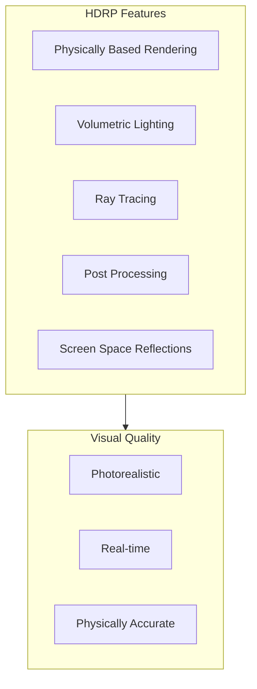

# HDRP Photorealistic Rendering

## Learning Objectives

By the end of this chapter, you will be able to:

- Configure Unity HDRP for robotics visualization
- Create physically-based rendering (PBR) materials for robots
- Set up realistic lighting and environment effects
- Optimize rendering performance for real-time simulation
- Generate synthetic training data with photorealistic rendering

## Introduction to HDRP

The **High Definition Render Pipeline (HDRP)** is Unity's advanced rendering system designed for high-fidelity graphics on modern hardware.



### HDRP vs URP vs Built-in

| Feature | HDRP | URP | Built-in |
|---------|------|-----|----------|
| **Target** | High-end PC/Console | Mobile/Low-end | Legacy |
| **Quality** | Photorealistic | Good | Basic |
| **Performance** | Heavy | Light | Medium |
| **Ray Tracing** | Yes | Limited | No |
| **Use Case** | Digital twins, visualization | Games, AR | Legacy projects |

## Setting Up HDRP Project

### Project Creation

```csharp
// HDRP Project configuration script
// Run after creating HDRP project from template

using UnityEngine;
using UnityEngine.Rendering;
using UnityEngine.Rendering.HighDefinition;

public class HDRPSetup : MonoBehaviour
{
    [Header("Quality Settings")]
    public HDRenderPipelineAsset hdrpAsset;

    [Header("Rendering Features")]
    public bool enableRayTracing = false;
    public bool enableVolumetrics = true;
    public bool enableSSR = true;

    void Start()
    {
        ConfigureHDRP();
    }

    void ConfigureHDRP()
    {
        if (hdrpAsset == null)
        {
            Debug.LogError("HDRP Asset not assigned!");
            return;
        }

        // Configure rendering settings via asset
        // Note: Many settings are configured in the HDRP Asset inspector

        // Set quality level
        QualitySettings.SetQualityLevel(
            QualitySettings.names.Length - 1,  // Highest quality
            true
        );

        Debug.Log("HDRP configured for robotics visualization");
    }
}
```

### HDRP Global Settings

Create and configure the HDRP Global Settings asset:

```csharp
// HDRPGlobalConfig.cs
using UnityEngine;
using UnityEngine.Rendering.HighDefinition;

[CreateAssetMenu(fileName = "HDRPRoboticsSettings",
                 menuName = "Robotics/HDRP Settings")]
public class HDRPGlobalConfig : ScriptableObject
{
    [Header("Shadow Settings")]
    public int shadowAtlasResolution = 4096;
    public int cascadeCount = 4;

    [Header("Reflection Settings")]
    public int reflectionProbeResolution = 512;
    public bool enablePlanarReflection = true;

    [Header("Volumetric Settings")]
    public bool enableVolumetricFog = true;
    public float fogDensity = 0.01f;

    [Header("Post Processing")]
    public bool enableBloom = true;
    public bool enableMotionBlur = false;  // Disable for robotics
    public bool enableDepthOfField = false;

    public void ApplySettings(Volume globalVolume)
    {
        if (globalVolume == null) return;

        var profile = globalVolume.profile;

        // Configure fog
        if (profile.TryGet<Fog>(out var fog))
        {
            fog.enabled.value = enableVolumetricFog;
            fog.meanFreePath.value = 1f / fogDensity;
        }

        // Configure bloom
        if (profile.TryGet<Bloom>(out var bloom))
        {
            bloom.active = enableBloom;
            bloom.intensity.value = 0.2f;
        }

        // Configure motion blur
        if (profile.TryGet<MotionBlur>(out var motionBlur))
        {
            motionBlur.active = enableMotionBlur;
        }

        // Configure DOF
        if (profile.TryGet<DepthOfField>(out var dof))
        {
            dof.active = enableDepthOfField;
        }

        Debug.Log("HDRP settings applied to volume");
    }
}
```

## Physically Based Materials

### Robot Material Configuration

```csharp
// RobotMaterialSetup.cs
using UnityEngine;
using UnityEngine.Rendering.HighDefinition;

public class RobotMaterialSetup : MonoBehaviour
{
    [System.Serializable]
    public class MaterialConfig
    {
        public string partName;
        public MaterialType type;
        public Color baseColor = Color.gray;
        public float metallic = 0.8f;
        public float smoothness = 0.6f;
        [Range(0, 1)] public float clearCoat = 0f;
    }

    public enum MaterialType
    {
        Metal,
        Plastic,
        Rubber,
        Carbon,
        Glass
    }

    [Header("Material Configurations")]
    public MaterialConfig[] materialConfigs;

    [Header("Material Templates")]
    public Material metalTemplate;
    public Material plasticTemplate;
    public Material rubberTemplate;
    public Material carbonTemplate;
    public Material glassTemplate;

    void Start()
    {
        ApplyMaterials();
    }

    public void ApplyMaterials()
    {
        foreach (var config in materialConfigs)
        {
            ApplyMaterial(config);
        }
    }

    void ApplyMaterial(MaterialConfig config)
    {
        // Find renderer by name
        var renderers = GetComponentsInChildren<Renderer>();

        foreach (var renderer in renderers)
        {
            if (renderer.name.Contains(config.partName))
            {
                Material mat = CreateMaterial(config);
                renderer.material = mat;
            }
        }
    }

    Material CreateMaterial(MaterialConfig config)
    {
        Material template = GetTemplate(config.type);
        Material mat = new Material(template);

        // Apply base properties
        mat.SetColor("_BaseColor", config.baseColor);
        mat.SetFloat("_Metallic", config.metallic);
        mat.SetFloat("_Smoothness", config.smoothness);

        // Apply type-specific properties
        switch (config.type)
        {
            case MaterialType.Metal:
                ConfigureMetalMaterial(mat, config);
                break;
            case MaterialType.Plastic:
                ConfigurePlasticMaterial(mat, config);
                break;
            case MaterialType.Rubber:
                ConfigureRubberMaterial(mat, config);
                break;
            case MaterialType.Carbon:
                ConfigureCarbonMaterial(mat, config);
                break;
            case MaterialType.Glass:
                ConfigureGlassMaterial(mat, config);
                break;
        }

        return mat;
    }

    Material GetTemplate(MaterialType type)
    {
        return type switch
        {
            MaterialType.Metal => metalTemplate,
            MaterialType.Plastic => plasticTemplate,
            MaterialType.Rubber => rubberTemplate,
            MaterialType.Carbon => carbonTemplate,
            MaterialType.Glass => glassTemplate,
            _ => metalTemplate
        };
    }

    void ConfigureMetalMaterial(Material mat, MaterialConfig config)
    {
        mat.SetFloat("_Metallic", 1.0f);
        mat.SetFloat("_Smoothness", config.smoothness);

        // Add anisotropy for brushed metal look
        if (mat.HasProperty("_Anisotropy"))
        {
            mat.SetFloat("_Anisotropy", 0.5f);
        }
    }

    void ConfigurePlasticMaterial(Material mat, MaterialConfig config)
    {
        mat.SetFloat("_Metallic", 0.0f);
        mat.SetFloat("_Smoothness", config.smoothness);

        // Add clear coat for glossy plastic
        if (config.clearCoat > 0 && mat.HasProperty("_CoatMask"))
        {
            mat.SetFloat("_CoatMask", config.clearCoat);
        }
    }

    void ConfigureRubberMaterial(Material mat, MaterialConfig config)
    {
        mat.SetFloat("_Metallic", 0.0f);
        mat.SetFloat("_Smoothness", 0.2f);  // Rubber is matte

        // Add subsurface scattering for soft rubber look
        if (mat.HasProperty("_SubsurfaceMask"))
        {
            mat.SetFloat("_SubsurfaceMask", 0.3f);
        }
    }

    void ConfigureCarbonMaterial(Material mat, MaterialConfig config)
    {
        mat.SetFloat("_Metallic", 0.0f);
        mat.SetFloat("_Smoothness", 0.8f);

        // Carbon fiber uses detail maps for weave pattern
        // Would need proper detail normal map
    }

    void ConfigureGlassMaterial(Material mat, MaterialConfig config)
    {
        // Enable transparency
        mat.SetFloat("_SurfaceType", 1);  // Transparent
        mat.SetFloat("_BlendMode", 0);    // Alpha blend

        mat.SetFloat("_Metallic", 0.0f);
        mat.SetFloat("_Smoothness", 1.0f);

        Color glassColor = config.baseColor;
        glassColor.a = 0.3f;
        mat.SetColor("_BaseColor", glassColor);

        // Enable refraction
        if (mat.HasProperty("_RefractionModel"))
        {
            mat.SetFloat("_RefractionModel", 1);  // Planar
            mat.SetFloat("_Ior", 1.5f);  // Glass IOR
        }
    }
}
```

### Material Presets

```csharp
// MaterialPresets.cs
using UnityEngine;

[CreateAssetMenu(fileName = "RobotMaterialPreset",
                 menuName = "Robotics/Material Preset")]
public class MaterialPresets : ScriptableObject
{
    [Header("Aluminum")]
    public Color aluminumColor = new Color(0.9f, 0.9f, 0.9f);
    public float aluminumMetallic = 1.0f;
    public float aluminumSmoothness = 0.7f;

    [Header("Steel")]
    public Color steelColor = new Color(0.6f, 0.6f, 0.65f);
    public float steelMetallic = 1.0f;
    public float steelSmoothness = 0.5f;

    [Header("Black Plastic")]
    public Color blackPlasticColor = new Color(0.1f, 0.1f, 0.1f);
    public float blackPlasticMetallic = 0.0f;
    public float blackPlasticSmoothness = 0.7f;

    [Header("White Plastic")]
    public Color whitePlasticColor = new Color(0.95f, 0.95f, 0.95f);
    public float whitePlasticMetallic = 0.0f;
    public float whitePlasticSmoothness = 0.6f;

    [Header("Rubber Tire")]
    public Color rubberColor = new Color(0.15f, 0.15f, 0.15f);
    public float rubberMetallic = 0.0f;
    public float rubberSmoothness = 0.15f;

    [Header("Carbon Fiber")]
    public Color carbonColor = new Color(0.08f, 0.08f, 0.08f);
    public float carbonMetallic = 0.0f;
    public float carbonSmoothness = 0.85f;

    [Header("Safety Orange")]
    public Color safetyOrangeColor = new Color(1.0f, 0.4f, 0.0f);
    public float safetyOrangeSmoothness = 0.4f;

    [Header("Industrial Yellow")]
    public Color industrialYellowColor = new Color(1.0f, 0.8f, 0.0f);
    public float industrialYellowSmoothness = 0.5f;
}
```

## Lighting Setup

### Industrial Lighting Configuration

```csharp
// IndustrialLightingSetup.cs
using UnityEngine;
using UnityEngine.Rendering.HighDefinition;

public class IndustrialLightingSetup : MonoBehaviour
{
    [Header("Sun Light")]
    public Light sunLight;
    public float sunIntensity = 100000f;  // Lux
    public float sunTemperature = 5500f;  // Kelvin
    public Vector3 sunRotation = new Vector3(50, -30, 0);

    [Header("Sky Settings")]
    public Volume skyVolume;
    public Cubemap skyHDRI;

    [Header("Indoor Lights")]
    public float indoorLightIntensity = 500f;  // Lux
    public float indoorLightTemperature = 4000f;  // Kelvin

    [Header("Accent Lights")]
    public Color accentColor = new Color(0.2f, 0.4f, 1.0f);
    public float accentIntensity = 100f;

    void Start()
    {
        SetupSunLight();
        SetupSky();
        SetupIndoorLighting();
    }

    void SetupSunLight()
    {
        if (sunLight == null)
        {
            GameObject sunObj = new GameObject("Sun");
            sunLight = sunObj.AddComponent<Light>();
            sunLight.type = LightType.Directional;
        }

        sunLight.transform.rotation = Quaternion.Euler(sunRotation);

        // Get HDRP additional data
        var hdLight = sunLight.GetComponent<HDAdditionalLightData>();
        if (hdLight == null)
        {
            hdLight = sunLight.gameObject.AddComponent<HDAdditionalLightData>();
        }

        // Configure for physical light units
        hdLight.EnableColorTemperature(true);
        hdLight.SetColor(Color.white, sunTemperature);
        hdLight.SetIntensity(sunIntensity, LightUnit.Lux);

        // Enable shadows
        hdLight.EnableShadows(true);
        hdLight.SetShadowResolution(2048);
    }

    void SetupSky()
    {
        if (skyVolume == null) return;

        var profile = skyVolume.profile;

        // Configure HDRI Sky
        if (profile.TryGet<HDRISky>(out var hdriSky))
        {
            if (skyHDRI != null)
            {
                hdriSky.hdriSky.value = skyHDRI;
            }
            hdriSky.exposure.value = 0f;
            hdriSky.rotation.value = 0f;
        }

        // Configure Visual Environment
        if (profile.TryGet<VisualEnvironment>(out var visualEnv))
        {
            visualEnv.skyType.value = (int)SkyType.HDRI;
            visualEnv.skyAmbientMode.value = SkyAmbientMode.Dynamic;
        }
    }

    void SetupIndoorLighting()
    {
        // Create array of ceiling lights
        CreateCeilingLightArray(5, 5, 3f, 8f);
    }

    void CreateCeilingLightArray(int rows, int cols, float height,
                                  float spacing)
    {
        GameObject lightParent = new GameObject("Indoor Lights");

        float startX = -(cols - 1) * spacing / 2;
        float startZ = -(rows - 1) * spacing / 2;

        for (int i = 0; i < rows; i++)
        {
            for (int j = 0; j < cols; j++)
            {
                Vector3 pos = new Vector3(
                    startX + j * spacing,
                    height,
                    startZ + i * spacing
                );

                CreateAreaLight(pos, lightParent.transform);
            }
        }
    }

    void CreateAreaLight(Vector3 position, Transform parent)
    {
        GameObject lightObj = new GameObject("Ceiling Light");
        lightObj.transform.parent = parent;
        lightObj.transform.position = position;
        lightObj.transform.rotation = Quaternion.Euler(90, 0, 0);

        Light light = lightObj.AddComponent<Light>();
        light.type = LightType.Rectangle;

        var hdLight = lightObj.AddComponent<HDAdditionalLightData>();
        hdLight.EnableColorTemperature(true);
        hdLight.SetColor(Color.white, indoorLightTemperature);
        hdLight.SetIntensity(indoorLightIntensity, LightUnit.Lux);
        hdLight.shapeWidth = 1.2f;
        hdLight.shapeHeight = 0.3f;
    }

    public Light CreateAccentLight(Vector3 position, Vector3 target)
    {
        GameObject lightObj = new GameObject("Accent Light");
        lightObj.transform.position = position;
        lightObj.transform.LookAt(target);

        Light light = lightObj.AddComponent<Light>();
        light.type = LightType.Spot;

        var hdLight = lightObj.AddComponent<HDAdditionalLightData>();
        hdLight.SetColor(accentColor);
        hdLight.SetIntensity(accentIntensity, LightUnit.Lux);
        hdLight.spotLightShape = SpotLightShape.Cone;
        hdLight.SetSpotAngle(30f);

        return light;
    }
}
```

## Post Processing

### Volume Configuration

```csharp
// PostProcessingSetup.cs
using UnityEngine;
using UnityEngine.Rendering;
using UnityEngine.Rendering.HighDefinition;

public class PostProcessingSetup : MonoBehaviour
{
    [Header("Volume Reference")]
    public Volume postProcessVolume;

    [Header("Exposure Settings")]
    public float exposureCompensation = 0f;
    public float minEV = -2f;
    public float maxEV = 14f;

    [Header("Color Grading")]
    public float contrast = 0f;
    public float saturation = 0f;
    public Color colorFilter = Color.white;

    [Header("Ambient Occlusion")]
    public bool enableAO = true;
    public float aoIntensity = 1f;
    public float aoRadius = 2f;

    [Header("Screen Space Reflections")]
    public bool enableSSR = true;
    public int ssrQuality = 2;  // 0-3

    void Start()
    {
        ConfigurePostProcessing();
    }

    void ConfigurePostProcessing()
    {
        if (postProcessVolume == null)
        {
            CreatePostProcessVolume();
        }

        var profile = postProcessVolume.profile;

        ConfigureExposure(profile);
        ConfigureColorGrading(profile);
        ConfigureAmbientOcclusion(profile);
        ConfigureSSR(profile);
        ConfigureTonemapping(profile);
    }

    void CreatePostProcessVolume()
    {
        GameObject volumeObj = new GameObject("Post Process Volume");
        postProcessVolume = volumeObj.AddComponent<Volume>();
        postProcessVolume.isGlobal = true;
        postProcessVolume.profile = ScriptableObject.CreateInstance<VolumeProfile>();
    }

    void ConfigureExposure(VolumeProfile profile)
    {
        Exposure exposure;
        if (!profile.TryGet(out exposure))
        {
            exposure = profile.Add<Exposure>();
        }

        exposure.mode.value = ExposureMode.Automatic;
        exposure.compensation.value = exposureCompensation;
        exposure.limitMin.value = minEV;
        exposure.limitMax.value = maxEV;
        exposure.adaptationMode.value = AdaptationMode.Progressive;
        exposure.adaptationSpeedDarkToLight.value = 3f;
        exposure.adaptationSpeedLightToDark.value = 1f;
    }

    void ConfigureColorGrading(VolumeProfile profile)
    {
        ColorAdjustments colorAdjust;
        if (!profile.TryGet(out colorAdjust))
        {
            colorAdjust = profile.Add<ColorAdjustments>();
        }

        colorAdjust.contrast.value = contrast;
        colorAdjust.saturation.value = saturation;
        colorAdjust.colorFilter.value = colorFilter;
    }

    void ConfigureAmbientOcclusion(VolumeProfile profile)
    {
        ScreenSpaceAmbientOcclusion ssao;
        if (!profile.TryGet(out ssao))
        {
            ssao = profile.Add<ScreenSpaceAmbientOcclusion>();
        }

        ssao.active = enableAO;
        ssao.intensity.value = aoIntensity;
        ssao.radius.value = aoRadius;
        ssao.quality.value = ScalableSettingLevelParameter.Level.High;
    }

    void ConfigureSSR(VolumeProfile profile)
    {
        ScreenSpaceReflection ssr;
        if (!profile.TryGet(out ssr))
        {
            ssr = profile.Add<ScreenSpaceReflection>();
        }

        ssr.enabled.value = enableSSR;
        ssr.rayMaxIterations = 32 + ssrQuality * 16;
    }

    void ConfigureTonemapping(VolumeProfile profile)
    {
        Tonemapping tonemapping;
        if (!profile.TryGet(out tonemapping))
        {
            tonemapping = profile.Add<Tonemapping>();
        }

        tonemapping.mode.value = TonemappingMode.ACES;
    }
}
```

## Synthetic Data Generation

### Camera Configuration for Training Data

```csharp
// SyntheticDataCamera.cs
using UnityEngine;
using UnityEngine.Rendering.HighDefinition;
using System.IO;

public class SyntheticDataCamera : MonoBehaviour
{
    [Header("Camera Settings")]
    public Camera renderCamera;
    public int imageWidth = 1280;
    public int imageHeight = 720;
    public float fov = 60f;

    [Header("Output Settings")]
    public string outputPath = "SyntheticData";
    public string imagePrefix = "frame";
    public ImageFormat format = ImageFormat.PNG;

    [Header("Capture Settings")]
    public bool captureRGB = true;
    public bool captureDepth = true;
    public bool captureSegmentation = true;
    public bool captureNormals = true;

    public enum ImageFormat { PNG, EXR, JPG }

    private RenderTexture rgbTexture;
    private RenderTexture depthTexture;
    private int frameCount = 0;

    void Start()
    {
        SetupCamera();
        SetupRenderTextures();
        CreateOutputDirectory();
    }

    void SetupCamera()
    {
        if (renderCamera == null)
        {
            renderCamera = GetComponent<Camera>();
        }

        renderCamera.fieldOfView = fov;

        // Configure HDRP camera
        var hdCamera = renderCamera.GetComponent<HDAdditionalCameraData>();
        if (hdCamera == null)
        {
            hdCamera = renderCamera.gameObject.AddComponent<HDAdditionalCameraData>();
        }

        // Disable post-processing for clean training data
        hdCamera.customRenderingSettings = true;
        hdCamera.renderingPathCustomFrameSettingsOverrideMask.mask[
            (uint)FrameSettingsField.Postprocess] = true;
    }

    void SetupRenderTextures()
    {
        rgbTexture = new RenderTexture(imageWidth, imageHeight, 24,
                                       RenderTextureFormat.ARGB32);
        rgbTexture.Create();

        depthTexture = new RenderTexture(imageWidth, imageHeight, 32,
                                         RenderTextureFormat.RFloat);
        depthTexture.Create();
    }

    void CreateOutputDirectory()
    {
        string fullPath = Path.Combine(Application.dataPath, "..", outputPath);

        if (!Directory.Exists(fullPath))
        {
            Directory.CreateDirectory(fullPath);
        }

        // Create subdirectories
        if (captureRGB) Directory.CreateDirectory(Path.Combine(fullPath, "rgb"));
        if (captureDepth) Directory.CreateDirectory(Path.Combine(fullPath, "depth"));
        if (captureSegmentation) Directory.CreateDirectory(
            Path.Combine(fullPath, "segmentation"));
        if (captureNormals) Directory.CreateDirectory(
            Path.Combine(fullPath, "normals"));
    }

    public void CaptureFrame()
    {
        string basePath = Path.Combine(Application.dataPath, "..", outputPath);
        string frameName = $"{imagePrefix}_{frameCount:D6}";

        if (captureRGB)
        {
            CaptureRGBImage(Path.Combine(basePath, "rgb", frameName));
        }

        if (captureDepth)
        {
            CaptureDepthImage(Path.Combine(basePath, "depth", frameName));
        }

        frameCount++;
    }

    void CaptureRGBImage(string path)
    {
        renderCamera.targetTexture = rgbTexture;
        renderCamera.Render();

        Texture2D image = new Texture2D(imageWidth, imageHeight,
                                        TextureFormat.RGB24, false);
        RenderTexture.active = rgbTexture;
        image.ReadPixels(new Rect(0, 0, imageWidth, imageHeight), 0, 0);
        image.Apply();

        byte[] bytes = format switch
        {
            ImageFormat.PNG => image.EncodeToPNG(),
            ImageFormat.EXR => image.EncodeToEXR(),
            ImageFormat.JPG => image.EncodeToJPG(95),
            _ => image.EncodeToPNG()
        };

        string extension = format.ToString().ToLower();
        File.WriteAllBytes($"{path}.{extension}", bytes);

        Destroy(image);
        renderCamera.targetTexture = null;
    }

    void CaptureDepthImage(string path)
    {
        // Capture depth using custom shader
        // This requires a depth-only render pass

        // Placeholder - actual implementation depends on HDRP setup
        Debug.Log($"Depth capture: {path}");
    }

    void OnDestroy()
    {
        if (rgbTexture != null) rgbTexture.Release();
        if (depthTexture != null) depthTexture.Release();
    }
}
```

## Performance Optimization

```csharp
// HDRPPerformanceOptimizer.cs
using UnityEngine;
using UnityEngine.Rendering.HighDefinition;

public class HDRPPerformanceOptimizer : MonoBehaviour
{
    [Header("Quality Presets")]
    public QualityPreset preset = QualityPreset.Balanced;

    [Header("Dynamic Resolution")]
    public bool enableDynamicResolution = true;
    public float minResolutionScale = 0.7f;
    public float maxResolutionScale = 1.0f;
    public float targetFrameRate = 60f;

    [Header("LOD Settings")]
    public float lodBias = 1.0f;
    public int maximumLODLevel = 0;

    public enum QualityPreset
    {
        Performance,
        Balanced,
        Quality,
        Ultra
    }

    void Start()
    {
        ApplyPreset(preset);
        ConfigureDynamicResolution();
        ConfigureLOD();
    }

    public void ApplyPreset(QualityPreset preset)
    {
        this.preset = preset;

        switch (preset)
        {
            case QualityPreset.Performance:
                ApplyPerformanceSettings();
                break;
            case QualityPreset.Balanced:
                ApplyBalancedSettings();
                break;
            case QualityPreset.Quality:
                ApplyQualitySettings();
                break;
            case QualityPreset.Ultra:
                ApplyUltraSettings();
                break;
        }

        Debug.Log($"Applied {preset} quality preset");
    }

    void ApplyPerformanceSettings()
    {
        QualitySettings.shadowResolution = ShadowResolution.Low;
        QualitySettings.shadows = ShadowQuality.HardOnly;
        QualitySettings.antiAliasing = 0;
        QualitySettings.realtimeReflectionProbes = false;
    }

    void ApplyBalancedSettings()
    {
        QualitySettings.shadowResolution = ShadowResolution.Medium;
        QualitySettings.shadows = ShadowQuality.All;
        QualitySettings.antiAliasing = 2;
        QualitySettings.realtimeReflectionProbes = true;
    }

    void ApplyQualitySettings()
    {
        QualitySettings.shadowResolution = ShadowResolution.High;
        QualitySettings.shadows = ShadowQuality.All;
        QualitySettings.antiAliasing = 4;
        QualitySettings.realtimeReflectionProbes = true;
    }

    void ApplyUltraSettings()
    {
        QualitySettings.shadowResolution = ShadowResolution.VeryHigh;
        QualitySettings.shadows = ShadowQuality.All;
        QualitySettings.antiAliasing = 8;
        QualitySettings.realtimeReflectionProbes = true;
    }

    void ConfigureDynamicResolution()
    {
        if (!enableDynamicResolution) return;

        // Configure through HDRP asset
        // Dynamic resolution settings are in the HDRP Global Settings
    }

    void ConfigureLOD()
    {
        QualitySettings.lodBias = lodBias;
        QualitySettings.maximumLODLevel = maximumLODLevel;
    }

    void Update()
    {
        // Monitor performance and adjust if needed
        if (enableDynamicResolution)
        {
            float currentFPS = 1.0f / Time.deltaTime;

            if (currentFPS < targetFrameRate * 0.9f)
            {
                // Consider lowering quality
                Debug.LogWarning($"FPS below target: {currentFPS:F1}");
            }
        }
    }
}
```

## Practical Exercises

### Exercise 1: Material Library

Create a material library for common robot components:
1. Brushed aluminum (for structural parts)
2. Glossy black plastic (for covers)
3. Rubber grip (for handles)
4. Transparent polycarbonate (for sensors)

### Exercise 2: Lighting Scene

Set up lighting for a robot demonstration:
1. Outdoor scene with sun and sky
2. Indoor laboratory with ceiling lights
3. Product photography setup with accent lights

### Exercise 3: Performance Testing

Profile and optimize your scene:
1. Measure baseline frame rate
2. Identify rendering bottlenecks
3. Apply optimization strategies
4. Compare before/after performance

## Key Takeaways

1. **HDRP enables photorealism** - Essential for digital twin visualization
2. **PBR materials are physical** - Use real-world values for materials
3. **Lighting uses physical units** - Lux for intensity, Kelvin for temperature
4. **Post-processing enhances realism** - But disable for training data
5. **Performance requires balance** - Trade quality for frame rate when needed

## Next Chapter Preview

In the next chapter, we will explore **Human-Robot Interaction** in Unity. You will learn to create interactive scenarios with human avatars, implement safety visualization, and design interfaces for robot operation.
