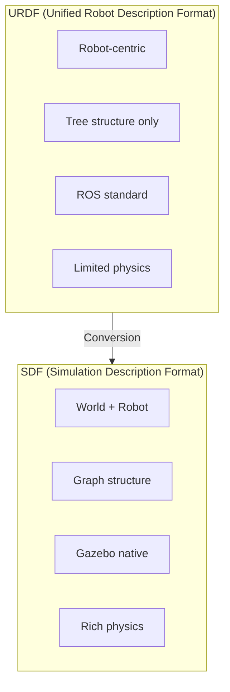
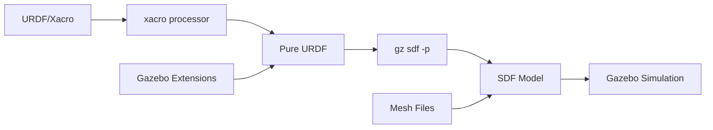
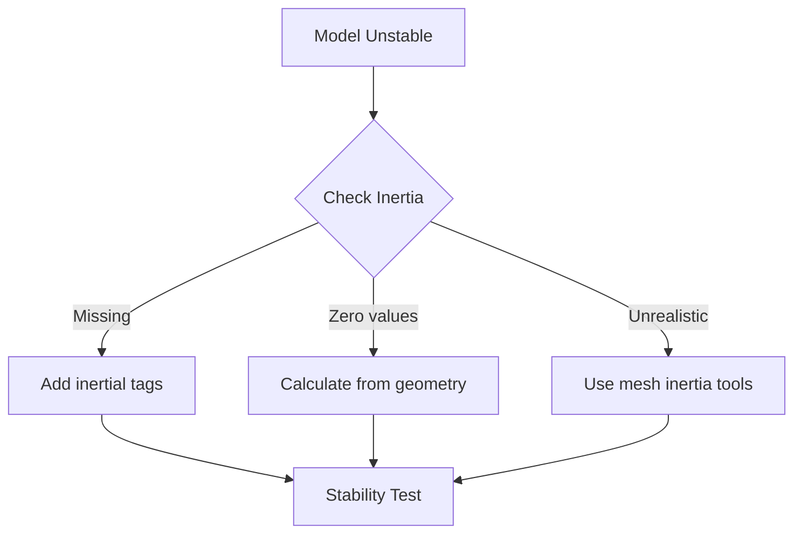

# Importing URDF to Gazebo

## Learning Objectives

By the end of this chapter, you will be able to:

- Understand the differences between URDF and SDF formats
- Convert URDF models to Gazebo-compatible SDF
- Add Gazebo-specific extensions to URDF files
- Configure collision and visual properties for simulation
- Debug common import issues

## URDF vs SDF: Understanding the Formats

### Format Comparison



### Detailed Comparison

| Feature | URDF | SDF |
|---------|------|-----|
| **Scope** | Robot only | World + models |
| **Structure** | Tree (single root) | Graph (loops allowed) |
| **Joints** | Basic types | Extended types + closed loops |
| **Physics** | Limited | Comprehensive |
| **Sensors** | Via extensions | Native support |
| **Plugins** | Via Gazebo tags | Native support |
| **Materials** | Basic | PBR materials |

## The Conversion Pipeline



### Step 1: Process Xacro Files

Most robot models use Xacro for parameterization:

```bash
# Convert Xacro to URDF
xacro humanoid_robot.urdf.xacro > humanoid_robot.urdf

# With parameters
xacro humanoid_robot.urdf.xacro \
  use_sim:=true \
  sensors:=full \
  > humanoid_robot.urdf
```

### Step 2: Add Gazebo Extensions

```xml
<?xml version="1.0"?>
<robot name="humanoid_robot" xmlns:xacro="http://www.ros.org/wiki/xacro">

  <!-- Include base URDF -->
  <xacro:include filename="$(find humanoid_description)/urdf/robot_base.urdf.xacro"/>

  <!-- Gazebo-specific extensions -->
  <gazebo>
    <!-- Self-collision settings -->
    <self_collide>true</self_collide>

    <!-- Global physics properties -->
    <static>false</static>
  </gazebo>

  <!-- Link-specific Gazebo properties -->
  <gazebo reference="torso_link">
    <mu1>0.8</mu1>
    <mu2>0.8</mu2>
    <kp>1e6</kp>
    <kd>1e2</kd>
    <material>Gazebo/Grey</material>
  </gazebo>

  <!-- Foot with ground contact properties -->
  <gazebo reference="left_foot_link">
    <mu1>1.0</mu1>
    <mu2>1.0</mu2>
    <kp>1e8</kp>
    <kd>1e4</kd>
    <minDepth>0.001</minDepth>
    <maxContacts>10</maxContacts>
    <material>Gazebo/Black</material>

    <collision>
      <surface>
        <friction>
          <ode>
            <mu>1.0</mu>
            <mu2>1.0</mu2>
            <fdir1>1 0 0</fdir1>
          </ode>
          <torsional>
            <coefficient>0.1</coefficient>
            <surface_radius>0.05</surface_radius>
          </torsional>
        </friction>
        <contact>
          <ode>
            <kp>1e8</kp>
            <kd>1e4</kd>
            <max_vel>0.01</max_vel>
            <min_depth>0.001</min_depth>
          </ode>
        </contact>
      </surface>
    </collision>
  </gazebo>

  <!-- Joint-specific properties -->
  <gazebo reference="left_hip_pitch_joint">
    <implicitSpringDamper>true</implicitSpringDamper>
    <provideFeedback>true</provideFeedback>
  </gazebo>

</robot>
```

### Step 3: Convert to SDF

```bash
# Convert URDF to SDF
gz sdf -p humanoid_robot.urdf > humanoid_robot.sdf

# Validate the SDF
gz sdf -k humanoid_robot.sdf
```

## Complete URDF with Gazebo Extensions

Here is a complete example of a humanoid leg segment with all necessary Gazebo extensions:

```xml
<?xml version="1.0"?>
<robot name="humanoid_leg" xmlns:xacro="http://www.ros.org/wiki/xacro">

  <!-- Properties -->
  <xacro:property name="hip_mass" value="2.5"/>
  <xacro:property name="thigh_mass" value="3.8"/>
  <xacro:property name="shin_mass" value="2.2"/>
  <xacro:property name="foot_mass" value="0.8"/>

  <!-- Materials -->
  <material name="metal_grey">
    <color rgba="0.5 0.5 0.5 1"/>
  </material>

  <material name="rubber_black">
    <color rgba="0.1 0.1 0.1 1"/>
  </material>

  <!-- Hip Link -->
  <link name="left_hip_link">
    <inertial>
      <origin xyz="0 0 0" rpy="0 0 0"/>
      <mass value="${hip_mass}"/>
      <inertia
        ixx="0.01" ixy="0" ixz="0"
        iyy="0.01" iyz="0"
        izz="0.01"/>
    </inertial>

    <visual>
      <origin xyz="0 0 0" rpy="0 0 0"/>
      <geometry>
        <mesh filename="package://humanoid_description/meshes/hip.dae"/>
      </geometry>
      <material name="metal_grey"/>
    </visual>

    <collision>
      <origin xyz="0 0 0" rpy="0 0 0"/>
      <geometry>
        <mesh filename="package://humanoid_description/meshes/hip_collision.stl"/>
      </geometry>
    </collision>
  </link>

  <!-- Hip Gazebo Properties -->
  <gazebo reference="left_hip_link">
    <mu1>0.6</mu1>
    <mu2>0.6</mu2>
    <material>Gazebo/Grey</material>

    <visual>
      <material>
        <ambient>0.5 0.5 0.5 1</ambient>
        <diffuse>0.7 0.7 0.7 1</diffuse>
        <specular>0.3 0.3 0.3 1</specular>
      </material>
    </visual>
  </gazebo>

  <!-- Hip Roll Joint -->
  <joint name="left_hip_roll_joint" type="revolute">
    <parent link="pelvis_link"/>
    <child link="left_hip_link"/>
    <origin xyz="0 0.1 0" rpy="0 0 0"/>
    <axis xyz="1 0 0"/>
    <limit
      lower="${-pi/4}"
      upper="${pi/4}"
      effort="150"
      velocity="5.0"/>
    <dynamics
      damping="0.5"
      friction="0.1"/>
  </joint>

  <!-- Hip Roll Joint Gazebo Properties -->
  <gazebo reference="left_hip_roll_joint">
    <implicitSpringDamper>true</implicitSpringDamper>
    <provideFeedback>true</provideFeedback>
    <stopCfm>0.0</stopCfm>
    <stopErp>0.2</stopErp>
  </gazebo>

  <!-- Thigh Link -->
  <link name="left_thigh_link">
    <inertial>
      <origin xyz="0 0 -0.15" rpy="0 0 0"/>
      <mass value="${thigh_mass}"/>
      <inertia
        ixx="0.05" ixy="0" ixz="0"
        iyy="0.05" iyz="0"
        izz="0.01"/>
    </inertial>

    <visual>
      <origin xyz="0 0 -0.15" rpy="0 0 0"/>
      <geometry>
        <cylinder radius="0.04" length="0.3"/>
      </geometry>
      <material name="metal_grey"/>
    </visual>

    <collision>
      <origin xyz="0 0 -0.15" rpy="0 0 0"/>
      <geometry>
        <cylinder radius="0.045" length="0.32"/>
      </geometry>
    </collision>
  </link>

  <!-- Hip Pitch Joint -->
  <joint name="left_hip_pitch_joint" type="revolute">
    <parent link="left_hip_link"/>
    <child link="left_thigh_link"/>
    <origin xyz="0 0 0" rpy="0 0 0"/>
    <axis xyz="0 1 0"/>
    <limit
      lower="${-pi/2}"
      upper="${pi/3}"
      effort="200"
      velocity="4.0"/>
    <dynamics
      damping="0.8"
      friction="0.15"/>
  </joint>

  <!-- Knee Joint -->
  <joint name="left_knee_joint" type="revolute">
    <parent link="left_thigh_link"/>
    <child link="left_shin_link"/>
    <origin xyz="0 0 -0.3" rpy="0 0 0"/>
    <axis xyz="0 1 0"/>
    <limit
      lower="0"
      upper="${2*pi/3}"
      effort="180"
      velocity="5.0"/>
    <dynamics
      damping="0.6"
      friction="0.1"/>
  </joint>

  <!-- Shin Link -->
  <link name="left_shin_link">
    <inertial>
      <origin xyz="0 0 -0.15" rpy="0 0 0"/>
      <mass value="${shin_mass}"/>
      <inertia
        ixx="0.03" ixy="0" ixz="0"
        iyy="0.03" iyz="0"
        izz="0.005"/>
    </inertial>

    <visual>
      <origin xyz="0 0 -0.15" rpy="0 0 0"/>
      <geometry>
        <cylinder radius="0.035" length="0.3"/>
      </geometry>
      <material name="metal_grey"/>
    </visual>

    <collision>
      <origin xyz="0 0 -0.15" rpy="0 0 0"/>
      <geometry>
        <cylinder radius="0.04" length="0.32"/>
      </geometry>
    </collision>
  </link>

  <!-- Foot Link with Contact Properties -->
  <link name="left_foot_link">
    <inertial>
      <origin xyz="0.02 0 0" rpy="0 0 0"/>
      <mass value="${foot_mass}"/>
      <inertia
        ixx="0.001" ixy="0" ixz="0"
        iyy="0.002" iyz="0"
        izz="0.002"/>
    </inertial>

    <visual>
      <origin xyz="0.02 0 -0.01" rpy="0 0 0"/>
      <geometry>
        <box size="0.15 0.08 0.02"/>
      </geometry>
      <material name="rubber_black"/>
    </visual>

    <collision>
      <origin xyz="0.02 0 -0.01" rpy="0 0 0"/>
      <geometry>
        <box size="0.15 0.08 0.02"/>
      </geometry>
    </collision>
  </link>

  <!-- Ankle Joint -->
  <joint name="left_ankle_pitch_joint" type="revolute">
    <parent link="left_shin_link"/>
    <child link="left_foot_link"/>
    <origin xyz="0 0 -0.3" rpy="0 0 0"/>
    <axis xyz="0 1 0"/>
    <limit
      lower="${-pi/3}"
      upper="${pi/4}"
      effort="100"
      velocity="6.0"/>
    <dynamics
      damping="0.3"
      friction="0.05"/>
  </joint>

  <!-- Foot Gazebo Properties - Critical for Walking -->
  <gazebo reference="left_foot_link">
    <mu1>1.0</mu1>
    <mu2>1.0</mu2>
    <kp>1e8</kp>
    <kd>1e4</kd>
    <minDepth>0.001</minDepth>
    <maxContacts>10</maxContacts>
    <material>Gazebo/Black</material>

    <sensor name="left_foot_contact" type="contact">
      <contact>
        <collision>left_foot_link_collision</collision>
      </contact>
      <update_rate>100</update_rate>
      <plugin name="left_foot_contact_plugin" filename="libgazebo_ros_bumper.so">
        <ros>
          <namespace>/humanoid</namespace>
          <remapping>bumper_states:=left_foot_contact</remapping>
        </ros>
        <frame_name>left_foot_link</frame_name>
      </plugin>
    </sensor>
  </gazebo>

</robot>
```

## Gazebo ROS Control Integration

For controlling joints in simulation, add ros2_control configuration:

```xml
<!-- ros2_control configuration -->
<ros2_control name="HumanoidSystem" type="system">
  <hardware>
    <plugin>gazebo_ros2_control/GazeboSystem</plugin>
  </hardware>

  <!-- Hip Roll Joint -->
  <joint name="left_hip_roll_joint">
    <command_interface name="effort">
      <param name="min">-150</param>
      <param name="max">150</param>
    </command_interface>
    <state_interface name="position"/>
    <state_interface name="velocity"/>
    <state_interface name="effort"/>
  </joint>

  <!-- Hip Pitch Joint -->
  <joint name="left_hip_pitch_joint">
    <command_interface name="effort">
      <param name="min">-200</param>
      <param name="max">200</param>
    </command_interface>
    <state_interface name="position"/>
    <state_interface name="velocity"/>
    <state_interface name="effort"/>
  </joint>

  <!-- Knee Joint -->
  <joint name="left_knee_joint">
    <command_interface name="effort">
      <param name="min">-180</param>
      <param name="max">180</param>
    </command_interface>
    <state_interface name="position"/>
    <state_interface name="velocity"/>
    <state_interface name="effort"/>
  </joint>

  <!-- Ankle Joint -->
  <joint name="left_ankle_pitch_joint">
    <command_interface name="position">
      <param name="min">-1.047</param>
      <param name="max">0.785</param>
    </command_interface>
    <command_interface name="velocity">
      <param name="min">-6.0</param>
      <param name="max">6.0</param>
    </command_interface>
    <state_interface name="position"/>
    <state_interface name="velocity"/>
  </joint>
</ros2_control>

<!-- Gazebo ros2_control plugin -->
<gazebo>
  <plugin filename="libgazebo_ros2_control.so" name="gazebo_ros2_control">
    <robot_param>robot_description</robot_param>
    <robot_param_node>robot_state_publisher</robot_param_node>
    <parameters>$(find humanoid_control)/config/controllers.yaml</parameters>
  </plugin>
</gazebo>
```

## Spawning the Robot in Gazebo

### Using ROS 2 Launch

```python
"""
Launch file for spawning humanoid robot in Gazebo
"""

from launch import LaunchDescription
from launch.actions import DeclareLaunchArgument, IncludeLaunchDescription
from launch.launch_description_sources import PythonLaunchDescriptionSource
from launch.substitutions import LaunchConfiguration, PathJoinSubstitution
from launch_ros.actions import Node
from launch_ros.substitutions import FindPackageShare
import xacro


def generate_launch_description():
    # Package paths
    pkg_humanoid_description = FindPackageShare('humanoid_description')
    pkg_humanoid_gazebo = FindPackageShare('humanoid_gazebo')
    pkg_gazebo_ros = FindPackageShare('gazebo_ros')

    # Launch arguments
    use_sim_time = LaunchConfiguration('use_sim_time', default='true')
    world_file = LaunchConfiguration('world', default='empty.world')

    # Process URDF with xacro
    xacro_file = PathJoinSubstitution([
        pkg_humanoid_description, 'urdf', 'humanoid_robot.urdf.xacro'
    ])

    robot_description_content = xacro.process_file(
        xacro_file.perform(None),
        mappings={'use_sim': 'true'}
    ).toxml()

    robot_description = {'robot_description': robot_description_content}

    # Gazebo launch
    gazebo = IncludeLaunchDescription(
        PythonLaunchDescriptionSource([
            PathJoinSubstitution([
                pkg_gazebo_ros, 'launch', 'gazebo.launch.py'
            ])
        ]),
        launch_arguments={
            'world': PathJoinSubstitution([
                pkg_humanoid_gazebo, 'worlds', world_file
            ]),
            'verbose': 'true'
        }.items()
    )

    # Robot state publisher
    robot_state_publisher = Node(
        package='robot_state_publisher',
        executable='robot_state_publisher',
        output='screen',
        parameters=[robot_description, {'use_sim_time': use_sim_time}]
    )

    # Spawn robot
    spawn_robot = Node(
        package='gazebo_ros',
        executable='spawn_entity.py',
        arguments=[
            '-topic', 'robot_description',
            '-entity', 'humanoid_robot',
            '-x', '0.0',
            '-y', '0.0',
            '-z', '1.0',  # Spawn above ground
            '-R', '0.0',
            '-P', '0.0',
            '-Y', '0.0'
        ],
        output='screen'
    )

    return LaunchDescription([
        DeclareLaunchArgument(
            'use_sim_time',
            default_value='true',
            description='Use simulation time'
        ),
        DeclareLaunchArgument(
            'world',
            default_value='empty.world',
            description='World file to load'
        ),
        gazebo,
        robot_state_publisher,
        spawn_robot
    ])
```

## Common Conversion Issues and Solutions

### Issue 1: Missing Inertial Properties



**Solution**: Calculate realistic inertias:

```python
"""
Utility to calculate inertia from mesh geometry
"""

import trimesh
import numpy as np


def calculate_inertia_from_mesh(mesh_path: str, mass: float) -> dict:
    """
    Calculate inertia tensor from mesh file.

    Args:
        mesh_path: Path to mesh file (STL, DAE, OBJ)
        mass: Desired mass in kg

    Returns:
        Dictionary with inertia tensor components
    """
    mesh = trimesh.load(mesh_path)

    # Calculate volume and scale mass
    volume = mesh.volume
    density = mass / volume

    # Get inertia tensor (around center of mass)
    mesh.density = density
    inertia = mesh.moment_inertia

    # Extract components
    return {
        'ixx': inertia[0, 0],
        'ixy': inertia[0, 1],
        'ixz': inertia[0, 2],
        'iyy': inertia[1, 1],
        'iyz': inertia[1, 2],
        'izz': inertia[2, 2],
        'com': mesh.center_mass.tolist()
    }


def generate_urdf_inertial(mesh_path: str, mass: float) -> str:
    """Generate URDF inertial block from mesh."""
    inertia = calculate_inertia_from_mesh(mesh_path, mass)

    return f"""
    <inertial>
      <origin xyz="{inertia['com'][0]:.6f} {inertia['com'][1]:.6f} {inertia['com'][2]:.6f}" rpy="0 0 0"/>
      <mass value="{mass}"/>
      <inertia
        ixx="{inertia['ixx']:.6f}" ixy="{inertia['ixy']:.6f}" ixz="{inertia['ixz']:.6f}"
        iyy="{inertia['iyy']:.6f}" iyz="{inertia['iyz']:.6f}"
        izz="{inertia['izz']:.6f}"/>
    </inertial>
    """
```

### Issue 2: Mesh Path Resolution

```xml
<!-- Wrong: Relative path -->
<mesh filename="meshes/hip.stl"/>

<!-- Correct: Package URI -->
<mesh filename="package://humanoid_description/meshes/hip.stl"/>

<!-- For Gazebo: Model URI -->
<mesh filename="model://humanoid_robot/meshes/hip.stl"/>
```

### Issue 3: Collision Mesh Complexity

```python
"""
Simplify collision meshes for better simulation performance
"""

import trimesh


def simplify_collision_mesh(input_path: str, output_path: str,
                           target_faces: int = 500) -> None:
    """
    Simplify mesh for collision detection.

    Args:
        input_path: Path to original mesh
        output_path: Path to save simplified mesh
        target_faces: Target number of faces
    """
    mesh = trimesh.load(input_path)

    # Simplify using quadric decimation
    simplified = mesh.simplify_quadric_decimation(target_faces)

    # Make watertight
    simplified.fill_holes()

    # Export
    simplified.export(output_path)

    print(f"Reduced from {len(mesh.faces)} to {len(simplified.faces)} faces")
```

## Validation Checklist

Before spawning your robot:

- [ ] All links have valid inertial properties
- [ ] Mesh paths use package:// or model:// URIs
- [ ] Collision meshes are simplified versions
- [ ] Joint limits are realistic
- [ ] Friction coefficients are appropriate
- [ ] Contact parameters are configured for feet
- [ ] Gazebo plugins are specified
- [ ] ros2_control hardware interfaces are defined

## Practical Exercises

### Exercise 1: Convert a Simple Robot

Take a basic URDF and add all necessary Gazebo extensions:

1. Add friction to all links
2. Configure joint dynamics
3. Add contact sensors to end effectors
4. Set up ros2_control interfaces

### Exercise 2: Debug a Failing Import

Given this problematic URDF snippet, identify and fix all issues:

```xml
<!-- Find and fix the issues -->
<link name="arm_link">
  <visual>
    <geometry>
      <mesh filename="arm.stl"/>
    </geometry>
  </visual>
  <collision>
    <geometry>
      <mesh filename="arm.stl"/>
    </geometry>
  </collision>
  <!-- Missing inertial! -->
</link>

<joint name="arm_joint" type="revolute">
  <parent link="torso"/>  <!-- Missing _link suffix -->
  <child link="arm_link"/>
  <axis xyz="0 0 1"/>
  <!-- Missing limits! -->
</joint>
```

### Exercise 3: Performance Optimization

Profile and optimize a humanoid robot model:
1. Measure spawn time
2. Simplify collision meshes
3. Reduce polygon count in visuals
4. Compare simulation real-time factor

## Key Takeaways

1. **URDF needs extensions** - Pure URDF lacks simulation-specific properties
2. **Gazebo tags enhance URDF** - Add physics properties without modifying core structure
3. **SDF is more capable** - Direct SDF authoring offers more control
4. **Collision meshes matter** - Simplified collision geometry improves performance
5. **Validation is essential** - Always validate before spawning

## Next Chapter Preview

In the next chapter, we will dive deep into **Physics Simulation Configuration**. You will learn how to tune physics parameters for realistic humanoid robot behavior, configure contact properties for walking, and optimize simulation performance.
