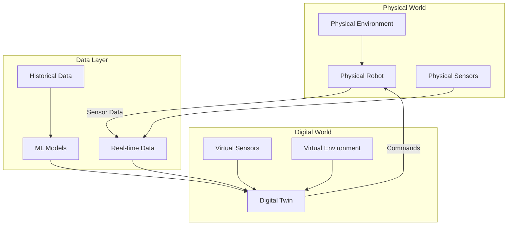
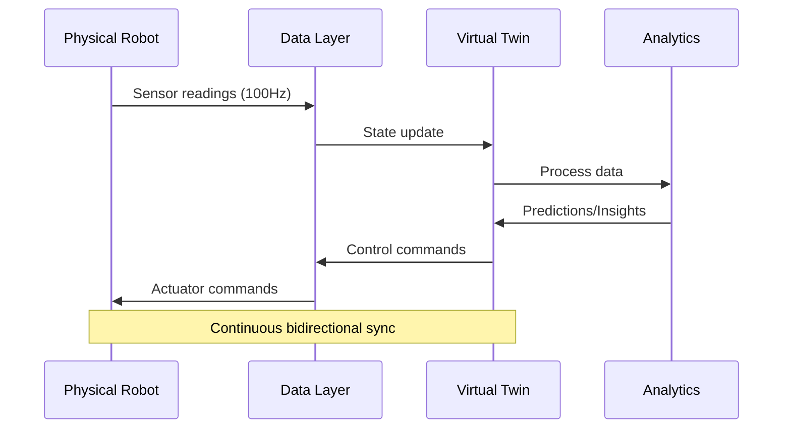
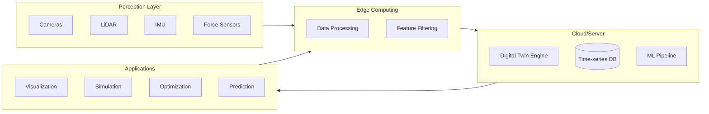
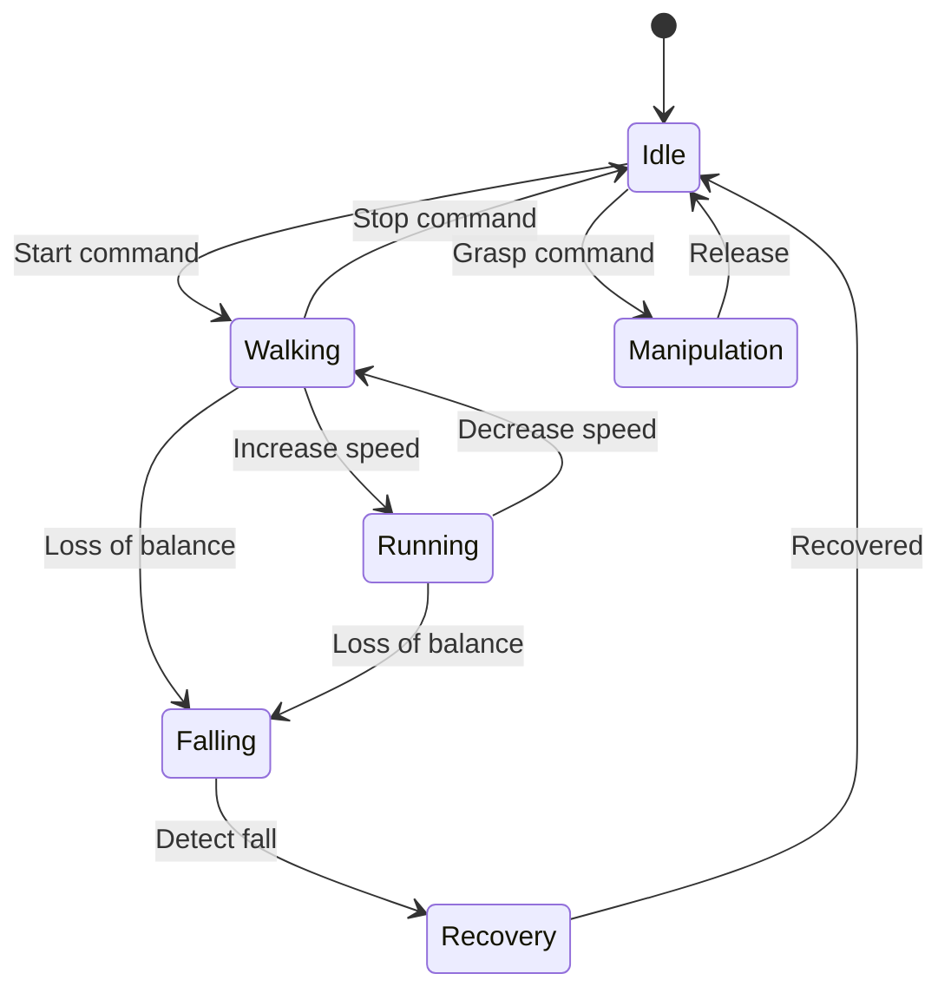

# What is a Digital Twin?

## Learning Objectives

By the end of this chapter, you will be able to:

- Define digital twin technology and its core principles
- Understand the relationship between physical and digital representations
- Identify key components of a digital twin architecture
- Recognize applications of digital twins in humanoid robotics
- Distinguish between simulation, emulation, and digital twins

## Introduction to Digital Twins

A **digital twin** is a virtual representation of a physical object, process, or system that spans its lifecycle. Unlike simple simulations, digital twins maintain a dynamic, bidirectional connection with their physical counterparts, continuously updating to reflect real-world conditions and enabling predictive analysis, optimization, and control.

In the context of humanoid robotics, digital twins serve as the bridge between conceptual design and physical deployment, allowing engineers to test, validate, and optimize robot behavior before and during real-world operation.



## Historical Evolution

The concept of digital twins emerged from NASA's Apollo program, where engineers created physical replicas of spacecraft to mirror conditions in space. The term "digital twin" was formally introduced by Dr. Michael Grieves in 2002 at the University of Michigan.

### Timeline of Digital Twin Evolution

| Era | Development | Application |
|-----|-------------|-------------|
| 1960s | Physical replicas | NASA Apollo missions |
| 2002 | Concept formalization | Product lifecycle management |
| 2010s | IoT integration | Manufacturing, aerospace |
| 2020s | AI-enhanced twins | Robotics, autonomous systems |

## Core Components of a Digital Twin

### 1. Physical Entity

The physical entity is the real-world object being represented. In humanoid robotics, this includes:

- **Mechanical Structure**: Links, joints, actuators
- **Sensors**: IMUs, cameras, force/torque sensors
- **Control Systems**: Embedded controllers, computing units
- **Power Systems**: Batteries, power distribution

### 2. Virtual Entity

The virtual entity is the digital representation that mirrors the physical system:

```python
class DigitalTwinEntity:
    """
    Base class for digital twin virtual entities in robotics.
    """

    def __init__(self, name: str, physical_id: str):
        self.name = name
        self.physical_id = physical_id
        self.state = {}
        self.history = []
        self.models = {}

    def update_state(self, sensor_data: dict) -> None:
        """
        Update virtual state from physical sensor data.

        Args:
            sensor_data: Dictionary containing sensor readings
        """
        timestamp = time.time()
        self.state.update(sensor_data)
        self.history.append({
            'timestamp': timestamp,
            'state': sensor_data.copy()
        })

    def predict_state(self, horizon: float) -> dict:
        """
        Predict future state using internal models.

        Args:
            horizon: Prediction time horizon in seconds

        Returns:
            Predicted state dictionary
        """
        if 'dynamics' in self.models:
            return self.models['dynamics'].predict(
                self.state, horizon
            )
        return self.state.copy()

    def synchronize(self, physical_system) -> None:
        """
        Synchronize digital twin with physical system.
        """
        sensor_data = physical_system.read_sensors()
        self.update_state(sensor_data)
```

### 3. Data Connection

The data connection enables bidirectional communication between physical and virtual entities:



### 4. Services and Analytics

Digital twins provide services including:

- **Monitoring**: Real-time visualization of robot state
- **Prediction**: Forecasting future behavior and failures
- **Optimization**: Improving performance parameters
- **Simulation**: Testing scenarios virtually

## Digital Twin Architecture for Humanoid Robots



## Types of Digital Twins

### Component Twin

Represents individual components of the robot:

```python
class JointTwin:
    """Digital twin of a single robot joint."""

    def __init__(self, joint_name: str, joint_type: str):
        self.name = joint_name
        self.type = joint_type  # 'revolute' or 'prismatic'
        self.position = 0.0
        self.velocity = 0.0
        self.effort = 0.0
        self.temperature = 25.0

        # Performance metrics
        self.backlash = 0.0
        self.friction_model = None
        self.wear_index = 0.0

    def update(self, position: float, velocity: float,
               effort: float, temperature: float) -> None:
        """Update joint state from sensors."""
        self.position = position
        self.velocity = velocity
        self.effort = effort
        self.temperature = temperature

        # Update wear estimation
        self._estimate_wear()

    def _estimate_wear(self) -> None:
        """Estimate joint wear based on operational history."""
        # Simplified wear model
        stress_factor = abs(self.effort) * abs(self.velocity)
        temp_factor = max(0, (self.temperature - 40) / 60)
        self.wear_index += stress_factor * (1 + temp_factor) * 1e-8
```

### System Twin

Represents the complete robot system:

```python
class HumanoidRobotTwin:
    """Complete digital twin of a humanoid robot."""

    def __init__(self, robot_model: str):
        self.model = robot_model
        self.joints = {}
        self.sensors = {}
        self.state = RobotState()

        # Initialize subsystem twins
        self._init_joint_twins()
        self._init_sensor_twins()

    def _init_joint_twins(self) -> None:
        """Initialize digital twins for all joints."""
        joint_config = self._load_joint_config()
        for joint in joint_config:
            self.joints[joint['name']] = JointTwin(
                joint['name'], joint['type']
            )

    def get_system_health(self) -> dict:
        """Calculate overall system health metrics."""
        joint_health = [
            1.0 - j.wear_index for j in self.joints.values()
        ]
        return {
            'overall_health': sum(joint_health) / len(joint_health),
            'critical_joints': [
                name for name, j in self.joints.items()
                if j.wear_index > 0.7
            ],
            'maintenance_due': any(j.wear_index > 0.8
                                   for j in self.joints.values())
        }
```

### Process Twin

Represents operational processes and behaviors:



## Digital Twin vs. Simulation

| Aspect | Simulation | Digital Twin |
|--------|------------|--------------|
| Connection | One-way or none | Bidirectional, real-time |
| Purpose | What-if analysis | Continuous monitoring |
| Data | Synthetic or historical | Live sensor data |
| Lifecycle | Project-based | Continuous |
| Updates | Manual | Automatic synchronization |

## Applications in Humanoid Robotics

### 1. Design and Prototyping

- Virtual testing of joint configurations
- Gait optimization before physical trials
- Component stress analysis

### 2. Training and Skill Transfer

```python
class SkillTransferPipeline:
    """Transfer learned skills from digital twin to physical robot."""

    def __init__(self, digital_twin, physical_robot):
        self.twin = digital_twin
        self.robot = physical_robot
        self.domain_adapter = DomainAdapter()

    def train_in_simulation(self, task: str, episodes: int) -> Policy:
        """Train policy in digital twin environment."""
        policy = ReinforcementLearningPolicy()

        for episode in range(episodes):
            state = self.twin.reset()
            done = False

            while not done:
                action = policy.select_action(state)
                next_state, reward, done = self.twin.step(action)
                policy.update(state, action, reward, next_state)
                state = next_state

        return policy

    def transfer_to_physical(self, policy: Policy) -> Policy:
        """Adapt policy for physical robot deployment."""
        adapted_policy = self.domain_adapter.adapt(
            policy,
            source_dynamics=self.twin.dynamics,
            target_dynamics=self.robot.dynamics
        )
        return adapted_policy
```

### 3. Predictive Maintenance

- Early detection of component degradation
- Optimal maintenance scheduling
- Failure prediction and prevention

### 4. Remote Operation and Monitoring

- Real-time visualization of robot state
- Remote diagnostics and troubleshooting
- Performance analytics dashboard

## Practical Exercise

### Exercise 1: Design a Digital Twin Architecture

Design a digital twin architecture for a humanoid robot that includes:

1. List all sensors that need digital representation
2. Define the data flow between physical and digital layers
3. Identify update frequencies for different data types
4. Specify the storage requirements for historical data

### Exercise 2: Implement a Simple Twin Class

```python
# TODO: Implement a digital twin class for a robot arm
# Requirements:
# - Track joint positions, velocities, and efforts
# - Calculate forward kinematics
# - Estimate joint health based on operational data
# - Provide visualization data

class RobotArmTwin:
    def __init__(self, num_joints: int):
        # Your implementation here
        pass

    def update_from_sensors(self, sensor_data: dict) -> None:
        # Your implementation here
        pass

    def get_end_effector_pose(self) -> tuple:
        # Your implementation here
        pass

    def estimate_health(self) -> dict:
        # Your implementation here
        pass
```

## Key Takeaways

1. **Digital twins are living models** - They continuously evolve with their physical counterparts
2. **Bidirectional data flow** - Information flows both from physical to digital and digital to physical
3. **Multi-layer architecture** - Successful digital twins integrate perception, computation, and application layers
4. **Beyond simulation** - Digital twins provide real-time monitoring, prediction, and control capabilities
5. **Essential for robotics** - Digital twins enable safer development, testing, and deployment of humanoid robots

## Further Reading

- Grieves, M. (2014). "Digital Twin: Manufacturing Excellence through Virtual Factory Replication"
- Tao, F., et al. (2019). "Digital Twin in Industry: State-of-the-Art"
- NVIDIA Isaac Sim Documentation: Digital Twin Concepts

## Next Chapter Preview

In the next chapter, we will explore **Gazebo**, one of the most widely used robotics simulators, which serves as the foundation for creating digital twins of humanoid robots. You will learn about Gazebo's architecture, physics engines, and integration capabilities with ROS 2.
