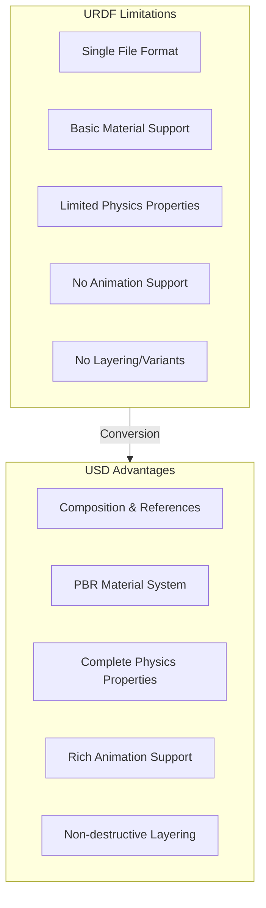
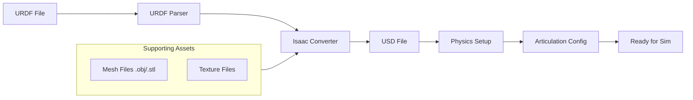
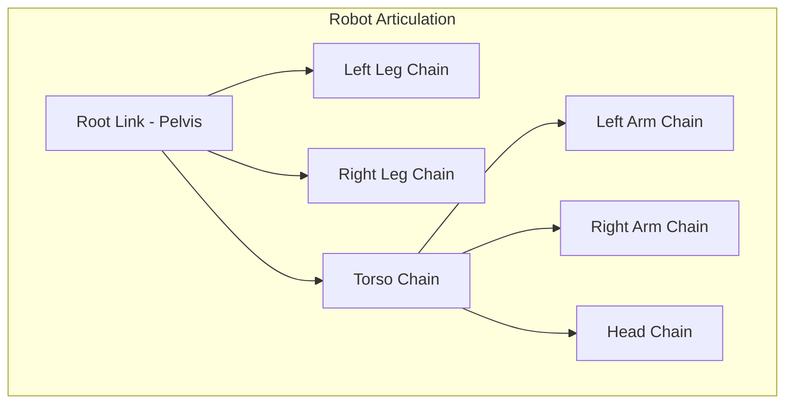

# Chapter 3: Importing Robots - URDF to USD Conversion

:::note Learning Objectives
By the end of this chapter, you will be able to:
- Understand the URDF format and its limitations
- Explain the USD format and its advantages for robotics
- Convert URDF robot descriptions to USD using Isaac Sim tools
- Configure physics properties for imported robots
- Set up articulation controllers for robot joints
:::

## Understanding Robot Description Formats

### URDF: Universal Robot Description Format

**URDF** (Universal Robot Description Format) is the standard format in ROS for describing robots:

```xml
<!-- Example URDF structure -->
<robot name="simple_arm">
    <link name="base_link">
        <visual>
            <geometry>
                <cylinder radius="0.1" length="0.05"/>
            </geometry>
        </visual>
        <collision>
            <geometry>
                <cylinder radius="0.1" length="0.05"/>
            </geometry>
        </collision>
        <inertial>
            <mass value="1.0"/>
            <inertia ixx="0.01" ixy="0" ixz="0" iyy="0.01" iyz="0" izz="0.01"/>
        </inertial>
    </link>

    <joint name="joint1" type="revolute">
        <parent link="base_link"/>
        <child link="link1"/>
        <origin xyz="0 0 0.05"/>
        <axis xyz="0 0 1"/>
        <limit lower="-3.14" upper="3.14" effort="100" velocity="1.0"/>
    </joint>

    <link name="link1">
        <!-- Link definition -->
    </link>
</robot>
```

### URDF Limitations



### USD: Universal Scene Description

**USD** provides a rich scene description with features essential for simulation:

| Feature | URDF | USD |
|---------|------|-----|
| File Structure | Single XML | Multi-file composition |
| Materials | Basic colors | Full PBR materials |
| Physics | Mass, inertia | Complete PhysX properties |
| Variants | Not supported | Multiple configurations |
| Collaboration | Difficult | Built-in support |
| Animation | Not supported | Full keyframe support |

## The URDF to USD Pipeline



## Method 1: GUI-Based Conversion

### Step 1: Open the URDF Importer

1. Launch Isaac Sim
2. Navigate to: `Isaac Utils > Workflows > URDF Importer`
3. The URDF Importer window opens

### Step 2: Configure Import Settings

```yaml
# Recommended import settings
import_settings:
  # File paths
  urdf_path: "/path/to/robot.urdf"
  output_path: "/path/to/output/robot.usd"

  # Physics settings
  make_default_prim: true
  create_physics_scene: true

  # Articulation settings
  default_drive_type: "position"  # Options: position, velocity, none
  default_drive_strength: 1000.0
  default_position_drive_damping: 100.0

  # Mesh settings
  import_inertia_tensor: true
  convex_decomposition: true
  self_collision: false

  # Scale
  distance_scale: 1.0  # Meters
  density: 1000.0  # kg/m^3 for links without mass
```

### Step 3: Execute Conversion

Click "Import" and Isaac Sim will:
1. Parse the URDF file
2. Convert all links and joints
3. Import meshes and create collision shapes
4. Set up physics properties
5. Create articulation structure

## Method 2: Python API Conversion

For automation and batch processing, use the Python API:

```python
# urdf_to_usd_converter.py
"""
Convert URDF files to USD format using Isaac Sim Python API.
"""

from isaacsim import SimulationApp

# Must create simulation app before other imports
simulation_app = SimulationApp({"headless": True})

from omni.isaac.urdf import _urdf
from omni.isaac.core.utils.stage import get_current_stage
from pxr import UsdPhys, PhysxSchema
import os


def convert_urdf_to_usd(
    urdf_path: str,
    output_dir: str,
    robot_name: str = None,
    settings: dict = None
) -> str:
    """
    Convert a URDF file to USD format.

    Args:
        urdf_path: Path to the URDF file
        output_dir: Directory for output USD file
        robot_name: Name for the robot (defaults to URDF filename)
        settings: Optional override settings

    Returns:
        Path to the created USD file
    """
    # Default settings
    default_settings = {
        "merge_fixed_joints": False,
        "convex_decomp": True,
        "fix_base": False,
        "import_inertia_tensor": True,
        "distance_scale": 1.0,
        "density": 1000.0,
        "default_drive_type": _urdf.UrdfJointTargetType.JOINT_DRIVE_POSITION,
        "default_drive_strength": 10000.0,
        "default_position_drive_damping": 1000.0,
        "self_collision": False,
        "create_physics_scene": True,
        "make_default_prim": True,
    }

    # Override with provided settings
    if settings:
        default_settings.update(settings)

    # Create URDF interface
    urdf_interface = _urdf.acquire_urdf_interface()

    # Configure import settings
    import_config = _urdf.ImportConfig()
    import_config.merge_fixed_joints = default_settings["merge_fixed_joints"]
    import_config.convex_decomp = default_settings["convex_decomp"]
    import_config.fix_base = default_settings["fix_base"]
    import_config.import_inertia_tensor = default_settings["import_inertia_tensor"]
    import_config.distance_scale = default_settings["distance_scale"]
    import_config.density = default_settings["density"]
    import_config.default_drive_type = default_settings["default_drive_type"]
    import_config.default_drive_strength = default_settings["default_drive_strength"]
    import_config.default_position_drive_damping = default_settings["default_position_drive_damping"]
    import_config.self_collision = default_settings["self_collision"]
    import_config.create_physics_scene = default_settings["create_physics_scene"]
    import_config.make_default_prim = default_settings["make_default_prim"]

    # Determine robot name
    if robot_name is None:
        robot_name = os.path.splitext(os.path.basename(urdf_path))[0]

    # Output path
    usd_path = os.path.join(output_dir, f"{robot_name}.usd")

    # Parse URDF
    result = urdf_interface.parse_urdf(urdf_path, robot_name, import_config)

    if not result:
        raise RuntimeError(f"Failed to parse URDF: {urdf_path}")

    # Import to USD
    urdf_interface.import_robot(
        urdf_path,
        robot_name,
        import_config,
        usd_path
    )

    print(f"Successfully converted {urdf_path} to {usd_path}")
    return usd_path


def batch_convert(urdf_files: list, output_dir: str):
    """Convert multiple URDF files."""
    results = []
    for urdf_path in urdf_files:
        try:
            usd_path = convert_urdf_to_usd(urdf_path, output_dir)
            results.append({"urdf": urdf_path, "usd": usd_path, "status": "success"})
        except Exception as e:
            results.append({"urdf": urdf_path, "error": str(e), "status": "failed"})
    return results


# Example usage
if __name__ == "__main__":
    # Single conversion
    convert_urdf_to_usd(
        urdf_path="/home/user/robots/humanoid.urdf",
        output_dir="/home/user/isaac_workspace/assets/robots",
        settings={
            "fix_base": False,  # Allow robot to move
            "default_drive_strength": 50000.0,  # Strong joints for humanoid
        }
    )

    simulation_app.close()
```

## Configuring Physics Properties

After conversion, you may need to adjust physics properties for realistic simulation.

### Joint Drive Configuration

```python
# configure_joint_drives.py
"""
Configure joint drives for imported robot.
"""

from isaacsim import SimulationApp
simulation_app = SimulationApp({"headless": True})

from omni.isaac.core import World
from omni.isaac.core.articulations import Articulation
from omni.isaac.core.utils.stage import add_reference_to_stage
from pxr import UsdPhys, PhysxSchema


def configure_humanoid_joints(robot_path: str):
    """Configure joints for a humanoid robot."""

    # Joint configuration for different joint types
    joint_configs = {
        # Hip joints - strong for weight bearing
        "hip_roll": {"stiffness": 100000, "damping": 5000, "max_force": 500},
        "hip_pitch": {"stiffness": 100000, "damping": 5000, "max_force": 500},
        "hip_yaw": {"stiffness": 80000, "damping": 4000, "max_force": 300},

        # Knee joints - very strong
        "knee": {"stiffness": 120000, "damping": 6000, "max_force": 600},

        # Ankle joints - moderate
        "ankle_roll": {"stiffness": 50000, "damping": 2500, "max_force": 200},
        "ankle_pitch": {"stiffness": 60000, "damping": 3000, "max_force": 250},

        # Shoulder joints
        "shoulder_roll": {"stiffness": 40000, "damping": 2000, "max_force": 150},
        "shoulder_pitch": {"stiffness": 40000, "damping": 2000, "max_force": 150},
        "shoulder_yaw": {"stiffness": 30000, "damping": 1500, "max_force": 100},

        # Elbow
        "elbow": {"stiffness": 30000, "damping": 1500, "max_force": 100},

        # Wrist
        "wrist": {"stiffness": 10000, "damping": 500, "max_force": 50},

        # Neck/Head
        "neck": {"stiffness": 10000, "damping": 500, "max_force": 30},
    }

    # Get the stage
    stage = get_current_stage()

    # Find all joints
    for prim in stage.Traverse():
        if prim.IsA(UsdPhys.RevoluteJoint) or prim.IsA(UsdPhys.PrismaticJoint):
            joint_name = prim.GetName().lower()

            # Find matching configuration
            for key, config in joint_configs.items():
                if key in joint_name:
                    # Get drive API
                    drive_api = UsdPhys.DriveAPI.Get(prim, "angular")
                    if drive_api:
                        drive_api.GetStiffnessAttr().Set(config["stiffness"])
                        drive_api.GetDampingAttr().Set(config["damping"])
                        drive_api.GetMaxForceAttr().Set(config["max_force"])
                        print(f"Configured joint: {prim.GetPath()}")
                    break

    return True


# Create world and add robot
world = World()
add_reference_to_stage(
    usd_path="/path/to/humanoid.usd",
    prim_path="/World/Humanoid"
)

configure_humanoid_joints("/World/Humanoid")

# Save stage
stage = get_current_stage()
stage.Export("/path/to/humanoid_configured.usd")

simulation_app.close()
```

### Collision Configuration

```python
# configure_collisions.py
"""
Configure collision properties for robot links.
"""

from pxr import UsdPhys, PhysxSchema


def configure_collision_groups(robot_prim_path: str):
    """
    Set up collision filtering to prevent self-collision
    while allowing ground contact.
    """
    stage = get_current_stage()

    # Create collision groups
    collision_group_path = f"{robot_prim_path}/CollisionGroups"

    # Robot body group - collides with environment, not itself
    body_group = PhysxSchema.PhysxCollisionGroup.Define(
        stage, f"{collision_group_path}/BodyGroup"
    )

    # Feet group - collides with everything
    feet_group = PhysxSchema.PhysxCollisionGroup.Define(
        stage, f"{collision_group_path}/FeetGroup"
    )

    # Hand group - for manipulation
    hand_group = PhysxSchema.PhysxCollisionGroup.Define(
        stage, f"{collision_group_path}/HandGroup"
    )

    # Configure filtering
    # Bodies don't collide with each other
    body_group.CreateFilteredGroupsRel().AddTarget(
        f"{collision_group_path}/BodyGroup"
    )

    return True


def set_link_collision_properties(link_prim, friction=0.8, restitution=0.0):
    """Set physics material properties for a link."""

    # Create physics material
    material_path = f"{link_prim.GetPath()}/PhysicsMaterial"
    material = UsdPhys.MaterialAPI.Apply(link_prim)

    # Set properties
    material.CreateStaticFrictionAttr(friction)
    material.CreateDynamicFrictionAttr(friction * 0.8)
    material.CreateRestitutionAttr(restitution)

    return material
```

## Working with Articulations

An **Articulation** in Isaac Sim represents a connected set of rigid bodies (robot).



### Articulation Controller

```python
# articulation_controller.py
"""
Control robot articulations in Isaac Sim.
"""

from isaacsim import SimulationApp
simulation_app = SimulationApp({"headless": False})

from omni.isaac.core import World
from omni.isaac.core.articulations import Articulation
from omni.isaac.core.utils.stage import add_reference_to_stage
import numpy as np


class HumanoidController:
    """Controller for humanoid robot articulation."""

    def __init__(self, robot_prim_path: str, robot_usd_path: str):
        self.world = World()

        # Add robot to stage
        add_reference_to_stage(
            usd_path=robot_usd_path,
            prim_path=robot_prim_path
        )

        # Create articulation
        self.robot = self.world.scene.add(
            Articulation(
                prim_path=robot_prim_path,
                name="humanoid"
            )
        )

        self.world.reset()

        # Get joint information
        self.num_dof = self.robot.num_dof
        self.joint_names = self.robot.dof_names

        print(f"Robot loaded with {self.num_dof} DOF")
        print(f"Joints: {self.joint_names}")

    def get_joint_positions(self) -> np.ndarray:
        """Get current joint positions."""
        return self.robot.get_joint_positions()

    def get_joint_velocities(self) -> np.ndarray:
        """Get current joint velocities."""
        return self.robot.get_joint_velocities()

    def set_joint_positions(self, positions: np.ndarray):
        """Set target joint positions."""
        self.robot.set_joint_position_targets(positions)

    def set_joint_velocities(self, velocities: np.ndarray):
        """Set target joint velocities."""
        self.robot.set_joint_velocity_targets(velocities)

    def set_joint_efforts(self, efforts: np.ndarray):
        """Set joint efforts (torques)."""
        self.robot.set_joint_efforts(efforts)

    def get_link_pose(self, link_name: str):
        """Get the world pose of a specific link."""
        link = self.robot.get_link(link_name)
        return link.get_world_pose()

    def step(self):
        """Advance simulation by one step."""
        self.world.step(render=True)


# Example usage
def main():
    controller = HumanoidController(
        robot_prim_path="/World/Humanoid",
        robot_usd_path="/path/to/humanoid.usd"
    )

    # Define a simple standing pose
    standing_pose = np.zeros(controller.num_dof)

    # Set initial pose
    controller.set_joint_positions(standing_pose)

    # Run simulation
    for step in range(1000):
        # Get current state
        positions = controller.get_joint_positions()
        velocities = controller.get_joint_velocities()

        # Simple PD control to maintain standing
        target_positions = standing_pose
        position_error = target_positions - positions

        # Compute control effort
        kp = 1000.0
        kd = 100.0
        efforts = kp * position_error - kd * velocities

        controller.set_joint_efforts(efforts)
        controller.step()

        if step % 100 == 0:
            print(f"Step {step}: Max position error = {np.max(np.abs(position_error)):.4f}")

    simulation_app.close()


if __name__ == "__main__":
    main()
```

## Common Robot Models

### Loading Built-in Robot Assets

Isaac Sim includes several robot assets:

```python
# load_builtin_robots.py
"""
Load built-in robot assets from Isaac Sim.
"""

from omni.isaac.core.utils.nucleus import get_assets_root_path


def get_robot_asset_paths():
    """Get paths to built-in robot assets."""
    assets_root = get_assets_root_path()

    robot_paths = {
        # NVIDIA robots
        "carter": f"{assets_root}/Isaac/Robots/Carter/carter_v1.usd",
        "jetbot": f"{assets_root}/Isaac/Robots/Jetbot/jetbot.usd",

        # Manipulators
        "franka": f"{assets_root}/Isaac/Robots/Franka/franka.usd",
        "ur10": f"{assets_root}/Isaac/Robots/UniversalRobots/ur10/ur10.usd",

        # Humanoids
        "humanoid": f"{assets_root}/Isaac/Robots/Humanoid/humanoid.usd",
    }

    return robot_paths


# List available robots
robot_paths = get_robot_asset_paths()
for name, path in robot_paths.items():
    print(f"{name}: {path}")
```

### Importing Community URDF Files

```python
# import_community_robot.py
"""
Import URDF from popular robot packages.
"""

# Example: Import Boston Dynamics Spot (from spot_ros package)
spot_urdf = "/opt/ros/humble/share/spot_description/urdf/spot.urdf"

# Example: Import Unitree Go1
go1_urdf = "/home/user/unitree_ros/go1_description/urdf/go1.urdf"

# Example: Import Digit humanoid
digit_urdf = "/home/user/agility_robotics/digit_description/urdf/digit.urdf"

# Convert each
for urdf_path in [spot_urdf, go1_urdf, digit_urdf]:
    if os.path.exists(urdf_path):
        convert_urdf_to_usd(urdf_path, output_dir)
```

## Validation and Testing

After conversion, validate your robot:

```python
# validate_robot.py
"""
Validate converted robot USD file.
"""

def validate_robot(usd_path: str) -> dict:
    """
    Validate a robot USD file.

    Returns validation results.
    """
    results = {
        "valid": True,
        "warnings": [],
        "errors": []
    }

    # Load stage
    stage = Usd.Stage.Open(usd_path)

    # Check for root prim
    default_prim = stage.GetDefaultPrim()
    if not default_prim:
        results["errors"].append("No default prim set")
        results["valid"] = False

    # Check for articulation
    articulation_found = False
    for prim in stage.Traverse():
        if prim.HasAPI(PhysxSchema.PhysxArticulationRootAPI):
            articulation_found = True
            break

    if not articulation_found:
        results["errors"].append("No articulation root found")
        results["valid"] = False

    # Check for physics scene
    physics_scene_found = False
    for prim in stage.Traverse():
        if prim.IsA(UsdPhys.Scene):
            physics_scene_found = True
            break

    if not physics_scene_found:
        results["warnings"].append("No physics scene - will use default")

    # Check joints have drives
    joints_without_drives = []
    for prim in stage.Traverse():
        if prim.IsA(UsdPhys.RevoluteJoint) or prim.IsA(UsdPhys.PrismaticJoint):
            if not UsdPhys.DriveAPI.Get(prim, "angular"):
                joints_without_drives.append(prim.GetPath())

    if joints_without_drives:
        results["warnings"].append(
            f"Joints without drives: {len(joints_without_drives)}"
        )

    return results


# Run validation
results = validate_robot("/path/to/robot.usd")
print(f"Validation: {'PASSED' if results['valid'] else 'FAILED'}")
for error in results["errors"]:
    print(f"  ERROR: {error}")
for warning in results["warnings"]:
    print(f"  WARNING: {warning}")
```

## Summary

In this chapter, you learned:

- URDF is the standard ROS robot format but has limitations
- USD provides richer features for simulation
- Isaac Sim provides GUI and Python API for URDF conversion
- Physics properties must be configured for realistic behavior
- Articulation controllers enable robot motion control
- Validation ensures correct conversion

:::tip Key Takeaways
1. **Always validate** converted robots before simulation
2. **Tune joint drives** based on robot type (humanoid needs strong leg joints)
3. **Configure collisions** to prevent self-intersection issues
4. **Test motion** with simple controllers before complex algorithms
:::

## Next Steps

With your robot imported into USD format, the next chapter covers photorealistic rendering with PBR materials and lighting.

---

## Review Questions

1. What are three advantages of USD over URDF?
2. What settings should you adjust when importing a humanoid robot?
3. How do joint drives work in Isaac Sim?
4. Why is collision filtering important for humanoid robots?
5. How do you validate a converted robot USD file?

## Exercises

### Exercise 3.1: Convert a URDF
Download a URDF file from a ROS package (e.g., turtlebot3_description) and convert it to USD using both the GUI and Python API methods.

### Exercise 3.2: Configure Joint Drives
Take the converted robot and configure appropriate joint drive stiffness and damping values. Test by setting different target positions.

### Exercise 3.3: Create a Custom Robot
Create a simple 2-DOF arm URDF from scratch, convert it to USD, and write a Python script to move it through a predefined trajectory.
