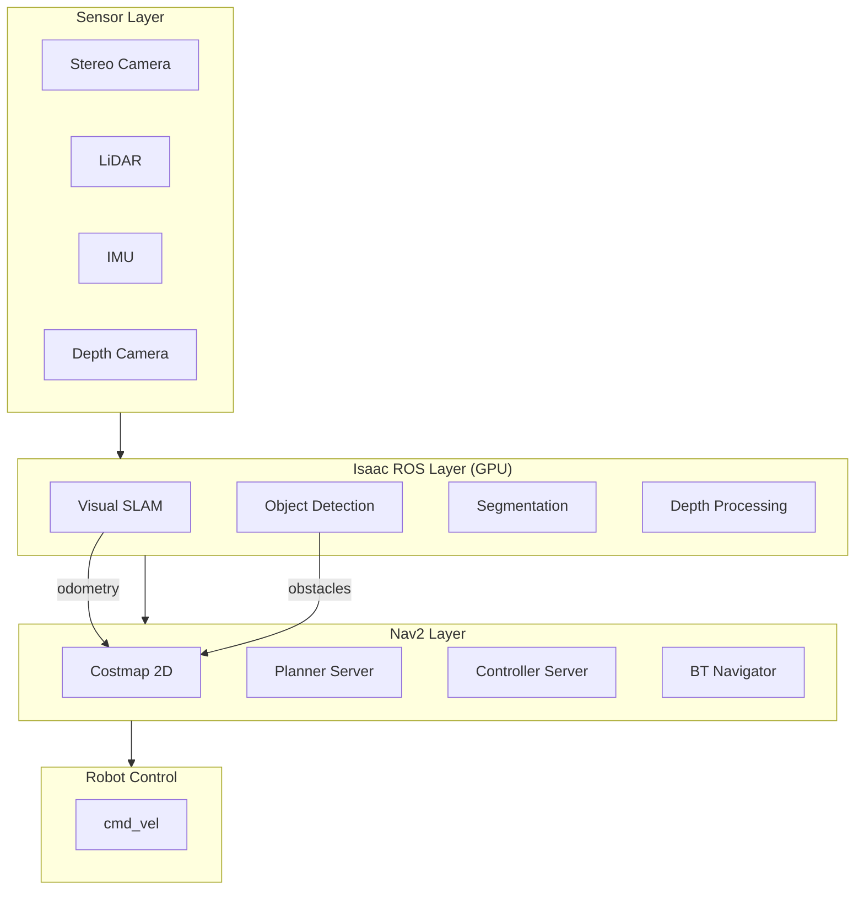

# Chapter 11: Isaac ROS Nav2 Integration

:::note Learning Objectives
By the end of this chapter, you will be able to:
- Integrate Isaac ROS VSLAM with Nav2 for localization
- Use Isaac ROS perception for obstacle avoidance
- Configure NITROS transport for high-performance navigation
- Set up end-to-end navigation in Isaac Sim
- Optimize the integrated stack for real-time performance
:::

## Integration Architecture

Combining Isaac ROS with Nav2 creates a GPU-accelerated navigation system:



## VSLAM as Localization Source

Using Isaac ROS VSLAM instead of AMCL for visual environments:

```yaml
# config/nav2_isaac_ros.yaml

# Disable AMCL, use VSLAM
# Note: Remove amcl from lifecycle manager

bt_navigator:
  ros__parameters:
    use_sim_time: True
    global_frame: map
    robot_base_frame: base_link
    odom_topic: /visual_slam/tracking/odometry  # VSLAM odometry
    transform_tolerance: 0.5

# Costmap uses VSLAM odometry frame
global_costmap:
  global_costmap:
    ros__parameters:
      global_frame: map
      robot_base_frame: base_link
      # VSLAM provides map->odom transform
      transform_tolerance: 0.5

local_costmap:
  local_costmap:
    ros__parameters:
      global_frame: odom
      robot_base_frame: base_link
```

### VSLAM-Nav2 Launch

```python
# launch/isaac_ros_nav2.launch.py
"""
Launch Isaac ROS VSLAM with Nav2 navigation stack.
"""

from launch import LaunchDescription
from launch.actions import (
    DeclareLaunchArgument,
    IncludeLaunchDescription,
    GroupAction,
    TimerAction
)
from launch.substitutions import LaunchConfiguration
from launch.launch_description_sources import PythonLaunchDescriptionSource
from launch_ros.actions import ComposableNodeContainer, Node, SetRemap
from launch_ros.descriptions import ComposableNode
from ament_index_python.packages import get_package_share_directory
import os


def generate_launch_description():
    # Package directories
    isaac_ros_vslam_dir = get_package_share_directory('isaac_ros_visual_slam')
    nav2_bringup_dir = get_package_share_directory('nav2_bringup')
    my_robot_dir = get_package_share_directory('my_robot_navigation')

    # Parameters
    use_sim_time = LaunchConfiguration('use_sim_time', default='true')
    params_file = os.path.join(my_robot_dir, 'config', 'nav2_isaac_ros.yaml')
    map_file = os.path.join(my_robot_dir, 'maps', 'warehouse.yaml')

    # Isaac ROS Visual SLAM
    vslam_node = ComposableNode(
        package='isaac_ros_visual_slam',
        plugin='nvidia::isaac_ros::visual_slam::VisualSlamNode',
        name='visual_slam_node',
        parameters=[{
            'use_sim_time': use_sim_time,
            'enable_imu_fusion': True,
            'enable_localization_n_mapping': True,
            'publish_map_to_odom_tf': True,  # Important for Nav2
            'publish_odom_to_base_tf': True,
            'image_height': 720,
            'image_width': 1280,
            'map_frame': 'map',
            'odom_frame': 'odom',
            'base_frame': 'base_link',
        }],
        remappings=[
            ('stereo_camera/left/image', '/camera/left/image_raw'),
            ('stereo_camera/left/camera_info', '/camera/left/camera_info'),
            ('stereo_camera/right/image', '/camera/right/image_raw'),
            ('stereo_camera/right/camera_info', '/camera/right/camera_info'),
            ('visual_slam/imu', '/imu/data')
        ]
    )

    # Image rectification
    left_rectify = ComposableNode(
        package='isaac_ros_image_proc',
        plugin='nvidia::isaac_ros::image_proc::RectifyNode',
        name='left_rectify',
        parameters=[{'output_width': 1280, 'output_height': 720}],
        remappings=[
            ('image_raw', '/camera/left/image_raw'),
            ('camera_info', '/camera/left/camera_info')
        ]
    )

    right_rectify = ComposableNode(
        package='isaac_ros_image_proc',
        plugin='nvidia::isaac_ros::image_proc::RectifyNode',
        name='right_rectify',
        parameters=[{'output_width': 1280, 'output_height': 720}],
        remappings=[
            ('image_raw', '/camera/right/image_raw'),
            ('camera_info', '/camera/right/camera_info')
        ]
    )

    # NITROS container for Isaac ROS nodes
    isaac_container = ComposableNodeContainer(
        name='isaac_ros_container',
        namespace='',
        package='rclcpp_components',
        executable='component_container_mt',
        composable_node_descriptions=[
            left_rectify,
            right_rectify,
            vslam_node
        ],
        output='screen'
    )

    # Nav2 stack (without AMCL)
    nav2_launch = IncludeLaunchDescription(
        PythonLaunchDescriptionSource([
            nav2_bringup_dir, '/launch/navigation_launch.py'
        ]),
        launch_arguments={
            'use_sim_time': use_sim_time,
            'params_file': params_file,
            'autostart': 'true'
        }.items()
    )

    # Map server (optional - for visualization only with VSLAM)
    map_server = Node(
        package='nav2_map_server',
        executable='map_server',
        name='map_server',
        parameters=[{
            'use_sim_time': use_sim_time,
            'yaml_filename': map_file
        }]
    )

    return LaunchDescription([
        DeclareLaunchArgument('use_sim_time', default_value='true'),
        isaac_container,
        TimerAction(period=5.0, actions=[nav2_launch]),
        map_server
    ])
```

## Perception-Based Obstacle Detection

Integrating Isaac ROS object detection with Nav2 costmaps:

```python
# src/perception_to_costmap.py
"""
Convert Isaac ROS perception output to costmap obstacles.
"""

import rclpy
from rclpy.node import Node
from vision_msgs.msg import Detection3DArray
from sensor_msgs.msg import PointCloud2
from nav2_msgs.msg import Costmap
import numpy as np
import struct


class PerceptionToCostmap(Node):
    """Convert detections to costmap obstacles."""

    def __init__(self):
        super().__init__('perception_to_costmap')

        # Subscribe to 3D detections
        self.detection_sub = self.create_subscription(
            Detection3DArray,
            '/detections_3d',
            self.detection_callback,
            10
        )

        # Publisher for obstacle point cloud
        self.obstacle_pub = self.create_publisher(
            PointCloud2,
            '/perception/obstacles',
            10
        )

        # Parameters
        self.declare_parameter('min_confidence', 0.5)
        self.declare_parameter('obstacle_classes', ['person', 'chair', 'table'])
        self.declare_parameter('inflation_radius', 0.3)

        self.min_confidence = self.get_parameter('min_confidence').value
        self.obstacle_classes = self.get_parameter('obstacle_classes').value
        self.inflation_radius = self.get_parameter('inflation_radius').value

    def detection_callback(self, msg: Detection3DArray):
        """Convert detections to obstacle point cloud."""
        obstacle_points = []

        for detection in msg.detections:
            # Check confidence
            if not detection.results:
                continue

            result = detection.results[0]
            if result.hypothesis.score < self.min_confidence:
                continue

            # Check class
            class_id = result.hypothesis.class_id
            if class_id not in self.obstacle_classes:
                continue

            # Get bounding box
            bbox = detection.bbox
            center = bbox.center.position
            size = bbox.size

            # Generate points around the bounding box for costmap
            points = self._generate_obstacle_points(
                center.x, center.y, center.z,
                size.x, size.y, size.z
            )
            obstacle_points.extend(points)

        # Publish as PointCloud2
        if obstacle_points:
            cloud_msg = self._create_pointcloud(obstacle_points, msg.header)
            self.obstacle_pub.publish(cloud_msg)

    def _generate_obstacle_points(self, cx, cy, cz, sx, sy, sz):
        """Generate points representing the obstacle footprint."""
        points = []

        # Sample points on the obstacle boundary
        for dx in np.linspace(-sx/2, sx/2, 5):
            for dy in np.linspace(-sy/2, sy/2, 5):
                points.append([cx + dx, cy + dy, 0.1])  # Ground level

        return points

    def _create_pointcloud(self, points, header):
        """Create PointCloud2 message from points."""
        cloud = PointCloud2()
        cloud.header = header

        cloud.height = 1
        cloud.width = len(points)

        cloud.fields = [
            PointField(name='x', offset=0, datatype=7, count=1),
            PointField(name='y', offset=4, datatype=7, count=1),
            PointField(name='z', offset=8, datatype=7, count=1),
        ]

        cloud.is_bigendian = False
        cloud.point_step = 12
        cloud.row_step = cloud.point_step * cloud.width
        cloud.is_dense = True

        data = []
        for p in points:
            data.extend(struct.pack('fff', p[0], p[1], p[2]))
        cloud.data = bytes(data)

        return cloud


def main():
    rclpy.init()
    node = PerceptionToCostmap()
    rclpy.spin(node)
    node.destroy_node()
    rclpy.shutdown()


if __name__ == '__main__':
    main()
```

### Costmap Configuration for Perception

```yaml
# config/costmap_perception.yaml
local_costmap:
  local_costmap:
    ros__parameters:
      update_frequency: 10.0
      publish_frequency: 5.0
      global_frame: odom
      robot_base_frame: base_link
      rolling_window: true
      width: 5
      height: 5
      resolution: 0.05
      robot_radius: 0.35

      plugins:
        - "obstacle_layer"
        - "perception_layer"
        - "inflation_layer"

      obstacle_layer:
        plugin: "nav2_costmap_2d::ObstacleLayer"
        enabled: True
        observation_sources: scan
        scan:
          topic: /scan
          data_type: "LaserScan"
          clearing: True
          marking: True

      perception_layer:
        plugin: "nav2_costmap_2d::ObstacleLayer"
        enabled: True
        observation_sources: perception_obstacles
        perception_obstacles:
          topic: /perception/obstacles
          data_type: "PointCloud2"
          clearing: False  # Perception doesn't clear
          marking: True
          max_obstacle_height: 2.0
          min_obstacle_height: 0.1

      inflation_layer:
        plugin: "nav2_costmap_2d::InflationLayer"
        cost_scaling_factor: 3.0
        inflation_radius: 0.55
```

## Isaac Sim Integration

### Complete Navigation in Simulation

```python
# isaac_sim_nav2_demo.py
"""
Complete Isaac ROS + Nav2 navigation demonstration in Isaac Sim.
"""

from isaacsim import SimulationApp

config = {
    "headless": False,
    "width": 1920,
    "height": 1080
}
simulation_app = SimulationApp(config)

import omni
from omni.isaac.core import World
from omni.isaac.core.robots import Robot
from omni.isaac.core.utils.stage import add_reference_to_stage
from omni.isaac.core.utils.nucleus import get_assets_root_path
from omni.isaac.sensor import Camera, IMUSensor, RotatingLidarPhysX
import omni.isaac.ros2_bridge as ros2_bridge
import numpy as np


class Nav2SimulationDemo:
    """Demo navigation in Isaac Sim with Isaac ROS and Nav2."""

    def __init__(self):
        self.world = World(stage_units_in_meters=1.0)
        self.setup_scene()
        self.setup_robot()
        self.setup_sensors()
        self.setup_ros_bridge()

    def setup_scene(self):
        """Set up the warehouse environment."""
        assets_root = get_assets_root_path()

        # Add warehouse environment
        add_reference_to_stage(
            usd_path=f"{assets_root}/Isaac/Environments/Simple_Warehouse/warehouse.usd",
            prim_path="/World/Warehouse"
        )

        # Add ground plane
        self.world.scene.add_default_ground_plane()

        # Add obstacles
        self._add_obstacles()

    def _add_obstacles(self):
        """Add dynamic obstacles to the scene."""
        from omni.isaac.core.objects import DynamicCuboid

        obstacle_positions = [
            [3.0, 2.0, 0.5],
            [5.0, -1.0, 0.5],
            [7.0, 3.0, 0.5],
        ]

        for i, pos in enumerate(obstacle_positions):
            self.world.scene.add(
                DynamicCuboid(
                    prim_path=f"/World/Obstacles/Box_{i}",
                    name=f"obstacle_{i}",
                    position=np.array(pos),
                    size=0.5,
                    color=np.array([1.0, 0.0, 0.0])
                )
            )

    def setup_robot(self):
        """Set up the navigation robot."""
        assets_root = get_assets_root_path()

        # Add Carter robot (differential drive)
        add_reference_to_stage(
            usd_path=f"{assets_root}/Isaac/Robots/Carter/carter_v2.usd",
            prim_path="/World/Robot"
        )

        self.robot = self.world.scene.add(
            Robot(
                prim_path="/World/Robot",
                name="carter"
            )
        )

    def setup_sensors(self):
        """Set up robot sensors."""
        # Stereo camera for VSLAM
        self.left_camera = Camera(
            prim_path="/World/Robot/chassis_link/stereo_camera/left_camera",
            frequency=30,
            resolution=(1280, 720)
        )
        self.world.scene.add(self.left_camera)

        self.right_camera = Camera(
            prim_path="/World/Robot/chassis_link/stereo_camera/right_camera",
            frequency=30,
            resolution=(1280, 720)
        )
        self.world.scene.add(self.right_camera)

        # IMU
        self.imu = IMUSensor(
            prim_path="/World/Robot/chassis_link/imu_sensor",
            name="imu",
            frequency=200,
            translation=np.array([0, 0, 0])
        )
        self.world.scene.add(self.imu)

        # LiDAR for costmap
        self.lidar = RotatingLidarPhysX(
            prim_path="/World/Robot/chassis_link/lidar",
            name="lidar",
            rotation_frequency=10.0,
            translation=np.array([0.2, 0, 0.3])
        )
        self.world.scene.add(self.lidar)

    def setup_ros_bridge(self):
        """Configure ROS 2 bridge publishers and subscribers."""
        # Enable ROS 2 bridge extension
        omni.kit.commands.execute(
            "RosBridgeCreateCamera",
            path="/World/Robot/chassis_link/stereo_camera/left_camera",
            camera_info_topic="/camera/left/camera_info",
            rgb_topic="/camera/left/image_raw",
            depth_topic="/camera/left/depth",
            frame_id="left_camera_optical_frame"
        )

        omni.kit.commands.execute(
            "RosBridgeCreateCamera",
            path="/World/Robot/chassis_link/stereo_camera/right_camera",
            camera_info_topic="/camera/right/camera_info",
            rgb_topic="/camera/right/image_raw",
            frame_id="right_camera_optical_frame"
        )

        # IMU publisher
        omni.kit.commands.execute(
            "RosBridgeCreateImuSensor",
            path="/World/Robot/chassis_link/imu_sensor",
            topic="/imu/data",
            frame_id="imu_link"
        )

        # LiDAR publisher
        omni.kit.commands.execute(
            "RosBridgeCreateLidar",
            path="/World/Robot/chassis_link/lidar",
            topic="/scan",
            frame_id="lidar_link"
        )

        # TF publisher
        omni.kit.commands.execute(
            "RosBridgeCreateTF",
            path="/World/Robot",
            publish_robot_tf=True
        )

        # Odometry publisher
        omni.kit.commands.execute(
            "RosBridgeCreateOdometry",
            path="/World/Robot",
            odom_topic="/odom",
            odom_frame="odom",
            base_frame="base_link"
        )

        # Twist subscriber for cmd_vel
        omni.kit.commands.execute(
            "RosBridgeCreateTwist",
            path="/World/Robot",
            topic="/cmd_vel"
        )

    def run(self):
        """Run the simulation."""
        self.world.reset()

        print("=" * 60)
        print("Isaac Sim + Isaac ROS + Nav2 Demo")
        print("=" * 60)
        print("Run the following in separate terminals:")
        print("1. ros2 launch my_robot_navigation isaac_ros_nav2.launch.py")
        print("2. ros2 launch nav2_bringup rviz_launch.py")
        print("3. Use RViz to set navigation goals")
        print("=" * 60)

        while simulation_app.is_running():
            self.world.step(render=True)

        self.world.stop()


# Run demo
if __name__ == "__main__":
    demo = Nav2SimulationDemo()
    demo.run()
    simulation_app.close()
```

## Performance Optimization

### NITROS-Optimized Pipeline

```yaml
# config/nitros_optimized.yaml
# Optimizations for Isaac ROS + Nav2 integration

# Reduce costmap update frequency for GPU perception
local_costmap:
  local_costmap:
    ros__parameters:
      update_frequency: 5.0  # Lower for VSLAM
      publish_frequency: 2.0

# Controller can run faster with GPU perception
controller_server:
  ros__parameters:
    controller_frequency: 30.0  # Higher with NITROS

# VSLAM parameters for real-time
visual_slam_node:
  ros__parameters:
    enable_debug_mode: false
    enable_observations_view: false  # Disable for performance
    enable_landmarks_view: false
    enable_slam_visualization: false
```

### Resource Allocation

```python
# resource_monitor.py
"""
Monitor resource usage of integrated system.
"""

import rclpy
from rclpy.node import Node
import subprocess
import psutil


class ResourceMonitor(Node):
    """Monitor CPU, GPU, and memory usage."""

    def __init__(self):
        super().__init__('resource_monitor')

        self.timer = self.create_timer(5.0, self.report_resources)

    def report_resources(self):
        """Report system resource usage."""
        # CPU usage
        cpu_percent = psutil.cpu_percent(interval=1)

        # Memory usage
        memory = psutil.virtual_memory()
        mem_percent = memory.percent

        # GPU usage (NVIDIA)
        try:
            result = subprocess.run(
                ['nvidia-smi', '--query-gpu=utilization.gpu,memory.used,memory.total',
                 '--format=csv,noheader,nounits'],
                capture_output=True, text=True
            )
            gpu_util, mem_used, mem_total = result.stdout.strip().split(',')
            gpu_info = f"GPU: {gpu_util}%, VRAM: {mem_used}/{mem_total} MB"
        except Exception:
            gpu_info = "GPU: unavailable"

        self.get_logger().info(
            f"Resources - CPU: {cpu_percent}%, RAM: {mem_percent}%, {gpu_info}"
        )


def main():
    rclpy.init()
    monitor = ResourceMonitor()
    rclpy.spin(monitor)
    monitor.destroy_node()
    rclpy.shutdown()


if __name__ == '__main__':
    main()
```

## Summary

In this chapter, you learned:

- How to integrate Isaac ROS VSLAM with Nav2 for localization
- Converting perception output to costmap obstacles
- Setting up complete navigation in Isaac Sim
- Optimizing the integrated stack for performance
- Monitoring system resources

:::tip Key Takeaways
1. **VSLAM replaces AMCL** for visual environments
2. **Perception feeds costmap** for dynamic obstacles
3. **NITROS integration** maintains real-time performance
4. **Isaac Sim testing** before real robot deployment
:::

## Next Steps

The next chapter presents a mini-project to navigate through an obstacle course.

---

## Review Questions

1. How does VSLAM integrate with the Nav2 TF tree?
2. What costmap configuration is needed for perception obstacles?
3. How do you optimize the integrated stack for real-time?
4. What ROS bridges are needed in Isaac Sim for navigation?
5. How do you monitor resource usage of the integrated system?

## Exercises

### Exercise 11.1: VSLAM Navigation
Set up VSLAM-based navigation in Isaac Sim and navigate to three waypoints.

### Exercise 11.2: Perception Integration
Add object detection to the navigation stack and verify dynamic obstacles appear in the costmap.

### Exercise 11.3: Performance Tuning
Measure navigation latency with and without NITROS optimizations. Document the improvements.
