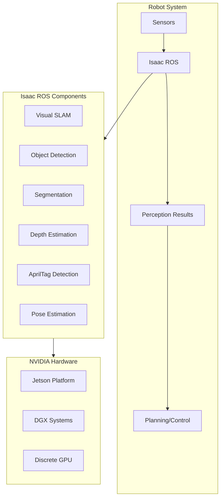
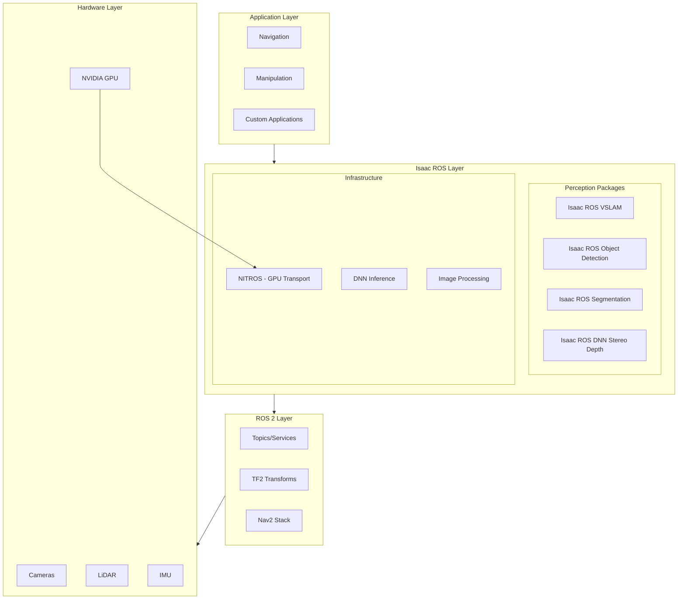
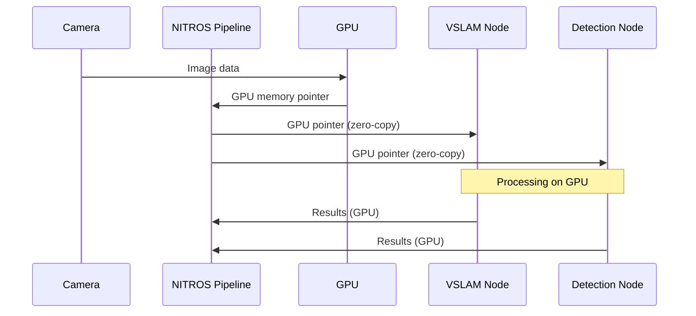
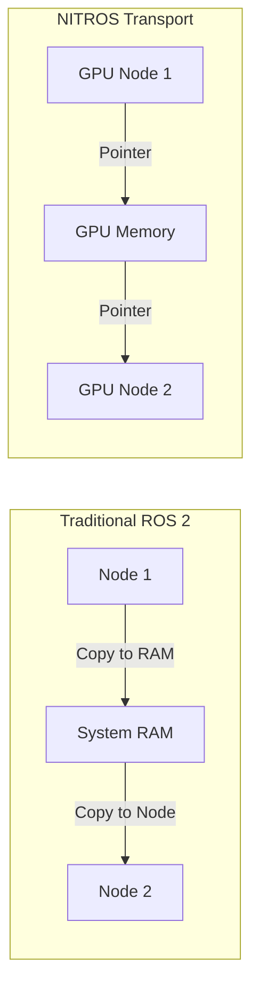
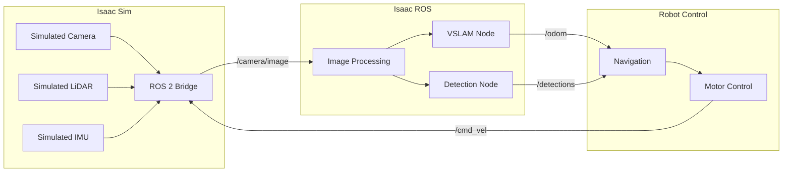

# Chapter 6: Isaac ROS Architecture

:::note Learning Objectives
By the end of this chapter, you will be able to:
- Understand the architecture of Isaac ROS
- Explain the benefits of GPU-accelerated perception
- Set up Isaac ROS packages in your workspace
- Understand the relationship between Isaac Sim, Isaac ROS, and ROS 2
- Configure Isaac ROS for your robot platform
:::

## What is Isaac ROS?

**Isaac ROS** is NVIDIA's collection of GPU-accelerated ROS 2 packages for robot perception. It bridges NVIDIA's AI technologies with the ROS 2 ecosystem.



### Isaac ROS vs. Standard ROS 2

| Aspect | Standard ROS 2 | Isaac ROS |
|--------|----------------|-----------|
| **Processing** | CPU-based | GPU-accelerated |
| **Performance** | Baseline | 10-100x faster |
| **Latency** | Higher | Lower |
| **Power Efficiency** | Lower | Higher |
| **DNN Inference** | External | Integrated (TensorRT) |
| **Hardware** | Any | NVIDIA GPUs |

## Isaac ROS Architecture



## NITROS: GPU-Accelerated Data Transport

**NITROS** (NVIDIA Isaac Transport for ROS) is the key to Isaac ROS performance.

### How NITROS Works



### NITROS vs Traditional Transport



**Performance Benefits:**
- Zero-copy data transfer between GPU nodes
- Reduced CPU overhead
- Lower latency
- Higher throughput

## Isaac ROS Packages Overview

### Core Packages

```yaml
# Isaac ROS Core Packages
isaac_ros_common:
  description: Common utilities and types
  dependencies: [rclcpp, sensor_msgs]

isaac_ros_nitros:
  description: NITROS transport layer
  dependencies: [isaac_ros_common]

isaac_ros_image_pipeline:
  description: GPU-accelerated image processing
  features:
    - Rectification
    - Resize
    - Color conversion
    - Crop
```

### Perception Packages

```yaml
# Isaac ROS Perception Packages
isaac_ros_visual_slam:
  description: GPU-accelerated Visual SLAM
  input: Stereo cameras, IMU
  output: Odometry, map

isaac_ros_object_detection:
  description: DNN-based object detection
  models: [YOLO, SSD, DetectNet]
  output: 2D bounding boxes

isaac_ros_dnn_image_encoder:
  description: Image encoding for DNN inference
  purpose: Preprocess images for neural networks

isaac_ros_apriltag:
  description: GPU-accelerated AprilTag detection
  output: Tag poses, IDs

isaac_ros_depth_segmentation:
  description: Depth-based segmentation
  input: Depth images
  output: Segmentation masks
```

## Setting Up Isaac ROS

### Prerequisites

```bash
# System requirements
- Ubuntu 22.04
- ROS 2 Humble
- NVIDIA GPU (Jetson or discrete)
- CUDA 11.8+
- TensorRT 8.5+

# For Jetson
- JetPack 5.1+
```

### Installation Methods

#### Method 1: Docker (Recommended)

```bash
# Clone Isaac ROS common
mkdir -p ~/workspaces/isaac_ros-dev/src
cd ~/workspaces/isaac_ros-dev/src
git clone https://github.com/NVIDIA-ISAAC-ROS/isaac_ros_common.git

# Run the Docker container
cd ~/workspaces/isaac_ros-dev/src/isaac_ros_common
./scripts/run_dev.sh

# Inside container, build packages
cd /workspaces/isaac_ros-dev
colcon build --symlink-install
source install/setup.bash
```

#### Method 2: Native Installation

```bash
# Add NVIDIA apt repository
sudo apt-key adv --fetch-key https://repo.download.nvidia.com/jetson/jetson-ota-public.asc
echo "deb https://repo.download.nvidia.com/jetson/common r35.2 main" | \
    sudo tee /etc/apt/sources.list.d/nvidia-l4t-apt-source.list

sudo apt update

# Install Isaac ROS packages
sudo apt install ros-humble-isaac-ros-common
sudo apt install ros-humble-isaac-ros-nitros
sudo apt install ros-humble-isaac-ros-visual-slam
sudo apt install ros-humble-isaac-ros-apriltag
```

### Workspace Structure

```
~/workspaces/isaac_ros-dev/
├── src/
│   ├── isaac_ros_common/          # Core utilities
│   ├── isaac_ros_nitros/          # NITROS transport
│   ├── isaac_ros_visual_slam/     # Visual SLAM
│   ├── isaac_ros_object_detection/# Object detection
│   ├── isaac_ros_apriltag/        # AprilTag detection
│   ├── isaac_ros_image_pipeline/  # Image processing
│   └── my_robot_perception/       # Your custom package
├── install/
├── build/
└── log/
```

## Connecting Isaac Sim to Isaac ROS

### Architecture Overview



### ROS 2 Bridge Configuration

```python
# isaac_ros_bridge_config.py
"""
Configure Isaac Sim ROS 2 Bridge for Isaac ROS compatibility.
"""

from isaacsim import SimulationApp
simulation_app = SimulationApp({"headless": False})

import omni.isaac.ros2_bridge as ros2_bridge
from omni.isaac.core import World
from omni.isaac.sensor import Camera, IMUSensor


class IsaacROSBridgeSetup:
    """Configure ROS 2 bridge for Isaac ROS compatibility."""

    def __init__(self):
        self.world = World()

    def setup_camera_publisher(self, camera_prim_path: str, topic_prefix: str = "/camera"):
        """
        Set up camera publisher with NITROS-compatible output.

        Args:
            camera_prim_path: Path to camera in stage
            topic_prefix: ROS topic prefix
        """
        # Camera info publisher
        ros2_bridge.create_camera_info_publisher(
            camera_prim_path,
            f"{topic_prefix}/camera_info",
            frame_id="camera_optical_frame"
        )

        # RGB image publisher
        ros2_bridge.create_image_publisher(
            camera_prim_path,
            f"{topic_prefix}/image_raw",
            frame_id="camera_optical_frame"
        )

        # Depth image publisher (for RGBD cameras)
        ros2_bridge.create_depth_publisher(
            camera_prim_path,
            f"{topic_prefix}/depth/image_raw",
            frame_id="camera_optical_frame"
        )

    def setup_imu_publisher(self, imu_prim_path: str, topic: str = "/imu/data"):
        """Set up IMU publisher."""
        ros2_bridge.create_imu_publisher(
            imu_prim_path,
            topic,
            frame_id="imu_link"
        )

    def setup_lidar_publisher(self, lidar_prim_path: str, topic: str = "/scan"):
        """Set up LiDAR publisher."""
        ros2_bridge.create_laser_scan_publisher(
            lidar_prim_path,
            topic,
            frame_id="lidar_link"
        )

    def setup_tf_publisher(self, robot_prim_path: str):
        """Set up TF tree publisher."""
        ros2_bridge.create_tf_publisher(
            robot_prim_path,
            publish_robot_tf=True
        )

    def setup_joint_state_publisher(self, robot_prim_path: str):
        """Set up joint state publisher."""
        ros2_bridge.create_joint_state_publisher(
            robot_prim_path,
            "/joint_states"
        )

    def setup_velocity_subscriber(self, robot_prim_path: str):
        """Set up velocity command subscriber."""
        ros2_bridge.create_twist_subscriber(
            robot_prim_path,
            "/cmd_vel"
        )


# Example usage
setup = IsaacROSBridgeSetup()
setup.setup_camera_publisher("/World/Robot/Camera", "/robot/camera")
setup.setup_imu_publisher("/World/Robot/IMU", "/robot/imu")
setup.setup_tf_publisher("/World/Robot")
```

## Isaac ROS Launch Files

### Basic Launch Configuration

```python
# launch/isaac_ros_perception.launch.py
"""
Launch file for Isaac ROS perception stack.
"""

from launch import LaunchDescription
from launch.actions import DeclareLaunchArgument, IncludeLaunchDescription
from launch.substitutions import LaunchConfiguration
from launch_ros.actions import Node, ComposableNodeContainer
from launch_ros.descriptions import ComposableNode


def generate_launch_description():
    # Arguments
    camera_topic_arg = DeclareLaunchArgument(
        'camera_topic',
        default_value='/camera/image_raw',
        description='Camera image topic'
    )

    camera_info_arg = DeclareLaunchArgument(
        'camera_info_topic',
        default_value='/camera/camera_info',
        description='Camera info topic'
    )

    # Isaac ROS Image Processing
    image_processing_node = ComposableNode(
        package='isaac_ros_image_proc',
        plugin='nvidia::isaac_ros::image_proc::RectifyNode',
        name='rectify_node',
        parameters=[{
            'output_width': 1280,
            'output_height': 720
        }],
        remappings=[
            ('image_raw', LaunchConfiguration('camera_topic')),
            ('camera_info', LaunchConfiguration('camera_info_topic'))
        ]
    )

    # Isaac ROS AprilTag Detection
    apriltag_node = ComposableNode(
        package='isaac_ros_apriltag',
        plugin='nvidia::isaac_ros::apriltag::AprilTagNode',
        name='apriltag_node',
        parameters=[{
            'size': 0.1,  # Tag size in meters
            'max_tags': 10
        }]
    )

    # Container for NITROS nodes
    perception_container = ComposableNodeContainer(
        name='perception_container',
        namespace='',
        package='rclcpp_components',
        executable='component_container_mt',
        composable_node_descriptions=[
            image_processing_node,
            apriltag_node
        ],
        output='screen'
    )

    return LaunchDescription([
        camera_topic_arg,
        camera_info_arg,
        perception_container
    ])
```

### Complete Perception Pipeline Launch

```python
# launch/full_perception_pipeline.launch.py
"""
Complete Isaac ROS perception pipeline for humanoid robots.
"""

from launch import LaunchDescription
from launch_ros.actions import ComposableNodeContainer
from launch_ros.descriptions import ComposableNode


def generate_launch_description():
    # NITROS-enabled perception pipeline
    perception_container = ComposableNodeContainer(
        name='humanoid_perception_container',
        namespace='humanoid',
        package='rclcpp_components',
        executable='component_container_mt',
        composable_node_descriptions=[
            # Image rectification
            ComposableNode(
                package='isaac_ros_image_proc',
                plugin='nvidia::isaac_ros::image_proc::RectifyNode',
                name='left_rectify',
                remappings=[
                    ('image_raw', '/stereo/left/image_raw'),
                    ('camera_info', '/stereo/left/camera_info'),
                    ('image_rect', '/stereo/left/image_rect')
                ]
            ),
            ComposableNode(
                package='isaac_ros_image_proc',
                plugin='nvidia::isaac_ros::image_proc::RectifyNode',
                name='right_rectify',
                remappings=[
                    ('image_raw', '/stereo/right/image_raw'),
                    ('camera_info', '/stereo/right/camera_info'),
                    ('image_rect', '/stereo/right/image_rect')
                ]
            ),

            # Stereo disparity
            ComposableNode(
                package='isaac_ros_stereo_image_proc',
                plugin='nvidia::isaac_ros::stereo_image_proc::DisparityNode',
                name='disparity_node',
                parameters=[{
                    'max_disparity': 128.0
                }]
            ),

            # Visual SLAM
            ComposableNode(
                package='isaac_ros_visual_slam',
                plugin='nvidia::isaac_ros::visual_slam::VisualSlamNode',
                name='visual_slam_node',
                parameters=[{
                    'enable_imu_fusion': True,
                    'enable_localization_n_mapping': True
                }],
                remappings=[
                    ('stereo_camera/left/image', '/stereo/left/image_rect'),
                    ('stereo_camera/right/image', '/stereo/right/image_rect'),
                    ('visual_slam/imu', '/imu/data')
                ]
            ),

            # Object Detection
            ComposableNode(
                package='isaac_ros_dnn_inference',
                plugin='nvidia::isaac_ros::dnn_inference::TensorRTNode',
                name='object_detection_node',
                parameters=[{
                    'model_file_path': '/models/yolov8.engine',
                    'engine_file_path': '/models/yolov8.engine',
                    'input_tensor_names': ['images'],
                    'output_tensor_names': ['output0'],
                    'input_binding_names': ['images'],
                    'output_binding_names': ['output0']
                }]
            )
        ],
        output='screen'
    )

    return LaunchDescription([
        perception_container
    ])
```

## Performance Monitoring

```python
# monitor_isaac_ros.py
"""
Monitor Isaac ROS performance metrics.
"""

import rclpy
from rclpy.node import Node
from diagnostic_msgs.msg import DiagnosticArray


class IsaacROSMonitor(Node):
    """Monitor Isaac ROS node performance."""

    def __init__(self):
        super().__init__('isaac_ros_monitor')

        # Subscribe to diagnostics
        self.diag_sub = self.create_subscription(
            DiagnosticArray,
            '/diagnostics',
            self.diagnostics_callback,
            10
        )

        # Performance metrics storage
        self.metrics = {}

    def diagnostics_callback(self, msg):
        """Process diagnostic messages."""
        for status in msg.status:
            node_name = status.name

            # Extract key-value pairs
            metrics = {}
            for kv in status.values:
                metrics[kv.key] = kv.value

            self.metrics[node_name] = {
                'level': status.level,
                'message': status.message,
                'metrics': metrics
            }

            # Log interesting metrics
            if 'fps' in metrics:
                self.get_logger().info(
                    f"{node_name}: {metrics['fps']} FPS"
                )

            if 'latency_ms' in metrics:
                self.get_logger().info(
                    f"{node_name}: {metrics['latency_ms']} ms latency"
                )


def main():
    rclpy.init()
    monitor = IsaacROSMonitor()
    rclpy.spin(monitor)
    rclpy.shutdown()


if __name__ == '__main__':
    main()
```

## Summary

In this chapter, you learned:

- Isaac ROS provides GPU-accelerated perception for ROS 2
- NITROS enables zero-copy GPU data transport
- Multiple perception packages are available (VSLAM, detection, etc.)
- Isaac Sim integrates with Isaac ROS via the ROS 2 bridge
- Launch files orchestrate the perception pipeline

:::tip Key Takeaways
1. **GPU acceleration** - 10-100x performance improvement over CPU
2. **NITROS transport** - zero-copy data transfer between nodes
3. **Composable nodes** - efficient multi-node pipelines
4. **Isaac Sim integration** - test Isaac ROS in simulation
:::

## Next Steps

The next chapter covers Isaac ROS Visual SLAM for robot localization and mapping.

---

## Review Questions

1. What is NITROS and why is it important for performance?
2. How does Isaac ROS differ from standard ROS 2 packages?
3. What are the two main installation methods for Isaac ROS?
4. How do you connect Isaac Sim sensors to Isaac ROS nodes?
5. What is the purpose of ComposableNodeContainer in launch files?

## Exercises

### Exercise 6.1: Isaac ROS Installation
Install Isaac ROS using the Docker method and verify the installation by running a test node.

### Exercise 6.2: Bridge Configuration
Create an Isaac Sim scene with a robot and configure the ROS 2 bridge to publish camera images compatible with Isaac ROS.

### Exercise 6.3: Launch File Creation
Write a launch file that starts image rectification and AprilTag detection nodes for a stereo camera setup.
