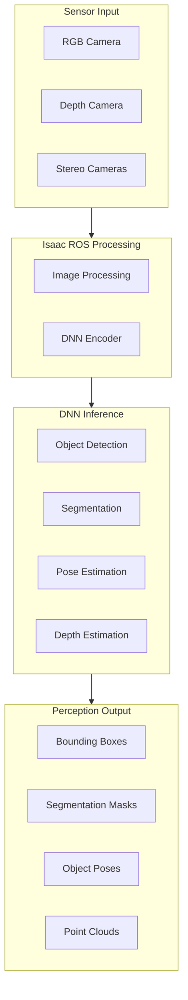
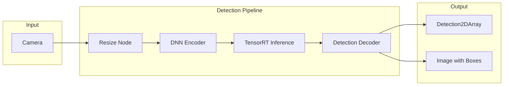
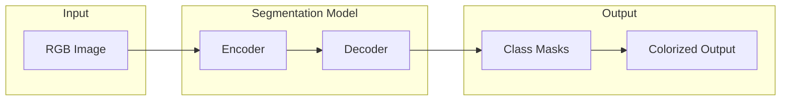

# Chapter 8: Isaac ROS Perception Nodes

:::note Learning Objectives
By the end of this chapter, you will be able to:
- Configure Isaac ROS object detection with various models
- Implement semantic and instance segmentation
- Set up pose estimation for manipulation
- Integrate multiple perception modalities
- Optimize perception pipelines for real-time performance
:::

## Isaac ROS Perception Stack

The perception stack provides GPU-accelerated inference for various computer vision tasks:



## Object Detection with Isaac ROS

### Supported Detection Models

```yaml
# Supported object detection models
models:
  detectnet_v2:
    framework: TensorRT
    input_size: 640x480
    classes: configurable
    speed: very_fast

  yolov8:
    framework: TensorRT
    input_size: 640x640
    classes: 80 (COCO)
    speed: fast

  ssd_mobilenet:
    framework: TensorRT
    input_size: 300x300
    classes: 90 (COCO)
    speed: very_fast

  dope:
    framework: TensorRT
    input_size: 640x480
    output: 6-DoF pose
    speed: medium
```

### Object Detection Pipeline



### Detection Configuration

```python
# launch/object_detection.launch.py
"""
Launch Isaac ROS object detection pipeline.
"""

from launch import LaunchDescription
from launch.actions import DeclareLaunchArgument
from launch.substitutions import LaunchConfiguration
from launch_ros.actions import ComposableNodeContainer
from launch_ros.descriptions import ComposableNode


def generate_launch_description():
    # Model path argument
    model_arg = DeclareLaunchArgument(
        'model_file_path',
        default_value='/workspaces/isaac_ros-dev/models/yolov8n.engine',
        description='Path to TensorRT engine file'
    )

    # DNN Image encoder
    dnn_encoder_node = ComposableNode(
        package='isaac_ros_dnn_image_encoder',
        plugin='nvidia::isaac_ros::dnn_inference::DnnImageEncoderNode',
        name='dnn_encoder',
        parameters=[{
            'input_image_width': 1280,
            'input_image_height': 720,
            'network_image_width': 640,
            'network_image_height': 640,
            'image_mean': [0.0, 0.0, 0.0],
            'image_stddev': [1.0, 1.0, 1.0],
            'num_blocks': 40
        }],
        remappings=[
            ('image', '/camera/image_raw'),
            ('encoded_tensor', '/tensor_pub')
        ]
    )

    # TensorRT inference
    tensorrt_node = ComposableNode(
        package='isaac_ros_tensor_rt',
        plugin='nvidia::isaac_ros::dnn_inference::TensorRTNode',
        name='tensor_rt',
        parameters=[{
            'model_file_path': LaunchConfiguration('model_file_path'),
            'engine_file_path': LaunchConfiguration('model_file_path'),
            'input_tensor_names': ['images'],
            'input_binding_names': ['images'],
            'output_tensor_names': ['output0'],
            'output_binding_names': ['output0'],
            'verbose': False,
            'force_engine_update': False
        }]
    )

    # YOLOv8 decoder
    yolo_decoder_node = ComposableNode(
        package='isaac_ros_yolov8',
        plugin='nvidia::isaac_ros::yolov8::YoloV8DecoderNode',
        name='yolo_decoder',
        parameters=[{
            'confidence_threshold': 0.5,
            'nms_threshold': 0.45
        }]
    )

    # Container
    detection_container = ComposableNodeContainer(
        name='detection_container',
        namespace='',
        package='rclcpp_components',
        executable='component_container_mt',
        composable_node_descriptions=[
            dnn_encoder_node,
            tensorrt_node,
            yolo_decoder_node
        ],
        output='screen'
    )

    return LaunchDescription([
        model_arg,
        detection_container
    ])
```

### Detection Subscriber

```python
# detection_subscriber.py
"""
Subscribe to object detection results.
"""

import rclpy
from rclpy.node import Node
from vision_msgs.msg import Detection2DArray
from sensor_msgs.msg import Image
from cv_bridge import CvBridge
import cv2


class DetectionSubscriber(Node):
    """Subscribe to and process object detections."""

    def __init__(self):
        super().__init__('detection_subscriber')

        # Detection subscriber
        self.detection_sub = self.create_subscription(
            Detection2DArray,
            '/detections',
            self.detection_callback,
            10
        )

        # Image subscriber for visualization
        self.image_sub = self.create_subscription(
            Image,
            '/camera/image_raw',
            self.image_callback,
            10
        )

        self.bridge = CvBridge()
        self.latest_image = None
        self.latest_detections = []

        # Class names (COCO dataset)
        self.class_names = [
            'person', 'bicycle', 'car', 'motorcycle', 'airplane', 'bus',
            'train', 'truck', 'boat', 'traffic light', 'fire hydrant',
            # ... (80 classes total)
        ]

    def image_callback(self, msg):
        """Store latest image."""
        self.latest_image = self.bridge.imgmsg_to_cv2(msg, 'bgr8')

    def detection_callback(self, msg):
        """Process detection results."""
        detections = []

        for detection in msg.detections:
            # Get bounding box
            bbox = detection.bbox
            center_x = bbox.center.position.x
            center_y = bbox.center.position.y
            width = bbox.size_x
            height = bbox.size_y

            # Get class and score
            if detection.results:
                result = detection.results[0]
                class_id = int(result.hypothesis.class_id)
                score = result.hypothesis.score

                detections.append({
                    'class_id': class_id,
                    'class_name': self.class_names[class_id] if class_id < len(self.class_names) else 'unknown',
                    'score': score,
                    'bbox': {
                        'x': center_x - width/2,
                        'y': center_y - height/2,
                        'width': width,
                        'height': height
                    }
                })

        self.latest_detections = detections
        self.get_logger().info(f"Detected {len(detections)} objects")

        # Visualize if we have an image
        if self.latest_image is not None:
            self.visualize_detections()

    def visualize_detections(self):
        """Draw detections on image."""
        img = self.latest_image.copy()

        for det in self.latest_detections:
            bbox = det['bbox']
            x, y = int(bbox['x']), int(bbox['y'])
            w, h = int(bbox['width']), int(bbox['height'])

            # Draw box
            cv2.rectangle(img, (x, y), (x+w, y+h), (0, 255, 0), 2)

            # Draw label
            label = f"{det['class_name']}: {det['score']:.2f}"
            cv2.putText(img, label, (x, y-10),
                       cv2.FONT_HERSHEY_SIMPLEX, 0.5, (0, 255, 0), 2)

        cv2.imshow('Detections', img)
        cv2.waitKey(1)


def main():
    rclpy.init()
    node = DetectionSubscriber()
    rclpy.spin(node)
    node.destroy_node()
    rclpy.shutdown()


if __name__ == '__main__':
    main()
```

## Semantic Segmentation

Semantic segmentation assigns a class label to every pixel in the image.



### Segmentation Configuration

```python
# launch/segmentation.launch.py
"""
Launch semantic segmentation pipeline.
"""

from launch import LaunchDescription
from launch_ros.actions import ComposableNodeContainer
from launch_ros.descriptions import ComposableNode


def generate_launch_description():
    # U-Net based segmentation
    segmentation_encoder = ComposableNode(
        package='isaac_ros_dnn_image_encoder',
        plugin='nvidia::isaac_ros::dnn_inference::DnnImageEncoderNode',
        name='segmentation_encoder',
        parameters=[{
            'input_image_width': 1280,
            'input_image_height': 720,
            'network_image_width': 512,
            'network_image_height': 512,
            'image_mean': [0.485, 0.456, 0.406],
            'image_stddev': [0.229, 0.224, 0.225]
        }],
        remappings=[
            ('image', '/camera/image_raw'),
            ('encoded_tensor', '/segmentation/tensor')
        ]
    )

    # TensorRT inference
    segmentation_inference = ComposableNode(
        package='isaac_ros_tensor_rt',
        plugin='nvidia::isaac_ros::dnn_inference::TensorRTNode',
        name='segmentation_tensorrt',
        parameters=[{
            'model_file_path': '/models/segmentation_unet.onnx',
            'engine_file_path': '/models/segmentation_unet.engine',
            'input_tensor_names': ['input'],
            'output_tensor_names': ['output'],
            'input_binding_names': ['input'],
            'output_binding_names': ['output']
        }]
    )

    # Segmentation decoder
    segmentation_decoder = ComposableNode(
        package='isaac_ros_unet',
        plugin='nvidia::isaac_ros::unet::UNetDecoderNode',
        name='unet_decoder',
        parameters=[{
            'color_segmentation_mask_encoding': 'rgb8',
            'mask_width': 512,
            'mask_height': 512,
            'color_palette': [
                0x00, 0x00, 0x00,  # Background - black
                0xFF, 0x00, 0x00,  # Class 1 - red
                0x00, 0xFF, 0x00,  # Class 2 - green
                0x00, 0x00, 0xFF,  # Class 3 - blue
                # Add more colors for classes
            ]
        }]
    )

    container = ComposableNodeContainer(
        name='segmentation_container',
        namespace='',
        package='rclcpp_components',
        executable='component_container_mt',
        composable_node_descriptions=[
            segmentation_encoder,
            segmentation_inference,
            segmentation_decoder
        ],
        output='screen'
    )

    return LaunchDescription([container])
```

## Instance Segmentation

Instance segmentation identifies individual object instances:

```python
# instance_segmentation_node.py
"""
Instance segmentation using Mask R-CNN or similar models.
"""

import rclpy
from rclpy.node import Node
from vision_msgs.msg import Detection2DArray
from sensor_msgs.msg import Image
from cv_bridge import CvBridge
import numpy as np
import cv2


class InstanceSegmentationNode(Node):
    """Process instance segmentation results."""

    def __init__(self):
        super().__init__('instance_segmentation')

        # Subscribe to detections with masks
        self.detection_sub = self.create_subscription(
            Detection2DArray,
            '/instance_segmentation/detections',
            self.detection_callback,
            10
        )

        # Subscribe to mask image
        self.mask_sub = self.create_subscription(
            Image,
            '/instance_segmentation/mask',
            self.mask_callback,
            10
        )

        self.bridge = CvBridge()
        self.instance_masks = {}

    def detection_callback(self, msg):
        """Process instance detections."""
        instances = []

        for i, detection in enumerate(msg.detections):
            instance = {
                'id': i,
                'class_id': detection.results[0].hypothesis.class_id if detection.results else -1,
                'score': detection.results[0].hypothesis.score if detection.results else 0,
                'bbox': {
                    'center_x': detection.bbox.center.position.x,
                    'center_y': detection.bbox.center.position.y,
                    'width': detection.bbox.size_x,
                    'height': detection.bbox.size_y
                }
            }
            instances.append(instance)

        self.get_logger().info(f"Detected {len(instances)} instances")

    def mask_callback(self, msg):
        """Process instance mask image."""
        mask = self.bridge.imgmsg_to_cv2(msg, 'mono8')

        # Find unique instance IDs
        instance_ids = np.unique(mask)

        for inst_id in instance_ids:
            if inst_id == 0:  # Skip background
                continue

            # Extract individual instance mask
            instance_mask = (mask == inst_id).astype(np.uint8) * 255
            self.instance_masks[inst_id] = instance_mask

            # Calculate mask properties
            contours, _ = cv2.findContours(
                instance_mask, cv2.RETR_EXTERNAL, cv2.CHAIN_APPROX_SIMPLE
            )

            if contours:
                area = cv2.contourArea(contours[0])
                self.get_logger().debug(f"Instance {inst_id}: area = {area} pixels")
```

## 6-DoF Pose Estimation

Pose estimation determines the full 3D position and orientation of objects.

### DOPE (Deep Object Pose Estimation)

```python
# launch/dope_pose_estimation.launch.py
"""
Launch DOPE for 6-DoF pose estimation.
"""

from launch import LaunchDescription
from launch_ros.actions import ComposableNodeContainer
from launch_ros.descriptions import ComposableNode


def generate_launch_description():
    # DOPE encoder
    dope_encoder = ComposableNode(
        package='isaac_ros_dnn_image_encoder',
        plugin='nvidia::isaac_ros::dnn_inference::DnnImageEncoderNode',
        name='dope_encoder',
        parameters=[{
            'input_image_width': 1280,
            'input_image_height': 720,
            'network_image_width': 640,
            'network_image_height': 480,
            'image_mean': [0.5, 0.5, 0.5],
            'image_stddev': [0.5, 0.5, 0.5]
        }],
        remappings=[
            ('image', '/camera/image_raw'),
            ('camera_info', '/camera/camera_info')
        ]
    )

    # DOPE inference
    dope_inference = ComposableNode(
        package='isaac_ros_tensor_rt',
        plugin='nvidia::isaac_ros::dnn_inference::TensorRTNode',
        name='dope_tensorrt',
        parameters=[{
            'model_file_path': '/models/dope_cracker_box.onnx',
            'engine_file_path': '/models/dope_cracker_box.engine',
            'input_tensor_names': ['input'],
            'output_tensor_names': ['output'],
            'input_binding_names': ['input'],
            'output_binding_names': ['output']
        }]
    )

    # DOPE decoder
    dope_decoder = ComposableNode(
        package='isaac_ros_dope',
        plugin='nvidia::isaac_ros::dope::DopeDecoderNode',
        name='dope_decoder',
        parameters=[{
            'object_name': 'cracker_box',
            'cube_dimensions': [0.164, 0.213, 0.072],  # Object dimensions in meters
            'camera_matrix': [
                615.0, 0.0, 320.0,
                0.0, 615.0, 240.0,
                0.0, 0.0, 1.0
            ]
        }]
    )

    container = ComposableNodeContainer(
        name='dope_container',
        namespace='',
        package='rclcpp_components',
        executable='component_container_mt',
        composable_node_descriptions=[
            dope_encoder,
            dope_inference,
            dope_decoder
        ],
        output='screen'
    )

    return LaunchDescription([container])
```

### Pose Subscriber

```python
# pose_subscriber.py
"""
Subscribe to 6-DoF pose estimation results.
"""

import rclpy
from rclpy.node import Node
from geometry_msgs.msg import PoseArray, PoseStamped
from vision_msgs.msg import Detection3DArray
import numpy as np
from scipy.spatial.transform import Rotation


class PoseSubscriber(Node):
    """Subscribe to and process pose estimation results."""

    def __init__(self):
        super().__init__('pose_subscriber')

        # Subscribe to pose array
        self.pose_sub = self.create_subscription(
            PoseArray,
            '/dope/pose_array',
            self.pose_callback,
            10
        )

        # Subscribe to 3D detections
        self.detection3d_sub = self.create_subscription(
            Detection3DArray,
            '/dope/detections',
            self.detection3d_callback,
            10
        )

        # Publisher for grasp pose
        self.grasp_pub = self.create_publisher(
            PoseStamped,
            '/grasp_pose',
            10
        )

    def pose_callback(self, msg):
        """Process detected object poses."""
        for i, pose in enumerate(msg.poses):
            position = pose.position
            orientation = pose.orientation

            # Convert quaternion to euler for logging
            quat = [orientation.x, orientation.y, orientation.z, orientation.w]
            euler = Rotation.from_quat(quat).as_euler('xyz', degrees=True)

            self.get_logger().info(
                f"Object {i}: "
                f"pos=({position.x:.3f}, {position.y:.3f}, {position.z:.3f}), "
                f"rot=({euler[0]:.1f}, {euler[1]:.1f}, {euler[2]:.1f}) deg"
            )

            # Compute grasp pose (offset from object pose)
            grasp_pose = self.compute_grasp_pose(pose)
            self.grasp_pub.publish(grasp_pose)

    def detection3d_callback(self, msg):
        """Process 3D detection results."""
        for detection in msg.detections:
            # Get object class
            if detection.results:
                class_id = detection.results[0].hypothesis.class_id
                score = detection.results[0].hypothesis.score
                self.get_logger().info(f"Detected: {class_id} (score: {score:.2f})")

            # Get 3D bounding box
            bbox = detection.bbox
            center = bbox.center.position
            size = bbox.size

            self.get_logger().info(
                f"  Center: ({center.x:.3f}, {center.y:.3f}, {center.z:.3f})"
                f"  Size: ({size.x:.3f}, {size.y:.3f}, {size.z:.3f})"
            )

    def compute_grasp_pose(self, object_pose):
        """Compute grasp pose from object pose."""
        grasp = PoseStamped()
        grasp.header.frame_id = 'camera_optical_frame'
        grasp.header.stamp = self.get_clock().now().to_msg()

        # Offset grasp position (approach from above)
        grasp.pose.position.x = object_pose.position.x
        grasp.pose.position.y = object_pose.position.y
        grasp.pose.position.z = object_pose.position.z + 0.1  # 10cm above

        # Grasp orientation (gripper pointing down)
        grasp.pose.orientation.x = 0.0
        grasp.pose.orientation.y = 0.707  # 90 degree rotation
        grasp.pose.orientation.z = 0.0
        grasp.pose.orientation.w = 0.707

        return grasp


def main():
    rclpy.init()
    node = PoseSubscriber()
    rclpy.spin(node)
    node.destroy_node()
    rclpy.shutdown()


if __name__ == '__main__':
    main()
```

## Integrated Perception Pipeline

### Multi-Modal Perception

```python
# launch/full_perception.launch.py
"""
Complete perception pipeline with detection, segmentation, and pose estimation.
"""

from launch import LaunchDescription
from launch.actions import IncludeLaunchDescription
from launch.launch_description_sources import PythonLaunchDescriptionSource
from launch_ros.actions import Node
from ament_index_python.packages import get_package_share_directory


def generate_launch_description():
    pkg_dir = get_package_share_directory('my_perception_pkg')

    # Object detection
    detection_launch = IncludeLaunchDescription(
        PythonLaunchDescriptionSource([
            pkg_dir, '/launch/object_detection.launch.py'
        ])
    )

    # Semantic segmentation
    segmentation_launch = IncludeLaunchDescription(
        PythonLaunchDescriptionSource([
            pkg_dir, '/launch/segmentation.launch.py'
        ])
    )

    # Pose estimation
    pose_launch = IncludeLaunchDescription(
        PythonLaunchDescriptionSource([
            pkg_dir, '/launch/dope_pose_estimation.launch.py'
        ])
    )

    # Perception fusion node
    fusion_node = Node(
        package='my_perception_pkg',
        executable='perception_fusion',
        name='perception_fusion',
        parameters=[{
            'detection_topic': '/detections',
            'segmentation_topic': '/segmentation/mask',
            'pose_topic': '/dope/pose_array',
            'output_topic': '/fused_perception'
        }]
    )

    return LaunchDescription([
        detection_launch,
        segmentation_launch,
        pose_launch,
        fusion_node
    ])
```

## Summary

In this chapter, you learned:

- Object detection with TensorRT-accelerated models (YOLO, SSD)
- Semantic segmentation for scene understanding
- Instance segmentation for individual object identification
- 6-DoF pose estimation with DOPE
- Integrating multiple perception modalities

:::tip Key Takeaways
1. **TensorRT acceleration** provides real-time inference
2. **NITROS transport** minimizes latency between nodes
3. **Multiple modalities** complement each other
4. **Pose estimation** enables manipulation tasks
:::

## Next Steps

The next chapter introduces Nav2, the ROS 2 navigation stack.

---

## Review Questions

1. What is the difference between semantic and instance segmentation?
2. How does DOPE estimate 6-DoF object poses?
3. What is the role of the DNN encoder node?
4. Why use TensorRT for inference instead of raw ONNX?
5. How can you combine detection with pose estimation?

## Exercises

### Exercise 8.1: Object Detection
Set up YOLOv8 detection in Isaac Sim and detect objects in a simulated tabletop scene.

### Exercise 8.2: Segmentation
Configure semantic segmentation to identify floor, walls, and obstacles for navigation.

### Exercise 8.3: Pose Estimation
Use DOPE to estimate the pose of a YCB object and compute a grasp pose for a robot arm.
