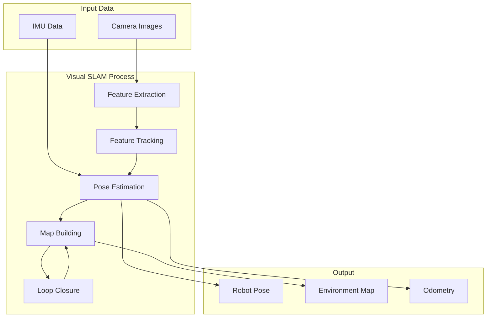

# Chapter 7: Isaac ROS Visual SLAM

:::note Learning Objectives
By the end of this chapter, you will be able to:
- Understand Visual SLAM fundamentals and applications
- Configure Isaac ROS Visual SLAM for stereo cameras
- Integrate IMU data for improved accuracy
- Tune VSLAM parameters for different environments
- Visualize and debug SLAM output in RViz
:::

## What is Visual SLAM?

**Visual SLAM** (Simultaneous Localization and Mapping) uses camera images to:
1. **Localize**: Determine the robot's position and orientation
2. **Map**: Build a representation of the environment



### Why Visual SLAM for Humanoids?

| Challenge | Visual SLAM Solution |
|-----------|---------------------|
| GPS-denied environments | Works indoors/underground |
| Dynamic environments | Adapts to changes |
| No infrastructure needed | Uses onboard cameras |
| Rich scene understanding | Visual features + map |
| Low cost | Cameras are inexpensive |

## Isaac ROS Visual SLAM Overview

**Isaac ROS Visual SLAM** provides GPU-accelerated VSLAM with:

- **cuVSLAM library**: NVIDIA's proprietary SLAM algorithm
- **Stereo camera support**: Depth from stereo matching
- **IMU fusion**: Improved accuracy with inertial data
- **Loop closure**: Corrects drift over time
- **NITROS integration**: High-performance data transport

```mermaid
flowchart LR
    subgraph Sensors["Sensor Input"]
        Left[Left Camera]
        Right[Right Camera]
        IMU[IMU]
    end

    subgraph IsaacVSLAM["Isaac ROS Visual SLAM"]
        Rectify[Rectification]
        cuVSLAM[cuVSLAM Engine]
        TF[TF Publisher]
    end

    subgraph Output["Output"]
        Odom[/visual_slam/tracking/odometry]
        PoseOut[/visual_slam/tracking/vo_pose]
        MapOut[/visual_slam/vis/landmarks_cloud]
    end

    Left --> Rectify
    Right --> Rectify
    IMU --> cuVSLAM
    Rectify --> cuVSLAM
    cuVSLAM --> Odom
    cuVSLAM --> PoseOut
    cuVSLAM --> MapOut
    cuVSLAM --> TF
```

## Hardware Requirements

### Supported Cameras

```yaml
# Recommended stereo cameras for Isaac ROS VSLAM
cameras:
  intel_realsense_d435i:
    type: RGBD + IMU
    baseline: 50mm
    resolution: 1280x720 @ 30fps
    notes: Built-in IMU, good for indoor

  stereolabs_zed2:
    type: Stereo + IMU
    baseline: 120mm
    resolution: 2208x1242 @ 15fps (4K)
    notes: Wide baseline, good for outdoor

  nvidia_hawk:
    type: Stereo + IMU
    baseline: 120mm
    resolution: 1920x1200 @ 60fps
    notes: Designed for Isaac ROS

  custom_stereo:
    type: Stereo
    baseline: configurable
    notes: Any synchronized stereo pair
```

### Platform Requirements

```yaml
# Compute requirements
jetson_orin:
  model: AGX Orin 64GB
  performance: Best
  power: 60W

jetson_orin_nx:
  model: Orin NX 16GB
  performance: Good
  power: 25W

x86_workstation:
  gpu: RTX 3080+
  performance: Excellent
  notes: For development
```

## Setting Up Isaac ROS VSLAM

### Step 1: Installation

```bash
# Using Docker (recommended)
cd ~/workspaces/isaac_ros-dev/src

# Clone Visual SLAM package
git clone https://github.com/NVIDIA-ISAAC-ROS/isaac_ros_visual_slam.git

# Clone dependencies
git clone https://github.com/NVIDIA-ISAAC-ROS/isaac_ros_common.git
git clone https://github.com/NVIDIA-ISAAC-ROS/isaac_ros_nitros.git

# Build
cd ~/workspaces/isaac_ros-dev
colcon build --packages-select isaac_ros_visual_slam
source install/setup.bash
```

### Step 2: Camera Configuration

```yaml
# config/camera_config.yaml
# Configuration for stereo camera setup

camera:
  left:
    topic: /stereo/left/image_raw
    info_topic: /stereo/left/camera_info
    frame_id: left_camera_optical_frame

  right:
    topic: /stereo/right/image_raw
    info_topic: /stereo/right/camera_info
    frame_id: right_camera_optical_frame

  baseline: 0.12  # meters between cameras

imu:
  topic: /imu/data
  frame_id: imu_link
```

### Step 3: VSLAM Parameters

```yaml
# config/vslam_params.yaml
# Isaac ROS Visual SLAM parameters

visual_slam_node:
  ros__parameters:
    # Input configuration
    enable_image_denoising: false
    rectified_images: false  # Set true if pre-rectified

    # Camera parameters
    image_height: 720
    image_width: 1280
    camera_frame_id: "camera"
    base_frame_id: "base_link"
    odom_frame_id: "odom"
    map_frame_id: "map"

    # IMU configuration
    enable_imu_fusion: true
    imu_frame_id: "imu"
    gyro_noise_density: 0.000244
    gyro_random_walk: 0.000019393
    accel_noise_density: 0.001862
    accel_random_walk: 0.003

    # Tracking parameters
    enable_localization_n_mapping: true
    enable_observations_view: true
    enable_landmarks_view: true

    # Performance tuning
    enable_slam_visualization: true
    enable_debug_mode: false

    # Feature detection
    num_grid_rows: 8
    num_grid_cols: 6
    min_num_features: 100
    max_num_features: 500

    # Map management
    map_resolution: 0.05  # meters
    max_map_size: 100000  # points
```

## Launch Configuration

### Basic VSLAM Launch

```python
# launch/vslam_stereo.launch.py
"""
Launch Isaac ROS Visual SLAM with stereo camera input.
"""

from launch import LaunchDescription
from launch.actions import DeclareLaunchArgument
from launch.substitutions import LaunchConfiguration
from launch_ros.actions import ComposableNodeContainer
from launch_ros.descriptions import ComposableNode
import os
from ament_index_python.packages import get_package_share_directory


def generate_launch_description():
    # Get package directory
    pkg_dir = get_package_share_directory('isaac_ros_visual_slam')

    # Declare arguments
    use_sim_time_arg = DeclareLaunchArgument(
        'use_sim_time',
        default_value='false',
        description='Use simulation time'
    )

    # Visual SLAM node
    visual_slam_node = ComposableNode(
        package='isaac_ros_visual_slam',
        plugin='nvidia::isaac_ros::visual_slam::VisualSlamNode',
        name='visual_slam_node',
        parameters=[{
            'use_sim_time': LaunchConfiguration('use_sim_time'),
            'enable_imu_fusion': True,
            'enable_localization_n_mapping': True,
            'enable_observations_view': True,
            'enable_landmarks_view': True,
            'image_height': 720,
            'image_width': 1280,
            'denoise_input_images': False,
            'rectified_images': False,
        }],
        remappings=[
            ('stereo_camera/left/image', '/camera/left/image_raw'),
            ('stereo_camera/left/camera_info', '/camera/left/camera_info'),
            ('stereo_camera/right/image', '/camera/right/image_raw'),
            ('stereo_camera/right/camera_info', '/camera/right/camera_info'),
            ('visual_slam/imu', '/imu/data')
        ]
    )

    # Left camera rectification
    left_rectify_node = ComposableNode(
        package='isaac_ros_image_proc',
        plugin='nvidia::isaac_ros::image_proc::RectifyNode',
        name='left_rectify_node',
        parameters=[{
            'output_width': 1280,
            'output_height': 720
        }],
        remappings=[
            ('image_raw', '/camera/left/image_raw'),
            ('camera_info', '/camera/left/camera_info'),
            ('image_rect', '/camera/left/image_rect'),
            ('camera_info_rect', '/camera/left/camera_info_rect')
        ]
    )

    # Right camera rectification
    right_rectify_node = ComposableNode(
        package='isaac_ros_image_proc',
        plugin='nvidia::isaac_ros::image_proc::RectifyNode',
        name='right_rectify_node',
        parameters=[{
            'output_width': 1280,
            'output_height': 720
        }],
        remappings=[
            ('image_raw', '/camera/right/image_raw'),
            ('camera_info', '/camera/right/camera_info'),
            ('image_rect', '/camera/right/image_rect'),
            ('camera_info_rect', '/camera/right/camera_info_rect')
        ]
    )

    # NITROS container
    vslam_container = ComposableNodeContainer(
        name='vslam_container',
        namespace='',
        package='rclcpp_components',
        executable='component_container_mt',
        composable_node_descriptions=[
            left_rectify_node,
            right_rectify_node,
            visual_slam_node
        ],
        output='screen'
    )

    return LaunchDescription([
        use_sim_time_arg,
        vslam_container
    ])
```

### VSLAM with Isaac Sim

```python
# launch/vslam_isaac_sim.launch.py
"""
Launch VSLAM with Isaac Sim simulation.
"""

from launch import LaunchDescription
from launch.actions import IncludeLaunchDescription, TimerAction
from launch.launch_description_sources import PythonLaunchDescriptionSource
from launch_ros.actions import Node
from ament_index_python.packages import get_package_share_directory
import os


def generate_launch_description():
    # VSLAM launch
    vslam_launch = IncludeLaunchDescription(
        PythonLaunchDescriptionSource([
            get_package_share_directory('isaac_ros_visual_slam'),
            '/launch/isaac_ros_visual_slam.launch.py'
        ]),
        launch_arguments={
            'use_sim_time': 'true'
        }.items()
    )

    # Static transform for camera
    camera_tf = Node(
        package='tf2_ros',
        executable='static_transform_publisher',
        name='camera_base_tf',
        arguments=['0', '0', '0.5', '0', '0', '0', 'base_link', 'camera']
    )

    # RViz for visualization
    rviz_node = Node(
        package='rviz2',
        executable='rviz2',
        name='rviz2',
        arguments=['-d', os.path.join(
            get_package_share_directory('isaac_ros_visual_slam'),
            'rviz', 'vslam.rviz'
        )]
    )

    return LaunchDescription([
        camera_tf,
        TimerAction(period=2.0, actions=[vslam_launch]),
        TimerAction(period=5.0, actions=[rviz_node])
    ])
```

## Working with VSLAM Output

### Subscribing to Odometry

```python
# vslam_subscriber.py
"""
Subscribe to Isaac ROS Visual SLAM output.
"""

import rclpy
from rclpy.node import Node
from nav_msgs.msg import Odometry
from geometry_msgs.msg import PoseStamped
from sensor_msgs.msg import PointCloud2
import numpy as np


class VSLAMSubscriber(Node):
    """Subscribe to VSLAM output topics."""

    def __init__(self):
        super().__init__('vslam_subscriber')

        # Subscribe to odometry
        self.odom_sub = self.create_subscription(
            Odometry,
            '/visual_slam/tracking/odometry',
            self.odometry_callback,
            10
        )

        # Subscribe to pose (alternative format)
        self.pose_sub = self.create_subscription(
            PoseStamped,
            '/visual_slam/tracking/vo_pose',
            self.pose_callback,
            10
        )

        # Subscribe to landmarks (map points)
        self.landmarks_sub = self.create_subscription(
            PointCloud2,
            '/visual_slam/vis/landmarks_cloud',
            self.landmarks_callback,
            10
        )

        # State tracking
        self.current_pose = None
        self.trajectory = []

    def odometry_callback(self, msg: Odometry):
        """Process odometry from VSLAM."""
        position = msg.pose.pose.position
        orientation = msg.pose.pose.orientation

        self.current_pose = {
            'position': [position.x, position.y, position.z],
            'orientation': [orientation.x, orientation.y, orientation.z, orientation.w],
            'timestamp': msg.header.stamp
        }

        # Log position
        self.get_logger().info(
            f"Position: ({position.x:.3f}, {position.y:.3f}, {position.z:.3f})"
        )

        # Track trajectory
        self.trajectory.append(self.current_pose.copy())

    def pose_callback(self, msg: PoseStamped):
        """Process pose stamped messages."""
        pass  # Similar to odometry

    def landmarks_callback(self, msg: PointCloud2):
        """Process landmark point cloud."""
        num_points = msg.width * msg.height
        self.get_logger().info(f"Received {num_points} landmarks")

    def get_trajectory(self):
        """Get the recorded trajectory."""
        return self.trajectory

    def save_trajectory(self, filename: str):
        """Save trajectory to file."""
        import json
        with open(filename, 'w') as f:
            # Convert timestamps to strings for JSON
            trajectory_data = []
            for pose in self.trajectory:
                pose_copy = pose.copy()
                pose_copy['timestamp'] = str(pose_copy['timestamp'])
                trajectory_data.append(pose_copy)
            json.dump(trajectory_data, f, indent=2)


def main():
    rclpy.init()
    subscriber = VSLAMSubscriber()

    try:
        rclpy.spin(subscriber)
    except KeyboardInterrupt:
        # Save trajectory on exit
        subscriber.save_trajectory('vslam_trajectory.json')

    subscriber.destroy_node()
    rclpy.shutdown()


if __name__ == '__main__':
    main()
```

### VSLAM Quality Monitoring

```python
# vslam_monitor.py
"""
Monitor VSLAM tracking quality and performance.
"""

import rclpy
from rclpy.node import Node
from isaac_ros_visual_slam_interfaces.msg import VisualSlamStatus
from nav_msgs.msg import Odometry
import numpy as np


class VSLAMMonitor(Node):
    """Monitor VSLAM performance and quality."""

    def __init__(self):
        super().__init__('vslam_monitor')

        # Subscribe to status
        self.status_sub = self.create_subscription(
            VisualSlamStatus,
            '/visual_slam/status',
            self.status_callback,
            10
        )

        # Subscribe to odometry for velocity analysis
        self.odom_sub = self.create_subscription(
            Odometry,
            '/visual_slam/tracking/odometry',
            self.odometry_callback,
            10
        )

        # Metrics
        self.tracking_quality = []
        self.feature_counts = []
        self.velocities = []

        # Create timer for periodic reporting
        self.report_timer = self.create_timer(5.0, self.report_metrics)

    def status_callback(self, msg):
        """Process VSLAM status messages."""
        # Track quality metrics
        self.tracking_quality.append(msg.tracking_status)
        self.feature_counts.append(msg.num_tracked_features)

        # Alert on tracking loss
        if msg.tracking_status == 0:  # Lost
            self.get_logger().warn("VSLAM tracking lost!")
        elif msg.tracking_status == 1:  # Initializing
            self.get_logger().info("VSLAM initializing...")

    def odometry_callback(self, msg):
        """Analyze velocity from odometry."""
        velocity = msg.twist.twist.linear
        speed = np.sqrt(velocity.x**2 + velocity.y**2 + velocity.z**2)
        self.velocities.append(speed)

    def report_metrics(self):
        """Report aggregated metrics."""
        if len(self.tracking_quality) > 0:
            # Calculate statistics
            avg_features = np.mean(self.feature_counts[-100:]) if self.feature_counts else 0
            tracking_success = sum(1 for t in self.tracking_quality[-100:] if t == 2) / max(len(self.tracking_quality[-100:]), 1)

            self.get_logger().info(
                f"VSLAM Metrics:\n"
                f"  Avg Features: {avg_features:.1f}\n"
                f"  Tracking Success: {tracking_success*100:.1f}%\n"
                f"  Avg Speed: {np.mean(self.velocities[-100:]) if self.velocities else 0:.3f} m/s"
            )


def main():
    rclpy.init()
    monitor = VSLAMMonitor()
    rclpy.spin(monitor)
    monitor.destroy_node()
    rclpy.shutdown()


if __name__ == '__main__':
    main()
```

## RViz Visualization

### VSLAM RViz Configuration

```yaml
# rviz/vslam_config.rviz
Panels:
  - Class: rviz_common/Displays
    Name: Displays
Visualization Manager:
  Displays:
    # TF tree
    - Class: rviz_default_plugins/TF
      Name: TF
      Enabled: true
      Frame Timeout: 15
      Frames:
        All Enabled: true
      Show Axes: true
      Show Names: true

    # Robot model
    - Class: rviz_default_plugins/RobotModel
      Name: RobotModel
      Enabled: true
      Robot Description: robot_description

    # Camera images
    - Class: rviz_default_plugins/Image
      Name: Left Camera
      Topic: /camera/left/image_rect
      Enabled: true

    - Class: rviz_default_plugins/Image
      Name: Right Camera
      Topic: /camera/right/image_rect
      Enabled: true

    # VSLAM landmarks
    - Class: rviz_default_plugins/PointCloud2
      Name: Landmarks
      Topic: /visual_slam/vis/landmarks_cloud
      Enabled: true
      Color: 255; 255; 0
      Size: 0.02

    # VSLAM observations
    - Class: rviz_default_plugins/PointCloud2
      Name: Observations
      Topic: /visual_slam/vis/observations_cloud
      Enabled: true
      Color: 0; 255; 0
      Size: 0.01

    # Odometry path
    - Class: rviz_default_plugins/Odometry
      Name: Odometry
      Topic: /visual_slam/tracking/odometry
      Enabled: true
      Keep: 1000
      Shape: Arrow

  Global Options:
    Fixed Frame: odom
    Frame Rate: 30
```

## Troubleshooting VSLAM

### Common Issues and Solutions

```yaml
# VSLAM Troubleshooting Guide

tracking_lost:
  symptoms:
    - "Tracking status: Lost"
    - Odometry jumps erratically
  causes:
    - Fast motion (blur)
    - Featureless environment
    - Camera occlusion
  solutions:
    - Reduce robot speed
    - Add visual features to environment
    - Check camera lens for obstruction
    - Increase num_features parameter

poor_accuracy:
  symptoms:
    - Drift over time
    - Position errors accumulate
  causes:
    - IMU calibration
    - Camera calibration
    - Time synchronization
  solutions:
    - Recalibrate IMU
    - Recalibrate stereo cameras
    - Enable hardware time sync
    - Enable loop closure

initialization_fails:
  symptoms:
    - Stuck in "Initializing" state
    - Never produces odometry
  causes:
    - Insufficient motion
    - Poor lighting
    - Incorrect camera parameters
  solutions:
    - Move robot slowly in all directions
    - Improve lighting
    - Verify camera_info messages
    - Check baseline parameter
```

## Summary

In this chapter, you learned:

- Visual SLAM uses cameras for simultaneous localization and mapping
- Isaac ROS VSLAM provides GPU-accelerated stereo SLAM
- IMU fusion improves accuracy and robustness
- Proper configuration is essential for good performance
- RViz visualization helps debug SLAM issues

:::tip Key Takeaways
1. **Stereo + IMU** = most robust VSLAM configuration
2. **Feature-rich environments** are easier for VSLAM
3. **Calibration matters** - camera and IMU calibration affect accuracy
4. **Monitor continuously** - track quality metrics in production
:::

## Next Steps

The next chapter covers Isaac ROS perception nodes for object detection and segmentation.

---

## Review Questions

1. What are the two main outputs of Visual SLAM?
2. Why is IMU fusion beneficial for VSLAM?
3. What causes tracking loss in VSLAM?
4. How do you configure stereo camera input for Isaac ROS VSLAM?
5. What topics does Isaac ROS VSLAM publish?

## Exercises

### Exercise 7.1: VSLAM Setup
Configure Isaac ROS VSLAM with a simulated stereo camera in Isaac Sim. Verify odometry is published.

### Exercise 7.2: Parameter Tuning
Test VSLAM in different environments (indoor, outdoor simulation) and tune parameters for optimal tracking.

### Exercise 7.3: Trajectory Recording
Create a node that records the VSLAM trajectory and saves it to a file. Visualize the trajectory in matplotlib.
