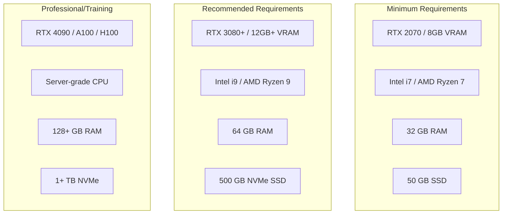
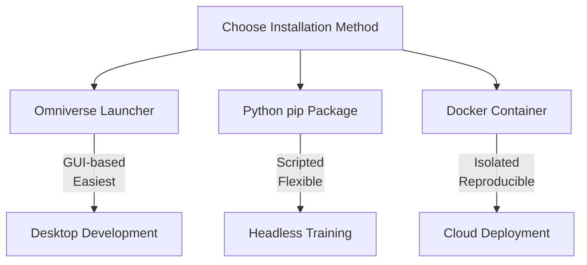

# Chapter 2: Isaac Sim Installation and Setup

:::note Learning Objectives
By the end of this chapter, you will be able to:
- Verify your system meets Isaac Sim hardware requirements
- Install Isaac Sim using different methods (Omniverse Launcher, pip, container)
- Configure Isaac Sim for optimal performance
- Set up the ROS 2 bridge for robot development
- Troubleshoot common installation issues
:::

## System Requirements

Isaac Sim is a demanding application that requires specific hardware and software configurations.

### Hardware Requirements



| Component | Minimum | Recommended | Professional |
|-----------|---------|-------------|--------------|
| **GPU** | RTX 2070 (8GB) | RTX 3080 (12GB) | RTX 4090/A100 |
| **CPU** | 8-core @ 3.5GHz | 12-core @ 4.0GHz | 24+ cores |
| **RAM** | 32 GB | 64 GB | 128+ GB |
| **Storage** | 50 GB SSD | 500 GB NVMe | 1+ TB NVMe |
| **OS** | Ubuntu 22.04 | Ubuntu 22.04 | Ubuntu 22.04 |

### Software Requirements

```bash
# Required software versions
Ubuntu: 22.04 LTS
NVIDIA Driver: 525.60.11 or newer
CUDA: 11.8 or 12.x
Docker: 24.0+ (for container installation)
ROS 2: Humble Hawksbill (for ROS integration)
```

## Installation Methods

Isaac Sim can be installed through three primary methods:



## Method 1: Omniverse Launcher Installation

The **Omniverse Launcher** is the recommended method for beginners and desktop development.

### Step 1: Install NVIDIA Drivers

```bash
# Check current driver version
nvidia-smi

# If driver version < 525, update:
sudo apt update
sudo apt install nvidia-driver-535

# Reboot after driver installation
sudo reboot
```

### Step 2: Download Omniverse Launcher

1. Visit: https://www.nvidia.com/en-us/omniverse/
2. Click "Download for Free"
3. Create an NVIDIA Developer account (free)
4. Download the Linux AppImage

### Step 3: Install Omniverse Launcher

```bash
# Make the AppImage executable
chmod +x omniverse-launcher-linux.AppImage

# Run the launcher
./omniverse-launcher-linux.AppImage
```

### Step 4: Install Isaac Sim through Launcher

1. Open Omniverse Launcher
2. Navigate to "Exchange" tab
3. Search for "Isaac Sim"
4. Click "Install"
5. Select installation path (default: ~/omniverse)
6. Wait for download and installation (~30GB)

### Step 5: Launch Isaac Sim

```bash
# From Omniverse Launcher, click "Launch"
# Or from command line:
~/.local/share/ov/pkg/isaac_sim-2023.1.1/isaac-sim.sh
```

## Method 2: Python pip Installation

For headless development and reinforcement learning, use the pip package.

### Step 1: Create Virtual Environment

```bash
# Install required system packages
sudo apt update
sudo apt install -y python3-pip python3-venv

# Create virtual environment
python3 -m venv ~/isaac_venv
source ~/isaac_venv/bin/activate

# Upgrade pip
pip install --upgrade pip
```

### Step 2: Install Isaac Sim Packages

```bash
# Install Isaac Sim core packages
pip install isaacsim==2023.1.1 \
    isaacsim-extscache-kit==2023.1.1 \
    isaacsim-extscache-physics==2023.1.1 \
    isaacsim-extscache-kit-sdk==2023.1.1

# Install Isaac Lab for reinforcement learning (optional)
pip install isaaclab==1.0.0
```

### Step 3: Verify Installation

```python
# test_isaac_install.py
from isaacsim import SimulationApp

# Launch Isaac Sim in headless mode
simulation_app = SimulationApp({"headless": True})

# Import Isaac modules
from omni.isaac.core import World

# Create a simple world
world = World()
world.reset()

print("Isaac Sim installation successful!")

# Cleanup
simulation_app.close()
```

```bash
# Run the test script
python test_isaac_install.py
```

## Method 3: Docker Container Installation

Docker provides an isolated, reproducible environment.

### Step 1: Install Docker and NVIDIA Container Toolkit

```bash
# Install Docker
curl -fsSL https://get.docker.com -o get-docker.sh
sudo sh get-docker.sh
sudo usermod -aG docker $USER

# Install NVIDIA Container Toolkit
distribution=$(. /etc/os-release; echo $ID$VERSION_ID)
curl -fsSL https://nvidia.github.io/libnvidia-container/gpgkey | \
    sudo gpg --dearmor -o /usr/share/keyrings/nvidia-container-toolkit-keyring.gpg

curl -s -L https://nvidia.github.io/libnvidia-container/$distribution/libnvidia-container.list | \
    sed 's#deb https://#deb [signed-by=/usr/share/keyrings/nvidia-container-toolkit-keyring.gpg] https://#g' | \
    sudo tee /etc/apt/sources.list.d/nvidia-container-toolkit.list

sudo apt update
sudo apt install -y nvidia-container-toolkit
sudo nvidia-ctk runtime configure --runtime=docker
sudo systemctl restart docker

# Log out and back in for group changes
```

### Step 2: Pull Isaac Sim Container

```bash
# Login to NGC (NVIDIA GPU Cloud)
docker login nvcr.io
# Username: $oauthtoken
# Password: <your NGC API key>

# Pull the Isaac Sim container
docker pull nvcr.io/nvidia/isaac-sim:2023.1.1
```

### Step 3: Run Isaac Sim Container

```bash
# Run with GUI support
docker run --name isaac-sim --entrypoint bash -it --gpus all -e "ACCEPT_EULA=Y" \
    --rm --network=host \
    -e "PRIVACY_CONSENT=Y" \
    -v ~/docker/isaac-sim/cache/kit:/isaac-sim/kit/cache:rw \
    -v ~/docker/isaac-sim/cache/ov:/root/.cache/ov:rw \
    -v ~/docker/isaac-sim/cache/pip:/root/.cache/pip:rw \
    -v ~/docker/isaac-sim/cache/glcache:/root/.cache/nvidia/GLCache:rw \
    -v ~/docker/isaac-sim/cache/computecache:/root/.nv/ComputeCache:rw \
    -v ~/docker/isaac-sim/logs:/root/.nvidia-omniverse/logs:rw \
    -v ~/docker/isaac-sim/data:/root/.local/share/ov/data:rw \
    -v ~/docker/isaac-sim/documents:/root/Documents:rw \
    nvcr.io/nvidia/isaac-sim:2023.1.1

# Inside container, launch Isaac Sim
./runheadless.native.sh
```

## Configuring Isaac Sim

### Performance Configuration

Create a configuration file to optimize performance:

```yaml
# ~/.nvidia-omniverse/config/isaac_sim_settings.yaml

rendering:
  renderer: "rtx"  # Options: rtx, iray, storm
  ray_tracing:
    enabled: true
    samples_per_pixel: 1  # Increase for quality, decrease for speed
  resolution_scale: 1.0  # Reduce for better performance

physics:
  solver: "TGS"
  solver_iterations: 32
  substeps: 4
  use_gpu_dynamics: true
  gpu_temp_buffer_capacity: 16777216

simulation:
  target_framerate: 60
  physics_dt: 0.0166  # 60 Hz physics
  rendering_dt: 0.0166  # 60 Hz rendering

memory:
  gpu_budget_percent: 80
  cpu_cache_size_mb: 4096
```

### Environment Variables

Set up environment variables in your shell configuration:

```bash
# Add to ~/.bashrc or ~/.zshrc

# Isaac Sim installation path
export ISAAC_SIM_PATH=~/.local/share/ov/pkg/isaac_sim-2023.1.1

# Add Isaac Sim Python to PATH
export PATH=$ISAAC_SIM_PATH:$PATH
export PYTHONPATH=$ISAAC_SIM_PATH/exts/omni.isaac.kit:$PYTHONPATH

# NVIDIA PhysX settings
export PHYSX_GPU_MAX_RIGID_CONTACT_COUNT=524288
export PHYSX_GPU_MAX_RIGID_PATCH_COUNT=81920

# ROS 2 integration (if using)
source /opt/ros/humble/setup.bash
```

## ROS 2 Bridge Setup

To integrate Isaac Sim with ROS 2, configure the ROS 2 Bridge extension.

### Step 1: Install ROS 2 Humble

```bash
# Add ROS 2 repository
sudo apt update && sudo apt install -y software-properties-common
sudo add-apt-repository universe
sudo apt update && sudo apt install curl -y

sudo curl -sSL https://raw.githubusercontent.com/ros/rosdistro/master/ros.key \
    -o /usr/share/keyrings/ros-archive-keyring.gpg

echo "deb [arch=$(dpkg --print-architecture) signed-by=/usr/share/keyrings/ros-archive-keyring.gpg] \
    http://packages.ros.org/ros2/ubuntu $(. /etc/os-release && echo $UBUNTU_CODENAME) main" | \
    sudo tee /etc/apt/sources.list.d/ros2.list > /dev/null

# Install ROS 2 Humble
sudo apt update
sudo apt install -y ros-humble-desktop ros-humble-ros-base ros-dev-tools
```

### Step 2: Enable ROS 2 Bridge in Isaac Sim

```python
# enable_ros2_bridge.py
from isaacsim import SimulationApp

simulation_app = SimulationApp({"headless": False})

# Enable the ROS 2 Bridge extension
import omni.isaac.core.utils.extensions as extensions_utils
extensions_utils.enable_extension("omni.isaac.ros2_bridge")

# Verify bridge is running
from omni.isaac.ros2_bridge import _ros2_bridge
print("ROS 2 Bridge Status:", _ros2_bridge.is_ros2_bridge_running())

# Keep simulation running
while simulation_app.is_running():
    simulation_app.update()

simulation_app.close()
```

### Step 3: Verify ROS 2 Communication

In one terminal, run Isaac Sim with the bridge. In another terminal:

```bash
# Source ROS 2
source /opt/ros/humble/setup.bash

# List available topics from Isaac Sim
ros2 topic list

# You should see topics like:
# /clock
# /isaac_joint_states
# /isaac_joint_commands
```

## Workspace Organization

Set up a clean workspace structure for your projects:

```
~/isaac_workspace/
├── assets/
│   ├── robots/          # USD robot files
│   ├── environments/    # USD environment files
│   └── materials/       # Material definitions
├── extensions/
│   └── my_extension/    # Custom Isaac Sim extensions
├── scripts/
│   ├── training/        # RL training scripts
│   ├── testing/         # Test scripts
│   └── utils/           # Utility functions
├── configs/
│   ├── robot_configs/   # Robot configuration YAML
│   └── sim_configs/     # Simulation settings
├── logs/
│   └── experiments/     # Training logs
└── models/
    └── checkpoints/     # Trained model weights
```

```bash
# Create workspace structure
mkdir -p ~/isaac_workspace/{assets/{robots,environments,materials},extensions,scripts/{training,testing,utils},configs/{robot_configs,sim_configs},logs/experiments,models/checkpoints}
```

## First Test: Running a Sample Scene

Let's verify everything works by running a sample scene:

```python
# first_test.py
"""
First test to verify Isaac Sim installation.
This script creates a simple scene with a robot and runs physics.
"""

from isaacsim import SimulationApp

# Launch configuration
CONFIG = {
    "headless": False,
    "width": 1280,
    "height": 720,
    "window_title": "Isaac Sim - First Test"
}

simulation_app = SimulationApp(CONFIG)

# Now we can import Isaac modules
from omni.isaac.core import World
from omni.isaac.core.objects import DynamicCuboid, GroundPlane
from omni.isaac.core.utils.prims import create_prim
import numpy as np

def main():
    # Create the simulation world
    world = World(stage_units_in_meters=1.0)

    # Add a ground plane
    world.scene.add_default_ground_plane()

    # Add some dynamic objects
    cube = world.scene.add(
        DynamicCuboid(
            prim_path="/World/Cube",
            name="falling_cube",
            position=np.array([0.0, 0.0, 2.0]),
            size=0.2,
            color=np.array([1.0, 0.0, 0.0]),  # Red
            mass=1.0
        )
    )

    # Add another cube
    cube2 = world.scene.add(
        DynamicCuboid(
            prim_path="/World/Cube2",
            name="falling_cube2",
            position=np.array([0.5, 0.0, 3.0]),
            size=0.15,
            color=np.array([0.0, 1.0, 0.0]),  # Green
            mass=0.5
        )
    )

    # Initialize the world
    world.reset()

    print("=" * 50)
    print("Isaac Sim First Test")
    print("=" * 50)
    print("If you see this, Isaac Sim is working!")
    print("You should see:")
    print("- A ground plane")
    print("- A red cube falling")
    print("- A green cube falling")
    print("=" * 50)
    print("Press Ctrl+C to exit")

    # Run simulation loop
    step = 0
    while simulation_app.is_running():
        world.step(render=True)

        if step % 60 == 0:  # Every ~1 second at 60fps
            cube_pos = cube.get_world_pose()[0]
            print(f"Step {step}: Cube position Z = {cube_pos[2]:.3f}")

        step += 1

    world.stop()
    simulation_app.close()

if __name__ == "__main__":
    main()
```

Run the test:

```bash
# Using standalone Python
cd $ISAAC_SIM_PATH
./python.sh ~/isaac_workspace/scripts/first_test.py

# Or using pip-installed version
python first_test.py
```

## Troubleshooting Common Issues

### Issue 1: GPU Not Detected

```bash
# Check NVIDIA driver
nvidia-smi

# If not found, install driver
sudo apt install nvidia-driver-535
sudo reboot
```

### Issue 2: Out of GPU Memory

```python
# Reduce memory usage in your script
CONFIG = {
    "headless": True,  # Disable GUI
    "width": 640,      # Lower resolution
    "height": 480,
}

# Or set environment variable
export CARB_DISABLE_VULKAN_NV_OPTIMUS=1
```

### Issue 3: Extension Loading Errors

```bash
# Clear extension cache
rm -rf ~/.cache/ov/Kit/*
rm -rf ~/.nvidia-omniverse/cache/*
```

### Issue 4: ROS 2 Bridge Not Connecting

```bash
# Ensure ROS 2 is sourced before launching Isaac Sim
source /opt/ros/humble/setup.bash

# Check ROS_DOMAIN_ID matches
export ROS_DOMAIN_ID=0  # Must be same in all terminals

# Check for firewall issues
sudo ufw allow 7400:7500/udp
```

### Issue 5: Slow Performance

```python
# Performance optimization config
CONFIG = {
    "headless": True,
    "renderer": "PathTracing",  # or "RaytracedLighting"
    "physics_dt": 1.0/60.0,
    "rendering_dt": 1.0/30.0,  # Render at half physics rate
}
```

## Summary

In this chapter, you learned:

- Hardware and software requirements for Isaac Sim
- Three installation methods: Omniverse Launcher, pip, and Docker
- How to configure Isaac Sim for optimal performance
- Setting up the ROS 2 bridge for robot development
- Creating a clean workspace organization
- Troubleshooting common installation issues

:::tip Key Takeaways
1. **GPU is critical** - RTX 2070 minimum, RTX 3080+ recommended
2. **Multiple install methods** - choose based on your use case
3. **ROS 2 bridge** enables testing real robot code in simulation
4. **Clean workspace** helps organize complex projects
:::

## Next Steps

With Isaac Sim installed and configured, the next chapter will teach you how to import your robot models from URDF to USD format.

---

## Review Questions

1. What are the minimum GPU requirements for running Isaac Sim?
2. What are the three methods for installing Isaac Sim?
3. Why might you choose Docker installation over Omniverse Launcher?
4. What environment variables are important for Isaac Sim?
5. How do you enable the ROS 2 bridge in Isaac Sim?

## Exercises

### Exercise 2.1: Installation Verification
Complete the installation of Isaac Sim using your preferred method and run the first_test.py script. Screenshot the output showing the cubes falling.

### Exercise 2.2: Performance Benchmarking
Run the same test scene with different configuration options (headless vs. GUI, different resolutions) and record the physics step rate achieved in each configuration.

### Exercise 2.3: ROS 2 Integration Test
Enable the ROS 2 bridge and use `ros2 topic echo /clock` to verify that simulation time is being published correctly.
