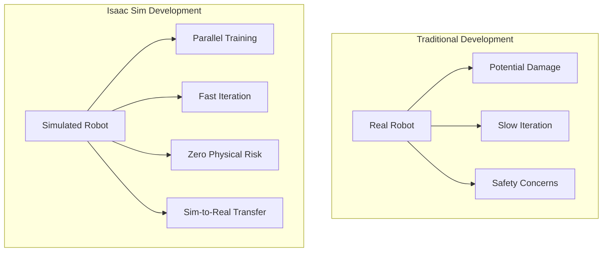
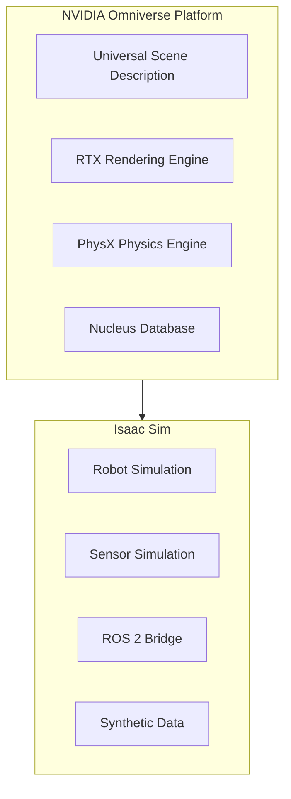
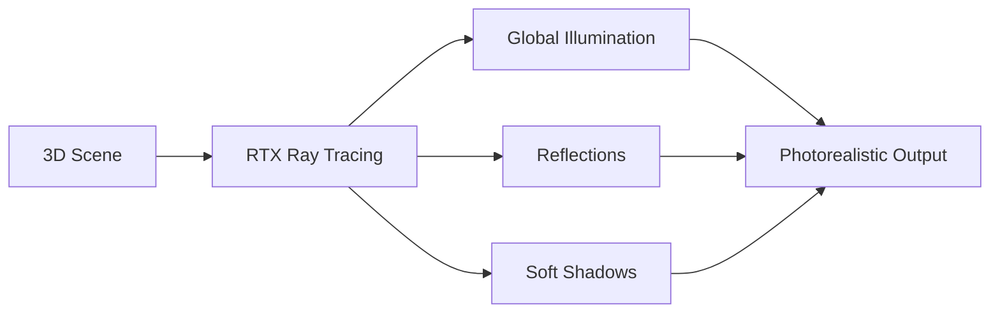
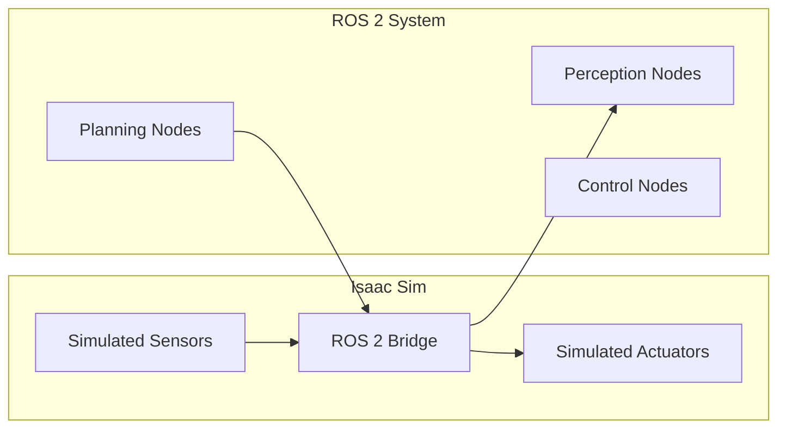
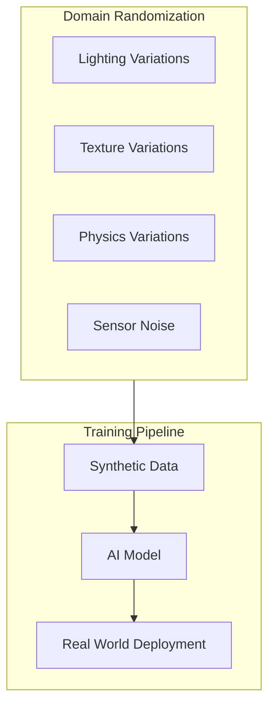
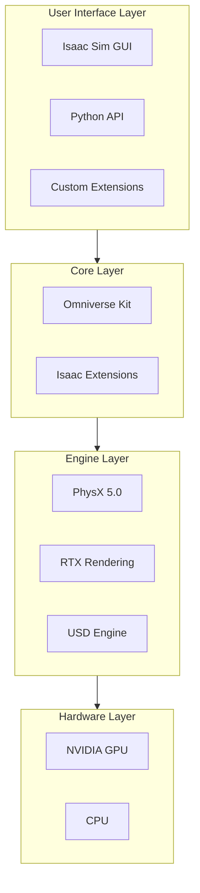
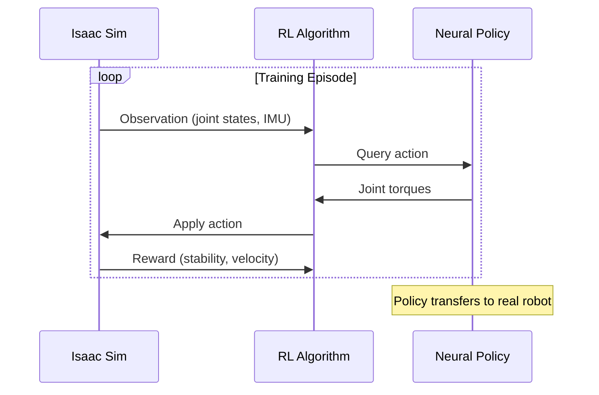

# Chapter 1: Isaac Sim Overview

:::note Learning Objectives
By the end of this chapter, you will be able to:
- Explain what NVIDIA Isaac Sim is and its role in robotics development
- Understand the key features that make Isaac Sim unique
- Describe the relationship between Isaac Sim, Omniverse, and PhysX
- Identify use cases for Isaac Sim in humanoid robotics
- Understand the simulation-to-reality (sim2real) pipeline
:::

## The Challenge of Robot Development

Developing robots in the real world is expensive, time-consuming, and dangerous. Consider training a humanoid robot to walk:

- **Cost**: Each fall could damage $50,000+ worth of hardware
- **Time**: Real-world trials are limited by battery life and safety protocols
- **Safety**: Unstable robots pose risks to humans and environments
- **Iteration**: Making hardware changes takes days or weeks

This is where **NVIDIA Isaac Sim** changes everything.



## What is NVIDIA Isaac Sim?

**NVIDIA Isaac Sim** is a scalable robotics simulation platform built on **NVIDIA Omniverse**. It provides:

| Feature | Description |
|---------|-------------|
| **Photorealistic Rendering** | RTX ray-tracing for realistic visuals |
| **Accurate Physics** | PhysX 5.0 for real-world physics behavior |
| **Sensor Simulation** | Realistic cameras, LiDAR, IMU, depth sensors |
| **ROS 2 Integration** | Native bridge for ROS 2 communication |
| **Synthetic Data Generation** | Training data for AI/ML models |
| **Headless Operation** | Cloud-based parallel simulation |

### The Omniverse Foundation

Isaac Sim is built on **NVIDIA Omniverse**, a platform for creating and operating metaverse applications:



### Universal Scene Description (USD)

**USD** is the file format at the heart of Isaac Sim. Originally developed by Pixar for filmmaking, USD provides:

- **Hierarchical Scene Structure**: Organize complex robots and environments
- **Non-destructive Layering**: Override properties without modifying original assets
- **Collaborative Editing**: Multiple users can work simultaneously
- **Asset References**: Reuse components across projects

```python
# Conceptual USD structure for a humanoid robot
"""
humanoid_robot.usd
├── Root
│   ├── Torso
│   │   ├── LeftArm
│   │   │   ├── Shoulder
│   │   │   ├── Elbow
│   │   │   └── Wrist
│   │   └── RightArm
│   │       ├── Shoulder
│   │       ├── Elbow
│   │       └── Wrist
│   └── Legs
│       ├── LeftLeg
│       └── RightLeg
"""
```

## Key Features Deep Dive

### 1. Photorealistic Rendering

Isaac Sim uses **RTX ray-tracing** to render environments with:

- Global illumination
- Accurate reflections and refractions
- Physically-based materials
- Real-time shadows

This is crucial for training computer vision models that will work in the real world:



### 2. PhysX 5.0 Physics Engine

**PhysX 5.0** provides the most accurate physics simulation available:

| Physics Feature | Application |
|-----------------|-------------|
| Rigid Body Dynamics | Robot link movements |
| Articulated Bodies | Joint chains and constraints |
| Soft Body Simulation | Deformable objects |
| Fluid Dynamics | Liquid interactions |
| Particle Systems | Granular materials |

```python
# Physics properties in Isaac Sim
physics_config = {
    "solver_type": "TGS",  # Temporal Gauss-Seidel solver
    "solver_iterations": 32,
    "substeps": 4,
    "gravity": [0, 0, -9.81],
    "enable_gpu_dynamics": True,
    "enable_stabilization": True
}
```

### 3. Sensor Simulation

Isaac Sim simulates sensors with remarkable accuracy:

#### Camera Sensors
- RGB cameras with lens distortion
- Depth cameras (structured light, ToF)
- Fisheye cameras
- Stereo camera rigs

#### Range Sensors
- Rotating LiDAR (Velodyne, Ouster patterns)
- Solid-state LiDAR
- Ultrasonic sensors
- Radar

#### Proprioceptive Sensors
- IMU (accelerometer, gyroscope)
- Force/torque sensors
- Joint encoders

```python
# Example: Configuring a simulated camera
camera_config = {
    "resolution": [1920, 1080],
    "focal_length": 24.0,  # mm
    "focus_distance": 400.0,  # cm
    "f_stop": 2.0,
    "horizontal_aperture": 20.955,
    "vertical_aperture": 11.787,
    "clipping_range": [0.1, 10000.0]
}

# Simulated LiDAR configuration
lidar_config = {
    "type": "Velodyne_VLP16",
    "rotation_frequency": 10,  # Hz
    "horizontal_fov": 360,
    "horizontal_resolution": 0.2,  # degrees
    "vertical_fov": 30,
    "vertical_resolution": 2.0,  # degrees
    "max_range": 100.0  # meters
}
```

### 4. ROS 2 Integration

Isaac Sim provides native ROS 2 support through **Isaac ROS Bridge**:



## The Sim-to-Real Pipeline

The ultimate goal of simulation is **sim-to-real transfer** - training models in simulation that work in the real world.

### Domain Randomization

To bridge the **reality gap**, Isaac Sim supports **domain randomization**:



**Randomization Parameters:**

| Parameter | Range | Purpose |
|-----------|-------|---------|
| Lighting intensity | 0.5x - 2.0x | Handle varying illumination |
| Material reflectivity | 0.1 - 0.9 | Handle different surfaces |
| Camera noise | 0 - 10% | Handle sensor imperfections |
| Object position | +/- 5cm | Handle placement variations |
| Friction coefficients | 0.3 - 0.8 | Handle surface variations |

### Parallel Simulation

Isaac Sim can run **thousands of simulations in parallel** on GPU:

```python
# Conceptual parallel simulation setup
parallel_config = {
    "num_environments": 4096,
    "env_spacing": 2.0,  # meters between environments
    "use_gpu_pipeline": True,
    "physics_device": "cuda:0",
    "rendering_device": "cuda:0"
}

# Each environment runs independently
# Training data is collected simultaneously
# 4096x speedup compared to single simulation
```

## Isaac Sim Architecture

Understanding the architecture helps you use Isaac Sim effectively:



### Python API Structure

Isaac Sim provides a comprehensive Python API:

```python
# Isaac Sim Python API overview
from omni.isaac.core import World
from omni.isaac.core.robots import Robot
from omni.isaac.core.objects import DynamicCuboid
from omni.isaac.core.utils.stage import add_reference_to_stage

# Create simulation world
world = World()

# Add robot to world
robot = world.scene.add(
    Robot(
        prim_path="/World/Robot",
        name="my_humanoid"
    )
)

# Add environment objects
cube = world.scene.add(
    DynamicCuboid(
        prim_path="/World/Cube",
        name="obstacle",
        position=[1.0, 0.0, 0.5],
        size=0.1,
        color=[1.0, 0.0, 0.0]
    )
)

# Run simulation
while simulation_app.is_running():
    world.step(render=True)
```

## Use Cases for Humanoid Robotics

### 1. Locomotion Training

Train humanoid robots to walk, run, and navigate:



### 2. Manipulation Tasks

Train arms and hands for object manipulation:

- Grasping various objects
- Tool use
- Assembly tasks
- Human-robot collaboration

### 3. Perception Training

Generate synthetic data for:

- Object detection and segmentation
- Pose estimation
- Scene understanding
- Depth estimation

### 4. Full System Testing

Test complete robot systems:

- Sensor fusion algorithms
- Navigation stacks
- Task planning
- Safety systems

## Comparison with Other Simulators

| Feature | Isaac Sim | Gazebo | PyBullet | MuJoCo |
|---------|-----------|--------|----------|--------|
| Ray-tracing | Yes | No | No | No |
| GPU Physics | Yes | Limited | Limited | No |
| ROS 2 Native | Yes | Yes | No | No |
| Synthetic Data | Built-in | External | External | External |
| Parallel Sim | Yes | Limited | Yes | Yes |
| USD Support | Yes | No | No | No |
| Photorealism | Excellent | Basic | Basic | Basic |

## Hands-On: Exploring Isaac Sim Interface

When you first launch Isaac Sim, you'll see:

### Main Viewport
The 3D view of your simulation world

### Stage Panel
Hierarchical view of all objects in the scene (USD structure)

### Property Panel
Edit properties of selected objects

### Content Browser
Access assets, materials, and robots

### Timeline
Control simulation playback

```
+------------------------------------------------------------------+
|  Menu Bar                                                         |
+------------------------------------------------------------------+
|            |                           |                          |
|   Stage    |      Main Viewport        |    Property Panel       |
|   Panel    |                           |                          |
|            |                           |                          |
|            |                           |                          |
+------------+---------------------------+--------------------------+
|                                                                   |
|                     Content Browser / Console                     |
|                                                                   |
+------------------------------------------------------------------+
```

## Summary

In this chapter, you learned:

- Isaac Sim is NVIDIA's advanced robotics simulation platform
- It's built on Omniverse with USD, RTX, and PhysX technologies
- Key features include photorealistic rendering, accurate physics, and sensor simulation
- Native ROS 2 integration enables testing real robot code
- Domain randomization bridges the sim-to-real gap
- Parallel simulation enables massive-scale training

:::tip Key Takeaways
1. **Isaac Sim = Omniverse + Robotics** - leverages NVIDIA's full technology stack
2. **USD is central** - all assets use Universal Scene Description format
3. **Sim-to-real is the goal** - training in simulation, deploying in reality
4. **GPU acceleration** - thousands of parallel simulations on single GPU
:::

## Next Steps

In the next chapter, we'll install and configure Isaac Sim on your system, ensuring you have all the requirements for running humanoid robot simulations.

---

## Review Questions

1. What three NVIDIA technologies form the foundation of Isaac Sim?
2. Why is photorealistic rendering important for robot training?
3. What is domain randomization and why is it used?
4. How does Isaac Sim integrate with ROS 2?
5. What advantages does parallel simulation provide for robot training?

## Exercises

### Exercise 1.1: Architecture Diagram
Draw a diagram showing how a humanoid robot simulation would use Isaac Sim's features (sensors, physics, rendering, ROS 2 bridge).

### Exercise 1.2: Comparison Research
Research one alternative robotics simulator (Gazebo, MuJoCo, or PyBullet) and list three features where Isaac Sim has advantages and three features where the alternative might be preferable.

### Exercise 1.3: Use Case Analysis
Describe a specific humanoid robot task (e.g., climbing stairs) and explain which Isaac Sim features would be most important for simulating this task.
