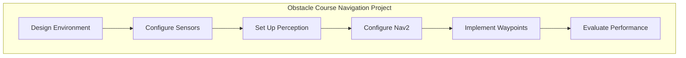

# Chapter 12: Mini Project - Obstacle Course Navigation

:::note Learning Objectives
By the end of this project, you will be able to:
- Design and build a complete obstacle course in Isaac Sim
- Implement GPU-accelerated perception with Isaac ROS
- Configure Nav2 for dynamic obstacle avoidance
- Create a waypoint navigation system
- Evaluate navigation performance with metrics
:::

## Project Overview

In this mini-project, you will build a complete navigation system that guides a robot through an obstacle course using the technologies learned throughout this module.



### Requirements

| Requirement | Description |
|-------------|-------------|
| **Environment** | Obstacle course with static and dynamic obstacles |
| **Robot** | Mobile robot with stereo cameras and LiDAR |
| **Localization** | Isaac ROS VSLAM |
| **Perception** | Object detection for dynamic obstacles |
| **Navigation** | Nav2 with custom behavior tree |
| **Waypoints** | Visit 5 checkpoints in order |
| **Metrics** | Time, collisions, path efficiency |

## Part 1: Environment Design

### Creating the Obstacle Course

```python
# obstacle_course_environment.py
"""
Create the obstacle course environment in Isaac Sim.
"""

from isaacsim import SimulationApp
simulation_app = SimulationApp({"headless": False})

from omni.isaac.core import World
from omni.isaac.core.objects import DynamicCuboid, VisualCuboid, GroundPlane
from omni.isaac.core.materials import PreviewSurface
from pxr import UsdGeom, Gf
import numpy as np
import random


class ObstacleCourseBuilder:
    """Build the obstacle course environment."""

    def __init__(self):
        self.world = World(stage_units_in_meters=1.0)
        self.checkpoints = []
        self.static_obstacles = []
        self.dynamic_obstacles = []

    def create_ground(self):
        """Create textured ground plane."""
        self.world.scene.add_default_ground_plane(
            z_position=0,
            name="ground",
            prim_path="/World/Ground",
            static_friction=0.5,
            dynamic_friction=0.5,
            restitution=0.01
        )

    def create_boundary_walls(self, length=20.0, width=15.0, height=2.0):
        """Create walls around the course."""
        wall_thickness = 0.2

        walls = [
            # North wall
            {"pos": [0, width/2, height/2], "size": [length, wall_thickness, height]},
            # South wall
            {"pos": [0, -width/2, height/2], "size": [length, wall_thickness, height]},
            # East wall
            {"pos": [length/2, 0, height/2], "size": [wall_thickness, width, height]},
            # West wall
            {"pos": [-length/2, 0, height/2], "size": [wall_thickness, width, height]},
        ]

        for i, wall in enumerate(walls):
            self.world.scene.add(
                VisualCuboid(
                    prim_path=f"/World/Walls/Wall_{i}",
                    name=f"wall_{i}",
                    position=np.array(wall["pos"]),
                    size=1.0,
                    scale=np.array(wall["size"]),
                    color=np.array([0.5, 0.5, 0.5])
                )
            )

    def create_static_obstacles(self):
        """Create static obstacles throughout the course."""
        obstacle_configs = [
            # Barrier walls
            {"pos": [-5, 3, 0.5], "size": [3.0, 0.3, 1.0], "type": "wall"},
            {"pos": [-2, -2, 0.5], "size": [0.3, 4.0, 1.0], "type": "wall"},
            {"pos": [3, 1, 0.5], "size": [4.0, 0.3, 1.0], "type": "wall"},
            {"pos": [6, -3, 0.5], "size": [0.3, 3.0, 1.0], "type": "wall"},

            # Pillars
            {"pos": [0, 0, 0.75], "size": [0.5, 0.5, 1.5], "type": "pillar"},
            {"pos": [-4, -4, 0.75], "size": [0.5, 0.5, 1.5], "type": "pillar"},
            {"pos": [4, 4, 0.75], "size": [0.5, 0.5, 1.5], "type": "pillar"},

            # Narrow passage
            {"pos": [2, -5, 0.5], "size": [0.3, 2.0, 1.0], "type": "wall"},
            {"pos": [2, -5 + 2.5, 0.5], "size": [0.3, 2.0, 1.0], "type": "wall"},
        ]

        for i, obs in enumerate(obstacle_configs):
            obstacle = self.world.scene.add(
                VisualCuboid(
                    prim_path=f"/World/StaticObstacles/Obstacle_{i}",
                    name=f"static_obstacle_{i}",
                    position=np.array(obs["pos"]),
                    size=1.0,
                    scale=np.array(obs["size"]),
                    color=np.array([0.3, 0.3, 0.8])
                )
            )
            self.static_obstacles.append(obstacle)

    def create_dynamic_obstacles(self):
        """Create moving obstacles."""
        dynamic_configs = [
            {"pos": [-3, 0, 0.3], "size": 0.5, "color": [1, 0, 0]},
            {"pos": [5, 2, 0.3], "size": 0.4, "color": [1, 0.5, 0]},
            {"pos": [1, -3, 0.3], "size": 0.45, "color": [1, 0, 0.5]},
        ]

        for i, obs in enumerate(dynamic_configs):
            obstacle = self.world.scene.add(
                DynamicCuboid(
                    prim_path=f"/World/DynamicObstacles/Moving_{i}",
                    name=f"dynamic_obstacle_{i}",
                    position=np.array(obs["pos"]),
                    size=obs["size"],
                    color=np.array(obs["color"]),
                    mass=10.0
                )
            )
            self.dynamic_obstacles.append({
                "object": obstacle,
                "initial_pos": np.array(obs["pos"]),
                "velocity": np.array([random.uniform(-0.5, 0.5),
                                     random.uniform(-0.5, 0.5), 0]),
                "bounds": 2.0
            })

    def create_checkpoints(self):
        """Create checkpoint markers."""
        checkpoint_positions = [
            [-7, 5, 0.1],    # Checkpoint 1 - Start area
            [-4, -5, 0.1],   # Checkpoint 2
            [0, 2, 0.1],     # Checkpoint 3 - Middle
            [5, -2, 0.1],    # Checkpoint 4
            [7, 5, 0.1],     # Checkpoint 5 - Finish
        ]

        colors = [
            [0, 1, 0],    # Green - start
            [1, 1, 0],    # Yellow
            [1, 0.5, 0],  # Orange
            [1, 0, 1],    # Magenta
            [0, 1, 1],    # Cyan - finish
        ]

        for i, (pos, color) in enumerate(zip(checkpoint_positions, colors)):
            checkpoint = self.world.scene.add(
                VisualCuboid(
                    prim_path=f"/World/Checkpoints/Checkpoint_{i+1}",
                    name=f"checkpoint_{i+1}",
                    position=np.array(pos),
                    size=1.0,
                    scale=np.array([1.0, 1.0, 0.05]),
                    color=np.array(color)
                )
            )

            # Add numbered marker
            self.checkpoints.append({
                "object": checkpoint,
                "position": pos,
                "number": i + 1,
                "reached": False
            })

        return [cp["position"] for cp in self.checkpoints]

    def create_lighting(self):
        """Set up scene lighting."""
        from pxr import UsdLux

        stage = self.world.stage

        # Dome light for ambient
        dome_light = UsdLux.DomeLight.Define(stage, "/World/Lights/DomeLight")
        dome_light.CreateIntensityAttr(1000)

        # Directional light for shadows
        sun_light = UsdLux.DistantLight.Define(stage, "/World/Lights/Sun")
        sun_light.CreateIntensityAttr(2500)
        sun_light.CreateAngleAttr(0.53)

    def update_dynamic_obstacles(self, dt):
        """Update positions of dynamic obstacles."""
        for obs in self.dynamic_obstacles:
            current_pos = obs["object"].get_world_pose()[0]

            # Bounce off boundaries
            if abs(current_pos[0] - obs["initial_pos"][0]) > obs["bounds"]:
                obs["velocity"][0] *= -1
            if abs(current_pos[1] - obs["initial_pos"][1]) > obs["bounds"]:
                obs["velocity"][1] *= -1

            # Apply velocity
            new_pos = current_pos + obs["velocity"] * dt
            new_pos[2] = obs["initial_pos"][2]  # Keep height constant
            obs["object"].set_world_pose(position=new_pos)

    def build(self):
        """Build the complete obstacle course."""
        print("Building obstacle course...")
        self.create_ground()
        self.create_boundary_walls()
        self.create_static_obstacles()
        self.create_dynamic_obstacles()
        checkpoints = self.create_checkpoints()
        self.create_lighting()
        self.world.reset()
        print("Obstacle course ready!")
        return checkpoints

    def get_world(self):
        return self.world


# Build and save the environment
if __name__ == "__main__":
    builder = ObstacleCourseBuilder()
    checkpoints = builder.build()

    print(f"Checkpoints: {checkpoints}")

    # Run simulation
    world = builder.get_world()
    step = 0

    while simulation_app.is_running():
        world.step(render=True)
        builder.update_dynamic_obstacles(1/60.0)
        step += 1

    simulation_app.close()
```

## Part 2: Robot and Sensor Configuration

### Robot Setup with Sensors

```python
# robot_setup.py
"""
Configure the navigation robot with sensors.
"""

from omni.isaac.core import World
from omni.isaac.core.robots import Robot
from omni.isaac.sensor import Camera, IMUSensor, RotatingLidarPhysX
from omni.isaac.core.utils.stage import add_reference_to_stage
from omni.isaac.core.utils.nucleus import get_assets_root_path
import numpy as np


class NavigationRobot:
    """Navigation robot with sensors for obstacle course."""

    def __init__(self, world: World):
        self.world = world
        self.robot = None
        self.sensors = {}

    def spawn_robot(self, position=[-7, 5, 0.1]):
        """Spawn the robot at starting position."""
        assets_root = get_assets_root_path()

        # Use Carter robot (differential drive)
        add_reference_to_stage(
            usd_path=f"{assets_root}/Isaac/Robots/Carter/carter_v2.usd",
            prim_path="/World/Robot"
        )

        self.robot = self.world.scene.add(
            Robot(
                prim_path="/World/Robot",
                name="nav_robot"
            )
        )

        # Set initial position
        self.robot.set_world_pose(
            position=np.array(position),
            orientation=np.array([0, 0, 0, 1])
        )

    def setup_stereo_cameras(self):
        """Configure stereo cameras for VSLAM."""
        baseline = 0.12  # 12cm baseline

        # Left camera
        self.sensors["left_camera"] = Camera(
            prim_path="/World/Robot/chassis_link/left_camera",
            name="left_camera",
            frequency=30,
            resolution=(1280, 720)
        )
        self.world.scene.add(self.sensors["left_camera"])

        # Right camera
        self.sensors["right_camera"] = Camera(
            prim_path="/World/Robot/chassis_link/right_camera",
            name="right_camera",
            frequency=30,
            resolution=(1280, 720)
        )
        self.world.scene.add(self.sensors["right_camera"])

    def setup_lidar(self):
        """Configure LiDAR for obstacle detection."""
        self.sensors["lidar"] = RotatingLidarPhysX(
            prim_path="/World/Robot/chassis_link/lidar",
            name="lidar",
            rotation_frequency=10.0,
            translation=np.array([0.2, 0, 0.3])
        )
        self.world.scene.add(self.sensors["lidar"])

    def setup_imu(self):
        """Configure IMU for VSLAM."""
        self.sensors["imu"] = IMUSensor(
            prim_path="/World/Robot/chassis_link/imu",
            name="imu",
            frequency=200
        )
        self.world.scene.add(self.sensors["imu"])

    def setup_ros_publishers(self):
        """Set up ROS 2 publishers for sensors."""
        import omni.isaac.ros2_bridge as ros2_bridge

        # Camera publishers
        ros2_bridge.create_camera_publisher(
            "/World/Robot/chassis_link/left_camera",
            "/camera/left/image_raw",
            "/camera/left/camera_info"
        )

        ros2_bridge.create_camera_publisher(
            "/World/Robot/chassis_link/right_camera",
            "/camera/right/image_raw",
            "/camera/right/camera_info"
        )

        # LiDAR publisher
        ros2_bridge.create_lidar_publisher(
            "/World/Robot/chassis_link/lidar",
            "/scan"
        )

        # IMU publisher
        ros2_bridge.create_imu_publisher(
            "/World/Robot/chassis_link/imu",
            "/imu/data"
        )

        # TF publisher
        ros2_bridge.create_tf_publisher("/World/Robot")

        # Twist subscriber
        ros2_bridge.create_twist_subscriber(
            "/World/Robot",
            "/cmd_vel"
        )

    def get_pose(self):
        """Get current robot pose."""
        return self.robot.get_world_pose()

    def initialize(self, start_position=[-7, 5, 0.1]):
        """Initialize the complete robot setup."""
        self.spawn_robot(start_position)
        self.setup_stereo_cameras()
        self.setup_lidar()
        self.setup_imu()
        self.setup_ros_publishers()
        return self.robot
```

## Part 3: Waypoint Navigation System

### Waypoint Navigator Node

```python
# waypoint_navigator.py
"""
ROS 2 node for waypoint navigation through checkpoints.
"""

import rclpy
from rclpy.node import Node
from rclpy.action import ActionClient
from nav2_msgs.action import NavigateToPose, FollowWaypoints
from geometry_msgs.msg import PoseStamped, PoseWithCovarianceStamped
from nav_msgs.msg import Odometry
from std_msgs.msg import String
import math
import time


class WaypointNavigator(Node):
    """Navigate through obstacle course checkpoints."""

    def __init__(self):
        super().__init__('waypoint_navigator')

        # Checkpoints (x, y, theta)
        self.checkpoints = [
            [-7.0, 5.0, 0.0],     # Start
            [-4.0, -5.0, -1.57],  # Checkpoint 2
            [0.0, 2.0, 0.0],      # Checkpoint 3
            [5.0, -2.0, 1.57],    # Checkpoint 4
            [7.0, 5.0, 0.0],      # Finish
        ]

        self.current_checkpoint = 0
        self.navigation_complete = False

        # Performance metrics
        self.start_time = None
        self.checkpoint_times = []
        self.total_distance = 0.0
        self.last_pose = None
        self.collision_count = 0

        # Action client for Nav2
        self.nav_client = ActionClient(self, NavigateToPose, 'navigate_to_pose')

        # Subscribe to odometry for metrics
        self.odom_sub = self.create_subscription(
            Odometry,
            '/odom',
            self.odom_callback,
            10
        )

        # Status publisher
        self.status_pub = self.create_publisher(String, '/navigation_status', 10)

        # Wait for Nav2
        self.get_logger().info('Waiting for Nav2 action server...')
        self.nav_client.wait_for_server()
        self.get_logger().info('Nav2 ready!')

    def odom_callback(self, msg):
        """Track distance traveled."""
        current_pose = msg.pose.pose.position

        if self.last_pose is not None and self.start_time is not None:
            dx = current_pose.x - self.last_pose.x
            dy = current_pose.y - self.last_pose.y
            self.total_distance += math.sqrt(dx*dx + dy*dy)

        self.last_pose = current_pose

    def create_pose_stamped(self, x, y, theta):
        """Create PoseStamped message."""
        pose = PoseStamped()
        pose.header.frame_id = 'map'
        pose.header.stamp = self.get_clock().now().to_msg()
        pose.pose.position.x = x
        pose.pose.position.y = y
        pose.pose.position.z = 0.0

        # Convert theta to quaternion
        pose.pose.orientation.z = math.sin(theta / 2)
        pose.pose.orientation.w = math.cos(theta / 2)

        return pose

    def start_navigation(self):
        """Begin navigation through checkpoints."""
        self.start_time = time.time()
        self.get_logger().info('Starting obstacle course navigation!')
        self.navigate_to_next_checkpoint()

    def navigate_to_next_checkpoint(self):
        """Navigate to the next checkpoint."""
        if self.current_checkpoint >= len(self.checkpoints):
            self.navigation_complete = True
            self.report_results()
            return

        checkpoint = self.checkpoints[self.current_checkpoint]
        self.get_logger().info(
            f'Navigating to checkpoint {self.current_checkpoint + 1}: '
            f'({checkpoint[0]:.1f}, {checkpoint[1]:.1f})'
        )

        # Create goal
        goal_msg = NavigateToPose.Goal()
        goal_msg.pose = self.create_pose_stamped(*checkpoint)

        # Send goal
        self.send_goal_future = self.nav_client.send_goal_async(
            goal_msg,
            feedback_callback=self.feedback_callback
        )
        self.send_goal_future.add_done_callback(self.goal_response_callback)

    def goal_response_callback(self, future):
        """Handle goal acceptance."""
        goal_handle = future.result()
        if not goal_handle.accepted:
            self.get_logger().error('Goal rejected!')
            return

        self.get_logger().info('Goal accepted')
        self.result_future = goal_handle.get_result_async()
        self.result_future.add_done_callback(self.result_callback)

    def result_callback(self, future):
        """Handle navigation result."""
        result = future.result().result

        # Record checkpoint time
        checkpoint_time = time.time() - self.start_time
        self.checkpoint_times.append(checkpoint_time)

        self.get_logger().info(
            f'Checkpoint {self.current_checkpoint + 1} reached! '
            f'Time: {checkpoint_time:.2f}s'
        )

        # Publish status
        status_msg = String()
        status_msg.data = f'Checkpoint {self.current_checkpoint + 1} complete'
        self.status_pub.publish(status_msg)

        # Move to next checkpoint
        self.current_checkpoint += 1
        self.navigate_to_next_checkpoint()

    def feedback_callback(self, feedback_msg):
        """Handle navigation feedback."""
        feedback = feedback_msg.feedback
        remaining_distance = feedback.distance_remaining

        if remaining_distance < 0.5:
            self.get_logger().debug(f'Approaching checkpoint: {remaining_distance:.2f}m remaining')

    def report_results(self):
        """Report final navigation results."""
        total_time = time.time() - self.start_time

        report = f"""
        ========================================
        OBSTACLE COURSE NAVIGATION COMPLETE
        ========================================
        Total Time: {total_time:.2f} seconds
        Total Distance: {self.total_distance:.2f} meters
        Checkpoints Reached: {self.current_checkpoint}/{len(self.checkpoints)}

        Checkpoint Times:
        """

        for i, t in enumerate(self.checkpoint_times):
            report += f"  Checkpoint {i+1}: {t:.2f}s\n"

        # Calculate path efficiency
        ideal_distance = self._calculate_ideal_distance()
        efficiency = (ideal_distance / self.total_distance * 100) if self.total_distance > 0 else 0

        report += f"""
        Path Efficiency: {efficiency:.1f}%
        (Ideal: {ideal_distance:.2f}m, Actual: {self.total_distance:.2f}m)
        ========================================
        """

        self.get_logger().info(report)

        # Publish final status
        status_msg = String()
        status_msg.data = f'COMPLETE: {total_time:.2f}s, {self.total_distance:.2f}m'
        self.status_pub.publish(status_msg)

    def _calculate_ideal_distance(self):
        """Calculate ideal (straight-line) distance."""
        total = 0
        for i in range(len(self.checkpoints) - 1):
            dx = self.checkpoints[i+1][0] - self.checkpoints[i][0]
            dy = self.checkpoints[i+1][1] - self.checkpoints[i][1]
            total += math.sqrt(dx*dx + dy*dy)
        return total


def main():
    rclpy.init()
    navigator = WaypointNavigator()

    # Start navigation after a short delay
    navigator.create_timer(2.0, lambda: navigator.start_navigation())

    try:
        rclpy.spin(navigator)
    except KeyboardInterrupt:
        pass

    navigator.destroy_node()
    rclpy.shutdown()


if __name__ == '__main__':
    main()
```

## Part 4: Custom Behavior Tree

### Navigation Behavior Tree

```xml
<!-- behavior_trees/obstacle_course_nav.xml -->
<root main_tree_to_execute="MainTree">
  <BehaviorTree ID="MainTree">
    <RecoveryNode number_of_retries="6" name="NavigateRecovery">
      <PipelineSequence name="NavigateWithReplanning">

        <!-- Compute path with obstacle avoidance -->
        <RateController hz="1.0">
          <RecoveryNode number_of_retries="2" name="ComputePath">
            <Sequence>
              <!-- Check for dynamic obstacles -->
              <Condition ID="ObstaclesClear" path_tolerance="0.5"/>
              <ComputePathToPose goal="{goal}" path="{path}" planner_id="GridBased"/>
            </Sequence>
            <Sequence name="ClearAndReplan">
              <ClearEntireCostmap service_name="global_costmap/clear_entirely_global_costmap"/>
              <ComputePathToPose goal="{goal}" path="{path}" planner_id="GridBased"/>
            </Sequence>
          </RecoveryNode>
        </RateController>

        <!-- Smooth the path -->
        <SmoothPath path="{path}" smoothed_path="{smoothed_path}" smoother_id="simple_smoother"/>

        <!-- Follow path with collision checking -->
        <RecoveryNode number_of_retries="2" name="FollowPath">
          <FollowPath path="{smoothed_path}" controller_id="FollowPath"/>
          <Sequence name="LocalRecovery">
            <ClearEntireCostmap service_name="local_costmap/clear_entirely_local_costmap"/>
            <Wait wait_duration="1"/>
          </Sequence>
        </RecoveryNode>

      </PipelineSequence>

      <!-- Recovery behaviors for stuck situations -->
      <ReactiveFallback name="RecoveryFallback">
        <GoalUpdated/>
        <RoundRobin name="RecoveryActions">
          <!-- First try: wait for dynamic obstacles to move -->
          <Sequence name="WaitRecovery">
            <Wait wait_duration="3"/>
            <ClearEntireCostmap service_name="local_costmap/clear_entirely_local_costmap"/>
          </Sequence>
          <!-- Second try: backup -->
          <BackUp backup_dist="0.3" backup_speed="0.1"/>
          <!-- Third try: spin -->
          <Spin spin_dist="1.57"/>
          <!-- Last resort: more aggressive backup -->
          <BackUp backup_dist="0.5" backup_speed="0.15"/>
        </RoundRobin>
      </ReactiveFallback>

    </RecoveryNode>
  </BehaviorTree>
</root>
```

## Part 5: Launch Configuration

### Complete Launch File

```python
# launch/obstacle_course.launch.py
"""
Complete launch file for obstacle course navigation.
"""

from launch import LaunchDescription
from launch.actions import (
    DeclareLaunchArgument,
    IncludeLaunchDescription,
    TimerAction,
    ExecuteProcess
)
from launch.substitutions import LaunchConfiguration
from launch.launch_description_sources import PythonLaunchDescriptionSource
from launch_ros.actions import Node, ComposableNodeContainer
from launch_ros.descriptions import ComposableNode
from ament_index_python.packages import get_package_share_directory
import os


def generate_launch_description():
    # Directories
    pkg_dir = get_package_share_directory('obstacle_course_nav')
    nav2_dir = get_package_share_directory('nav2_bringup')
    isaac_vslam_dir = get_package_share_directory('isaac_ros_visual_slam')

    # Files
    params_file = os.path.join(pkg_dir, 'config', 'nav2_params.yaml')
    bt_file = os.path.join(pkg_dir, 'behavior_trees', 'obstacle_course_nav.xml')
    rviz_config = os.path.join(pkg_dir, 'rviz', 'obstacle_course.rviz')

    # Launch configuration
    use_sim_time = LaunchConfiguration('use_sim_time', default='true')

    # Isaac ROS VSLAM
    vslam_node = ComposableNode(
        package='isaac_ros_visual_slam',
        plugin='nvidia::isaac_ros::visual_slam::VisualSlamNode',
        name='visual_slam_node',
        parameters=[{
            'use_sim_time': True,
            'enable_imu_fusion': True,
            'enable_localization_n_mapping': True,
            'publish_map_to_odom_tf': True,
            'publish_odom_to_base_tf': True
        }],
        remappings=[
            ('stereo_camera/left/image', '/camera/left/image_raw'),
            ('stereo_camera/left/camera_info', '/camera/left/camera_info'),
            ('stereo_camera/right/image', '/camera/right/image_raw'),
            ('stereo_camera/right/camera_info', '/camera/right/camera_info'),
            ('visual_slam/imu', '/imu/data')
        ]
    )

    # Isaac ROS container
    isaac_container = ComposableNodeContainer(
        name='isaac_ros_container',
        namespace='',
        package='rclcpp_components',
        executable='component_container_mt',
        composable_node_descriptions=[vslam_node],
        output='screen'
    )

    # Nav2 navigation
    nav2_launch = IncludeLaunchDescription(
        PythonLaunchDescriptionSource([
            nav2_dir, '/launch/navigation_launch.py'
        ]),
        launch_arguments={
            'use_sim_time': 'true',
            'params_file': params_file,
            'default_bt_xml_filename': bt_file,
            'autostart': 'true'
        }.items()
    )

    # Waypoint navigator
    waypoint_nav = Node(
        package='obstacle_course_nav',
        executable='waypoint_navigator',
        name='waypoint_navigator',
        parameters=[{'use_sim_time': True}],
        output='screen'
    )

    # RViz
    rviz = Node(
        package='rviz2',
        executable='rviz2',
        name='rviz2',
        arguments=['-d', rviz_config],
        parameters=[{'use_sim_time': True}]
    )

    # Performance monitor
    monitor = Node(
        package='obstacle_course_nav',
        executable='performance_monitor',
        name='performance_monitor',
        output='screen'
    )

    return LaunchDescription([
        DeclareLaunchArgument('use_sim_time', default_value='true'),

        # Start Isaac ROS first
        isaac_container,

        # Nav2 after VSLAM initializes
        TimerAction(period=5.0, actions=[nav2_launch]),

        # Waypoint navigator after Nav2
        TimerAction(period=10.0, actions=[waypoint_nav]),

        # Visualization
        TimerAction(period=3.0, actions=[rviz]),

        # Monitor
        monitor
    ])
```

## Part 6: Evaluation and Metrics

### Performance Metrics

| Metric | Description | Target |
|--------|-------------|--------|
| **Completion Time** | Total time to finish course | < 120 seconds |
| **Path Efficiency** | Actual / Ideal distance | > 80% |
| **Checkpoint Success** | Checkpoints reached | 5/5 |
| **Collision Count** | Number of collisions | 0 |
| **Recovery Actions** | Times recovery triggered | < 3 |

### Evaluation Rubric

| Component | Points | Criteria |
|-----------|--------|----------|
| Environment Setup | 20 | Course built with all obstacles |
| Sensor Configuration | 15 | All sensors publishing correctly |
| VSLAM Integration | 20 | Stable localization throughout |
| Navigation Success | 25 | All checkpoints reached |
| Performance | 20 | Meets time and efficiency targets |
| **Total** | **100** | |

## Summary

In this project, you built a complete navigation system combining:

- Isaac Sim environment with static and dynamic obstacles
- Robot with stereo cameras, LiDAR, and IMU
- Isaac ROS VSLAM for localization
- Nav2 for path planning and control
- Custom behavior tree for recovery
- Waypoint navigation system

:::tip Key Achievements
1. **End-to-end integration** of Isaac Sim, Isaac ROS, and Nav2
2. **Dynamic obstacle handling** with perception and costmaps
3. **Performance measurement** and optimization
4. **Robust navigation** with custom recovery behaviors
:::

## Next Steps

The final chapter provides a comprehensive assessment of Module 3.

---

## Project Checklist

- [ ] Obstacle course environment created
- [ ] Robot spawned with all sensors
- [ ] ROS 2 bridge configured
- [ ] VSLAM providing stable localization
- [ ] Nav2 parameters tuned
- [ ] Behavior tree handles recoveries
- [ ] All 5 checkpoints reachable
- [ ] Performance metrics recorded
- [ ] Path efficiency > 80%
- [ ] Course completed in < 120 seconds
