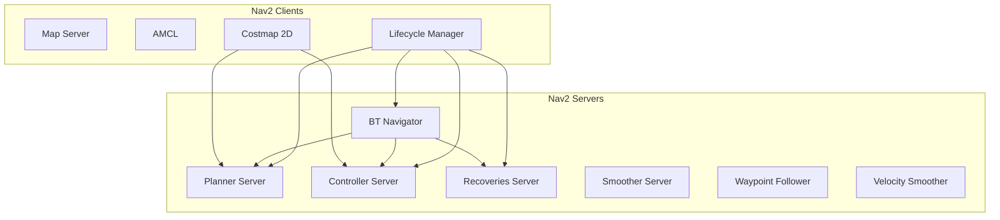
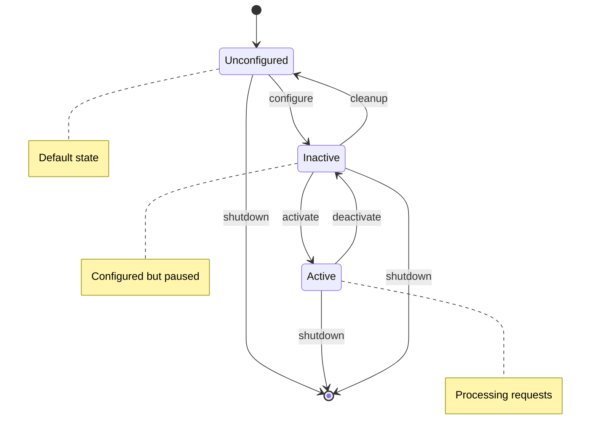

# Chapter 10: Nav2 Architecture and Configuration

:::note Learning Objectives
By the end of this chapter, you will be able to:
- Understand the Nav2 server architecture and lifecycle
- Configure planners for different robot kinematics
- Tune controllers for optimal path following
- Set up advanced costmap configurations
- Implement custom navigation behaviors
:::

## Nav2 Server Architecture

Nav2 uses a distributed server architecture with lifecycle-managed nodes:



### Lifecycle Management

Nav2 nodes follow the ROS 2 lifecycle state machine:



```python
# lifecycle_manager_example.py
"""
Example of lifecycle management in Nav2.
"""

import rclpy
from rclpy.node import Node
from lifecycle_msgs.srv import ChangeState, GetState
from lifecycle_msgs.msg import Transition


class LifecycleController(Node):
    """Control Nav2 node lifecycle states."""

    def __init__(self):
        super().__init__('lifecycle_controller')

        # Nodes to manage
        self.managed_nodes = [
            'map_server',
            'amcl',
            'planner_server',
            'controller_server',
            'recoveries_server',
            'bt_navigator'
        ]

        # Create clients for each node
        self.change_state_clients = {}
        for node_name in self.managed_nodes:
            client = self.create_client(
                ChangeState,
                f'/{node_name}/change_state'
            )
            self.change_state_clients[node_name] = client

    async def configure_node(self, node_name: str):
        """Configure a managed node."""
        return await self._change_state(
            node_name,
            Transition.TRANSITION_CONFIGURE
        )

    async def activate_node(self, node_name: str):
        """Activate a managed node."""
        return await self._change_state(
            node_name,
            Transition.TRANSITION_ACTIVATE
        )

    async def deactivate_node(self, node_name: str):
        """Deactivate a managed node."""
        return await self._change_state(
            node_name,
            Transition.TRANSITION_DEACTIVATE
        )

    async def _change_state(self, node_name: str, transition_id: int):
        """Change node state."""
        client = self.change_state_clients[node_name]

        if not client.wait_for_service(timeout_sec=5.0):
            self.get_logger().error(f'Service not available for {node_name}')
            return False

        request = ChangeState.Request()
        request.transition.id = transition_id

        future = client.call_async(request)
        await future

        return future.result().success

    async def startup_sequence(self):
        """Start all Nav2 nodes in order."""
        for node_name in self.managed_nodes:
            self.get_logger().info(f'Configuring {node_name}...')
            await self.configure_node(node_name)

        for node_name in self.managed_nodes:
            self.get_logger().info(f'Activating {node_name}...')
            await self.activate_node(node_name)

        self.get_logger().info('Nav2 startup complete!')
```

## Planner Server Configuration

### NavFn Planner

The default A* / Dijkstra planner:

```yaml
# config/planners/navfn.yaml
planner_server:
  ros__parameters:
    expected_planner_frequency: 20.0
    planner_plugins: ["GridBased"]

    GridBased:
      plugin: "nav2_navfn_planner/NavfnPlanner"
      tolerance: 0.5
      use_astar: true
      allow_unknown: true
      # NavFn specific
      default_tolerance: 0.0
      visualize_potential: false
```

### SMAC Planners

For non-holonomic robots (car-like, Ackermann steering):

```yaml
# config/planners/smac_hybrid.yaml
planner_server:
  ros__parameters:
    planner_plugins: ["SmacHybrid"]

    SmacHybrid:
      plugin: "nav2_smac_planner/SmacPlannerHybrid"
      tolerance: 0.25
      downsample_costmap: false
      downsampling_factor: 1
      allow_unknown: true
      max_iterations: 1000000
      max_on_approach_iterations: 1000
      max_planning_time: 5.0

      # Vehicle parameters
      minimum_turning_radius: 0.40  # meters
      motion_model_for_search: "DUBIN"  # DUBIN, REEDS_SHEPP

      # Penalty weights
      analytic_expansion_ratio: 3.5
      analytic_expansion_max_length: 3.0
      reverse_penalty: 2.0
      change_penalty: 0.0
      non_straight_penalty: 1.2
      cost_penalty: 2.0

      # Smoothing
      smoother:
        max_iterations: 1000
        w_smooth: 0.3
        w_data: 0.2
        tolerance: 1e-10
```

### SMAC Lattice Planner

For robots with complex kinematic constraints:

```yaml
# config/planners/smac_lattice.yaml
planner_server:
  ros__parameters:
    planner_plugins: ["SmacLattice"]

    SmacLattice:
      plugin: "nav2_smac_planner/SmacPlannerLattice"
      tolerance: 0.25
      allow_unknown: true
      max_iterations: 1000000
      max_planning_time: 5.0

      # Lattice primitives file
      lattice_filepath: "/config/lattice_primitives.json"

      # Cost weights
      reverse_penalty: 2.0
      change_penalty: 0.5
      rotation_penalty: 2.0
      cost_penalty: 2.0
```

### Theta* Planner

For any-angle path planning:

```yaml
# config/planners/theta_star.yaml
planner_server:
  ros__parameters:
    planner_plugins: ["ThetaStar"]

    ThetaStar:
      plugin: "nav2_theta_star_planner/ThetaStarPlanner"
      tolerance: 0.5
      allow_unknown: true
      use_final_approach_orientation: true

      # Theta* specific
      how_many_corners: 8  # 4 or 8 connected
      w_euc_cost: 1.0  # Euclidean cost weight
      w_traversal_cost: 2.0  # Traversal cost weight
```

## Controller Server Configuration

### DWB Controller (Dynamic Window Approach)

```yaml
# config/controllers/dwb.yaml
controller_server:
  ros__parameters:
    controller_frequency: 20.0
    controller_plugins: ["FollowPath"]

    FollowPath:
      plugin: "dwb_core::DWBLocalPlanner"

      # Velocity limits
      min_vel_x: -0.1
      max_vel_x: 0.5
      min_vel_y: 0.0  # Non-holonomic
      max_vel_y: 0.0
      max_vel_theta: 1.0

      # Acceleration limits
      acc_lim_x: 2.5
      acc_lim_y: 0.0
      acc_lim_theta: 3.2
      decel_lim_x: -2.5
      decel_lim_theta: -3.2

      # Velocity samples
      vx_samples: 20
      vy_samples: 1
      vtheta_samples: 20

      # Trajectory simulation
      sim_time: 1.7
      linear_granularity: 0.05
      angular_granularity: 0.025

      # Critics (scoring functions)
      critics:
        - "BaseObstacle"
        - "GoalAlign"
        - "GoalDist"
        - "PathAlign"
        - "PathDist"
        - "RotateToGoal"
        - "Oscillation"

      # Critic parameters
      BaseObstacle.scale: 0.02
      GoalAlign.scale: 24.0
      GoalAlign.forward_point_distance: 0.1
      GoalDist.scale: 24.0
      PathAlign.scale: 32.0
      PathAlign.forward_point_distance: 0.1
      PathDist.scale: 32.0
      RotateToGoal.scale: 32.0
      RotateToGoal.slowing_factor: 5.0
      RotateToGoal.lookahead_time: -1.0
```

### Regulated Pure Pursuit Controller

```yaml
# config/controllers/regulated_pure_pursuit.yaml
controller_server:
  ros__parameters:
    controller_plugins: ["FollowPath"]

    FollowPath:
      plugin: "nav2_regulated_pure_pursuit_controller::RegulatedPurePursuitController"

      # Velocity limits
      desired_linear_vel: 0.5
      max_linear_accel: 2.5
      max_linear_decel: 2.5
      max_angular_vel: 1.0
      max_angular_accel: 3.2

      # Lookahead
      lookahead_dist: 0.6
      min_lookahead_dist: 0.3
      max_lookahead_dist: 0.9
      lookahead_time: 1.5
      use_velocity_scaled_lookahead_dist: true

      # Rotation
      rotate_to_heading_angular_vel: 1.8
      rotate_to_heading_min_angle: 0.785  # 45 degrees

      # Collision checking
      use_collision_detection: true
      transform_tolerance: 0.1

      # Regulated features
      use_regulated_linear_velocity_scaling: true
      use_cost_regulated_linear_velocity_scaling: true
      regulated_linear_scaling_min_radius: 0.9
      regulated_linear_scaling_min_speed: 0.25
      cost_scaling_dist: 0.6
      cost_scaling_gain: 1.0
```

### MPPI Controller (Model Predictive Path Integral)

```yaml
# config/controllers/mppi.yaml
controller_server:
  ros__parameters:
    controller_plugins: ["FollowPath"]

    FollowPath:
      plugin: "nav2_mppi_controller::MPPIController"

      # Time horizon
      time_steps: 56
      model_dt: 0.05
      batch_size: 2000

      # Velocity limits
      vx_max: 0.5
      vx_min: -0.35
      vy_max: 0.5
      wz_max: 1.9

      # Iteration settings
      iteration_count: 1
      temperature: 0.3
      gamma: 0.015
      visualize: false

      # Motion model
      motion_model: "DiffDrive"  # DiffDrive, Omni, Ackermann

      # Critics
      critics:
        - "ConstraintCritic"
        - "GoalCritic"
        - "GoalAngleCritic"
        - "ObstaclesCritic"
        - "PathAlignCritic"
        - "PathFollowCritic"
        - "PathAngleCritic"
        - "PreferForwardCritic"

      ConstraintCritic:
        enabled: true
        cost_power: 1
        cost_weight: 4.0

      GoalCritic:
        enabled: true
        cost_power: 1
        cost_weight: 5.0
        threshold_to_consider: 1.4

      GoalAngleCritic:
        enabled: true
        cost_power: 1
        cost_weight: 3.0
        threshold_to_consider: 0.5

      ObstaclesCritic:
        enabled: true
        cost_power: 1
        repulsion_weight: 1.5
        critical_weight: 20.0
        consider_footprint: true
        collision_cost: 10000.0
        near_goal_distance: 0.5

      PathAlignCritic:
        enabled: true
        cost_power: 1
        cost_weight: 14.0
        max_path_occupancy_ratio: 0.05
        trajectory_point_step: 3
        threshold_to_consider: 0.5
        offset_from_furthest: 20

      PathFollowCritic:
        enabled: true
        cost_power: 1
        cost_weight: 5.0
        offset_from_furthest: 5
        threshold_to_consider: 1.4

      PathAngleCritic:
        enabled: true
        cost_power: 1
        cost_weight: 2.0
        offset_from_furthest: 4
        threshold_to_consider: 0.5
        max_angle_to_furthest: 1.0

      PreferForwardCritic:
        enabled: true
        cost_power: 1
        cost_weight: 5.0
        threshold_to_consider: 0.5
```

## Advanced Costmap Configuration

### 3D Voxel Layer

```yaml
# config/costmaps/voxel_costmap.yaml
local_costmap:
  local_costmap:
    ros__parameters:
      plugins: ["voxel_layer", "inflation_layer"]

      voxel_layer:
        plugin: "nav2_costmap_2d::VoxelLayer"
        enabled: True
        publish_voxel_map: True

        # 3D grid parameters
        origin_z: 0.0
        z_resolution: 0.05
        z_voxels: 16
        unknown_threshold: 15
        mark_threshold: 0

        # Height filtering
        max_obstacle_height: 2.0
        min_obstacle_height: 0.0

        # Sensor sources
        observation_sources: pointcloud depth_camera

        pointcloud:
          topic: /points
          sensor_frame: camera_link
          data_type: "PointCloud2"
          max_obstacle_height: 2.0
          min_obstacle_height: 0.1
          obstacle_max_range: 5.0
          obstacle_min_range: 0.1
          clearing: True
          marking: True

        depth_camera:
          topic: /depth/points
          sensor_frame: depth_camera_link
          data_type: "PointCloud2"
          max_obstacle_height: 2.0
          min_obstacle_height: 0.1
          clearing: True
          marking: True
```

### Denoise Layer

```yaml
# config/costmaps/denoise_layer.yaml
local_costmap:
  local_costmap:
    ros__parameters:
      plugins: ["obstacle_layer", "denoise_layer", "inflation_layer"]

      denoise_layer:
        plugin: "nav2_costmap_2d::DenoiseLayer"
        enabled: True
        minimal_group_size: 2  # Remove isolated obstacles
```

### Keepout Filter

```yaml
# config/costmaps/keepout_filter.yaml
global_costmap:
  global_costmap:
    ros__parameters:
      plugins: ["static_layer", "keepout_filter", "inflation_layer"]

      keepout_filter:
        plugin: "nav2_costmap_2d::KeepoutFilter"
        enabled: True
        filter_info_topic: "/costmap_filter_info"
```

### Speed Filter

```yaml
# config/costmaps/speed_filter.yaml
global_costmap:
  global_costmap:
    ros__parameters:
      plugins: ["static_layer", "speed_filter", "inflation_layer"]

      speed_filter:
        plugin: "nav2_costmap_2d::SpeedFilter"
        enabled: True
        filter_info_topic: "/speed_filter_info"
        speed_limit_topic: "/speed_limit"
```

## Custom Planner Plugin

```cpp
// src/custom_planner.cpp
#include "nav2_core/global_planner.hpp"
#include "nav2_costmap_2d/costmap_2d_ros.hpp"
#include "nav2_util/lifecycle_node.hpp"

namespace custom_planner
{

class CustomPlanner : public nav2_core::GlobalPlanner
{
public:
  CustomPlanner() = default;
  ~CustomPlanner() = default;

  void configure(
    const rclcpp_lifecycle::LifecycleNode::WeakPtr & parent,
    std::string name,
    std::shared_ptr<tf2_ros::Buffer> tf,
    std::shared_ptr<nav2_costmap_2d::Costmap2DROS> costmap_ros) override
  {
    node_ = parent.lock();
    name_ = name;
    tf_ = tf;
    costmap_ = costmap_ros->getCostmap();
    global_frame_ = costmap_ros->getGlobalFrameID();

    // Declare parameters
    nav2_util::declare_parameter_if_not_declared(
      node_, name_ + ".interpolation_resolution",
      rclcpp::ParameterValue(0.1));

    node_->get_parameter(name_ + ".interpolation_resolution", interpolation_resolution_);
  }

  void cleanup() override {}
  void activate() override {}
  void deactivate() override {}

  nav_msgs::msg::Path createPlan(
    const geometry_msgs::msg::PoseStamped & start,
    const geometry_msgs::msg::PoseStamped & goal) override
  {
    nav_msgs::msg::Path path;
    path.header.stamp = node_->now();
    path.header.frame_id = global_frame_;

    // Custom planning logic here
    // This is a simple straight-line planner for demonstration

    double dx = goal.pose.position.x - start.pose.position.x;
    double dy = goal.pose.position.y - start.pose.position.y;
    double distance = std::hypot(dx, dy);

    int num_points = static_cast<int>(distance / interpolation_resolution_);

    for (int i = 0; i <= num_points; ++i) {
      geometry_msgs::msg::PoseStamped pose;
      pose.header = path.header;
      pose.pose.position.x = start.pose.position.x + dx * i / num_points;
      pose.pose.position.y = start.pose.position.y + dy * i / num_points;
      pose.pose.position.z = 0.0;
      pose.pose.orientation = goal.pose.orientation;
      path.poses.push_back(pose);
    }

    return path;
  }

private:
  rclcpp_lifecycle::LifecycleNode::SharedPtr node_;
  std::string name_;
  std::shared_ptr<tf2_ros::Buffer> tf_;
  nav2_costmap_2d::Costmap2D * costmap_;
  std::string global_frame_;
  double interpolation_resolution_;
};

}  // namespace custom_planner

#include "pluginlib/class_list_macros.hpp"
PLUGINLIB_EXPORT_CLASS(custom_planner::CustomPlanner, nav2_core::GlobalPlanner)
```

## Summary

In this chapter, you learned:

- Nav2 uses a distributed server architecture with lifecycle management
- Multiple planner options exist for different robot kinematics
- Controllers can be tuned for specific behaviors
- Costmaps can be extended with custom layers
- Custom plugins can be created for planners and controllers

:::tip Key Takeaways
1. **Lifecycle management** provides controlled startup/shutdown
2. **Choose planners** based on robot kinematics (holonomic vs. non-holonomic)
3. **Controller tuning** significantly impacts navigation quality
4. **Costmap layers** can be stacked for complex environments
:::

## Next Steps

The next chapter covers integrating Isaac ROS with Nav2.

---

## Review Questions

1. What are the lifecycle states of a Nav2 node?
2. When would you use SMAC Hybrid vs. NavFn planner?
3. What is the purpose of DWB critics?
4. How do costmap layers combine?
5. What parameters most affect controller performance?

## Exercises

### Exercise 10.1: Planner Comparison
Configure the same robot with NavFn, Theta*, and SMAC Hybrid planners. Compare path smoothness and computation time.

### Exercise 10.2: Controller Tuning
Tune the DWB controller for a differential drive robot to minimize oscillation during path following.

### Exercise 10.3: Custom Costmap Layer
Create a custom costmap layer that adds cost based on proximity to a "restricted area" defined by a polygon.
