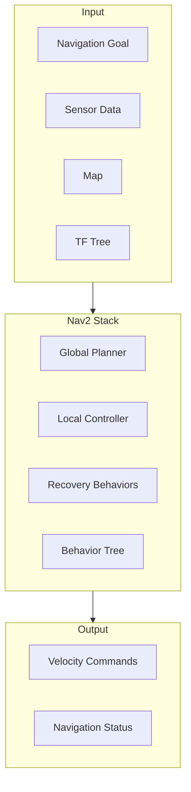
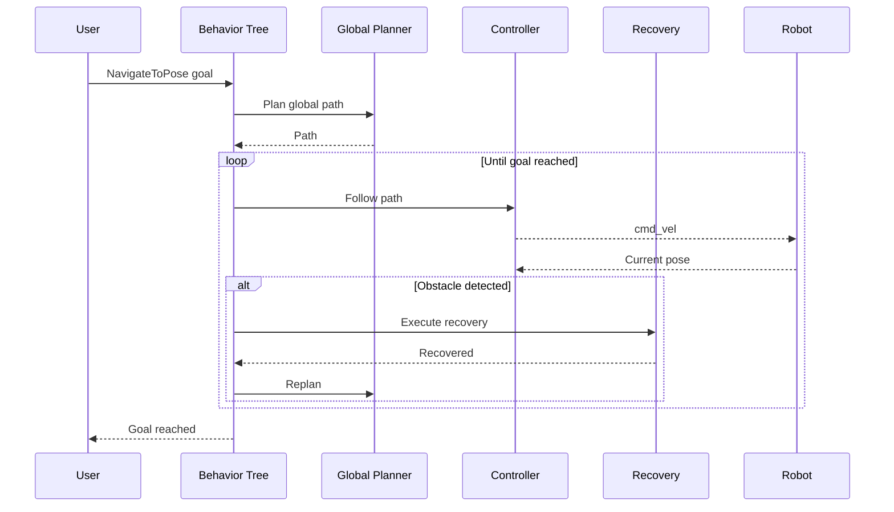
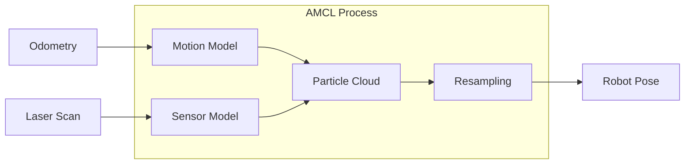
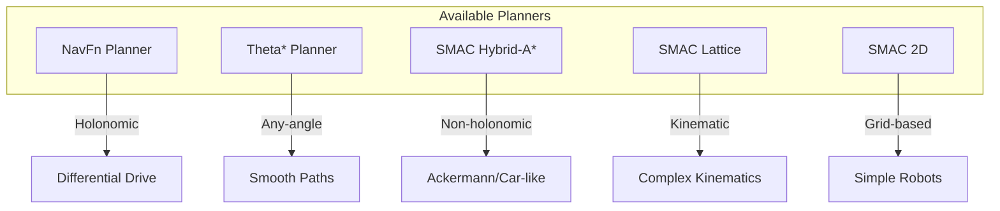
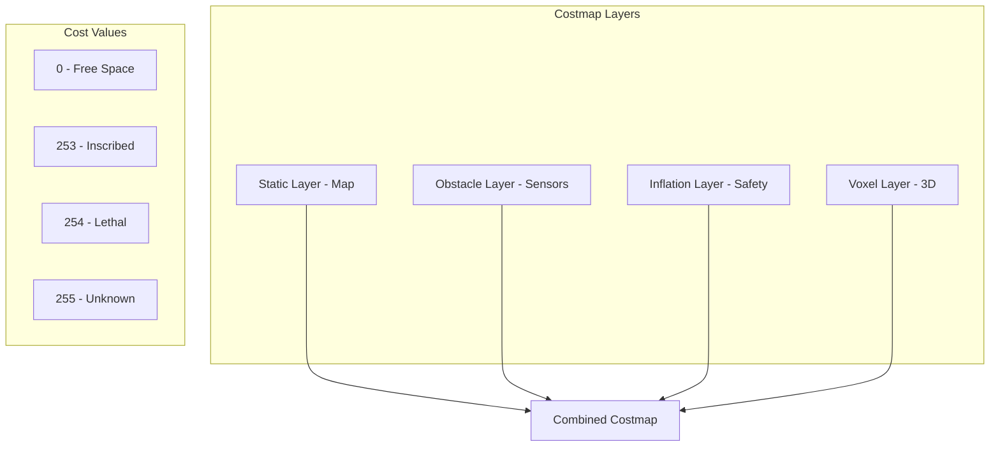
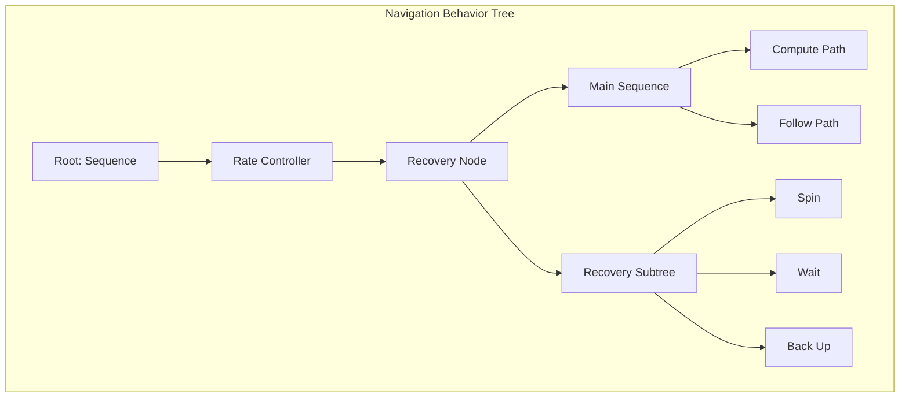

# Chapter 9: Nav2 Introduction

:::note Learning Objectives
By the end of this chapter, you will be able to:
- Understand the Nav2 architecture and its components
- Explain the navigation pipeline from goal to motion
- Identify when to use different Nav2 plugins
- Set up a basic Nav2 configuration for your robot
- Understand behavior trees for navigation logic
:::

## What is Nav2?

**Nav2** (Navigation 2) is the ROS 2 navigation stack - a collection of packages that enable autonomous navigation for mobile robots.



### Nav2 vs. Legacy Navigation

| Feature | ROS 1 Navigation | Nav2 |
|---------|-----------------|------|
| Architecture | Monolithic | Plugin-based |
| Behavior | State machine | Behavior trees |
| Configuration | Static | Dynamic reconfigure |
| Lifecycle | None | Managed nodes |
| Recovery | Limited | Extensive |
| 3D Support | Limited | Improved |

## Navigation Pipeline

The navigation pipeline transforms a goal into robot motion:



## Core Components

### 1. Map Server

Provides the static map for navigation:

```yaml
# config/map_server.yaml
map_server:
  ros__parameters:
    yaml_filename: "map.yaml"
    topic_name: "map"
    frame_id: "map"
```

### 2. AMCL (Localization)

Adaptive Monte Carlo Localization for robot pose estimation:



```yaml
# config/amcl.yaml
amcl:
  ros__parameters:
    # Particle filter
    min_particles: 500
    max_particles: 2000
    recovery_alpha_slow: 0.0
    recovery_alpha_fast: 0.0

    # Motion model
    robot_model_type: "nav2_amcl::DifferentialMotionModel"
    alpha1: 0.2  # Rotation noise from rotation
    alpha2: 0.2  # Rotation noise from translation
    alpha3: 0.2  # Translation noise from translation
    alpha4: 0.2  # Translation noise from rotation
    alpha5: 0.2  # Translation noise

    # Sensor model
    laser_model_type: "likelihood_field"
    max_beams: 60
    z_hit: 0.5
    z_rand: 0.5
    sigma_hit: 0.2

    # Update thresholds
    update_min_d: 0.25  # meters
    update_min_a: 0.2   # radians

    # TF frames
    base_frame_id: "base_link"
    odom_frame_id: "odom"
    global_frame_id: "map"
```

### 3. Global Planner

Plans the overall path from start to goal:



### 4. Local Controller

Follows the global path while avoiding obstacles:

```yaml
# Available controllers
controllers:
  dwb_controller:
    description: Dynamic Window Approach
    use_case: General purpose
    features:
      - Velocity sampling
      - Multiple critics
      - Configurable behavior

  regulated_pure_pursuit:
    description: Pure pursuit with regulation
    use_case: Smooth path following
    features:
      - Curvature-based speed regulation
      - Collision checking
      - Simple tuning

  rotation_shim:
    description: In-place rotation
    use_case: Rotate to face path direction
    features:
      - Clean rotations
      - Works with any controller

  mppi_controller:
    description: Model Predictive Path Integral
    use_case: Complex environments
    features:
      - GPU acceleration
      - Predictive planning
      - Obstacle avoidance
```

### 5. Costmap 2D

Represents obstacles and navigation costs:



```yaml
# config/costmap_common.yaml
# Common costmap parameters
robot_radius: 0.35
footprint: "[[0.3, 0.25], [0.3, -0.25], [-0.3, -0.25], [-0.3, 0.25]]"

# Layer configuration
plugins:
  - "static_layer"
  - "obstacle_layer"
  - "inflation_layer"

static_layer:
  plugin: "nav2_costmap_2d::StaticLayer"
  map_subscribe_transient_local: True

obstacle_layer:
  plugin: "nav2_costmap_2d::ObstacleLayer"
  enabled: True
  observation_sources: scan
  scan:
    topic: /scan
    max_obstacle_height: 2.0
    clearing: True
    marking: True
    data_type: "LaserScan"

inflation_layer:
  plugin: "nav2_costmap_2d::InflationLayer"
  cost_scaling_factor: 3.0
  inflation_radius: 0.55
```

### 6. Recovery Behaviors

Handle stuck situations:

```yaml
# config/recovery.yaml
recoveries_server:
  ros__parameters:
    recovery_plugins:
      - "spin"
      - "backup"
      - "wait"

    spin:
      plugin: "nav2_recoveries/Spin"

    backup:
      plugin: "nav2_recoveries/BackUp"

    wait:
      plugin: "nav2_recoveries/Wait"
```

## Behavior Trees in Nav2

Nav2 uses behavior trees to orchestrate navigation logic:



### Default Navigation Behavior Tree

```xml
<!-- behavior_trees/navigate_to_pose.xml -->
<root main_tree_to_execute="MainTree">
  <BehaviorTree ID="MainTree">
    <RecoveryNode number_of_retries="6" name="NavigateRecovery">
      <PipelineSequence name="NavigateWithReplanning">
        <RateController hz="1.0">
          <RecoveryNode number_of_retries="1" name="ComputePathToPose">
            <ComputePathToPose goal="{goal}" path="{path}" planner_id="GridBased"/>
            <ClearEntireCostmap name="ClearGlobalCostmap-Context" service_name="global_costmap/clear_entirely_global_costmap"/>
          </RecoveryNode>
        </RateController>
        <RecoveryNode number_of_retries="1" name="FollowPath">
          <FollowPath path="{path}" controller_id="FollowPath"/>
          <ClearEntireCostmap name="ClearLocalCostmap-Context" service_name="local_costmap/clear_entirely_local_costmap"/>
        </RecoveryNode>
      </PipelineSequence>
      <ReactiveFallback name="RecoveryFallback">
        <GoalUpdated/>
        <RoundRobin name="RecoveryActions">
          <Spin spin_dist="1.57"/>
          <Wait wait_duration="5"/>
          <BackUp backup_dist="0.15" backup_speed="0.025"/>
        </RoundRobin>
      </ReactiveFallback>
    </RecoveryNode>
  </BehaviorTree>
</root>
```

## Basic Nav2 Launch

```python
# launch/nav2_bringup.launch.py
"""
Basic Nav2 launch file.
"""

from launch import LaunchDescription
from launch.actions import DeclareLaunchArgument, IncludeLaunchDescription
from launch.substitutions import LaunchConfiguration
from launch.launch_description_sources import PythonLaunchDescriptionSource
from launch_ros.actions import Node
from ament_index_python.packages import get_package_share_directory
import os


def generate_launch_description():
    # Get package directories
    nav2_bringup_dir = get_package_share_directory('nav2_bringup')
    my_robot_dir = get_package_share_directory('my_robot_navigation')

    # Configuration files
    map_yaml_file = os.path.join(my_robot_dir, 'maps', 'my_map.yaml')
    params_file = os.path.join(my_robot_dir, 'config', 'nav2_params.yaml')
    bt_xml_file = os.path.join(my_robot_dir, 'behavior_trees', 'navigate_to_pose.xml')

    # Launch arguments
    use_sim_time = LaunchConfiguration('use_sim_time', default='false')
    autostart = LaunchConfiguration('autostart', default='true')

    # Nav2 launch
    nav2_launch = IncludeLaunchDescription(
        PythonLaunchDescriptionSource([
            nav2_bringup_dir, '/launch/bringup_launch.py'
        ]),
        launch_arguments={
            'use_sim_time': use_sim_time,
            'autostart': autostart,
            'map': map_yaml_file,
            'params_file': params_file,
            'default_bt_xml_filename': bt_xml_file
        }.items()
    )

    # RViz
    rviz_config = os.path.join(my_robot_dir, 'rviz', 'nav2_config.rviz')
    rviz_node = Node(
        package='rviz2',
        executable='rviz2',
        name='rviz2',
        arguments=['-d', rviz_config],
        parameters=[{'use_sim_time': use_sim_time}]
    )

    return LaunchDescription([
        DeclareLaunchArgument('use_sim_time', default_value='false'),
        DeclareLaunchArgument('autostart', default_value='true'),
        nav2_launch,
        rviz_node
    ])
```

## Nav2 Parameters File

```yaml
# config/nav2_params.yaml

# Behavior Tree Navigator
bt_navigator:
  ros__parameters:
    use_sim_time: True
    global_frame: map
    robot_base_frame: base_link
    odom_topic: /odom
    bt_loop_duration: 10
    default_server_timeout: 20
    enable_groot_monitoring: True
    groot_zmq_publisher_port: 1666
    groot_zmq_server_port: 1667
    plugin_lib_names:
      - nav2_compute_path_to_pose_action_bt_node
      - nav2_compute_path_through_poses_action_bt_node
      - nav2_follow_path_action_bt_node
      - nav2_spin_action_bt_node
      - nav2_wait_action_bt_node
      - nav2_back_up_action_bt_node
      - nav2_clear_costmap_service_bt_node
      - nav2_is_stuck_condition_bt_node
      - nav2_goal_reached_condition_bt_node
      - nav2_goal_updated_condition_bt_node
      - nav2_initial_pose_received_condition_bt_node
      - nav2_rate_controller_bt_node
      - nav2_distance_controller_bt_node
      - nav2_recovery_node_bt_node
      - nav2_pipeline_sequence_bt_node
      - nav2_round_robin_bt_node
      - nav2_transform_available_condition_bt_node

# Global Planner
planner_server:
  ros__parameters:
    expected_planner_frequency: 20.0
    use_sim_time: True
    planner_plugins: ["GridBased"]
    GridBased:
      plugin: "nav2_navfn_planner/NavfnPlanner"
      tolerance: 0.5
      use_astar: false
      allow_unknown: true

# Controller
controller_server:
  ros__parameters:
    use_sim_time: True
    controller_frequency: 20.0
    min_x_velocity_threshold: 0.001
    min_y_velocity_threshold: 0.5
    min_theta_velocity_threshold: 0.001
    progress_checker_plugin: "progress_checker"
    goal_checker_plugins: ["general_goal_checker"]
    controller_plugins: ["FollowPath"]

    progress_checker:
      plugin: "nav2_controller::SimpleProgressChecker"
      required_movement_radius: 0.5
      movement_time_allowance: 10.0

    general_goal_checker:
      plugin: "nav2_controller::SimpleGoalChecker"
      xy_goal_tolerance: 0.25
      yaw_goal_tolerance: 0.25
      stateful: True

    FollowPath:
      plugin: "dwb_core::DWBLocalPlanner"
      min_vel_x: 0.0
      min_vel_y: 0.0
      max_vel_x: 0.5
      max_vel_y: 0.0
      max_vel_theta: 1.0
      min_speed_xy: 0.0
      max_speed_xy: 0.5
      min_speed_theta: 0.0
      acc_lim_x: 2.5
      acc_lim_y: 0.0
      acc_lim_theta: 3.2
      decel_lim_x: -2.5
      decel_lim_y: 0.0
      decel_lim_theta: -3.2
      vx_samples: 20
      vy_samples: 5
      vtheta_samples: 20
      sim_time: 1.7
      linear_granularity: 0.05
      angular_granularity: 0.025
      transform_tolerance: 0.2
      xy_goal_tolerance: 0.25
      trans_stopped_velocity: 0.25
      short_circuit_trajectory_evaluation: True
      critics:
        - "RotateToGoal"
        - "Oscillation"
        - "BaseObstacle"
        - "GoalAlign"
        - "PathAlign"
        - "PathDist"
        - "GoalDist"

# Global Costmap
global_costmap:
  global_costmap:
    ros__parameters:
      update_frequency: 1.0
      publish_frequency: 1.0
      global_frame: map
      robot_base_frame: base_link
      use_sim_time: True
      robot_radius: 0.35
      resolution: 0.05
      track_unknown_space: true
      plugins: ["static_layer", "obstacle_layer", "inflation_layer"]
      static_layer:
        plugin: "nav2_costmap_2d::StaticLayer"
        map_subscribe_transient_local: True
      obstacle_layer:
        plugin: "nav2_costmap_2d::ObstacleLayer"
        enabled: True
        observation_sources: scan
        scan:
          topic: /scan
          max_obstacle_height: 2.0
          clearing: True
          marking: True
          data_type: "LaserScan"
      inflation_layer:
        plugin: "nav2_costmap_2d::InflationLayer"
        cost_scaling_factor: 3.0
        inflation_radius: 0.55
      always_send_full_costmap: True

# Local Costmap
local_costmap:
  local_costmap:
    ros__parameters:
      update_frequency: 5.0
      publish_frequency: 2.0
      global_frame: odom
      robot_base_frame: base_link
      use_sim_time: True
      rolling_window: true
      width: 3
      height: 3
      resolution: 0.05
      robot_radius: 0.35
      plugins: ["voxel_layer", "inflation_layer"]
      voxel_layer:
        plugin: "nav2_costmap_2d::VoxelLayer"
        enabled: True
        publish_voxel_map: True
        origin_z: 0.0
        z_resolution: 0.05
        z_voxels: 16
        max_obstacle_height: 2.0
        mark_threshold: 0
        observation_sources: scan
        scan:
          topic: /scan
          max_obstacle_height: 2.0
          clearing: True
          marking: True
          data_type: "LaserScan"
      inflation_layer:
        plugin: "nav2_costmap_2d::InflationLayer"
        cost_scaling_factor: 3.0
        inflation_radius: 0.55
      always_send_full_costmap: True
```

## Summary

In this chapter, you learned:

- Nav2 is the ROS 2 navigation stack for autonomous mobile robots
- The pipeline includes localization, planning, control, and recovery
- Behavior trees orchestrate navigation logic
- Costmaps represent the environment with safety margins
- Multiple planner and controller options exist for different robot types

:::tip Key Takeaways
1. **Plugin architecture** allows customization at every level
2. **Behavior trees** provide flexible navigation logic
3. **Costmaps** are critical for safe navigation
4. **Recovery behaviors** handle stuck situations automatically
:::

## Next Steps

The next chapter covers Nav2 architecture and configuration in more detail.

---

## Review Questions

1. What are the five main components of Nav2?
2. What is the difference between global and local planners?
3. Why are behavior trees used instead of state machines?
4. What costmap layers are typically used?
5. When would you use SMAC Hybrid-A* vs. NavFn planner?

## Exercises

### Exercise 9.1: Nav2 Setup
Configure Nav2 for a differential drive robot with a LiDAR sensor. Create the parameter file and launch configuration.

### Exercise 9.2: Costmap Tuning
Experiment with inflation radius and cost scaling factor. Document how changes affect navigation behavior.

### Exercise 9.3: Behavior Tree
Modify the default behavior tree to add a custom recovery behavior (e.g., announce "I'm stuck" via speaker).
