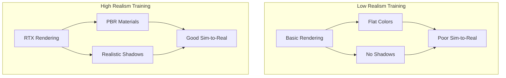
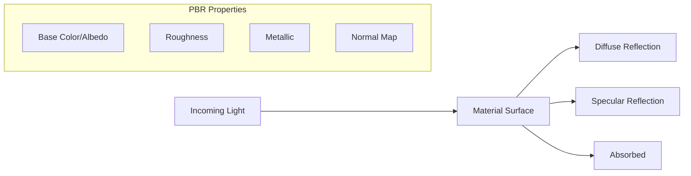
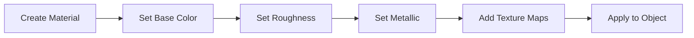
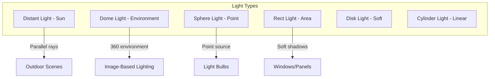

# Chapter 4: Photorealistic Rendering

:::note Learning Objectives
By the end of this chapter, you will be able to:
- Understand physically-based rendering (PBR) principles
- Create and apply PBR materials to robots and environments
- Configure lighting systems for realistic scenes
- Set up cameras with realistic properties
- Optimize rendering performance for training workloads
:::

## Why Photorealistic Rendering Matters

For AI-driven robots, visual realism directly impacts **sim-to-real transfer**. Models trained on unrealistic images fail in the real world.



### The Reality Gap

| Visual Feature | Impact on AI |
|----------------|--------------|
| Lighting variations | Object detection accuracy |
| Material reflections | Depth estimation |
| Shadows | Obstacle detection |
| Surface textures | Grasp planning |
| Color accuracy | Object classification |

## Understanding PBR: Physically-Based Rendering

PBR simulates how light interacts with materials in the real world.

### Core PBR Properties



| Property | Description | Range |
|----------|-------------|-------|
| **Base Color (Albedo)** | Surface color without lighting | RGB values |
| **Roughness** | Surface smoothness (0=mirror, 1=matte) | 0.0 - 1.0 |
| **Metallic** | Metal vs non-metal surface | 0.0 - 1.0 |
| **Normal** | Surface detail without geometry | RGB texture |
| **Ambient Occlusion** | Shadowing in crevices | 0.0 - 1.0 |
| **Emission** | Self-illumination | RGB values |

### PBR Workflow in Isaac Sim



## Creating PBR Materials

### Method 1: Python API Material Creation

```python
# create_pbr_materials.py
"""
Create and apply PBR materials using Isaac Sim Python API.
"""

from isaacsim import SimulationApp
simulation_app = SimulationApp({"headless": False})

from omni.isaac.core import World
from omni.isaac.core.materials import PreviewSurface, OmniPBR
from omni.isaac.core.objects import DynamicCuboid
from pxr import Sdf, UsdShade, Gf
import numpy as np


def create_metal_material(stage, name: str, color: tuple, roughness: float = 0.3):
    """
    Create a metallic PBR material.

    Args:
        stage: USD stage
        name: Material name
        color: RGB color tuple (0-1 range)
        roughness: Surface roughness (0=mirror, 1=matte)
    """
    material_path = f"/World/Looks/{name}"

    # Create OmniPBR material
    material = UsdShade.Material.Define(stage, material_path)

    # Create shader
    shader_path = f"{material_path}/Shader"
    shader = UsdShade.Shader.Define(stage, shader_path)
    shader.CreateIdAttr("OmniPBR")

    # Set PBR properties
    shader.CreateInput("diffuse_color_constant", Sdf.ValueTypeNames.Color3f).Set(
        Gf.Vec3f(color[0], color[1], color[2])
    )
    shader.CreateInput("metallic_constant", Sdf.ValueTypeNames.Float).Set(1.0)
    shader.CreateInput("roughness_constant", Sdf.ValueTypeNames.Float).Set(roughness)
    shader.CreateInput("specular_level", Sdf.ValueTypeNames.Float).Set(0.5)

    # Connect shader to material
    material.CreateSurfaceOutput().ConnectToSource(shader.ConnectableAPI(), "surface")

    return material_path


def create_plastic_material(stage, name: str, color: tuple, roughness: float = 0.5):
    """Create a plastic/dielectric PBR material."""
    material_path = f"/World/Looks/{name}"

    material = UsdShade.Material.Define(stage, material_path)
    shader = UsdShade.Shader.Define(stage, f"{material_path}/Shader")
    shader.CreateIdAttr("OmniPBR")

    # Plastic properties
    shader.CreateInput("diffuse_color_constant", Sdf.ValueTypeNames.Color3f).Set(
        Gf.Vec3f(color[0], color[1], color[2])
    )
    shader.CreateInput("metallic_constant", Sdf.ValueTypeNames.Float).Set(0.0)
    shader.CreateInput("roughness_constant", Sdf.ValueTypeNames.Float).Set(roughness)
    shader.CreateInput("specular_level", Sdf.ValueTypeNames.Float).Set(0.5)
    shader.CreateInput("ior_constant", Sdf.ValueTypeNames.Float).Set(1.5)  # Index of refraction

    material.CreateSurfaceOutput().ConnectToSource(shader.ConnectableAPI(), "surface")

    return material_path


def create_rubber_material(stage, name: str, color: tuple):
    """Create a rubber-like material (high roughness, low specular)."""
    material_path = f"/World/Looks/{name}"

    material = UsdShade.Material.Define(stage, material_path)
    shader = UsdShade.Shader.Define(stage, f"{material_path}/Shader")
    shader.CreateIdAttr("OmniPBR")

    shader.CreateInput("diffuse_color_constant", Sdf.ValueTypeNames.Color3f).Set(
        Gf.Vec3f(color[0], color[1], color[2])
    )
    shader.CreateInput("metallic_constant", Sdf.ValueTypeNames.Float).Set(0.0)
    shader.CreateInput("roughness_constant", Sdf.ValueTypeNames.Float).Set(0.9)
    shader.CreateInput("specular_level", Sdf.ValueTypeNames.Float).Set(0.1)

    material.CreateSurfaceOutput().ConnectToSource(shader.ConnectableAPI(), "surface")

    return material_path


def apply_material_to_prim(stage, prim_path: str, material_path: str):
    """Apply a material to a USD prim."""
    prim = stage.GetPrimAtPath(prim_path)
    if prim:
        material = UsdShade.Material.Get(stage, material_path)
        UsdShade.MaterialBindingAPI(prim).Bind(material)


# Example: Create a scene with different materials
world = World()
world.scene.add_default_ground_plane()

# Create objects
metal_cube = world.scene.add(
    DynamicCuboid(
        prim_path="/World/MetalCube",
        name="metal_cube",
        position=np.array([-0.5, 0.0, 0.5]),
        size=0.2
    )
)

plastic_cube = world.scene.add(
    DynamicCuboid(
        prim_path="/World/PlasticCube",
        name="plastic_cube",
        position=np.array([0.0, 0.0, 0.5]),
        size=0.2
    )
)

rubber_cube = world.scene.add(
    DynamicCuboid(
        prim_path="/World/RubberCube",
        name="rubber_cube",
        position=np.array([0.5, 0.0, 0.5]),
        size=0.2
    )
)

# Get stage
stage = world.stage

# Create and apply materials
metal_mat = create_metal_material(stage, "BrushedSteel", (0.8, 0.8, 0.85), roughness=0.4)
plastic_mat = create_plastic_material(stage, "RedPlastic", (0.9, 0.1, 0.1), roughness=0.3)
rubber_mat = create_rubber_material(stage, "BlackRubber", (0.1, 0.1, 0.1))

apply_material_to_prim(stage, "/World/MetalCube", metal_mat)
apply_material_to_prim(stage, "/World/PlasticCube", plastic_mat)
apply_material_to_prim(stage, "/World/RubberCube", rubber_mat)

world.reset()

# Run simulation
while simulation_app.is_running():
    world.step(render=True)

simulation_app.close()
```

### Method 2: Material with Texture Maps

```python
# textured_material.py
"""
Create PBR materials with texture maps.
"""

def create_textured_material(
    stage,
    name: str,
    albedo_texture: str,
    normal_texture: str = None,
    roughness_texture: str = None,
    metallic_texture: str = None,
    ao_texture: str = None
):
    """
    Create a fully textured PBR material.

    Args:
        stage: USD stage
        name: Material name
        albedo_texture: Path to base color texture
        normal_texture: Path to normal map
        roughness_texture: Path to roughness map
        metallic_texture: Path to metallic map
        ao_texture: Path to ambient occlusion map
    """
    material_path = f"/World/Looks/{name}"
    material = UsdShade.Material.Define(stage, material_path)

    shader = UsdShade.Shader.Define(stage, f"{material_path}/Shader")
    shader.CreateIdAttr("OmniPBR")

    # Helper to create texture sampler
    def create_texture_input(shader, input_name, texture_path, color_space="auto"):
        if texture_path:
            # Create texture shader
            tex_shader = UsdShade.Shader.Define(
                stage, f"{material_path}/{input_name}_texture"
            )
            tex_shader.CreateIdAttr("UsdUVTexture")
            tex_shader.CreateInput("file", Sdf.ValueTypeNames.Asset).Set(texture_path)
            tex_shader.CreateInput("sourceColorSpace", Sdf.ValueTypeNames.Token).Set(color_space)
            tex_shader.CreateOutput("rgb", Sdf.ValueTypeNames.Float3)

            return tex_shader
        return None

    # Base color / Albedo
    if albedo_texture:
        albedo_tex = create_texture_input(shader, "albedo", albedo_texture, "sRGB")
        shader.CreateInput("diffuse_texture", Sdf.ValueTypeNames.Asset).Set(albedo_texture)

    # Normal map
    if normal_texture:
        shader.CreateInput("normal_texture", Sdf.ValueTypeNames.Asset).Set(normal_texture)

    # Roughness
    if roughness_texture:
        shader.CreateInput("roughness_texture", Sdf.ValueTypeNames.Asset).Set(roughness_texture)
    else:
        shader.CreateInput("roughness_constant", Sdf.ValueTypeNames.Float).Set(0.5)

    # Metallic
    if metallic_texture:
        shader.CreateInput("metallic_texture", Sdf.ValueTypeNames.Asset).Set(metallic_texture)
    else:
        shader.CreateInput("metallic_constant", Sdf.ValueTypeNames.Float).Set(0.0)

    # Ambient Occlusion
    if ao_texture:
        shader.CreateInput("ao_texture", Sdf.ValueTypeNames.Asset).Set(ao_texture)

    material.CreateSurfaceOutput().ConnectToSource(shader.ConnectableAPI(), "surface")

    return material_path


# Example: Create a wood floor material
wood_material = create_textured_material(
    stage,
    name="WoodFloor",
    albedo_texture="/textures/wood/wood_albedo.png",
    normal_texture="/textures/wood/wood_normal.png",
    roughness_texture="/textures/wood/wood_roughness.png",
    ao_texture="/textures/wood/wood_ao.png"
)
```

## Lighting Systems

Proper lighting is essential for realistic rendering and AI training.

### Light Types in Isaac Sim



### Creating Lights with Python

```python
# lighting_setup.py
"""
Set up realistic lighting for Isaac Sim scenes.
"""

from pxr import UsdLux, Gf, Sdf


def create_distant_light(stage, name: str, intensity: float = 1000.0,
                         angle: float = 0.53, color: tuple = (1, 1, 1)):
    """
    Create a distant (sun) light.

    Args:
        stage: USD stage
        name: Light name
        intensity: Light intensity in lux
        angle: Angular diameter (sun = 0.53 degrees)
        color: RGB color (normalized)
    """
    light_path = f"/World/Lights/{name}"
    light = UsdLux.DistantLight.Define(stage, light_path)

    light.CreateIntensityAttr(intensity)
    light.CreateAngleAttr(angle)
    light.CreateColorAttr(Gf.Vec3f(color[0], color[1], color[2]))

    # Set direction via transform
    xform = light.GetPrim()
    # Rotate to point downward at an angle (typical sun position)
    # This would be done via transform operations

    return light_path


def create_dome_light(stage, name: str, texture_path: str = None,
                      intensity: float = 1.0):
    """
    Create a dome (environment) light for image-based lighting.

    Args:
        stage: USD stage
        name: Light name
        texture_path: Path to HDR environment map
        intensity: Intensity multiplier
    """
    light_path = f"/World/Lights/{name}"
    light = UsdLux.DomeLight.Define(stage, light_path)

    light.CreateIntensityAttr(intensity)

    if texture_path:
        light.CreateTextureFileAttr(texture_path)
        light.CreateTextureFormatAttr("latlong")

    return light_path


def create_area_light(stage, name: str, position: tuple, size: tuple,
                      intensity: float = 500.0, color: tuple = (1, 1, 1)):
    """
    Create a rectangular area light.

    Args:
        stage: USD stage
        name: Light name
        position: (x, y, z) position
        size: (width, height) of light
        intensity: Light intensity
        color: RGB color
    """
    light_path = f"/World/Lights/{name}"
    light = UsdLux.RectLight.Define(stage, light_path)

    light.CreateIntensityAttr(intensity)
    light.CreateWidthAttr(size[0])
    light.CreateHeightAttr(size[1])
    light.CreateColorAttr(Gf.Vec3f(color[0], color[1], color[2]))

    # Enable soft shadows
    light.CreateNormalizeAttr(True)

    return light_path


def create_sphere_light(stage, name: str, position: tuple, radius: float = 0.1,
                        intensity: float = 1000.0, color: tuple = (1, 1, 1)):
    """Create a spherical point light."""
    light_path = f"/World/Lights/{name}"
    light = UsdLux.SphereLight.Define(stage, light_path)

    light.CreateIntensityAttr(intensity)
    light.CreateRadiusAttr(radius)
    light.CreateColorAttr(Gf.Vec3f(color[0], color[1], color[2]))

    return light_path


# Example: Create a complete lighting setup
def setup_indoor_lighting(stage):
    """Set up lighting for an indoor scene."""

    # Main dome light with soft ambient
    create_dome_light(
        stage, "AmbientDome",
        texture_path="/textures/hdri/indoor_hdri.hdr",
        intensity=0.5
    )

    # Window light (area light simulating window)
    create_area_light(
        stage, "WindowLight",
        position=(3.0, 0.0, 2.5),
        size=(2.0, 2.0),
        intensity=2000.0,
        color=(1.0, 0.95, 0.9)  # Warm daylight
    )

    # Ceiling lights
    for i, pos in enumerate([(-1, -1), (-1, 1), (1, -1), (1, 1)]):
        create_sphere_light(
            stage, f"CeilingLight_{i}",
            position=(pos[0] * 2, pos[1] * 2, 2.8),
            radius=0.15,
            intensity=500.0,
            color=(1.0, 0.95, 0.85)  # Warm white
        )

    return True


def setup_outdoor_lighting(stage):
    """Set up lighting for an outdoor scene."""

    # Sun light
    create_distant_light(
        stage, "Sun",
        intensity=3000.0,
        angle=0.53,
        color=(1.0, 0.98, 0.95)
    )

    # Sky dome
    create_dome_light(
        stage, "SkyDome",
        texture_path="/textures/hdri/blue_sky.hdr",
        intensity=1.0
    )

    return True
```

## Camera Configuration

Realistic camera simulation is crucial for perception training.

```python
# camera_setup.py
"""
Configure cameras with realistic properties.
"""

from omni.isaac.sensor import Camera
from pxr import UsdGeom, Gf
import numpy as np


def create_realistic_camera(world, name: str, prim_path: str,
                           position: np.ndarray, target: np.ndarray,
                           resolution: tuple = (1920, 1080),
                           focal_length: float = 24.0):
    """
    Create a camera with realistic properties.

    Args:
        world: Isaac World object
        name: Camera name
        prim_path: USD path for camera
        position: Camera position [x, y, z]
        target: Look-at target [x, y, z]
        resolution: (width, height) in pixels
        focal_length: Focal length in mm
    """
    camera = Camera(
        prim_path=prim_path,
        name=name,
        frequency=30,  # 30 FPS
        resolution=resolution
    )

    # Add to world
    world.scene.add(camera)

    # Set camera properties
    camera_prim = world.stage.GetPrimAtPath(prim_path)
    camera_geom = UsdGeom.Camera(camera_prim)

    # Focal length
    camera_geom.CreateFocalLengthAttr(focal_length)

    # Aperture (for depth of field)
    camera_geom.CreateHorizontalApertureAttr(36.0)  # Full frame sensor width mm
    camera_geom.CreateVerticalApertureAttr(24.0)

    # Focus distance
    camera_geom.CreateFocusDistanceAttr(2.0)  # 2 meters

    # F-stop (depth of field strength)
    camera_geom.CreateFStopAttr(2.8)

    # Clipping planes
    camera_geom.CreateClippingRangeAttr(Gf.Vec2f(0.01, 1000.0))

    # Set position and look-at
    xformable = UsdGeom.Xformable(camera_prim)
    xformable.ClearXformOpOrder()

    # Calculate orientation from position to target
    direction = target - position
    direction = direction / np.linalg.norm(direction)

    # Create transform
    translate_op = xformable.AddTranslateOp()
    translate_op.Set(Gf.Vec3d(position[0], position[1], position[2]))

    return camera


# Camera presets for common use cases
CAMERA_PRESETS = {
    "surveillance": {
        "focal_length": 12.0,  # Wide angle
        "f_stop": 4.0,
        "resolution": (1920, 1080)
    },
    "robot_head": {
        "focal_length": 4.5,  # Very wide (fisheye-like)
        "f_stop": 2.0,
        "resolution": (640, 480)
    },
    "manipulator_wrist": {
        "focal_length": 8.0,
        "f_stop": 2.8,
        "resolution": (1280, 720)
    },
    "depth_camera": {
        "focal_length": 1.88,  # Intel RealSense-like
        "f_stop": 2.0,
        "resolution": (1280, 720)
    }
}


def create_stereo_camera_rig(world, base_path: str, baseline: float = 0.12):
    """
    Create a stereo camera pair.

    Args:
        world: Isaac World
        base_path: Base path for cameras
        baseline: Distance between cameras in meters
    """
    left_camera = create_realistic_camera(
        world,
        name="left_camera",
        prim_path=f"{base_path}/left",
        position=np.array([0, -baseline/2, 0]),
        target=np.array([1, -baseline/2, 0]),
        resolution=(1280, 720),
        focal_length=2.5
    )

    right_camera = create_realistic_camera(
        world,
        name="right_camera",
        prim_path=f"{base_path}/right",
        position=np.array([0, baseline/2, 0]),
        target=np.array([1, baseline/2, 0]),
        resolution=(1280, 720),
        focal_length=2.5
    )

    return left_camera, right_camera
```

## Rendering Modes and Performance

### RTX Rendering Modes

Isaac Sim supports multiple rendering modes:

| Mode | Quality | Speed | Use Case |
|------|---------|-------|----------|
| **Path Tracing** | Highest | Slowest | Final renders, training data |
| **RTX Real-Time** | High | Fast | Interactive development |
| **RTX Interactive** | Medium | Faster | Rapid iteration |

```python
# rendering_config.py
"""
Configure rendering settings for different use cases.
"""

import carb


def configure_rendering(mode: str = "realtime"):
    """
    Configure rendering mode.

    Args:
        mode: "realtime", "interactive", or "pathtracing"
    """
    settings = carb.settings.get_settings()

    if mode == "pathtracing":
        # Highest quality for training data
        settings.set("/rtx/rendermode", "PathTracing")
        settings.set("/rtx/pathtracing/totalSpp", 64)  # Samples per pixel
        settings.set("/rtx/pathtracing/maxBounces", 8)
        settings.set("/rtx/pathtracing/maxSpecularAndTransmissionBounces", 6)

    elif mode == "realtime":
        # Real-time with good quality
        settings.set("/rtx/rendermode", "RaytracedLighting")
        settings.set("/rtx/reflections/enabled", True)
        settings.set("/rtx/shadows/enabled", True)
        settings.set("/rtx/ambientOcclusion/enabled", True)

    elif mode == "interactive":
        # Fast iteration mode
        settings.set("/rtx/rendermode", "RaytracedLighting")
        settings.set("/rtx/reflections/enabled", False)
        settings.set("/rtx/shadows/enabled", True)
        settings.set("/rtx/ambientOcclusion/enabled", False)

    return True


def set_resolution_scale(scale: float):
    """Set rendering resolution scale (0.25 to 2.0)."""
    settings = carb.settings.get_settings()
    settings.set("/app/renderer/resolution/scaleFactor", scale)


def enable_denoiser(enabled: bool = True):
    """Enable/disable AI denoiser for faster path tracing."""
    settings = carb.settings.get_settings()
    settings.set("/rtx/pathtracing/optixDenoiser/enabled", enabled)
```

## Material Libraries and Asset Databases

### Using NVIDIA Material Database

```python
# material_database.py
"""
Access materials from NVIDIA's material database.
"""

from omni.isaac.core.utils.nucleus import get_assets_root_path


def get_nvidia_material_paths():
    """Get paths to NVIDIA's built-in materials."""
    assets_root = get_assets_root_path()

    materials = {
        # Metals
        "aluminum_brushed": f"{assets_root}/NVIDIA/Materials/Base/Metals/Aluminum_Brushed.mdl",
        "copper": f"{assets_root}/NVIDIA/Materials/Base/Metals/Copper.mdl",
        "steel_stainless": f"{assets_root}/NVIDIA/Materials/Base/Metals/Steel_Stainless.mdl",

        # Plastics
        "plastic_glossy": f"{assets_root}/NVIDIA/Materials/Base/Plastics/Plastic_Glossy.mdl",
        "rubber": f"{assets_root}/NVIDIA/Materials/Base/Plastics/Rubber.mdl",

        # Stone/Concrete
        "concrete": f"{assets_root}/NVIDIA/Materials/Base/Stone/Concrete.mdl",
        "marble": f"{assets_root}/NVIDIA/Materials/Base/Stone/Marble.mdl",

        # Wood
        "wood_oak": f"{assets_root}/NVIDIA/Materials/Base/Wood/Oak.mdl",
        "wood_walnut": f"{assets_root}/NVIDIA/Materials/Base/Wood/Walnut.mdl",

        # Fabric
        "fabric_cotton": f"{assets_root}/NVIDIA/Materials/Base/Fabric/Cotton.mdl",
        "leather": f"{assets_root}/NVIDIA/Materials/Base/Fabric/Leather.mdl",
    }

    return materials
```

## Summary

In this chapter, you learned:

- PBR principles: base color, roughness, metallic, normal maps
- Creating materials programmatically in Isaac Sim
- Setting up realistic lighting with various light types
- Configuring cameras with realistic optical properties
- Optimizing rendering performance for different use cases

:::tip Key Takeaways
1. **PBR is physically accurate** - materials behave like real-world counterparts
2. **Lighting defines mood** - proper lighting is as important as materials
3. **Camera properties matter** - focal length and aperture affect AI perception
4. **Balance quality and speed** - use appropriate rendering mode for your task
:::

## Next Steps

With photorealistic rendering configured, the next chapter covers using Isaac Replicator for synthetic data generation.

---

## Review Questions

1. What are the four core properties of PBR materials?
2. When would you use a dome light vs. a distant light?
3. How does focal length affect what a camera sees?
4. What is the difference between path tracing and real-time rendering?
5. Why is photorealistic rendering important for AI training?

## Exercises

### Exercise 4.1: Material Creation
Create a scene with five cubes, each with a different material: brushed metal, glossy plastic, matte rubber, polished wood, and rough concrete.

### Exercise 4.2: Lighting Study
Create the same scene with three different lighting setups: outdoor daylight, indoor office, and dramatic spotlight. Compare how materials appear under each.

### Exercise 4.3: Camera Comparison
Set up two cameras: one simulating a human eye (50mm focal length) and one simulating a robot's wide-angle camera (8mm). Capture images from both and analyze the differences.
