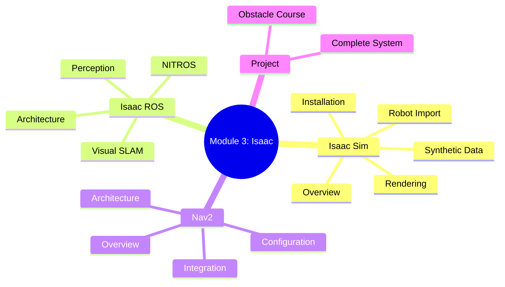

# Chapter 13: Module Summary and Assessment

:::note Learning Objectives
By the end of this chapter, you will be able to:
- Review all concepts covered in Module 3
- Test your knowledge with multiple-choice questions
- Complete practical exercises to demonstrate skills
- Identify areas for further learning
:::

## Module 3 Summary

### Key Topics Covered

### Chapter Summaries

| Chapter | Topic | Key Concepts |
|---------|-------|--------------|
| 1 | Isaac Sim Overview | Omniverse, USD, PhysX, RTX |
| 2 | Setup | Installation, configuration, workspace |
| 3 | Importing Robots | URDF to USD, articulations, physics |
| 4 | Rendering | PBR materials, lighting, cameras |
| 5 | Synthetic Data | Replicator, domain randomization, annotators |
| 6 | Isaac ROS | Architecture, NITROS, GPU acceleration |
| 7 | Visual SLAM | Stereo SLAM, IMU fusion, localization |
| 8 | Perception | Detection, segmentation, pose estimation |
| 9 | Nav2 Overview | Components, behavior trees, costmaps |
| 10 | Nav2 Architecture | Planners, controllers, lifecycle |
| 11 | Integration | VSLAM + Nav2, perception fusion |
| 12 | Mini Project | Complete navigation system |

### Skills Acquired

After completing this module, you can:

1. **Set up and configure NVIDIA Isaac Sim** for robotics simulation
2. **Import and configure robots** from URDF to USD format
3. **Create photorealistic environments** with PBR materials
4. **Generate synthetic training data** using Replicator
5. **Deploy Isaac ROS** for GPU-accelerated perception
6. **Implement Visual SLAM** for robot localization
7. **Configure Nav2** for autonomous navigation
8. **Integrate** simulation, perception, and navigation systems

---

## Multiple Choice Questions

:::info Assessment Instructions
Select the best answer for each question. Answers are provided at the end of this section.
:::

### Section A: Isaac Sim Fundamentals

**Question 1:** What is the primary file format used by Isaac Sim for scene description?

- A) URDF (Unified Robot Description Format)
- B) SDF (Simulation Description Format)
- C) USD (Universal Scene Description)
- D) COLLADA (.dae)

**Question 2:** Which NVIDIA technology provides physically-based rendering in Isaac Sim?

- A) CUDA
- B) RTX Ray Tracing
- C) TensorRT
- D) cuDNN

**Question 3:** What is the purpose of domain randomization in synthetic data generation?

- A) To reduce dataset size
- B) To improve sim-to-real transfer
- C) To speed up rendering
- D) To simplify labeling

**Question 4:** Which physics engine does Isaac Sim use?

- A) Bullet Physics
- B) ODE (Open Dynamics Engine)
- C) PhysX 5.0
- D) DART

**Question 5:** What does PBR stand for in material rendering?

- A) Pixel-Based Rendering
- B) Physically-Based Rendering
- C) Procedural Batch Rendering
- D) Progressive Bidirectional Rendering

### Section B: Isaac ROS

**Question 6:** What is NITROS in Isaac ROS?

- A) A new programming language
- B) GPU-accelerated data transport for ROS
- C) A robot operating system
- D) A simulation engine

**Question 7:** Which of the following is NOT a benefit of NITROS?

- A) Zero-copy data transfer
- B) Reduced CPU overhead
- C) Automatic code generation
- D) Lower latency

**Question 8:** Isaac ROS Visual SLAM uses which type of camera input?

- A) Monocular only
- B) Stereo cameras
- C) LiDAR only
- D) Thermal cameras

**Question 9:** What inference engine does Isaac ROS use for deep learning models?

- A) PyTorch
- B) TensorFlow
- C) TensorRT
- D) ONNX Runtime

**Question 10:** Which Isaac ROS package provides AprilTag detection?

- A) isaac_ros_visual_slam
- B) isaac_ros_apriltag
- C) isaac_ros_marker_detection
- D) isaac_ros_fiducial

### Section C: Nav2 Navigation

**Question 11:** What data structure does Nav2 use to represent obstacle costs?

- A) Occupancy Grid
- B) Point Cloud
- C) Costmap 2D
- D) Both A and C

**Question 12:** Which Nav2 component is responsible for determining the overall path from start to goal?

- A) Local Controller
- B) Global Planner
- C) Behavior Tree
- D) Recovery Server

**Question 13:** What is the purpose of the inflation layer in a costmap?

- A) To add visual effects
- B) To create a safety buffer around obstacles
- C) To reduce map size
- D) To speed up planning

**Question 14:** Which planner should be used for a car-like (Ackermann steering) robot?

- A) NavFn Planner
- B) Theta* Planner
- C) SMAC Hybrid-A* Planner
- D) Any of the above

**Question 15:** What triggers recovery behaviors in Nav2?

- A) User commands
- B) Navigation failures or getting stuck
- C) Low battery
- D) Sensor errors

### Section D: Integration and Application

**Question 16:** When integrating Isaac ROS VSLAM with Nav2, VSLAM replaces which component?

- A) Global Planner
- B) Local Controller
- C) AMCL (localization)
- D) Costmap 2D

**Question 17:** What transform does VSLAM publish when used with Nav2?

- A) base_link -> camera_link
- B) map -> odom
- C) odom -> base_link
- D) Both B and C

**Question 18:** Which ROS 2 message type is typically used for 2D object detections?

- A) sensor_msgs/Image
- B) vision_msgs/Detection2DArray
- C) nav_msgs/OccupancyGrid
- D) geometry_msgs/PoseArray

**Question 19:** What is the main advantage of using ComposableNodes in Isaac ROS?

- A) Simpler configuration
- B) Shared memory for NITROS transport
- C) Better visualization
- D) Reduced code size

**Question 20:** In the obstacle course project, what metric measures path optimality?

- A) Completion time
- B) Collision count
- C) Path efficiency (actual vs. ideal distance)
- D) Number of checkpoints

---

## Answer Key

| Question | Answer | Explanation |
|----------|--------|-------------|
| 1 | C | USD is Pixar's scene description format used throughout Omniverse |
| 2 | B | RTX provides hardware-accelerated ray tracing for photorealism |
| 3 | B | Domain randomization helps models generalize to real-world variations |
| 4 | C | PhysX 5.0 is NVIDIA's physics engine integrated with Omniverse |
| 5 | B | PBR simulates real-world light interaction with materials |
| 6 | B | NITROS enables zero-copy GPU data transport between ROS nodes |
| 7 | C | NITROS doesn't generate code; it provides transport optimization |
| 8 | B | cuVSLAM uses stereo cameras with optional IMU fusion |
| 9 | C | TensorRT provides optimized inference for NVIDIA GPUs |
| 10 | B | isaac_ros_apriltag provides GPU-accelerated AprilTag detection |
| 11 | D | Costmap 2D uses an occupancy grid structure with cost values |
| 12 | B | The Global Planner creates the overall path |
| 13 | B | Inflation adds cost around obstacles to keep the robot at safe distance |
| 14 | C | SMAC Hybrid-A* handles non-holonomic constraints |
| 15 | B | Recovery behaviors activate when navigation fails |
| 16 | C | VSLAM provides localization, replacing AMCL |
| 17 | D | VSLAM publishes map->odom and odom->base_link transforms |
| 18 | B | Detection2DArray contains 2D bounding boxes with class information |
| 19 | B | ComposableNodes enable NITROS zero-copy transport |
| 20 | C | Path efficiency compares actual traveled distance to ideal |

### Scoring Guide

| Score | Grade | Recommendation |
|-------|-------|----------------|
| 18-20 | A | Excellent! Ready for advanced topics |
| 15-17 | B | Good understanding, review missed topics |
| 12-14 | C | Satisfactory, more practice recommended |
| 9-11 | D | Needs improvement, revisit chapters |
| < 9 | F | Review module thoroughly before proceeding |

---

## Practical Exercises

### Exercise 1: Environment Creation (20 points)

Create an Isaac Sim environment with:
- A ground plane with PBR material
- 5 static obstacles with different materials
- 2 dynamic (moving) obstacles
- Proper lighting setup

**Deliverables:**
- Screenshot of the environment
- Python script used to create it

### Exercise 2: Synthetic Data Pipeline (25 points)

Build a Replicator pipeline that generates:
- RGB images (1280x720)
- Depth maps
- 2D bounding box annotations
- Semantic segmentation masks

With domain randomization for:
- Object positions
- Lighting intensity
- Camera position

**Deliverables:**
- Python script
- Sample output images and annotations (10 frames)

### Exercise 3: VSLAM Configuration (20 points)

Configure Isaac ROS Visual SLAM:
- Set up stereo camera input
- Enable IMU fusion
- Configure appropriate parameters for indoor environment
- Verify TF tree output

**Deliverables:**
- YAML configuration file
- Launch file
- Screenshot of RViz showing TF tree and landmarks

### Exercise 4: Nav2 Navigation (25 points)

Configure Nav2 for a differential drive robot:
- Set up global and local costmaps
- Configure DWB controller
- Create a custom behavior tree with recovery behaviors
- Navigate to 3 waypoints

**Deliverables:**
- Parameter YAML file
- Behavior tree XML
- Launch file
- Video or screenshots of successful navigation

### Exercise 5: System Integration (10 points)

Document your integrated system:
- Create a system architecture diagram
- List all ROS topics and their purposes
- Describe data flow from sensors to motor commands

**Deliverables:**
- Architecture diagram (Mermaid or draw.io)
- Topic documentation table

---

## Project Ideas for Further Learning

### Beginner Level

1. **Simple Object Follower**
   - Use Isaac ROS detection to identify objects
   - Control robot to follow detected object
   - Maintain safe distance

2. **Map Exploration**
   - Implement frontier-based exploration
   - Build map of unknown environment
   - Visualize exploration progress

### Intermediate Level

3. **Multi-Robot Coordination**
   - Simulate multiple robots in Isaac Sim
   - Implement task allocation
   - Avoid inter-robot collisions

4. **Outdoor Navigation**
   - Create outdoor environment with terrain
   - Configure SMAC planner for rough terrain
   - Handle GPS integration

### Advanced Level

5. **Humanoid Navigation**
   - Import humanoid robot model
   - Implement bipedal locomotion control
   - Navigate complex indoor environment

6. **Sim-to-Real Transfer**
   - Train perception model with synthetic data
   - Deploy on real robot
   - Document reality gap challenges

---

## Additional Resources

### Documentation

- [NVIDIA Isaac Sim Documentation](https://docs.omniverse.nvidia.com/isaacsim)
- [Isaac ROS Documentation](https://nvidia-isaac-ros.github.io)
- [Nav2 Documentation](https://navigation.ros.org)
- [ROS 2 Documentation](https://docs.ros.org/en/humble)

### Tutorials

- NVIDIA Deep Learning Institute courses
- ROS 2 Navigation tutorials
- Omniverse tutorials on YouTube

### Community

- NVIDIA Developer Forums
- ROS Discourse
- Isaac Sim GitHub Issues

---

## Module Completion Checklist

Before proceeding to the next module, ensure you can:

- [ ] Install and configure Isaac Sim
- [ ] Import URDF robots to USD format
- [ ] Create PBR materials and lighting setups
- [ ] Generate synthetic data with Replicator
- [ ] Set up Isaac ROS packages
- [ ] Configure Visual SLAM for localization
- [ ] Run object detection with Isaac ROS
- [ ] Configure Nav2 planners and controllers
- [ ] Tune costmaps for your robot
- [ ] Create custom behavior trees
- [ ] Integrate VSLAM with Nav2
- [ ] Complete the obstacle course project

---

## Congratulations!

You have completed **Module 3: AI-Robot Brain (NVIDIA Isaac)**!

You now have the skills to:
- Create realistic robot simulations
- Generate AI training data
- Deploy GPU-accelerated perception
- Implement autonomous navigation
- Integrate complex robotics systems

:::tip Next Steps
Continue to **Module 4** where you will learn about humanoid robot control, locomotion, and manipulation using reinforcement learning and motion planning.
:::

---

## Feedback

We value your feedback on this module. Please consider:
- Which chapters were most helpful?
- What topics need more explanation?
- What additional content would you like?

Your input helps improve future versions of this material.
