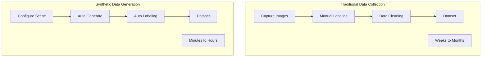
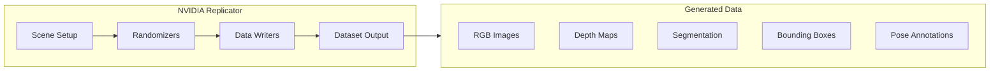
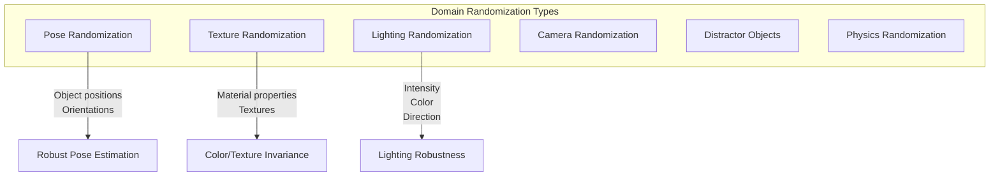
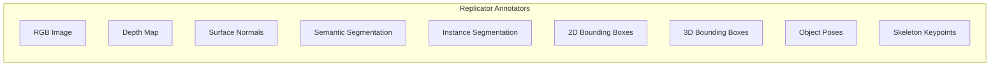

# Chapter 5: Synthetic Data Generation

:::note Learning Objectives
By the end of this chapter, you will be able to:
- Understand the role of synthetic data in robotics AI
- Use NVIDIA Replicator for automated data generation
- Configure domain randomization for robust training
- Generate annotated datasets for various perception tasks
- Set up data pipelines for continuous training
:::

## The Power of Synthetic Data

Training AI models traditionally requires massive amounts of hand-labeled real-world data. Synthetic data generation solves this by:



### Benefits of Synthetic Data

| Aspect | Real Data | Synthetic Data |
|--------|-----------|----------------|
| **Cost** | High (capture + labeling) | Low (compute only) |
| **Time** | Weeks/months | Hours |
| **Labels** | Manual, error-prone | Perfect, automatic |
| **Edge cases** | Hard to capture | Easy to generate |
| **Privacy** | Concerns | None |
| **Volume** | Limited | Unlimited |

## NVIDIA Replicator Overview

**Replicator** is Isaac Sim's built-in synthetic data generation framework.



### Replicator Components

1. **Scene Graph**: Objects and their properties
2. **Randomizers**: Modify scene properties randomly
3. **Annotators**: Generate ground truth labels
4. **Writers**: Save data to disk in various formats

## Basic Synthetic Data Pipeline

### Step 1: Set Up the Scene

```python
# synthetic_data_basic.py
"""
Basic synthetic data generation pipeline using Replicator.
"""

from isaacsim import SimulationApp

simulation_app = SimulationApp({"headless": True})

import omni.replicator.core as rep
from omni.isaac.core import World
from omni.isaac.core.utils.stage import add_reference_to_stage
from omni.isaac.core.utils.nucleus import get_assets_root_path
import numpy as np


def setup_scene():
    """Set up the basic scene for data generation."""
    world = World()

    # Add ground plane
    world.scene.add_default_ground_plane()

    # Get asset paths
    assets_root = get_assets_root_path()

    # Add some objects to the scene
    objects = [
        {"path": f"{assets_root}/Isaac/Props/YCB/Axis_Aligned/003_cracker_box.usd",
         "prim": "/World/Objects/CrackerBox"},
        {"path": f"{assets_root}/Isaac/Props/YCB/Axis_Aligned/004_sugar_box.usd",
         "prim": "/World/Objects/SugarBox"},
        {"path": f"{assets_root}/Isaac/Props/YCB/Axis_Aligned/005_tomato_soup_can.usd",
         "prim": "/World/Objects/SoupCan"},
    ]

    for obj in objects:
        add_reference_to_stage(usd_path=obj["path"], prim_path=obj["prim"])

    return world


def create_camera():
    """Create a camera for data capture."""
    camera = rep.create.camera(
        position=(1.5, 1.5, 1.0),
        look_at=(0, 0, 0.3),
        focal_length=24.0
    )
    return camera


def create_lights():
    """Create lighting for the scene."""
    # Dome light for ambient illumination
    dome_light = rep.create.light(
        light_type="Dome",
        rotation=(270, 0, 0),
        intensity=1000.0
    )

    # Directional light for shadows
    directional_light = rep.create.light(
        light_type="Distant",
        rotation=(315, 45, 0),
        intensity=2000.0
    )

    return dome_light, directional_light


# Main data generation
world = setup_scene()
camera = create_camera()
dome_light, dir_light = create_lights()

# Create render product (what the camera sees)
render_product = rep.create.render_product(camera, (1280, 720))

# Initialize Replicator
rep.orchestrator._orchestrator._is_started = True

# Configure output writer
writer = rep.WriterRegistry.get("BasicWriter")
writer.initialize(
    output_dir="_output/synthetic_data",
    rgb=True,
    bounding_box_2d_loose=True,
    semantic_segmentation=True,
    distance_to_camera=True
)
writer.attach([render_product])

# Generate frames
for i in range(100):
    rep.orchestrator.step()
    print(f"Generated frame {i+1}/100")

print("Data generation complete!")
simulation_app.close()
```

## Domain Randomization

Domain randomization is key to training robust models that work in the real world.

### Types of Randomization



### Implementing Domain Randomization

```python
# domain_randomization.py
"""
Comprehensive domain randomization for robust training.
"""

import omni.replicator.core as rep
from omni.replicator.core import distribution
import numpy as np


def setup_object_randomization(object_paths: list):
    """
    Set up randomization for object poses.

    Args:
        object_paths: List of USD prim paths for objects
    """
    with rep.trigger.on_frame(num_frames=1000):
        # Randomize positions on table surface
        with rep.get.prims(path_pattern="/World/Objects/*"):
            rep.modify.pose(
                position=distribution.uniform(
                    (-0.3, -0.3, 0.05),
                    (0.3, 0.3, 0.05)
                ),
                rotation=distribution.uniform(
                    (0, 0, 0),
                    (0, 0, 360)
                )
            )


def setup_lighting_randomization():
    """Randomize lighting conditions."""
    with rep.trigger.on_frame():
        # Randomize dome light intensity
        with rep.get.prims(path_pattern="/World/Lights/DomeLight"):
            rep.modify.attribute(
                "intensity",
                distribution.uniform(500, 2000)
            )

        # Randomize directional light
        with rep.get.prims(path_pattern="/World/Lights/DirectionalLight"):
            rep.modify.attribute(
                "intensity",
                distribution.uniform(1000, 4000)
            )
            rep.modify.pose(
                rotation=distribution.uniform(
                    (270, 0, 0),
                    (360, 90, 0)
                )
            )


def setup_material_randomization():
    """Randomize material properties."""

    # Create a pool of material variations
    materials = [
        "/World/Looks/PlasticRed",
        "/World/Looks/PlasticBlue",
        "/World/Looks/MetalBrushed",
        "/World/Looks/WoodOak",
    ]

    with rep.trigger.on_frame():
        # Randomize material parameters
        with rep.get.prims(path_pattern="/World/Looks/*"):
            rep.modify.attribute(
                "roughness_constant",
                distribution.uniform(0.1, 0.9)
            )


def setup_camera_randomization(camera_prim):
    """Randomize camera position and properties."""
    with rep.trigger.on_frame():
        with rep.get.prims(path_pattern=camera_prim):
            rep.modify.pose(
                position=distribution.uniform(
                    (1.0, -1.0, 0.5),
                    (2.0, 1.0, 1.5)
                ),
                look_at=(0, 0, 0.2)
            )


def setup_distractor_objects(num_distractors: int = 5):
    """
    Add random distractor objects to increase dataset variety.
    """
    # Create distractor objects
    distractors = []
    for i in range(num_distractors):
        # Randomly choose between shapes
        shape = np.random.choice(["cube", "sphere", "cylinder"])

        if shape == "cube":
            distractor = rep.create.cube(
                position=(0, 0, 0.5),
                scale=distribution.uniform((0.02, 0.02, 0.02), (0.08, 0.08, 0.08)),
                semantics=[("class", "distractor")]
            )
        elif shape == "sphere":
            distractor = rep.create.sphere(
                position=(0, 0, 0.5),
                scale=distribution.uniform(0.02, 0.05),
                semantics=[("class", "distractor")]
            )
        else:
            distractor = rep.create.cylinder(
                position=(0, 0, 0.5),
                scale=distribution.uniform((0.02, 0.02, 0.02), (0.05, 0.05, 0.1)),
                semantics=[("class", "distractor")]
            )

        distractors.append(distractor)

    # Randomize distractor positions
    with rep.trigger.on_frame():
        with rep.get.prims(semantics=[("class", "distractor")]):
            rep.modify.pose(
                position=distribution.uniform(
                    (-0.5, -0.5, 0.01),
                    (0.5, 0.5, 0.2)
                )
            )
            rep.modify.visibility(
                distribution.choice([True, False], weights=[0.7, 0.3])
            )

    return distractors
```

## Annotators and Ground Truth

### Available Annotators



### Configuring Annotators

```python
# annotator_setup.py
"""
Configure annotators for various perception tasks.
"""

import omni.replicator.core as rep


def setup_detection_annotators(render_product):
    """
    Set up annotators for object detection training.

    Generates: RGB, 2D bounding boxes, semantic segmentation
    """
    # RGB annotator
    rgb = rep.AnnotatorRegistry.get_annotator("rgb")
    rgb.attach([render_product])

    # 2D bounding boxes (loose = includes occluded parts)
    bbox_2d = rep.AnnotatorRegistry.get_annotator("bounding_box_2d_loose")
    bbox_2d.attach([render_product])

    # Semantic segmentation
    semantic = rep.AnnotatorRegistry.get_annotator("semantic_segmentation")
    semantic.attach([render_product])

    return {"rgb": rgb, "bbox_2d": bbox_2d, "semantic": semantic}


def setup_depth_annotators(render_product):
    """
    Set up annotators for depth estimation training.

    Generates: RGB, depth map, surface normals
    """
    rgb = rep.AnnotatorRegistry.get_annotator("rgb")
    rgb.attach([render_product])

    # Depth (distance to camera)
    depth = rep.AnnotatorRegistry.get_annotator("distance_to_camera")
    depth.attach([render_product])

    # Surface normals
    normals = rep.AnnotatorRegistry.get_annotator("normals")
    normals.attach([render_product])

    return {"rgb": rgb, "depth": depth, "normals": normals}


def setup_pose_annotators(render_product):
    """
    Set up annotators for 6-DoF pose estimation.

    Generates: RGB, 3D bounding boxes, object poses
    """
    rgb = rep.AnnotatorRegistry.get_annotator("rgb")
    rgb.attach([render_product])

    # 3D bounding boxes
    bbox_3d = rep.AnnotatorRegistry.get_annotator("bounding_box_3d")
    bbox_3d.attach([render_product])

    # Instance segmentation (for disambiguation)
    instance = rep.AnnotatorRegistry.get_annotator("instance_segmentation")
    instance.attach([render_product])

    return {"rgb": rgb, "bbox_3d": bbox_3d, "instance": instance}


def setup_humanoid_annotators(render_product):
    """
    Set up annotators for humanoid robot perception.

    Generates: RGB, skeleton keypoints, semantic segmentation
    """
    rgb = rep.AnnotatorRegistry.get_annotator("rgb")
    rgb.attach([render_product])

    # Skeleton/keypoint annotations
    skeleton = rep.AnnotatorRegistry.get_annotator("skeleton_data")
    skeleton.attach([render_product])

    # Semantic segmentation for body parts
    semantic = rep.AnnotatorRegistry.get_annotator("semantic_segmentation")
    semantic.attach([render_product])

    return {"rgb": rgb, "skeleton": skeleton, "semantic": semantic}
```

## Data Writers and Formats

### Built-in Writers

```python
# data_writers.py
"""
Configure data writers for different output formats.
"""

import omni.replicator.core as rep


def setup_coco_writer(render_products, output_dir: str):
    """
    Set up COCO format writer for object detection.

    Output: COCO JSON annotations + images
    """
    writer = rep.WriterRegistry.get("CocoWriter")
    writer.initialize(
        output_dir=output_dir,
        semantic_types=["class"],
        rgb=True,
        bounding_box_2d_loose=True,
        semantic_segmentation=True
    )
    writer.attach(render_products)
    return writer


def setup_kitti_writer(render_products, output_dir: str):
    """
    Set up KITTI format writer for autonomous driving.

    Output: KITTI format labels + images
    """
    writer = rep.WriterRegistry.get("KittiWriter")
    writer.initialize(
        output_dir=output_dir,
        rgb=True,
        bounding_box_2d_loose=True,
        bounding_box_3d=True
    )
    writer.attach(render_products)
    return writer


def setup_basic_writer(render_products, output_dir: str,
                       rgb=True, depth=True, segmentation=True):
    """
    Set up basic writer with configurable outputs.

    Output: Individual files per frame
    """
    writer = rep.WriterRegistry.get("BasicWriter")
    writer.initialize(
        output_dir=output_dir,
        rgb=rgb,
        distance_to_camera=depth,
        semantic_segmentation=segmentation,
        instance_segmentation=True,
        bounding_box_2d_loose=True,
        colorize_semantic_segmentation=True,
        colorize_instance_segmentation=True
    )
    writer.attach(render_products)
    return writer


def setup_custom_writer(render_products, output_dir: str):
    """
    Create a custom writer for specialized output formats.
    """
    class CustomWriter(rep.Writer):
        def __init__(self, output_dir: str):
            self._output_dir = output_dir
            self._frame_id = 0

        def write(self, data):
            """Custom write logic."""
            import json
            import cv2
            import os

            # Get annotator data
            rgb_data = data.get("rgb")
            bbox_data = data.get("bounding_box_2d_loose")

            if rgb_data is not None:
                # Save RGB image
                rgb_path = os.path.join(
                    self._output_dir,
                    f"rgb_{self._frame_id:06d}.png"
                )
                cv2.imwrite(rgb_path, rgb_data[:, :, ::-1])  # RGB to BGR

            if bbox_data is not None:
                # Save annotations as JSON
                anno_path = os.path.join(
                    self._output_dir,
                    f"anno_{self._frame_id:06d}.json"
                )
                with open(anno_path, 'w') as f:
                    json.dump(bbox_data.tolist(), f)

            self._frame_id += 1

    # Register custom writer
    rep.WriterRegistry.register(CustomWriter)

    writer = rep.WriterRegistry.get("CustomWriter")
    writer.initialize(output_dir=output_dir)
    writer.attach(render_products)

    return writer
```

## Complete Data Generation Pipeline

```python
# complete_pipeline.py
"""
Complete synthetic data generation pipeline for humanoid robot perception.
"""

from isaacsim import SimulationApp

config = {
    "headless": True,
    "width": 1280,
    "height": 720
}
simulation_app = SimulationApp(config)

import omni.replicator.core as rep
from omni.replicator.core import distribution
from omni.isaac.core import World
from omni.isaac.core.utils.nucleus import get_assets_root_path
import os


class SyntheticDataPipeline:
    """Complete pipeline for generating synthetic training data."""

    def __init__(self, output_dir: str, num_frames: int = 1000):
        self.output_dir = output_dir
        self.num_frames = num_frames
        self.world = None
        self.camera = None
        self.render_product = None
        self.writer = None

    def setup_scene(self):
        """Set up the simulation scene."""
        self.world = World(stage_units_in_meters=1.0)
        self.world.scene.add_default_ground_plane()

        # Add environment
        self._add_environment()

        # Add target objects
        self._add_target_objects()

        # Add distractors
        self._add_distractors()

        self.world.reset()

    def _add_environment(self):
        """Add environmental elements."""
        # Add a table
        rep.create.cube(
            position=(0, 0, 0.4),
            scale=(1.0, 0.6, 0.02),
            semantics=[("class", "table")]
        )

        # Add walls (for reflections and lighting)
        rep.create.cube(
            position=(-1.5, 0, 1),
            scale=(0.1, 3, 2),
            semantics=[("class", "wall")]
        )

    def _add_target_objects(self):
        """Add objects to detect/manipulate."""
        assets_root = get_assets_root_path()

        # YCB objects commonly used in manipulation research
        ycb_objects = [
            ("003_cracker_box", "box"),
            ("004_sugar_box", "box"),
            ("005_tomato_soup_can", "can"),
            ("006_mustard_bottle", "bottle"),
            ("007_tuna_fish_can", "can"),
            ("008_pudding_box", "box"),
        ]

        for obj_name, obj_class in ycb_objects:
            obj_path = f"{assets_root}/Isaac/Props/YCB/Axis_Aligned/{obj_name}.usd"
            rep.create.from_usd(
                obj_path,
                semantics=[("class", obj_class), ("object", obj_name)]
            )

    def _add_distractors(self):
        """Add distractor objects for robust training."""
        for i in range(10):
            shape = rep.create.sphere(
                scale=distribution.uniform(0.01, 0.03),
                semantics=[("class", "distractor")]
            )

    def setup_camera(self):
        """Set up camera for data capture."""
        self.camera = rep.create.camera(
            position=(1.5, 0, 1.2),
            look_at=(0, 0, 0.4),
            focal_length=24.0,
            f_stop=2.8
        )

        self.render_product = rep.create.render_product(
            self.camera,
            (1280, 720)
        )

    def setup_lighting(self):
        """Set up scene lighting."""
        # Dome light for ambient
        self.dome_light = rep.create.light(
            light_type="Dome",
            intensity=1000,
            texture=None  # Could use HDRI
        )

        # Key light
        self.key_light = rep.create.light(
            light_type="Distant",
            rotation=(315, 45, 0),
            intensity=2500
        )

        # Fill light
        self.fill_light = rep.create.light(
            light_type="Sphere",
            position=(2, 2, 2),
            intensity=1000,
            scale=0.5
        )

    def setup_randomization(self):
        """Configure domain randomization."""
        with rep.trigger.on_frame(num_frames=self.num_frames):
            # Randomize object positions on table
            with rep.get.prims(semantics=[("class", "box")]):
                rep.modify.pose(
                    position=distribution.uniform(
                        (-0.4, -0.25, 0.45),
                        (0.4, 0.25, 0.45)
                    ),
                    rotation=distribution.uniform(
                        (0, 0, 0),
                        (0, 0, 360)
                    )
                )

            with rep.get.prims(semantics=[("class", "can")]):
                rep.modify.pose(
                    position=distribution.uniform(
                        (-0.4, -0.25, 0.45),
                        (0.4, 0.25, 0.5)
                    ),
                    rotation=distribution.uniform(
                        (-15, -15, 0),
                        (15, 15, 360)
                    )
                )

            with rep.get.prims(semantics=[("class", "bottle")]):
                rep.modify.pose(
                    position=distribution.uniform(
                        (-0.4, -0.25, 0.45),
                        (0.4, 0.25, 0.5)
                    ),
                    rotation=distribution.uniform(
                        (-5, -5, 0),
                        (5, 5, 360)
                    )
                )

            # Randomize distractors
            with rep.get.prims(semantics=[("class", "distractor")]):
                rep.modify.pose(
                    position=distribution.uniform(
                        (-0.5, -0.3, 0.42),
                        (0.5, 0.3, 0.6)
                    )
                )
                rep.modify.visibility(
                    distribution.choice([True, False], weights=[0.5, 0.5])
                )

            # Randomize camera position
            with rep.get.prims(path_pattern=self.camera.get_path()):
                rep.modify.pose(
                    position=distribution.uniform(
                        (1.0, -1.0, 0.8),
                        (2.0, 1.0, 1.5)
                    ),
                    look_at=(0, 0, 0.45)
                )

            # Randomize lighting
            with rep.get.prims(light_type="Distant"):
                rep.modify.attribute(
                    "intensity",
                    distribution.uniform(1500, 4000)
                )

    def setup_writer(self):
        """Set up data writer."""
        os.makedirs(self.output_dir, exist_ok=True)

        self.writer = rep.WriterRegistry.get("BasicWriter")
        self.writer.initialize(
            output_dir=self.output_dir,
            rgb=True,
            bounding_box_2d_tight=True,
            bounding_box_2d_loose=True,
            semantic_segmentation=True,
            instance_segmentation=True,
            distance_to_camera=True,
            bounding_box_3d=True,
            occlusion=True,
            colorize_semantic_segmentation=True,
            colorize_instance_segmentation=True
        )
        self.writer.attach([self.render_product])

    def generate(self):
        """Run the data generation pipeline."""
        print(f"Generating {self.num_frames} frames...")
        print(f"Output directory: {self.output_dir}")

        for i in range(self.num_frames):
            rep.orchestrator.step()

            if (i + 1) % 100 == 0:
                print(f"Progress: {i + 1}/{self.num_frames} frames")

        print("Data generation complete!")

    def run(self):
        """Execute the complete pipeline."""
        self.setup_scene()
        self.setup_camera()
        self.setup_lighting()
        self.setup_randomization()
        self.setup_writer()
        self.generate()


# Run pipeline
if __name__ == "__main__":
    pipeline = SyntheticDataPipeline(
        output_dir="_output/humanoid_perception_data",
        num_frames=5000
    )
    pipeline.run()

    simulation_app.close()
```

## Summary

In this chapter, you learned:

- Synthetic data enables unlimited, perfectly-labeled training data
- NVIDIA Replicator provides a complete data generation framework
- Domain randomization improves sim-to-real transfer
- Multiple annotators support various perception tasks
- Writers export data in standard formats (COCO, KITTI, etc.)

:::tip Key Takeaways
1. **Synthetic beats manual** - faster, cheaper, more accurate labels
2. **Randomization is crucial** - varied training data = robust models
3. **Choose annotators wisely** - match annotators to your task
4. **Standard formats** - use COCO/KITTI for compatibility with training frameworks
:::

## Next Steps

With synthetic data generation understood, the next chapter introduces Isaac ROS for connecting simulation to ROS 2.

---

## Review Questions

1. What are three advantages of synthetic data over real-world data?
2. What is domain randomization and why is it important?
3. Name four types of annotators available in Replicator.
4. What is the difference between semantic and instance segmentation?
5. How do you configure a data writer for COCO format output?

## Exercises

### Exercise 5.1: Basic Data Generation
Create a pipeline that generates 100 images of random geometric shapes (cubes, spheres, cylinders) with 2D bounding box annotations.

### Exercise 5.2: Domain Randomization
Extend Exercise 5.1 to include lighting randomization (intensity, color, direction) and material randomization (roughness, base color).

### Exercise 5.3: Multi-Camera Setup
Create a scene with three cameras at different viewpoints and generate synchronized data from all cameras for multi-view training.
