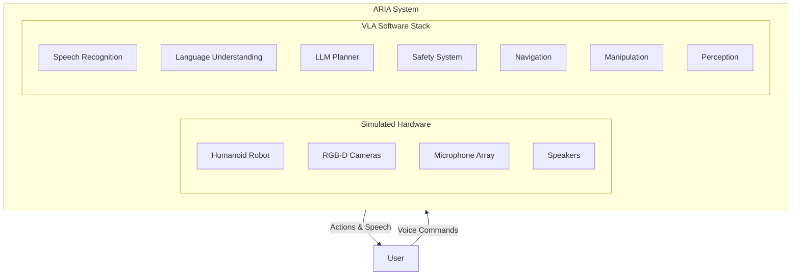
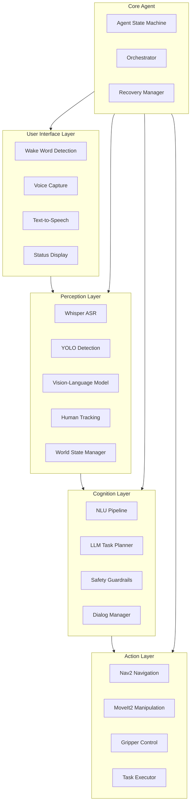

# Chapter 12: Capstone Project - Autonomous Humanoid Assistant

:::note Learning Objectives
By the end of this chapter, you will be able to:
- Design and implement a complete VLA humanoid robot system
- Integrate all module components into a working prototype
- Handle real-world scenarios with voice-controlled operation
- Test and validate system performance
- Document and present your capstone project
:::

## Project Overview

In this capstone project, you will build "ARIA" (Autonomous Robotic Interactive Assistant) - a voice-controlled humanoid robot capable of understanding natural language commands and executing physical tasks in a home environment.



## Project Requirements

### Functional Requirements

| Requirement | Description | Priority |
|-------------|-------------|----------|
| FR1 | Respond to wake word "Hey ARIA" | Must Have |
| FR2 | Understand natural language commands | Must Have |
| FR3 | Navigate to named locations | Must Have |
| FR4 | Pick up and place objects | Must Have |
| FR5 | Provide voice feedback during tasks | Must Have |
| FR6 | Handle command clarification | Should Have |
| FR7 | Execute multi-step tasks | Should Have |
| FR8 | Remember user preferences | Nice to Have |

### Non-Functional Requirements

| Requirement | Description | Target |
|-------------|-------------|--------|
| NFR1 | Voice response latency | < 3 seconds |
| NFR2 | Navigation success rate | > 90% |
| NFR3 | Manipulation success rate | > 80% |
| NFR4 | Safety stop response time | < 100ms |
| NFR5 | Continuous operation time | > 1 hour |

## System Architecture



## Implementation Guide

### Phase 1: Foundation (Week 1)

#### Task 1.1: Environment Setup

```bash
# Create ROS 2 workspace
mkdir -p ~/aria_ws/src
cd ~/aria_ws/src

# Create packages
ros2 pkg create aria_bringup --build-type ament_python
ros2 pkg create aria_perception --build-type ament_python
ros2 pkg create aria_cognition --build-type ament_python
ros2 pkg create aria_action --build-type ament_python
ros2 pkg create aria_interfaces --build-type ament_cmake

# Build
cd ~/aria_ws
colcon build
```

#### Task 1.2: Custom Message Definitions

```
# aria_interfaces/msg/ParsedCommand.msg
string raw_text
string intent
string[] entity_names
string[] entity_values
float32 confidence
bool requires_clarification
string clarification_question
```

```
# aria_interfaces/msg/TaskPlan.msg
string task_id
string task_summary
aria_interfaces/PlanStep[] steps
float32 estimated_duration
string risk_level
```

```
# aria_interfaces/msg/PlanStep.msg
int32 step_id
string action
string parameters_json
string description
string success_condition
```

#### Task 1.3: Configuration Files

```yaml
# config/aria_config.yaml
aria:
  ros__parameters:
    # Speech Recognition
    asr:
      model: "base"
      language: "en"
      sample_rate: 16000

    # LLM Planning
    planner:
      provider: "openai"
      model: "gpt-4-turbo-preview"
      temperature: 0.2
      max_tokens: 2000

    # Safety
    safety:
      max_speed: 0.5
      min_human_distance: 0.5
      emergency_stop_enabled: true

    # Navigation
    navigation:
      position_tolerance: 0.3
      orientation_tolerance: 0.2

    # Manipulation
    manipulation:
      max_grasp_force: 30.0
      approach_distance: 0.1
```

### Phase 2: Perception System (Week 2)

#### Task 2.1: Integrated Perception Node

```python
#!/usr/bin/env python3
"""
aria_perception/perception_node.py
"""

import rclpy
from rclpy.node import Node
from sensor_msgs.msg import Image, CameraInfo
from aria_interfaces.msg import WorldState, DetectedObject
from cv_bridge import CvBridge
from ultralytics import YOLO
import numpy as np

class ARIAPerceptionNode(Node):
    def __init__(self):
        super().__init__('aria_perception')

        # Load models
        self.yolo = YOLO('yolov8n.pt')
        self.bridge = CvBridge()

        # World state
        self.detected_objects = []
        self.tracked_humans = []

        # Publishers
        self.world_state_pub = self.create_publisher(
            WorldState, '/aria/world_state', 10
        )

        # Subscribers
        self.image_sub = self.create_subscription(
            Image, '/camera/image_raw', self.image_callback, 10
        )

        # Timer for world state publishing
        self.create_timer(0.1, self.publish_world_state)

        self.get_logger().info('ARIA Perception initialized')

    def image_callback(self, msg):
        cv_image = self.bridge.imgmsg_to_cv2(msg, 'bgr8')
        results = self.yolo(cv_image, verbose=False)

        self.detected_objects = []
        for result in results:
            for box in result.boxes:
                obj = DetectedObject()
                obj.class_name = self.yolo.names[int(box.cls[0])]
                obj.confidence = float(box.conf[0])
                x1, y1, x2, y2 = box.xyxy[0].cpu().numpy()
                obj.bbox_x = int((x1 + x2) / 2)
                obj.bbox_y = int((y1 + y2) / 2)
                obj.bbox_width = int(x2 - x1)
                obj.bbox_height = int(y2 - y1)
                self.detected_objects.append(obj)

    def publish_world_state(self):
        msg = WorldState()
        msg.header.stamp = self.get_clock().now().to_msg()
        msg.detected_objects = self.detected_objects
        self.world_state_pub.publish(msg)


def main():
    rclpy.init()
    node = ARIAPerceptionNode()
    rclpy.spin(node)
    rclpy.shutdown()

if __name__ == '__main__':
    main()
```

### Phase 3: Cognition System (Week 3)

#### Task 3.1: ARIA NLU and Planner

```python
#!/usr/bin/env python3
"""
aria_cognition/cognition_node.py
"""

import rclpy
from rclpy.node import Node
from std_msgs.msg import String
from aria_interfaces.msg import ParsedCommand, TaskPlan, PlanStep
from aria_interfaces.srv import PlanTask
import json
from openai import OpenAI

class ARIACognitionNode(Node):

    ARIA_SYSTEM_PROMPT = """
    You are ARIA, an Autonomous Robotic Interactive Assistant.
    You help users with tasks in their home by navigating and manipulating objects.

    Available locations: kitchen, living room, bedroom, bathroom, dining table, sofa
    Available actions: navigate_to, scan_area, approach, grasp, place_on, hand_over, say

    When given a command, create a step-by-step plan using only these actions.
    Always confirm dangerous or irreversible actions.
    Keep users informed of your progress.

    Return plans as JSON:
    {
        "task_summary": "brief description",
        "steps": [
            {"step_id": 1, "action": "action_name", "parameters": {}, "description": "..."}
        ],
        "estimated_duration": 30,
        "risk_level": "low"
    }
    """

    def __init__(self):
        super().__init__('aria_cognition')

        self.client = OpenAI()

        # Service for task planning
        self.plan_srv = self.create_service(
            PlanTask, '/aria/plan_task', self.plan_task_callback
        )

        # Publishers
        self.plan_pub = self.create_publisher(TaskPlan, '/aria/task_plan', 10)

        self.get_logger().info('ARIA Cognition initialized')

    def plan_task_callback(self, request, response):
        command = request.command
        world_state = request.world_state

        # Format prompt
        prompt = f"""
        User command: "{command}"

        Current world state:
        - Robot location: {world_state.robot_location}
        - Detected objects: {[obj.class_name for obj in world_state.detected_objects]}

        Generate a plan to accomplish this task.
        """

        # Call LLM
        llm_response = self.client.chat.completions.create(
            model="gpt-4-turbo-preview",
            messages=[
                {"role": "system", "content": self.ARIA_SYSTEM_PROMPT},
                {"role": "user", "content": prompt}
            ],
            response_format={"type": "json_object"}
        )

        plan_json = json.loads(llm_response.choices[0].message.content)

        # Convert to ROS message
        plan_msg = TaskPlan()
        plan_msg.task_summary = plan_json['task_summary']
        plan_msg.estimated_duration = float(plan_json['estimated_duration'])
        plan_msg.risk_level = plan_json['risk_level']

        for step_data in plan_json['steps']:
            step = PlanStep()
            step.step_id = step_data['step_id']
            step.action = step_data['action']
            step.parameters_json = json.dumps(step_data.get('parameters', {}))
            step.description = step_data['description']
            plan_msg.steps.append(step)

        response.plan = plan_msg
        response.success = True

        return response
```

### Phase 4: Action System (Week 4)

#### Task 4.1: ARIA Task Executor

```python
#!/usr/bin/env python3
"""
aria_action/task_executor.py
"""

import rclpy
from rclpy.node import Node
from rclpy.action import ActionServer, ActionClient
from aria_interfaces.action import ExecuteTask
from aria_interfaces.msg import TaskPlan, PlanStep
from nav2_msgs.action import NavigateToPose
from std_msgs.msg import String
import json
import asyncio

class ARIATaskExecutor(Node):
    def __init__(self):
        super().__init__('aria_task_executor')

        # Action server for task execution
        self._action_server = ActionServer(
            self,
            ExecuteTask,
            '/aria/execute_task',
            self.execute_task_callback
        )

        # Action clients
        self.nav_client = ActionClient(self, NavigateToPose, 'navigate_to_pose')

        # Publishers
        self.status_pub = self.create_publisher(String, '/aria/task_status', 10)
        self.speech_pub = self.create_publisher(String, '/aria/speech_output', 10)

        # Semantic locations
        self.locations = {
            'kitchen': (5.2, 3.1, 1.57),
            'living room': (2.0, 1.5, 0.0),
            'dining table': (4.0, 2.5, 0.0),
            'sofa': (1.5, 1.0, 3.14),
            'front door': (0.5, 0.0, 0.0)
        }

        self.get_logger().info('ARIA Task Executor initialized')

    async def execute_task_callback(self, goal_handle):
        plan = goal_handle.request.plan
        feedback_msg = ExecuteTask.Feedback()

        self.speak(f"Starting task: {plan.task_summary}")

        for i, step in enumerate(plan.steps):
            # Update feedback
            feedback_msg.current_step = i + 1
            feedback_msg.total_steps = len(plan.steps)
            feedback_msg.current_action = step.description
            goal_handle.publish_feedback(feedback_msg)

            self.publish_status(f"Step {i+1}/{len(plan.steps)}: {step.description}")

            # Execute step
            success = await self.execute_step(step)

            if not success:
                goal_handle.abort()
                result = ExecuteTask.Result()
                result.success = False
                result.message = f"Failed at step {i+1}: {step.description}"
                return result

        # Success
        self.speak("Task completed successfully!")
        goal_handle.succeed()

        result = ExecuteTask.Result()
        result.success = True
        result.message = "Task completed"
        return result

    async def execute_step(self, step: PlanStep) -> bool:
        action = step.action
        params = json.loads(step.parameters_json)

        self.get_logger().info(f'Executing: {action}({params})')

        if action == 'navigate_to':
            return await self.execute_navigate(params)
        elif action == 'scan_area':
            return await self.execute_scan(params)
        elif action == 'approach':
            return await self.execute_approach(params)
        elif action == 'grasp':
            return await self.execute_grasp(params)
        elif action == 'place_on':
            return await self.execute_place(params)
        elif action == 'hand_over':
            return await self.execute_handover(params)
        elif action == 'say':
            self.speak(params.get('message', ''))
            return True
        else:
            self.get_logger().warning(f'Unknown action: {action}')
            return False

    async def execute_navigate(self, params: dict) -> bool:
        location = params.get('location', '')

        if location not in self.locations:
            self.speak(f"I don't know where {location} is.")
            return False

        x, y, theta = self.locations[location]
        self.speak(f"Navigating to {location}")

        # Send navigation goal
        goal = NavigateToPose.Goal()
        goal.pose.header.frame_id = 'map'
        goal.pose.pose.position.x = x
        goal.pose.pose.position.y = y
        goal.pose.pose.orientation.z = np.sin(theta / 2)
        goal.pose.pose.orientation.w = np.cos(theta / 2)

        # In simulation, this would be the actual nav call
        await asyncio.sleep(2)  # Simulated navigation

        return True

    async def execute_scan(self, params: dict) -> bool:
        self.speak("Looking around...")
        await asyncio.sleep(1)
        return True

    async def execute_approach(self, params: dict) -> bool:
        obj = params.get('object', 'object')
        self.speak(f"Approaching {obj}")
        await asyncio.sleep(1)
        return True

    async def execute_grasp(self, params: dict) -> bool:
        obj = params.get('object', 'object')
        self.speak(f"Picking up {obj}")
        await asyncio.sleep(2)
        return True

    async def execute_place(self, params: dict) -> bool:
        surface = params.get('surface', 'surface')
        self.speak(f"Placing on {surface}")
        await asyncio.sleep(1)
        return True

    async def execute_handover(self, params: dict) -> bool:
        self.speak("Here you go!")
        await asyncio.sleep(1)
        return True

    def speak(self, text: str):
        msg = String()
        msg.data = text
        self.speech_pub.publish(msg)
        self.get_logger().info(f'ARIA: "{text}"')

    def publish_status(self, status: str):
        msg = String()
        msg.data = status
        self.status_pub.publish(msg)
```

### Phase 5: Integration (Week 5)

#### Task 5.1: Main ARIA Agent

```python
#!/usr/bin/env python3
"""
aria_bringup/aria_agent.py - Main ARIA Agent
"""

import rclpy
from rclpy.node import Node
from rclpy.action import ActionClient
from std_msgs.msg import String
from aria_interfaces.msg import WorldState, TaskPlan
from aria_interfaces.srv import PlanTask
from aria_interfaces.action import ExecuteTask
import asyncio

class ARIAAgent(Node):
    """Main ARIA Agent - Orchestrates all subsystems"""

    def __init__(self):
        super().__init__('aria_agent')

        # Service clients
        self.plan_client = self.create_client(PlanTask, '/aria/plan_task')

        # Action clients
        self.execute_client = ActionClient(self, ExecuteTask, '/aria/execute_task')

        # Subscribers
        self.speech_sub = self.create_subscription(
            String, '/aria/speech_input', self.on_speech, 10
        )
        self.world_state_sub = self.create_subscription(
            WorldState, '/aria/world_state', self.on_world_state, 10
        )

        # Publishers
        self.speech_out_pub = self.create_publisher(String, '/aria/speech_output', 10)
        self.status_pub = self.create_publisher(String, '/aria/status', 10)

        # State
        self.world_state = WorldState()
        self.is_busy = False

        # Startup message
        self.speak("Hello! I'm ARIA, your robotic assistant. How can I help you?")

        self.get_logger().info('ARIA Agent ready')

    def on_speech(self, msg: String):
        """Handle incoming speech commands"""
        if self.is_busy:
            self.speak("I'm currently busy. Please wait.")
            return

        command = msg.data
        self.get_logger().info(f'Received command: "{command}"')

        # Process command
        asyncio.run(self.process_command(command))

    def on_world_state(self, msg: WorldState):
        """Update world state"""
        self.world_state = msg

    async def process_command(self, command: str):
        """Process a voice command"""
        self.is_busy = True

        try:
            # Generate plan
            self.speak("Let me think about how to do that...")

            plan = await self.generate_plan(command)

            if plan is None:
                self.speak("I'm not sure how to do that.")
                return

            # Confirm if needed
            self.speak(f"I'll {plan.task_summary}. Starting now.")

            # Execute plan
            success = await self.execute_plan(plan)

            if success:
                self.speak("All done!")
            else:
                self.speak("I had some trouble completing the task.")

        finally:
            self.is_busy = False

    async def generate_plan(self, command: str) -> TaskPlan:
        """Generate task plan from command"""
        request = PlanTask.Request()
        request.command = command
        request.world_state = self.world_state

        future = self.plan_client.call_async(request)
        response = await future

        if response.success:
            return response.plan
        return None

    async def execute_plan(self, plan: TaskPlan) -> bool:
        """Execute task plan"""
        goal = ExecuteTask.Goal()
        goal.plan = plan

        goal_handle = await self.execute_client.send_goal_async(goal)

        if not goal_handle.accepted:
            return False

        result = await goal_handle.get_result_async()
        return result.result.success

    def speak(self, text: str):
        """Output speech"""
        msg = String()
        msg.data = text
        self.speech_out_pub.publish(msg)


def main():
    rclpy.init()
    agent = ARIAAgent()
    rclpy.spin(agent)
    rclpy.shutdown()

if __name__ == '__main__':
    main()
```

## Testing Scenarios

### Scenario 1: Simple Fetch Task

```
User: "Hey ARIA, can you bring me the cup from the kitchen?"

Expected behavior:
1. ARIA acknowledges command
2. Plans: scan -> navigate to kitchen -> find cup -> grasp -> navigate back -> hand over
3. Executes each step with status updates
4. Delivers cup to user
```

### Scenario 2: Multi-Step Task

```
User: "Clean up the living room - put the books on the shelf and the cups in the kitchen"

Expected behavior:
1. ARIA breaks down into sub-tasks
2. Scans for books and cups
3. Picks up each item and places appropriately
4. Reports completion
```

### Scenario 3: Clarification Needed

```
User: "Get me the thing on the table"

Expected behavior:
1. ARIA asks for clarification: "I see several items on the table. Do you mean the cup, the remote, or the book?"
2. User clarifies: "The remote"
3. ARIA proceeds with the specific object
```

## Evaluation Rubric

| Criterion | Points | Description |
|-----------|--------|-------------|
| **Voice Interaction** | 20 | Wake word, ASR accuracy, natural responses |
| **Task Planning** | 20 | Correct plan generation, appropriate actions |
| **Navigation** | 15 | Reliable navigation to locations |
| **Manipulation** | 15 | Successful pick and place operations |
| **Safety** | 15 | Proper safety checks, human awareness |
| **Integration** | 10 | Smooth system operation, error handling |
| **Documentation** | 5 | Code quality, README, demo video |

## Deliverables

1. **Source Code**: Complete ROS 2 packages
2. **Documentation**: README with setup and usage instructions
3. **Demo Video**: 5-minute video showing ARIA performing tasks
4. **Technical Report**: Architecture description and test results
5. **Presentation**: 10-minute presentation of your project

## Summary

In this capstone project, you have integrated all VLA components into a complete autonomous humanoid assistant. ARIA demonstrates:

- Voice-controlled interaction using Whisper ASR
- Natural language understanding with intent parsing
- LLM-based task planning for complex commands
- Safe navigation through environments
- Manipulation for object handling
- Multi-modal feedback for user awareness

## Next Steps

- Extend ARIA with new capabilities (cooking assistance, cleaning tasks)
- Improve robustness through additional testing
- Deploy on physical hardware
- Share your project with the robotics community

---

## Project Checklist

- [ ] Environment setup complete
- [ ] Custom messages defined
- [ ] Perception system working
- [ ] NLU and planning functional
- [ ] Navigation tested
- [ ] Manipulation tested
- [ ] Safety system verified
- [ ] Agent integration complete
- [ ] All scenarios tested
- [ ] Documentation written
- [ ] Demo video recorded
- [ ] Project submitted
