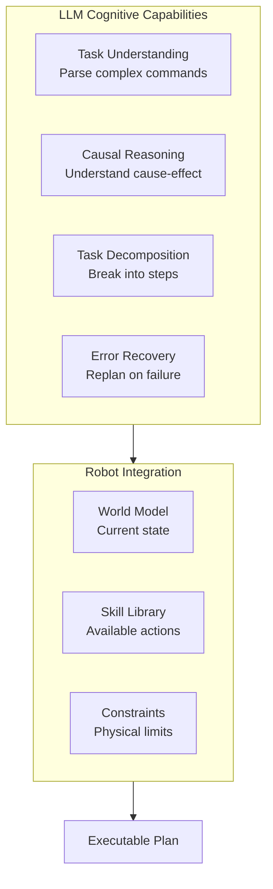
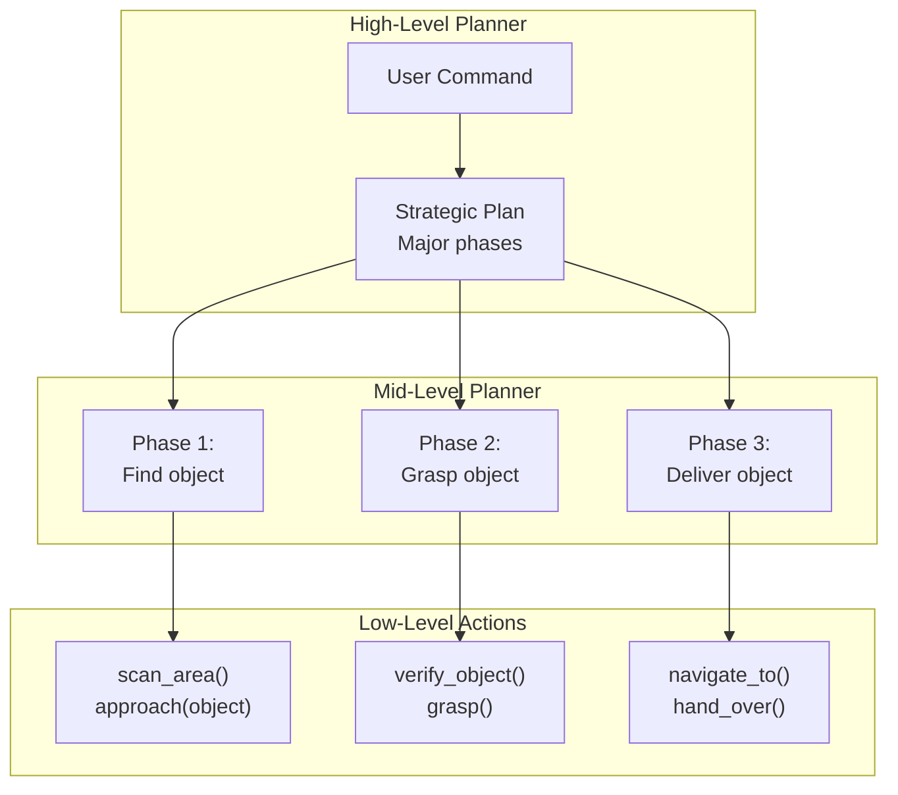

# Chapter 5: LLM-Based Cognitive Planning

:::note Learning Objectives
By the end of this chapter, you will be able to:
- Design effective prompts for robot task planning with LLMs
- Implement a hierarchical planning system using LLMs
- Ground LLM plans in robot capabilities and world state
- Handle plan validation and error recovery
- Build a complete LLM planning node for ROS 2
- Compare different LLM architectures for robotics applications
:::

## The LLM as Cognitive Engine

Large Language Models serve as the "brain" of a VLA system, providing:



## Prompt Engineering for Robot Planning

### System Prompt Design

The system prompt establishes the LLM's role and constraints:

```python
ROBOT_PLANNER_SYSTEM_PROMPT = """
You are a task planner for a humanoid robot assistant. Your role is to convert
natural language commands into executable step-by-step plans.

## Robot Capabilities

The robot can perform the following primitive actions:

### Navigation
- `navigate_to(location)`: Move to a named location
- `approach(object)`: Move close to a specific object
- `retreat(distance)`: Move backward by distance meters

### Perception
- `scan_area()`: Look around and detect objects
- `focus_on(object)`: Look directly at an object
- `verify_object(object, properties)`: Confirm object matches description

### Manipulation
- `grasp(object)`: Pick up an object
- `release()`: Release currently held object
- `place_on(surface)`: Place held object on a surface
- `hand_over(person)`: Give held object to a person

### Communication
- `say(message)`: Speak a message aloud
- `ask_clarification(question)`: Ask user for clarification
- `confirm_action(action)`: Ask user to confirm before proceeding

## Planning Rules

1. ALWAYS verify object presence before manipulation
2. NEVER navigate while holding fragile objects without securing
3. ALWAYS confirm before irreversible actions
4. Plan for failure - include fallback steps when appropriate
5. Keep plans concise - no more than 10 steps for simple tasks

## Output Format

Return plans as JSON:
{
    "task_summary": "Brief description of the task",
    "preconditions": ["List of required conditions"],
    "steps": [
        {
            "id": 1,
            "action": "action_name",
            "parameters": {"param": "value"},
            "description": "Human-readable description",
            "success_condition": "How to verify success",
            "fallback": "What to do if this step fails"
        }
    ],
    "postconditions": ["Expected state after completion"],
    "estimated_duration_seconds": 30,
    "risk_level": "low|medium|high"
}
"""
```

### Task Planning Prompt Template

```python
PLANNING_PROMPT_TEMPLATE = """
## Current World State

Robot Status:
- Location: {robot_location}
- Gripper: {gripper_state}
- Battery: {battery_level}%
- Currently holding: {held_object}

Detected Objects:
{detected_objects}

Known Locations:
{known_locations}

Recent Actions:
{recent_actions}

## User Command

"{user_command}"

## Generate Plan

Create a detailed plan to accomplish this task. Consider:
1. What objects need to be found or manipulated?
2. What navigation is required?
3. What could go wrong and how to handle it?
4. What should the robot say to keep the user informed?

Return the plan in JSON format.
"""
```

## LLM Planner Implementation

```python
#!/usr/bin/env python3
"""
LLM-based Task Planner for Humanoid Robots
"""

from dataclasses import dataclass, field
from typing import List, Dict, Optional, Any
from enum import Enum
import json
import asyncio
from openai import AsyncOpenAI
import anthropic

class PlanStatus(Enum):
    PENDING = "pending"
    VALID = "valid"
    INVALID = "invalid"
    EXECUTING = "executing"
    COMPLETED = "completed"
    FAILED = "failed"


@dataclass
class PlanStep:
    """A single step in the task plan"""
    id: int
    action: str
    parameters: Dict[str, Any]
    description: str
    success_condition: str
    fallback: Optional[str] = None
    status: PlanStatus = PlanStatus.PENDING


@dataclass
class TaskPlan:
    """Complete task plan generated by LLM"""
    task_summary: str
    preconditions: List[str]
    steps: List[PlanStep]
    postconditions: List[str]
    estimated_duration_seconds: float
    risk_level: str
    raw_llm_response: str = ""
    validation_errors: List[str] = field(default_factory=list)
    status: PlanStatus = PlanStatus.PENDING


class LLMPlannerConfig:
    """Configuration for LLM planner"""
    def __init__(
        self,
        provider: str = "openai",  # "openai" or "anthropic"
        model: str = "gpt-4-turbo-preview",
        temperature: float = 0.2,
        max_tokens: int = 2000,
        timeout_seconds: float = 30.0
    ):
        self.provider = provider
        self.model = model
        self.temperature = temperature
        self.max_tokens = max_tokens
        self.timeout_seconds = timeout_seconds


class LLMPlanner:
    """
    LLM-based task planner for humanoid robots

    Supports multiple LLM providers (OpenAI, Anthropic)
    """

    def __init__(self, config: LLMPlannerConfig = None):
        self.config = config or LLMPlannerConfig()

        # Initialize appropriate client
        if self.config.provider == "openai":
            self.client = AsyncOpenAI()
        elif self.config.provider == "anthropic":
            self.client = anthropic.AsyncAnthropic()
        else:
            raise ValueError(f"Unsupported provider: {self.config.provider}")

        # Store system prompt
        self.system_prompt = ROBOT_PLANNER_SYSTEM_PROMPT

    async def generate_plan(
        self,
        command: str,
        world_state: Dict[str, Any]
    ) -> TaskPlan:
        """
        Generate a task plan from user command and world state

        Args:
            command: Natural language command
            world_state: Current state of robot and environment

        Returns:
            TaskPlan object with validated steps
        """
        # Format the planning prompt
        prompt = self._format_prompt(command, world_state)

        # Call LLM
        response = await self._call_llm(prompt)

        # Parse response into plan
        plan = self._parse_response(response)

        # Validate plan
        plan = self._validate_plan(plan, world_state)

        return plan

    def _format_prompt(self, command: str, world_state: Dict[str, Any]) -> str:
        """Format the planning prompt with world state"""
        # Format detected objects
        objects_str = ""
        for obj in world_state.get('detected_objects', []):
            objects_str += f"- {obj['name']}: {obj['color']} {obj['type']} at ({obj['x']:.2f}, {obj['y']:.2f}, {obj['z']:.2f})\n"

        if not objects_str:
            objects_str = "- No objects currently detected\n"

        # Format known locations
        locations_str = ""
        for loc in world_state.get('known_locations', []):
            locations_str += f"- {loc['name']}: ({loc['x']:.2f}, {loc['y']:.2f})\n"

        # Format recent actions
        actions_str = ""
        for action in world_state.get('recent_actions', [])[-5:]:
            actions_str += f"- {action['action']}: {action['result']}\n"

        if not actions_str:
            actions_str = "- No recent actions\n"

        return PLANNING_PROMPT_TEMPLATE.format(
            robot_location=world_state.get('robot_location', 'unknown'),
            gripper_state=world_state.get('gripper_state', 'open'),
            battery_level=world_state.get('battery_level', 100),
            held_object=world_state.get('held_object', 'nothing'),
            detected_objects=objects_str,
            known_locations=locations_str,
            recent_actions=actions_str,
            user_command=command
        )

    async def _call_llm(self, prompt: str) -> str:
        """Call the LLM API"""
        if self.config.provider == "openai":
            response = await self.client.chat.completions.create(
                model=self.config.model,
                messages=[
                    {"role": "system", "content": self.system_prompt},
                    {"role": "user", "content": prompt}
                ],
                temperature=self.config.temperature,
                max_tokens=self.config.max_tokens,
                response_format={"type": "json_object"}
            )
            return response.choices[0].message.content

        elif self.config.provider == "anthropic":
            response = await self.client.messages.create(
                model=self.config.model,
                max_tokens=self.config.max_tokens,
                system=self.system_prompt,
                messages=[
                    {"role": "user", "content": prompt + "\n\nRespond with JSON only."}
                ]
            )
            return response.content[0].text

    def _parse_response(self, response: str) -> TaskPlan:
        """Parse LLM response into TaskPlan"""
        try:
            data = json.loads(response)

            steps = [
                PlanStep(
                    id=step['id'],
                    action=step['action'],
                    parameters=step.get('parameters', {}),
                    description=step['description'],
                    success_condition=step.get('success_condition', ''),
                    fallback=step.get('fallback')
                )
                for step in data.get('steps', [])
            ]

            return TaskPlan(
                task_summary=data.get('task_summary', ''),
                preconditions=data.get('preconditions', []),
                steps=steps,
                postconditions=data.get('postconditions', []),
                estimated_duration_seconds=data.get('estimated_duration_seconds', 0),
                risk_level=data.get('risk_level', 'medium'),
                raw_llm_response=response
            )

        except json.JSONDecodeError as e:
            # Return plan with error
            return TaskPlan(
                task_summary="Failed to parse LLM response",
                preconditions=[],
                steps=[],
                postconditions=[],
                estimated_duration_seconds=0,
                risk_level="high",
                raw_llm_response=response,
                validation_errors=[f"JSON parse error: {str(e)}"],
                status=PlanStatus.INVALID
            )

    def _validate_plan(self, plan: TaskPlan, world_state: Dict[str, Any]) -> TaskPlan:
        """Validate plan against robot capabilities and world state"""
        errors = []

        # Valid action set
        valid_actions = {
            'navigate_to', 'approach', 'retreat',
            'scan_area', 'focus_on', 'verify_object',
            'grasp', 'release', 'place_on', 'hand_over',
            'say', 'ask_clarification', 'confirm_action'
        }

        for step in plan.steps:
            # Check action validity
            if step.action not in valid_actions:
                errors.append(f"Step {step.id}: Unknown action '{step.action}'")

            # Check parameter validity
            if step.action == 'navigate_to':
                if 'location' not in step.parameters:
                    errors.append(f"Step {step.id}: navigate_to requires 'location' parameter")

            if step.action == 'grasp':
                if 'object' not in step.parameters:
                    errors.append(f"Step {step.id}: grasp requires 'object' parameter")

        # Check preconditions
        if world_state.get('battery_level', 100) < 20:
            errors.append("Battery level too low for task execution")

        plan.validation_errors = errors
        plan.status = PlanStatus.VALID if not errors else PlanStatus.INVALID

        return plan
```

## Hierarchical Planning

For complex tasks, use hierarchical planning with multiple LLM calls:



### Hierarchical Planner Implementation

```python
class HierarchicalPlanner:
    """
    Multi-level planner for complex tasks
    """

    def __init__(self, llm_config: LLMPlannerConfig = None):
        self.strategic_planner = LLMPlanner(llm_config)
        self.tactical_planner = LLMPlanner(llm_config)

    async def plan_complex_task(
        self,
        command: str,
        world_state: Dict[str, Any]
    ) -> TaskPlan:
        """
        Generate hierarchical plan for complex task
        """
        # Step 1: Strategic planning - break into phases
        strategic_plan = await self._strategic_plan(command, world_state)

        # Step 2: Tactical planning - detail each phase
        detailed_steps = []
        for phase in strategic_plan.steps:
            phase_steps = await self._tactical_plan(phase, world_state)
            detailed_steps.extend(phase_steps)

        # Combine into final plan
        final_plan = TaskPlan(
            task_summary=strategic_plan.task_summary,
            preconditions=strategic_plan.preconditions,
            steps=detailed_steps,
            postconditions=strategic_plan.postconditions,
            estimated_duration_seconds=sum(
                s.get('duration', 5) for s in detailed_steps
            ),
            risk_level=strategic_plan.risk_level
        )

        return final_plan

    async def _strategic_plan(
        self,
        command: str,
        world_state: Dict[str, Any]
    ) -> TaskPlan:
        """Generate high-level strategic plan"""
        strategic_prompt = f"""
        Break down this task into 2-4 major phases:

        Command: "{command}"

        For each phase, provide:
        - Phase name
        - Goal of the phase
        - Key challenges

        Return as JSON with phases instead of detailed steps.
        """

        return await self.strategic_planner.generate_plan(
            strategic_prompt,
            world_state
        )

    async def _tactical_plan(
        self,
        phase: PlanStep,
        world_state: Dict[str, Any]
    ) -> List[PlanStep]:
        """Generate detailed steps for a phase"""
        tactical_prompt = f"""
        Generate detailed robot actions for this phase:

        Phase: {phase.description}
        Goal: {phase.success_condition}

        Use only primitive robot actions.
        """

        plan = await self.tactical_planner.generate_plan(
            tactical_prompt,
            world_state
        )

        return plan.steps
```

## Plan Grounding and Execution

Plans must be grounded in actual robot capabilities:

```python
class PlanGrounder:
    """
    Grounds LLM plans in actual robot capabilities
    """

    def __init__(self, skill_library: 'SkillLibrary'):
        self.skills = skill_library

    def ground_plan(self, plan: TaskPlan) -> TaskPlan:
        """
        Convert abstract plan steps into executable skill calls
        """
        grounded_steps = []

        for step in plan.steps:
            grounded_step = self._ground_step(step)
            if grounded_step:
                grounded_steps.append(grounded_step)
            else:
                plan.validation_errors.append(
                    f"Step {step.id}: Cannot ground action '{step.action}'"
                )

        plan.steps = grounded_steps
        return plan

    def _ground_step(self, step: PlanStep) -> Optional[PlanStep]:
        """Ground a single step in robot skills"""
        # Check if skill exists
        skill = self.skills.get_skill(step.action)
        if not skill:
            return None

        # Validate parameters against skill signature
        if not skill.validate_params(step.parameters):
            return None

        # Add execution metadata
        step.parameters['_skill_id'] = skill.id
        step.parameters['_timeout'] = skill.default_timeout

        return step


class SkillLibrary:
    """
    Registry of robot skills
    """

    def __init__(self):
        self.skills = {}

    def register_skill(self, skill: 'RobotSkill'):
        """Register a skill"""
        self.skills[skill.name] = skill

    def get_skill(self, name: str) -> Optional['RobotSkill']:
        """Get skill by name"""
        return self.skills.get(name)


@dataclass
class RobotSkill:
    """Definition of a robot skill"""
    id: str
    name: str
    description: str
    parameters: Dict[str, type]  # Parameter name -> type
    default_timeout: float = 30.0

    def validate_params(self, params: Dict[str, Any]) -> bool:
        """Validate parameters against skill signature"""
        for param_name, param_type in self.parameters.items():
            if param_name not in params:
                return False
            # Type checking could be more sophisticated
        return True
```

## ROS 2 Planning Node

```python
#!/usr/bin/env python3
"""
LLM Planning Node for ROS 2
"""

import rclpy
from rclpy.node import Node
from rclpy.action import ActionServer
from std_msgs.msg import String
import asyncio
import json

# Custom message/action imports
from vla_interfaces.msg import ParsedCommand, WorldState
from vla_interfaces.action import GeneratePlan


class LLMPlannerNode(Node):
    """
    ROS 2 node for LLM-based task planning

    Subscriptions:
        /nlu/parsed_command: Parsed user commands
        /world/state: Current world state

    Actions:
        /planner/generate_plan: Generate plan from command

    Publishers:
        /planner/plan: Generated task plans
        /planner/status: Planning status updates
    """

    def __init__(self):
        super().__init__('llm_planner_node')

        # Parameters
        self.declare_parameter('llm_provider', 'openai')
        self.declare_parameter('llm_model', 'gpt-4-turbo-preview')
        self.declare_parameter('temperature', 0.2)

        # Initialize planner
        config = LLMPlannerConfig(
            provider=self.get_parameter('llm_provider').value,
            model=self.get_parameter('llm_model').value,
            temperature=self.get_parameter('temperature').value
        )
        self.planner = LLMPlanner(config)
        self.hierarchical_planner = HierarchicalPlanner(config)

        # World state storage
        self.current_world_state = {}

        # Subscribers
        self.command_sub = self.create_subscription(
            ParsedCommand,
            '/nlu/parsed_command',
            self.command_callback,
            10
        )

        self.world_sub = self.create_subscription(
            WorldState,
            '/world/state',
            self.world_state_callback,
            10
        )

        # Publishers
        self.plan_pub = self.create_publisher(String, '/planner/plan', 10)
        self.status_pub = self.create_publisher(String, '/planner/status', 10)

        # Action server
        self._action_server = ActionServer(
            self,
            GeneratePlan,
            '/planner/generate_plan',
            self.generate_plan_callback
        )

        # Async event loop
        self.loop = asyncio.new_event_loop()

        self.get_logger().info('LLM Planner node initialized')

    def world_state_callback(self, msg: WorldState):
        """Update current world state"""
        self.current_world_state = {
            'robot_location': msg.robot_location,
            'gripper_state': msg.gripper_state,
            'battery_level': msg.battery_level,
            'held_object': msg.held_object,
            'detected_objects': [
                {
                    'name': obj.name,
                    'type': obj.type,
                    'color': obj.color,
                    'x': obj.position.x,
                    'y': obj.position.y,
                    'z': obj.position.z
                }
                for obj in msg.detected_objects
            ],
            'known_locations': [
                {'name': loc.name, 'x': loc.x, 'y': loc.y}
                for loc in msg.known_locations
            ]
        }

    def command_callback(self, msg: ParsedCommand):
        """Handle incoming parsed command"""
        self.publish_status(f"Received command: {msg.raw_text}")

        # Run planning in async context
        plan = self.loop.run_until_complete(
            self._generate_plan_async(msg.raw_text)
        )

        # Publish result
        self._publish_plan(plan)

    async def _generate_plan_async(self, command: str) -> TaskPlan:
        """Generate plan asynchronously"""
        self.publish_status("Generating plan...")

        # Determine complexity
        word_count = len(command.split())
        use_hierarchical = word_count > 10 or 'and' in command.lower()

        if use_hierarchical:
            plan = await self.hierarchical_planner.plan_complex_task(
                command,
                self.current_world_state
            )
        else:
            plan = await self.planner.generate_plan(
                command,
                self.current_world_state
            )

        self.publish_status(
            f"Plan generated: {len(plan.steps)} steps, "
            f"status={plan.status.value}"
        )

        return plan

    def _publish_plan(self, plan: TaskPlan):
        """Publish plan as JSON"""
        plan_dict = {
            'task_summary': plan.task_summary,
            'steps': [
                {
                    'id': s.id,
                    'action': s.action,
                    'parameters': s.parameters,
                    'description': s.description
                }
                for s in plan.steps
            ],
            'status': plan.status.value,
            'validation_errors': plan.validation_errors
        }

        msg = String()
        msg.data = json.dumps(plan_dict)
        self.plan_pub.publish(msg)

    def publish_status(self, status: str):
        """Publish status message"""
        msg = String()
        msg.data = status
        self.status_pub.publish(msg)
        self.get_logger().info(status)

    async def generate_plan_callback(self, goal_handle):
        """Action server callback"""
        command = goal_handle.request.command

        plan = await self._generate_plan_async(command)

        # Send feedback
        feedback = GeneratePlan.Feedback()
        feedback.current_status = "Planning complete"
        goal_handle.publish_feedback(feedback)

        # Send result
        result = GeneratePlan.Result()
        result.plan_json = json.dumps({
            'task_summary': plan.task_summary,
            'steps': [vars(s) for s in plan.steps]
        })
        result.success = plan.status == PlanStatus.VALID

        goal_handle.succeed()
        return result


def main(args=None):
    rclpy.init(args=args)
    node = LLMPlannerNode()
    rclpy.spin(node)
    rclpy.shutdown()


if __name__ == '__main__':
    main()
```

## Error Recovery and Replanning

```python
class ReplanningManager:
    """
    Handles plan failures and replanning
    """

    def __init__(self, planner: LLMPlanner):
        self.planner = planner
        self.max_replan_attempts = 3
        self.failure_history = []

    async def handle_failure(
        self,
        failed_step: PlanStep,
        error: str,
        world_state: Dict[str, Any],
        original_command: str
    ) -> TaskPlan:
        """
        Handle step failure and generate recovery plan
        """
        # Record failure
        self.failure_history.append({
            'step': failed_step,
            'error': error,
            'timestamp': time.time()
        })

        # Check if we've exceeded replan attempts
        recent_failures = [
            f for f in self.failure_history
            if time.time() - f['timestamp'] < 60
        ]

        if len(recent_failures) >= self.max_replan_attempts:
            return self._create_abort_plan(error)

        # Generate recovery plan
        recovery_prompt = f"""
        The robot encountered an error during task execution.

        Original command: "{original_command}"
        Failed step: {failed_step.action}({failed_step.parameters})
        Error: {error}

        Generate a recovery plan that:
        1. Handles the current failure safely
        2. Attempts to complete the original task
        3. Avoids the same failure

        If recovery is not possible, generate a safe abort sequence.
        """

        recovery_plan = await self.planner.generate_plan(
            recovery_prompt,
            world_state
        )

        return recovery_plan

    def _create_abort_plan(self, error: str) -> TaskPlan:
        """Create safe abort plan"""
        return TaskPlan(
            task_summary="Aborting task due to repeated failures",
            preconditions=[],
            steps=[
                PlanStep(
                    id=1,
                    action="release",
                    parameters={},
                    description="Release any held objects",
                    success_condition="Gripper open"
                ),
                PlanStep(
                    id=2,
                    action="say",
                    parameters={"message": f"I'm sorry, I couldn't complete the task. Error: {error}"},
                    description="Inform user of failure",
                    success_condition="Message spoken"
                )
            ],
            postconditions=["Robot in safe state"],
            estimated_duration_seconds=5,
            risk_level="low"
        )
```

## Summary

In this chapter, you learned:

- How to design effective prompts for robot task planning
- Implementation of single-level and hierarchical LLM planners
- Grounding plans in actual robot capabilities
- Building an LLM planning node for ROS 2
- Error recovery and replanning strategies

## Key Takeaways

:::tip Remember
1. **System prompts define capabilities** - Be explicit about what the robot can and cannot do
2. **Structured output (JSON)** makes parsing reliable
3. **Hierarchical planning** handles complex multi-step tasks
4. **Plan validation** is essential before execution
5. **Replanning enables recovery** from failures
:::

## Next Steps

In the next chapter, we will explore safety guardrails that validate plans before execution to ensure the robot operates safely.

---

## Review Questions

1. What information should be included in a robot planner system prompt?
2. Why is structured JSON output important for LLM planning?
3. When should you use hierarchical planning vs single-level planning?
4. What is plan grounding and why is it necessary?
5. How can the system recover from plan execution failures?

## Hands-On Exercise

Build and extend the LLM planner:

1. Create a custom system prompt for a specific robot use case (e.g., kitchen assistant)
2. Add three new robot skills to the skill library
3. Implement a caching mechanism to avoid regenerating identical plans
4. Test the planner with 10 different commands and measure:
   - Plan generation latency
   - Number of steps generated
   - Validation success rate
5. Implement a plan comparison feature that shows differences between original and recovery plans

Bonus: Add support for user preferences (e.g., "I prefer the robot to ask for confirmation before picking up fragile items").
