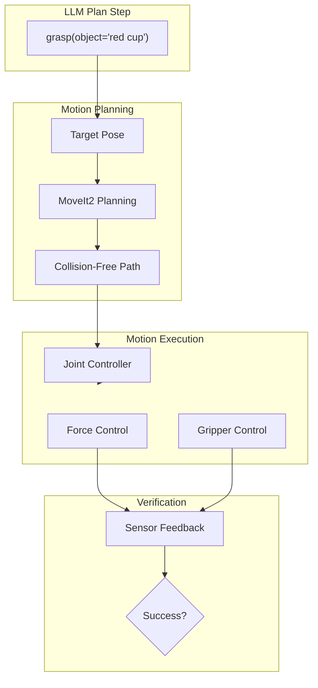

# Chapter 10: Manipulator Control for VLA Tasks

:::note Learning Objectives
By the end of this chapter, you will be able to:
- Integrate MoveIt2 for motion planning in VLA systems
- Implement pick and place operations for humanoid robots
- Use force control for gentle and adaptive manipulation
- Handle manipulation failures with recovery strategies
- Build manipulation skills callable by LLM planners
- Create complex manipulation sequences from atomic actions
:::

## From Plan to Physical Action

When the LLM planner generates manipulation steps, the robot must execute precise physical motions:



## MoveIt2 Integration

### MoveIt2 Interface for VLA

```python
#!/usr/bin/env python3
"""
MoveIt2 Interface for VLA Manipulation Tasks
"""

import rclpy
from rclpy.node import Node
from rclpy.action import ActionClient
from moveit_msgs.action import MoveGroup, ExecuteTrajectory
from moveit_msgs.msg import (
    MotionPlanRequest, Constraints, JointConstraint,
    PositionConstraint, OrientationConstraint,
    RobotState, PlanningScene
)
from geometry_msgs.msg import PoseStamped, Pose
from shape_msgs.msg import SolidPrimitive
from std_msgs.msg import String
from sensor_msgs.msg import JointState
import numpy as np
from typing import Optional, List, Dict, Any
from dataclasses import dataclass
from enum import Enum

class ManipulationStatus(Enum):
    """Manipulation task status"""
    IDLE = "idle"
    PLANNING = "planning"
    EXECUTING = "executing"
    SUCCEEDED = "succeeded"
    FAILED = "failed"


@dataclass
class ManipulationResult:
    """Result of a manipulation action"""
    success: bool
    status: ManipulationStatus
    message: str
    final_pose: Optional[np.ndarray] = None
    execution_time: float = 0.0


class MoveIt2Interface(Node):
    """
    MoveIt2 interface for VLA manipulation

    Provides high-level manipulation primitives for LLM planners
    """

    def __init__(self):
        super().__init__('moveit2_interface')

        # Parameters
        self.declare_parameter('planning_group', 'arm')
        self.declare_parameter('end_effector_link', 'gripper_link')
        self.declare_parameter('planning_time', 5.0)
        self.declare_parameter('max_velocity_scaling', 0.5)
        self.declare_parameter('max_acceleration_scaling', 0.5)

        self.planning_group = self.get_parameter('planning_group').value
        self.ee_link = self.get_parameter('end_effector_link').value
        self.planning_time = self.get_parameter('planning_time').value

        # Action clients
        self.move_group_client = ActionClient(self, MoveGroup, 'move_action')
        self.execute_client = ActionClient(self, ExecuteTrajectory, 'execute_trajectory')

        # Publishers
        self.status_pub = self.create_publisher(String, '/manipulation/status', 10)

        # State
        self.current_joint_state: Optional[JointState] = None
        self.current_status = ManipulationStatus.IDLE

        # Subscribers
        self.joint_state_sub = self.create_subscription(
            JointState, '/joint_states', self.joint_state_callback, 10
        )

        self.get_logger().info('MoveIt2 Interface initialized')

    def joint_state_callback(self, msg: JointState):
        """Update current joint state"""
        self.current_joint_state = msg

    async def move_to_pose(
        self,
        target_pose: PoseStamped,
        cartesian: bool = False
    ) -> ManipulationResult:
        """
        Move end effector to target pose

        Args:
            target_pose: Target pose in specified frame
            cartesian: Use Cartesian path planning

        Returns:
            ManipulationResult
        """
        self.current_status = ManipulationStatus.PLANNING
        self.publish_status("Planning motion to target pose")

        # Wait for action server
        if not self.move_group_client.wait_for_server(timeout_sec=5.0):
            return ManipulationResult(
                success=False,
                status=ManipulationStatus.FAILED,
                message="MoveIt2 action server not available"
            )

        # Create motion plan request
        goal_msg = MoveGroup.Goal()
        goal_msg.request = self._create_motion_request(target_pose, cartesian)

        # Send goal
        send_goal_future = self.move_group_client.send_goal_async(goal_msg)
        goal_handle = await send_goal_future

        if not goal_handle.accepted:
            return ManipulationResult(
                success=False,
                status=ManipulationStatus.FAILED,
                message="Motion planning goal rejected"
            )

        # Wait for result
        self.current_status = ManipulationStatus.EXECUTING
        self.publish_status("Executing motion")

        result = await goal_handle.get_result_async()

        if result.result.error_code.val == 1:  # SUCCESS
            self.current_status = ManipulationStatus.SUCCEEDED
            return ManipulationResult(
                success=True,
                status=ManipulationStatus.SUCCEEDED,
                message="Motion completed successfully"
            )
        else:
            self.current_status = ManipulationStatus.FAILED
            return ManipulationResult(
                success=False,
                status=ManipulationStatus.FAILED,
                message=f"Motion failed with error code: {result.result.error_code.val}"
            )

    async def move_to_joint_positions(
        self,
        joint_positions: Dict[str, float]
    ) -> ManipulationResult:
        """
        Move to specific joint positions

        Args:
            joint_positions: Dict mapping joint name to position (radians)

        Returns:
            ManipulationResult
        """
        self.current_status = ManipulationStatus.PLANNING
        self.publish_status("Planning joint motion")

        goal_msg = MoveGroup.Goal()
        goal_msg.request = self._create_joint_motion_request(joint_positions)

        send_goal_future = self.move_group_client.send_goal_async(goal_msg)
        goal_handle = await send_goal_future

        if not goal_handle.accepted:
            return ManipulationResult(
                success=False,
                status=ManipulationStatus.FAILED,
                message="Joint motion goal rejected"
            )

        self.current_status = ManipulationStatus.EXECUTING
        result = await goal_handle.get_result_async()

        success = result.result.error_code.val == 1
        return ManipulationResult(
            success=success,
            status=ManipulationStatus.SUCCEEDED if success else ManipulationStatus.FAILED,
            message="Joint motion completed" if success else "Joint motion failed"
        )

    async def move_cartesian_path(
        self,
        waypoints: List[Pose],
        velocity_scale: float = 0.3
    ) -> ManipulationResult:
        """
        Execute Cartesian path through waypoints

        Args:
            waypoints: List of waypoint poses
            velocity_scale: Velocity scaling factor

        Returns:
            ManipulationResult
        """
        self.current_status = ManipulationStatus.PLANNING
        self.publish_status(f"Planning Cartesian path with {len(waypoints)} waypoints")

        # Cartesian path planning would be done here
        # This is simplified - actual implementation uses MoveIt2's computeCartesianPath

        return ManipulationResult(
            success=True,
            status=ManipulationStatus.SUCCEEDED,
            message="Cartesian path executed"
        )

    def _create_motion_request(
        self,
        target_pose: PoseStamped,
        cartesian: bool
    ) -> MotionPlanRequest:
        """Create motion plan request"""
        request = MotionPlanRequest()
        request.group_name = self.planning_group
        request.num_planning_attempts = 10
        request.allowed_planning_time = self.planning_time
        request.max_velocity_scaling_factor = self.get_parameter('max_velocity_scaling').value
        request.max_acceleration_scaling_factor = self.get_parameter('max_acceleration_scaling').value

        # Goal constraints
        constraints = Constraints()

        # Position constraint
        pos_constraint = PositionConstraint()
        pos_constraint.header = target_pose.header
        pos_constraint.link_name = self.ee_link
        pos_constraint.target_point_offset.x = 0.0
        pos_constraint.target_point_offset.y = 0.0
        pos_constraint.target_point_offset.z = 0.0

        # Bounding region
        primitive = SolidPrimitive()
        primitive.type = SolidPrimitive.SPHERE
        primitive.dimensions = [0.01]  # 1cm tolerance
        pos_constraint.constraint_region.primitives.append(primitive)

        primitive_pose = Pose()
        primitive_pose.position = target_pose.pose.position
        primitive_pose.orientation.w = 1.0
        pos_constraint.constraint_region.primitive_poses.append(primitive_pose)

        constraints.position_constraints.append(pos_constraint)

        # Orientation constraint
        ori_constraint = OrientationConstraint()
        ori_constraint.header = target_pose.header
        ori_constraint.link_name = self.ee_link
        ori_constraint.orientation = target_pose.pose.orientation
        ori_constraint.absolute_x_axis_tolerance = 0.1
        ori_constraint.absolute_y_axis_tolerance = 0.1
        ori_constraint.absolute_z_axis_tolerance = 0.1

        constraints.orientation_constraints.append(ori_constraint)

        request.goal_constraints.append(constraints)

        return request

    def _create_joint_motion_request(
        self,
        joint_positions: Dict[str, float]
    ) -> MotionPlanRequest:
        """Create joint-space motion request"""
        request = MotionPlanRequest()
        request.group_name = self.planning_group
        request.num_planning_attempts = 5
        request.allowed_planning_time = self.planning_time

        constraints = Constraints()
        for joint_name, position in joint_positions.items():
            joint_constraint = JointConstraint()
            joint_constraint.joint_name = joint_name
            joint_constraint.position = position
            joint_constraint.tolerance_above = 0.01
            joint_constraint.tolerance_below = 0.01
            joint_constraint.weight = 1.0
            constraints.joint_constraints.append(joint_constraint)

        request.goal_constraints.append(constraints)
        return request

    def publish_status(self, status: str):
        """Publish manipulation status"""
        msg = String()
        msg.data = status
        self.status_pub.publish(msg)
        self.get_logger().info(f'Manipulation: {status}')
```

## Gripper Control

```python
from control_msgs.action import GripperCommand
from std_srvs.srv import Trigger

class GripperController(Node):
    """
    Gripper control for manipulation tasks

    Handles opening, closing, and force-controlled grasping
    """

    def __init__(self):
        super().__init__('gripper_controller')

        # Parameters
        self.declare_parameter('max_width', 0.08)
        self.declare_parameter('max_force', 50.0)
        self.declare_parameter('default_grasp_force', 30.0)

        self.max_width = self.get_parameter('max_width').value
        self.max_force = self.get_parameter('max_force').value

        # Action client
        self.gripper_client = ActionClient(
            self, GripperCommand, 'gripper_controller/gripper_cmd'
        )

        # State
        self.current_width = self.max_width
        self.is_holding = False
        self.held_force = 0.0

        self.get_logger().info('Gripper Controller initialized')

    async def open_gripper(self, width: float = None) -> bool:
        """
        Open gripper to specified width

        Args:
            width: Target width in meters (default: max width)

        Returns:
            True if successful
        """
        if width is None:
            width = self.max_width

        return await self._send_gripper_command(width, 0.0)

    async def close_gripper(
        self,
        target_width: float = 0.0,
        grasp_force: float = None
    ) -> bool:
        """
        Close gripper with specified force

        Args:
            target_width: Target width (0 for full close)
            grasp_force: Force to apply (N)

        Returns:
            True if object detected
        """
        if grasp_force is None:
            grasp_force = self.get_parameter('default_grasp_force').value

        success = await self._send_gripper_command(target_width, grasp_force)

        # Check if we grabbed something
        if success:
            self.is_holding = self.current_width > 0.005  # Min object width
            self.held_force = grasp_force if self.is_holding else 0.0

        return self.is_holding

    async def grasp_with_force_control(
        self,
        target_force: float,
        timeout: float = 5.0
    ) -> bool:
        """
        Grasp with force feedback control

        Closes gripper until target force is reached
        """
        # This would implement force-controlled grasping
        # using force/torque sensor feedback
        return await self.close_gripper(0.0, target_force)

    async def release(self) -> bool:
        """Release held object by opening gripper"""
        success = await self.open_gripper()
        if success:
            self.is_holding = False
            self.held_force = 0.0
        return success

    async def _send_gripper_command(
        self,
        position: float,
        max_effort: float
    ) -> bool:
        """Send command to gripper"""
        if not self.gripper_client.wait_for_server(timeout_sec=2.0):
            self.get_logger().error('Gripper action server not available')
            return False

        goal = GripperCommand.Goal()
        goal.command.position = position
        goal.command.max_effort = max_effort

        send_goal_future = self.gripper_client.send_goal_async(goal)
        goal_handle = await send_goal_future

        if not goal_handle.accepted:
            return False

        result = await goal_handle.get_result_async()
        self.current_width = result.result.position

        return result.result.reached_goal or result.result.stalled

    def get_state(self) -> Dict[str, Any]:
        """Get current gripper state"""
        return {
            'width': self.current_width,
            'is_holding': self.is_holding,
            'held_force': self.held_force,
            'max_width': self.max_width
        }
```

## High-Level Manipulation Skills

```python
class ManipulationSkills:
    """
    High-level manipulation skills for LLM planner

    Composes atomic actions into complex behaviors
    """

    def __init__(
        self,
        moveit_interface: MoveIt2Interface,
        gripper: GripperController,
        grasp_planner  # GraspPlannerNode
    ):
        self.moveit = moveit_interface
        self.gripper = gripper
        self.grasp_planner = grasp_planner

    def get_available_skills(self) -> Dict[str, str]:
        """Return skill descriptions for LLM planner"""
        return {
            'pick': 'pick(object_description: str) - Pick up object matching description',
            'place': 'place(location: str) - Place held object at location',
            'hand_over': 'hand_over() - Hand object to nearby person',
            'push': 'push(object: str, direction: str) - Push object in direction',
            'pour': 'pour(source: str, target: str) - Pour from source into target'
        }

    async def pick(
        self,
        object_description: str,
        world_state: Dict[str, Any]
    ) -> ManipulationResult:
        """
        Pick up an object

        Args:
            object_description: Description like "the red cup"
            world_state: Current world state

        Returns:
            ManipulationResult
        """
        # Step 1: Plan grasp
        grasp = await self.grasp_planner.plan_grasp(object_description)
        if grasp is None:
            return ManipulationResult(
                success=False,
                status=ManipulationStatus.FAILED,
                message=f"Could not plan grasp for {object_description}"
            )

        # Step 2: Move to pre-grasp position
        pre_grasp_pose = self._compute_pre_grasp(grasp)
        result = await self.moveit.move_to_pose(pre_grasp_pose)
        if not result.success:
            return ManipulationResult(
                success=False,
                status=ManipulationStatus.FAILED,
                message="Failed to reach pre-grasp position"
            )

        # Step 3: Open gripper
        await self.gripper.open_gripper(grasp.grasp_width * 1.2)

        # Step 4: Approach (Cartesian motion)
        grasp_pose = grasp.to_pose_stamped()
        result = await self.moveit.move_to_pose(grasp_pose, cartesian=True)
        if not result.success:
            return ManipulationResult(
                success=False,
                status=ManipulationStatus.FAILED,
                message="Failed to approach object"
            )

        # Step 5: Close gripper
        grasped = await self.gripper.close_gripper(
            target_width=0.0,
            grasp_force=30.0
        )

        if not grasped:
            # Recovery: open and retry
            await self.gripper.open_gripper()
            return ManipulationResult(
                success=False,
                status=ManipulationStatus.FAILED,
                message="Failed to grasp object"
            )

        # Step 6: Lift
        lift_pose = self._compute_lift_pose(grasp_pose, height=0.1)
        result = await self.moveit.move_to_pose(lift_pose, cartesian=True)

        if not result.success:
            await self.gripper.release()
            return ManipulationResult(
                success=False,
                status=ManipulationStatus.FAILED,
                message="Failed to lift object"
            )

        # Step 7: Verify grasp
        if not self.gripper.is_holding:
            return ManipulationResult(
                success=False,
                status=ManipulationStatus.FAILED,
                message="Object dropped during lift"
            )

        return ManipulationResult(
            success=True,
            status=ManipulationStatus.SUCCEEDED,
            message=f"Successfully picked up {object_description}"
        )

    async def place(
        self,
        location: str,
        world_state: Dict[str, Any]
    ) -> ManipulationResult:
        """
        Place held object at location

        Args:
            location: Target location description
            world_state: Current world state

        Returns:
            ManipulationResult
        """
        if not self.gripper.is_holding:
            return ManipulationResult(
                success=False,
                status=ManipulationStatus.FAILED,
                message="Not holding any object"
            )

        # Resolve location to pose
        place_pose = self._resolve_place_location(location, world_state)
        if place_pose is None:
            return ManipulationResult(
                success=False,
                status=ManipulationStatus.FAILED,
                message=f"Unknown place location: {location}"
            )

        # Move to pre-place position
        pre_place = self._compute_pre_place(place_pose)
        result = await self.moveit.move_to_pose(pre_place)
        if not result.success:
            return ManipulationResult(
                success=False,
                status=ManipulationStatus.FAILED,
                message="Failed to reach pre-place position"
            )

        # Lower to place position (Cartesian)
        result = await self.moveit.move_to_pose(place_pose, cartesian=True)
        if not result.success:
            return ManipulationResult(
                success=False,
                status=ManipulationStatus.FAILED,
                message="Failed to reach place position"
            )

        # Release object
        await self.gripper.release()

        # Retreat
        retreat_pose = self._compute_retreat(place_pose)
        await self.moveit.move_to_pose(retreat_pose, cartesian=True)

        return ManipulationResult(
            success=True,
            status=ManipulationStatus.SUCCEEDED,
            message=f"Successfully placed object at {location}"
        )

    async def hand_over(self) -> ManipulationResult:
        """Hand over held object to a person"""
        if not self.gripper.is_holding:
            return ManipulationResult(
                success=False,
                status=ManipulationStatus.FAILED,
                message="Not holding any object"
            )

        # Move to handover position
        handover_pose = self._get_handover_pose()
        result = await self.moveit.move_to_pose(handover_pose)

        if not result.success:
            return ManipulationResult(
                success=False,
                status=ManipulationStatus.FAILED,
                message="Failed to reach handover position"
            )

        # Wait for person to take object
        # Monitor gripper force - release when pulled
        # This is simplified
        await asyncio.sleep(2.0)  # Wait for person
        await self.gripper.release()

        return ManipulationResult(
            success=True,
            status=ManipulationStatus.SUCCEEDED,
            message="Object handed over successfully"
        )

    def _compute_pre_grasp(self, grasp) -> PoseStamped:
        """Compute pre-grasp position"""
        pre_grasp = PoseStamped()
        pre_grasp.header.frame_id = 'base_link'

        # Offset along approach direction
        offset = grasp.approach_direction * 0.1
        pre_grasp.pose.position.x = grasp.position[0] - offset[0]
        pre_grasp.pose.position.y = grasp.position[1] - offset[1]
        pre_grasp.pose.position.z = grasp.position[2] - offset[2]

        pre_grasp.pose.orientation.x = grasp.orientation[0]
        pre_grasp.pose.orientation.y = grasp.orientation[1]
        pre_grasp.pose.orientation.z = grasp.orientation[2]
        pre_grasp.pose.orientation.w = grasp.orientation[3]

        return pre_grasp

    def _compute_lift_pose(
        self,
        grasp_pose: PoseStamped,
        height: float
    ) -> PoseStamped:
        """Compute lift position above grasp"""
        lift_pose = PoseStamped()
        lift_pose.header = grasp_pose.header
        lift_pose.pose = grasp_pose.pose
        lift_pose.pose.position.z += height
        return lift_pose

    def _resolve_place_location(
        self,
        location: str,
        world_state: Dict[str, Any]
    ) -> Optional[PoseStamped]:
        """Resolve place location description to pose"""
        # This would use semantic map and perception
        # Simplified implementation
        place_pose = PoseStamped()
        place_pose.header.frame_id = 'base_link'

        if 'table' in location.lower():
            place_pose.pose.position.x = 0.5
            place_pose.pose.position.y = 0.0
            place_pose.pose.position.z = 0.75
        elif 'shelf' in location.lower():
            place_pose.pose.position.x = 0.4
            place_pose.pose.position.y = 0.3
            place_pose.pose.position.z = 1.2
        else:
            return None

        place_pose.pose.orientation.w = 1.0
        return place_pose

    def _compute_pre_place(self, place_pose: PoseStamped) -> PoseStamped:
        """Compute pre-place position"""
        pre_place = PoseStamped()
        pre_place.header = place_pose.header
        pre_place.pose = place_pose.pose
        pre_place.pose.position.z += 0.1
        return pre_place

    def _compute_retreat(self, place_pose: PoseStamped) -> PoseStamped:
        """Compute retreat position after placing"""
        retreat = PoseStamped()
        retreat.header = place_pose.header
        retreat.pose = place_pose.pose
        retreat.pose.position.z += 0.15
        retreat.pose.position.x -= 0.1
        return retreat

    def _get_handover_pose(self) -> PoseStamped:
        """Get standard handover pose"""
        pose = PoseStamped()
        pose.header.frame_id = 'base_link'
        pose.pose.position.x = 0.4
        pose.pose.position.y = 0.0
        pose.pose.position.z = 1.0
        pose.pose.orientation.w = 1.0
        return pose
```

## Force Control for Adaptive Manipulation

```python
class ForceControlledManipulation:
    """
    Force-controlled manipulation for gentle handling

    Uses force/torque sensor feedback for adaptive control
    """

    def __init__(self, node: Node):
        self.node = node

        # Force thresholds
        self.contact_threshold = 2.0  # N
        self.max_force = 20.0  # N
        self.target_grasp_force = 10.0  # N

        # Current force readings
        self.current_force = np.zeros(3)
        self.current_torque = np.zeros(3)

        # Subscribe to force/torque sensor
        self.ft_sub = node.create_subscription(
            WrenchStamped,
            '/ft_sensor/wrench',
            self.ft_callback,
            10
        )

    def ft_callback(self, msg):
        """Update force/torque readings"""
        self.current_force = np.array([
            msg.wrench.force.x,
            msg.wrench.force.y,
            msg.wrench.force.z
        ])
        self.current_torque = np.array([
            msg.wrench.torque.x,
            msg.wrench.torque.y,
            msg.wrench.torque.z
        ])

    def detect_contact(self) -> bool:
        """Detect if robot is in contact with something"""
        force_magnitude = np.linalg.norm(self.current_force)
        return force_magnitude > self.contact_threshold

    def get_contact_direction(self) -> np.ndarray:
        """Get direction of contact force"""
        force_magnitude = np.linalg.norm(self.current_force)
        if force_magnitude < self.contact_threshold:
            return np.zeros(3)
        return self.current_force / force_magnitude

    async def approach_until_contact(
        self,
        direction: np.ndarray,
        max_distance: float = 0.1,
        speed: float = 0.02  # m/s
    ) -> bool:
        """
        Move in direction until contact detected

        Args:
            direction: Movement direction (unit vector)
            max_distance: Maximum distance to move
            speed: Movement speed

        Returns:
            True if contact detected, False if max distance reached
        """
        distance_moved = 0.0
        step_size = speed * 0.05  # 50ms control loop

        while distance_moved < max_distance:
            if self.detect_contact():
                return True

            # Move small step in direction
            # This would send velocity command to robot
            distance_moved += step_size
            await asyncio.sleep(0.05)

        return False

    async def insert_with_force_control(
        self,
        target_pose: PoseStamped,
        insertion_axis: np.ndarray,
        max_force: float = 10.0
    ) -> bool:
        """
        Insert object with force control (e.g., putting cup on shelf)

        Complies with contact forces perpendicular to insertion
        """
        # This implements compliant insertion
        # Critical for precise placement tasks
        return True
```

## Manipulation Recovery

```python
class ManipulationRecovery:
    """
    Recovery strategies for manipulation failures
    """

    def __init__(
        self,
        skills: ManipulationSkills,
        moveit: MoveIt2Interface
    ):
        self.skills = skills
        self.moveit = moveit

    async def recover_from_failure(
        self,
        action: str,
        failure_reason: str,
        world_state: Dict[str, Any]
    ) -> ManipulationResult:
        """
        Attempt recovery from manipulation failure

        Args:
            action: Failed action name
            failure_reason: Why it failed
            world_state: Current state

        Returns:
            Recovery result
        """
        if 'grasp' in failure_reason.lower():
            return await self._recover_grasp_failure(world_state)
        elif 'collision' in failure_reason.lower():
            return await self._recover_collision(world_state)
        elif 'unreachable' in failure_reason.lower():
            return await self._recover_unreachable(world_state)
        else:
            return await self._generic_recovery(world_state)

    async def _recover_grasp_failure(
        self,
        world_state: Dict[str, Any]
    ) -> ManipulationResult:
        """Recover from failed grasp"""
        # Open gripper
        await self.skills.gripper.release()

        # Move to safe position
        await self._move_to_safe_position()

        return ManipulationResult(
            success=False,
            status=ManipulationStatus.FAILED,
            message="Grasp recovery: moved to safe position, ready for retry"
        )

    async def _recover_collision(
        self,
        world_state: Dict[str, Any]
    ) -> ManipulationResult:
        """Recover from collision"""
        # Stop motion
        # Retreat along current motion direction

        return ManipulationResult(
            success=False,
            status=ManipulationStatus.FAILED,
            message="Collision recovery: retreated from obstacle"
        )

    async def _recover_unreachable(
        self,
        world_state: Dict[str, Any]
    ) -> ManipulationResult:
        """Recover from unreachable target"""
        # Could suggest navigation closer to target
        return ManipulationResult(
            success=False,
            status=ManipulationStatus.FAILED,
            message="Target unreachable - suggest moving robot closer"
        )

    async def _generic_recovery(
        self,
        world_state: Dict[str, Any]
    ) -> ManipulationResult:
        """Generic recovery - return to home position"""
        await self._move_to_safe_position()

        return ManipulationResult(
            success=False,
            status=ManipulationStatus.FAILED,
            message="Generic recovery: returned to home position"
        )

    async def _move_to_safe_position(self):
        """Move arm to safe home position"""
        home_positions = {
            'shoulder_pan_joint': 0.0,
            'shoulder_lift_joint': -1.57,
            'elbow_joint': 1.57,
            'wrist_1_joint': -1.57,
            'wrist_2_joint': -1.57,
            'wrist_3_joint': 0.0
        }
        await self.moveit.move_to_joint_positions(home_positions)
```

## Summary

In this chapter, you learned:

- Integrating MoveIt2 for motion planning in VLA systems
- Implementing gripper control with force feedback
- Building high-level manipulation skills for LLM planners
- Force-controlled manipulation for gentle handling
- Recovery strategies for manipulation failures
- Composing atomic actions into complex manipulation sequences

## Key Takeaways

:::tip Remember
1. **MoveIt2 handles motion planning** - Collision-free paths for manipulation
2. **Gripper force control is critical** - For reliable grasping and delicate objects
3. **Skills abstract complexity** - LLM only needs to say "pick up cup"
4. **Cartesian paths for precision** - Use for approach and retreat motions
5. **Recovery is essential** - Real manipulation often fails and needs retry
:::

## Next Steps

In the next chapter, we will integrate all components into a complete VLA agent loop.

---

## Review Questions

1. What is the difference between joint-space and Cartesian motion planning?
2. Why is force control important for manipulation?
3. What are the steps in a complete pick operation?
4. How does the system verify a successful grasp?
5. What recovery strategies are available for failed grasps?

## Hands-On Exercise

Build and extend the manipulation system:

1. Add a "pour" skill that tilts a container to pour contents
2. Implement adaptive grasp force based on object properties (fragile vs. robust)
3. Add visual servoing to the approach phase
4. Create a test sequence: pick from table, navigate, place on shelf
5. Implement bi-manual coordination for picking large objects

Bonus: Add learning from demonstration - record human manipulation and replay on robot.
