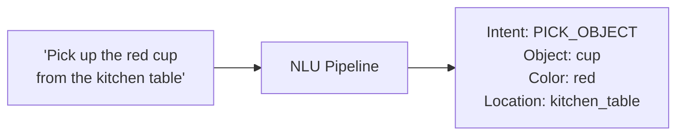
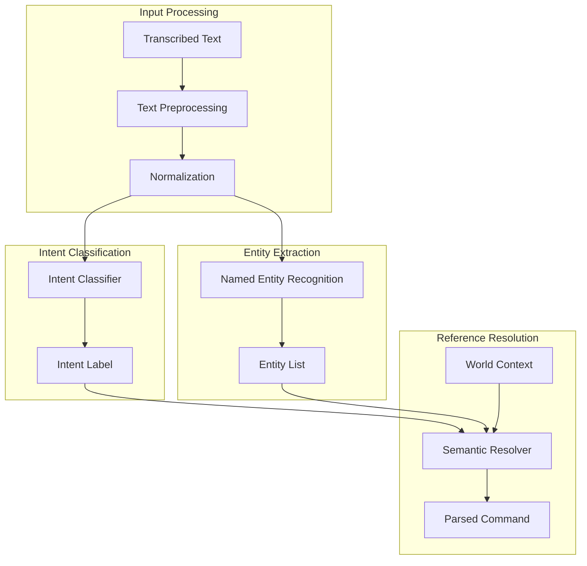
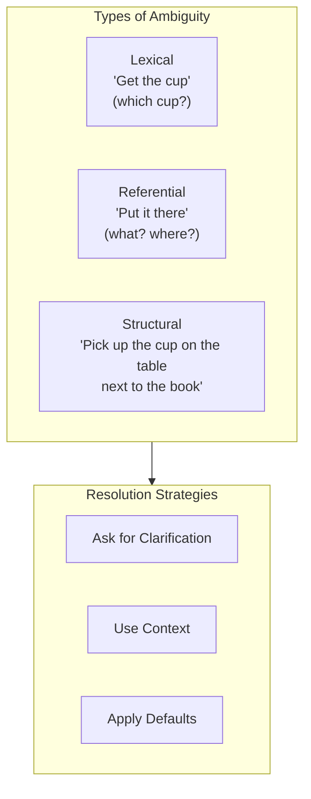

# Chapter 4: Natural Language Command Parsing

:::note Learning Objectives
By the end of this chapter, you will be able to:
- Design a natural language understanding (NLU) pipeline for robot commands
- Implement intent classification for robotic actions
- Extract entities such as objects, locations, and quantities from commands
- Handle ambiguous or incomplete commands gracefully
- Build a modular NLU system integrated with ROS 2
- Apply semantic parsing techniques for complex commands
:::

## From Text to Structured Commands

When a user says "Pick up the red cup from the kitchen table," the robot needs to extract several pieces of structured information:



This transformation from unstructured natural language to structured data is the core challenge of Natural Language Understanding (NLU) for robotics.

## NLU Architecture for Robotics



## Defining the Robot Command Schema

First, we need to define what commands the robot can understand:

```python
from dataclasses import dataclass, field
from typing import List, Dict, Optional, Any
from enum import Enum

class IntentType(Enum):
    """Supported robot command intents"""
    # Manipulation intents
    PICK = "pick"
    PLACE = "place"
    GIVE = "give"
    PUSH = "push"
    PULL = "pull"

    # Navigation intents
    GO_TO = "go_to"
    FOLLOW = "follow"
    COME_HERE = "come_here"
    STOP = "stop"

    # Perception intents
    FIND = "find"
    LOOK_AT = "look_at"
    DESCRIBE = "describe"
    COUNT = "count"

    # Communication intents
    SAY = "say"
    ACKNOWLEDGE = "acknowledge"
    CLARIFY = "clarify"

    # System intents
    CANCEL = "cancel"
    REPEAT = "repeat"
    HELP = "help"
    UNKNOWN = "unknown"


@dataclass
class Entity:
    """Extracted entity from natural language"""
    entity_type: str  # 'object', 'location', 'person', 'color', 'quantity'
    value: str
    confidence: float
    span: tuple[int, int]  # Character positions in original text
    normalized_value: Optional[str] = None


@dataclass
class ParsedCommand:
    """Complete parsed representation of a natural language command"""
    raw_text: str
    intent: IntentType
    intent_confidence: float
    entities: List[Entity]
    parameters: Dict[str, Any] = field(default_factory=dict)

    # Ambiguity handling
    is_ambiguous: bool = False
    ambiguity_reason: Optional[str] = None
    clarification_options: List[str] = field(default_factory=list)

    # Completeness
    is_complete: bool = True
    missing_slots: List[str] = field(default_factory=list)

    def get_entity(self, entity_type: str) -> Optional[Entity]:
        """Get first entity of given type"""
        for entity in self.entities:
            if entity.entity_type == entity_type:
                return entity
        return None

    def get_all_entities(self, entity_type: str) -> List[Entity]:
        """Get all entities of given type"""
        return [e for e in self.entities if e.entity_type == entity_type]
```

## Intent Classification

### Rule-Based Intent Classification

For a controlled vocabulary, rule-based classification is fast and interpretable:

```python
class RuleBasedIntentClassifier:
    """
    Rule-based intent classifier using keyword patterns
    Fast and interpretable for controlled robot vocabulary
    """

    def __init__(self):
        self.intent_patterns = {
            IntentType.PICK: {
                'keywords': ['pick', 'grab', 'take', 'get', 'fetch', 'grasp'],
                'patterns': [
                    r'pick\s+up',
                    r'grab\s+the',
                    r'get\s+me',
                    r'fetch\s+the'
                ]
            },
            IntentType.PLACE: {
                'keywords': ['put', 'place', 'set', 'drop', 'leave'],
                'patterns': [
                    r'put\s+(?:it\s+)?(?:on|in|down)',
                    r'place\s+(?:it\s+)?(?:on|in)',
                    r'set\s+(?:it\s+)?down'
                ]
            },
            IntentType.GO_TO: {
                'keywords': ['go', 'move', 'navigate', 'head', 'walk'],
                'patterns': [
                    r'go\s+to',
                    r'move\s+to',
                    r'navigate\s+to',
                    r'head\s+(?:to|towards)'
                ]
            },
            IntentType.FIND: {
                'keywords': ['find', 'locate', 'search', 'look for', 'where'],
                'patterns': [
                    r'find\s+(?:the\s+)?',
                    r'where\s+is',
                    r'look\s+for',
                    r'search\s+for'
                ]
            },
            IntentType.COME_HERE: {
                'keywords': ['come', 'here', 'approach'],
                'patterns': [
                    r'come\s+(?:here|to\s+me)',
                    r'approach\s+me'
                ]
            },
            IntentType.STOP: {
                'keywords': ['stop', 'halt', 'freeze', 'wait'],
                'patterns': [
                    r'\bstop\b',
                    r'\bhalt\b',
                    r'\bfreeze\b'
                ]
            },
            IntentType.CANCEL: {
                'keywords': ['cancel', 'abort', 'nevermind', 'forget'],
                'patterns': [
                    r'cancel\s+(?:that|it)',
                    r'never\s*mind',
                    r'forget\s+(?:it|that)'
                ]
            }
        }

        # Compile regex patterns
        import re
        for intent_data in self.intent_patterns.values():
            intent_data['compiled'] = [
                re.compile(p, re.IGNORECASE)
                for p in intent_data['patterns']
            ]

    def classify(self, text: str) -> tuple[IntentType, float]:
        """
        Classify intent from text

        Returns: (intent, confidence)
        """
        text_lower = text.lower()
        scores = {}

        for intent, data in self.intent_patterns.items():
            score = 0.0

            # Check keywords
            keyword_matches = sum(1 for kw in data['keywords'] if kw in text_lower)
            score += keyword_matches * 0.3

            # Check patterns
            pattern_matches = sum(
                1 for pattern in data['compiled']
                if pattern.search(text_lower)
            )
            score += pattern_matches * 0.5

            if score > 0:
                scores[intent] = min(score, 1.0)

        if not scores:
            return IntentType.UNKNOWN, 0.0

        best_intent = max(scores, key=scores.get)
        return best_intent, scores[best_intent]
```

### ML-Based Intent Classification

For more flexibility, use a trained model:

```python
from transformers import pipeline, AutoTokenizer, AutoModelForSequenceClassification
import torch

class TransformerIntentClassifier:
    """
    Intent classifier using fine-tuned transformer model
    More flexible but requires training data
    """

    def __init__(self, model_path: str = "robot-intent-classifier"):
        self.device = "cuda" if torch.cuda.is_available() else "cpu"

        # Load model and tokenizer
        self.tokenizer = AutoTokenizer.from_pretrained(model_path)
        self.model = AutoModelForSequenceClassification.from_pretrained(model_path)
        self.model.to(self.device)
        self.model.eval()

        # Intent mapping
        self.id_to_intent = {
            0: IntentType.PICK,
            1: IntentType.PLACE,
            2: IntentType.GO_TO,
            3: IntentType.FIND,
            4: IntentType.STOP,
            # ... etc
        }

    def classify(self, text: str) -> tuple[IntentType, float]:
        """Classify intent using transformer model"""
        inputs = self.tokenizer(
            text,
            return_tensors="pt",
            truncation=True,
            max_length=128
        ).to(self.device)

        with torch.no_grad():
            outputs = self.model(**inputs)
            probs = torch.softmax(outputs.logits, dim=-1)
            confidence, predicted = torch.max(probs, dim=-1)

        intent = self.id_to_intent.get(predicted.item(), IntentType.UNKNOWN)
        return intent, confidence.item()


# Training data format for fine-tuning
TRAINING_EXAMPLES = [
    {"text": "pick up the red cup", "intent": "PICK"},
    {"text": "grab the bottle from the table", "intent": "PICK"},
    {"text": "put this on the shelf", "intent": "PLACE"},
    {"text": "go to the kitchen", "intent": "GO_TO"},
    {"text": "find my keys", "intent": "FIND"},
    # ... more examples
]
```

## Entity Extraction

### Named Entity Recognition for Robotics

```python
import spacy
from typing import List

class RobotEntityExtractor:
    """
    Extracts robot-relevant entities from natural language
    """

    def __init__(self):
        # Load spaCy model
        self.nlp = spacy.load("en_core_web_sm")

        # Custom entity patterns for robotics
        self.object_patterns = [
            'cup', 'mug', 'bottle', 'glass', 'plate', 'bowl',
            'book', 'phone', 'laptop', 'remote', 'keys',
            'apple', 'banana', 'orange', 'box', 'bag',
            'pen', 'pencil', 'paper', 'folder', 'tool'
        ]

        self.location_patterns = [
            'table', 'desk', 'shelf', 'counter', 'floor',
            'kitchen', 'living room', 'bedroom', 'bathroom',
            'office', 'garage', 'hallway', 'entrance',
            'left', 'right', 'front', 'back', 'corner'
        ]

        self.color_patterns = [
            'red', 'blue', 'green', 'yellow', 'orange',
            'purple', 'pink', 'black', 'white', 'gray',
            'brown', 'silver', 'gold'
        ]

        self.size_patterns = [
            'big', 'large', 'small', 'tiny', 'huge',
            'tall', 'short', 'wide', 'narrow'
        ]

    def extract(self, text: str) -> List[Entity]:
        """Extract entities from text"""
        entities = []
        text_lower = text.lower()
        doc = self.nlp(text)

        # Extract using spaCy NER
        for ent in doc.ents:
            if ent.label_ == "PERSON":
                entities.append(Entity(
                    entity_type='person',
                    value=ent.text,
                    confidence=0.9,
                    span=(ent.start_char, ent.end_char)
                ))
            elif ent.label_ in ["GPE", "LOC", "FAC"]:
                entities.append(Entity(
                    entity_type='location',
                    value=ent.text,
                    confidence=0.8,
                    span=(ent.start_char, ent.end_char)
                ))

        # Extract custom patterns
        entities.extend(self._extract_patterns(text_lower, 'object', self.object_patterns))
        entities.extend(self._extract_patterns(text_lower, 'location', self.location_patterns))
        entities.extend(self._extract_patterns(text_lower, 'color', self.color_patterns))
        entities.extend(self._extract_patterns(text_lower, 'size', self.size_patterns))

        # Extract quantities
        entities.extend(self._extract_quantities(doc))

        return entities

    def _extract_patterns(
        self,
        text: str,
        entity_type: str,
        patterns: List[str]
    ) -> List[Entity]:
        """Extract entities matching patterns"""
        entities = []
        for pattern in patterns:
            idx = text.find(pattern)
            if idx != -1:
                entities.append(Entity(
                    entity_type=entity_type,
                    value=pattern,
                    confidence=0.85,
                    span=(idx, idx + len(pattern))
                ))
        return entities

    def _extract_quantities(self, doc) -> List[Entity]:
        """Extract numeric quantities"""
        entities = []
        for token in doc:
            if token.like_num:
                entities.append(Entity(
                    entity_type='quantity',
                    value=token.text,
                    confidence=0.95,
                    span=(token.idx, token.idx + len(token.text)),
                    normalized_value=str(self._word_to_num(token.text))
                ))
        return entities

    def _word_to_num(self, word: str) -> int:
        """Convert word numbers to integers"""
        word_nums = {
            'one': 1, 'two': 2, 'three': 3, 'four': 4, 'five': 5,
            'six': 6, 'seven': 7, 'eight': 8, 'nine': 9, 'ten': 10
        }
        try:
            return int(word)
        except ValueError:
            return word_nums.get(word.lower(), 1)
```

## Handling Ambiguity and Incompleteness

Real user commands are often ambiguous or incomplete:



### Ambiguity Resolution System

```python
class AmbiguityResolver:
    """
    Resolves ambiguous commands using context and clarification
    """

    def __init__(self, world_state_provider):
        self.world_state = world_state_provider

    def resolve(self, parsed: ParsedCommand) -> ParsedCommand:
        """
        Attempt to resolve ambiguities in parsed command
        """
        # Check for missing required slots
        required_slots = self._get_required_slots(parsed.intent)
        missing = []

        for slot in required_slots:
            if not parsed.get_entity(slot):
                missing.append(slot)

        if missing:
            parsed.is_complete = False
            parsed.missing_slots = missing

        # Check for ambiguous references
        ambiguities = self._check_ambiguities(parsed)
        if ambiguities:
            parsed.is_ambiguous = True
            parsed.ambiguity_reason = ambiguities[0]['reason']
            parsed.clarification_options = ambiguities[0]['options']

        # Attempt context-based resolution
        parsed = self._resolve_with_context(parsed)

        return parsed

    def _get_required_slots(self, intent: IntentType) -> List[str]:
        """Get required entity slots for intent"""
        requirements = {
            IntentType.PICK: ['object'],
            IntentType.PLACE: ['object', 'location'],
            IntentType.GO_TO: ['location'],
            IntentType.FIND: ['object'],
            IntentType.GIVE: ['object', 'person']
        }
        return requirements.get(intent, [])

    def _check_ambiguities(self, parsed: ParsedCommand) -> List[dict]:
        """Check for ambiguous references"""
        ambiguities = []

        # Check for ambiguous object references
        object_entity = parsed.get_entity('object')
        if object_entity:
            world_objects = self.world_state.get_objects_by_type(object_entity.value)
            if len(world_objects) > 1:
                # Multiple matching objects
                color = parsed.get_entity('color')
                if not color:
                    ambiguities.append({
                        'type': 'object_ambiguity',
                        'reason': f"Multiple {object_entity.value}s detected",
                        'options': [f"the {obj.color} {obj.type}" for obj in world_objects]
                    })

        return ambiguities

    def _resolve_with_context(self, parsed: ParsedCommand) -> ParsedCommand:
        """Use world context to resolve ambiguities"""
        # Resolve "it" references
        if any(e.value == 'it' for e in parsed.entities):
            last_object = self.world_state.get_last_referenced_object()
            if last_object:
                parsed.parameters['resolved_object'] = last_object

        # Resolve "there" references
        if any(e.value == 'there' for e in parsed.entities):
            last_location = self.world_state.get_last_referenced_location()
            if last_location:
                parsed.parameters['resolved_location'] = last_location

        return parsed


class ClarificationGenerator:
    """
    Generates clarification questions for ambiguous commands
    """

    TEMPLATES = {
        'object_ambiguity': "I see multiple {object}s. Which one - {options}?",
        'missing_object': "What would you like me to {action}?",
        'missing_location': "Where should I {action} the {object}?",
        'missing_person': "Who should I {action} the {object} to?",
        'unclear_intent': "I'm not sure what you mean. Did you want me to {options}?"
    }

    def generate(self, parsed: ParsedCommand) -> Optional[str]:
        """Generate clarification question"""
        if not parsed.is_ambiguous and parsed.is_complete:
            return None

        if parsed.is_ambiguous:
            template = self.TEMPLATES.get(
                parsed.ambiguity_reason.split(':')[0],
                self.TEMPLATES['unclear_intent']
            )
            return template.format(
                object=parsed.get_entity('object').value if parsed.get_entity('object') else 'object',
                options=' or '.join(parsed.clarification_options),
                action=parsed.intent.value
            )

        if parsed.missing_slots:
            slot = parsed.missing_slots[0]
            template = self.TEMPLATES.get(f'missing_{slot}', "Could you be more specific?")
            return template.format(
                object=parsed.get_entity('object').value if parsed.get_entity('object') else 'it',
                action=parsed.intent.value
            )

        return None
```

## Complete NLU Pipeline

```python
#!/usr/bin/env python3
"""
Natural Language Understanding Pipeline for Robot Commands
"""

import rclpy
from rclpy.node import Node
from std_msgs.msg import String
from vla_interfaces.msg import ParsedCommand as ParsedCommandMsg

class NLUPipelineNode(Node):
    """
    ROS 2 node for natural language understanding

    Subscribers:
        /speech/text (String): Transcribed speech

    Publishers:
        /nlu/parsed_command (ParsedCommand): Structured command
        /nlu/clarification (String): Clarification questions
    """

    def __init__(self):
        super().__init__('nlu_pipeline_node')

        # Initialize components
        self.intent_classifier = RuleBasedIntentClassifier()
        self.entity_extractor = RobotEntityExtractor()
        self.ambiguity_resolver = AmbiguityResolver(WorldStateProvider())
        self.clarification_generator = ClarificationGenerator()

        # Conversation context for multi-turn dialogues
        self.conversation_context = ConversationContext()

        # Subscribers
        self.text_sub = self.create_subscription(
            String,
            '/speech/text',
            self.text_callback,
            10
        )

        # Publishers
        self.command_pub = self.create_publisher(
            ParsedCommandMsg,
            '/nlu/parsed_command',
            10
        )
        self.clarification_pub = self.create_publisher(
            String,
            '/nlu/clarification',
            10
        )

        self.get_logger().info('NLU Pipeline node initialized')

    def text_callback(self, msg: String):
        """Process incoming transcribed text"""
        text = msg.data

        # Check if this is a response to clarification
        if self.conversation_context.awaiting_clarification:
            parsed = self._handle_clarification_response(text)
        else:
            parsed = self._parse_command(text)

        # Handle result
        if parsed.is_complete and not parsed.is_ambiguous:
            self._publish_command(parsed)
        else:
            clarification = self.clarification_generator.generate(parsed)
            if clarification:
                self._publish_clarification(clarification)
                self.conversation_context.set_awaiting_clarification(parsed)

    def _parse_command(self, text: str) -> ParsedCommand:
        """Run full NLU pipeline on text"""
        # Preprocess
        text = self._preprocess(text)

        # Classify intent
        intent, intent_confidence = self.intent_classifier.classify(text)

        # Extract entities
        entities = self.entity_extractor.extract(text)

        # Create parsed command
        parsed = ParsedCommand(
            raw_text=text,
            intent=intent,
            intent_confidence=intent_confidence,
            entities=entities
        )

        # Resolve ambiguities
        parsed = self.ambiguity_resolver.resolve(parsed)

        self.get_logger().info(
            f'Parsed: intent={intent.value}, entities={len(entities)}, '
            f'complete={parsed.is_complete}, ambiguous={parsed.is_ambiguous}'
        )

        return parsed

    def _preprocess(self, text: str) -> str:
        """Preprocess text for NLU"""
        # Remove filler words
        fillers = ['um', 'uh', 'like', 'you know', 'basically']
        for filler in fillers:
            text = text.replace(filler, '')

        # Normalize whitespace
        text = ' '.join(text.split())

        return text.strip()

    def _handle_clarification_response(self, text: str) -> ParsedCommand:
        """Handle response to clarification question"""
        original = self.conversation_context.pending_command

        # Merge clarification into original command
        new_entities = self.entity_extractor.extract(text)
        original.entities.extend(new_entities)

        # Re-resolve
        return self.ambiguity_resolver.resolve(original)

    def _publish_command(self, parsed: ParsedCommand):
        """Publish parsed command"""
        msg = ParsedCommandMsg()
        msg.raw_text = parsed.raw_text
        msg.intent = parsed.intent.value
        msg.intent_confidence = parsed.intent_confidence
        # ... populate other fields

        self.command_pub.publish(msg)
        self.conversation_context.clear()

    def _publish_clarification(self, question: str):
        """Publish clarification question"""
        msg = String()
        msg.data = question
        self.clarification_pub.publish(msg)
        self.get_logger().info(f'Asking clarification: {question}')


class ConversationContext:
    """Maintains multi-turn conversation state"""

    def __init__(self):
        self.awaiting_clarification = False
        self.pending_command: Optional[ParsedCommand] = None
        self.conversation_history: List[str] = []

    def set_awaiting_clarification(self, command: ParsedCommand):
        self.awaiting_clarification = True
        self.pending_command = command

    def clear(self):
        self.awaiting_clarification = False
        self.pending_command = None


def main(args=None):
    rclpy.init(args=args)
    node = NLUPipelineNode()
    rclpy.spin(node)
    rclpy.shutdown()


if __name__ == '__main__':
    main()
```

## LLM-Enhanced Entity Extraction

For complex commands, use an LLM for entity extraction:

```python
from openai import OpenAI

class LLMEntityExtractor:
    """
    Use LLM for robust entity extraction
    """

    EXTRACTION_PROMPT = """
Extract structured information from this robot command.

Command: "{command}"

Extract the following if present:
- intent: The main action (pick, place, go_to, find, etc.)
- objects: List of objects mentioned with their attributes
- locations: List of locations mentioned
- people: List of people mentioned
- quantities: Any numbers or amounts
- modifiers: Adjectives like colors, sizes

Return as JSON:
{{
    "intent": "string",
    "objects": [{{"name": "string", "color": "string", "size": "string"}}],
    "locations": [{{"name": "string", "relation": "on/in/near"}}],
    "people": ["string"],
    "quantities": [{{"value": number, "unit": "string"}}],
    "confidence": 0.0-1.0
}}
"""

    def __init__(self, model: str = "gpt-4"):
        self.client = OpenAI()
        self.model = model

    def extract(self, command: str) -> dict:
        """Extract entities using LLM"""
        response = self.client.chat.completions.create(
            model=self.model,
            messages=[
                {"role": "system", "content": "You are a robot command parser."},
                {"role": "user", "content": self.EXTRACTION_PROMPT.format(command=command)}
            ],
            response_format={"type": "json_object"}
        )

        import json
        return json.loads(response.choices[0].message.content)
```

## Summary

In this chapter, you learned:

- How to design an NLU pipeline for robot command parsing
- Intent classification using both rule-based and ML approaches
- Entity extraction for objects, locations, colors, and quantities
- Handling ambiguous and incomplete commands
- Building a complete NLU node for ROS 2
- Using LLMs for enhanced entity extraction

## Key Takeaways

:::tip Remember
1. **Define a clear command schema** before building the NLU system
2. **Rule-based intent classification** works well for controlled vocabularies
3. **Entity extraction** requires domain-specific patterns for robotics
4. **Ambiguity resolution** is critical for natural interaction
5. **Multi-turn dialogue** enables natural clarification flows
:::

## Next Steps

In the next chapter, we will explore how to use Large Language Models for cognitive task planning, taking the parsed commands and generating executable action sequences.

---

## Review Questions

1. What is the difference between intent classification and entity extraction?
2. When would you choose rule-based vs ML-based intent classification?
3. What are three types of ambiguity in natural language commands?
4. How can world context help resolve ambiguous references?
5. Why is multi-turn dialogue important for robot NLU?

## Hands-On Exercise

Build and extend the NLU pipeline:

1. Add five new intent types relevant to your robot application
2. Extend the entity patterns to include furniture items
3. Implement handling for compound commands (e.g., "Pick up the cup and bring it to me")
4. Create a test suite with at least 20 example commands covering various intents and entities
5. Measure and report intent classification accuracy on your test set

Bonus: Integrate the LLM entity extractor and compare its performance against the rule-based approach.
