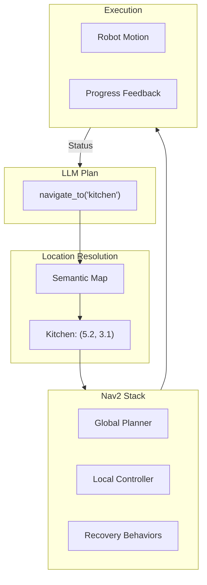

# Chapter 9: Navigation with LLM-Generated Goals

:::note Learning Objectives
By the end of this chapter, you will be able to:
- Integrate Nav2 navigation stack with VLA systems
- Convert LLM-generated location goals to navigation targets
- Implement semantic location mapping for natural language
- Handle dynamic obstacles during navigation
- Build a navigation interface for LLM planners
- Create waypoint sequences for complex navigation tasks
:::

## From "Go to the Kitchen" to Robot Motion

When the LLM planner generates a navigation step like "navigate_to(location='kitchen')", the robot must:

1. **Resolve** the semantic location to coordinates
2. **Plan** a collision-free path using Nav2
3. **Execute** the navigation with obstacle avoidance
4. **Monitor** progress and handle failures



## Semantic Location Mapping

### Location Database

```python
from dataclasses import dataclass
from typing import Dict, List, Optional, Tuple
import numpy as np
import json

@dataclass
class SemanticLocation:
    """A named location in the environment"""
    name: str
    position: np.ndarray  # (x, y) in map frame
    orientation: float  # theta in radians
    aliases: List[str]  # Alternative names
    category: str  # 'room', 'furniture', 'landmark'
    description: str
    approach_distance: float = 0.5  # How close to get


class SemanticLocationMap:
    """
    Maps semantic location names to coordinates

    Enables natural language navigation goals
    """

    def __init__(self):
        self.locations: Dict[str, SemanticLocation] = {}
        self.alias_map: Dict[str, str] = {}  # alias -> canonical name

    def add_location(self, location: SemanticLocation):
        """Add a location to the map"""
        self.locations[location.name.lower()] = location

        # Register aliases
        for alias in location.aliases:
            self.alias_map[alias.lower()] = location.name.lower()

    def load_from_file(self, filepath: str):
        """Load locations from JSON file"""
        with open(filepath, 'r') as f:
            data = json.load(f)

        for loc_data in data['locations']:
            location = SemanticLocation(
                name=loc_data['name'],
                position=np.array(loc_data['position']),
                orientation=loc_data.get('orientation', 0.0),
                aliases=loc_data.get('aliases', []),
                category=loc_data.get('category', 'landmark'),
                description=loc_data.get('description', ''),
                approach_distance=loc_data.get('approach_distance', 0.5)
            )
            self.add_location(location)

    def resolve_location(
        self,
        query: str,
        robot_position: Optional[np.ndarray] = None
    ) -> Optional[SemanticLocation]:
        """
        Resolve natural language location to coordinates

        Args:
            query: Location description like "kitchen", "near the sofa"
            robot_position: Current robot position for relative queries

        Returns:
            SemanticLocation or None if not found
        """
        query_lower = query.lower().strip()

        # Direct match
        if query_lower in self.locations:
            return self.locations[query_lower]

        # Alias match
        if query_lower in self.alias_map:
            return self.locations[self.alias_map[query_lower]]

        # Partial match
        for name, location in self.locations.items():
            if query_lower in name or name in query_lower:
                return location

        # Fuzzy match with aliases
        for alias, canonical in self.alias_map.items():
            if query_lower in alias or alias in query_lower:
                return self.locations[canonical]

        # Handle relative locations
        if 'near' in query_lower or 'by' in query_lower:
            return self._resolve_relative(query_lower, robot_position)

        return None

    def _resolve_relative(
        self,
        query: str,
        robot_position: Optional[np.ndarray]
    ) -> Optional[SemanticLocation]:
        """Resolve relative location descriptions"""
        # Extract object reference
        for name, location in self.locations.items():
            if name in query:
                # Create a location near the referenced object
                offset = np.array([location.approach_distance, 0])
                near_location = SemanticLocation(
                    name=f"near_{name}",
                    position=location.position + offset,
                    orientation=location.orientation,
                    aliases=[],
                    category='relative',
                    description=f"Near {name}"
                )
                return near_location

        return None

    def get_nearest_location(
        self,
        position: np.ndarray,
        category: Optional[str] = None
    ) -> Optional[SemanticLocation]:
        """Find nearest location to a position"""
        nearest = None
        min_dist = float('inf')

        for location in self.locations.values():
            if category and location.category != category:
                continue

            dist = np.linalg.norm(position - location.position)
            if dist < min_dist:
                min_dist = dist
                nearest = location

        return nearest

    def get_all_in_category(self, category: str) -> List[SemanticLocation]:
        """Get all locations in a category"""
        return [
            loc for loc in self.locations.values()
            if loc.category == category
        ]


# Example location configuration
EXAMPLE_LOCATIONS = {
    "locations": [
        {
            "name": "kitchen",
            "position": [5.2, 3.1],
            "orientation": 1.57,
            "aliases": ["kitchen area", "cooking area"],
            "category": "room",
            "description": "Main kitchen with counter and appliances"
        },
        {
            "name": "living room",
            "position": [2.0, 1.5],
            "orientation": 0.0,
            "aliases": ["lounge", "sitting room", "main room"],
            "category": "room",
            "description": "Living room with sofa and TV"
        },
        {
            "name": "dining table",
            "position": [4.0, 2.5],
            "orientation": 0.0,
            "aliases": ["table", "dinner table"],
            "category": "furniture",
            "description": "Dining table in kitchen area"
        },
        {
            "name": "sofa",
            "position": [1.5, 1.0],
            "orientation": 3.14,
            "aliases": ["couch", "settee"],
            "category": "furniture",
            "description": "Main sofa in living room"
        },
        {
            "name": "front door",
            "position": [0.5, 0.0],
            "orientation": 0.0,
            "aliases": ["entrance", "main door", "entry"],
            "category": "landmark",
            "description": "Main entrance to the home"
        }
    ]
}
```

## Nav2 Integration

### Navigation Action Client

```python
#!/usr/bin/env python3
"""
Navigation Interface for VLA System
"""

import rclpy
from rclpy.node import Node
from rclpy.action import ActionClient
from rclpy.duration import Duration
from nav2_msgs.action import NavigateToPose, NavigateThroughPoses, ComputePathToPose
from geometry_msgs.msg import PoseStamped, PoseWithCovarianceStamped
from std_msgs.msg import String
from nav_msgs.msg import Path
import numpy as np
from enum import Enum
import asyncio

class NavigationStatus(Enum):
    """Navigation status states"""
    IDLE = "idle"
    NAVIGATING = "navigating"
    SUCCEEDED = "succeeded"
    FAILED = "failed"
    CANCELLED = "cancelled"
    RECOVERING = "recovering"


class VLANavigationInterface(Node):
    """
    Navigation interface for VLA system

    Bridges LLM-generated navigation goals to Nav2
    """

    def __init__(self):
        super().__init__('vla_navigation_interface')

        # Initialize semantic map
        self.semantic_map = SemanticLocationMap()
        # Load from file in production
        self._load_default_locations()

        # Nav2 action clients
        self.nav_to_pose_client = ActionClient(
            self, NavigateToPose, 'navigate_to_pose'
        )
        self.nav_through_poses_client = ActionClient(
            self, NavigateThroughPoses, 'navigate_through_poses'
        )
        self.compute_path_client = ActionClient(
            self, ComputePathToPose, 'compute_path_to_pose'
        )

        # Publishers
        self.status_pub = self.create_publisher(String, '/navigation/status', 10)
        self.goal_pub = self.create_publisher(PoseStamped, '/navigation/current_goal', 10)

        # State
        self.current_status = NavigationStatus.IDLE
        self.current_goal_handle = None
        self.robot_pose = None

        # Subscribers
        self.pose_sub = self.create_subscription(
            PoseWithCovarianceStamped,
            '/amcl_pose',
            self.pose_callback,
            10
        )

        # Parameters
        self.declare_parameter('navigation_timeout', 120.0)
        self.declare_parameter('position_tolerance', 0.3)
        self.declare_parameter('orientation_tolerance', 0.2)

        self.get_logger().info('VLA Navigation Interface initialized')

    def _load_default_locations(self):
        """Load default semantic locations"""
        for loc_data in EXAMPLE_LOCATIONS['locations']:
            location = SemanticLocation(
                name=loc_data['name'],
                position=np.array(loc_data['position']),
                orientation=loc_data.get('orientation', 0.0),
                aliases=loc_data.get('aliases', []),
                category=loc_data.get('category', 'landmark'),
                description=loc_data.get('description', '')
            )
            self.semantic_map.add_location(location)

    def pose_callback(self, msg: PoseWithCovarianceStamped):
        """Update current robot pose"""
        self.robot_pose = np.array([
            msg.pose.pose.position.x,
            msg.pose.pose.position.y
        ])

    async def navigate_to(
        self,
        location_name: str,
        wait_for_result: bool = True
    ) -> bool:
        """
        Navigate to a named location

        Args:
            location_name: Semantic location name (e.g., "kitchen")
            wait_for_result: Whether to wait for navigation to complete

        Returns:
            True if navigation succeeded
        """
        # Resolve location
        location = self.semantic_map.resolve_location(
            location_name, self.robot_pose
        )

        if location is None:
            self.publish_status(f"Unknown location: {location_name}")
            return False

        self.publish_status(f"Navigating to {location.name}")

        # Create goal pose
        goal_pose = self._create_goal_pose(location)

        # Send navigation goal
        return await self._send_nav_goal(goal_pose, wait_for_result)

    async def navigate_to_pose(
        self,
        x: float,
        y: float,
        theta: float = 0.0,
        wait_for_result: bool = True
    ) -> bool:
        """
        Navigate to specific coordinates

        Args:
            x, y: Target position
            theta: Target orientation
            wait_for_result: Whether to wait for completion

        Returns:
            True if succeeded
        """
        goal_pose = PoseStamped()
        goal_pose.header.frame_id = 'map'
        goal_pose.header.stamp = self.get_clock().now().to_msg()
        goal_pose.pose.position.x = x
        goal_pose.pose.position.y = y
        goal_pose.pose.orientation.z = np.sin(theta / 2)
        goal_pose.pose.orientation.w = np.cos(theta / 2)

        return await self._send_nav_goal(goal_pose, wait_for_result)

    async def navigate_waypoints(
        self,
        waypoints: List[str]
    ) -> bool:
        """
        Navigate through multiple waypoints

        Args:
            waypoints: List of location names

        Returns:
            True if all waypoints reached
        """
        poses = []

        for waypoint in waypoints:
            location = self.semantic_map.resolve_location(waypoint, self.robot_pose)
            if location is None:
                self.publish_status(f"Unknown waypoint: {waypoint}")
                return False
            poses.append(self._create_goal_pose(location))

        return await self._send_waypoint_goal(poses)

    async def _send_nav_goal(
        self,
        goal_pose: PoseStamped,
        wait_for_result: bool
    ) -> bool:
        """Send navigation goal to Nav2"""
        # Wait for action server
        if not self.nav_to_pose_client.wait_for_server(timeout_sec=5.0):
            self.publish_status("Navigation server not available")
            return False

        # Create goal
        goal_msg = NavigateToPose.Goal()
        goal_msg.pose = goal_pose

        # Send goal
        self.current_status = NavigationStatus.NAVIGATING
        self.goal_pub.publish(goal_pose)

        send_goal_future = self.nav_to_pose_client.send_goal_async(
            goal_msg,
            feedback_callback=self._nav_feedback_callback
        )

        goal_handle = await send_goal_future

        if not goal_handle.accepted:
            self.publish_status("Navigation goal rejected")
            self.current_status = NavigationStatus.FAILED
            return False

        self.current_goal_handle = goal_handle

        if wait_for_result:
            result = await goal_handle.get_result_async()
            return self._process_nav_result(result)

        return True

    async def _send_waypoint_goal(self, poses: List[PoseStamped]) -> bool:
        """Send waypoint navigation goal"""
        if not self.nav_through_poses_client.wait_for_server(timeout_sec=5.0):
            self.publish_status("Navigation server not available")
            return False

        goal_msg = NavigateThroughPoses.Goal()
        goal_msg.poses = poses

        self.current_status = NavigationStatus.NAVIGATING
        send_goal_future = self.nav_through_poses_client.send_goal_async(
            goal_msg,
            feedback_callback=self._waypoint_feedback_callback
        )

        goal_handle = await send_goal_future

        if not goal_handle.accepted:
            self.publish_status("Waypoint navigation rejected")
            self.current_status = NavigationStatus.FAILED
            return False

        self.current_goal_handle = goal_handle
        result = await goal_handle.get_result_async()

        return self._process_nav_result(result)

    def _nav_feedback_callback(self, feedback_msg):
        """Handle navigation feedback"""
        feedback = feedback_msg.feedback
        distance = feedback.distance_remaining
        eta = feedback.estimated_time_remaining.sec

        self.publish_status(
            f"Navigating: {distance:.1f}m remaining, ETA: {eta}s"
        )

    def _waypoint_feedback_callback(self, feedback_msg):
        """Handle waypoint navigation feedback"""
        feedback = feedback_msg.feedback
        current_wp = feedback.current_waypoint
        self.publish_status(f"At waypoint {current_wp}")

    def _process_nav_result(self, result) -> bool:
        """Process navigation result"""
        if result.result:
            self.current_status = NavigationStatus.SUCCEEDED
            self.publish_status("Navigation succeeded")
            return True
        else:
            self.current_status = NavigationStatus.FAILED
            self.publish_status("Navigation failed")
            return False

    def _create_goal_pose(self, location: SemanticLocation) -> PoseStamped:
        """Create PoseStamped from SemanticLocation"""
        pose = PoseStamped()
        pose.header.frame_id = 'map'
        pose.header.stamp = self.get_clock().now().to_msg()
        pose.pose.position.x = location.position[0]
        pose.pose.position.y = location.position[1]
        pose.pose.orientation.z = np.sin(location.orientation / 2)
        pose.pose.orientation.w = np.cos(location.orientation / 2)
        return pose

    async def cancel_navigation(self) -> bool:
        """Cancel current navigation"""
        if self.current_goal_handle is None:
            return False

        cancel_future = self.current_goal_handle.cancel_goal_async()
        result = await cancel_future

        self.current_status = NavigationStatus.CANCELLED
        self.publish_status("Navigation cancelled")
        return True

    async def check_path_exists(
        self,
        location_name: str
    ) -> Tuple[bool, Optional[float]]:
        """
        Check if path to location exists

        Returns:
            (exists, path_length)
        """
        location = self.semantic_map.resolve_location(location_name, self.robot_pose)
        if location is None:
            return False, None

        # Use compute path service
        if not self.compute_path_client.wait_for_server(timeout_sec=2.0):
            return False, None

        goal = ComputePathToPose.Goal()
        goal.goal = self._create_goal_pose(location)

        result_future = await self.compute_path_client.send_goal_async(goal)
        result = await result_future.get_result_async()

        if result.result.path.poses:
            path_length = self._compute_path_length(result.result.path)
            return True, path_length

        return False, None

    def _compute_path_length(self, path: Path) -> float:
        """Compute path length from Path message"""
        length = 0.0
        poses = path.poses

        for i in range(1, len(poses)):
            p1 = poses[i-1].pose.position
            p2 = poses[i].pose.position
            length += np.sqrt((p2.x - p1.x)**2 + (p2.y - p1.y)**2)

        return length

    def publish_status(self, status: str):
        """Publish navigation status"""
        msg = String()
        msg.data = status
        self.status_pub.publish(msg)
        self.get_logger().info(f'Navigation: {status}')
```

## LLM-Aware Navigation Planning

### Navigation Skill for LLM Planner

```python
class NavigationSkill:
    """
    Navigation skill that can be called by LLM planner

    Provides high-level navigation capabilities
    """

    def __init__(self, nav_interface: VLANavigationInterface):
        self.nav = nav_interface

    def get_skill_description(self) -> str:
        """Return description for LLM planner"""
        return """
        navigate_to(location: str) -> bool
            Navigate robot to named location.
            Locations: kitchen, living room, bedroom, bathroom, dining table, sofa, front door
            Returns: True if reached, False if failed

        approach_object(object_description: str) -> bool
            Move close to a detected object.
            Uses perception to find object and navigates near it.

        check_reachable(location: str) -> bool
            Check if location is reachable from current position.
        """

    async def execute(
        self,
        action: str,
        parameters: Dict[str, Any]
    ) -> Dict[str, Any]:
        """Execute navigation action from LLM plan"""
        if action == 'navigate_to':
            location = parameters.get('location', '')
            success = await self.nav.navigate_to(location)
            return {
                'success': success,
                'location': location,
                'robot_position': self.nav.robot_pose.tolist() if self.nav.robot_pose is not None else None
            }

        elif action == 'approach':
            # Approach would use perception to get object position
            object_desc = parameters.get('object', '')
            # Get object position from perception
            # Navigate near it
            return {'success': False, 'error': 'Not implemented'}

        elif action == 'navigate_waypoints':
            waypoints = parameters.get('waypoints', [])
            success = await self.nav.navigate_waypoints(waypoints)
            return {'success': success, 'waypoints': waypoints}

        return {'success': False, 'error': f'Unknown action: {action}'}

    def get_available_locations(self) -> List[str]:
        """Get list of available locations for LLM context"""
        return list(self.nav.semantic_map.locations.keys())
```

### Dynamic Goal Generation

```python
class DynamicGoalGenerator:
    """
    Generates navigation goals dynamically based on context

    Handles goals like "go near the table" or "approach John"
    """

    def __init__(
        self,
        nav_interface: VLANavigationInterface,
        perception_interface  # WorldStateManager
    ):
        self.nav = nav_interface
        self.perception = perception_interface

    async def generate_goal_for_object(
        self,
        object_description: str,
        approach_distance: float = 0.5
    ) -> Optional[PoseStamped]:
        """
        Generate navigation goal near a perceived object

        Args:
            object_description: Description like "the red cup"
            approach_distance: How close to get

        Returns:
            Goal pose or None
        """
        # Find object in perception
        world_state = self.perception.get_state_for_planner()
        target_obj = None

        for obj in world_state.get('detected_objects', []):
            if object_description.lower() in obj['name'].lower():
                target_obj = obj
                break

        if target_obj is None:
            return None

        obj_pos = np.array(target_obj['position'][:2])

        # Compute approach position
        robot_pos = self.nav.robot_pose
        if robot_pos is None:
            return None

        # Direction from object to robot
        direction = robot_pos - obj_pos
        direction = direction / np.linalg.norm(direction)

        # Goal is approach_distance from object, towards robot
        goal_pos = obj_pos + direction * approach_distance

        # Create pose
        goal_pose = PoseStamped()
        goal_pose.header.frame_id = 'map'
        goal_pose.pose.position.x = goal_pos[0]
        goal_pose.pose.position.y = goal_pos[1]

        # Face the object
        angle = np.arctan2(-direction[1], -direction[0])
        goal_pose.pose.orientation.z = np.sin(angle / 2)
        goal_pose.pose.orientation.w = np.cos(angle / 2)

        return goal_pose

    async def generate_goal_for_person(
        self,
        person_name: str,
        approach_distance: float = 1.0
    ) -> Optional[PoseStamped]:
        """Generate goal near a person"""
        # Similar to object approach but for tracked humans
        world_state = self.perception.get_state_for_planner()

        for human in world_state.get('humans', []):
            if person_name.lower() in human.get('name', '').lower():
                pos = np.array(human['position'][:2])
                robot_pos = self.nav.robot_pose

                direction = robot_pos - pos
                direction = direction / np.linalg.norm(direction)
                goal_pos = pos + direction * approach_distance

                goal_pose = PoseStamped()
                goal_pose.header.frame_id = 'map'
                goal_pose.pose.position.x = goal_pos[0]
                goal_pose.pose.position.y = goal_pos[1]

                angle = np.arctan2(-direction[1], -direction[0])
                goal_pose.pose.orientation.z = np.sin(angle / 2)
                goal_pose.pose.orientation.w = np.cos(angle / 2)

                return goal_pose

        return None
```

## Handling Navigation Failures

```python
class NavigationRecoveryManager:
    """
    Handles navigation failures and recovery

    Provides strategies for common navigation issues
    """

    def __init__(self, nav_interface: VLANavigationInterface):
        self.nav = nav_interface
        self.recovery_attempts = 0
        self.max_attempts = 3

    async def handle_failure(
        self,
        goal_location: str,
        failure_reason: str
    ) -> Dict[str, Any]:
        """
        Handle navigation failure

        Returns:
            Recovery action result
        """
        self.recovery_attempts += 1

        if self.recovery_attempts > self.max_attempts:
            return {
                'success': False,
                'action': 'abort',
                'message': 'Maximum recovery attempts exceeded'
            }

        # Analyze failure
        if 'blocked' in failure_reason.lower():
            return await self._handle_blocked_path(goal_location)
        elif 'timeout' in failure_reason.lower():
            return await self._handle_timeout(goal_location)
        elif 'localization' in failure_reason.lower():
            return await self._handle_localization_failure()
        else:
            return await self._handle_generic_failure(goal_location)

    async def _handle_blocked_path(
        self,
        goal_location: str
    ) -> Dict[str, Any]:
        """Handle blocked path failure"""
        # Try alternative approach points
        location = self.nav.semantic_map.resolve_location(
            goal_location, self.nav.robot_pose
        )

        if location is None:
            return {'success': False, 'action': 'abort'}

        # Generate alternative goals around the location
        alternatives = self._generate_alternative_goals(location)

        for alt_pose in alternatives:
            success = await self.nav.navigate_to_pose(
                alt_pose.pose.position.x,
                alt_pose.pose.position.y
            )
            if success:
                return {
                    'success': True,
                    'action': 'alternative_goal',
                    'message': 'Reached alternative position'
                }

        return {
            'success': False,
            'action': 'no_alternative',
            'message': 'All alternative goals failed'
        }

    async def _handle_timeout(self, goal_location: str) -> Dict[str, Any]:
        """Handle navigation timeout"""
        # Check if we're making progress
        # Retry with longer timeout
        return {
            'success': False,
            'action': 'retry',
            'message': 'Retrying with extended timeout'
        }

    async def _handle_localization_failure(self) -> Dict[str, Any]:
        """Handle localization issues"""
        # Trigger relocalization
        return {
            'success': False,
            'action': 'relocalize',
            'message': 'Attempting relocalization'
        }

    async def _handle_generic_failure(
        self,
        goal_location: str
    ) -> Dict[str, Any]:
        """Handle generic navigation failure"""
        # Clear costmap and retry
        return {
            'success': False,
            'action': 'clear_and_retry',
            'message': 'Clearing costmap and retrying'
        }

    def _generate_alternative_goals(
        self,
        location: SemanticLocation
    ) -> List[PoseStamped]:
        """Generate alternative goal positions around target"""
        alternatives = []
        base_pos = location.position

        # Try positions at different angles and distances
        for angle in [0, np.pi/2, np.pi, -np.pi/2]:
            for distance in [0.5, 1.0, 1.5]:
                alt_pos = base_pos + np.array([
                    np.cos(angle) * distance,
                    np.sin(angle) * distance
                ])

                pose = PoseStamped()
                pose.header.frame_id = 'map'
                pose.pose.position.x = alt_pos[0]
                pose.pose.position.y = alt_pos[1]
                pose.pose.orientation.w = 1.0

                alternatives.append(pose)

        return alternatives

    def reset(self):
        """Reset recovery state"""
        self.recovery_attempts = 0
```

## Summary

In this chapter, you learned:

- How to create semantic location maps for natural language navigation
- Integrating Nav2 navigation stack with VLA systems
- Converting LLM-generated goals to navigation commands
- Dynamic goal generation based on perception
- Handling navigation failures with recovery strategies
- Building a complete navigation interface for LLM planners

## Key Takeaways

:::tip Remember
1. **Semantic maps bridge language and coordinates** - Named locations enable natural interaction
2. **Nav2 provides robust navigation** - Handles path planning and obstacle avoidance
3. **Dynamic goals follow objects** - Not all navigation targets are static
4. **Recovery is essential** - Real environments cause navigation failures
5. **Feedback enables replanning** - Keep the LLM informed of progress
:::

## Next Steps

In the next chapter, we will explore manipulation control for executing pick and place actions.

---

## Review Questions

1. What is the purpose of a semantic location map?
2. How are LLM location goals converted to Nav2 goals?
3. What are waypoint navigation scenarios?
4. How does the system handle blocked path failures?
5. Why is dynamic goal generation important for VLA?

## Hands-On Exercise

Build and extend the navigation system:

1. Add five new semantic locations to the map
2. Implement a "patrol" behavior that visits multiple locations
3. Add support for floor/room-level navigation ("go to the second floor")
4. Create a test that measures navigation success rate
5. Implement voice feedback during navigation ("Heading to the kitchen")

Bonus: Add learning capability - robot remembers frequently visited locations and their names from user feedback.
