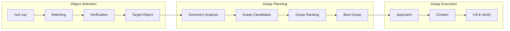

# Chapter 8: Object Selection and Grasp Planning

:::note Learning Objectives
By the end of this chapter, you will be able to:
- Implement object selection based on natural language descriptions
- Generate grasp candidates for various object geometries
- Evaluate and rank grasps using multiple criteria
- Integrate grasp planning with perception and LLM systems
- Handle grasp failures and re-planning
- Build a complete grasp planning pipeline for ROS 2
:::

## From Description to Grasp

When the LLM planner generates a step like "grasp(object='red cup')", the robot must:

1. **Select** the specific object matching the description
2. **Analyze** the object's geometry and affordances
3. **Generate** candidate grasp poses
4. **Evaluate** grasps for success likelihood
5. **Execute** the best grasp with force control



## Object Selection System

### Natural Language to Object Mapping

```python
from dataclasses import dataclass
from typing import List, Optional, Dict, Any
import numpy as np

@dataclass
class ObjectCandidate:
    """A candidate object for selection"""
    object_id: int
    class_name: str
    position: np.ndarray
    dimensions: np.ndarray  # (width, height, depth)
    orientation: np.ndarray  # quaternion
    confidence: float
    attributes: Dict[str, Any]
    match_score: float = 0.0


class ObjectSelector:
    """
    Selects target objects based on natural language descriptions

    Handles ambiguity through attribute matching and clarification
    """

    def __init__(self, perception_interface):
        self.perception = perception_interface
        self.attribute_weights = {
            'color': 0.4,
            'size': 0.2,
            'location': 0.2,
            'class': 0.2
        }

    def select_object(
        self,
        description: str,
        world_state: Dict[str, Any]
    ) -> Optional[ObjectCandidate]:
        """
        Select object matching description

        Args:
            description: Natural language like "the red cup on the left"
            world_state: Current world state with detected objects

        Returns:
            Selected ObjectCandidate or None
        """
        # Parse description for attributes
        attributes = self._parse_description(description)

        # Get candidate objects
        candidates = self._get_candidates(attributes, world_state)

        if not candidates:
            return None

        # Score candidates
        for candidate in candidates:
            candidate.match_score = self._score_match(candidate, attributes)

        # Sort by score
        candidates.sort(key=lambda c: c.match_score, reverse=True)

        # Check for ambiguity
        if len(candidates) > 1:
            if candidates[0].match_score - candidates[1].match_score < 0.2:
                # Ambiguous - might need clarification
                return self._handle_ambiguity(candidates, attributes)

        return candidates[0] if candidates[0].match_score > 0.5 else None

    def _parse_description(self, description: str) -> Dict[str, Any]:
        """Parse natural language description into attributes"""
        desc_lower = description.lower()
        attributes = {}

        # Extract color
        colors = ['red', 'blue', 'green', 'yellow', 'black', 'white', 'orange', 'pink']
        for color in colors:
            if color in desc_lower:
                attributes['color'] = color
                break

        # Extract size
        sizes = {'big': 'large', 'large': 'large', 'small': 'small', 'tiny': 'small'}
        for word, size in sizes.items():
            if word in desc_lower:
                attributes['size'] = size
                break

        # Extract location
        locations = {
            'left': 'left', 'right': 'right',
            'front': 'front', 'back': 'back',
            'center': 'center', 'middle': 'center'
        }
        for word, loc in locations.items():
            if word in desc_lower:
                attributes['location'] = loc
                break

        # Extract object class (simplified)
        object_classes = ['cup', 'mug', 'bottle', 'bowl', 'plate', 'book', 'phone', 'apple']
        for cls in object_classes:
            if cls in desc_lower:
                attributes['class'] = cls
                break

        return attributes

    def _get_candidates(
        self,
        attributes: Dict[str, Any],
        world_state: Dict[str, Any]
    ) -> List[ObjectCandidate]:
        """Get candidate objects that could match"""
        candidates = []

        for obj in world_state.get('detected_objects', []):
            # Basic class filtering
            if 'class' in attributes:
                if attributes['class'] not in obj.get('name', '').lower():
                    continue

            candidate = ObjectCandidate(
                object_id=obj['id'],
                class_name=obj['name'],
                position=np.array(obj.get('position', [0, 0, 0])),
                dimensions=np.array(obj.get('dimensions', [0.1, 0.1, 0.1])),
                orientation=np.array(obj.get('orientation', [0, 0, 0, 1])),
                confidence=obj.get('confidence', 0.5),
                attributes=obj.get('attributes', {})
            )
            candidates.append(candidate)

        return candidates

    def _score_match(
        self,
        candidate: ObjectCandidate,
        target_attributes: Dict[str, Any]
    ) -> float:
        """Score how well candidate matches target attributes"""
        score = 0.0

        # Color match
        if 'color' in target_attributes:
            if candidate.attributes.get('color') == target_attributes['color']:
                score += self.attribute_weights['color']

        # Size match
        if 'size' in target_attributes:
            obj_size = np.prod(candidate.dimensions)
            if target_attributes['size'] == 'large' and obj_size > 0.01:
                score += self.attribute_weights['size']
            elif target_attributes['size'] == 'small' and obj_size < 0.005:
                score += self.attribute_weights['size']

        # Location match
        if 'location' in target_attributes:
            pos = candidate.position
            if target_attributes['location'] == 'left' and pos[1] > 0:
                score += self.attribute_weights['location']
            elif target_attributes['location'] == 'right' and pos[1] < 0:
                score += self.attribute_weights['location']
            elif target_attributes['location'] == 'front' and pos[0] > 0:
                score += self.attribute_weights['location']

        # Class match bonus
        if 'class' in target_attributes:
            if target_attributes['class'] in candidate.class_name.lower():
                score += self.attribute_weights['class']

        # Confidence factor
        score *= candidate.confidence

        return score

    def _handle_ambiguity(
        self,
        candidates: List[ObjectCandidate],
        attributes: Dict[str, Any]
    ) -> ObjectCandidate:
        """Handle ambiguous selection"""
        # For now, return best candidate
        # In a full system, this would trigger clarification
        return candidates[0]
```

## Grasp Planning Fundamentals

### Grasp Representation

```python
@dataclass
class GraspPose:
    """Represents a grasp configuration"""
    position: np.ndarray       # 3D position of grasp center
    orientation: np.ndarray    # Quaternion orientation
    approach_direction: np.ndarray  # Direction to approach from
    grasp_width: float         # Required gripper opening
    grasp_depth: float         # How deep to grasp
    quality_score: float = 0.0
    grasp_type: str = 'parallel'  # 'parallel', 'pinch', 'power'

    def to_pose_stamped(self, frame_id: str = 'base_link'):
        """Convert to ROS PoseStamped message"""
        from geometry_msgs.msg import PoseStamped
        pose = PoseStamped()
        pose.header.frame_id = frame_id
        pose.pose.position.x = self.position[0]
        pose.pose.position.y = self.position[1]
        pose.pose.position.z = self.position[2]
        pose.pose.orientation.x = self.orientation[0]
        pose.pose.orientation.y = self.orientation[1]
        pose.pose.orientation.z = self.orientation[2]
        pose.pose.orientation.w = self.orientation[3]
        return pose


class GraspType:
    """Standard grasp types for humanoid robots"""

    @staticmethod
    def parallel_jaw(object_width: float) -> Dict:
        """Two-finger parallel grasp"""
        return {
            'type': 'parallel',
            'min_width': 0.01,
            'max_width': 0.1,
            'suitable_for': ['boxes', 'bottles', 'cups']
        }

    @staticmethod
    def pinch(object_size: float) -> Dict:
        """Precision pinch grasp"""
        return {
            'type': 'pinch',
            'min_width': 0.001,
            'max_width': 0.03,
            'suitable_for': ['pens', 'coins', 'small_items']
        }

    @staticmethod
    def power(object_size: float) -> Dict:
        """Full hand power grasp"""
        return {
            'type': 'power',
            'min_width': 0.03,
            'max_width': 0.12,
            'suitable_for': ['handles', 'cylinders', 'tools']
        }
```

### Grasp Candidate Generator

```python
class GraspCandidateGenerator:
    """
    Generates candidate grasps for detected objects

    Uses object geometry and learned heuristics
    """

    def __init__(self):
        self.gripper_width = 0.08  # Max gripper opening in meters
        self.approach_distance = 0.15  # Distance to start approach
        self.grasp_depth = 0.02  # How deep into object to grasp

    def generate_candidates(
        self,
        object_candidate: ObjectCandidate,
        point_cloud: Optional[np.ndarray] = None
    ) -> List[GraspPose]:
        """
        Generate grasp candidates for an object

        Args:
            object_candidate: Target object
            point_cloud: Optional point cloud for detailed analysis

        Returns:
            List of candidate grasps
        """
        candidates = []

        # Get object properties
        position = object_candidate.position
        dimensions = object_candidate.dimensions
        class_name = object_candidate.class_name.lower()

        # Generate grasps based on object type
        if 'cup' in class_name or 'mug' in class_name:
            candidates.extend(self._generate_cup_grasps(position, dimensions))
        elif 'bottle' in class_name:
            candidates.extend(self._generate_cylinder_grasps(position, dimensions))
        elif 'book' in class_name or 'box' in class_name:
            candidates.extend(self._generate_box_grasps(position, dimensions))
        else:
            # Generic grasps
            candidates.extend(self._generate_generic_grasps(position, dimensions))

        # If point cloud available, refine grasps
        if point_cloud is not None:
            candidates = self._refine_with_point_cloud(candidates, point_cloud)

        return candidates

    def _generate_cup_grasps(
        self,
        position: np.ndarray,
        dimensions: np.ndarray
    ) -> List[GraspPose]:
        """Generate grasps for cup-like objects"""
        grasps = []
        width, height, depth = dimensions

        # Side grasp (most common for cups)
        for angle in np.linspace(0, 2 * np.pi, 8, endpoint=False):
            grasp_pos = position.copy()
            grasp_pos[2] = position[2] + height * 0.4  # Grasp at 40% height

            # Approach from the side
            approach_dir = np.array([np.cos(angle), np.sin(angle), 0])

            # Orientation: gripper horizontal, approaching from angle
            orientation = self._orientation_from_approach(approach_dir)

            grasps.append(GraspPose(
                position=grasp_pos,
                orientation=orientation,
                approach_direction=approach_dir,
                grasp_width=width * 1.1,
                grasp_depth=self.grasp_depth,
                grasp_type='parallel'
            ))

        # Top-down grasp (for rim)
        top_grasp_pos = position.copy()
        top_grasp_pos[2] = position[2] + height - 0.01

        grasps.append(GraspPose(
            position=top_grasp_pos,
            orientation=np.array([0, 0.707, 0, 0.707]),  # Pointing down
            approach_direction=np.array([0, 0, -1]),
            grasp_width=width * 0.9,
            grasp_depth=0.03,
            grasp_type='parallel'
        ))

        return grasps

    def _generate_cylinder_grasps(
        self,
        position: np.ndarray,
        dimensions: np.ndarray
    ) -> List[GraspPose]:
        """Generate grasps for cylindrical objects (bottles)"""
        grasps = []
        width, height, depth = dimensions

        # Horizontal grasps around the cylinder
        for angle in np.linspace(0, 2 * np.pi, 8, endpoint=False):
            for height_fraction in [0.3, 0.5, 0.7]:
                grasp_pos = position.copy()
                grasp_pos[2] = position[2] + height * height_fraction

                approach_dir = np.array([np.cos(angle), np.sin(angle), 0])
                orientation = self._orientation_from_approach(approach_dir)

                grasps.append(GraspPose(
                    position=grasp_pos,
                    orientation=orientation,
                    approach_direction=approach_dir,
                    grasp_width=width * 1.1,
                    grasp_depth=self.grasp_depth,
                    grasp_type='parallel'
                ))

        return grasps

    def _generate_box_grasps(
        self,
        position: np.ndarray,
        dimensions: np.ndarray
    ) -> List[GraspPose]:
        """Generate grasps for box-like objects"""
        grasps = []
        width, height, depth = dimensions

        # Side grasps on each face
        face_directions = [
            np.array([1, 0, 0]),
            np.array([-1, 0, 0]),
            np.array([0, 1, 0]),
            np.array([0, -1, 0]),
        ]

        for approach_dir in face_directions:
            grasp_pos = position.copy()
            grasp_pos[2] = position[2] + height * 0.5

            orientation = self._orientation_from_approach(approach_dir)

            # Determine grasp width based on face
            if abs(approach_dir[0]) > 0:
                grasp_w = depth * 1.1
            else:
                grasp_w = width * 1.1

            if grasp_w < self.gripper_width:
                grasps.append(GraspPose(
                    position=grasp_pos,
                    orientation=orientation,
                    approach_direction=approach_dir,
                    grasp_width=grasp_w,
                    grasp_depth=self.grasp_depth,
                    grasp_type='parallel'
                ))

        # Top grasp
        top_pos = position.copy()
        top_pos[2] = position[2] + height

        if width < self.gripper_width:
            grasps.append(GraspPose(
                position=top_pos,
                orientation=np.array([0, 0.707, 0, 0.707]),
                approach_direction=np.array([0, 0, -1]),
                grasp_width=width * 1.1,
                grasp_depth=min(height * 0.3, 0.05),
                grasp_type='parallel'
            ))

        return grasps

    def _generate_generic_grasps(
        self,
        position: np.ndarray,
        dimensions: np.ndarray
    ) -> List[GraspPose]:
        """Generate generic grasps for unknown objects"""
        grasps = []

        # Simple approach from multiple directions
        for angle in np.linspace(0, 2 * np.pi, 6, endpoint=False):
            approach_dir = np.array([np.cos(angle), np.sin(angle), 0])
            orientation = self._orientation_from_approach(approach_dir)

            grasps.append(GraspPose(
                position=position.copy(),
                orientation=orientation,
                approach_direction=approach_dir,
                grasp_width=max(dimensions) * 1.2,
                grasp_depth=self.grasp_depth,
                grasp_type='parallel'
            ))

        return grasps

    def _orientation_from_approach(self, approach_direction: np.ndarray) -> np.ndarray:
        """Convert approach direction to gripper orientation quaternion"""
        from scipy.spatial.transform import Rotation

        # Default gripper orientation (pointing forward)
        default_approach = np.array([1, 0, 0])

        # Calculate rotation to align with approach direction
        axis = np.cross(default_approach, -approach_direction)
        if np.linalg.norm(axis) < 1e-6:
            return np.array([0, 0, 0, 1])

        axis = axis / np.linalg.norm(axis)
        angle = np.arccos(np.clip(np.dot(default_approach, -approach_direction), -1, 1))

        rotation = Rotation.from_rotvec(axis * angle)
        return rotation.as_quat()

    def _refine_with_point_cloud(
        self,
        grasps: List[GraspPose],
        point_cloud: np.ndarray
    ) -> List[GraspPose]:
        """Refine grasps using point cloud data"""
        # This would analyze the point cloud to:
        # 1. Verify grasp positions don't collide with object
        # 2. Adjust grasp widths based on actual geometry
        # 3. Find better grasp points on complex shapes
        return grasps
```

## Grasp Quality Evaluation

```python
class GraspQualityEvaluator:
    """
    Evaluates grasp quality using multiple metrics
    """

    def __init__(self):
        self.weights = {
            'reachability': 0.3,
            'collision_free': 0.25,
            'force_closure': 0.2,
            'stability': 0.15,
            'approach_clearance': 0.1
        }

    def evaluate_grasp(
        self,
        grasp: GraspPose,
        object_candidate: ObjectCandidate,
        robot_state: Dict[str, Any],
        world_state: Dict[str, Any]
    ) -> float:
        """
        Evaluate grasp quality

        Returns score between 0 and 1
        """
        scores = {}

        # Check reachability
        scores['reachability'] = self._check_reachability(
            grasp, robot_state
        )

        # Check collision
        scores['collision_free'] = self._check_collision_free(
            grasp, world_state
        )

        # Estimate force closure
        scores['force_closure'] = self._estimate_force_closure(
            grasp, object_candidate
        )

        # Check stability
        scores['stability'] = self._estimate_stability(
            grasp, object_candidate
        )

        # Check approach clearance
        scores['approach_clearance'] = self._check_approach_clearance(
            grasp, world_state
        )

        # Compute weighted sum
        total_score = sum(
            self.weights[metric] * scores[metric]
            for metric in self.weights
        )

        grasp.quality_score = total_score
        return total_score

    def _check_reachability(
        self,
        grasp: GraspPose,
        robot_state: Dict[str, Any]
    ) -> float:
        """Check if grasp is within robot's reach"""
        robot_pos = np.array(robot_state.get('position', [0, 0, 0]))
        grasp_pos = grasp.position

        # Simple distance check
        distance = np.linalg.norm(grasp_pos - robot_pos)

        max_reach = 0.8  # Robot arm length
        min_reach = 0.2  # Minimum comfortable reach

        if distance > max_reach or distance < min_reach:
            return 0.0

        # Prefer middle of reach range
        optimal_distance = (max_reach + min_reach) / 2
        return 1.0 - abs(distance - optimal_distance) / optimal_distance

    def _check_collision_free(
        self,
        grasp: GraspPose,
        world_state: Dict[str, Any]
    ) -> float:
        """Check if grasp path is collision free"""
        # Simplified: check distance to other objects
        obstacles = world_state.get('detected_objects', [])
        min_clearance = float('inf')

        for obs in obstacles:
            obs_pos = np.array(obs.get('position', [0, 0, 0]))
            distance = np.linalg.norm(grasp.position - obs_pos)
            min_clearance = min(min_clearance, distance)

        if min_clearance < 0.05:  # 5cm minimum clearance
            return 0.0

        return min(1.0, min_clearance / 0.2)

    def _estimate_force_closure(
        self,
        grasp: GraspPose,
        object_candidate: ObjectCandidate
    ) -> float:
        """Estimate force closure quality"""
        # Simplified: parallel grasps on flat surfaces are good
        width_ratio = grasp.grasp_width / object_candidate.dimensions[0]

        if width_ratio < 0.8 or width_ratio > 1.5:
            return 0.5

        return 0.8 + 0.2 * (1.0 - abs(width_ratio - 1.0))

    def _estimate_stability(
        self,
        grasp: GraspPose,
        object_candidate: ObjectCandidate
    ) -> float:
        """Estimate grasp stability"""
        # Prefer grasping near center of mass
        object_center = object_candidate.position
        grasp_center = grasp.position

        # Horizontal offset from center
        horizontal_offset = np.linalg.norm(grasp_center[:2] - object_center[:2])

        # Vertical position relative to object
        vertical_pos = (grasp_center[2] - object_center[2]) / object_candidate.dimensions[1]

        # Best stability: centered horizontally, 30-70% height
        h_score = max(0, 1.0 - horizontal_offset / 0.05)
        v_score = 1.0 - abs(vertical_pos - 0.5) * 2

        return (h_score + v_score) / 2

    def _check_approach_clearance(
        self,
        grasp: GraspPose,
        world_state: Dict[str, Any]
    ) -> float:
        """Check clearance along approach path"""
        # Check points along approach trajectory
        approach_points = []
        for t in np.linspace(0, self.approach_distance, 10):
            point = grasp.position - grasp.approach_direction * t
            approach_points.append(point)

        obstacles = world_state.get('detected_objects', [])
        min_clearance = float('inf')

        for point in approach_points:
            for obs in obstacles:
                obs_pos = np.array(obs.get('position', [0, 0, 0]))
                distance = np.linalg.norm(point - obs_pos)
                min_clearance = min(min_clearance, distance)

        if min_clearance < 0.03:
            return 0.0

        return min(1.0, min_clearance / 0.1)

    @property
    def approach_distance(self):
        return 0.15


def rank_grasps(
    grasps: List[GraspPose],
    evaluator: GraspQualityEvaluator,
    object_candidate: ObjectCandidate,
    robot_state: Dict[str, Any],
    world_state: Dict[str, Any]
) -> List[GraspPose]:
    """Rank grasps by quality score"""
    for grasp in grasps:
        evaluator.evaluate_grasp(
            grasp, object_candidate, robot_state, world_state
        )

    return sorted(grasps, key=lambda g: g.quality_score, reverse=True)
```

## Complete Grasp Planning Node

```python
#!/usr/bin/env python3
"""
Grasp Planning Node for VLA
"""

import rclpy
from rclpy.node import Node
from rclpy.action import ActionClient
from geometry_msgs.msg import PoseStamped
from std_msgs.msg import String
from moveit_msgs.action import MoveGroup
import json

class GraspPlannerNode(Node):
    """
    Grasp planning node for VLA system

    Services:
        /grasp/plan: Plan grasp for described object
        /grasp/execute: Execute planned grasp

    Publishers:
        /grasp/status: Grasp planning status
        /grasp/visualization: Visualization of planned grasps
    """

    def __init__(self):
        super().__init__('grasp_planner_node')

        # Initialize components
        self.object_selector = ObjectSelector(None)  # Inject perception
        self.grasp_generator = GraspCandidateGenerator()
        self.grasp_evaluator = GraspQualityEvaluator()

        # Current state
        self.world_state = {}
        self.robot_state = {}
        self.current_plan = None

        # Subscribers
        self.world_state_sub = self.create_subscription(
            String, '/world/state', self.world_state_callback, 10
        )

        # Publishers
        self.status_pub = self.create_publisher(String, '/grasp/status', 10)

        # Action client for MoveIt
        self.moveit_client = ActionClient(self, MoveGroup, 'move_action')

        # Service for grasp planning
        # self.plan_srv = self.create_service(
        #     GraspPlan, '/grasp/plan', self.plan_grasp_callback
        # )

        self.get_logger().info('Grasp Planner node initialized')

    def world_state_callback(self, msg: String):
        """Update world state"""
        self.world_state = json.loads(msg.data)

    async def plan_grasp(self, object_description: str) -> Optional[GraspPose]:
        """
        Plan grasp for object matching description

        Args:
            object_description: Natural language description

        Returns:
            Best grasp pose or None
        """
        self.publish_status(f"Planning grasp for: {object_description}")

        # Select target object
        target = self.object_selector.select_object(
            object_description, self.world_state
        )

        if target is None:
            self.publish_status("Object not found")
            return None

        self.publish_status(f"Selected object: {target.class_name} (ID: {target.object_id})")

        # Generate grasp candidates
        candidates = self.grasp_generator.generate_candidates(target)
        self.publish_status(f"Generated {len(candidates)} grasp candidates")

        # Rank grasps
        ranked_grasps = rank_grasps(
            candidates,
            self.grasp_evaluator,
            target,
            self.robot_state,
            self.world_state
        )

        if not ranked_grasps:
            self.publish_status("No valid grasps found")
            return None

        best_grasp = ranked_grasps[0]
        self.current_plan = {
            'target': target,
            'grasp': best_grasp,
            'alternatives': ranked_grasps[1:3]  # Keep backups
        }

        self.publish_status(
            f"Best grasp: quality={best_grasp.quality_score:.2f}, "
            f"type={best_grasp.grasp_type}"
        )

        return best_grasp

    async def execute_grasp(self) -> bool:
        """Execute the planned grasp"""
        if self.current_plan is None:
            self.publish_status("No grasp plan available")
            return False

        grasp = self.current_plan['grasp']

        # 1. Move to pre-grasp position
        pre_grasp = self._compute_pre_grasp(grasp)
        self.publish_status("Moving to pre-grasp position")

        success = await self._move_to_pose(pre_grasp)
        if not success:
            self.publish_status("Failed to reach pre-grasp position")
            return await self._try_alternative_grasp()

        # 2. Open gripper
        self.publish_status("Opening gripper")
        await self._open_gripper()

        # 3. Approach
        self.publish_status("Approaching object")
        success = await self._move_to_pose(grasp.to_pose_stamped())
        if not success:
            self.publish_status("Failed to approach object")
            return await self._try_alternative_grasp()

        # 4. Close gripper
        self.publish_status("Closing gripper")
        grasp_success = await self._close_gripper(grasp.grasp_width)

        if not grasp_success:
            self.publish_status("Grasp failed - no object detected")
            return await self._try_alternative_grasp()

        # 5. Lift
        self.publish_status("Lifting object")
        await self._lift(0.1)  # Lift 10cm

        # 6. Verify grasp
        if not await self._verify_grasp():
            self.publish_status("Object dropped during lift")
            return False

        self.publish_status("Grasp successful")
        return True

    def _compute_pre_grasp(self, grasp: GraspPose) -> PoseStamped:
        """Compute pre-grasp position (approach standoff)"""
        pre_grasp_pos = grasp.position - grasp.approach_direction * 0.1

        pose = PoseStamped()
        pose.header.frame_id = 'base_link'
        pose.pose.position.x = pre_grasp_pos[0]
        pose.pose.position.y = pre_grasp_pos[1]
        pose.pose.position.z = pre_grasp_pos[2]
        pose.pose.orientation.x = grasp.orientation[0]
        pose.pose.orientation.y = grasp.orientation[1]
        pose.pose.orientation.z = grasp.orientation[2]
        pose.pose.orientation.w = grasp.orientation[3]

        return pose

    async def _try_alternative_grasp(self) -> bool:
        """Try alternative grasp if primary fails"""
        if not self.current_plan.get('alternatives'):
            return False

        alternative = self.current_plan['alternatives'].pop(0)
        self.current_plan['grasp'] = alternative
        self.publish_status("Trying alternative grasp")
        return await self.execute_grasp()

    async def _move_to_pose(self, pose: PoseStamped) -> bool:
        """Move arm to pose using MoveIt"""
        # Simplified - actual implementation would use MoveIt action
        return True

    async def _open_gripper(self):
        """Open the gripper"""
        pass

    async def _close_gripper(self, target_width: float) -> bool:
        """Close gripper and detect object"""
        return True

    async def _lift(self, height: float):
        """Lift the arm"""
        pass

    async def _verify_grasp(self) -> bool:
        """Verify object is still in gripper"""
        return True

    def publish_status(self, status: str):
        """Publish status message"""
        msg = String()
        msg.data = status
        self.status_pub.publish(msg)
        self.get_logger().info(status)


def main(args=None):
    rclpy.init(args=args)
    node = GraspPlannerNode()
    rclpy.spin(node)
    rclpy.shutdown()


if __name__ == '__main__':
    main()
```

## Summary

In this chapter, you learned:

- How to select objects based on natural language descriptions
- Generating grasp candidates for different object geometries
- Evaluating grasp quality using multiple metrics
- Building a complete grasp planning pipeline
- Handling grasp failures with alternative strategies
- ROS 2 integration for grasp planning

## Key Takeaways

:::tip Remember
1. **Object selection is multi-attribute** - Color, size, location, and class all matter
2. **Multiple grasp candidates** provide robustness to failures
3. **Quality evaluation considers** reachability, collisions, and stability
4. **Grasp type matters** - Cups vs bottles vs boxes need different approaches
5. **Always have backup grasps** ready for recovery
:::

## Next Steps

In the next chapter, we will explore navigation planning with LLM-generated goals using Nav2.

---

## Review Questions

1. What attributes are used for object selection from descriptions?
2. How do grasp candidates differ for cups vs boxes?
3. What factors determine grasp quality score?
4. Why is approach clearance important in grasp evaluation?
5. How does the system recover from failed grasps?

## Hands-On Exercise

Build and extend the grasp planning system:

1. Add grasp generation for a new object type (e.g., tools with handles)
2. Implement a VLM-based grasp verification step
3. Add force feedback to the grasp execution
4. Create a test suite with various household objects
5. Implement grasp learning from human demonstrations

Bonus: Add support for bi-manual (two-arm) grasping for large objects.
