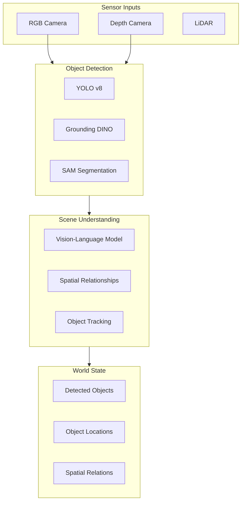

# Chapter 7: Perception Integration for VLA

:::note Learning Objectives
By the end of this chapter, you will be able to:
- Integrate object detection models into the VLA pipeline
- Build a scene understanding system using vision-language models
- Implement real-time object tracking for manipulation
- Create a world state representation for LLM planning
- Connect perception to ROS 2 topics and services
- Handle perception uncertainty in decision making
:::

## The Eyes of the Robot

Perception is the bridge between the physical world and the robot's cognitive system. For VLA to work effectively, the robot must accurately perceive and understand its environment.



## Object Detection with YOLO

YOLO (You Only Look Once) provides fast, accurate object detection:

```python
#!/usr/bin/env python3
"""
YOLO Object Detection Node for VLA
"""

import rclpy
from rclpy.node import Node
from sensor_msgs.msg import Image, CameraInfo
from vision_msgs.msg import Detection2DArray, Detection2D, ObjectHypothesisWithPose
from cv_bridge import CvBridge
from ultralytics import YOLO
import numpy as np
import cv2

class YOLODetectorNode(Node):
    """
    Object detection using YOLO v8

    Subscribers:
        /camera/image_raw: RGB camera images
        /camera/depth: Depth images
        /camera/camera_info: Camera calibration

    Publishers:
        /perception/detections: Detected objects
        /perception/annotated_image: Image with detection overlays
    """

    def __init__(self):
        super().__init__('yolo_detector_node')

        # Parameters
        self.declare_parameter('model_path', 'yolov8n.pt')
        self.declare_parameter('confidence_threshold', 0.5)
        self.declare_parameter('device', 'cuda')

        model_path = self.get_parameter('model_path').value
        self.conf_threshold = self.get_parameter('confidence_threshold').value
        device = self.get_parameter('device').value

        # Load YOLO model
        self.model = YOLO(model_path)
        self.model.to(device)
        self.get_logger().info(f'YOLO model loaded: {model_path}')

        # CV Bridge for image conversion
        self.bridge = CvBridge()

        # Camera info
        self.camera_matrix = None
        self.depth_scale = 0.001  # Convert depth to meters

        # Subscribers
        self.image_sub = self.create_subscription(
            Image,
            '/camera/image_raw',
            self.image_callback,
            10
        )

        self.depth_sub = self.create_subscription(
            Image,
            '/camera/depth',
            self.depth_callback,
            10
        )

        self.camera_info_sub = self.create_subscription(
            CameraInfo,
            '/camera/camera_info',
            self.camera_info_callback,
            10
        )

        # Publishers
        self.detection_pub = self.create_publisher(
            Detection2DArray,
            '/perception/detections',
            10
        )

        self.annotated_pub = self.create_publisher(
            Image,
            '/perception/annotated_image',
            10
        )

        # State
        self.latest_depth = None

        self.get_logger().info('YOLO Detector node initialized')

    def camera_info_callback(self, msg: CameraInfo):
        """Store camera calibration"""
        self.camera_matrix = np.array(msg.k).reshape(3, 3)

    def depth_callback(self, msg: Image):
        """Store latest depth image"""
        self.latest_depth = self.bridge.imgmsg_to_cv2(msg, desired_encoding='passthrough')

    def image_callback(self, msg: Image):
        """Process incoming image for object detection"""
        # Convert to OpenCV
        cv_image = self.bridge.imgmsg_to_cv2(msg, desired_encoding='bgr8')

        # Run YOLO detection
        results = self.model(cv_image, conf=self.conf_threshold, verbose=False)

        # Process results
        detections_msg = Detection2DArray()
        detections_msg.header = msg.header

        for result in results:
            for box in result.boxes:
                detection = self._process_detection(box, cv_image)
                if detection:
                    detections_msg.detections.append(detection)

        # Publish detections
        self.detection_pub.publish(detections_msg)

        # Publish annotated image
        annotated = results[0].plot()
        annotated_msg = self.bridge.cv2_to_imgmsg(annotated, encoding='bgr8')
        annotated_msg.header = msg.header
        self.annotated_pub.publish(annotated_msg)

        self.get_logger().debug(f'Detected {len(detections_msg.detections)} objects')

    def _process_detection(self, box, image) -> Detection2D:
        """Process single detection into ROS message"""
        detection = Detection2D()

        # Bounding box
        x1, y1, x2, y2 = box.xyxy[0].cpu().numpy()
        detection.bbox.center.position.x = (x1 + x2) / 2
        detection.bbox.center.position.y = (y1 + y2) / 2
        detection.bbox.size_x = x2 - x1
        detection.bbox.size_y = y2 - y1

        # Class and confidence
        cls_id = int(box.cls[0])
        confidence = float(box.conf[0])
        class_name = self.model.names[cls_id]

        hypothesis = ObjectHypothesisWithPose()
        hypothesis.hypothesis.class_id = class_name
        hypothesis.hypothesis.score = confidence

        # Calculate 3D position if depth available
        if self.latest_depth is not None and self.camera_matrix is not None:
            position_3d = self._calculate_3d_position(
                int((x1 + x2) / 2),
                int((y1 + y2) / 2)
            )
            if position_3d is not None:
                hypothesis.pose.pose.position.x = position_3d[0]
                hypothesis.pose.pose.position.y = position_3d[1]
                hypothesis.pose.pose.position.z = position_3d[2]

        detection.results.append(hypothesis)

        return detection

    def _calculate_3d_position(self, u, v):
        """Calculate 3D position from pixel coordinates and depth"""
        if u < 0 or u >= self.latest_depth.shape[1]:
            return None
        if v < 0 or v >= self.latest_depth.shape[0]:
            return None

        # Get depth value
        depth = self.latest_depth[v, u] * self.depth_scale
        if depth <= 0 or depth > 10.0:  # Invalid depth
            return None

        # Back-project to 3D
        fx = self.camera_matrix[0, 0]
        fy = self.camera_matrix[1, 1]
        cx = self.camera_matrix[0, 2]
        cy = self.camera_matrix[1, 2]

        x = (u - cx) * depth / fx
        y = (v - cy) * depth / fy
        z = depth

        return [x, y, z]


def main(args=None):
    rclpy.init(args=args)
    node = YOLODetectorNode()
    rclpy.spin(node)
    rclpy.shutdown()


if __name__ == '__main__':
    main()
```

## Open-Vocabulary Detection with Grounding DINO

For VLA, we need to detect objects by description, not just predefined classes:

```python
class GroundingDINODetector:
    """
    Open-vocabulary object detection using Grounding DINO

    Can detect objects based on natural language descriptions
    """

    def __init__(self, model_config: str, model_checkpoint: str, device: str = 'cuda'):
        from groundingdino.util.inference import load_model, predict

        self.model = load_model(model_config, model_checkpoint)
        self.model.to(device)
        self.device = device

        self.box_threshold = 0.35
        self.text_threshold = 0.25

    def detect_by_description(
        self,
        image: np.ndarray,
        text_prompt: str
    ) -> list:
        """
        Detect objects matching text description

        Args:
            image: BGR image as numpy array
            text_prompt: Description like "red cup" or "coffee mug"

        Returns:
            List of detections with boxes and scores
        """
        from groundingdino.util.inference import predict
        import torch
        from PIL import Image
        import torchvision.transforms as T

        # Prepare image
        transform = T.Compose([
            T.Resize(800),
            T.ToTensor(),
            T.Normalize([0.485, 0.456, 0.406], [0.229, 0.224, 0.225])
        ])

        image_pil = Image.fromarray(cv2.cvtColor(image, cv2.COLOR_BGR2RGB))
        image_tensor = transform(image_pil).unsqueeze(0).to(self.device)

        # Run detection
        boxes, logits, phrases = predict(
            model=self.model,
            image=image_tensor,
            caption=text_prompt,
            box_threshold=self.box_threshold,
            text_threshold=self.text_threshold
        )

        # Convert to detections
        detections = []
        h, w = image.shape[:2]

        for box, score, phrase in zip(boxes, logits, phrases):
            x_center, y_center, width, height = box.tolist()
            detection = {
                'bbox': {
                    'x': int(x_center * w - width * w / 2),
                    'y': int(y_center * h - height * h / 2),
                    'width': int(width * w),
                    'height': int(height * h)
                },
                'score': float(score),
                'label': phrase
            }
            detections.append(detection)

        return detections
```

## Vision-Language Understanding

For richer scene understanding, integrate vision-language models:

```python
from openai import OpenAI
import base64

class VisionLanguageSceneAnalyzer:
    """
    Scene understanding using vision-language models

    Provides rich descriptions and answers questions about scenes
    """

    def __init__(self, model: str = "gpt-4-vision-preview"):
        self.client = OpenAI()
        self.model = model

    def analyze_scene(self, image: np.ndarray) -> dict:
        """
        Analyze scene and return structured understanding

        Returns:
            {
                'objects': [{'name': str, 'location': str, 'attributes': dict}],
                'spatial_relations': [{'subject': str, 'relation': str, 'object': str}],
                'scene_description': str,
                'actionable_objects': [str]
            }
        """
        # Encode image
        _, buffer = cv2.imencode('.jpg', image)
        image_base64 = base64.b64encode(buffer).decode('utf-8')

        prompt = """
        Analyze this scene for a robot assistant. Provide:

        1. List of visible objects with their approximate locations (left, center, right, front, back)
        2. Spatial relationships between objects (on, next to, in front of, behind)
        3. Which objects could be picked up by a robot gripper
        4. Any safety concerns or obstacles

        Return as JSON:
        {
            "objects": [{"name": "cup", "location": "center-front", "color": "red", "graspable": true}],
            "spatial_relations": [{"subject": "cup", "relation": "on", "object": "table"}],
            "scene_description": "A kitchen counter with various items",
            "actionable_objects": ["cup", "apple"],
            "obstacles": ["chair blocking left side"],
            "safety_concerns": []
        }
        """

        response = self.client.chat.completions.create(
            model=self.model,
            messages=[
                {
                    "role": "user",
                    "content": [
                        {"type": "text", "text": prompt},
                        {
                            "type": "image_url",
                            "image_url": {
                                "url": f"data:image/jpeg;base64,{image_base64}"
                            }
                        }
                    ]
                }
            ],
            max_tokens=1000
        )

        import json
        return json.loads(response.choices[0].message.content)

    def find_object(self, image: np.ndarray, description: str) -> dict:
        """
        Find specific object matching description

        Args:
            image: Scene image
            description: Natural language description like "the red coffee mug"

        Returns:
            {
                'found': bool,
                'location': str,
                'confidence': float,
                'bounding_box': {'x': int, 'y': int, 'width': int, 'height': int}
            }
        """
        _, buffer = cv2.imencode('.jpg', image)
        image_base64 = base64.b64encode(buffer).decode('utf-8')

        prompt = f"""
        I'm looking for: "{description}"

        Is this object visible in the image? If yes, describe:
        1. Its location in the image (provide approximate pixel coordinates)
        2. How confident you are it matches the description
        3. Any distinguishing features

        Return JSON:
        {{
            "found": true/false,
            "location_description": "center-left of image",
            "confidence": 0.0-1.0,
            "bounding_box": {{"x": 100, "y": 200, "width": 50, "height": 80}},
            "distinguishing_features": ["red color", "handle visible"]
        }}
        """

        response = self.client.chat.completions.create(
            model=self.model,
            messages=[
                {
                    "role": "user",
                    "content": [
                        {"type": "text", "text": prompt},
                        {
                            "type": "image_url",
                            "image_url": {
                                "url": f"data:image/jpeg;base64,{image_base64}"
                            }
                        }
                    ]
                }
            ],
            max_tokens=500
        )

        import json
        return json.loads(response.choices[0].message.content)
```

## Object Tracking for Manipulation

For manipulation, objects must be tracked continuously:

```python
import cv2
from collections import deque
from dataclasses import dataclass
from typing import Optional, List, Dict

@dataclass
class TrackedObject:
    """A tracked object with history"""
    track_id: int
    class_name: str
    bbox: tuple  # (x, y, w, h)
    position_3d: Optional[np.ndarray]
    confidence: float
    velocity: np.ndarray
    history: deque  # Position history
    last_seen: float
    attributes: Dict[str, any]  # color, size, etc.


class ObjectTracker:
    """
    Multi-object tracker for manipulation tasks

    Maintains consistent object IDs across frames
    """

    def __init__(
        self,
        max_history: int = 30,
        max_age: float = 2.0,
        iou_threshold: float = 0.3
    ):
        self.tracks: Dict[int, TrackedObject] = {}
        self.next_id = 0
        self.max_history = max_history
        self.max_age = max_age
        self.iou_threshold = iou_threshold

    def update(
        self,
        detections: List[Dict],
        timestamp: float
    ) -> List[TrackedObject]:
        """
        Update tracks with new detections

        Args:
            detections: List of detection dicts with 'bbox', 'class', 'confidence'
            timestamp: Current time

        Returns:
            List of currently tracked objects
        """
        # Match detections to existing tracks
        matches, unmatched_dets, unmatched_tracks = self._match_detections(detections)

        # Update matched tracks
        for track_id, det_idx in matches:
            self._update_track(track_id, detections[det_idx], timestamp)

        # Create new tracks for unmatched detections
        for det_idx in unmatched_dets:
            self._create_track(detections[det_idx], timestamp)

        # Mark unmatched tracks as potentially lost
        for track_id in unmatched_tracks:
            if timestamp - self.tracks[track_id].last_seen > self.max_age:
                del self.tracks[track_id]

        return list(self.tracks.values())

    def _match_detections(self, detections: List[Dict]):
        """Match detections to existing tracks using IoU"""
        if not self.tracks or not detections:
            return [], list(range(len(detections))), list(self.tracks.keys())

        # Compute IoU matrix
        track_ids = list(self.tracks.keys())
        iou_matrix = np.zeros((len(track_ids), len(detections)))

        for i, track_id in enumerate(track_ids):
            track_bbox = self.tracks[track_id].bbox
            for j, det in enumerate(detections):
                iou_matrix[i, j] = self._compute_iou(track_bbox, det['bbox'])

        # Greedy matching
        matches = []
        matched_tracks = set()
        matched_dets = set()

        # Sort by IoU and match greedily
        while True:
            max_iou = iou_matrix.max()
            if max_iou < self.iou_threshold:
                break

            i, j = np.unravel_index(iou_matrix.argmax(), iou_matrix.shape)
            matches.append((track_ids[i], j))
            matched_tracks.add(track_ids[i])
            matched_dets.add(j)
            iou_matrix[i, :] = 0
            iou_matrix[:, j] = 0

        unmatched_dets = [i for i in range(len(detections)) if i not in matched_dets]
        unmatched_tracks = [t for t in track_ids if t not in matched_tracks]

        return matches, unmatched_dets, unmatched_tracks

    def _compute_iou(self, bbox1, bbox2) -> float:
        """Compute IoU between two bounding boxes"""
        x1 = max(bbox1[0], bbox2[0])
        y1 = max(bbox1[1], bbox2[1])
        x2 = min(bbox1[0] + bbox1[2], bbox2[0] + bbox2[2])
        y2 = min(bbox1[1] + bbox1[3], bbox2[1] + bbox2[3])

        intersection = max(0, x2 - x1) * max(0, y2 - y1)
        area1 = bbox1[2] * bbox1[3]
        area2 = bbox2[2] * bbox2[3]
        union = area1 + area2 - intersection

        return intersection / union if union > 0 else 0

    def _update_track(self, track_id: int, detection: Dict, timestamp: float):
        """Update existing track with new detection"""
        track = self.tracks[track_id]
        old_pos = np.array(track.bbox[:2])
        new_pos = np.array(detection['bbox'][:2])

        # Update velocity
        dt = timestamp - track.last_seen
        if dt > 0:
            track.velocity = (new_pos - old_pos) / dt

        # Update track
        track.bbox = tuple(detection['bbox'])
        track.confidence = detection['confidence']
        track.last_seen = timestamp

        if detection.get('position_3d') is not None:
            track.position_3d = np.array(detection['position_3d'])

        # Add to history
        track.history.append({
            'position': new_pos,
            'timestamp': timestamp
        })

    def _create_track(self, detection: Dict, timestamp: float):
        """Create new track from detection"""
        track = TrackedObject(
            track_id=self.next_id,
            class_name=detection.get('class', 'unknown'),
            bbox=tuple(detection['bbox']),
            position_3d=np.array(detection['position_3d']) if detection.get('position_3d') else None,
            confidence=detection['confidence'],
            velocity=np.zeros(2),
            history=deque(maxlen=self.max_history),
            last_seen=timestamp,
            attributes=detection.get('attributes', {})
        )
        track.history.append({
            'position': np.array(detection['bbox'][:2]),
            'timestamp': timestamp
        })

        self.tracks[self.next_id] = track
        self.next_id += 1

    def get_object_by_description(
        self,
        description: str,
        vlm_analyzer: VisionLanguageSceneAnalyzer = None
    ) -> Optional[TrackedObject]:
        """
        Find tracked object matching description

        Uses class name matching first, then VLM for disambiguation
        """
        # Simple class name matching
        candidates = []
        for track in self.tracks.values():
            if description.lower() in track.class_name.lower():
                candidates.append(track)

        if len(candidates) == 1:
            return candidates[0]
        elif len(candidates) == 0:
            return None

        # Multiple candidates - use attributes or VLM for disambiguation
        # Parse color from description
        colors = ['red', 'blue', 'green', 'yellow', 'black', 'white']
        for color in colors:
            if color in description.lower():
                for track in candidates:
                    if track.attributes.get('color') == color:
                        return track

        # Return highest confidence if still ambiguous
        return max(candidates, key=lambda t: t.confidence)
```

## World State Manager

The world state aggregates all perception information for the LLM planner:

```python
@dataclass
class WorldState:
    """Complete world state for planning"""
    timestamp: float
    robot_position: np.ndarray
    robot_orientation: np.ndarray
    gripper_state: str  # 'open', 'closed', 'holding'
    held_object: Optional[str]
    detected_objects: List[Dict]
    tracked_objects: List[TrackedObject]
    spatial_relations: List[Dict]
    known_locations: List[Dict]
    obstacles: List[Dict]
    humans: List[Dict]


class WorldStateManager:
    """
    Manages and updates the world state for VLA planning

    Aggregates information from multiple perception sources
    """

    def __init__(self):
        self.state = WorldState(
            timestamp=0.0,
            robot_position=np.zeros(3),
            robot_orientation=np.zeros(4),
            gripper_state='open',
            held_object=None,
            detected_objects=[],
            tracked_objects=[],
            spatial_relations=[],
            known_locations=[],
            obstacles=[],
            humans=[]
        )

        self.object_tracker = ObjectTracker()
        self.vlm_analyzer = VisionLanguageSceneAnalyzer()
        self.last_scene_analysis = None
        self.scene_analysis_interval = 2.0  # Seconds

    def update(
        self,
        detections: List[Dict],
        robot_state: Dict,
        image: Optional[np.ndarray] = None,
        timestamp: float = None
    ):
        """Update world state with new perception data"""
        if timestamp is None:
            timestamp = time.time()

        self.state.timestamp = timestamp

        # Update robot state
        self.state.robot_position = np.array(robot_state.get('position', [0, 0, 0]))
        self.state.robot_orientation = np.array(robot_state.get('orientation', [0, 0, 0, 1]))
        self.state.gripper_state = robot_state.get('gripper_state', 'open')
        self.state.held_object = robot_state.get('held_object')

        # Update object tracking
        self.state.tracked_objects = self.object_tracker.update(detections, timestamp)

        # Convert tracked objects to simple dict format
        self.state.detected_objects = [
            {
                'id': t.track_id,
                'name': t.class_name,
                'position': t.position_3d.tolist() if t.position_3d is not None else None,
                'confidence': t.confidence,
                'attributes': t.attributes
            }
            for t in self.state.tracked_objects
        ]

        # Periodic scene analysis
        if image is not None:
            if (self.last_scene_analysis is None or
                timestamp - self.last_scene_analysis > self.scene_analysis_interval):
                self._update_scene_analysis(image)
                self.last_scene_analysis = timestamp

    def _update_scene_analysis(self, image: np.ndarray):
        """Run VLM scene analysis"""
        try:
            analysis = self.vlm_analyzer.analyze_scene(image)
            self.state.spatial_relations = analysis.get('spatial_relations', [])
            self.state.obstacles = [
                {'description': obs} for obs in analysis.get('obstacles', [])
            ]
        except Exception as e:
            print(f"Scene analysis failed: {e}")

    def get_state_for_planner(self) -> Dict:
        """Get world state formatted for LLM planner"""
        return {
            'robot_location': self._describe_robot_location(),
            'gripper_state': self.state.gripper_state,
            'held_object': self.state.held_object,
            'detected_objects': self.state.detected_objects,
            'spatial_relations': self.state.spatial_relations,
            'known_locations': self.state.known_locations,
            'obstacles': self.state.obstacles,
            'timestamp': self.state.timestamp
        }

    def _describe_robot_location(self) -> str:
        """Generate human-readable robot location"""
        pos = self.state.robot_position
        # Find nearest known location
        nearest = None
        min_dist = float('inf')
        for loc in self.state.known_locations:
            dist = np.linalg.norm(pos[:2] - np.array([loc['x'], loc['y']]))
            if dist < min_dist:
                min_dist = dist
                nearest = loc

        if nearest and min_dist < 1.0:
            return f"at {nearest['name']}"
        else:
            return f"at position ({pos[0]:.1f}, {pos[1]:.1f})"

    def find_object(self, description: str) -> Optional[Dict]:
        """Find object matching description"""
        track = self.object_tracker.get_object_by_description(description)
        if track:
            return {
                'id': track.track_id,
                'name': track.class_name,
                'position': track.position_3d.tolist() if track.position_3d is not None else None,
                'bbox': track.bbox
            }
        return None
```

## ROS 2 Perception Integration Node

```python
#!/usr/bin/env python3
"""
Integrated Perception Node for VLA
"""

import rclpy
from rclpy.node import Node
from sensor_msgs.msg import Image, CameraInfo
from geometry_msgs.msg import PoseStamped
from std_msgs.msg import String
from vision_msgs.msg import Detection2DArray
from cv_bridge import CvBridge
import json

class PerceptionIntegrationNode(Node):
    """
    Integrates all perception components for VLA

    Subscribers:
        /camera/image_raw: RGB images
        /camera/depth: Depth images
        /perception/detections: YOLO detections
        /robot/pose: Robot position

    Publishers:
        /world/state: Complete world state
        /perception/scene_analysis: VLM analysis results

    Services:
        /perception/find_object: Find object by description
    """

    def __init__(self):
        super().__init__('perception_integration_node')

        # Initialize components
        self.bridge = CvBridge()
        self.world_state = WorldStateManager()
        self.grounding_dino = None  # Lazy load

        # Parameters
        self.declare_parameter('enable_vlm', True)
        self.declare_parameter('vlm_interval', 2.0)

        # Subscribers
        self.image_sub = self.create_subscription(
            Image, '/camera/image_raw', self.image_callback, 10
        )

        self.depth_sub = self.create_subscription(
            Image, '/camera/depth', self.depth_callback, 10
        )

        self.detection_sub = self.create_subscription(
            Detection2DArray, '/perception/detections', self.detection_callback, 10
        )

        self.pose_sub = self.create_subscription(
            PoseStamped, '/robot/pose', self.pose_callback, 10
        )

        # Publishers
        self.world_state_pub = self.create_publisher(
            String, '/world/state', 10
        )

        self.scene_analysis_pub = self.create_publisher(
            String, '/perception/scene_analysis', 10
        )

        # Services
        self.find_object_srv = self.create_service(
            # Custom service type
            FindObject, '/perception/find_object', self.find_object_callback
        )

        # State
        self.latest_image = None
        self.latest_depth = None
        self.latest_detections = []
        self.robot_state = {}

        # Timer for world state publishing
        self.create_timer(0.1, self.publish_world_state)

        self.get_logger().info('Perception Integration node initialized')

    def image_callback(self, msg: Image):
        """Store latest image"""
        self.latest_image = self.bridge.imgmsg_to_cv2(msg, 'bgr8')

    def depth_callback(self, msg: Image):
        """Store latest depth"""
        self.latest_depth = self.bridge.imgmsg_to_cv2(msg, 'passthrough')

    def detection_callback(self, msg: Detection2DArray):
        """Process incoming detections"""
        detections = []
        for det in msg.detections:
            if det.results:
                result = det.results[0]
                detection = {
                    'bbox': (
                        int(det.bbox.center.position.x - det.bbox.size_x / 2),
                        int(det.bbox.center.position.y - det.bbox.size_y / 2),
                        int(det.bbox.size_x),
                        int(det.bbox.size_y)
                    ),
                    'class': result.hypothesis.class_id,
                    'confidence': result.hypothesis.score,
                    'position_3d': [
                        result.pose.pose.position.x,
                        result.pose.pose.position.y,
                        result.pose.pose.position.z
                    ] if result.pose.pose.position.z != 0 else None
                }
                detections.append(detection)

        self.latest_detections = detections

    def pose_callback(self, msg: PoseStamped):
        """Update robot state"""
        self.robot_state['position'] = [
            msg.pose.position.x,
            msg.pose.position.y,
            msg.pose.position.z
        ]
        self.robot_state['orientation'] = [
            msg.pose.orientation.x,
            msg.pose.orientation.y,
            msg.pose.orientation.z,
            msg.pose.orientation.w
        ]

    def publish_world_state(self):
        """Periodically publish world state"""
        # Update world state
        self.world_state.update(
            detections=self.latest_detections,
            robot_state=self.robot_state,
            image=self.latest_image
        )

        # Publish
        state = self.world_state.get_state_for_planner()
        msg = String()
        msg.data = json.dumps(state)
        self.world_state_pub.publish(msg)

    def find_object_callback(self, request, response):
        """Service callback to find object by description"""
        description = request.description

        # Try tracker first
        result = self.world_state.find_object(description)

        if result:
            response.found = True
            response.object_id = result['id']
            if result['position']:
                response.position = result['position']
        else:
            # Fall back to VLM search
            if self.latest_image is not None:
                vlm_result = self.world_state.vlm_analyzer.find_object(
                    self.latest_image, description
                )
                response.found = vlm_result.get('found', False)
                if response.found:
                    response.confidence = vlm_result.get('confidence', 0.0)

        return response


def main(args=None):
    rclpy.init(args=args)
    node = PerceptionIntegrationNode()
    rclpy.spin(node)
    rclpy.shutdown()


if __name__ == '__main__':
    main()
```

## Summary

In this chapter, you learned:

- How to integrate YOLO for real-time object detection
- Using Grounding DINO for open-vocabulary detection
- Vision-language models for rich scene understanding
- Multi-object tracking for manipulation tasks
- Building a comprehensive world state manager
- ROS 2 integration for perception systems

## Key Takeaways

:::tip Remember
1. **Multiple detection methods** - Use YOLO for speed, VLMs for understanding
2. **Object tracking is essential** for manipulation - maintain consistent IDs
3. **3D position is critical** - combine RGB-D for spatial awareness
4. **World state aggregation** provides context for LLM planning
5. **Open-vocabulary detection** enables flexible natural language interaction
:::

## Next Steps

In the next chapter, we will explore how to use perception information for object selection and manipulation planning.

---

## Review Questions

1. What are the advantages of using YOLO vs Grounding DINO for object detection?
2. How does the object tracker maintain consistent IDs across frames?
3. What information does the VLM scene analyzer provide that traditional detection cannot?
4. Why is 3D position estimation important for manipulation?
5. How does the world state manager integrate multiple perception sources?

## Hands-On Exercise

Build and extend the perception system:

1. Add color attribute extraction to the YOLO detector
2. Implement a "memory" feature that remembers objects even when not visible
3. Create a test that verifies tracking accuracy with moving objects
4. Add occlusion handling to the tracker
5. Implement a confidence-weighted fusion of YOLO and VLM detections

Bonus: Add support for detecting object states (e.g., "cup is empty", "door is open").
